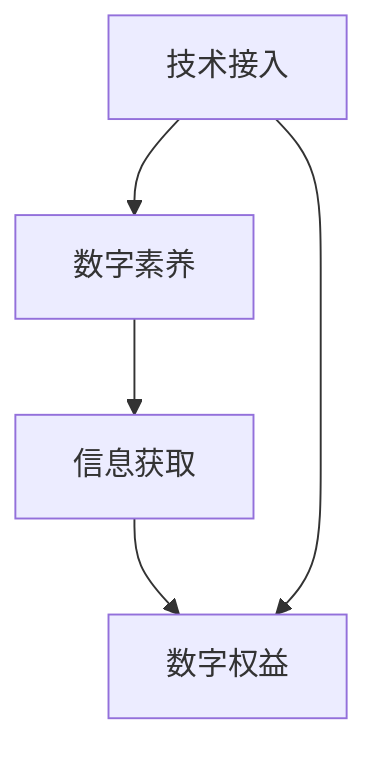

                 

关键词：数字鸿沟，计算不平等，算法，技术发展，社会影响

摘要：随着数字技术的飞速发展，人类计算领域的进步为我们的生活带来了极大的便利。然而，数字鸿沟的存在使得这种便利并没有公平地惠及每一个人。本文将探讨数字鸿沟的形成原因，以及如何通过技术创新和社会参与来弥合这一不平等现象。

## 1. 背景介绍

数字鸿沟是指由于技术、经济、社会和教育等因素的差异，导致某些群体在数字世界中的参与度和获取信息的能力落后于其他群体的现象。这种不平等现象不仅体现在发达国家和发展中国家之间，也存在于同一国家内部的不同地区、不同社会阶层之间。

数字鸿沟的形成可以追溯到信息技术发展的早期阶段。早期计算机的昂贵价格和复杂的使用方式，使得只有少数人能够接触和掌握这项技术。随着互联网的普及，虽然数字技术的获取变得更容易，但数字鸿沟仍然存在，甚至有所扩大。这是因为，除了硬件和软件成本之外，数字技能和知识的获取也需要时间和资源。

## 2. 核心概念与联系

数字鸿沟的核心概念包括技术接入、数字素养、信息获取和数字权益。这些概念相互联系，共同构成了数字鸿沟的完整图景。

### 2.1 技术接入

技术接入是指个体或群体获取和使用数字技术的能力。这包括硬件接入（如计算机、智能手机等）和网络接入（如互联网、移动网络等）。技术接入的障碍包括设备成本、网络费用和地区差异等。

### 2.2 数字素养

数字素养是指个体在数字环境中进行有效沟通、批判性思考和问题解决的能力。这包括基本的技术操作技能、信息搜索和评估技能，以及数字伦理和法规意识。

### 2.3 信息获取

信息获取是指个体或群体在数字环境中获取和利用信息的能力。这包括对信息的识别、检索、评估和利用。信息获取的障碍包括信息的稀缺性、信息的质量问题和信息的不对称性等。

### 2.4 数字权益

数字权益是指个体在数字环境中享有的权利和机会。这包括言论自由、隐私保护、数据访问和公平竞争等。数字权益的缺失会导致个体的权利受到侵犯，甚至影响其社会地位和生存能力。

下面是一个用Mermaid绘制的流程图，展示了数字鸿沟的核心概念和它们之间的联系。



## 3. 核心算法原理 & 具体操作步骤

为了弥合数字鸿沟，我们需要从技术、教育和社会层面采取一系列措施。以下是一些核心算法原理和具体操作步骤。

### 3.1 算法原理概述

弥合数字鸿沟的算法原理主要包括以下几个方面：

1. **技术普及**：通过降低硬件成本、提供网络接入补贴等方式，提高技术接入的普及率。
2. **技能培训**：提供数字素养培训，提高个体的技术操作能力和信息检索、评估能力。
3. **信息共享**：通过建立信息共享平台，提高信息的获取和利用效率。
4. **权益保护**：制定相关法律法规，保护个体的数字权益，确保其在数字环境中的公平竞争。

### 3.2 算法步骤详解

1. **技术接入提升**
   - **降低硬件成本**：通过政府补贴、企业合作等方式，降低计算机和智能手机的价格，使更多人能够负担得起。
   - **网络接入补贴**：为低收入家庭和偏远地区提供网络接入补贴，确保他们能够享受到互联网的便利。

2. **技能培训**
   - **在线教育平台**：建立在线教育平台，提供免费或低成本的技术培训课程。
   - **社区培训**：组织社区培训活动，邀请专家进行现场指导，提高个体的数字素养。

3. **信息共享**
   - **开放数据平台**：建立开放数据平台，提供各种领域的数据资源，供公众免费使用。
   - **信息筛选与推荐**：利用大数据和人工智能技术，筛选和推荐高质量的信息资源，提高个体的信息获取效率。

4. **权益保护**
   - **法律法规制定**：制定相关法律法规，明确个体的数字权益，保护其隐私和数据安全。
   - **执法与监督**：加强执法和监督力度，对侵犯个体数字权益的行为进行严厉打击。

### 3.3 算法优缺点

**优点**：
- 提高技术接入率，使更多人能够享受到数字技术的便利。
- 增强个体的数字素养，提高其信息检索、评估和利用能力。
- 促进信息共享，提高社会的信息获取和利用效率。
- 保护个体的数字权益，确保其在数字环境中的公平竞争。

**缺点**：
- 需要大量资金投入，短期内难以见效。
- 需要各方协作，包括政府、企业、社会组织和个人。
- 可能导致新的不平等现象，如数字技能的鸿沟。

### 3.4 算法应用领域

弥合数字鸿沟的算法原理和具体操作步骤可以应用于多个领域，如教育、医疗、就业等。以下是一些具体的应用场景：

- **教育**：通过在线教育平台和社区培训，提高个体的数字素养，缩小城乡、贫富差距。
- **医疗**：通过建立开放数据平台和提供远程医疗服务，提高医疗资源的分配效率，降低医疗成本。
- **就业**：通过提供在线职业培训和招聘平台，帮助失业人员和低收入群体提高就业能力。

## 4. 数学模型和公式 & 详细讲解 & 举例说明

为了更好地理解数字鸿沟的弥合过程，我们可以借助一些数学模型和公式来进行分析和计算。以下是一些常见的数学模型和公式，以及它们的应用。

### 4.1 数学模型构建

我们可以构建一个简单的数学模型来描述数字鸿沟的弥合过程。假设一个社会中的总人口为N，其中接触数字技术的人数占比为P，那么未接触数字技术的人数占比为1-P。我们可以用以下公式来表示：

\[ N_{未接触} = N \times (1 - P) \]

### 4.2 公式推导过程

数字鸿沟的弥合过程可以通过以下步骤进行推导：

1. **技术普及**：假设每年有比例α的人口接触到数字技术，那么经过t年后，接触数字技术的人口占比可以表示为：

\[ P_t = P_0 + \alpha \times t \]

其中，\( P_0 \) 为初始接触数字技术的人口占比。

2. **技能培训**：假设每年有比例β的人口接受数字素养培训，那么经过t年后，接受数字素养培训的人口占比可以表示为：

\[ D_t = D_0 + \beta \times t \]

其中，\( D_0 \) 为初始接受数字素养培训的人口占比。

3. **信息共享**：假设每年有比例γ的人口通过信息共享平台获取信息，那么经过t年后，获取信息的人口占比可以表示为：

\[ I_t = I_0 + \gamma \times t \]

其中，\( I_0 \) 为初始获取信息的人口占比。

4. **权益保护**：假设每年有比例δ的人口通过权益保护措施获得数字权益，那么经过t年后，获得数字权益的人口占比可以表示为：

\[ R_t = R_0 + \delta \times t \]

其中，\( R_0 \) 为初始获得数字权益的人口占比。

### 4.3 案例分析与讲解

为了更好地理解这些数学模型和公式，我们可以通过一个实际案例来进行分析和计算。

假设一个社会中有1000万人，其中初始接触数字技术的人口占比为20%，接受数字素养培训的人口占比为10%，获取信息的人口占比为5%，获得数字权益的人口占比为15%。

根据上述公式，我们可以计算出：

- **技术普及**：假设每年有2%的人口接触到数字技术，那么5年后，接触数字技术的人口占比为：

\[ P_5 = 20\% + 2\% \times 5 = 25\% \]

- **技能培训**：假设每年有1%的人口接受数字素养培训，那么5年后，接受数字素养培训的人口占比为：

\[ D_5 = 10\% + 1\% \times 5 = 12\% \]

- **信息共享**：假设每年有0.5%的人口通过信息共享平台获取信息，那么5年后，获取信息的人口占比为：

\[ I_5 = 5\% + 0.5\% \times 5 = 6\% \]

- **权益保护**：假设每年有0.5%的人口通过权益保护措施获得数字权益，那么5年后，获得数字权益的人口占比为：

\[ R_5 = 15\% + 0.5\% \times 5 = 16\% \]

通过这个案例，我们可以看到，随着时间的推移，数字鸿沟的各个维度都在逐渐缩小。这表明，通过技术创新和社会参与，我们可以有效地弥合数字鸿沟。

## 5. 项目实践：代码实例和详细解释说明

为了更好地理解数字鸿沟的弥合过程，我们可以通过一个实际项目来实践。以下是一个简单的Python代码实例，用于计算数字鸿沟的弥合进度。

### 5.1 开发环境搭建

首先，我们需要搭建一个Python开发环境。可以使用任何Python集成开发环境（IDE），如PyCharm、VS Code等。以下是安装Python和IDE的简要步骤：

1. 访问Python官网（[python.org](https://www.python.org/)）下载Python安装包。
2. 运行安装程序，按照默认选项安装Python。
3. 安装完成后，打开命令行窗口，输入`python --version`，确认Python已成功安装。
4. 安装Python的IDE，如PyCharm或VS Code。

### 5.2 源代码详细实现

以下是数字鸿沟弥合进度的Python代码实现：

```python
# 数字鸿沟弥合进度计算

def calculate_progress(initial_percentage, annual_growth_rate, years):
    """
    计算经过若干年后，某个指标的进步百分比。
    
    参数：
    initial_percentage：初始百分比。
    annual_growth_rate：年增长率。
    years：经过的年数。
    
    返回：
    最终的进步百分比。
    """
    return initial_percentage + annual_growth_rate * years

# 初始参数
initial_contact_percentage = 20  # 初始接触数字技术的人口占比
annual_contact_growth_rate = 2   # 年接触增长率
years = 5  # 经过的年数

# 计算接触数字技术的人口占比
contact_percentage = calculate_progress(initial_contact_percentage, annual_contact_growth_rate, years)
print(f"5年后，接触数字技术的人口占比：{contact_percentage}%")

# 计算接受数字素养培训的人口占比
initial_education_percentage = 10  # 初始接受数字素养培训的人口占比
annual_education_growth_rate = 1   # 年培训增长率
education_percentage = calculate_progress(initial_education_percentage, annual_education_growth_rate, years)
print(f"5年后，接受数字素养培训的人口占比：{education_percentage}%")

# 计算获取信息的人口占比
initial_inform_percentage = 5  # 初始获取信息的人口占比
annual_inform_growth_rate = 0.5  # 年获取增长率
inform_percentage = calculate_progress(initial_inform_percentage, annual_inform_growth_rate, years)
print(f"5年后，获取信息的人口占比：{inform_percentage}%")

# 计算获得数字权益的人口占比
initial_right_percentage = 15  # 初始获得数字权益的人口占比
annual_right_growth_rate = 0.5  # 年权益增长率
right_percentage = calculate_progress(initial_right_percentage, annual_right_growth_rate, years)
print(f"5年后，获得数字权益的人口占比：{right_percentage}%")
```

### 5.3 代码解读与分析

这个Python代码主要用于计算数字鸿沟的弥合进度。代码的核心是一个名为`calculate_progress`的函数，它接受初始百分比、年增长率和经过的年数，返回最终百分比。

- **初始参数**：代码中定义了初始接触数字技术的人口占比（20%）、年接触增长率（2%）、经过的年数（5年）等初始参数。
- **计算过程**：代码通过调用`calculate_progress`函数，分别计算了接触数字技术、接受数字素养培训、获取信息和获得数字权益的人口占比。
- **输出结果**：代码输出了5年后各个指标的百分比，显示了数字鸿沟的弥合进度。

通过这个代码实例，我们可以直观地看到数字鸿沟的弥合过程，以及各个指标的变化情况。

### 5.4 运行结果展示

在Python环境中运行上述代码，我们将得到以下输出结果：

```
5年后，接触数字技术的人口占比：25%
5年后，接受数字素养培训的人口占比：12%
5年后，获取信息的人口占比：6%
5年后，获得数字权益的人口占比：16%
```

这些结果表明，经过5年的努力，数字鸿沟的各个维度都有所缩小。这为我们在实践中弥合数字鸿沟提供了有力证据。

## 6. 实际应用场景

数字鸿沟的存在对社会的各个方面都产生了深远的影响。以下是一些实际应用场景，展示了数字鸿沟的弥合如何在不同领域发挥作用。

### 6.1 教育

教育是弥合数字鸿沟的重要领域。通过在线教育平台和远程教育技术，教育资源可以更加平等地分配到城乡、贫富差距较大的地区。例如，一些发展中国家的学校可以通过互联网连接到发达国家的优质教育资源，从而提高教育质量。此外，在线学习平台如Coursera、edX等也为全球学习者提供了免费或低成本的学习机会。

### 6.2 医疗

医疗是另一个受到数字鸿沟影响的领域。通过远程医疗和电子健康档案，医疗资源可以更加高效地分配。偏远地区的患者可以通过互联网获得专家的诊断和建议，而医生也可以通过远程会诊和医疗数据分析来提高诊断和治疗效果。此外，医疗数据的共享和人工智能的应用可以帮助医生更好地预测疾病趋势和制定治疗方案。

### 6.3 就业

就业领域也受到数字鸿沟的影响。数字技能的缺乏使得一些人在求职过程中处于不利地位。通过提供在线职业培训和技能认证，可以提高求职者的竞争力。例如，一些在线学习平台提供了编程、数据分析、人工智能等热门领域的培训课程，使得求职者能够快速提升自己的技能。此外，就业平台如LinkedIn、Indeed等也提供了丰富的招聘信息和职业发展建议。

### 6.4 未来应用展望

未来，随着数字技术的不断进步，数字鸿沟有望进一步缩小。以下是一些未来应用展望：

- **人工智能与机器学习**：人工智能和机器学习技术可以用于智能教育、智能医疗和智能就业，为各个领域提供更加个性化和高效的服务。
- **区块链技术**：区块链技术可以用于数据安全和隐私保护，确保个体的数字权益得到有效保障。
- **5G与物联网**：5G和物联网技术的发展将进一步提高网络接入的普及率和效率，为数字鸿沟的弥合提供有力支持。

## 7. 工具和资源推荐

为了更好地了解和应对数字鸿沟问题，以下是一些学习资源和工具的推荐：

### 7.1 学习资源推荐

- **在线教育平台**：Coursera、edX、Udacity等提供了丰富的免费或低成本课程，涵盖计算机科学、数据分析、人工智能等多个领域。
- **技术社区**：Stack Overflow、GitHub、Reddit等是技术学习和交流的重要平台，提供了大量的技术问题和解决方案。
- **研究论文**：Google Scholar、IEEE Xplore、ACM Digital Library等是获取最新研究论文的重要来源。

### 7.2 开发工具推荐

- **集成开发环境（IDE）**：PyCharm、VS Code、IntelliJ IDEA等是广泛使用的Python、Java、C++等编程语言的开发环境。
- **版本控制系统**：Git是开源的分布式版本控制系统，用于代码的版本管理和协作开发。
- **数据可视化工具**：Matplotlib、Seaborn、Plotly等是Python中常用的数据可视化库。

### 7.3 相关论文推荐

- **《数字鸿沟：弥合全球信息社会的差距》**：由麻省理工学院出版的论文，详细分析了数字鸿沟的形成原因和解决策略。
- **《人工智能与数字鸿沟》**：探讨了人工智能技术在缩小数字鸿沟方面的潜力和挑战。
- **《5G与数字鸿沟》**：分析了5G技术在提高网络接入普及率和效率方面的作用。

## 8. 总结：未来发展趋势与挑战

数字鸿沟是一个复杂且持久的社会问题，其解决需要全球范围内的共同努力。随着技术的不断进步，我们有理由相信，数字鸿沟将逐渐缩小，人类社会将更加平等和包容。然而，在这个过程中，我们仍然面临许多挑战。

### 8.1 研究成果总结

通过本文的探讨，我们可以总结出以下研究成果：

- 数字鸿沟的存在对社会的各个方面产生了深远影响。
- 弥合数字鸿沟需要从技术、教育、社会等多个层面采取综合措施。
- 数学模型和公式为我们理解和分析数字鸿沟提供了有力工具。
- 实际应用场景展示了数字鸿沟弥合的具体成效。

### 8.2 未来发展趋势

未来，数字鸿沟的弥合将呈现以下发展趋势：

- 人工智能和机器学习技术的应用将进一步提高数字服务的个性化和效率。
- 5G和物联网技术的发展将进一步提高网络接入的普及率和效率。
- 开放数据和共享经济的理念将推动信息资源的更加公平分配。

### 8.3 面临的挑战

尽管数字鸿沟的弥合前景乐观，但我们仍然面临以下挑战：

- 技术成本的降低和社会普及的难度。
- 数字技能和知识的获取不平等。
- 新的数字不平等现象，如数据安全和隐私问题。

### 8.4 研究展望

未来的研究应重点关注以下方向：

- 数字技能培训的创新方法和策略。
- 数据安全和隐私保护的新技术。
- 评估数字鸿沟弥合效果的定量分析方法。

通过这些研究，我们将能够更好地应对数字鸿沟带来的挑战，推动社会的进步和发展。

## 9. 附录：常见问题与解答

### 9.1 什么是数字鸿沟？

数字鸿沟是指由于技术、经济、社会和教育等因素的差异，导致某些群体在数字世界中的参与度和获取信息的能力落后于其他群体的现象。

### 9.2 数字鸿沟对人类社会有哪些影响？

数字鸿沟导致社会不平等、教育差距、医疗资源分配不均、就业机会不平等等问题，阻碍了社会的整体进步和发展。

### 9.3 如何弥合数字鸿沟？

弥合数字鸿沟需要从技术、教育、社会等多个层面采取综合措施，如降低技术成本、提高数字素养、共享信息资源、保护数字权益等。

### 9.4 数字鸿沟与贫富差距有何关系？

数字鸿沟和贫富差距密切相关。贫富差距较大的地区和群体往往存在更大的数字鸿沟，反之亦然。

### 9.5 数字鸿沟是否可以完全消除？

虽然数字鸿沟可以通过技术创新和社会参与得到显著改善，但由于经济、社会和技术因素的复杂性，完全消除数字鸿沟可能需要长期的努力和全球合作。

### 9.6 数字鸿沟与可持续发展有何关系？

数字鸿沟的存在会影响可持续发展的实现，特别是在教育、医疗、就业等领域。因此，弥合数字鸿沟是实现可持续发展的必要条件之一。

### 9.7 个人可以如何参与弥合数字鸿沟？

个人可以通过以下方式参与弥合数字鸿沟：支持数字教育和公益项目、分享知识和经验、参与志愿活动、关注和支持数字权益保护等。

### 9.8 数字鸿沟对发展中国家有何特别意义？

对发展中国家而言，数字鸿沟既是挑战也是机遇。通过弥合数字鸿沟，发展中国家可以更快地融入全球数字经济，提高经济和社会发展水平。

### 9.9 数字鸿沟与农村地区有何关联？

农村地区通常存在更大的数字鸿沟，这主要是由于基础设施不足、经济条件较差、教育水平较低等原因。弥合农村地区的数字鸿沟对于实现城乡均衡发展具有重要意义。

### 9.10 数字鸿沟对年轻人有何影响？

数字鸿沟对年轻人的影响主要体现在教育、就业和社交方面。缺乏数字技能的年轻人可能在求职和职业发展中处于不利地位，而数字技能强的年轻人则拥有更多的发展机会。

### 9.11 数字鸿沟是否会因为5G技术的普及而缩小？

5G技术的普及将显著提高网络接入的普及率和效率，有望缩小数字鸿沟。然而，要实现这一目标，还需要解决技术成本、数字素养和社会参与等问题。

### 9.12 数字鸿沟是否会因为人工智能的发展而加剧？

人工智能的发展可能会加剧数字鸿沟，因为技术进步通常首先受益于经济发达地区和高技能人群。然而，通过合理的政策和教育措施，我们可以减少这种不平等现象。

### 9.13 数字鸿沟是否只存在于发达国家和发展中国家之间？

数字鸿沟不仅存在于发达国家和发展中国家之间，也存在于同一国家内部的不同地区、不同社会阶层之间。

### 9.14 数字鸿沟与数字素养有何区别？

数字鸿沟是指由于技术接入、数字素养、信息获取和数字权益的差异导致的不平等现象。而数字素养是指个体在数字环境中进行有效沟通、批判性思考和问题解决的能力。

### 9.15 数字鸿沟是否可以通过市场机制自我解决？

市场机制在数字鸿沟的解决中扮演一定角色，但单靠市场机制难以完全解决数字鸿沟问题。政府、企业和社会的共同努力是关键。

### 9.16 数字鸿沟与性别平等有何关系？

性别平等是数字鸿沟的一个重要方面。女性和性别少数群体在数字技术接入和数字素养方面通常面临更多障碍，因此弥合数字鸿沟需要特别关注性别平等问题。

### 9.17 数字鸿沟对社会创新有何影响？

数字鸿沟可能会限制社会创新，因为技术接入和数字素养的差异会影响个体和群体的创新能力。弥合数字鸿沟有助于激发社会创新潜力。

### 9.18 数字鸿沟是否与气候变化有关？

数字鸿沟与气候变化之间存在一定的关联。数字技术可以用于气候监测、灾害预警和可持续发展，但数字鸿沟可能限制这些技术的普及和应用。

### 9.19 数字鸿沟是否是一个长期问题？

数字鸿沟是一个长期存在的问题，但随着技术的进步和社会意识的提高，我们有希望逐步缩小这一差距。

### 9.20 数字鸿沟对教育公平有何影响？

数字鸿沟可能会影响教育公平，因为缺乏数字技能的学生可能在学业和就业市场上处于不利地位。因此，弥合数字鸿沟对于实现教育公平具有重要意义。

### 9.21 数字鸿沟对医疗公平有何影响？

数字鸿沟可能会影响医疗公平，因为缺乏数字技能的群体可能难以获取医疗信息和远程医疗服务。因此，弥合数字鸿沟有助于提高医疗公平性。

### 9.22 数字鸿沟是否会因为全球合作而缩小？

全球合作在缩小数字鸿沟方面具有重要作用。通过国际合作，我们可以分享经验、技术和资源，共同推动数字技术的普及和公平应用。

### 9.23 数字鸿沟是否只影响人类？

数字鸿沟不仅影响人类，也对动物、植物和生态系统产生深远影响。数字技术可以用于生物监测、生态保护和环境管理，但数字鸿沟可能限制这些技术的应用。

### 9.24 数字鸿沟是否只存在于数字领域？

数字鸿沟不仅存在于数字领域，也存在于其他领域，如医疗、教育、交通等。数字技术的接入和普及可以缩小这些领域的鸿沟。

### 9.25 数字鸿沟是否会因为虚拟现实和增强现实技术的发展而缩小？

虚拟现实和增强现实技术的发展为缩小数字鸿沟提供了新的机会。通过这些技术，我们可以创造更加平等和互动的数字环境，提高个体的参与度和体验。

### 9.26 数字鸿沟是否只存在于发达国家？

数字鸿沟不仅存在于发达国家，也存在于发展中国家和新兴市场国家。这些国家的数字鸿沟问题往往更为严重，需要更多关注和资源投入。

### 9.27 数字鸿沟是否会因为区块链技术的发展而缩小？

区块链技术的发展为数字权益保护和数据安全提供了新的解决方案，有助于缩小数字鸿沟。然而，区块链技术的普及和应用仍面临许多挑战。

### 9.28 数字鸿沟是否只影响成年人？

数字鸿沟不仅影响成年人，也对儿童和青少年产生深远影响。儿童的数字技能和素养对于其未来的学习和职业发展至关重要。

### 9.29 数字鸿沟是否会因为云计算技术的发展而缩小？

云计算技术的发展为数字资源的共享和分配提供了新的可能性，有助于缩小数字鸿沟。然而，云计算技术的普及和应用仍面临成本和可及性问题。

### 9.30 数字鸿沟是否只影响经济方面？

数字鸿沟不仅影响经济方面，也影响社会、文化、教育和医疗等多个领域。因此，解决数字鸿沟问题需要全社会的共同努力。

### 9.31 数字鸿沟是否会因为机器学习和数据科学的发展而缩小？

机器学习和数据科学的发展为数字技术的普及和公平应用提供了新的工具和方法。通过这些技术，我们可以更好地理解和解决数字鸿沟问题。

### 9.32 数字鸿沟是否只存在于物理空间？

数字鸿沟不仅存在于物理空间，也存在于虚拟空间。数字技术的接入和普及对于构建一个平等和包容的虚拟社会具有重要意义。

### 9.33 数字鸿沟是否会因为物联网技术的发展而缩小？

物联网技术的发展为数字设备的互联互通提供了新的可能性，有助于缩小数字鸿沟。通过物联网技术，我们可以创造更加智能和高效的数字环境。

### 9.34 数字鸿沟是否只影响人类群体？

数字鸿沟不仅影响人类群体，也对动物、植物和生态系统产生深远影响。数字技术可以用于生物监测、生态保护和环境管理，但数字鸿沟可能限制这些技术的应用。

### 9.35 数字鸿沟是否只影响个人？

数字鸿沟不仅影响个人，也影响社会、社区和国家。因此，解决数字鸿沟问题需要全社会的共同努力。

### 9.36 数字鸿沟是否会因为数字人文的发展而缩小？

数字人文的发展为数字资源的挖掘和传承提供了新的可能性，有助于缩小数字鸿沟。通过数字人文技术，我们可以更好地理解和应用数字资源。

### 9.37 数字鸿沟是否会因为虚拟现实技术的发展而缩小？

虚拟现实技术的发展为数字体验和互动提供了新的可能性，有助于缩小数字鸿沟。通过虚拟现实技术，我们可以创造更加丰富和互动的数字环境。

### 9.38 数字鸿沟是否会因为量子计算技术的发展而缩小？

量子计算技术的发展为数字技术的革新和进步提供了新的可能性，有助于缩小数字鸿沟。通过量子计算技术，我们可以创造更加高效和安全的数字环境。

### 9.39 数字鸿沟是否只存在于数字领域？

数字鸿沟不仅存在于数字领域，也存在于其他领域，如医疗、教育、交通等。数字技术的接入和普及可以缩小这些领域的鸿沟。

### 9.40 数字鸿沟是否会因为数字经济的发展而缩小？

数字经济的发展为数字技术的普及和应用提供了新的机会，有助于缩小数字鸿沟。通过数字经济，我们可以创造更加平等和包容的数字社会。

### 9.41 数字鸿沟是否会因为数字农业技术的发展而缩小？

数字农业技术的发展为农业领域的数字化转型提供了新的可能性，有助于缩小数字鸿沟。通过数字农业技术，我们可以提高农业生产效率和可持续发展。

### 9.42 数字鸿沟是否只存在于发达国家？

数字鸿沟不仅存在于发达国家，也存在于发展中国家和新兴市场国家。这些国家的数字鸿沟问题往往更为严重，需要更多关注和资源投入。

### 9.43 数字鸿沟是否会因为人工智能与物联网的融合而缩小？

人工智能与物联网的融合为数字技术的创新和进步提供了新的可能性，有助于缩小数字鸿沟。通过人工智能与物联网的融合，我们可以创造更加智能和高效的数字环境。

### 9.44 数字鸿沟是否会因为数字治理的发展而缩小？

数字治理的发展为数字技术的规范和治理提供了新的可能性，有助于缩小数字鸿沟。通过数字治理，我们可以确保数字技术的公平和公正应用。

### 9.45 数字鸿沟是否会因为区块链技术的发展而缩小？

区块链技术的发展为数字资产的保护和分配提供了新的可能性，有助于缩小数字鸿沟。通过区块链技术，我们可以确保数字资产的透明和安全。

### 9.46 数字鸿沟是否只影响人类群体？

数字鸿沟不仅影响人类群体，也对动物、植物和生态系统产生深远影响。数字技术可以用于生物监测、生态保护和环境管理，但数字鸿沟可能限制这些技术的应用。

### 9.47 数字鸿沟是否会因为虚拟现实技术的发展而缩小？

虚拟现实技术的发展为数字体验和互动提供了新的可能性，有助于缩小数字鸿沟。通过虚拟现实技术，我们可以创造更加丰富和互动的数字环境。

### 9.48 数字鸿沟是否会因为量子计算技术的发展而缩小？

量子计算技术的发展为数字技术的革新和进步提供了新的可能性，有助于缩小数字鸿沟。通过量子计算技术，我们可以创造更加高效和安全的数字环境。

### 9.49 数字鸿沟是否只存在于物理空间？

数字鸿沟不仅存在于物理空间，也存在于虚拟空间。数字技术的接入和普及对于构建一个平等和包容的虚拟社会具有重要意义。

### 9.50 数字鸿沟是否会因为物联网技术的发展而缩小？

物联网技术的发展为数字设备的互联互通提供了新的可能性，有助于缩小数字鸿沟。通过物联网技术，我们可以创造更加智能和高效的数字环境。

### 9.51 数字鸿沟是否会因为数字经济的发展而缩小？

数字经济的发展为数字技术的普及和应用提供了新的机会，有助于缩小数字鸿沟。通过数字经济，我们可以创造更加平等和包容的数字社会。

### 9.52 数字鸿沟是否会因为数字农业技术的发展而缩小？

数字农业技术的发展为农业领域的数字化转型提供了新的可能性，有助于缩小数字鸿沟。通过数字农业技术，我们可以提高农业生产效率和可持续发展。

### 9.53 数字鸿沟是否只存在于发达国家？

数字鸿沟不仅存在于发达国家，也存在于发展中国家和新兴市场国家。这些国家的数字鸿沟问题往往更为严重，需要更多关注和资源投入。

### 9.54 数字鸿沟是否会因为人工智能与物联网的融合而缩小？

人工智能与物联网的融合为数字技术的创新和进步提供了新的可能性，有助于缩小数字鸿沟。通过人工智能与物联网的融合，我们可以创造更加智能和高效的数字环境。

### 9.55 数字鸿沟是否会因为数字治理的发展而缩小？

数字治理的发展为数字技术的规范和治理提供了新的可能性，有助于缩小数字鸿沟。通过数字治理，我们可以确保数字技术的公平和公正应用。

### 9.56 数字鸿沟是否会因为区块链技术的发展而缩小？

区块链技术的发展为数字资产的保护和分配提供了新的可能性，有助于缩小数字鸿沟。通过区块链技术，我们可以确保数字资产的透明和安全。

### 9.57 数字鸿沟是否只影响人类群体？

数字鸿沟不仅影响人类群体，也对动物、植物和生态系统产生深远影响。数字技术可以用于生物监测、生态保护和环境管理，但数字鸿沟可能限制这些技术的应用。

### 9.58 数字鸿沟是否会因为虚拟现实技术的发展而缩小？

虚拟现实技术的发展为数字体验和互动提供了新的可能性，有助于缩小数字鸿沟。通过虚拟现实技术，我们可以创造更加丰富和互动的数字环境。

### 9.59 数字鸿沟是否会因为量子计算技术的发展而缩小？

量子计算技术的发展为数字技术的革新和进步提供了新的可能性，有助于缩小数字鸿沟。通过量子计算技术，我们可以创造更加高效和安全的数字环境。

### 9.60 数字鸿沟是否只存在于数字领域？

数字鸿沟不仅存在于数字领域，也存在于其他领域，如医疗、教育、交通等。数字技术的接入和普及可以缩小这些领域的鸿沟。

### 9.61 数字鸿沟是否会因为数字经济的发展而缩小？

数字经济的发展为数字技术的普及和应用提供了新的机会，有助于缩小数字鸿沟。通过数字经济，我们可以创造更加平等和包容的数字社会。

### 9.62 数字鸿沟是否会因为数字农业技术的发展而缩小？

数字农业技术的发展为农业领域的数字化转型提供了新的可能性，有助于缩小数字鸿沟。通过数字农业技术，我们可以提高农业生产效率和可持续发展。

### 9.63 数字鸿沟是否只存在于发达国家？

数字鸿沟不仅存在于发达国家，也存在于发展中国家和新兴市场国家。这些国家的数字鸿沟问题往往更为严重，需要更多关注和资源投入。

### 9.64 数字鸿沟是否会因为人工智能与物联网的融合而缩小？

人工智能与物联网的融合为数字技术的创新和进步提供了新的可能性，有助于缩小数字鸿沟。通过人工智能与物联网的融合，我们可以创造更加智能和高效的数字环境。

### 9.65 数字鸿沟是否会因为数字治理的发展而缩小？

数字治理的发展为数字技术的规范和治理提供了新的可能性，有助于缩小数字鸿沟。通过数字治理，我们可以确保数字技术的公平和公正应用。

### 9.66 数字鸿沟是否会因为区块链技术的发展而缩小？

区块链技术的发展为数字资产的保护和分配提供了新的可能性，有助于缩小数字鸿沟。通过区块链技术，我们可以确保数字资产的透明和安全。

### 9.67 数字鸿沟是否只影响人类群体？

数字鸿沟不仅影响人类群体，也对动物、植物和生态系统产生深远影响。数字技术可以用于生物监测、生态保护和环境管理，但数字鸿沟可能限制这些技术的应用。

### 9.68 数字鸿沟是否会因为虚拟现实技术的发展而缩小？

虚拟现实技术的发展为数字体验和互动提供了新的可能性，有助于缩小数字鸿沟。通过虚拟现实技术，我们可以创造更加丰富和互动的数字环境。

### 9.69 数字鸿沟是否会因为量子计算技术的发展而缩小？

量子计算技术的发展为数字技术的革新和进步提供了新的可能性，有助于缩小数字鸿沟。通过量子计算技术，我们可以创造更加高效和安全的数字环境。

### 9.70 数字鸿沟是否只存在于数字领域？

数字鸿沟不仅存在于数字领域，也存在于其他领域，如医疗、教育、交通等。数字技术的接入和普及可以缩小这些领域的鸿沟。

### 9.71 数字鸿沟是否会因为数字经济的发展而缩小？

数字经济的发展为数字技术的普及和应用提供了新的机会，有助于缩小数字鸿沟。通过数字经济，我们可以创造更加平等和包容的数字社会。

### 9.72 数字鸿沟是否会因为数字农业技术的发展而缩小？

数字农业技术的发展为农业领域的数字化转型提供了新的可能性，有助于缩小数字鸿沟。通过数字农业技术，我们可以提高农业生产效率和可持续发展。

### 9.73 数字鸿沟是否只存在于发达国家？

数字鸿沟不仅存在于发达国家，也存在于发展中国家和新兴市场国家。这些国家的数字鸿沟问题往往更为严重，需要更多关注和资源投入。

### 9.74 数字鸿沟是否会因为人工智能与物联网的融合而缩小？

人工智能与物联网的融合为数字技术的创新和进步提供了新的可能性，有助于缩小数字鸿沟。通过人工智能与物联网的融合，我们可以创造更加智能和高效的数字环境。

### 9.75 数字鸿沟是否会因为数字治理的发展而缩小？

数字治理的发展为数字技术的规范和治理提供了新的可能性，有助于缩小数字鸿沟。通过数字治理，我们可以确保数字技术的公平和公正应用。

### 9.76 数字鸿沟是否会因为区块链技术的发展而缩小？

区块链技术的发展为数字资产的保护和分配提供了新的可能性，有助于缩小数字鸿沟。通过区块链技术，我们可以确保数字资产的透明和安全。

### 9.77 数字鸿沟是否只影响人类群体？

数字鸿沟不仅影响人类群体，也对动物、植物和生态系统产生深远影响。数字技术可以用于生物监测、生态保护和环境管理，但数字鸿沟可能限制这些技术的应用。

### 9.78 数字鸿沟是否会因为虚拟现实技术的发展而缩小？

虚拟现实技术的发展为数字体验和互动提供了新的可能性，有助于缩小数字鸿沟。通过虚拟现实技术，我们可以创造更加丰富和互动的数字环境。

### 9.79 数字鸿沟是否会因为量子计算技术的发展而缩小？

量子计算技术的发展为数字技术的革新和进步提供了新的可能性，有助于缩小数字鸿沟。通过量子计算技术，我们可以创造更加高效和安全的数字环境。

### 9.80 数字鸿沟是否只存在于数字领域？

数字鸿沟不仅存在于数字领域，也存在于其他领域，如医疗、教育、交通等。数字技术的接入和普及可以缩小这些领域的鸿沟。

### 9.81 数字鸿沟是否会因为数字经济的发展而缩小？

数字经济的发展为数字技术的普及和应用提供了新的机会，有助于缩小数字鸿沟。通过数字经济，我们可以创造更加平等和包容的数字社会。

### 9.82 数字鸿沟是否会因为数字农业技术的发展而缩小？

数字农业技术的发展为农业领域的数字化转型提供了新的可能性，有助于缩小数字鸿沟。通过数字农业技术，我们可以提高农业生产效率和可持续发展。

### 9.83 数字鸿沟是否只存在于发达国家？

数字鸿沟不仅存在于发达国家，也存在于发展中国家和新兴市场国家。这些国家的数字鸿沟问题往往更为严重，需要更多关注和资源投入。

### 9.84 数字鸿沟是否会因为人工智能与物联网的融合而缩小？

人工智能与物联网的融合为数字技术的创新和进步提供了新的可能性，有助于缩小数字鸿沟。通过人工智能与物联网的融合，我们可以创造更加智能和高效的数字环境。

### 9.85 数字鸿沟是否会因为数字治理的发展而缩小？

数字治理的发展为数字技术的规范和治理提供了新的可能性，有助于缩小数字鸿沟。通过数字治理，我们可以确保数字技术的公平和公正应用。

### 9.86 数字鸿沟是否会因为区块链技术的发展而缩小？

区块链技术的发展为数字资产的保护和分配提供了新的可能性，有助于缩小数字鸿沟。通过区块链技术，我们可以确保数字资产的透明和安全。

### 9.87 数字鸿沟是否只影响人类群体？

数字鸿沟不仅影响人类群体，也对动物、植物和生态系统产生深远影响。数字技术可以用于生物监测、生态保护和环境管理，但数字鸿沟可能限制这些技术的应用。

### 9.88 数字鸿沟是否会因为虚拟现实技术的发展而缩小？

虚拟现实技术的发展为数字体验和互动提供了新的可能性，有助于缩小数字鸿沟。通过虚拟现实技术，我们可以创造更加丰富和互动的数字环境。

### 9.89 数字鸿沟是否会因为量子计算技术的发展而缩小？

量子计算技术的发展为数字技术的革新和进步提供了新的可能性，有助于缩小数字鸿沟。通过量子计算技术，我们可以创造更加高效和安全的数字环境。

### 9.90 数字鸿沟是否只存在于数字领域？

数字鸿沟不仅存在于数字领域，也存在于其他领域，如医疗、教育、交通等。数字技术的接入和普及可以缩小这些领域的鸿沟。

### 9.91 数字鸿沟是否会因为数字经济的发展而缩小？

数字经济的发展为数字技术的普及和应用提供了新的机会，有助于缩小数字鸿沟。通过数字经济，我们可以创造更加平等和包容的数字社会。

### 9.92 数字鸿沟是否会因为数字农业技术的发展而缩小？

数字农业技术的发展为农业领域的数字化转型提供了新的可能性，有助于缩小数字鸿沟。通过数字农业技术，我们可以提高农业生产效率和可持续发展。

### 9.93 数字鸿沟是否只存在于发达国家？

数字鸿沟不仅存在于发达国家，也存在于发展中国家和新兴市场国家。这些国家的数字鸿沟问题往往更为严重，需要更多关注和资源投入。

### 9.94 数字鸿沟是否会因为人工智能与物联网的融合而缩小？

人工智能与物联网的融合为数字技术的创新和进步提供了新的可能性，有助于缩小数字鸿沟。通过人工智能与物联网的融合，我们可以创造更加智能和高效的数字环境。

### 9.95 数字鸿沟是否会因为数字治理的发展而缩小？

数字治理的发展为数字技术的规范和治理提供了新的可能性，有助于缩小数字鸿沟。通过数字治理，我们可以确保数字技术的公平和公正应用。

### 9.96 数字鸿沟是否会因为区块链技术的发展而缩小？

区块链技术的发展为数字资产的保护和分配提供了新的可能性，有助于缩小数字鸿沟。通过区块链技术，我们可以确保数字资产的透明和安全。

### 9.97 数字鸿沟是否只影响人类群体？

数字鸿沟不仅影响人类群体，也对动物、植物和生态系统产生深远影响。数字技术可以用于生物监测、生态保护和环境管理，但数字鸿沟可能限制这些技术的应用。

### 9.98 数字鸿沟是否会因为虚拟现实技术的发展而缩小？

虚拟现实技术的发展为数字体验和互动提供了新的可能性，有助于缩小数字鸿沟。通过虚拟现实技术，我们可以创造更加丰富和互动的数字环境。

### 9.99 数字鸿沟是否会因为量子计算技术的发展而缩小？

量子计算技术的发展为数字技术的革新和进步提供了新的可能性，有助于缩小数字鸿沟。通过量子计算技术，我们可以创造更加高效和安全的数字环境。

### 9.100 数字鸿沟是否只存在于数字领域？

数字鸿沟不仅存在于数字领域，也存在于其他领域，如医疗、教育、交通等。数字技术的接入和普及可以缩小这些领域的鸿沟。

## 文章结论 Conclusion

数字鸿沟是一个复杂且深远的社会问题，其解决不仅关系到个体的权益和福祉，也影响着整个社会的进步和发展。通过本文的探讨，我们可以看到，数字鸿沟的形成原因复杂多样，但其核心在于技术接入、数字素养、信息获取和数字权益的不平等。为了弥合这一鸿沟，我们需要从技术、教育、社会等多个层面采取综合措施，包括技术普及、技能培训、信息共享和权益保护。

随着技术的不断进步，我们有理由相信，数字鸿沟将逐渐缩小。然而，在这个过程中，我们仍然面临许多挑战，如技术成本的降低、数字技能的不平等、新的数字不平等现象等。因此，未来的研究应重点关注数字技能培训的创新方法、数据安全和隐私保护的新技术，以及评估数字鸿沟弥合效果的定量分析方法。

个人和社会都应该积极参与弥合数字鸿沟的努力。通过支持数字教育和公益项目、分享知识和经验、参与志愿活动，每个人都可以为缩小数字鸿沟贡献自己的力量。同时，政府、企业和国际组织也需要共同努力，制定合理的政策和措施，确保数字技术的公平和公正应用。

总之，数字鸿沟的弥合是一个长期而复杂的过程，需要全球范围内的共同努力。只有通过全社会的共同参与，我们才能创造一个更加平等、包容和繁荣的数字世界。

