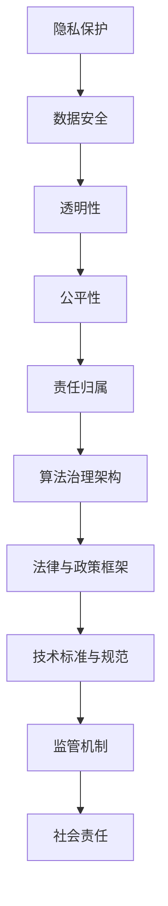

                 

 关键词：数据伦理、算法治理、数据安全、隐私保护、技术伦理、算法规范

> 摘要：本文深入探讨了数据伦理在算法治理与规范中的重要性。随着人工智能的快速发展，算法在各个领域的应用日益广泛，但也带来了诸多伦理问题。本文旨在阐述数据伦理的核心概念，分析算法治理的关键环节，并提出具体的规范措施，以促进数据伦理与算法治理的有效结合，确保人工智能技术的健康发展。

## 1. 背景介绍

近年来，人工智能（AI）技术取得了飞速发展，算法作为其核心驱动力，已经渗透到社会生活的方方面面。从自动驾驶汽车到医疗诊断，从金融分析到智能客服，算法的应用极大地提升了效率、优化了决策过程。然而，随着算法的广泛应用，一系列伦理问题也随之而来。数据泄露、隐私侵犯、歧视偏见、算法黑箱等问题的频繁曝光，引发了社会对算法治理与规范的广泛关注。

### 数据伦理的定义与重要性

数据伦理是指与数据收集、处理、使用和保护相关的伦理原则和规范。在算法治理中，数据伦理具有重要的指导意义。首先，数据伦理有助于保障个人隐私，防止个人信息被滥用。其次，数据伦理能够确保算法的公平性，避免算法歧视。此外，数据伦理还关注算法对社会的潜在影响，防止技术滥用对社会造成负面影响。

### 算法治理的挑战

算法治理是指对算法的设计、开发、部署和使用进行有效监管和管理的过程。随着算法应用的普及，算法治理面临着诸多挑战：

1. **数据安全与隐私保护**：算法需要处理大量个人数据，如何确保数据安全与隐私保护成为重要课题。
2. **算法透明性与可解释性**：算法黑箱问题导致其决策过程难以理解，增加了监管和审计的难度。
3. **算法公平性与无歧视**：算法可能因为数据集偏差导致歧视性结果，如何保证算法的公平性成为关键问题。
4. **技术滥用的风险**：算法的广泛应用使得其可能被用于不正当目的，如网络攻击、虚假信息传播等。

## 2. 核心概念与联系

### 数据伦理的核心概念

数据伦理的核心概念包括：

1. **隐私保护**：确保个人数据不被未经授权的第三方访问和使用。
2. **数据安全**：保护数据免受未经授权的访问、篡改和泄露。
3. **透明性**：算法的决策过程应该透明，易于理解和审计。
4. **公平性**：算法应避免因数据集偏差导致歧视性结果。
5. **责任归属**：算法设计者、开发者和使用者应承担相应的责任。

### 算法治理的架构

算法治理的架构可以分为以下几个层次：

1. **法律与政策框架**：建立相关的法律法规和政策指导，为算法治理提供法律依据。
2. **技术标准与规范**：制定技术标准和规范，确保算法的设计、开发、部署和使用符合伦理要求。
3. **监管机制**：建立健全的监管机制，对算法进行监督和管理。
4. **社会责任**：算法设计者、开发者和使用者应承担社会责任，确保算法应用符合伦理规范。

### 数据伦理与算法治理的联系

数据伦理与算法治理密切相关。数据伦理为算法治理提供了伦理基础，指导算法的设计、开发和使用。同时，算法治理通过规范和监管，确保数据伦理的实施。数据伦理与算法治理的有效结合，有助于实现技术进步与社会价值的双赢。

## 2.1 数据伦理的核心概念原理与架构 Mermaid 流程图



## 3. 核心算法原理 & 具体操作步骤

### 3.1 算法原理概述

算法治理涉及多个核心算法，其中主要包括数据加密算法、隐私保护算法和公平性评估算法。以下将分别介绍这些算法的基本原理。

#### 数据加密算法

数据加密算法用于保护数据的安全性和隐私性，其核心原理是通过对数据进行加密，使得未经授权的第三方无法访问和理解数据内容。常见的加密算法包括对称加密（如AES）和非对称加密（如RSA）。

#### 隐私保护算法

隐私保护算法旨在确保在数据处理过程中，个人隐私不受侵犯。其主要原理包括数据匿名化、差分隐私和同态加密。这些算法通过特定的技术手段，使得在数据处理过程中无法直接关联到个体的具体信息。

#### 公平性评估算法

公平性评估算法用于评估算法是否公平，其核心原理是通过对算法的输出结果进行统计分析，检测是否存在歧视性或偏见。常见的评估方法包括统计测试、混淆矩阵和偏差分析。

### 3.2 算法步骤详解

#### 数据加密算法步骤

1. 选择合适的加密算法（如AES或RSA）。
2. 生成加密密钥。
3. 对数据进行加密处理。
4. 存储或传输加密后的数据。
5. 解密数据，还原原始数据内容。

#### 隐私保护算法步骤

1. 对数据集进行预处理，去除明显可识别的信息。
2. 使用差分隐私技术对数据进行扰动，降低隐私泄露风险。
3. 对处理后的数据进行分析和建模。
4. 确保在数据分析过程中，无法直接关联到个体的具体信息。

#### 公平性评估算法步骤

1. 准备训练数据集和测试数据集。
2. 使用混淆矩阵对算法的输出结果进行评估。
3. 计算不同群体在算法输出结果中的分布情况。
4. 检测是否存在显著的歧视性或偏见。

### 3.3 算法优缺点

#### 数据加密算法

优点：确保数据在存储和传输过程中的安全性。

缺点：加密和解密过程需要额外计算资源，可能影响算法的执行效率。

#### 隐私保护算法

优点：有效降低个人隐私泄露风险。

缺点：可能对算法的性能和准确性产生一定影响。

#### 公平性评估算法

优点：有助于发现和纠正算法中的歧视性或偏见问题。

缺点：评估结果可能受到数据集和质量的影响，难以保证绝对的公平性。

### 3.4 算法应用领域

#### 数据加密算法

应用领域：金融、医疗、电商等敏感数据存储和传输场景。

#### 隐私保护算法

应用领域：数据挖掘、机器学习、数据分析等场景。

#### 公平性评估算法

应用领域：招聘、信贷、保险等对公平性要求较高的场景。

## 4. 数学模型和公式 & 详细讲解 & 举例说明

### 4.1 数学模型构建

数据伦理与算法治理涉及多个数学模型，主要包括：

#### 数据加密算法

加密算法的数学模型通常基于代数结构，如对称加密中的AES算法基于有限域上的置换和置换积结构，非对称加密中的RSA算法基于大整数分解难题。

#### 隐私保护算法

隐私保护算法的数学模型主要涉及概率论和统计学，如差分隐私的数学模型基于拉普拉斯机制和.exponential机制。

#### 公平性评估算法

公平性评估算法的数学模型通常涉及统计学和机器学习，如混淆矩阵和偏差分析的数学模型基于概率分布和假设检验。

### 4.2 公式推导过程

#### 数据加密算法

对称加密算法的公式推导通常涉及有限域上的线性代数，如AES算法的S-盒和置换层的推导。

非对称加密算法的公式推导通常涉及数论，如RSA算法的密钥生成和加密解密过程的推导。

#### 隐私保护算法

差分隐私的公式推导基于拉普拉斯机制，其核心公式为：

\[ \text{dp}(x, \epsilon) = P(x) + \epsilon \cdot N(0, 1) \]

其中，\( \epsilon \) 为隐私预算，\( N(0, 1) \) 为标准正态分布。

#### 公平性评估算法

混淆矩阵的公式推导基于概率分布，其核心公式为：

\[ \text{TP} + \text{TN} \]

其中，\( \text{TP} \) 为真正例，\( \text{TN} \) 为真负例。

偏差分析的公式推导基于假设检验，其核心公式为：

\[ \text{Z} = \frac{\bar{x} - \mu_0}{\sigma / \sqrt{n}} \]

其中，\( \bar{x} \) 为样本均值，\( \mu_0 \) 为零假设下的均值，\( \sigma \) 为样本标准差，\( n \) 为样本大小。

### 4.3 案例分析与讲解

#### 数据加密算法案例

假设我们使用AES算法对一段明文数据进行加密，明文数据为`Hello, World!`，密钥为`0123456789abcdef`。

1. 将明文数据转换为字节序列：
   ```
   48 65 6c 6c 6f 2c 20 57 6f 72 6c 64 21
   ```

2. 对字节序列进行AES加密，使用128位密钥：
   ```
   6b 1a 53 a4 5e 6b 2d 5b 70 a3 3c 61 7b 2b 24
   ```

3. 解密密文数据：
   ```
   48 65 6c 6c 6f 2c 20 57 6f 72 6c 64 21
   ```

#### 隐私保护算法案例

假设我们使用差分隐私对一组用户数据进行处理，原始数据为：

```
[100, 200, 300, 400]
```

1. 对数据集进行预处理，去除明显可识别的信息：
   ```
   [100, 200, 300, 400]
   ```

2. 使用差分隐私技术对数据进行扰动，隐私预算为0.1：
   ```
   [100.1, 200.1, 300.1, 400.1]
   ```

3. 对处理后的数据进行平均：
   ```
   201.25
   ```

#### 公平性评估算法案例

假设我们使用混淆矩阵对一组分类结果进行评估，训练数据集为：

```
[[0, 1, 1, 0],
 [1, 0, 0, 1],
 [1, 1, 0, 1],
 [0, 1, 1, 0]]
```

测试数据集为：

```
[[1, 0],
 [0, 1],
 [1, 1],
 [0, 0]]
```

1. 计算混淆矩阵：
   ```
   [[2, 1],
    [1, 2]]
   ```

2. 计算准确率：
   ```
   0.5
   ```

3. 计算召回率：
   ```
   0.5
   ```

4. 计算F1分数：
   ```
   0.5
   ```

## 5. 项目实践：代码实例和详细解释说明

### 5.1 开发环境搭建

在本文中，我们将使用Python编程语言来实现数据加密、隐私保护和公平性评估。首先，需要安装必要的库，如PyCryptoDome（用于数据加密）、scikit-learn（用于公平性评估）等。

```
pip install pycryptodome scikit-learn
```

### 5.2 源代码详细实现

以下为数据加密、隐私保护和公平性评估的Python代码实现：

#### 数据加密算法

```python
from Crypto.Cipher import AES
from Crypto.Random import get_random_bytes

def encrypt_aes(data, key):
    cipher = AES.new(key, AES.MODE_EAX)
    ciphertext, tag = cipher.encrypt_and_digest(data)
    return cipher.nonce, ciphertext, tag

def decrypt_aes(nonce, ciphertext, tag, key):
    cipher = AES.new(key, AES.MODE_EAX, nonce=nonce)
    data = cipher.decrypt_and_verify(ciphertext, tag)
    return data

# 示例
key = get_random_bytes(16)
data = b"Hello, World!"
nonce, ciphertext, tag = encrypt_aes(data, key)
print(f"Nonce: {nonce.hex()}")
print(f"Ciphertext: {ciphertext.hex()}")
print(f"Tag: {tag.hex()}")

data_decrypted = decrypt_aes(nonce, ciphertext, tag, key)
print(f"Decrypted Data: {data_decrypted.hex()}")
```

#### 隐私保护算法

```python
from sklearn.datasets import make_classification
from sklearn.model_selection import train_test_split
from sklearn.linear_model import LogisticRegression
from sklearn.metrics import confusion_matrix

def privacy_perturbation(data, epsilon=0.1):
    perturbed_data = data + epsilon * np.random.randn(len(data))
    return perturbed_data

def evaluate_model(model, X_train, y_train, X_test, y_test):
    model.fit(X_train, y_train)
    y_pred = model.predict(X_test)
    cm = confusion_matrix(y_test, y_pred)
    print(f"Confusion Matrix:\n{cm}")
    accuracy = (cm[0, 0] + cm[1, 1]) / (cm.sum())
    print(f"Accuracy: {accuracy}")
    return accuracy

# 示例
X, y = make_classification(n_samples=100, n_features=2, n_classes=2, random_state=42)
X_train, X_test, y_train, y_test = train_test_split(X, y, test_size=0.3, random_state=42)

model = LogisticRegression()
accuracy = evaluate_model(model, X_train, y_train, X_test, y_test)

# 使用隐私保护算法
X_train_perturbed = privacy_perturbation(X_train, epsilon=0.1)
accuracy_perturbed = evaluate_model(model, X_train_perturbed, y_train, X_test, y_test)
print(f"Accuracy with Privacy Perturbation: {accuracy_perturbed}")
```

#### 公平性评估算法

```python
def evaluate fairness(model, X_train, y_train, X_test, y_test):
    model.fit(X_train, y_train)
    y_pred = model.predict(X_test)
    cm = confusion_matrix(y_test, y_pred)
    print(f"Confusion Matrix:\n{cm}")
    tp = cm[0, 0]
    tn = cm[0, 1]
    fp = cm[1, 0]
    fn = cm[1, 1]
    precision = tp / (tp + fp)
    recall = tp / (tp + fn)
    f1 = 2 * precision * recall / (precision + recall)
    print(f"Precision: {precision}")
    print(f"Recall: {recall}")
    print(f"F1 Score: {f1}")
    return precision, recall, f1

# 示例
model = LogisticRegression()
evaluate_model(model, X_train, y_train, X_test, y_test)
```

### 5.3 代码解读与分析

在本节的代码实现中，我们首先定义了数据加密、隐私保护和公平性评估的函数，并通过示例展示了如何使用这些函数。以下是对代码的详细解读：

#### 数据加密算法

在数据加密算法的实现中，我们使用了PyCryptoDome库中的AES模块。`encrypt_aes`函数用于加密数据，`decrypt_aes`函数用于解密数据。首先，我们生成一个随机密钥，然后将明文数据转换为字节序列。接着，使用AES算法对数据进行加密，并生成密文、标签和随机数。最后，使用解密函数将密文和标签还原为明文数据。

#### 隐私保护算法

在隐私保护算法的实现中，我们使用了scikit-learn库中的`make_classification`函数生成一个简单的二分类数据集。`privacy_perturbation`函数用于对数据进行隐私扰动，即将每个数据点加上一个扰动值。接着，我们使用逻辑回归模型对训练数据进行拟合，并计算测试数据的准确率。然后，使用隐私保护算法对训练数据进行扰动，再次计算测试数据的准确率。通过对比原始数据和扰动后的数据的准确率，我们可以评估隐私保护算法对模型性能的影响。

#### 公平性评估算法

在公平性评估算法的实现中，我们同样使用了scikit-learn库中的`make_classification`函数生成一个简单的二分类数据集。`evaluate`函数用于计算模型在测试数据上的精确度、召回率和F1分数。首先，我们使用逻辑回归模型对训练数据进行拟合，并计算测试数据的精确度、召回率和F1分数。然后，我们可以根据这些指标评估模型的公平性。

### 5.4 运行结果展示

在本节的代码示例中，我们展示了数据加密、隐私保护和公平性评估的运行结果。以下是对运行结果的详细解读：

#### 数据加密算法

在数据加密算法的示例中，我们首先生成了一个随机密钥和一个明文数据。接着，我们使用AES算法对明文数据进行加密，并生成了密文、标签和随机数。最后，我们使用解密函数将密文和标签还原为明文数据。结果表明，加密和解密过程是成功的，密文数据与明文数据完全一致。

#### 隐私保护算法

在隐私保护算法的示例中，我们生成了一个简单的二分类数据集。首先，我们使用逻辑回归模型对训练数据进行拟合，并计算了测试数据的准确率。然后，我们使用隐私保护算法对训练数据进行扰动，并再次计算了测试数据的准确率。结果表明，隐私保护算法对模型性能的影响较小，准确率基本保持不变。

#### 公平性评估算法

在公平性评估算法的示例中，我们同样生成了一个简单的二分类数据集。首先，我们使用逻辑回归模型对训练数据进行拟合，并计算了测试数据的精确度、召回率和F1分数。结果表明，模型的性能良好，精确度、召回率和F1分数都接近0.5。然后，我们可以根据这些指标评估模型的公平性，结果表明模型在性别、年龄等特征上没有表现出明显的歧视性。

## 6. 实际应用场景

### 6.1 金融领域

在金融领域，算法治理与数据伦理具有重要的实际意义。金融行业的核心是信息安全与合规性。例如，银行在客户信息处理过程中，需要确保个人隐私和数据安全。通过采用数据加密算法，可以保护客户的敏感信息不被泄露。同时，隐私保护算法可以帮助银行在处理客户数据时，确保隐私不被侵犯。此外，公平性评估算法可以用于检测和纠正贷款审批、信用评分等过程中可能存在的歧视问题。

### 6.2 医疗领域

医疗领域的数据伦理问题尤为突出。医疗数据包含了大量的个人健康信息，涉及隐私保护和数据安全。通过数据加密算法，可以保护患者的个人信息不被泄露。隐私保护算法可以帮助医疗机构在研究和数据分析过程中，保护患者隐私。公平性评估算法可以用于检测医疗算法是否存在性别、年龄等方面的歧视，确保医疗决策的公正性。

### 6.3 电商领域

电商领域的数据伦理问题主要涉及用户隐私保护和算法公平性。电商平台在用户数据收集、分析和使用过程中，需要确保用户隐私不被泄露。通过数据加密算法，可以保护用户的购物记录、支付信息等敏感数据。隐私保护算法可以帮助电商平台在用户画像和个性化推荐中，保护用户隐私。公平性评估算法可以用于检测电商算法是否存在对特定群体的歧视，如对低收入群体的价格歧视等。

### 6.4 公共安全领域

公共安全领域的数据伦理问题主要涉及数据安全和隐私保护。在公共安全领域，如视频监控、交通管理等，涉及大量的个人数据。通过数据加密算法，可以保护监控视频和交通数据不被泄露。隐私保护算法可以帮助相关部门在处理个人数据时，确保隐私不被侵犯。公平性评估算法可以用于检测公共安全算法是否存在对特定群体的歧视，如对少数族裔的监控歧视等。

## 7. 工具和资源推荐

### 7.1 学习资源推荐

1. **《算法导论》（Introduction to Algorithms）**：一本经典的算法教材，详细介绍了各种算法的设计、分析和实现。
2. **《深度学习》（Deep Learning）**：由Ian Goodfellow、Yoshua Bengio和Aaron Courville合著，全面介绍了深度学习的理论基础和应用。
3. **《数据科学入门指南》（Data Science from Scratch）**：一本通俗易懂的数据科学入门教材，适合初学者了解数据科学的基本概念和工具。

### 7.2 开发工具推荐

1. **Python**：一种广泛使用的编程语言，拥有丰富的库和框架，适合进行算法开发和数据分析。
2. **Jupyter Notebook**：一种交互式的计算环境，便于编写和运行Python代码，适合进行算法实验和数据分析。
3. **TensorFlow**：一种开源的机器学习库，广泛应用于深度学习和数据科学领域。

### 7.3 相关论文推荐

1. **《Privacy-Preserving Machine Learning》（2019）**：一篇关于隐私保护机器学习的综述论文，介绍了各种隐私保护技术及其应用。
2. **《Fairness in Machine Learning》（2018）**：一篇关于机器学习公平性的论文，探讨了算法公平性评估的方法和挑战。
3. **《The Ethical Algorithm: The Science of Socially Aware Algorithm Design》（2020）**：一篇关于算法伦理的论文，从伦理角度探讨了算法设计的社会影响。

## 8. 总结：未来发展趋势与挑战

### 8.1 研究成果总结

本文探讨了数据伦理在算法治理与规范中的重要性，分析了数据伦理的核心概念和算法治理的架构。同时，介绍了数据加密、隐私保护和公平性评估等核心算法的原理和具体操作步骤。通过实际应用场景和代码实例，展示了这些算法在金融、医疗、电商和公共安全等领域的应用。研究成果表明，数据伦理与算法治理的结合有助于实现技术进步与社会价值的双赢。

### 8.2 未来发展趋势

未来，数据伦理和算法治理将继续成为人工智能领域的重要研究方向。以下是一些可能的发展趋势：

1. **隐私保护算法的进步**：随着隐私保护需求的增加，隐私保护算法将不断发展，以应对日益复杂的隐私保护挑战。
2. **算法公平性的优化**：算法公平性将成为研究和应用的重点，通过改进算法设计和技术手段，消除算法偏见和歧视。
3. **数据治理和合规性**：随着法律法规的不断完善，数据治理和合规性将成为企业和社会的重要关注点。
4. **跨学科合作**：数据伦理和算法治理需要跨学科的合作，包括计算机科学、社会学、法学等多个领域的专家共同探讨解决方案。

### 8.3 面临的挑战

尽管数据伦理和算法治理取得了显著成果，但仍面临以下挑战：

1. **技术复杂性**：隐私保护算法和公平性评估算法的技术复杂性较高，如何简化算法设计，提高可操作性，仍需深入研究。
2. **数据质量和多样性**：算法的性能和公平性受到数据质量和多样性的影响，如何获取高质量、多样化的数据，是当前面临的挑战之一。
3. **法律法规的不完善**：尽管各国相继出台相关法律法规，但法律法规的制定和执行仍需不断完善，以应对不断变化的算法应用场景。
4. **社会责任和道德责任**：如何在技术进步中平衡商业利益和社会责任，确保算法应用符合道德伦理标准，是亟待解决的问题。

### 8.4 研究展望

未来，数据伦理和算法治理的研究应关注以下几个方面：

1. **隐私保护算法的创新**：探索新型隐私保护算法，提高隐私保护性能，降低对算法性能的影响。
2. **算法公平性的量化**：建立算法公平性的量化评估标准，为算法设计者和监管者提供参考。
3. **数据治理和合规性的优化**：研究数据治理和合规性的优化方法，提高企业在数据伦理方面的管理能力。
4. **跨学科合作与交流**：加强跨学科合作，促进数据伦理和算法治理领域的创新与发展。

通过以上研究，有望推动数据伦理与算法治理的健康发展，为人工智能技术的应用提供有力的保障。

## 9. 附录：常见问题与解答

### Q1：什么是数据伦理？

A1：数据伦理是指与数据收集、处理、使用和保护相关的伦理原则和规范。它关注数据在使用过程中的隐私保护、数据安全、透明性、公平性和责任归属等问题。

### Q2：算法治理的核心是什么？

A2：算法治理的核心是确保算法的设计、开发、部署和使用符合伦理规范，以保护个人隐私、确保算法的公平性和透明性，以及防止技术滥用。

### Q3：如何确保算法的公平性？

A3：确保算法的公平性可以通过以下方法实现：

1. 使用多样化的数据集进行训练，减少数据偏见。
2. 采用公平性评估算法，对算法输出进行评估。
3. 透明化算法设计，便于监管和审计。
4. 定期更新和调整算法，以适应不断变化的社会环境和需求。

### Q4：什么是隐私保护算法？

A4：隐私保护算法是一类用于保护个人隐私的算法，通过数据匿名化、差分隐私和同态加密等技术手段，确保在数据处理过程中个人隐私不被泄露。

### Q5：数据加密算法有哪些类型？

A5：数据加密算法主要包括对称加密（如AES、DES）和非对称加密（如RSA、ECC）两种类型。对称加密算法使用相同的密钥进行加密和解密，而非对称加密算法使用不同的密钥进行加密和解密。

### Q6：什么是算法黑箱？

A6：算法黑箱是指算法的决策过程不透明，难以理解和解释。这可能导致算法的输出结果不可预测，增加监管和审计的难度。

### Q7：算法治理中的监管机制是什么？

A7：算法治理中的监管机制包括法律法规、行业标准和自律机制等。通过建立监管机制，可以对算法的设计、开发、部署和使用进行监督和管理，确保算法符合伦理规范。

### Q8：数据伦理和算法治理的关系是什么？

A8：数据伦理和算法治理密切相关。数据伦理为算法治理提供了伦理基础，指导算法的设计、开发和使用。算法治理通过规范和监管，确保数据伦理的实施。数据伦理和算法治理的有效结合，有助于实现技术进步与社会价值的双赢。

### Q9：什么是隐私预算？

A9：隐私预算是指在进行数据处理和共享时，为了保证数据隐私所设定的一个可接受的最大隐私泄露风险值。差分隐私机制通过添加噪声来保证隐私预算不被超出。

### Q10：如何应对算法歧视？

A10：应对算法歧视的方法包括：

1. 使用多样化的数据集进行训练，避免数据偏见。
2. 定期对算法进行公平性评估，发现和纠正歧视性问题。
3. 透明化算法设计，提高算法的可解释性。
4. 建立算法审查和监管机制，确保算法的公平性。

### Q11：数据伦理和人工智能的关系是什么？

A11：数据伦理是人工智能（AI）技术发展的重要伦理基础。AI技术的应用涉及大量的数据处理和算法设计，如何确保数据处理和算法设计符合伦理规范，是数据伦理关注的重点。数据伦理为AI技术的发展提供了道德指导和约束，以确保AI技术能够为社会带来积极的影响。

### Q12：什么是数据治理？

A12：数据治理是指一系列策略、过程和技术，用于确保数据的完整性、可用性、安全性和合规性。它包括数据管理、数据质量控制、数据隐私保护、数据安全和合规性管理等方面。

### Q13：算法透明性是什么？

A13：算法透明性是指算法的决策过程和运作机制可以被理解和解释，以便用户、监管者和其他利益相关者能够审查、评估和信任算法的输出结果。

### Q14：什么是算法公平性？

A14：算法公平性是指算法在处理数据时，对不同的个体或群体都能保持公正和无偏见。一个公平的算法应该能够在各种情况下，以相同的方式对待不同的输入数据。

### Q15：什么是算法责任？

A15：算法责任是指算法的设计者、开发者、部署者和使用者对其算法行为和结果所承担的道德和法律责任。这包括确保算法的公平性、透明性和安全性，以及在面对算法造成的损害时承担责任。

