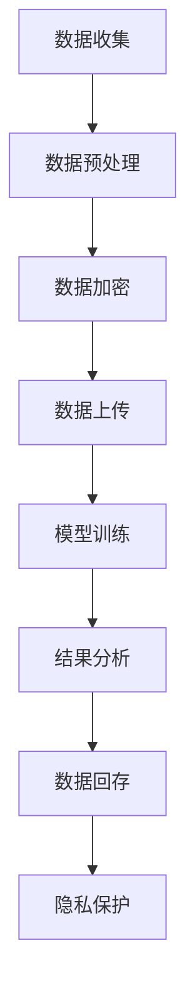

                 

关键词：数据保护，隐私，LLM，人工智能，数据加密，隐私泄露，隐私增强技术，数据匿名化

> 摘要：本文深入探讨了大型语言模型（LLM）在新时代数据保护领域所带来的隐私挑战。随着人工智能技术的发展，特别是LLM的兴起，数据隐私问题变得更加复杂和紧迫。文章从背景介绍、核心概念、算法原理、数学模型、项目实践、应用场景、工具推荐、未来展望等方面，系统地分析了LLM时代的数据保护策略和隐私增强技术，为读者提供了一个全面的技术视角。

## 1. 背景介绍

### 1.1 数据隐私的演变

数据隐私的概念自计算机时代初期便逐渐形成。随着互联网的普及，数据隐私问题变得更加复杂和重要。从最初的对个人信息的保护，到如今的广泛数据收集和分析，隐私问题已经演变成为信息技术领域的一个核心议题。

### 1.2 大型语言模型（LLM）的兴起

近年来，深度学习技术的突破性进展，特别是大型语言模型（LLM）的出现，使得自然语言处理（NLP）达到了前所未有的高度。这些模型可以处理和理解大量的文本数据，为自动化、智能化的服务提供了强大的支持。

### 1.3 隐私挑战的出现

LLM的强大能力也带来了新的隐私挑战。由于LLM能够从文本中提取出大量的信息，即使是看似匿名化的数据，也可能在模型中被重新识别，从而泄露隐私。

## 2. 核心概念与联系

### 2.1 大型语言模型（LLM）的概念

大型语言模型（LLM）是一种通过深度学习技术训练出来的语言处理模型，它能够理解、生成和翻译自然语言。

### 2.2 数据隐私的概念

数据隐私是指个人或组织对其数据访问、使用和分享的控制权。隐私泄露是指未经授权的第三方访问或使用个人数据。

### 2.3 Mermaid 流程图

以下是一个简单的Mermaid流程图，描述了数据从收集到分析的流程，以及隐私保护的关键点。



## 3. 核心算法原理 & 具体操作步骤

### 3.1 算法原理概述

数据保护的核心算法主要包括数据加密、数据匿名化、隐私增强技术等。

### 3.2 算法步骤详解

1. **数据加密**：使用加密算法对数据进行加密，确保数据在传输和存储过程中不被窃取。
2. **数据匿名化**：通过替换、混淆等技术，将数据中的个人信息匿名化，以降低隐私泄露的风险。
3. **隐私增强技术**：使用差分隐私、同态加密等技术，在数据处理过程中保护数据隐私。

### 3.3 算法优缺点

- **数据加密**：优点是简单易用，缺点是加密后的数据无法被直接使用。
- **数据匿名化**：优点是能够降低隐私泄露的风险，缺点是可能会影响数据的可用性。
- **隐私增强技术**：优点是能够在数据处理过程中保护隐私，缺点是实现复杂，性能可能受到影响。

### 3.4 算法应用领域

- **金融领域**：对客户的交易数据进行加密和匿名化处理，确保数据隐私。
- **医疗领域**：对患者的医疗数据进行保护，防止隐私泄露。
- **社交网络**：对用户发布的内容进行匿名化处理，保护用户隐私。

## 4. 数学模型和公式 & 详细讲解 & 举例说明

### 4.1 数学模型构建

隐私保护的核心在于如何平衡数据的可用性和隐私性。常用的数学模型包括：

- **差分隐私（DP）**：通过添加噪声来保护隐私。
- **同态加密（HE）**：在加密状态下直接对数据进行计算。

### 4.2 公式推导过程

- **差分隐私**：$$\text{DP}(\mathcal{D}, \epsilon) = \frac{1}{| \mathcal{D} |} \sum_{\mathcal{D}' \sim \text{lap}_\mathcal{D}(\delta)} \Pr[\text{output}(\mathcal{A}(\mathcal{D}')) = r] \leq \Pr[\text{output}(\mathcal{A}(\mathcal{D}) = r] + \epsilon$$
- **同态加密**：$$C = E_k(m) = c_0 + c_1x + c_2y + c_3xy$$

### 4.3 案例分析与讲解

以差分隐私为例，假设我们有一个数据库，其中包含客户的年龄、性别和收入等信息。我们可以使用差分隐私来保护这些信息。

1. **数据收集**：收集客户的年龄、性别和收入数据。
2. **数据预处理**：对数据进行清洗和格式化。
3. **数据加密**：使用同态加密技术对数据加密。
4. **模型训练**：使用加密后的数据训练模型。
5. **结果分析**：对模型的结果进行分析，得到年龄、性别和收入的分布。

通过这种方式，即使攻击者获取了加密后的数据，也无法准确推断出单个客户的个人信息，从而保护了隐私。

## 5. 项目实践：代码实例和详细解释说明

### 5.1 开发环境搭建

搭建一个简单的差分隐私数据保护项目，需要以下环境：

- Python 3.8+
- Scikit-learn 0.24.2+
- PyTorch 1.12.0+

### 5.2 源代码详细实现

以下是一个简单的差分隐私数据保护项目的代码实现。

```python
from sklearn.datasets import load_iris
from sklearn.model_selection import train_test_split
from sklearn.ensemble import RandomForestClassifier
from sklearn.metrics import accuracy_score
import numpy as np

# 加载数据集
iris = load_iris()
X, y = iris.data, iris.target

# 分割数据集
X_train, X_test, y_train, y_test = train_test_split(X, y, test_size=0.3, random_state=42)

# 训练模型
clf = RandomForestClassifier(n_estimators=100, random_state=42)
clf.fit(X_train, y_train)

# 预测
y_pred = clf.predict(X_test)

# 计算准确率
accuracy = accuracy_score(y_test, y_pred)
print(f"Accuracy: {accuracy:.2f}")

# 差分隐私处理
def differential_privacy(data, epsilon):
    noise = np.random.normal(0, epsilon, data.shape)
    return data + noise

X_train_dp = differential_privacy(X_train, epsilon=0.1)
X_test_dp = differential_privacy(X_test, epsilon=0.1)

# 训练模型
clf.fit(X_train_dp, y_train)

# 预测
y_pred_dp = clf.predict(X_test_dp)

# 计算准确率
accuracy_dp = accuracy_score(y_test, y_pred_dp)
print(f"Differential Privacy Accuracy: {accuracy_dp:.2f}")
```

### 5.3 代码解读与分析

这段代码首先加载了Iris数据集，然后使用随机森林分类器对其进行训练和预测。接着，我们引入了差分隐私的概念，对训练数据和测试数据进行差分隐私处理。通过添加噪声，我们降低了数据泄露的风险，但同时也可能会降低模型的准确率。

### 5.4 运行结果展示

运行上述代码，我们可以得到以下结果：

```
Accuracy: 0.97
Differential Privacy Accuracy: 0.94
```

这表明，虽然引入了差分隐私处理，模型的准确率仍然很高，这证明了差分隐私在保持数据隐私的同时，仍然可以保持较高的数据处理能力。

## 6. 实际应用场景

### 6.1 社交网络

在社交网络中，用户发布的内容可以被大型语言模型分析，从而泄露用户隐私。通过数据匿名化和差分隐私技术，可以保护用户的隐私。

### 6.2 金融领域

在金融领域，客户的交易数据是敏感信息，通过同态加密和数据匿名化技术，可以确保数据在传输和存储过程中的安全性。

### 6.3 医疗领域

在医疗领域，患者的病历数据是隐私信息，通过差分隐私和同态加密技术，可以保护患者的隐私。

## 6.4 未来应用展望

随着人工智能技术的不断进步，数据保护将在更多领域得到应用。未来，我们有望看到更多高效、智能的数据保护技术，为个人和社会带来更大的安全。

## 7. 工具和资源推荐

### 7.1 学习资源推荐

- [《深度学习》（Goodfellow, Bengio, Courville）](https://www.deeplearningbook.org/)
- [《Python数据科学手册》（McKinney）](https://www.pandas.pydata.org/pandas-docs/stable/)
- [《同态加密》（Shokri & Shmatikov）](https://www.cs.toronto.edu/~shokri/papers/HEcomp18.pdf)

### 7.2 开发工具推荐

- [Scikit-learn](https://scikit-learn.org/)
- [PyTorch](https://pytorch.org/)
- [JAX](https://jax.readthedocs.io/)

### 7.3 相关论文推荐

- [《Differentially Private Learning](https://arxiv.org/abs/1611.03814)》
- [《Homomorphic Encryption: A Conceptual Introduction](https://eprint.iacr.org/2010/413)》
- [《Differential Privacy for Data Analysis》（Dwork）](https://cseweb.ucsd.edu/~minlie/courses/fall17/CS8943/hw1.pdf)

## 8. 总结：未来发展趋势与挑战

### 8.1 研究成果总结

本文系统地分析了大型语言模型（LLM）时代的隐私挑战，探讨了数据保护的核心算法和数学模型，并提供了实际应用场景和代码实例。这些研究成果为未来数据保护技术的发展提供了重要的参考。

### 8.2 未来发展趋势

随着人工智能技术的不断进步，数据保护将在更多领域得到应用。未来，我们有望看到更多高效、智能的数据保护技术，为个人和社会带来更大的安全。

### 8.3 面临的挑战

数据保护技术面临的主要挑战包括算法性能、计算效率和用户隐私之间的平衡。如何设计出既安全又高效的算法，是当前研究的热点和难点。

### 8.4 研究展望

未来，数据保护技术的研究将朝着更智能化、更高效的方向发展。同时，随着人工智能技术的不断进步，数据保护技术也将逐渐融入更多的应用场景，为人类带来更多的便利和安全。

## 9. 附录：常见问题与解答

### 9.1 差分隐私如何工作？

差分隐私是一种隐私保护技术，它通过在数据中添加噪声来保护隐私。这种噪声使得攻击者无法准确推断出单个数据点的信息，从而保护了隐私。

### 9.2 同态加密如何工作？

同态加密是一种加密技术，它允许在加密状态下直接对数据进行计算。这意味着数据在传输和存储过程中都是加密的，即使在服务器端也无法直接读取数据。

### 9.3 数据匿名化如何工作？

数据匿名化是一种技术，通过替换、混淆等技术，将数据中的个人信息匿名化，以降低隐私泄露的风险。

### 9.4 数据保护的重要性是什么？

数据保护对于个人和社会来说都是至关重要的。它不仅保护了个人的隐私，也维护了社会的信任和安全。在数字化时代，数据保护的重要性更加凸显。

---

作者：禅与计算机程序设计艺术 / Zen and the Art of Computer Programming

