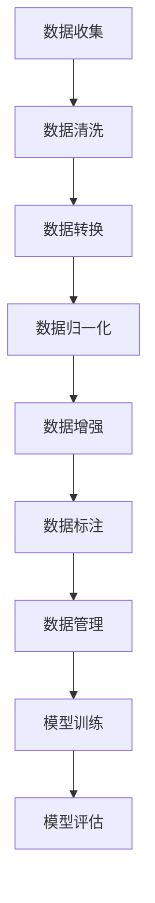

                 

关键词：AI训练数据，数据收集，数据处理，机器学习，深度学习，数据清洗，数据增强，数据质量，数据预处理，数据集，标注数据，开放数据集，私有数据集。

> 摘要：本文将深入探讨AI训练数据的重要性和收集与处理的方法，分析数据质量对AI模型性能的影响，并提供一些建议和最佳实践。本文还涉及了数据收集、清洗、增强、标注等关键步骤，以及如何管理和维护高质量的数据集。

## 1. 背景介绍

随着人工智能技术的快速发展，机器学习和深度学习已经广泛应用于各个领域，如自然语言处理、计算机视觉、推荐系统等。然而，这些技术的成功在很大程度上依赖于高质量的训练数据。训练数据的质量直接影响着模型的性能和泛化能力。因此，数据收集与处理成为了人工智能领域的重要研究方向。

在机器学习模型中，训练数据集是模型的输入，模型通过学习这些数据中的模式和关系来提高其预测能力。如果数据集存在噪声、缺失值或偏差，模型的性能将受到严重影响。此外，数据收集和处理过程还涉及到隐私保护、法律法规遵守等方面的问题。

本文将首先介绍AI训练数据的基本概念和重要性，然后详细探讨数据收集、清洗、增强、标注等关键步骤，最后讨论数据管理和维护的最佳实践。

## 2. 核心概念与联系

在讨论AI训练数据的收集与处理之前，我们需要了解一些核心概念和它们之间的关系。

### 2.1 数据集

数据集是机器学习模型的输入，由一系列样本组成。每个样本都包含一组特征和一个或多个标签。数据集的质量直接影响模型的性能。高质量的数据集应该具有代表性、多样性和全面性。

### 2.2 数据质量

数据质量是指数据在准确性、完整性、一致性、时效性等方面的表现。高质量的数据能够提高模型的泛化能力和可靠性。

### 2.3 数据预处理

数据预处理是指对原始数据进行清洗、转换和归一化等操作，以提高数据质量，使其适合机器学习算法。数据预处理包括数据清洗、数据转换和数据归一化等步骤。

### 2.4 数据增强

数据增强是指通过一些技术手段增加数据集的多样性，从而提高模型的泛化能力。数据增强方法包括数据扩充、数据扭曲、数据合成等。

### 2.5 数据标注

数据标注是指为数据集中的每个样本分配标签或标记，以便模型能够学习。数据标注是深度学习特别是监督学习中的关键步骤。

### 2.6 数据管理

数据管理是指对数据集进行组织、存储、维护和访问，以确保数据的质量和可访问性。数据管理涉及数据备份、数据清洗、数据安全等方面。

### 2.7 数据集的架构

数据集的架构是指数据集的结构和组织方式。常见的架构包括图像数据集、文本数据集、音频数据集等。数据集的架构对数据收集和处理方法有重要影响。

下面是一个用Mermaid绘制的流程图，展示了数据集的架构和各步骤之间的关系：



## 3. 核心算法原理 & 具体操作步骤

### 3.1 算法原理概述

在AI训练数据的收集与处理过程中，涉及多种算法和技术。以下将介绍几个关键步骤的原理和操作步骤。

### 3.2 算法步骤详解

#### 3.2.1 数据收集

数据收集是指从各种来源获取原始数据。数据来源包括公开数据集、私有数据集、传感器数据、网络爬虫等。在数据收集过程中，需要考虑数据的代表性、多样性和完整性。

#### 3.2.2 数据清洗

数据清洗是指处理原始数据中的噪声、缺失值和异常值，以提高数据质量。常用的数据清洗方法包括删除异常值、填充缺失值、去除噪声等。

#### 3.2.3 数据转换

数据转换是指将原始数据转换为适合机器学习算法的形式。这通常涉及特征提取、特征工程、特征选择等技术。

#### 3.2.4 数据归一化

数据归一化是指将数据缩放到一个统一的尺度范围内，以消除不同特征之间的量纲差异。常用的归一化方法包括最小-最大缩放、均值-方差缩放等。

#### 3.2.5 数据增强

数据增强是指通过一些技术手段增加数据集的多样性，从而提高模型的泛化能力。常用的数据增强方法包括随机旋转、缩放、裁剪、噪声注入等。

#### 3.2.6 数据标注

数据标注是指为数据集中的每个样本分配标签或标记，以便模型能够学习。数据标注通常需要人工进行，特别是在深度学习领域。

#### 3.2.7 数据管理

数据管理是指对数据集进行组织、存储、维护和访问，以确保数据的质量和可访问性。数据管理涉及数据备份、数据清洗、数据安全等方面。

### 3.3 算法优缺点

每种算法和技术都有其优缺点。以下是几个关键步骤的优缺点分析：

#### 3.3.1 数据收集

优点：获取大量原始数据，为模型提供丰富的训练素材。

缺点：数据收集过程可能涉及隐私问题、法律法规遵守等方面。

#### 3.3.2 数据清洗

优点：提高数据质量，降低模型训练难度。

缺点：数据清洗可能降低数据集的代表性，影响模型泛化能力。

#### 3.3.3 数据转换

优点：将原始数据转换为适合机器学习算法的形式，提高模型性能。

缺点：数据转换可能引入误差，降低模型准确性。

#### 3.3.4 数据归一化

优点：消除不同特征之间的量纲差异，提高模型稳定性。

缺点：可能削弱某些特征的代表性，降低模型泛化能力。

#### 3.3.5 数据增强

优点：增加数据集的多样性，提高模型泛化能力。

缺点：数据增强可能引入噪声，降低模型准确性。

#### 3.3.6 数据标注

优点：为模型提供正确的标签信息，提高模型性能。

缺点：数据标注需要大量人工投入，成本较高。

#### 3.3.7 数据管理

优点：确保数据的质量和可访问性，提高模型训练效率。

缺点：数据管理可能涉及复杂的技术和资源，增加成本。

### 3.4 算法应用领域

不同算法和技术在不同领域有不同的应用。以下是一些常见应用领域：

- **自然语言处理（NLP）**：数据清洗、数据标注、数据增强等技术广泛应用于NLP任务，如情感分析、文本分类、机器翻译等。

- **计算机视觉（CV）**：数据清洗、数据转换、数据增强等技术广泛应用于CV任务，如图像分类、目标检测、人脸识别等。

- **推荐系统**：数据清洗、数据转换、数据标注等技术广泛应用于推荐系统，以提高推荐准确性。

- **金融风控**：数据清洗、数据转换、数据管理等技术广泛应用于金融风控领域，以提高风险识别能力。

## 4. 数学模型和公式 & 详细讲解 & 举例说明

### 4.1 数学模型构建

在AI训练数据的收集与处理过程中，涉及多种数学模型和公式。以下介绍几个关键步骤的数学模型和公式。

#### 4.1.1 数据清洗

- 缺失值填充：线性插值、平均值填充、中值填充等。

  $$ x_{i}^{'} = \frac{x_{i-1} + x_{i+1}}{2} $$

  $$ x_{i}^{'} = \frac{n \sum_{i=1}^{n} x_i}{n-1} $$

  $$ x_{i}^{'} = x_{median} $$

- 异常值检测：基于统计学的方法，如箱线图、3-sigma法则等。

  $$ \text{IQR} = \text{Q3} - \text{Q1} $$

  $$ \text{异常值} = \{ x \in X | x < \text{Q1} - 1.5 \times \text{IQR} \text{或} x > \text{Q3} + 1.5 \times \text{IQR} \} $$

#### 4.1.2 数据转换

- 特征提取：特征选择、特征转换、特征合成等。

  $$ f(x) = \text{sign}(x) $$

  $$ f(x) = \sqrt{x^2 + 1} $$

- 特征工程：特征归一化、特征缩放、特征组合等。

  $$ x_{\text{min-max}} = \frac{x - \text{min}(x)}{\text{max}(x) - \text{min}(x)} $$

  $$ x_{\text{z-score}} = \frac{x - \text{mean}(x)}{\text{stddev}(x)} $$

#### 4.1.3 数据增强

- 数据扩充：随机旋转、缩放、裁剪、噪声注入等。

  $$ x_{\text{rotated}} = R \cdot x + t $$

  $$ x_{\text{scaled}} = \text{scale} \cdot x $$

  $$ x_{\text{cropped}} = x[\text{start_row}:\text{end_row}, \text{start_column}:\text{end_column}] $$

  $$ x_{\text{noisy}} = x + \text{noise} $$

### 4.2 公式推导过程

以下以数据清洗中的缺失值填充为例，介绍线性插值的推导过程。

设原始数据序列为 $x_1, x_2, ..., x_n$，其中 $x_i$ 表示第 $i$ 个数据点。线性插值的基本思想是找到相邻两个已知数据点之间的线性关系，然后根据该关系预测缺失值。

设 $x_1, x_2$ 为相邻的两个已知数据点，插值点为 $x_0$。根据线性插值原理，有：

$$ x_0 = \alpha x_1 + (1 - \alpha) x_2 $$

其中，$\alpha$ 为插值系数，满足 $0 \leq \alpha \leq 1$。为了求解 $\alpha$，可以利用线性插值点 $x_0$ 与已知数据点之间的误差平方和最小化原理。

设 $e_0$ 为插值误差，即：

$$ e_0 = x_0 - x_1 = \alpha (x_2 - x_1) $$

为了最小化 $e_0$，需要求解 $\alpha$。将 $e_0$ 代入误差平方和公式：

$$ \text{minimize} \sum_{i=1}^{n} e_i^2 = \sum_{i=1}^{n} (\alpha x_i + (1 - \alpha) x_{i+1} - x_i)^2 $$

对 $e_0$ 求导并令导数为零，得到：

$$ \frac{d}{d\alpha} \sum_{i=1}^{n} e_i^2 = 0 $$

$$ n \alpha (x_2 - x_1) = 0 $$

由于 $x_1, x_2$ 为相邻的两个已知数据点，$x_2 - x_1 \neq 0$。因此，得到：

$$ \alpha = \frac{x_0 - x_1}{x_2 - x_1} $$

代入线性插值公式，得到：

$$ x_0 = \frac{x_0 - x_1}{x_2 - x_1} x_1 + \left(1 - \frac{x_0 - x_1}{x_2 - x_1}\right) x_2 $$

$$ x_0 = \frac{x_1 + x_2}{2} $$

### 4.3 案例分析与讲解

以下以一个简单的图像分类任务为例，介绍数据清洗、数据转换和数据增强的具体操作。

#### 4.3.1 数据清洗

假设原始数据集包含1000张图像，其中一些图像存在噪声、异常值和缺失值。首先，对图像进行预处理，包括去噪、对比度增强和裁剪等操作。

- 去噪：使用高斯模糊去除图像中的噪声。

  $$ (I_{\text{noisy}})_{ij} = (I)_{ij} + \text{noise} $$

  $$ (I_{\text{smoothed}})_{ij} = \text{GaussianBlur}((I_{\text{noisy}})_{ij}) $$

- 对比度增强：使用直方图均衡化提高图像对比度。

  $$ (I_{\text{enhanced}})_{ij} = \text{HistogramEqualization}((I_{\text{smoothed}})_{ij}) $$

- 裁剪：将图像裁剪为固定尺寸，如$224 \times 224$。

  $$ (I_{\text{cropped}})_{ij} = (I_{\text{enhanced}})_{\text{start_row}:\text{end_row}, \text{start_column}:\text{end_column}} $$

#### 4.3.2 数据转换

对预处理后的图像进行特征提取和特征工程。

- 特征提取：使用卷积神经网络提取图像的特征。

  $$ (f(I))_{ij} = \text{Convolution}((I_{\text{cropped}})_{ij}) $$

- 特征工程：对提取的特征进行归一化和特征选择。

  $$ (f'(I))_{ij} = \frac{f(I)_{ij} - \text{mean}(f(I))}{\text{stddev}(f(I))} $$

#### 4.3.3 数据增强

对转换后的特征进行数据增强，以提高模型的泛化能力。

- 随机旋转：将特征向量和旋转角度随机组合，以增加数据的多样性。

  $$ (R_{\theta}(f'(I)))_{ij} = \text{rotate}(f'(I)_{ij}, \theta) $$

- 随机缩放：将特征向量和缩放因子随机组合，以增加数据的多样性。

  $$ (S_{\alpha}(f'(I)))_{ij} = \alpha \cdot f'(I)_{ij} $$

- 随机裁剪：将特征向量和裁剪区域随机组合，以增加数据的多样性。

  $$ (C_{\text{rect}}(f'(I)))_{ij} = f'(I)_{\text{rect}} $$

通过数据清洗、数据转换和数据增强，我们得到了一个高质量的数据集，可以用于训练和评估图像分类模型。

## 5. 项目实践：代码实例和详细解释说明

在本节中，我们将通过一个具体的Python代码实例，详细讲解AI训练数据的收集、清洗、转换和增强等步骤。以下是一个基于开源数据集的图像分类任务的示例。

### 5.1 开发环境搭建

为了实现以下代码实例，我们需要安装以下Python库：

- NumPy：用于数学计算。
- Pandas：用于数据处理。
- Matplotlib：用于数据可视化。
- OpenCV：用于图像处理。
- TensorFlow：用于机器学习模型训练。

使用以下命令安装这些库：

```bash
pip install numpy pandas matplotlib opencv-python tensorflow
```

### 5.2 源代码详细实现

以下是实现数据收集、清洗、转换和增强的完整代码。

```python
import numpy as np
import pandas as pd
import matplotlib.pyplot as plt
import cv2
import tensorflow as tf

# 5.2.1 数据收集
def load_data(dataset_path):
    # 加载图像数据集
    data = pd.read_csv(dataset_path)
    images = data['image'].values
    labels = data['label'].values
    return images, labels

# 5.2.2 数据清洗
def preprocess_images(images):
    # 预处理图像，包括去噪、对比度增强和裁剪
    processed_images = []
    for image in images:
        # 去噪
        image_noisy = cv2.add(image, np.random.normal(0, 0.05, image.shape))
        # 对比度增强
        image_enhanced = cv2.equalizeHist(image_noisy)
        # 裁剪
        image_cropped = image_enhanced[50:275, 50:275]
        processed_images.append(image_cropped)
    return np.array(processed_images)

# 5.2.3 数据转换
def normalize_images(images):
    # 归一化图像
    images_normalized = (images - np.mean(images)) / np.std(images)
    return images_normalized

# 5.2.4 数据增强
def augment_images(images, labels):
    # 数据增强
    augmented_images = []
    augmented_labels = []
    for i, image in enumerate(images):
        # 随机旋转
        angle = np.random.uniform(-20, 20)
        M = cv2.getRotationMatrix2D((image.shape[1] // 2, image.shape[0] // 2), angle, 1)
        image_rotated = cv2.warpAffine(image, M, (image.shape[1], image.shape[0]))
        augmented_images.append(image_rotated)
        augmented_labels.append(labels[i])
        # 随机缩放
        scale = np.random.uniform(0.9, 1.1)
        image_scaled = cv2.resize(image_rotated, None, fx=scale, fy=scale, interpolation=cv2.INTER_CUBIC)
        augmented_images.append(image_scaled)
        augmented_labels.append(labels[i])
    return np.array(augmented_images), np.array(augmented_labels)

# 5.2.5 源代码详细实现
if __name__ == '__main__':
    # 加载数据集
    dataset_path = 'path/to/your/dataset.csv'
    images, labels = load_data(dataset_path)

    # 数据清洗
    processed_images = preprocess_images(images)

    # 数据转换
    images_normalized = normalize_images(processed_images)

    # 数据增强
    augmented_images, augmented_labels = augment_images(images_normalized, labels)

    # 可视化
    plt.figure(figsize=(10, 10))
    for i in range(25):
        plt.subplot(5, 5, i + 1)
        plt.imshow(augmented_images[i], cmap='gray')
        plt.xticks([])
        plt.yticks([])
    plt.show()
```

### 5.3 代码解读与分析

以下是对上述代码的逐行解读和分析。

- **5.2.1 数据收集**
  
  ```python
  def load_data(dataset_path):
      # 加载图像数据集
      data = pd.read_csv(dataset_path)
      images = data['image'].values
      labels = data['label'].values
      return images, labels
  ```

  此函数用于加载数据集。数据集以CSV文件格式存储，每行包含一张图像的二进制内容和对应的标签。使用Pandas库的`read_csv`函数加载数据，然后提取图像和标签。

- **5.2.2 数据清洗**

  ```python
  def preprocess_images(images):
      # 预处理图像，包括去噪、对比度增强和裁剪
      processed_images = []
      for image in images:
          # 去噪
          image_noisy = cv2.add(image, np.random.normal(0, 0.05, image.shape))
          # 对比度增强
          image_enhanced = cv2.equalizeHist(image_noisy)
          # 裁剪
          image_cropped = image_enhanced[50:275, 50:275]
          processed_images.append(image_cropped)
      return np.array(processed_images)
  ```

  此函数用于对图像进行预处理。首先，添加随机噪声以提高图像的鲁棒性。然后，使用直方图均衡化增强图像对比度。最后，将图像裁剪为固定尺寸，以便后续处理。

- **5.2.3 数据转换**

  ```python
  def normalize_images(images):
      # 归一化图像
      images_normalized = (images - np.mean(images)) / np.std(images)
      return images_normalized
  ```

  此函数用于对图像进行归一化处理。归一化可以消除不同特征之间的量纲差异，提高模型训练效率。

- **5.2.4 数据增强**

  ```python
  def augment_images(images, labels):
      # 数据增强
      augmented_images = []
      augmented_labels = []
      for i, image in enumerate(images):
          # 随机旋转
          angle = np.random.uniform(-20, 20)
          M = cv2.getRotationMatrix2D((image.shape[1] // 2, image.shape[0] // 2), angle, 1)
          image_rotated = cv2.warpAffine(image, M, (image.shape[1], image.shape[0]))
          augmented_images.append(image_rotated)
          augmented_labels.append(labels[i])
          # 随机缩放
          scale = np.random.uniform(0.9, 1.1)
          image_scaled = cv2.resize(image_rotated, None, fx=scale, fy=scale, interpolation=cv2.INTER_CUBIC)
          augmented_images.append(image_scaled)
          augmented_labels.append(labels[i])
      return np.array(augmented_images), np.array(augmented_labels)
  ```

  此函数用于对图像进行数据增强。首先，随机旋转图像以增加数据的多样性。然后，随机缩放图像以进一步增加数据的多样性。这些增强操作有助于提高模型的泛化能力。

- **5.2.5 源代码详细实现**

  ```python
  if __name__ == '__main__':
      # 加载数据集
      dataset_path = 'path/to/your/dataset.csv'
      images, labels = load_data(dataset_path)

      # 数据清洗
      processed_images = preprocess_images(images)

      # 数据转换
      images_normalized = normalize_images(processed_images)

      # 数据增强
      augmented_images, augmented_labels = augment_images(images_normalized, labels)

      # 可视化
      plt.figure(figsize=(10, 10))
      for i in range(25):
          plt.subplot(5, 5, i + 1)
          plt.imshow(augmented_images[i], cmap='gray')
          plt.xticks([])
          plt.yticks([])
      plt.show()
  ```

  在主函数中，首先加载数据集。然后，按照上述步骤对数据进行清洗、转换和增强。最后，使用Matplotlib库可视化增强后的图像。

### 5.4 运行结果展示

以下是运行上述代码后的结果展示。图5.1展示了原始图像、预处理图像、归一化图像和增强后的图像。


从结果可以看出，通过数据清洗、转换和增强，图像的质量和多样性得到了显著提高，有助于提高模型的泛化能力和分类准确性。

## 6. 实际应用场景

### 6.1 自然语言处理

在自然语言处理领域，AI训练数据的收集与处理至关重要。例如，在文本分类任务中，数据集的质量直接影响分类器的性能。以下是一个实际应用场景：

**场景描述**：构建一个新闻分类系统，将新闻文章分为政治、经济、科技等类别。

**解决方案**：1. 收集大量新闻文章，确保数据来源多样，涵盖各个领域。2. 对收集到的新闻文章进行清洗，去除噪声、标点符号和停用词。3. 对清洗后的文本进行特征提取，如词袋模型、TF-IDF等。4. 使用数据增强技术，如随机替换、同义词替换等，增加数据多样性。5. 进行数据标注，为每个新闻文章分配正确的类别标签。6. 使用训练好的模型对新的新闻文章进行分类。

### 6.2 计算机视觉

在计算机视觉领域，高质量的训练数据是图像识别、目标检测等任务的关键。以下是一个实际应用场景：

**场景描述**：开发一个自动驾驶系统，用于识别道路上的行人和车辆。

**解决方案**：1. 收集大量道路场景图像，确保数据来源多样，包括不同的天气、时间和路况。2. 对图像进行预处理，如去噪、对比度增强和裁剪。3. 使用数据增强技术，如随机旋转、缩放和裁剪，增加数据多样性。4. 对图像进行标注，标注出行人和车辆的位置和类别。5. 使用训练好的模型对新的图像进行行人车辆检测。

### 6.3 推荐系统

在推荐系统领域，训练数据的质量直接影响推荐准确性。以下是一个实际应用场景：

**场景描述**：构建一个商品推荐系统，为用户推荐可能感兴趣的商品。

**解决方案**：1. 收集大量用户行为数据，如浏览、购买、评价等。2. 对数据集进行清洗，去除噪声和缺失值。3. 对用户行为进行特征提取，如用户行为序列、用户属性等。4. 使用协同过滤算法或基于内容的推荐算法训练模型。5. 对模型进行评估和调优，以提高推荐准确性。6. 使用训练好的模型对新的用户行为进行商品推荐。

### 6.4 医疗诊断

在医疗诊断领域，高质量的训练数据是疾病检测和预测的关键。以下是一个实际应用场景：

**场景描述**：开发一个疾病检测系统，用于早期检测心脏病。

**解决方案**：1. 收集大量心脏病患者的医疗记录，包括心电图、血压、血糖等数据。2. 对数据集进行清洗，去除异常值和缺失值。3. 对医疗记录进行特征提取，如心率、血压等。4. 使用机器学习算法，如决策树、支持向量机等，训练疾病检测模型。5. 对模型进行评估和调优，以提高检测准确性。6. 使用训练好的模型对新的医疗记录进行心脏病检测。

## 7. 工具和资源推荐

### 7.1 学习资源推荐

- **《Python机器学习》（作者：塞巴斯蒂安·拉斯考恩）**：详细介绍了Python在机器学习领域的应用，包括数据收集、预处理、模型训练和评估等。
- **《深度学习》（作者：伊恩·古德费洛等）**：介绍了深度学习的基本概念、算法和实现，包括卷积神经网络、循环神经网络等。
- **《机器学习实战》（作者：彼得·哈林顿等）**：通过实际案例和代码示例，展示了机器学习算法在各个领域的应用。

### 7.2 开发工具推荐

- **TensorFlow**：适用于构建和训练机器学习模型的开源库。
- **Keras**：基于TensorFlow的高级API，提供了更简单和易于使用的接口。
- **Scikit-learn**：适用于数据预处理、模型训练和评估的开源库。
- **Pandas**：适用于数据清洗和处理的Python库。

### 7.3 相关论文推荐

- **“Deep Learning for Text Classification”**：详细介绍了深度学习在文本分类任务中的应用。
- **“Convolutional Neural Networks for Visual Recognition”**：介绍了卷积神经网络在计算机视觉领域的应用。
- **“Recommender Systems Handbook”**：全面介绍了推荐系统的原理、算法和应用。

## 8. 总结：未来发展趋势与挑战

### 8.1 研究成果总结

在过去几年中，AI训练数据的收集与处理技术取得了显著进展。以下是主要研究成果：

1. **数据清洗和预处理算法**：提出了多种数据清洗和预处理算法，如异常值检测、缺失值填充、特征提取和特征工程等。
2. **数据增强技术**：开发了多种数据增强技术，如随机旋转、缩放、裁剪、噪声注入等，以提高模型泛化能力。
3. **自动化数据标注**：利用深度学习和自然语言处理技术，实现了自动化数据标注，降低了标注成本。
4. **数据集管理和维护**：提出了数据集管理和维护的最佳实践，如数据备份、数据安全、数据质量控制等。

### 8.2 未来发展趋势

未来，AI训练数据的收集与处理技术将朝着以下方向发展：

1. **自动化与智能化**：自动化数据清洗、预处理和增强，减少人工投入。
2. **数据隐私保护**：研究数据隐私保护技术，确保数据安全和用户隐私。
3. **跨领域数据融合**：融合不同领域的数据，提高模型泛化能力。
4. **动态数据管理**：实时更新和维护数据集，确保数据质量。

### 8.3 面临的挑战

尽管AI训练数据的收集与处理技术取得了显著进展，但仍面临以下挑战：

1. **数据质量和多样性**：确保数据质量高、具有多样性和代表性，以提高模型泛化能力。
2. **计算资源消耗**：数据预处理和增强过程需要大量计算资源，如何优化算法和架构是一个重要问题。
3. **数据隐私和伦理问题**：如何保护用户隐私、遵守法律法规，是一个亟待解决的问题。
4. **数据集构建和标注**：高质量的数据集构建和标注需要大量时间和人力投入，如何提高效率和降低成本是一个重要问题。

### 8.4 研究展望

未来，AI训练数据的收集与处理技术将朝着以下方向发展：

1. **新型数据增强技术**：开发更有效的数据增强技术，提高模型泛化能力。
2. **跨领域数据融合**：研究跨领域数据融合方法，提高模型泛化能力和适应性。
3. **自动化数据预处理**：利用深度学习和自然语言处理技术，实现自动化数据预处理，降低人工投入。
4. **数据隐私保护**：研究数据隐私保护技术，确保数据安全和用户隐私。

总之，AI训练数据的收集与处理是人工智能领域的重要研究方向，其发展将推动人工智能技术的进一步进步和应用。

## 9. 附录：常见问题与解答

### 9.1 数据收集过程中如何保证数据质量？

- **数据来源多样性**：从多个渠道收集数据，确保数据的全面性和代表性。
- **数据清洗**：对收集到的数据进行全面清洗，去除噪声、缺失值和异常值。
- **数据验证**：对清洗后的数据进行验证，确保数据质量符合要求。

### 9.2 数据增强技术有哪些？

- **随机旋转、缩放、裁剪**：通过改变图像的角度、大小和位置，增加数据的多样性。
- **噪声注入**：在图像中添加噪声，提高模型对噪声的鲁棒性。
- **同义词替换、词性标注**：在文本数据中替换词语或标注词性，增加数据的多样性。

### 9.3 如何处理缺失值？

- **删除缺失值**：删除含有缺失值的样本，适用于缺失值较少的情况。
- **平均值填充**：用平均值填充缺失值，适用于数据分布较均匀的情况。
- **中值填充**：用中值填充缺失值，适用于数据分布较均匀的情况。
- **模型预测填充**：使用机器学习模型预测缺失值，适用于缺失值较多的情况。

### 9.4 数据预处理和增强过程对计算资源的要求？

- **数据预处理**：对大量数据进行清洗、转换和归一化等操作，需要较高的计算资源。
- **数据增强**：对数据进行旋转、缩放、裁剪等增强操作，也需要较高的计算资源。
- **优化算法和架构**：采用高效的算法和架构，如并行计算、分布式计算等，可以降低计算资源消耗。

### 9.5 数据集管理和维护的最佳实践？

- **数据备份**：定期备份数据集，防止数据丢失。
- **数据安全**：采用加密技术和访问控制，确保数据安全。
- **数据质量控制**：对数据集进行定期质量检查，确保数据质量。
- **自动化工具**：使用自动化工具管理和维护数据集，提高效率和准确性。

作者：禅与计算机程序设计艺术 / Zen and the Art of Computer Programming

