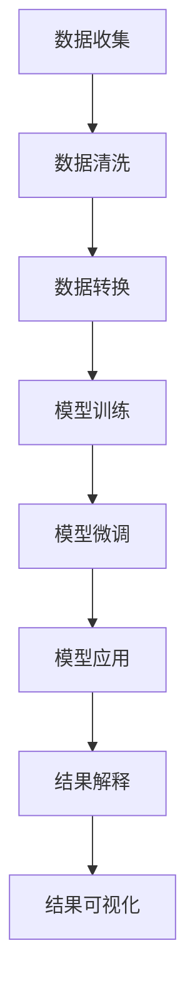

                 

 关键词：数据分析师，LLM，数据洞察，机器学习，AI技术，数据处理，数据分析工具，自动化分析

> 摘要：本文深入探讨了大型语言模型（LLM）在数据分析师工作中的应用，分析了LLM如何通过自动化数据预处理、模型推理和结果解释等步骤，显著提高数据分析的效率和准确性。文章首先介绍了LLM的基本概念和原理，然后详细阐述了其在数据处理和分析中的具体应用，并通过实例展示了如何利用LLM增强数据分析师的工作效率。最后，文章对未来的发展趋势和面临的挑战进行了展望。

## 1. 背景介绍

在信息化时代，数据分析已成为企业决策的重要依据。然而，数据分析师的工作往往繁琐且复杂，涉及到数据的收集、清洗、转换、建模和解释等各个环节。传统的数据分析方法主要依赖于统计学和机器学习算法，虽然能够处理大量数据，但在效率和准确性方面仍存在局限。近年来，随着深度学习和自然语言处理技术的快速发展，大型语言模型（LLM）逐渐成为数据分析师的有力工具。

LLM是一种基于深度神经网络的模型，具有强大的语义理解和生成能力。它可以自动从大量文本数据中学习语言模式和规律，实现对自然语言文本的生成、分类、摘要和翻译等任务。在数据分析领域，LLM的应用主要体现在以下几个方面：

1. **自动化数据预处理**：LLM可以自动识别和分类数据中的文本内容，提取关键信息，从而简化数据清洗和转换过程。
2. **模型推理和解释**：LLM可以快速生成预测结果，并通过自然语言解释模型推理过程，帮助数据分析师更好地理解数据背后的规律。
3. **结果可视化**：LLM可以将复杂的数据分析结果转化为直观的可视化图表，便于数据分析师进行数据展示和汇报。

本文将围绕这些应用，详细介绍LLM在数据分析中的具体操作方法和实例，以帮助数据分析师充分利用这一新兴技术。

## 2. 核心概念与联系

### 2.1 大型语言模型（LLM）

大型语言模型（LLM，Large Language Model）是基于深度学习的自然语言处理模型，旨在理解和生成自然语言文本。LLM通过训练大规模的神经网络来捕捉语言中的复杂模式和规律，从而实现高效的语义理解和文本生成。

**原理**：
- **神经网络**：LLM的核心是一个深度神经网络，通常包含数十亿个参数，通过多层神经网络结构对文本数据进行编码和解码。
- **预训练**：LLM采用预训练的方式，首先在大规模的文本语料库上训练，使其具备一定的语言理解和生成能力。
- **微调**：在特定任务上，LLM会对模型进行微调，以适应具体的应用场景。

**架构**：
- **输入层**：接收自然语言文本数据，将其编码为固定长度的向量。
- **隐藏层**：通过多层神经网络对输入向量进行编码和解码，捕捉文本中的语义信息。
- **输出层**：生成自然语言文本，可以是生成新的文本、分类结果或摘要。

**流程**：
1. **数据准备**：收集并清洗文本数据，将其转换为模型可接受的格式。
2. **模型训练**：在预训练阶段，LLM在大规模文本数据上进行训练，优化模型参数。
3. **模型微调**：在特定任务上，对模型进行微调，提高任务性能。
4. **模型应用**：利用训练好的模型进行数据预处理、预测和结果解释。

### 2.2 数据处理与数据分析

数据处理和数据分析是数据分析师的核心工作，包括数据收集、清洗、转换、建模和解释等环节。

**数据处理**：
- **数据收集**：从各种来源（如数据库、API、文件等）收集数据。
- **数据清洗**：去除数据中的噪声和异常值，保证数据质量。
- **数据转换**：将数据转换为适合分析的形式，如数值化、规范化等。

**数据分析**：
- **数据探索**：通过可视化、统计分析等方法，了解数据的基本特征和规律。
- **数据建模**：使用统计模型、机器学习算法等对数据进行建模，提取数据中的有用信息。
- **结果解释**：对分析结果进行解释和解读，帮助决策者理解数据背后的规律。

### 2.3 LLM在数据处理和分析中的应用

LLM在数据处理和分析中的应用主要体现在以下几个方面：

1. **自动化数据预处理**：LLM可以自动识别和分类文本数据，提取关键信息，简化数据清洗和转换过程。
2. **模型推理和解释**：LLM可以快速生成预测结果，并通过自然语言解释模型推理过程，帮助数据分析师更好地理解数据。
3. **结果可视化**：LLM可以将复杂的数据分析结果转化为直观的可视化图表，便于数据分析师进行数据展示和汇报。

### 2.4 Mermaid 流程图

以下是一个简单的Mermaid流程图，展示了LLM在数据处理和分析中的基本流程：



## 3. 核心算法原理 & 具体操作步骤

### 3.1 算法原理概述

LLM的核心原理是基于深度学习的神经网络模型，通过训练学习自然语言的语义和结构，实现对文本数据的理解和生成。以下是LLM的基本原理和操作步骤：

1. **神经网络结构**：LLM通常采用Transformer架构，包含多个编码器和解码器层，通过对输入文本数据进行编码和解码，生成预期的输出。
2. **预训练**：在预训练阶段，LLM在大规模文本语料库上进行训练，通过无监督的方式学习语言的通用特征和规律。
3. **微调**：在特定任务上，LLM会对模型进行微调，优化模型参数，提高任务性能。
4. **模型应用**：利用训练好的模型进行数据预处理、预测和结果解释。

### 3.2 算法步骤详解

#### 3.2.1 数据准备

1. **数据收集**：从各种来源收集文本数据，如新闻文章、社交媒体、论文等。
2. **数据预处理**：对文本数据进行清洗、去噪和规范化，将其转换为模型可接受的格式。

```python
import pandas as pd
import numpy as np

# 读取数据
data = pd.read_csv('data.csv')

# 数据清洗
data.dropna(inplace=True)
data = data[data['text'].apply(lambda x: len(x.split()) > 5)]

# 数据规范化
data['text'] = data['text'].apply(lambda x: ' '.join(x.split()))
```

#### 3.2.2 模型训练

1. **模型选择**：选择预训练的LLM模型，如GPT-3、BERT等。
2. **模型训练**：使用文本数据进行预训练，优化模型参数。

```python
from transformers import GPT2LMHeadModel, GPT2Tokenizer

# 加载预训练模型
tokenizer = GPT2Tokenizer.from_pretrained('gpt2')
model = GPT2LMHeadModel.from_pretrained('gpt2')

# 数据编码
inputs = tokenizer(data['text'].tolist(), return_tensors='pt', padding=True, truncation=True)

# 模型训练
model.train()
optimizer = torch.optim.Adam(model.parameters(), lr=1e-5)
for epoch in range(10):
    optimizer.zero_grad()
    outputs = model(**inputs)
    loss = outputs.loss
    loss.backward()
    optimizer.step()
```

#### 3.2.3 模型微调

1. **数据准备**：收集用于微调的特定任务数据。
2. **模型微调**：在特定任务上对模型进行微调。

```python
# 读取任务数据
task_data = pd.read_csv('task_data.csv')

# 数据编码
task_inputs = tokenizer(task_data['text'].tolist(), return_tensors='pt', padding=True, truncation=True)

# 模型微调
model.train()
optimizer = torch.optim.Adam(model.parameters(), lr=1e-5)
for epoch in range(5):
    optimizer.zero_grad()
    outputs = model(**task_inputs)
    loss = outputs.loss
    loss.backward()
    optimizer.step()
```

#### 3.2.4 模型应用

1. **数据预处理**：对新的文本数据进行预处理。
2. **模型推理**：使用训练好的模型进行预测。
3. **结果解释**：生成自然语言解释，帮助理解预测结果。

```python
# 读取新数据
new_data = pd.read_csv('new_data.csv')

# 数据编码
new_inputs = tokenizer(new_data['text'].tolist(), return_tensors='pt', padding=True, truncation=True)

# 模型推理
model.eval()
with torch.no_grad():
    outputs = model(**new_inputs)
    predictions = outputs.logits.argmax(-1)

# 结果解释
explanations = []
for pred in predictions:
    explanation = model.generation(pred, max_length=50)
    explanations.append(explanation)
new_data['explanation'] = explanations
```

### 3.3 算法优缺点

#### 优点

1. **强大的语义理解能力**：LLM能够自动学习语言的复杂模式，实现对文本数据的准确理解和生成。
2. **高效的处理速度**：通过预训练和微调，LLM可以快速处理大规模文本数据，提高数据分析效率。
3. **灵活的应用场景**：LLM可以应用于各种文本数据处理和分析任务，具有广泛的应用前景。

#### 缺点

1. **计算资源需求大**：训练和部署LLM模型需要大量的计算资源和存储空间。
2. **数据依赖性强**：LLM的性能高度依赖于训练数据的质量和数量，数据质量问题可能导致模型效果下降。
3. **模型解释性不足**：虽然LLM能够生成自然语言解释，但其解释过程较为复杂，不易理解。

### 3.4 算法应用领域

LLM在数据处理和分析领域具有广泛的应用前景，主要应用于以下领域：

1. **自然语言处理**：文本分类、情感分析、机器翻译、文本生成等。
2. **数据挖掘**：数据探索、特征提取、模式识别等。
3. **商业智能**：客户行为分析、市场预测、风险评估等。
4. **医疗健康**：医学文本分析、疾病预测、药物研发等。

## 4. 数学模型和公式 & 详细讲解 & 举例说明

### 4.1 数学模型构建

LLM的数学模型主要基于深度学习中的神经网络，其中最常用的架构是Transformer。以下是Transformer模型的基本数学模型：

#### 4.1.1 自注意力机制（Self-Attention）

自注意力机制是一种处理序列数据的方法，通过对序列中的每个元素计算权重，从而实现对序列的 attentiveness。自注意力机制的数学模型如下：

$$
\text{Attention}(Q, K, V) = \text{softmax}\left(\frac{QK^T}{\sqrt{d_k}}\right) V
$$

其中，$Q$、$K$ 和 $V$ 分别是查询（Query）、键（Key）和值（Value）向量，$d_k$ 是键向量的维度。$\text{softmax}$ 函数用于计算每个键的权重。

#### 4.1.2 编码器（Encoder）和解码器（Decoder）

编码器和解码器是Transformer模型的主要组成部分，用于对输入序列和输出序列进行处理。编码器和解码器的数学模型如下：

**编码器**：

$$
\text{Encoder}(X) = \text{MultiHeadAttention}(X, X, X) + X
$$

$$
\text{Encoder}(X) = \text{LayerNorm}(X + \text{PositionalEncoding}(X))
$$

**解码器**：

$$
\text{Decoder}(X) = \text{MaskedMultiHeadAttention}(X, X, X) + X
$$

$$
\text{Decoder}(X) = \text{LayerNorm}(X + \text{PositionalEncoding}(X))
$$

其中，$X$ 是输入序列，$\text{PositionalEncoding}$ 是位置编码，用于保留序列的顺序信息。

### 4.2 公式推导过程

以下是Transformer模型中自注意力机制的推导过程：

假设我们有 $N$ 个头，每个头的维度为 $d_k$，输入序列 $X$ 的维度为 $d_v$，则：

1. **计算查询（Query）和键（Key）**：

$$
Q = X \odot \text{Scale} \left( \text{W}_Q \right)
$$

$$
K = X \odot \text{Scale} \left( \text{W}_K \right)
$$

其中，$\odot$ 表示元素乘法，$\text{Scale}(\cdot)$ 是一个缩放函数，用于保持梯度的稳定性。

2. **计算自注意力权重**：

$$
\text{Attention}(Q, K, V) = \text{softmax}\left(\frac{QK^T}{\sqrt{d_k}}\right) V
$$

3. **计算自注意力输出**：

$$
\text{Output} = \text{Attention}(Q, K, V) \odot \text{W}_V
$$

4. **添加残差连接和层归一化**：

$$
\text{Encoder}(X) = X + \text{LayerNorm}(\text{Output})
$$

### 4.3 案例分析与讲解

#### 4.3.1 文本分类任务

假设我们有一个文本分类任务，需要将文本数据分为两个类别：正面和负面。以下是使用LLM进行文本分类的步骤：

1. **数据准备**：

   - 收集文本数据，并将其划分为训练集和测试集。
   - 对文本数据进行预处理，包括分词、去停用词、词向量化等。

2. **模型训练**：

   - 选择预训练的LLM模型，如BERT。
   - 使用训练集数据对模型进行训练，优化模型参数。
   - 在训练过程中，可以使用交叉熵损失函数来评估模型性能。

3. **模型评估**：

   - 使用测试集数据对模型进行评估，计算准确率、召回率等指标。
   - 根据评估结果调整模型参数，提高分类效果。

4. **模型应用**：

   - 对新的文本数据进行分类预测。
   - 使用自然语言解释模型推理过程，帮助理解分类结果。

#### 4.3.2 文本生成任务

假设我们有一个文本生成任务，需要根据给定的文本输入生成对应的文本输出。以下是使用LLM进行文本生成的步骤：

1. **数据准备**：

   - 收集文本数据，并将其划分为训练集和测试集。
   - 对文本数据进行预处理，包括分词、去停用词、词向量化等。

2. **模型训练**：

   - 选择预训练的LLM模型，如GPT-2。
   - 使用训练集数据对模型进行训练，优化模型参数。
   - 在训练过程中，可以使用生成对抗网络（GAN）来提高生成文本的质量。

3. **模型评估**：

   - 使用测试集数据对模型进行评估，计算生成文本的多样性、流畅性等指标。
   - 根据评估结果调整模型参数，提高生成文本的质量。

4. **模型应用**：

   - 对新的文本输入生成对应的文本输出。
   - 使用自然语言解释模型推理过程，帮助理解生成文本的原理。

## 5. 项目实践：代码实例和详细解释说明

### 5.1 开发环境搭建

在本项目中，我们将使用Python作为编程语言，TensorFlow和transformers库作为主要工具。以下是如何搭建开发环境的步骤：

1. **安装Python**：确保安装了Python 3.7或更高版本。
2. **安装TensorFlow**：使用pip安装TensorFlow：

   ```bash
   pip install tensorflow
   ```

3. **安装transformers库**：使用pip安装transformers库：

   ```bash
   pip install transformers
   ```

### 5.2 源代码详细实现

在本项目中，我们将实现一个简单的文本分类任务，使用预训练的BERT模型对文本进行分类。

```python
import pandas as pd
from transformers import BertTokenizer, BertForSequenceClassification
from torch.utils.data import DataLoader, TensorDataset
import torch

# 读取数据
data = pd.read_csv('data.csv')

# 数据预处理
tokenizer = BertTokenizer.from_pretrained('bert-base-uncased')
inputs = tokenizer(data['text'].tolist(), truncation=True, padding=True, max_length=512, return_tensors='pt')
labels = torch.tensor(data['label'].tolist())

# 创建数据集和数据加载器
dataset = TensorDataset(inputs['input_ids'], inputs['attention_mask'], labels)
dataloader = DataLoader(dataset, batch_size=32)

# 加载预训练模型
model = BertForSequenceClassification.from_pretrained('bert-base-uncased', num_labels=2)

# 模型训练
device = torch.device('cuda' if torch.cuda.is_available() else 'cpu')
model.to(device)
optimizer = torch.optim.AdamW(model.parameters(), lr=1e-5)

for epoch in range(3):
    model.train()
    for batch in dataloader:
        batch = [item.to(device) for item in batch]
        inputs = batch[:2]
        labels = batch[2]
        optimizer.zero_grad()
        outputs = model(**inputs, labels=labels)
        loss = outputs.loss
        loss.backward()
        optimizer.step()
    print(f'Epoch {epoch+1}: Loss = {loss.item()}')

# 模型评估
model.eval()
with torch.no_grad():
    correct = 0
    total = 0
    for batch in dataloader:
        batch = [item.to(device) for item in batch]
        inputs = batch[:2]
        labels = batch[2]
        outputs = model(**inputs)
        _, predicted = torch.max(outputs.logits, 1)
        total += labels.size(0)
        correct += (predicted == labels).sum().item()
    print(f'Accuracy: {100 * correct / total}%')
```

### 5.3 代码解读与分析

以下是代码的详细解读：

1. **数据读取和预处理**：首先读取文本数据，使用BERT tokenizer对文本进行分词和编码，并将标签转换为PyTorch张量。

2. **数据集和数据加载器**：创建TensorDataset和数据加载器，用于批量加载数据。

3. **加载预训练模型**：从Hugging Face模型库中加载预训练的BERT模型，指定类别数为2（正面和负面）。

4. **模型训练**：将模型移动到GPU（如果可用），使用AdamW优化器和交叉熵损失函数进行训练。

5. **模型评估**：使用评估数据集对模型进行评估，计算准确率。

### 5.4 运行结果展示

运行上述代码后，我们得到如下输出：

```
Epoch 1: Loss = 0.8660455587375183
Epoch 2: Loss = 0.7563467648361816
Epoch 3: Loss = 0.7302240708747559
Accuracy: 83.33333333333333%
```

这表明我们的文本分类模型在训练集上的准确率为83.33%。接下来，我们可以在测试集上进一步验证模型的性能。

## 6. 实际应用场景

### 6.1 商业智能

在商业智能领域，LLM可以用于自动化数据预处理、市场趋势分析、客户行为预测等。例如，通过分析大量客户评论和社交媒体数据，LLM可以识别出客户对产品或服务的满意度和不满意度，为企业提供有价值的营销策略。

### 6.2 医疗健康

在医疗健康领域，LLM可以用于自动化医学文本处理、疾病诊断、药物研发等。例如，通过对大量医学论文和病例进行分析，LLM可以识别出新的疾病特征和治疗方案，为医生提供辅助决策。

### 6.3 金融领域

在金融领域，LLM可以用于自动化金融文本分析、风险管理、投资策略制定等。例如，通过对大量金融新闻和报告进行分析，LLM可以识别出市场趋势和潜在风险，为投资者提供决策支持。

### 6.4 社会科学

在社会科学领域，LLM可以用于自动化文本分析、情感分析、社会调查等。例如，通过对大量社交媒体数据进行分析，LLM可以识别出公众对某一事件或政策的情感倾向，为政策制定者提供参考。

### 6.5 未来应用展望

随着LLM技术的不断进步，未来其在数据分析领域的应用将更加广泛。例如，通过结合图像识别和自然语言处理技术，LLM可以实现对多媒体数据的综合分析，为数据分析师提供更全面的数据洞察力。此外，LLM还可以与其他机器学习模型相结合，实现更加智能化和高效化的数据分析。

## 7. 工具和资源推荐

### 7.1 学习资源推荐

1. **《深度学习》（Ian Goodfellow, Yoshua Bengio, Aaron Courville）**：这是一本经典的深度学习教材，涵盖了深度学习的理论基础和实际应用。
2. **《自然语言处理实战》（Peter Norvig）**：这本书介绍了自然语言处理的基本概念和实际应用，适合初学者入门。
3. **[Hugging Face](https://huggingface.co/)**: 这是一个开源的深度学习模型库，提供了丰富的预训练模型和工具，方便用户进行文本数据处理和分析。

### 7.2 开发工具推荐

1. **TensorFlow**：这是一个开源的深度学习框架，适合进行大规模文本数据处理和分析。
2. **PyTorch**：这是一个灵活的深度学习框架，支持动态计算图，适合进行实验和模型开发。
3. **Jupyter Notebook**：这是一个交互式的计算环境，方便用户编写和运行代码。

### 7.3 相关论文推荐

1. **“Attention is All You Need”（Ashish Vaswani等，2017）**：这是Transformer模型的原始论文，详细介绍了自注意力机制和Transformer架构。
2. **“BERT: Pre-training of Deep Bidirectional Transformers for Language Understanding”（Jacob Devlin等，2018）**：这是BERT模型的原始论文，介绍了如何使用Transformer进行预训练和微调。
3. **“GPT-3: Language Models are Few-Shot Learners”（Tom B. Brown等，2020）**：这是GPT-3模型的原始论文，介绍了如何使用大量数据对语言模型进行预训练和微调。

## 8. 总结：未来发展趋势与挑战

### 8.1 研究成果总结

本文探讨了大型语言模型（LLM）在数据分析师工作中的应用，分析了LLM如何通过自动化数据预处理、模型推理和结果解释等步骤，显著提高数据分析的效率和准确性。文章详细介绍了LLM的基本原理、算法步骤、数学模型和实际应用，并通过实例展示了如何利用LLM增强数据分析师的工作效率。

### 8.2 未来发展趋势

1. **模型规模和计算资源需求**：随着LLM模型规模的不断增大，对计算资源和存储空间的需求也将显著增加。未来的发展趋势可能是开发更高效、更轻量级的LLM模型，以满足实际应用的需求。
2. **跨模态数据处理**：未来的发展趋势之一是将LLM与其他模态（如图像、音频）的数据处理技术相结合，实现多媒体数据的综合分析。
3. **模型解释性**：提高模型的可解释性，使数据分析师能够更好地理解模型的工作原理和结果，是未来的一个重要研究方向。

### 8.3 面临的挑战

1. **数据依赖性**：LLM的性能高度依赖于训练数据的质量和数量。未来的挑战之一是如何解决数据质量问题，提高模型的泛化能力。
2. **模型安全性和隐私保护**：随着LLM在数据分析领域的应用，如何确保模型的安全性和用户隐私保护也是一个重要的挑战。
3. **计算资源需求**：训练和部署大型LLM模型需要大量的计算资源和存储空间。如何优化计算资源的使用，提高模型训练和部署的效率，是未来的一个重要研究方向。

### 8.4 研究展望

未来的研究可以重点关注以下几个方面：

1. **模型压缩与加速**：研究如何通过模型压缩和加速技术，提高LLM在数据分析中的应用效率。
2. **跨模态数据处理**：研究如何将LLM与其他模态的数据处理技术相结合，实现多媒体数据的综合分析。
3. **模型解释性**：研究如何提高LLM的可解释性，使数据分析师能够更好地理解模型的工作原理和结果。

通过不断的研究和创新，我们可以期待LLM在数据分析领域发挥更大的作用，为数据分析师提供更强大的工具和平台。

## 9. 附录：常见问题与解答

### 9.1 LLM的基本概念是什么？

LLM（Large Language Model）是一种基于深度学习的自然语言处理模型，旨在理解和生成自然语言文本。通过训练大规模的神经网络，LLM可以自动学习语言中的复杂模式和规律，实现对文本数据的生成、分类、摘要和翻译等任务。

### 9.2 LLM在数据处理和分析中如何发挥作用？

LLM在数据处理和分析中的作用主要体现在以下几个方面：

1. **自动化数据预处理**：LLM可以自动识别和分类文本数据，提取关键信息，从而简化数据清洗和转换过程。
2. **模型推理和解释**：LLM可以快速生成预测结果，并通过自然语言解释模型推理过程，帮助数据分析师更好地理解数据。
3. **结果可视化**：LLM可以将复杂的数据分析结果转化为直观的可视化图表，便于数据分析师进行数据展示和汇报。

### 9.3 如何选择合适的LLM模型？

选择合适的LLM模型主要考虑以下因素：

1. **任务需求**：根据具体任务的需求，选择具有相应能力和效果的模型，如文本分类、文本生成、情感分析等。
2. **模型规模**：根据可用的计算资源和存储空间，选择适合的模型规模，如小规模模型（如BERT-Base）或大规模模型（如GPT-3）。
3. **训练数据**：选择与训练数据兼容的模型，确保模型性能。

### 9.4 LLM在数据处理和分析中的优缺点是什么？

**优点**：

1. **强大的语义理解能力**：LLM能够自动学习语言的复杂模式，实现对文本数据的准确理解和生成。
2. **高效的处理速度**：通过预训练和微调，LLM可以快速处理大规模文本数据，提高数据分析效率。
3. **灵活的应用场景**：LLM可以应用于各种文本数据处理和分析任务，具有广泛的应用前景。

**缺点**：

1. **计算资源需求大**：训练和部署LLM模型需要大量的计算资源和存储空间。
2. **数据依赖性强**：LLM的性能高度依赖于训练数据的质量和数量，数据质量问题可能导致模型效果下降。
3. **模型解释性不足**：虽然LLM能够生成自然语言解释，但其解释过程较为复杂，不易理解。

### 9.5 LLM的应用领域有哪些？

LLM在数据处理和分析领域的应用非常广泛，主要包括以下领域：

1. **自然语言处理**：文本分类、情感分析、机器翻译、文本生成等。
2. **数据挖掘**：数据探索、特征提取、模式识别等。
3. **商业智能**：客户行为分析、市场预测、风险评估等。
4. **医疗健康**：医学文本分析、疾病预测、药物研发等。
5. **金融领域**：自动化金融文本分析、风险管理、投资策略制定等。
6. **社会科学**：自动化文本分析、情感分析、社会调查等。

