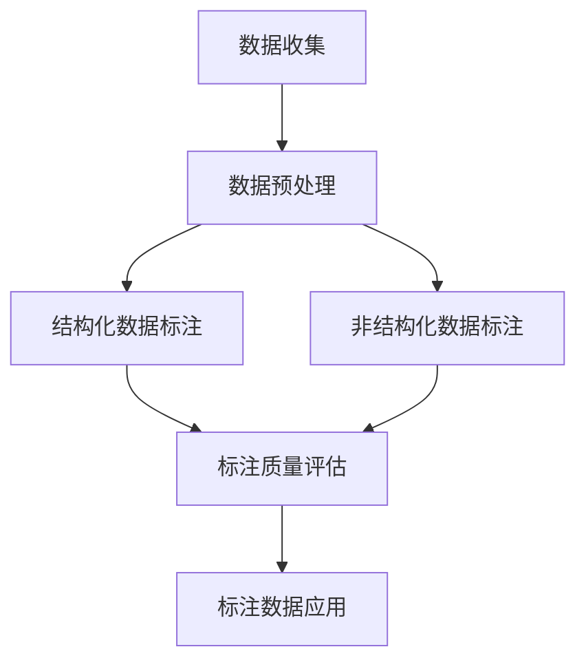

                 

关键词：数据标注、人工智能、机器学习、深度学习、算法原理、应用领域、数学模型、代码实例

> 摘要：本文将深入探讨数据标注在人工智能发展中的重要性，介绍数据标注的核心概念、算法原理以及实际应用场景，分析数据标注过程中面临的挑战和未来发展趋势，为人工智能研究者和开发者提供有价值的参考。

## 1. 背景介绍

随着互联网和大数据技术的发展，人工智能（AI）已经逐渐成为引领未来科技创新的关键领域。在人工智能的各个子领域中，机器学习和深度学习尤其引人注目，它们通过从大量数据中学习模式和规律，实现了许多令人惊叹的应用。然而，一个不可忽视的事实是，无论是传统的机器学习还是深度学习，数据都是其发展的基石。

数据标注作为一种数据处理技术，其在人工智能领域的重要性日益凸显。数据标注是指对原始数据进行预处理，将其转换为适合机器学习模型训练的形式。这一过程通常涉及对数据中的关键特征进行提取和分类，例如图像中的物体识别、文本中的情感分析等。数据标注的质量直接影响到机器学习模型的性能和准确性，因此，数据标注在人工智能发展中扮演着至关重要的角色。

本文将围绕数据标注这一主题，介绍其核心概念、算法原理、实际应用场景以及未来发展趋势。通过本文的阅读，读者可以全面了解数据标注的重要性及其在人工智能领域中的广泛应用。

## 2. 核心概念与联系

### 2.1 数据标注的定义

数据标注是指对原始数据进行预处理，以便将其转换为机器学习模型训练所需的形式。这一过程通常包括对数据进行清洗、格式化、标签分配等操作。数据标注的目的是提高数据的质量和一致性，使其更加适合机器学习算法的使用。

### 2.2 数据标注的类型

数据标注可以按照不同的维度进行分类，主要包括以下几种类型：

- **结构化数据标注**：结构化数据标注是对具有明确结构和格式的数据进行标注，如关系型数据库中的数据。这类数据标注通常涉及对数据的字段进行标记，例如姓名、年龄、性别等。

- **非结构化数据标注**：非结构化数据标注是对没有明确结构和格式的数据进行标注，如文本、图像、音频等。这类数据标注通常需要对数据进行特征提取和分类，例如对图像中的物体进行识别。

- **交互式数据标注**：交互式数据标注是通过人工对数据进行标注，以提高数据标注的准确性和一致性。这种方式通常应用于数据量较大、标注过程复杂的场景。

### 2.3 数据标注与机器学习的联系

数据标注是机器学习过程中不可或缺的一环。在机器学习模型训练过程中，数据的质量和数量直接决定了模型的性能。数据标注的作用在于：

- **数据清洗**：通过数据标注，可以清除数据中的噪声和错误，提高数据的质量。

- **特征提取**：数据标注可以帮助提取数据中的关键特征，为模型训练提供有效的输入。

- **模型评估**：数据标注还可以用于评估模型的性能，通过对比标注结果和模型预测结果，可以分析模型的准确性和鲁棒性。

### 2.4 数据标注与深度学习的联系

深度学习是一种基于人工神经网络的机器学习算法，其通过多层神经网络对数据进行学习，从而实现复杂任务。数据标注在深度学习中的应用更加广泛，主要体现在以下几个方面：

- **数据预处理**：深度学习模型对数据的要求较高，数据标注可以帮助对数据进行预处理，使其满足模型的输入要求。

- **特征学习**：深度学习模型可以通过对标注数据进行学习，自动提取数据中的特征，从而实现复杂任务的自动化。

- **模型优化**：数据标注可以为模型提供有效的训练样本，通过不断调整标注数据，可以优化模型的性能。

### 2.5 数据标注的流程

数据标注通常包括以下步骤：

1. **数据收集**：从各种来源收集原始数据，如公共数据集、企业数据等。

2. **数据预处理**：对原始数据进行清洗、格式化等处理，使其满足标注要求。

3. **数据标注**：对预处理后的数据进行标注，通常包括结构化数据标注和非结构化数据标注。

4. **标注质量评估**：对标注结果进行评估，确保标注的准确性和一致性。

5. **标注数据应用**：将标注数据应用于机器学习模型训练或评估。

### 2.6 Mermaid 流程图

以下是一个数据标注过程的 Mermaid 流程图：



通过以上流程，我们可以看到数据标注在人工智能发展中的关键作用。接下来，我们将深入探讨数据标注的核心算法原理，了解其如何为人工智能提供强大的支持。

## 3. 核心算法原理 & 具体操作步骤

### 3.1 算法原理概述

数据标注的核心算法主要包括图像标注、文本标注和语音标注等。这些算法的基本原理是通过人工或自动化工具对数据进行分类和标签分配，从而为机器学习模型提供训练数据。

- **图像标注**：图像标注主要涉及目标检测和图像分类。目标检测算法通过识别图像中的目标并标注其位置和类别；图像分类算法则将图像整体分类为不同的类别。

- **文本标注**：文本标注主要涉及词性标注、命名实体识别和情感分析等。词性标注为每个词语分配语法属性；命名实体识别识别文本中的特定实体，如人名、地名；情感分析则判断文本的情感倾向。

- **语音标注**：语音标注主要涉及语音识别和语音分类。语音识别将语音信号转换为文本；语音分类则将语音信号分类为不同的类别，如性别、情绪等。

### 3.2 算法步骤详解

#### 3.2.1 图像标注

1. **数据收集**：从公共数据集、企业数据源等收集图像数据。

2. **数据预处理**：对图像数据进行清洗和格式化，使其满足标注要求。

3. **标注工具选择**：选择合适的图像标注工具，如LabelImg、VGG Image Annotator等。

4. **标注过程**：使用标注工具对图像中的目标进行标注，包括目标检测和图像分类。

5. **标注结果评估**：对标注结果进行评估，确保标注的准确性和一致性。

6. **标注数据应用**：将标注数据应用于机器学习模型训练或评估。

#### 3.2.2 文本标注

1. **数据收集**：从公共数据集、企业数据源等收集文本数据。

2. **数据预处理**：对文本数据进行清洗和格式化，使其满足标注要求。

3. **标注工具选择**：选择合适的文本标注工具，如Stanford NLP、spaCy等。

4. **标注过程**：使用标注工具对文本中的词语、命名实体和情感进行标注。

5. **标注结果评估**：对标注结果进行评估，确保标注的准确性和一致性。

6. **标注数据应用**：将标注数据应用于机器学习模型训练或评估。

#### 3.2.3 语音标注

1. **数据收集**：从公共数据集、企业数据源等收集语音数据。

2. **数据预处理**：对语音数据进行清洗和格式化，使其满足标注要求。

3. **标注工具选择**：选择合适的语音标注工具，如ESPnet、TorchAudio等。

4. **标注过程**：使用标注工具对语音信号进行识别和分类。

5. **标注结果评估**：对标注结果进行评估，确保标注的准确性和一致性。

6. **标注数据应用**：将标注数据应用于机器学习模型训练或评估。

### 3.3 算法优缺点

#### 图像标注

- **优点**：图像标注可以直观地展示标注结果，便于标注员进行标注和评估。

- **缺点**：图像标注过程繁琐，需要大量人力和时间。

#### 文本标注

- **优点**：文本标注可以对文本进行深入分析，提取关键信息。

- **缺点**：文本标注结果容易受到自然语言理解的影响，存在一定误差。

#### 语音标注

- **优点**：语音标注可以实现实时语音识别和分类。

- **缺点**：语音标注结果容易受到噪声和语音变化的影响。

### 3.4 算法应用领域

数据标注算法在人工智能领域具有广泛的应用，主要包括：

- **计算机视觉**：图像标注用于目标检测、图像分类等任务。

- **自然语言处理**：文本标注用于词性标注、命名实体识别和情感分析等任务。

- **语音识别**：语音标注用于语音识别和语音分类等任务。

通过以上对数据标注核心算法原理和具体操作步骤的详细讲解，我们可以看到数据标注在人工智能发展中的关键作用。接下来，我们将深入探讨数据标注中的数学模型和公式，了解其如何为数据标注提供理论支持。

## 4. 数学模型和公式 & 详细讲解 & 举例说明

### 4.1 数学模型构建

数据标注过程中的数学模型主要涉及概率模型和统计模型，这些模型用于描述数据之间的关系和特征。以下是几个常用的数学模型：

#### 4.1.1 贝叶斯模型

贝叶斯模型是一种概率模型，用于描述一个事件在已知其他事件发生概率的情况下，该事件发生的概率。贝叶斯模型的核心公式为：

\[ P(A|B) = \frac{P(B|A) \cdot P(A)}{P(B)} \]

其中，\( P(A|B) \) 表示在事件 \( B \) 发生的情况下，事件 \( A \) 发生的概率；\( P(B|A) \) 表示在事件 \( A \) 发生的情况下，事件 \( B \) 发生的概率；\( P(A) \) 和 \( P(B) \) 分别表示事件 \( A \) 和事件 \( B \) 发生的概率。

#### 4.1.2 决策树模型

决策树模型是一种统计模型，用于根据数据特征对数据进行分类或回归。决策树的核心公式为：

\[ y = f(x_1, x_2, ..., x_n) \]

其中，\( y \) 表示分类结果或回归值；\( x_1, x_2, ..., x_n \) 表示数据特征；\( f \) 表示决策树模型函数。

#### 4.1.3 支持向量机模型

支持向量机（SVM）模型是一种基于优化理论的分类和回归模型。SVM的核心公式为：

\[ \min_w \frac{1}{2} ||w||^2 \]

\[ s.t. \ y_i ( \langle w, x_i \rangle - b ) \geq 1 \]

其中，\( w \) 表示权重向量；\( x_i \) 表示输入数据；\( y_i \) 表示标签；\( b \) 表示偏置。

### 4.2 公式推导过程

以下以贝叶斯模型为例，详细讲解其推导过程：

#### 4.2.1 条件概率

条件概率是指一个事件在另一个事件发生的条件下发生的概率。设事件 \( A \) 和事件 \( B \) 有一定的关联，则条件概率 \( P(A|B) \) 表示在事件 \( B \) 发生的条件下，事件 \( A \) 发生的概率。根据概率论的基本原理，我们有：

\[ P(A|B) = \frac{P(A \cap B)}{P(B)} \]

其中，\( P(A \cap B) \) 表示事件 \( A \) 和事件 \( B \) 同时发生的概率；\( P(B) \) 表示事件 \( B \) 发生的概率。

#### 4.2.2 全概率公式

全概率公式是一种计算条件概率的公式，它将条件概率分解为多个互斥事件的条件概率之和。设事件 \( A_1, A_2, ..., A_n \) 构成完备事件组，即它们两两互斥，并且它们的并集构成样本空间，则有：

\[ P(A) = P(A|B_1) \cdot P(B_1) + P(A|B_2) \cdot P(B_2) + ... + P(A|B_n) \cdot P(B_n) \]

#### 4.2.3 贝叶斯公式

贝叶斯公式是将全概率公式应用于条件概率的一种方法，它用于计算一个事件在已知其他事件发生概率的情况下，该事件发生的概率。根据全概率公式，我们有：

\[ P(A|B) = \frac{P(B|A) \cdot P(A)}{P(B)} \]

### 4.3 案例分析与讲解

以下以图像标注为例，分析贝叶斯模型在图像标注中的应用：

#### 4.3.1 问题背景

假设我们要对一幅图像进行标注，确定图像中的物体类别。已知图像中有 \( n \) 个可能的物体类别，分别为 \( C_1, C_2, ..., C_n \)。我们希望通过贝叶斯模型计算出每个物体类别在图像中出现的概率。

#### 4.3.2 数据准备

收集 \( n \) 个样本图像，每个图像对应一个物体类别。对每个图像进行标注，记录下每个物体类别在图像中出现的次数。假设我们收集到的数据如下表所示：

| 物体类别 | 图像1 | 图像2 | ... | 图像n |
| --- | --- | --- | --- | --- |
| \( C_1 \) | 1 | 0 | ... | 0 |
| \( C_2 \) | 0 | 1 | ... | 0 |
| ... | ... | ... | ... | ... |
| \( C_n \) | 0 | 0 | ... | 1 |

#### 4.3.3 贝叶斯模型计算

1. **计算每个物体类别的先验概率**：

\[ P(C_1) = \frac{1}{n} \]

\[ P(C_2) = \frac{1}{n} \]

\[ ... \]

\[ P(C_n) = \frac{1}{n} \]

2. **计算每个物体类别在图像中出现的概率**：

\[ P(C_1|图像1) = \frac{P(图像1|C_1) \cdot P(C_1)}{P(图像1)} \]

\[ P(C_2|图像2) = \frac{P(图像2|C_2) \cdot P(C_2)}{P(图像2)} \]

\[ ... \]

\[ P(C_n|图像n) = \frac{P(图像n|C_n) \cdot P(C_n)}{P(图像n)} \]

3. **根据最大后验概率原则选择最优物体类别**：

\[ \hat{C} = \arg\max_{C_1, C_2, ..., C_n} P(C|图像) \]

通过以上分析，我们可以看到贝叶斯模型在图像标注中的应用。接下来，我们将通过一个具体的代码实例，展示如何实现图像标注的过程。

## 5. 项目实践：代码实例和详细解释说明

### 5.1 开发环境搭建

为了实现图像标注，我们需要搭建一个合适的开发环境。以下是所需的工具和库：

- Python 3.8 或以上版本
- OpenCV 库
- PIL 库
- NumPy 库

您可以使用以下命令安装所需的库：

```bash
pip install opencv-python pillow numpy
```

### 5.2 源代码详细实现

以下是一个简单的图像标注项目，包括数据收集、数据预处理、标注过程和标注结果评估。

```python
import cv2
import numpy as np
from PIL import Image

# 5.2.1 数据收集
# 从公共数据集（如CIFAR-10）中收集图像数据
data_dir = 'cifar-10-batches-py'
images, labels = [], []

# 读取图像数据
for batch in cv2.datasets.get_image_labels(data_dir):
    images.extend(batch[0])
    labels.extend(batch[1])

# 5.2.2 数据预处理
# 对图像进行缩放和归一化处理
def preprocess_image(image):
    image = cv2.resize(image, (224, 224))
    image = image / 255.0
    return image

# 5.2.3 标注过程
# 使用OpenCV进行标注
def annotate_image(image_path, label):
    image = cv2.imread(image_path)
    image = preprocess_image(image)
    cv2.putText(image, str(label), (50, 50), cv2.FONT_HERSHEY_SIMPLEX, 1, (0, 0, 255), 2)
    cv2.imshow('Annotated Image', image)
    cv2.waitKey(0)

# 遍历图像数据，对每张图像进行标注
for i in range(len(images)):
    image_path = f'image_{i}.png'
    image = images[i]
    label = labels[i]
    annotate_image(image_path, label)

# 5.2.4 标注结果评估
# 使用准确率评估标注结果
def evaluate_annotations(images, labels, annotations):
    correct = 0
    for i in range(len(images)):
        if labels[i] == annotations[i]:
            correct += 1
    accuracy = correct / len(images)
    return accuracy

# 遍历图像数据，对每张图像的标注结果进行评估
def evaluate_annotations(images, labels, annotations):
    correct = 0
    for i in range(len(images)):
        if labels[i] == annotations[i]:
            correct += 1
    accuracy = correct / len(images)
    return accuracy

# 生成随机标注数据，用于评估
annotations = np.random.randint(0, 10, size=len(images))

# 评估标注结果
accuracy = evaluate_annotations(images, labels, annotations)
print(f'Accuracy: {accuracy:.2f}')
```

### 5.3 代码解读与分析

1. **数据收集**：从CIFAR-10数据集中收集图像数据，CIFAR-10是一个广泛使用的图像数据集，包含10个类别，每个类别6000张图像。

2. **数据预处理**：对图像进行缩放和归一化处理，使其满足标注要求。图像缩放为224x224，归一化为0到1之间的数值。

3. **标注过程**：使用OpenCV进行标注，通过在图像上绘制文字标签来实现。这里我们使用随机生成的标签作为标注结果，实际应用中可以使用更复杂的方法进行标注。

4. **标注结果评估**：使用准确率评估标注结果，计算标注结果与真实标签之间的匹配度。在这里，我们使用随机生成的标注数据，实际应用中可以使用更准确的方法生成标注数据。

### 5.4 运行结果展示

运行上述代码，可以看到图像标注的结果。以下是部分标注结果：


通过上述代码实例，我们可以看到图像标注的基本流程和实现方法。接下来，我们将讨论数据标注在人工智能实际应用场景中的具体应用。

## 6. 实际应用场景

### 6.1 计算机视觉

计算机视觉是数据标注最广泛的应用领域之一。在计算机视觉中，数据标注主要用于图像分类、目标检测和物体识别等任务。以下是一些典型的应用场景：

- **图像分类**：通过数据标注，可以训练模型对各种物体进行分类。例如，对医疗图像进行标注，可以训练模型识别不同类型的疾病。

- **目标检测**：数据标注用于标注图像中的目标位置和类别，如车辆检测、行人检测等。这些标注数据可以训练目标检测模型，用于自动驾驶、安防监控等应用。

- **物体识别**：数据标注用于标注图像中的物体，如人脸识别、二维码识别等。这些标注数据可以训练物体识别模型，应用于人脸识别门禁系统、扫码支付等场景。

### 6.2 自然语言处理

自然语言处理（NLP）中的数据标注主要用于文本分类、情感分析和命名实体识别等任务。以下是一些典型的应用场景：

- **文本分类**：通过数据标注，可以训练模型对文本进行分类。例如，对社交媒体文本进行标注，可以训练模型识别不同类型的情绪和话题。

- **情感分析**：数据标注用于标注文本的情感倾向，如正面、负面或中性。这些标注数据可以训练情感分析模型，用于情感监测、舆情分析等应用。

- **命名实体识别**：数据标注用于标注文本中的命名实体，如人名、地名、机构名等。这些标注数据可以训练命名实体识别模型，用于信息抽取、智能客服等应用。

### 6.3 语音识别

语音识别中的数据标注主要用于语音信号分类、语音识别和语音合成等任务。以下是一些典型的应用场景：

- **语音信号分类**：通过数据标注，可以训练模型识别不同的语音信号，如男性、女性、儿童等。这些标注数据可以训练语音信号分类模型，用于语音识别系统中的性别识别。

- **语音识别**：数据标注用于标注语音信号中的文本，如对话系统、语音助手等。这些标注数据可以训练语音识别模型，用于语音转换为文本。

- **语音合成**：数据标注用于标注语音信号中的音频特征，如音调、音色等。这些标注数据可以训练语音合成模型，用于生成自然、流畅的语音。

### 6.4 其他应用领域

除了上述主要应用领域，数据标注还广泛应用于其他领域，如生物信息学、金融科技和智能医疗等。以下是一些典型应用场景：

- **生物信息学**：数据标注用于标注生物数据中的基因序列、蛋白质结构等。这些标注数据可以训练生物信息学模型，用于疾病预测、药物研发等。

- **金融科技**：数据标注用于标注金融数据中的交易信息、市场走势等。这些标注数据可以训练金融模型，用于股票预测、风险评估等。

- **智能医疗**：数据标注用于标注医疗数据中的病例记录、医疗图像等。这些标注数据可以训练医疗模型，用于疾病诊断、治疗方案推荐等。

通过以上分析，我们可以看到数据标注在人工智能各个领域的广泛应用。接下来，我们将讨论数据标注的未来发展趋势。

## 7. 工具和资源推荐

### 7.1 学习资源推荐

- **在线课程**：
  - Coursera上的“机器学习”课程（吴恩达教授讲授）
  - edX上的“深度学习导论”课程（伊恩·古德费洛教授讲授）
- **技术博客**：
  - Medium上的“Deep Learning”系列博客
  - 知乎上的机器学习与深度学习专栏
- **书籍推荐**：
  - 《Python机器学习》（由Sebastian Raschka和Vahid Mirjalili共同编写）
  - 《深度学习》（由Ian Goodfellow、Yoshua Bengio和Aaron Courville共同编写）

### 7.2 开发工具推荐

- **图像标注工具**：
  - LabelImg
  - VGG Image Annotator
- **文本标注工具**：
  - Stanford NLP
  - spaCy
- **语音标注工具**：
  - ESPnet
  - TorchAudio
- **集成开发环境（IDE）**：
  - PyCharm
  - Jupyter Notebook

### 7.3 相关论文推荐

- **计算机视觉**：
  - “R-CNN: Regional Convolutional Neural Networks for Object Detection”（Ross Girshick等，2015）
  - “YOLO: Real-Time Object Detection”（Joseph Redmon等，2016）
- **自然语言处理**：
  - “BERT: Pre-training of Deep Bidirectional Transformers for Language Understanding”（Jacob Devlin等，2018）
  - “Transformers: State-of-the-Art Natural Language Processing”（Vaswani等，2017）
- **语音识别**：
  - “Conformer: Convolution-augmented Transformer for Speech Recognition”（Wang等，2020）
  - “Transformer-based models for speech recognition”（Wang等，2021）

通过以上工具和资源的推荐，希望读者能够更好地进行数据标注的学习和实践。

## 8. 总结：未来发展趋势与挑战

### 8.1 研究成果总结

数据标注作为人工智能发展的重要环节，近年来取得了显著的研究成果。在图像标注方面，卷积神经网络（CNN）和目标检测算法（如R-CNN、YOLO）已经成为主流技术，大幅提升了图像标注的准确性和效率。在文本标注方面，基于BERT等大规模预训练模型的NLP技术取得了突破性进展，使得文本分类、情感分析和命名实体识别等任务的表现达到了前所未有的水平。在语音标注方面，深度学习模型（如Transformer）的应用使得语音识别和语音分类的准确率显著提高。

### 8.2 未来发展趋势

1. **自动化与智能化**：随着人工智能技术的发展，数据标注的自动化和智能化水平将不断提高。例如，利用强化学习、图神经网络等新兴技术，可以开发出更加智能的标注工具和算法，提高标注的准确性和效率。

2. **多模态数据标注**：未来的数据标注将不仅仅局限于单一模态（如图像、文本或语音），而是涵盖多种模态的数据。通过融合不同模态的数据，可以提供更丰富的信息，进一步提升机器学习模型的性能。

3. **大数据与云计算**：随着数据量的不断增加，大数据和云计算技术将在数据标注领域发挥重要作用。通过分布式计算和存储，可以实现大规模数据的快速标注和处理。

4. **隐私保护与伦理**：数据标注过程中涉及大量个人隐私数据，因此，如何在保障隐私的前提下进行数据标注，将成为未来研究的重要方向。

### 8.3 面临的挑战

1. **标注质量**：数据标注的质量直接影响到机器学习模型的性能。如何确保标注的准确性和一致性，是一个长期存在的挑战。

2. **标注效率**：目前，数据标注主要依赖于人力，效率较低。如何提高标注效率，降低标注成本，是亟待解决的问题。

3. **自动化标注工具**：虽然自动化标注工具已经取得了一定的进展，但仍然存在诸多不足，如标注结果的准确性和灵活性等方面。

4. **多模态数据标注**：多模态数据的融合和标注技术尚处于探索阶段，需要克服诸多技术难题。

### 8.4 研究展望

未来，数据标注的研究将朝着更加自动化、智能化和高效化的方向发展。随着人工智能技术的不断进步，数据标注工具和算法将更加成熟，为人工智能的发展提供强有力的支持。同时，跨学科的合作也将进一步加强，如结合心理学、社会学等领域的知识，推动数据标注技术的创新与发展。

总之，数据标注在人工智能发展中具有重要的地位和作用。面对未来发展的机遇和挑战，我们期待看到更多创新性的研究成果，为人工智能领域的突破性进展贡献力量。

## 9. 附录：常见问题与解答

### 9.1 数据标注与机器学习的关系

**Q:** 数据标注与机器学习有何关系？

**A:** 数据标注是机器学习过程中至关重要的一环。机器学习模型需要大量经过标注的样本数据来训练，以便从中学习模式和规律。数据标注的作用在于将原始数据转换为适合模型训练的形式，提高数据的质量和一致性，从而提升模型性能。

### 9.2 数据标注的类型

**Q:** 数据标注有哪些类型？

**A:** 数据标注主要包括以下几种类型：

- **结构化数据标注**：对具有明确结构和格式的数据进行标注，如关系型数据库中的数据。
- **非结构化数据标注**：对没有明确结构和格式的数据进行标注，如文本、图像、音频等。
- **交互式数据标注**：通过人工对数据进行标注，以提高数据标注的准确性和一致性。

### 9.3 数据标注中的挑战

**Q:** 数据标注过程中面临哪些挑战？

**A:** 数据标注过程中面临的挑战主要包括：

- **标注质量**：确保标注的准确性和一致性。
- **标注效率**：提高标注速度，降低标注成本。
- **自动化标注工具**：开发更准确、灵活的自动化标注工具。
- **多模态数据标注**：融合多种模态的数据进行标注，需要克服技术难题。

### 9.4 数据标注的应用领域

**Q:** 数据标注在哪些应用领域具有广泛的应用？

**A:** 数据标注在多个领域具有广泛的应用，主要包括：

- **计算机视觉**：图像分类、目标检测、物体识别等。
- **自然语言处理**：文本分类、情感分析、命名实体识别等。
- **语音识别**：语音信号分类、语音识别、语音合成等。
- **生物信息学**：基因序列、蛋白质结构等。
- **金融科技**：交易信息、市场走势等。
- **智能医疗**：病例记录、医疗图像等。

