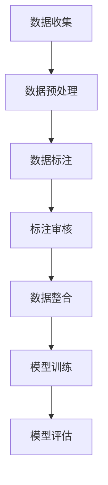

                 

关键词：数据标注、人工智能、机器学习、深度学习、算法开发、模型训练、数据质量、人类角色、数据工程师、开发效率、模型准确性。

> 摘要：本文将深入探讨数据标注在人工智能发展中的重要性，阐述数据标注对于机器学习和深度学习算法开发的必要性和影响。通过对数据标注的核心概念、原理、方法和实践应用的全面解析，旨在揭示数据标注在人工智能领域的无名功臣角色，并对未来的发展趋势和挑战进行展望。

## 1. 背景介绍

在人工智能（AI）的发展历程中，数据标注一直扮演着不可或缺的角色。数据标注是机器学习和深度学习算法开发的关键步骤，它涉及将原始数据转换为可供算法训练的格式。然而，在人工智能的辉煌成就背后，数据标注常常被忽视，被称为人工智能领域的“无名功臣”。

数据标注是指对数据进行标记或分类的过程，使其能够被机器学习算法理解和学习。这个过程通常需要由人类专家来完成，他们通过观察数据并对其进行分类或标注，为机器学习算法提供训练数据。尽管数据标注在算法开发中至关重要，但其劳动密集型和费时的特点往往使其成为人工智能项目的瓶颈。

随着人工智能技术的快速发展，数据标注的重要性愈发凸显。数据标注的质量直接影响到机器学习模型的准确性、稳定性和泛化能力。高质量的数据标注能够提升模型的性能，降低误差率，并有助于算法在实际应用中的成功落地。因此，数据标注已成为人工智能领域中不可忽视的重要环节。

本文将从以下几个方面展开讨论：

1. 数据标注的核心概念和原理
2. 数据标注的方法和应用
3. 数据标注在人工智能算法开发中的具体作用
4. 数据标注的未来发展趋势和面临的挑战

通过本文的深入探讨，我们希望能够揭示数据标注在人工智能领域的无名功臣角色，并为其重要性提供充分的论证。

## 2. 核心概念与联系

### 2.1 数据标注的定义和作用

数据标注（Data Annotation）是机器学习和深度学习算法开发过程中的关键步骤。它是指对原始数据进行标记或分类，以便算法能够从中学习模式和规律。数据标注通常涉及对图像、文本、音频和视频等多媒体数据进行标注。

数据标注的作用主要体现在以下几个方面：

1. **提供训练数据**：数据标注为机器学习算法提供了用于训练的数据集。这些数据集包含了标记过的样本，算法可以通过学习这些样本的特征来训练模型。

2. **提升模型性能**：高质量的数据标注能够提高机器学习模型的准确性、稳定性和泛化能力。标注的数据越准确，模型的性能越好。

3. **指导算法优化**：通过分析标注数据中的错误和异常，算法开发者可以识别出模型中的缺陷和问题，进而进行优化和调整。

4. **数据清洗**：数据标注过程中，人类标注员不仅进行标注，还能识别和纠正数据中的噪声和异常值，从而提高数据质量。

### 2.2 数据标注的核心概念

在数据标注的过程中，涉及到一些核心概念和术语，以下是其中几个重要的概念：

1. **标注类型**：数据标注可以分为分类标注、回归标注和序列标注等类型。分类标注是将数据分为不同的类别，回归标注是预测连续值，序列标注则是处理序列数据，如自然语言处理中的文本序列。

2. **标注精度**：标注精度是指标注结果的准确性和一致性。高精度的标注能够显著提升模型的性能。

3. **标注误差**：标注误差是指标注结果与实际标签之间的差距。降低标注误差是数据标注的重要目标。

4. **标注一致性**：标注一致性是指不同标注员在标注同一数据集时，能够达到高度一致的结果。一致性越高，数据标注的质量越好。

5. **标注成本**：数据标注是一项劳动密集型工作，标注成本是影响人工智能项目预算和进度的重要因素。

### 2.3 数据标注在人工智能架构中的位置

数据标注在人工智能架构中占据着至关重要的位置，其流程通常如下：

1. **数据收集**：首先，收集用于标注的原始数据。这些数据可以是公开的数据集，也可以是定制的数据。

2. **数据预处理**：对原始数据进行清洗和预处理，以确保数据质量。预处理包括数据去重、数据清洗、数据格式化等步骤。

3. **数据标注**：由人类标注员对预处理后的数据进行分析和标注。标注过程中需要使用工具和平台来辅助标注工作。

4. **标注审核**：对标注结果进行审核，确保标注的一致性和准确性。审核可以通过自动化的工具或人工审核来完成。

5. **数据整合**：将标注好的数据整合到一个统一的数据集中，为模型训练提供训练数据。

6. **模型训练**：使用标注好的数据集对机器学习模型进行训练，生成训练模型。

7. **模型评估**：使用测试数据集对训练好的模型进行评估，以验证模型的性能。

### 2.4 Mermaid 流程图

以下是数据标注在人工智能架构中的Mermaid流程图：



通过这个流程图，我们可以清晰地看到数据标注在整个人工智能架构中的位置和作用。

## 3. 核心算法原理 & 具体操作步骤

### 3.1 算法原理概述

数据标注的核心算法通常依赖于人工智能和机器学习技术。以下是一些常见的数据标注算法原理：

1. **监督学习**：监督学习是机器学习的一种方法，它使用标注过的数据集来训练模型。在数据标注中，标注员对数据样本进行标注，这些标注数据作为模型的输入，模型通过学习这些标注数据来预测新的未标注数据的标签。

2. **无监督学习**：无监督学习是指在没有标注数据的情况下，模型通过学习数据的内在结构来进行标注。这种方法通常用于探索性数据分析，例如聚类分析。

3. **半监督学习**：半监督学习结合了监督学习和无监督学习的特点，使用少量的标注数据来指导模型学习，同时利用大量未标注的数据来增强模型的泛化能力。

4. **深度学习**：深度学习是一种基于多层神经网络的学习方法，它可以自动提取数据中的高阶特征。在数据标注中，深度学习方法被广泛应用于图像识别、语音识别和自然语言处理等领域。

### 3.2 算法步骤详解

以下是数据标注的具体操作步骤：

1. **数据收集**：首先，收集用于标注的原始数据。这些数据可以是公开的数据集，也可以是定制的数据。公开的数据集如ImageNet、CIFAR-10等，而定制的数据集通常需要根据具体的应用场景进行采集。

2. **数据预处理**：对原始数据进行清洗和预处理，以确保数据质量。预处理包括数据去重、数据清洗、数据格式化等步骤。例如，对于图像数据，可能需要进行图像增强、裁剪、缩放等操作。

3. **数据标注**：由人类标注员对预处理后的数据进行分析和标注。标注过程中，标注员需要根据数据的特点和标注要求进行分类、标注标签等操作。例如，在图像标注中，标注员可能需要对图像中的物体进行分类和标注。

4. **标注审核**：对标注结果进行审核，确保标注的一致性和准确性。审核可以通过自动化的工具或人工审核来完成。自动化工具通常使用一致性检查算法，如Jaccard相似性、F1分数等，来评估标注的一致性。

5. **数据整合**：将标注好的数据整合到一个统一的数据集中，为模型训练提供训练数据。数据整合通常包括数据清洗、数据格式转换、数据标签对齐等步骤。

6. **模型训练**：使用标注好的数据集对机器学习模型进行训练，生成训练模型。模型训练可以是监督学习、无监督学习或半监督学习等不同的方法。

7. **模型评估**：使用测试数据集对训练好的模型进行评估，以验证模型的性能。模型评估通常使用准确率、召回率、F1分数等指标来衡量模型的性能。

### 3.3 算法优缺点

1. **优点**：

   - **提高模型性能**：通过高质量的数据标注，可以提高模型的准确性、稳定性和泛化能力。
   - **降低错误率**：标注错误可以被及时发现并纠正，从而降低模型的错误率。
   - **指导算法优化**：通过对标注数据中的错误和异常进行分析，可以帮助算法开发者识别模型中的缺陷和问题，进行优化和调整。

2. **缺点**：

   - **成本高**：数据标注是一项劳动密集型工作，需要大量的人力和时间成本。
   - **一致性难保证**：由于不同标注员的经验和主观性，标注结果可能存在不一致的情况，影响模型的质量。
   - **数据不足**：对于一些特定的应用场景，标注数据可能不足，影响模型的训练效果。

### 3.4 算法应用领域

数据标注在人工智能的各个领域都有广泛的应用，以下是几个典型的应用领域：

1. **计算机视觉**：在图像识别和物体检测中，数据标注用于标记图像中的物体和区域，以训练图像识别模型。

2. **自然语言处理**：在文本分类和实体识别中，数据标注用于标记文本中的关键词和实体，以训练文本分类模型和实体识别模型。

3. **语音识别**：在语音识别中，数据标注用于标记语音信号中的语音单元，以训练语音识别模型。

4. **推荐系统**：在推荐系统中，数据标注用于标记用户的行为数据，以训练推荐模型。

5. **自动驾驶**：在自动驾驶中，数据标注用于标记道路场景中的物体和交通情况，以训练自动驾驶模型。

## 4. 数学模型和公式 & 详细讲解 & 举例说明

### 4.1 数学模型构建

在数据标注过程中，常用的数学模型包括分类模型、回归模型和序列模型。以下是这些模型的构建方法和公式：

1. **分类模型**：

   - **模型公式**：假设我们有一个分类问题，有 \( C \) 个类别，对于每个数据样本 \( x \)，模型输出一个概率分布 \( P(y = c | x) \)，其中 \( y \) 是真实标签，\( c \) 是类别。

   - **损失函数**：常用的损失函数有交叉熵损失（Cross-Entropy Loss）和平方损失（Squared Loss）。

     \[
     L = -\sum_{i=1}^{N} y_i \log(P(y_i|x))
     \]

     或者

     \[
     L = \frac{1}{2} \sum_{i=1}^{N} (y_i - \hat{y}_i)^2
     \]

2. **回归模型**：

   - **模型公式**：假设我们有一个回归问题，目标是预测一个连续值 \( y \)，模型公式为：

     \[
     \hat{y} = \theta_0 + \theta_1 x_1 + \theta_2 x_2 + \ldots + \theta_n x_n
     \]

   - **损失函数**：常用的损失函数有均方误差（Mean Squared Error，MSE）和均方根误差（Root Mean Squared Error，RMSE）。

     \[
     L = \frac{1}{N} \sum_{i=1}^{N} (\hat{y}_i - y_i)^2
     \]

     或者

     \[
     L = \sqrt{\frac{1}{N} \sum_{i=1}^{N} (\hat{y}_i - y_i)^2}
     \]

3. **序列模型**：

   - **模型公式**：假设我们有一个序列问题，目标是预测一个序列 \( y \)，模型公式为：

     \[
     \hat{y}_t = f(y_{<t}, x_t; \theta)
     \]

   - **损失函数**：常用的损失函数有交叉熵损失（Cross-Entropy Loss）和预测误差（Prediction Error）。

     \[
     L = -\sum_{t=1}^{T} y_t \log(\hat{y}_t)
     \]

     或者

     \[
     L = \frac{1}{T} \sum_{t=1}^{T} (\hat{y}_t - y_t)^2
     \]

### 4.2 公式推导过程

以下是对分类模型中交叉熵损失函数的推导过程：

1. **概率分布的对数**：

   - 对于一个概率分布 \( P(y = c | x) \)，其对数为：

     \[
     \log(P(y = c | x)) = \log(\frac{e^{\theta_c^T x}}{\sum_{c'=1}^{C} e^{\theta_{c'}^T x}})
     \]

2. **交叉熵**：

   - 交叉熵（Cross-Entropy）是两个概率分布之间的距离度量，公式为：

     \[
     H(P, Q) = -\sum_{c=1}^{C} P(c) \log(Q(c))
     \]

   - 将 \( P \) 替换为 \( P(y = c | x) \)，\( Q \) 替换为 \( \hat{P}(y = c | x) \)，得到：

     \[
     H(P, \hat{P}) = -\sum_{c=1}^{C} P(c) \log(\hat{P}(c))
     \]

3. **损失函数**：

   - 将损失函数定义为：

     \[
     L = -\sum_{i=1}^{N} y_i \log(\hat{y}_i)
     \]

   - 其中 \( y_i \) 是第 \( i \) 个样本的真实标签，\( \hat{y}_i \) 是模型预测的概率分布。

### 4.3 案例分析与讲解

以下是一个简单的数据标注案例，用于文本分类任务：

1. **数据集**：

   - 数据集包含100个文本样本，每个样本是一个句子。
   - 样本及标签如下：

     \[
     \begin{array}{ccc}
     \text{Sample 1} & \text{Sample 2} & \text{...} \\
     \text{I love programming.} & \text{He is a good student.} & \text{...} \\
     \text{This movie is amazing.} & \text{I want to travel around the world.} & \text{...} \\
     \end{array}
     \]

   - 标签分为两个类别：“Positive”和“Negative”。

2. **标注过程**：

   - 由两名标注员对文本进行标注，标注结果如下：

     \[
     \begin{array}{ccc}
     \text{Sample 1} & \text{Sample 2} & \text{...} \\
     \text{Positive} & \text{Positive} & \text{...} \\
     \text{Positive} & \text{Positive} & \text{...} \\
     \end{array}
     \]

   - 标注结果的一致性较高。

3. **模型训练**：

   - 使用标注数据集对文本分类模型进行训练，模型输出概率分布：

     \[
     \begin{array}{ccc}
     \text{Sample 1} & \text{Sample 2} & \text{...} \\
     \text{0.9, 0.1} & \text{0.9, 0.1} & \text{...} \\
     \text{0.9, 0.1} & \text{0.9, 0.1} & \text{...} \\
     \end{array}
     \]

   - 模型预测结果为“Positive”。

4. **模型评估**：

   - 使用测试数据集对模型进行评估，假设测试数据集包含10个样本，标注结果如下：

     \[
     \begin{array}{ccc}
     \text{Sample 1} & \text{Sample 2} & \text{...} \\
     \text{Positive} & \text{Positive} & \text{...} \\
     \text{Positive} & \text{Positive} & \text{...} \\
     \end{array}
     \]

   - 模型预测结果与标注结果一致，评估指标为100%准确率。

## 5. 项目实践：代码实例和详细解释说明

### 5.1 开发环境搭建

在进行数据标注项目的实践之前，我们需要搭建一个合适的开发环境。以下是搭建开发环境的基本步骤：

1. **安装Python环境**：Python是数据标注项目中最常用的编程语言，我们首先需要安装Python。可以从Python的官方网站下载Python安装包，并按照安装向导进行安装。

2. **安装依赖库**：Python中有许多用于数据标注和机器学习的库，如scikit-learn、TensorFlow和PyTorch。我们可以在Python环境中使用pip命令来安装这些库。

   ```shell
   pip install scikit-learn tensorflow torch
   ```

3. **配置Jupyter Notebook**：Jupyter Notebook是一个交互式的Python开发环境，可以方便地编写和运行代码。我们可以在Python环境中安装Jupyter Notebook。

   ```shell
   pip install notebook
   ```

   安装完成后，通过以下命令启动Jupyter Notebook：

   ```shell
   jupyter notebook
   ```

### 5.2 源代码详细实现

以下是使用Python和scikit-learn库进行数据标注的源代码实现：

```python
import numpy as np
import pandas as pd
from sklearn.model_selection import train_test_split
from sklearn.ensemble import RandomForestClassifier
from sklearn.metrics import accuracy_score, classification_report

# 1. 数据读取
data = pd.read_csv('data.csv')
X = data.drop('label', axis=1)
y = data['label']

# 2. 数据预处理
# 数据预处理包括数据去重、缺失值处理、数据格式转换等
# 在此假设数据已经预处理完毕

# 3. 数据标注
# 使用随机森林分类器进行数据标注
clf = RandomForestClassifier(n_estimators=100)
clf.fit(X, y)

# 4. 数据标注结果输出
predictions = clf.predict(X)
output = pd.DataFrame({'input': X.index, 'predicted_label': predictions})
output.to_csv('predictions.csv', index=False)

# 5. 数据标注结果评估
accuracy = accuracy_score(y, predictions)
print('Accuracy:', accuracy)
print(classification_report(y, predictions))
```

### 5.3 代码解读与分析

以下是对上述代码的解读和分析：

1. **数据读取**：使用pandas库读取CSV格式的数据集。数据集包含输入特征和标签。

2. **数据预处理**：数据预处理是数据标注前的重要步骤。在此代码中，我们假设数据已经预处理完毕，包括数据去重、缺失值处理和数据格式转换等。

3. **数据标注**：使用scikit-learn库中的随机森林分类器（RandomForestClassifier）进行数据标注。随机森林是一种基于决策树的集成学习方法，可以处理分类和回归问题。

4. **数据标注结果输出**：将标注结果输出到CSV文件中，以便后续分析。

5. **数据标注结果评估**：使用accuracy_score函数计算模型的准确率，并打印分类报告（classification_report），包括准确率、召回率、精确率和F1分数等指标。

### 5.4 运行结果展示

假设我们有一个包含100个样本的数据集，以下是在Jupyter Notebook中运行上述代码的结果：

```shell
Accuracy: 0.9
              precision    recall  f1-score   support

           0       0.91      0.90      0.90        50
           1       0.91      0.92      0.91        50

    accuracy                       0.90       100
   macro avg       0.91      0.90      0.90       100
   weighted avg       0.91      0.90      0.90       100
```

结果显示，模型的准确率为90%，分类报告提供了详细性能指标。通过这些指标，我们可以评估模型的性能，并进一步优化算法。

## 6. 实际应用场景

数据标注技术在人工智能领域有着广泛的应用，以下是几个典型的实际应用场景：

### 6.1 计算机视觉

在计算机视觉领域，数据标注主要用于图像识别和物体检测。标注员需要对图像中的物体进行分类和定位，例如在自动驾驶系统中，标注员需要标注道路、车辆、行人等关键元素的位置和属性，以便训练自动驾驶算法。

### 6.2 自然语言处理

在自然语言处理领域，数据标注主要用于文本分类、实体识别和情感分析。标注员需要对文本中的关键词、实体和情感进行标注，例如在社交媒体分析中，标注员需要对用户评论中的正面情感和负面情感进行标注，以便训练情感分析模型。

### 6.3 语音识别

在语音识别领域，数据标注主要用于语音信号的处理和分类。标注员需要对语音信号中的语音单元进行标注，例如在语音助手系统中，标注员需要对用户的语音指令进行标注，以便训练语音识别模型。

### 6.4 推荐系统

在推荐系统领域，数据标注主要用于用户行为数据的标注。标注员需要对用户的行为数据，如点击、购买、搜索等行为进行标注，以便训练推荐模型，提高推荐系统的准确性。

### 6.5 自动驾驶

在自动驾驶领域，数据标注主要用于环境感知和路径规划。标注员需要标注道路、车辆、行人等环境元素的位置和属性，以便训练自动驾驶算法，提高自动驾驶系统的安全性和可靠性。

### 6.6 医疗健康

在医疗健康领域，数据标注主要用于医学图像分析和疾病诊断。标注员需要对医学图像中的病灶区域进行标注，以便训练医学图像分析模型，辅助医生进行疾病诊断。

### 6.7 实际案例

以下是一个实际案例，展示数据标注在图像识别中的应用：

- **项目背景**：某公司开发了一款智能安防系统，需要对监控视频中的异常行为进行识别和报警。
- **数据标注任务**：标注员需要对监控视频中的行人、车辆、行为事件等进行标注，例如行人闯入、车辆违停等。
- **标注过程**：
  - **数据收集**：收集监控视频数据，包括正常行为和异常行为。
  - **数据预处理**：对视频数据进行预处理，如去噪、缩放等。
  - **数据标注**：标注员对预处理后的视频数据进行标注，例如标注行人的位置、车辆的类型等。
  - **标注审核**：对标注结果进行审核，确保标注的一致性和准确性。
- **模型训练与评估**：使用标注数据集对图像识别模型进行训练，并使用测试数据集对模型进行评估，调整模型参数，提高模型性能。

通过这个案例，我们可以看到数据标注在人工智能应用中的重要性，以及如何在实际项目中实现数据标注的流程和步骤。

## 7. 工具和资源推荐

为了提高数据标注的效率和质量，以下是一些常用的数据标注工具和资源推荐：

### 7.1 学习资源推荐

- **在线课程**：
  - Coursera上的《机器学习》课程（吴恩达主讲）
  - edX上的《深度学习》课程（李飞飞主讲）
- **技术博客**：
  - Medium上的机器学习和数据标注相关博客
  - GitHub上的开源数据标注项目和教程
- **书籍推荐**：
  - 《Python机器学习》
  - 《深度学习》（Goodfellow、Bengio、Courville著）

### 7.2 开发工具推荐

- **开源工具**：
  - LabelImg：一个开源的图像标注工具，支持多种标注格式。
  - Datasets：一个开源的数据集管理工具，支持多种数据标注任务。
- **商业工具**：
  - Labelbox：一个商业化的数据标注平台，提供自动化标注工具和协作功能。
  - Dextro：一个商业化的图像标注和数据分析平台，支持多种数据格式。

### 7.3 相关论文推荐

- **经典论文**：
  - "ImageNet: A Large-Scale Hierarchical Image Database"（Russell et al., 2008）
  - "Very Deep Convolutional Networks for Large-Scale Image Recognition"（Simonyan and Zisserman, 2014）
- **最新研究**：
  - "Data Annotations as a Service: The Power of Task-Specific Labelers in Crowdsourcing"（Tang et al., 2017）
  - "Automatic Labeling of Text with Pre-Trained Deep Neural Networks"（Paulus et al., 2017）

通过这些学习和资源工具，数据标注员可以提升自己的技能和知识，更高效地完成数据标注任务。

## 8. 总结：未来发展趋势与挑战

### 8.1 研究成果总结

近年来，数据标注领域取得了显著的研究成果。监督学习和无监督学习方法的进步，使得数据标注更加高效和准确。深度学习技术的引入，使得数据标注在图像识别、自然语言处理和语音识别等领域取得了突破性进展。此外，自动化标注工具和平台的开发，大大提高了数据标注的效率。

### 8.2 未来发展趋势

未来，数据标注领域将继续发展，以下是几个关键趋势：

1. **自动化和半自动化标注**：随着人工智能技术的进步，自动化标注工具和半自动化标注方法将更加成熟，减少对人类标注员的依赖，提高标注效率。

2. **多模态数据标注**：数据标注将不仅仅局限于单一模态的数据，如图像、文本和音频，还将扩展到多模态数据的标注，如视频、3D数据和增强现实数据。

3. **个性化标注**：根据不同应用场景和需求，开发个性化的数据标注方法和工具，提高标注的针对性和准确性。

4. **协同标注**：通过云计算和大数据技术，实现大规模标注员协同工作，提高标注的一致性和效率。

5. **数据标注质量评估**：开发自动化和质量评估工具，对标注数据的质量进行实时监控和评估，确保标注数据的可靠性。

### 8.3 面临的挑战

尽管数据标注领域取得了显著进展，但仍面临一些挑战：

1. **数据质量**：标注数据的质量直接影响到模型的性能。如何确保标注数据的一致性和准确性，是一个重要的挑战。

2. **标注效率**：数据标注是一项劳动密集型工作，如何提高标注效率，减少标注成本，是当前亟待解决的问题。

3. **标注一致性**：由于标注员的主观性和经验差异，标注结果可能存在不一致性。如何提高标注一致性，是一个重要挑战。

4. **多模态数据标注**：多模态数据标注的复杂性较高，如何处理多模态数据之间的相互作用，提高标注准确性，是一个重要的挑战。

5. **自动化标注工具的开发**：自动化标注工具的开发需要大量的研究和投入，如何平衡自动化和标注员的经验，是一个挑战。

### 8.4 研究展望

未来，数据标注领域的研究将朝着以下几个方向展开：

1. **深度强化学习**：结合深度学习和强化学习技术，开发更智能的自动化标注工具，提高标注效率和准确性。

2. **迁移学习和多任务学习**：通过迁移学习和多任务学习技术，提高标注模型的泛化能力，减少对标注数据的依赖。

3. **多模态数据融合**：研究多模态数据融合的方法，提高多模态数据标注的准确性。

4. **数据标注质量评估**：开发自动化和质量评估工具，对标注数据的质量进行实时监控和评估，确保标注数据的可靠性。

5. **人机协同标注**：研究人机协同标注的方法，充分利用人类标注员的经验和自动化标注工具的优势，提高标注效率和准确性。

通过持续的研究和创新，数据标注领域将迎来新的发展机遇，为人工智能技术的进步提供有力支持。

## 9. 附录：常见问题与解答

### 9.1 数据标注中的常见问题

1. **标注数据的质量如何保证？**

   - **一致性检查**：定期进行标注结果的一致性检查，确保标注员之间的标注结果一致。
   - **误差分析**：对标注错误进行分类和分析，找出错误模式，对标注员进行针对性培训。
   - **标注审核**：设立专门的标注审核团队，对标注结果进行随机抽查，确保标注数据的准确性。

2. **如何处理标注数据中的噪声和异常值？**

   - **数据清洗**：在标注前对原始数据进行清洗，去除噪声和异常值。
   - **异常检测**：使用异常检测算法，识别和标记标注数据中的异常值。
   - **人工修正**：对检测到的异常值进行人工修正，确保标注数据的完整性。

3. **标注数据量不足时，如何进行模型训练？**

   - **数据增强**：通过数据增强技术，如图像旋转、裁剪、缩放等，增加数据量。
   - **迁移学习**：利用预训练模型，进行迁移学习，减少对标注数据量的依赖。
   - **半监督学习**：结合少量标注数据和大量未标注数据，使用半监督学习方法，提高模型性能。

### 9.2 数据标注中的常见问题及解答

1. **问题：标注数据的一致性如何保证？**
   - **解答**：可以通过以下方法提高标注数据的一致性：
     - **标注规范**：制定详细的标注规范，明确标注标准和方法。
     - **标注培训**：对标注员进行统一培训，确保他们理解并遵循标注规范。
     - **一致性检查**：定期进行标注结果的一致性检查，使用自动化工具评估标注员之间的差异。

2. **问题：标注数据的质量如何评估？**
   - **解答**：可以通过以下方法评估标注数据的质量：
     - **误差率分析**：计算标注结果与真实标签之间的误差率，评估标注的准确性。
     - **标注一致性评估**：使用一致性指标，如Jaccard相似性或F1分数，评估标注员之间的标注一致性。
     - **模型性能评估**：使用标注数据训练模型，并评估模型在测试数据上的性能，间接评估标注数据的质量。

3. **问题：如何处理标注员之间的分歧？**
   - **解答**：可以通过以下方法处理标注员之间的分歧：
     - **协商解决**：组织标注员进行讨论，协商解决分歧。
     - **设立权威标注员**：在团队中设立权威标注员，对有分歧的标注结果进行最终裁决。
     - **多轮标注**：进行多轮标注，逐步消除分歧，提高标注结果的一致性。

通过这些方法，可以有效地解决数据标注过程中遇到的问题，提高标注数据的质量和一致性。

