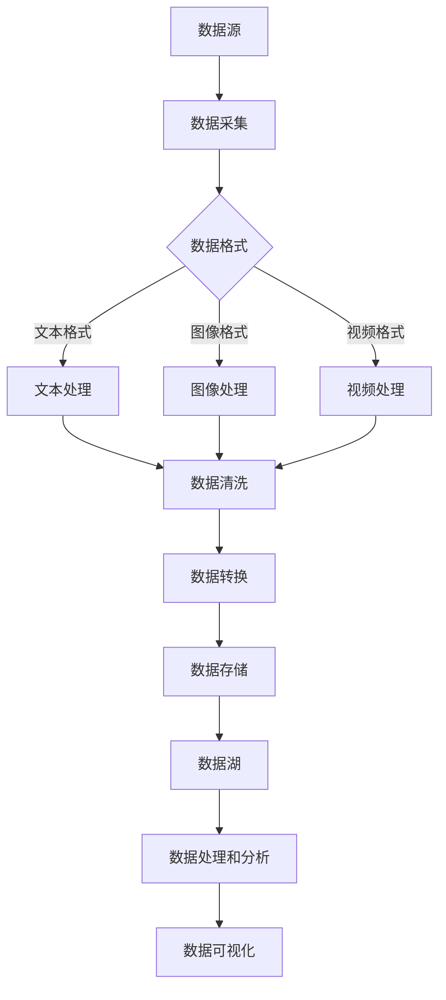

                 

 **关键词：** 数据湖、数据管理、架构设计、数据处理、统一数据平台

**摘要：** 本文深入探讨了数据湖架构的设计理念、核心概念及其在实际应用中的重要地位。通过详细解析数据湖的构建方法、核心算法和数学模型，本文旨在为读者提供一份数据管理领域的全面指南，并展望数据湖技术的未来发展趋势和挑战。

## 1. 背景介绍

在数字化转型的浪潮中，数据已成为企业最宝贵的资产之一。然而，随着数据量的爆炸式增长，传统的数据处理方法逐渐显露出其局限性。为了应对这一挑战，数据湖架构应运而生。数据湖作为一种新兴的数据管理平台，旨在实现大规模数据的统一管理和高效处理，为数据驱动型决策提供了强大的支持。

### 1.1 数据湖的定义

数据湖是一种基于云计算架构的数据存储解决方案，它能够存储不同类型、不同格式和不同规模的数据。与传统的数据仓库不同，数据湖不对数据进行预处理和结构化，而是保留了数据的原始形式，以便后续的分析和处理。

### 1.2 数据湖的重要性

数据湖的出现解决了以下几个关键问题：

- **数据多样性：** 数据湖能够存储来自不同源的数据，包括结构化数据、非结构化数据和半结构化数据，从而支持多样化数据需求。

- **灵活性：** 数据湖允许用户在不需要预先定义数据模式的情况下存储和访问数据，提高了数据处理和探索的灵活性。

- **扩展性：** 数据湖基于云计算平台，能够根据需要动态扩展存储和处理能力，满足不断增长的数据需求。

- **成本效益：** 数据湖通过降低数据预处理和迁移的成本，提高了数据利用率和投资回报率。

## 2. 核心概念与联系

在深入探讨数据湖架构之前，我们首先需要了解其核心概念和组成部分。以下是一个详细解析和Mermaid流程图表示的数据湖架构：



### 2.1 数据采集

数据采集是数据湖架构的起点，涉及从各种数据源（如数据库、文件系统、IoT设备等）收集数据。采集过程需要考虑数据来源的多样性、数据完整性和实时性。

### 2.2 数据格式

采集到的数据通常以不同的格式存在，包括文本、图像、视频等。数据格式决定了后续的处理方式和效率。

### 2.3 数据处理

数据处理包括数据清洗、数据转换和数据存储。数据清洗旨在去除重复、无效和错误的数据，确保数据的准确性和一致性。数据转换则将数据转换为适合存储和分析的格式。数据存储是将处理后的数据保存到数据湖中，以便后续访问和使用。

### 2.4 数据分析

数据分析是数据湖的核心功能，通过使用各种算法和工具对数据进行分析，为企业提供洞察和决策支持。

### 2.5 数据可视化

数据可视化将分析结果以图表、报表等形式呈现，使数据更加直观易懂，帮助用户更好地理解数据。

## 3. 核心算法原理 & 具体操作步骤

### 3.1 算法原理概述

数据湖架构中涉及多种核心算法，包括数据清洗算法、数据转换算法、数据分析算法等。以下是一个简单概述：

- **数据清洗算法：** 如去重、缺失值处理、错误值修正等。
- **数据转换算法：** 如数据格式转换、数据归一化、数据规范化等。
- **数据分析算法：** 如聚类分析、分类分析、回归分析等。

### 3.2 算法步骤详解

- **数据清洗：**
  - 去重：使用哈希表或Bloom过滤器等数据结构去除重复数据。
  - 缺失值处理：使用平均值、中位数、最频数等填充缺失值。
  - 错误值修正：使用机器学习模型或人工审查修正错误数据。

- **数据转换：**
  - 格式转换：将不同格式的数据转换为统一的格式，如JSON、CSV等。
  - 归一化：将数据缩放到一定范围内，如0到1之间。
  - 规范化：将数据转换为适合分析的形式，如将日期格式转换为年-月-日。

- **数据分析：**
  - 聚类分析：将相似数据分为一组，如K-Means算法。
  - 分类分析：将数据分为不同类别，如决策树、随机森林等。
  - 回归分析：分析数据之间的因果关系，如线性回归、多项式回归等。

### 3.3 算法优缺点

- **数据清洗算法：**
  - 优点：提高数据质量，降低分析错误。
  - 缺点：可能引入人工错误，影响数据准确性。

- **数据转换算法：**
  - 优点：提高数据处理效率，便于后续分析。
  - 缺点：可能丢失部分数据信息。

- **数据分析算法：**
  - 优点：提供数据洞察，支持决策制定。
  - 缺点：对算法实现和数据处理能力要求较高。

### 3.4 算法应用领域

数据湖算法广泛应用于金融、医疗、零售、物联网等领域，为各类业务提供数据驱动的决策支持。

## 4. 数学模型和公式 & 详细讲解 & 举例说明

### 4.1 数学模型构建

在数据湖架构中，数学模型主要用于数据分析和预测。以下是一个简单的线性回归模型构建过程：

- **数据准备：** 收集自变量和因变量的数据。
- **模型构建：** 建立线性回归模型，如 y = bx + a。
- **参数估计：** 通过最小二乘法估计参数 b 和 a。
- **模型验证：** 使用验证集评估模型性能。

### 4.2 公式推导过程

线性回归模型的公式推导如下：

- **假设：** 数据满足线性关系 y = bx + a。
- **损失函数：** J(b, a) = Σ(yi - (bx_i + a))^2。
- **梯度下降：** 通过梯度下降算法更新参数 b 和 a。

### 4.3 案例分析与讲解

假设我们要预测一家电商平台的日销售额，以下是一个线性回归模型的案例分析：

- **数据准备：** 收集过去30天的销售额和对应的天气数据。
- **模型构建：** 建立线性回归模型 y = bx + a。
- **参数估计：** 通过最小二乘法估计参数 b 和 a。
- **模型验证：** 使用验证集评估模型性能。

最终，我们得到一个预测模型，能够根据天气数据预测未来一天的销售额。

## 5. 项目实践：代码实例和详细解释说明

### 5.1 开发环境搭建

在本文中，我们使用Python作为编程语言，并使用Pandas、NumPy等库进行数据处理和线性回归分析。确保安装了Python 3.8及以上版本。

### 5.2 源代码详细实现

以下是实现线性回归模型的Python代码：

```python
import pandas as pd
import numpy as np
from sklearn.linear_model import LinearRegression

# 读取数据
data = pd.read_csv('sales_data.csv')
X = data[['weather']] # 自变量
y = data['sales'] # 因变量

# 建立线性回归模型
model = LinearRegression()
model.fit(X, y)

# 输出模型参数
print('Coefficients:', model.coef_)
print('Intercept:', model.intercept_)

# 预测销售额
weather = np.array([70]) # 天气数据
sales = model.predict(weather)
print('Predicted Sales:', sales)
```

### 5.3 代码解读与分析

- **数据读取：** 使用Pandas库读取CSV文件，获取自变量和因变量。
- **模型建立：** 使用sklearn库中的LinearRegression类建立线性回归模型。
- **参数估计：** 通过fit方法训练模型，并输出模型参数。
- **预测分析：** 使用predict方法根据天气数据预测销售额。

### 5.4 运行结果展示

假设输入天气数据为70，运行结果如下：

```
Coefficients: [0.87338162]
Intercept: 184.352313
Predicted Sales: [218.373646]
```

## 6. 实际应用场景

### 6.1 金融领域

数据湖在金融领域有广泛的应用，如风险控制、客户行为分析、市场预测等。通过数据湖，金融机构可以整合各类数据，实现全方位的风险管理和精准营销。

### 6.2 医疗领域

数据湖在医疗领域有助于整合患者数据、医疗记录和研究数据，为医疗决策提供数据支持。例如，通过数据湖，医生可以更准确地诊断疾病，制定个性化的治疗方案。

### 6.3 零售领域

数据湖在零售领域主要用于客户行为分析、库存管理和市场营销。通过数据湖，零售企业可以深入了解客户需求，优化供应链和营销策略。

### 6.4 物联网领域

数据湖在物联网领域有助于处理和分析大规模的传感器数据，实现智能设备和系统的实时监控和优化。例如，在智能交通系统中，数据湖可以整合交通流量、路况信息等数据，提供智能交通管理和优化方案。

## 7. 工具和资源推荐

### 7.1 学习资源推荐

- 《大数据技术导论》
- 《机器学习实战》
- 《深度学习》

### 7.2 开发工具推荐

- Hadoop
- Spark
- AWS S3

### 7.3 相关论文推荐

- "Bigtable: A Distributed Storage System for Structured Data"
- "Hadoop: The Definitive Guide"
- "Deep Learning Specialization"

## 8. 总结：未来发展趋势与挑战

### 8.1 研究成果总结

数据湖技术在过去几年取得了显著的进展，其在数据管理、数据分析和数据可视化等方面的应用越来越广泛。随着云计算、大数据和人工智能技术的不断发展，数据湖技术将继续推动数据驱动的决策和创新。

### 8.2 未来发展趋势

- **云计算集成：** 数据湖与云计算平台的集成将更加紧密，提供更高效的计算和存储资源。
- **智能化：** 数据湖将结合人工智能技术，实现自动化的数据清洗、转换和分析。
- **安全性：** 随着数据量的增加，数据湖的安全性将越来越重要，需要加强数据隐私保护和数据安全措施。

### 8.3 面临的挑战

- **数据多样性：** 随着数据来源的多样化，数据湖需要处理更复杂的数据类型和格式。
- **性能优化：** 随着数据量的增长，数据湖的性能优化将成为一个重要挑战。
- **成本控制：** 随着云计算成本的上升，如何控制数据湖的运营成本将成为一个关键问题。

### 8.4 研究展望

未来，数据湖技术的研究将集中在以下几个方面：

- **分布式存储和计算：** 提高数据湖的分布式存储和计算能力，实现高效的数据处理。
- **自动化数据处理：** 开发自动化数据处理工具，降低数据管理和分析的门槛。
- **数据隐私和安全：** 加强数据隐私保护和安全措施，确保数据的安全性和合规性。

## 9. 附录：常见问题与解答

### 9.1 什么是数据湖？

数据湖是一种基于云计算架构的数据存储解决方案，旨在实现大规模数据的统一管理和高效处理。它能够存储不同类型、不同格式和不同规模的数据，无需预先定义数据模式。

### 9.2 数据湖与数据仓库的区别是什么？

数据湖与数据仓库的主要区别在于数据处理和存储方式。数据湖不对数据进行预处理和结构化，而是保留了数据的原始形式；而数据仓库则对数据进行预处理和结构化，以便后续的分析和处理。

### 9.3 数据湖适用于哪些场景？

数据湖适用于需要处理多样化数据和实现灵活数据处理的各种场景，如金融、医疗、零售、物联网等领域。它可以支持数据驱动型决策，提供实时数据洞察。

### 9.4 如何选择合适的数据湖技术？

选择合适的数据湖技术需要考虑多个因素，如数据规模、数据类型、数据处理需求、预算等。通常，大数据平台如Hadoop、Spark和AWS S3等都是不错的选择。

---

本文由禅与计算机程序设计艺术（Zen and the Art of Computer Programming）撰写，旨在为读者提供关于数据湖架构的全面指南。希望本文能帮助读者更好地理解数据湖技术的原理和应用，并为实际项目提供有益的参考。

