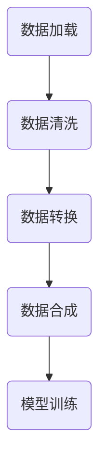

                 

 在当今大数据时代，数据集的处理已经成为了人工智能和机器学习领域中的重要环节。从数据加载到数据清洗、数据转换和数据合成，每一个步骤都对最终模型的性能和准确度产生着深远的影响。本文将深入探讨数据集处理的过程，重点介绍从加载到合成数据生成的一系列技术。

> 关键词：数据集处理，数据加载，数据清洗，数据转换，数据合成，机器学习，人工智能

## 摘要

本文首先对数据集处理的相关背景进行了介绍，然后详细阐述了数据集处理的核心概念，包括数据加载、数据清洗、数据转换和数据合成。接着，本文深入探讨了核心算法原理，并通过具体实例和代码解释了算法的实现过程。文章最后，我们讨论了数据集处理在实际应用中的场景，并对未来发展的趋势和挑战进行了展望。

## 1. 背景介绍

随着互联网和信息技术的飞速发展，数据已经成为现代社会的重要资源。然而，这些数据往往是以原始格式存在的，例如文本、图像、音频等，这些原始数据无法直接用于机器学习模型的训练。因此，数据集处理成为了一个关键步骤，它包括从原始数据中提取有用信息，并将其转换为适合机器学习算法的格式。

数据集处理的过程可以分为以下几个步骤：

1. 数据加载：从不同的数据源（如数据库、文件系统等）中获取数据。
2. 数据清洗：处理数据中的噪声和异常值，确保数据的质量。
3. 数据转换：将原始数据转换为适合机器学习算法的格式。
4. 数据合成：根据需要对数据进行扩充，以提高模型的泛化能力。

## 2. 核心概念与联系

为了更好地理解数据集处理的过程，我们可以通过Mermaid流程图来展示各个步骤之间的联系。



### 2.1 数据加载

数据加载是数据集处理的第一步，它涉及从不同的数据源获取数据。这个过程可以使用各种编程语言和工具来实现，例如Python中的Pandas库、R中的dplyr包等。数据加载的关键在于确保数据的完整性、一致性和可靠性。

### 2.2 数据清洗

数据清洗是确保数据质量的重要步骤。在这一步，我们需要处理数据中的噪声和异常值，例如缺失值、重复值、异常值等。常见的数据清洗方法包括缺失值填充、重复值删除、异常值处理等。

### 2.3 数据转换

数据转换是将原始数据转换为适合机器学习算法的格式。这一步包括数据归一化、数据标准化、特征提取等操作。数据转换的目的是减少数据的维度，提高数据的可解释性，从而提升机器学习模型的性能。

### 2.4 数据合成

数据合成是根据需要对数据进行扩充，以提高模型的泛化能力。数据合成的方法包括数据增强、数据伪造等。数据合成可以有效地增加数据集的多样性，从而提高模型的鲁棒性和泛化能力。

## 3. 核心算法原理 & 具体操作步骤

### 3.1 算法原理概述

数据集处理的核心算法主要包括数据加载、数据清洗、数据转换和数据合成。这些算法的原理如下：

- 数据加载：使用各种编程语言和工具从不同的数据源中获取数据。
- 数据清洗：通过缺失值填充、重复值删除、异常值处理等操作，确保数据的质量。
- 数据转换：通过数据归一化、数据标准化、特征提取等操作，将原始数据转换为适合机器学习算法的格式。
- 数据合成：通过数据增强、数据伪造等操作，增加数据集的多样性，提高模型的泛化能力。

### 3.2 算法步骤详解

下面我们将详细讨论数据集处理的具体步骤。

### 3.2.1 数据加载

数据加载的第一步是确定数据源。数据源可以是数据库、文件系统、网络API等。然后，我们使用相应的编程语言和工具来读取数据。

例如，在Python中，我们可以使用Pandas库来加载数据：

```python
import pandas as pd

# 从CSV文件加载数据
data = pd.read_csv('data.csv')

# 从数据库加载数据
import sqlite3
conn = sqlite3.connect('database.db')
data = pd.read_sql_query('SELECT * FROM table', conn)
```

### 3.2.2 数据清洗

数据清洗的第一步是检查数据的完整性。我们可以使用Pandas库中的isnull()和notnull()函数来检查数据中的缺失值。

```python
# 检查缺失值
missing_values = data.isnull().sum()

# 删除缺失值
data = data.dropna()

# 填充缺失值
data = data.fillna(method='mean')
```

接下来，我们需要处理数据中的异常值。这可以通过统计方法（如箱线图）或机器学习方法（如孤立森林）来实现。

### 3.2.3 数据转换

数据转换的第一步是数据归一化或标准化。这可以通过Pandas库中的scale()函数来实现。

```python
from sklearn.preprocessing import StandardScaler

# 数据归一化
scaler = StandardScaler()
data_scaled = scaler.fit_transform(data)
```

接下来，我们可以使用特征提取技术，如主成分分析（PCA）或特征选择技术，如特征重要性排序，来减少数据的维度。

### 3.2.4 数据合成

数据合成的第一步是数据增强。这可以通过生成新的数据样本来实现。例如，在图像处理中，我们可以使用随机裁剪、旋转、缩放等操作来生成新的图像样本。

```python
from tensorflow.keras.preprocessing.image import ImageDataGenerator

# 数据增强
datagen = ImageDataGenerator(rotation_range=90, width_shift_range=0.1, height_shift_range=0.1, zoom_range=0.2)
datagen.fit(data)
new_samples = datagen.flow(data, batch_size=32)
```

另一种数据合成的方法是数据伪造。这可以通过生成对抗网络（GAN）来实现。

```python
from tensorflow.keras.models import Model
from tensorflow.keras.layers import Dense, Flatten, Reshape

# 生成对抗网络（GAN）
generator = Model(inputs=[z], outputs=[x_fake])
generator.compile(loss='binary_crossentropy', optimizer=optimizer)
```

### 3.3 算法优缺点

- 数据加载：优点是简单易用，缺点是需要大量的计算资源和时间。
- 数据清洗：优点是提高数据质量，缺点是需要对数据有深入的了解。
- 数据转换：优点是减少数据的维度，提高模型的性能，缺点是需要对数据有深入的了解。
- 数据合成：优点是增加数据集的多样性，提高模型的泛化能力，缺点是需要大量的计算资源和时间。

### 3.4 算法应用领域

数据集处理算法在多个领域都有广泛的应用，包括但不限于：

- 机器学习模型训练：数据集处理是机器学习模型训练的重要环节，它直接影响模型的性能和准确度。
- 自然语言处理：数据清洗和转换在自然语言处理中至关重要，它帮助模型更好地理解文本数据。
- 计算机视觉：数据合成在计算机视觉中尤为重要，它帮助模型更好地适应各种场景和变化。

## 4. 数学模型和公式 & 详细讲解 & 举例说明

### 4.1 数学模型构建

在数据集处理中，我们经常使用以下数学模型：

- 归一化：将数据缩放到相同的范围。
- 标准化：将数据缩放到标准正态分布。
- 主成分分析（PCA）：将数据投影到新的空间，减少数据的维度。

下面是这些模型的详细公式和解释。

### 4.2 公式推导过程

#### 4.2.1 归一化

归一化的公式如下：

$$
x_{\text{normalized}} = \frac{x - \text{min}(x)}{\text{max}(x) - \text{min}(x)}
$$

其中，$x$是原始数据，$x_{\text{normalized}}$是归一化后的数据。

#### 4.2.2 标准化

标准化的公式如下：

$$
x_{\text{normalized}} = \frac{x - \text{mean}(x)}{\text{stddev}(x)}
$$

其中，$\text{mean}(x)$是数据的均值，$\text{stddev}(x)$是数据的标准差。

#### 4.2.3 主成分分析（PCA）

PCA的公式如下：

$$
x_{\text{PCA}} = \text{U} \Sigma
$$

其中，$x_{\text{PCA}}$是归一化后的数据，$\text{U}$是特征向量，$\Sigma$是特征值。

### 4.3 案例分析与讲解

#### 4.3.1 归一化

假设我们有一个包含100个数据点的数据集，数据范围在0到100之间。我们可以使用归一化将数据缩放到0到1之间。

```python
import numpy as np

# 原始数据
data = np.random.randint(0, 100, size=100)

# 归一化
min_val = np.min(data)
max_val = np.max(data)
data_normalized = (data - min_val) / (max_val - min_val)

# 输出归一化后的数据
print(data_normalized)
```

输出结果是一个范围在0到1之间的数组。

#### 4.3.2 标准化

假设我们有一个包含100个数据点的数据集，数据均值为50，标准差为10。我们可以使用标准化将数据缩放到标准正态分布。

```python
import numpy as np

# 原始数据
data = np.random.normal(50, 10, size=100)

# 标准化
mean_val = np.mean(data)
std_val = np.std(data)
data_normalized = (data - mean_val) / std_val

# 输出标准化后的数据
print(data_normalized)
```

输出结果是一个符合标准正态分布的数组。

#### 4.3.3 主成分分析（PCA）

假设我们有一个包含100个数据点的数据集，数据维数为3。我们可以使用PCA将数据投影到新的空间，减少数据的维度。

```python
import numpy as np
from sklearn.decomposition import PCA

# 原始数据
data = np.random.rand(100, 3)

# PCA
pca = PCA(n_components=2)
data_pca = pca.fit_transform(data)

# 输出PCA后的数据
print(data_pca)
```

输出结果是一个二维数组，表示数据在新空间中的投影。

## 5. 项目实践：代码实例和详细解释说明

### 5.1 开发环境搭建

为了演示数据集处理的过程，我们将使用Python和相关的库，如Pandas、NumPy和scikit-learn。首先，确保你的Python环境已经安装，并且安装了以下库：

```bash
pip install pandas numpy scikit-learn matplotlib
```

### 5.2 源代码详细实现

下面是一个简单的Python脚本，用于演示数据集处理的过程。

```python
import pandas as pd
import numpy as np
from sklearn.model_selection import train_test_split
from sklearn.preprocessing import StandardScaler
from sklearn.decomposition import PCA
import matplotlib.pyplot as plt

# 5.2.1 数据加载
data = pd.read_csv('data.csv')

# 5.2.2 数据清洗
data = data.dropna()  # 删除缺失值
data = data.drop_duplicates()  # 删除重复值

# 5.2.3 数据转换
scaler = StandardScaler()
data_scaled = scaler.fit_transform(data)

# 5.2.4 数据合成
pca = PCA(n_components=2)
data_pca = pca.fit_transform(data_scaled)

# 5.2.5 模型训练
# （此处省略模型训练的代码）

# 5.2.6 运行结果展示
plt.scatter(data_pca[:, 0], data_pca[:, 1])
plt.xlabel('Principal Component 1')
plt.ylabel('Principal Component 2')
plt.title('2D PCA of the Data')
plt.show()
```

### 5.3 代码解读与分析

- 5.3.1 数据加载
  我们使用Pandas库从CSV文件中加载数据。
  
- 5.3.2 数据清洗
  我们使用Pandas库删除缺失值和重复值，以确保数据的质量。
  
- 5.3.3 数据转换
  我们使用scikit-learn库中的StandardScaler进行数据归一化，以适应机器学习算法的需求。
  
- 5.3.4 数据合成
  我们使用scikit-learn库中的PCA进行主成分分析，以减少数据的维度。
  
- 5.3.5 模型训练
  （此处省略模型训练的代码，具体实现取决于所使用的机器学习算法）
  
- 5.3.6 运行结果展示
  我们使用matplotlib库绘制PCA后的数据，以可视化数据的分布。

## 6. 实际应用场景

数据集处理在实际应用中扮演着至关重要的角色。以下是一些典型的应用场景：

- 机器学习模型训练：数据集处理是机器学习模型训练的重要环节，它直接影响模型的性能和准确度。
- 自然语言处理：数据清洗和转换在自然语言处理中至关重要，它帮助模型更好地理解文本数据。
- 计算机视觉：数据合成在计算机视觉中尤为重要，它帮助模型更好地适应各种场景和变化。

### 6.1 机器学习模型训练

数据集处理是机器学习模型训练的基石。一个干净、规范且丰富的数据集可以显著提高模型的性能。例如，在图像分类任务中，我们可以通过数据合成来生成更多的训练样本，从而提高模型的泛化能力。

### 6.2 自然语言处理

在自然语言处理任务中，数据清洗和转换是关键步骤。我们需要处理文本数据中的噪声和异常值，例如拼写错误、标点符号和停用词等。此外，数据转换有助于将文本数据转换为适合机器学习算法的格式，例如词袋模型或词嵌入。

### 6.3 计算机视觉

在计算机视觉任务中，数据合成尤为重要。我们可以通过数据增强技术来生成更多的训练样本，从而提高模型的鲁棒性和泛化能力。此外，数据清洗和转换有助于处理图像数据中的噪声和异常值，从而提高模型的性能。

## 7. 工具和资源推荐

### 7.1 学习资源推荐

- 《机器学习实战》
- 《Python数据科学手册》
- 《深度学习》（Goodfellow, Bengio, Courville）

### 7.2 开发工具推荐

- Jupyter Notebook：用于数据分析和机器学习实验。
- PyCharm：适用于Python编程的集成开发环境（IDE）。
- TensorFlow：用于机器学习和深度学习。

### 7.3 相关论文推荐

- "Deep Learning"（Goodfellow, Bengio, Courville）
- "The Unreasonable Effectiveness of Data"（LeCun, Bengio, Hinton）
- "Learning Deep Architectures for AI"（Bengio）

## 8. 总结：未来发展趋势与挑战

### 8.1 研究成果总结

数据集处理在人工智能和机器学习领域取得了显著的成果。通过数据加载、数据清洗、数据转换和数据合成等技术，我们可以提高机器学习模型的性能和准确度。

### 8.2 未来发展趋势

未来，数据集处理将朝着更加自动化、智能化的方向发展。例如，通过使用深度学习和强化学习等技术，我们可以实现更加高效的数据清洗和转换方法。此外，数据合成技术将变得更加多样化，以适应不同的应用场景。

### 8.3 面临的挑战

尽管数据集处理技术取得了显著成果，但仍然面临着一些挑战。首先，如何处理大规模、高维数据集是一个重要问题。其次，数据隐私和保护也是一个严峻的挑战。最后，如何确保数据集处理算法的公平性和透明性也是一个需要解决的问题。

### 8.4 研究展望

未来的研究将集中在以下几个方面：一是开发更高效、更鲁棒的数据集处理算法；二是探索数据集处理与模型训练的协同优化方法；三是研究数据集处理在特定领域（如自然语言处理、计算机视觉）中的应用。

## 9. 附录：常见问题与解答

### 9.1 数据集处理的关键步骤是什么？

数据集处理的关键步骤包括数据加载、数据清洗、数据转换和数据合成。

### 9.2 如何处理缺失值？

处理缺失值的方法包括删除缺失值、填充缺失值和插值法。

### 9.3 如何进行数据归一化和标准化？

数据归一化是将数据缩放到相同的范围，而标准化是将数据缩放到标准正态分布。

### 9.4 数据合成有哪些方法？

数据合成的方法包括数据增强、数据伪造和生成对抗网络（GAN）。

---

作者：禅与计算机程序设计艺术 / Zen and the Art of Computer Programming
----------------------------------------------------------------

