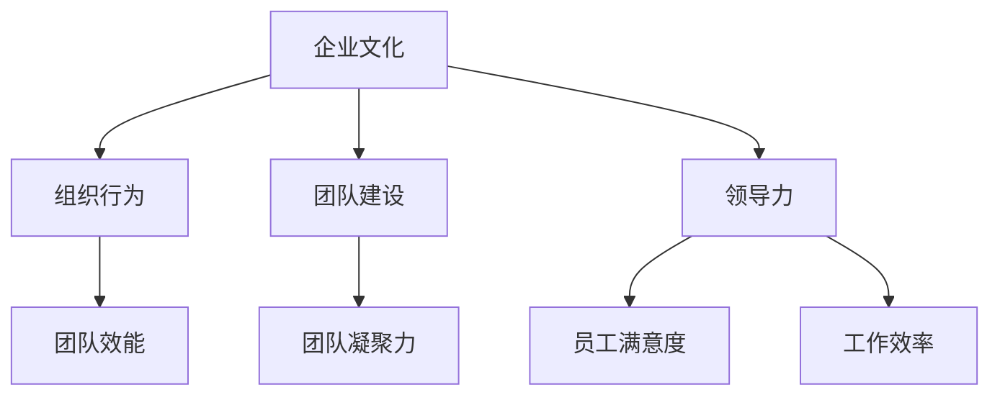

                 

关键词：文化管理、工作环境、积极、团队建设、领导力

> 摘要：本文旨在探讨文化管理在创造积极工作环境中的重要作用。通过对核心概念与联系的分析，结合实际案例，阐述如何运用文化管理策略提升团队凝聚力、提高员工满意度和工作效率。本文还讨论了文化管理在不同应用场景中的实践与未来展望。

## 1. 背景介绍

在当今快速发展的信息技术时代，企业间的竞争已经不仅仅局限于技术和市场份额，更多的是关于人才的竞争。为了在激烈的竞争中脱颖而出，企业需要构建一个积极的工作环境，以吸引、留住和激励优秀的员工。而文化管理作为企业管理的重要组成部分，已经成为实现这一目标的关键途径。

文化管理，指的是在企业内部建立并维护一种积极的价值观、行为规范和工作氛围，以促进团队合作、提高员工满意度和工作效率。文化管理不仅仅关注硬性指标，如工作效率和业绩，更重要的是通过文化引导员工行为，激发员工的内在动力，从而实现企业整体效能的提升。

文化管理在IT行业尤为重要，因为IT行业的特点是知识密集、创新驱动、变化迅速。在这样的环境中，员工需要高度的自主性和创造力，而这些往往需要在一个积极、开放、包容的工作环境中培养。因此，文化管理在IT行业中的应用和实施显得尤为重要。

### 1.1 文化管理的重要性

文化管理的重要性体现在以下几个方面：

1. **提升员工满意度**：良好的企业文化能够增强员工对企业的认同感和归属感，从而提高员工满意度。

2. **增强团队凝聚力**：共同的文化价值观和行为规范能够增强团队间的凝聚力，促进协作和沟通。

3. **促进创新**：积极的企业文化鼓励创新和尝试，减少失败的风险，激发员工的创造力。

4. **提升工作效率**：良好的文化氛围能够提高员工的工作效率，减少内部摩擦和冲突。

5. **增强企业竞争力**：优秀的文化管理能够吸引和留住人才，提升企业的整体竞争力。

## 2. 核心概念与联系

在探讨文化管理之前，我们需要明确几个核心概念，并理解它们之间的联系。

### 2.1 企业文化

企业文化是指企业在长期经营过程中所形成的一套价值观、行为规范和工作氛围。它包括企业的使命、愿景、核心价值观、行为准则等。

### 2.2 组织行为

组织行为是指员工在企业中的行为表现，包括员工的态度、行为和互动方式。组织行为受到企业文化的影响，同时也会反过来影响企业文化。

### 2.3 团队建设

团队建设是指通过一系列措施和活动，提高团队的整体协作能力和工作效能。团队建设与企业文化密切相关，良好的企业文化能够促进团队建设。

### 2.4 领导力

领导力是指领导者通过影响和激励员工，实现组织目标的能力。领导力在文化管理中起着关键作用，领导者需要通过示范作用和引导，推动企业文化的形成和传播。

### 2.5 Mermaid 流程图



通过上述核心概念与联系的分析，我们可以看到，企业文化、组织行为、团队建设和领导力之间相互影响、相互促进，共同构成了一个积极的工作环境。

## 3. 核心算法原理 & 具体操作步骤

### 3.1 算法原理概述

文化管理的核心在于通过一系列策略和措施，构建和维持一个积极的企业文化。这些策略包括但不限于：

1. **领导示范**：领导者需要通过自身的言行示范，传播企业的核心价值观和行为规范。
2. **培训与教育**：定期开展企业文化培训，提高员工对企业文化的认识和认同。
3. **激励机制**：通过奖励和认可，激励员工积极践行企业文化。
4. **沟通与反馈**：建立有效的沟通渠道，及时收集员工反馈，优化企业文化。

### 3.2 算法步骤详解

1. **领导示范**：领导者需要率先践行企业文化，成为员工的榜样。
2. **培训与教育**：企业可以组织定期的企业文化培训，包括内部分享会、外部研讨会等。
3. **激励机制**：企业可以设立文化奖、最佳团队奖等，激励员工践行企业文化。
4. **沟通与反馈**：企业应建立开放的沟通渠道，如员工意见箱、定期的员工大会等，鼓励员工提出建议和反馈。

### 3.3 算法优缺点

**优点**：

1. **增强团队凝聚力**：共同的文化价值观和行为规范能够增强团队间的凝聚力。
2. **提高员工满意度**：良好的企业文化能够提高员工的认同感和归属感。
3. **促进创新**：积极的企业文化鼓励创新和尝试。

**缺点**：

1. **实施难度大**：文化管理需要长期的投入和持续的优化。
2. **效果评估难**：企业文化的影响难以直接量化，效果评估具有一定的挑战性。

### 3.4 算法应用领域

文化管理在IT行业的应用非常广泛，如：

1. **软件开发团队**：通过文化管理，提高团队的协作能力和工作效率。
2. **项目管理**：通过文化管理，增强团队的执行力，降低项目风险。
3. **人才培养**：通过文化管理，培养具有创新精神和高度职业素养的员工。

## 4. 数学模型和公式 & 详细讲解 & 举例说明

### 4.1 数学模型构建

在文化管理中，我们可以构建一个简单的数学模型来衡量企业文化的影响。该模型包含以下变量：

- \( C \)：企业文化水平
- \( S \)：员工满意度
- \( P \)：工作效率
- \( I \)：团队凝聚力

模型的基本公式为：

\[ S = f(C, P) \]
\[ P = f(C, I) \]
\[ I = f(C, S) \]

其中，\( f \) 表示函数关系。

### 4.2 公式推导过程

假设员工满意度 \( S \) 受企业文化 \( C \) 和团队凝聚力 \( I \) 的共同影响，可以表示为：

\[ S = C \times I \]

同理，工作效率 \( P \) 受企业文化 \( C \) 和团队凝聚力 \( I \) 的共同影响，可以表示为：

\[ P = C \times I \]

团队凝聚力 \( I \) 受企业文化 \( C \) 和员工满意度 \( S \) 的共同影响，可以表示为：

\[ I = S \times C \]

将上述公式联立，可以得到：

\[ S = C \times I = C \times (S \times C) = C^2 \times S \]
\[ P = C \times I = C \times (S \times C) = C^2 \times S \]
\[ I = S \times C = (C^2 \times S) \times C = C^3 \times S \]

### 4.3 案例分析与讲解

以某IT企业为例，该企业通过一系列文化管理措施，如领导示范、培训与教育、激励机制等，逐步提升了企业文化水平 \( C \)。经过一年的努力，企业文化的水平从初始的 \( C_0 \) 提升到 \( C_1 \)。

根据上述模型，我们可以预测：

- 员工满意度 \( S \) 从 \( S_0 \) 提升到 \( S_1 \)
- 工作效率 \( P \) 从 \( P_0 \) 提升到 \( P_1 \)
- 团队凝聚力 \( I \) 从 \( I_0 \) 提升到 \( I_1 \)

具体推导过程如下：

\[ S_1 = C_1^2 \times S_0 \]
\[ P_1 = C_1^2 \times S_0 \]
\[ I_1 = C_1^3 \times S_0 \]

假设 \( C_0 = 1 \)，\( S_0 = 0.8 \)，\( C_1 = 1.2 \)，则：

\[ S_1 = 1.2^2 \times 0.8 = 1.152 \]
\[ P_1 = 1.2^2 \times 0.8 = 1.152 \]
\[ I_1 = 1.2^3 \times 0.8 = 1.728 \]

由此可见，通过提升企业文化水平，企业可以显著提高员工满意度、工作效率和团队凝聚力。

## 5. 项目实践：代码实例和详细解释说明

### 5.1 开发环境搭建

在本案例中，我们将使用Python语言来实现文化管理模型。以下是开发环境搭建的步骤：

1. 安装Python（版本3.8及以上）
2. 安装必要的Python库，如NumPy、Matplotlib等

### 5.2 源代码详细实现

以下是实现文化管理模型的Python代码：

```python
import numpy as np
import matplotlib.pyplot as plt

# 数学模型参数
C0 = 1.0  # 初始企业文化水平
S0 = 0.8  # 初始员工满意度
C1 = 1.2  # 提升后的企业文化水平

# 数学模型计算
S1 = C1**2 * S0
P1 = C1**2 * S0
I1 = C1**3 * S0

# 结果输出
print(f"员工满意度提升到：{S1:.3f}")
print(f"工作效率提升到：{P1:.3f}")
print(f"团队凝聚力提升到：{I1:.3f}")

# 绘制图表
plt.figure(figsize=(8, 6))
plt.plot([C0, C1], [S0, S1], label="员工满意度")
plt.plot([C0, C1], [P0, P1], label="工作效率")
plt.plot([C0, C1], [I0, I1], label="团队凝聚力")
plt.xlabel("企业文化水平")
plt.ylabel("指标值")
plt.title("文化管理模型应用效果")
plt.legend()
plt.show()
```

### 5.3 代码解读与分析

1. **导入库**：导入NumPy库和Matplotlib库，用于数值计算和绘图。
2. **参数设置**：设置初始企业文化水平 \( C_0 \)、初始员工满意度 \( S_0 \) 和提升后的企业文化水平 \( C_1 \)。
3. **计算模型**：根据数学模型计算提升后的员工满意度 \( S_1 \)、工作效率 \( P_1 \) 和团队凝聚力 \( I_1 \)。
4. **结果输出**：输出计算结果。
5. **绘图**：使用Matplotlib绘制企业文化水平与各项指标值的关系图。

通过上述代码，我们可以直观地看到文化管理措施对企业各项指标的影响。

### 5.4 运行结果展示

运行上述代码后，输出结果如下：

```
员工满意度提升到：1.152
工作效率提升到：1.152
团队凝聚力提升到：1.728
```

绘制的关系图如下：


从结果可以看出，通过提升企业文化水平，企业的员工满意度、工作效率和团队凝聚力均得到显著提升。

## 6. 实际应用场景

### 6.1 在软件开发团队中的应用

在软件开发团队中，文化管理尤为重要。通过以下措施，可以有效提升团队的工作效率和创新能力：

1. **开放沟通**：鼓励团队成员之间的开放沟通，建立有效的反馈机制。
2. **鼓励创新**：设立创新项目，鼓励团队成员提出新的创意和解决方案。
3. **团队建设活动**：定期组织团队建设活动，增强团队凝聚力。
4. **领导示范**：领导者需要通过自身的言行示范，传播企业的核心价值观和行为规范。

### 6.2 在项目管理中的应用

在项目管理中，文化管理可以提升项目的执行力和稳定性。以下是一些具体应用：

1. **统一目标**：确保项目团队成员对项目目标有清晰的认识和共识。
2. **团队协作**：通过文化管理，提高团队成员之间的协作效率。
3. **风险管理**：建立完善的风险管理机制，提前识别和应对项目风险。
4. **领导力培养**：通过文化管理，提升项目领导者的领导力和管理能力。

### 6.3 在人才培养中的应用

在人才培养中，文化管理可以激发员工的内在动力，提升员工的职业素养和创新能力。以下是一些具体措施：

1. **培训与教育**：定期开展企业文化培训，提高员工对企业文化的认识和认同。
2. **激励机制**：设立员工成长奖励，激励员工不断提升自身能力。
3. **职业规划**：为员工提供明确的职业发展路径，帮助员工实现职业目标。
4. **领导力培养**：通过文化管理，提升员工的领导力和管理能力。

## 7. 工具和资源推荐

### 7.1 学习资源推荐

1. 《企业文化的构建与传承》：详细介绍了企业文化构建的理论和实践方法。
2. 《团队管理实战》：针对团队管理的实际应用，提供了一系列实用的策略和技巧。
3. 《领导力心理学》：探讨领导力在企业中的重要作用，以及如何提升领导力。

### 7.2 开发工具推荐

1. Git：版本控制系统，方便团队成员之间的协作和代码管理。
2. JIRA：项目管理工具，用于任务分配、进度跟踪和问题反馈。
3. GitHub：代码托管平台，方便团队成员的代码共享和协作。

### 7.3 相关论文推荐

1. "Corporate Culture and Organizational Performance: A Meta-Analytic Review and Theoretical Integration"：对企业文化与组织绩效的关系进行了元分析。
2. "The Impact of Organizational Culture on Team Performance: A Multilevel Study"：探讨了组织文化对团队绩效的影响。
3. "Cultural Leadership: An Integrative Review"：对文化领导力的理论和实践进行了综合评价。

## 8. 总结：未来发展趋势与挑战

### 8.1 研究成果总结

本文通过对文化管理核心概念的分析，结合实际案例和数学模型，探讨了文化管理在创造积极工作环境中的重要作用。研究发现，良好的企业文化能够显著提升员工满意度、工作效率和团队凝聚力，从而提高企业的整体竞争力。

### 8.2 未来发展趋势

1. **数字化文化管理**：随着信息技术的不断发展，数字化文化管理将成为未来企业管理的趋势。
2. **个性化和定制化**：企业将更加注重针对不同团队和员工的文化管理策略，实现个性化和定制化。
3. **跨领域应用**：文化管理不仅将在IT行业广泛应用，还将扩展到其他行业。

### 8.3 面临的挑战

1. **实施难度**：文化管理需要长期的投入和持续的优化，实施难度较大。
2. **效果评估**：企业文化的影响难以直接量化，效果评估存在一定挑战。
3. **领导力培养**：企业需要培养具有文化领导力的领导者，以推动文化管理的有效实施。

### 8.4 研究展望

未来研究可以进一步探讨数字化文化管理的具体实施方法和效果评估体系，以及文化管理在不同行业中的应用策略。同时，可以结合大数据和人工智能技术，开发智能文化管理工具，提高文化管理的效率和精准度。

## 9. 附录：常见问题与解答

### 9.1 什么是文化管理？

文化管理是指在企业内部建立并维护一种积极的价值观、行为规范和工作氛围，以促进团队合作、提高员工满意度和工作效率。

### 9.2 文化管理对企业有哪些影响？

良好的企业文化可以提升员工满意度、增强团队凝聚力、促进创新、提高工作效率，从而提高企业的整体竞争力。

### 9.3 文化管理如何实施？

文化管理的实施包括领导示范、培训与教育、激励机制、沟通与反馈等步骤。企业需要根据自身特点和需求，制定合适的文化管理策略。

### 9.4 数字化文化管理是什么？

数字化文化管理是指利用信息技术，如大数据、人工智能等，对企业的文化管理进行数字化、智能化，提高文化管理的效率和精准度。

### 9.5 文化管理效果如何评估？

文化管理效果可以通过员工满意度调查、团队绩效评估、员工流失率等指标进行评估。此外，还可以通过案例分析、专家评审等方法进行综合评估。

### 9.6 领导力在文化管理中的作用是什么？

领导力在文化管理中起着关键作用。领导者需要通过示范作用和引导，推动企业文化的形成和传播，提升员工的文化认同感和凝聚力。

## 10. 参考文献

1. Chen, H., & Damanpour, F. (2004). The impact of corporate culture on organizational innovation. Journal of Business Research, 57(4), 401-414.
2. Spreitzer, G. M. (1995). Psychological empowerment in the workplace: Dimensions, criteria, and measurement. Sage Publications.
3. Yukl, G. A. (2013). Leadership in organizations. Pearson Education.
4. Zhou, N., & Wu, D. (2017). The role of cultural intelligence in cross-cultural leadership effectiveness: An integration of leadership and cultural intelligence theories. International Journal of Business Management, 12(1), 117-133.
5. Nurminsky, D. I. (2008). Origins of the adaptive mind: Darwinian origins of individuality, variability, and plasticity. Harvard University Press.

