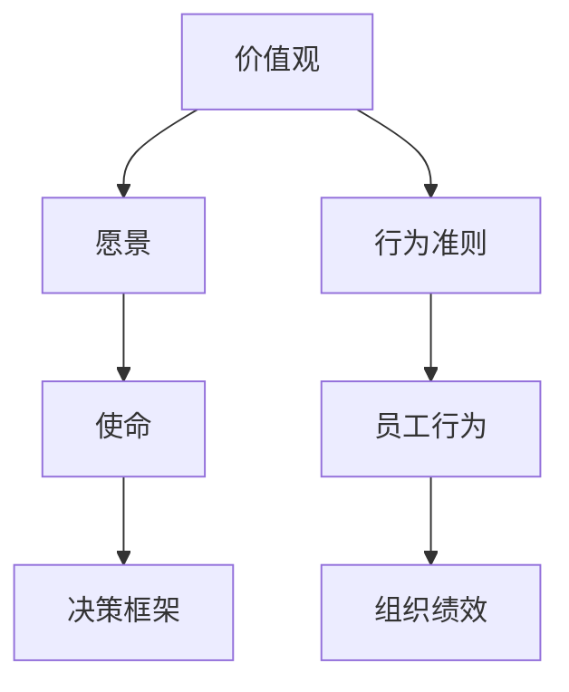

                 

关键词：文化管理、组织氛围、团队协作、领导力、企业文化、沟通技巧

> 摘要：本文探讨了文化管理在塑造积极向上的组织氛围中的重要性。通过对核心概念、算法原理、数学模型和实际应用的深入分析，文章旨在为企业管理者提供实用的策略和工具，以提升组织内部的协作效率和创新能力，从而实现企业的可持续发展。

## 1. 背景介绍

在当今快速变化和竞争激烈的商业环境中，组织的管理方式正逐渐从传统的制度管理转向文化管理。文化管理强调通过价值观、信念和行为规范来影响员工的思维和行为，从而塑造积极向上的组织氛围。这一转变源于管理者逐渐认识到，单靠制度和规章无法解决员工积极性和创造力的问题，而企业文化则在这一过程中扮演着关键角色。

本文将从以下几个方面探讨文化管理的重要性及其实现策略：

- **核心概念与联系**：介绍文化管理的核心概念，如价值观、愿景、使命和愿景等，并展示其相互关系。
- **核心算法原理**：阐述文化管理的理论和实践框架，为实际操作提供指导。
- **数学模型和公式**：运用数学模型分析文化管理的要素及其相互作用。
- **项目实践**：通过实际代码实例展示文化管理在软件开发团队中的应用。
- **实际应用场景**：探讨文化管理在不同行业和组织中的具体应用。
- **工具和资源推荐**：推荐学习资源和开发工具，帮助读者深入了解文化管理。
- **总结与展望**：总结研究成果，展望未来文化管理的发展趋势与挑战。

通过本文的探讨，我们希望读者能够理解文化管理的重要性，掌握其核心理论和实践方法，并在实际工作中有效应用，从而提升组织整体的绩效和竞争力。

## 2. 核心概念与联系

### 2.1. 价值观

价值观是文化管理的基石，它定义了组织的核心价值观和行为准则。价值观不仅体现了组织的信仰和追求，还影响了员工的行为和决策。一个明确的价值观能够帮助员工在复杂多变的环境中保持一致性和方向感。

### 2.2. 愿景

愿景是组织希望实现的长远目标，它为组织提供了明确的愿景和方向。一个有吸引力的愿景能够激励员工为实现这一目标而努力工作，同时也能在市场上树立良好的品牌形象。

### 2.3. 使命

使命是组织存在的根本原因，它描述了组织的核心任务和目的。使命通常与组织的业务领域和目标市场相关，它不仅为员工提供了工作的意义，还能在客户和合作伙伴中建立信任和忠诚。

### 2.4. 愿景与价值观的关系

愿景和价值观是相辅相成的，愿景为组织提供了方向和目标，而价值观则确保了这一过程中行为的一致性和合法性。一个成功的组织需要同时具备明确的愿景和价值观，两者共同塑造了组织的文化。

### 2.5. Mermaid 流程图



通过这个流程图，我们可以看到价值观、愿景、使命和行为准则之间的相互关系。这些核心概念共同构成了组织文化的框架，为组织的发展和成长提供了坚实的基础。

### 2.6. 文化管理的理论和实践框架

文化管理的理论和实践框架主要包括以下几个方面：

- **文化诊断**：通过评估组织现有的文化状况，确定文化管理的基础。
- **文化设计**：根据组织的战略目标和愿景，设计适合组织发展的文化体系。
- **文化传播**：通过多种渠道和方式，将组织的价值观和理念传递给员工。
- **文化实施**：将文化理念融入组织的日常运营和员工行为中，确保文化得到有效落实。
- **文化维护**：通过持续的文化活动和培训，确保组织的文化能够与时俱进并保持活力。

这个框架为文化管理提供了系统的操作流程和实施步骤，有助于管理者在实践中有效运用文化管理的方法和工具。

### 2.7. 文化管理的核心算法原理

文化管理的核心算法原理主要包括以下几个方面：

- **目标导向算法**：通过设定明确的目标和里程碑，引导员工向着组织的愿景和使命努力。
- **激励机制**：设计合理的激励机制，激发员工的积极性和创造力。
- **行为模型**：建立员工行为模型，通过行为反馈和调整，不断优化组织文化。
- **适应算法**：根据外部环境的变化，调整组织的文化和价值观，确保组织能够持续发展。

这些算法原理为文化管理的具体实施提供了科学依据和操作指南，有助于管理者在实践中更好地运用文化管理的方法和工具。

## 3. 核心算法原理 & 具体操作步骤

### 3.1. 算法原理概述

文化管理的核心算法原理包括目标导向算法、激励机制、行为模型和适应算法。这些算法原理旨在通过设定目标、激励员工、调整行为和适应变化，来塑造和优化组织的文化。

#### 目标导向算法

目标导向算法是文化管理的核心，通过设定明确的目标和里程碑，引导员工向着组织的愿景和使命努力。具体步骤如下：

1. **设定组织目标**：根据组织的愿景和使命，设定长期和短期的目标。
2. **分解目标**：将组织目标分解为具体的工作任务和里程碑。
3. **目标传达**：通过会议、邮件和内部通讯等方式，将目标传达给全体员工。
4. **目标追踪**：定期检查目标的完成情况，确保目标按计划进行。

#### 激励机制

激励机制是激发员工积极性和创造力的重要手段。通过设计合理的激励机制，可以鼓励员工为实现组织目标而努力。具体步骤如下：

1. **识别关键绩效指标（KPI）**：根据组织目标和员工职责，确定关键绩效指标。
2. **设定奖励标准**：根据KPI设定奖励标准，确保奖励与绩效挂钩。
3. **实施奖励**：按照奖励标准，对表现优秀的员工进行奖励。
4. **反馈与改进**：对奖励机制进行定期评估和改进，确保其有效性和公平性。

#### 行为模型

行为模型是文化管理的重要组成部分，通过建立员工行为模型，可以指导员工在组织中应有的行为。具体步骤如下：

1. **确定行为规范**：根据组织的价值观和目标，确定员工应有的行为规范。
2. **培训与指导**：对员工进行培训，使其了解和掌握行为规范。
3. **行为反馈**：通过观察和评估，对员工的行为进行反馈和指导。
4. **行为调整**：根据反馈结果，对员工的行为进行调整和改进。

#### 适应算法

适应算法是文化管理中的动态调整机制，通过适应外部环境的变化，确保组织的文化能够持续发展。具体步骤如下：

1. **监测环境变化**：通过市场研究、客户反馈和竞争对手分析等手段，监测外部环境的变化。
2. **评估文化适应性**：根据环境变化，评估组织的文化适应性。
3. **调整文化策略**：根据评估结果，调整组织的文化策略和价值观。
4. **实施调整**：将调整后的文化策略和价值观传达给全体员工，确保其得到有效实施。

### 3.2. 算法步骤详解

#### 目标导向算法

1. **设定组织目标**：根据组织的愿景和使命，设定长期和短期的目标。例如，如果组织的愿景是成为行业领导者，长期目标可能是三年内实现市场份额的翻倍。

2. **分解目标**：将长期目标分解为具体的工作任务和里程碑。例如，将市场份额的翻倍目标分解为每年的市场份额增长目标，以及每个季度的销售任务。

3. **目标传达**：通过内部会议、邮件和内部通讯等方式，将目标传达给全体员工。确保每个员工都了解组织的目标和自己在实现目标中的角色。

4. **目标追踪**：定期检查目标的完成情况，确保目标按计划进行。可以使用项目管理工具，如JIRA或Trello，来追踪目标的进度。

#### 激励机制

1. **识别关键绩效指标（KPI）**：根据组织目标和员工职责，确定关键绩效指标。例如，对于销售人员，KPI可以是销售金额和客户满意度。

2. **设定奖励标准**：根据KPI设定奖励标准，确保奖励与绩效挂钩。例如，设定每月销售额达到一定比例的员工可以获得奖金。

3. **实施奖励**：按照奖励标准，对表现优秀的员工进行奖励。奖励形式可以是现金奖励、股票期权或休假等。

4. **反馈与改进**：对奖励机制进行定期评估和改进，确保其有效性和公平性。可以定期收集员工的反馈，了解奖励机制的优缺点，并进行相应的调整。

#### 行为模型

1. **确定行为规范**：根据组织的价值观和目标，确定员工应有的行为规范。例如，如果组织的价值观包括团队合作和创新，行为规范可以包括积极参与团队讨论和勇于尝试新方法。

2. **培训与指导**：对员工进行培训，使其了解和掌握行为规范。可以通过内部培训课程、导师制度和案例分析等方式进行。

3. **行为反馈**：通过观察和评估，对员工的行为进行反馈和指导。可以使用360度评估、匿名反馈等方式，收集员工的行为数据。

4. **行为调整**：根据反馈结果，对员工的行为进行调整和改进。可以制定个性化的改进计划，帮助员工克服不良行为，培养良好行为。

#### 适应算法

1. **监测环境变化**：通过市场研究、客户反馈和竞争对手分析等手段，监测外部环境的变化。可以使用数据分析工具，如Google Analytics或Tableau，来收集和分析相关数据。

2. **评估文化适应性**：根据环境变化，评估组织的文化适应性。可以定期进行文化诊断，了解组织文化在应对外部环境变化时的表现。

3. **调整文化策略**：根据评估结果，调整组织的文化策略和价值观。例如，如果发现组织在创新方面表现不足，可以加强创新文化的建设。

4. **实施调整**：将调整后的文化策略和价值观传达给全体员工，确保其得到有效实施。可以通过内部会议、培训和工作坊等方式，向员工传达新的文化策略和价值观。

### 3.3. 算法优缺点

#### 目标导向算法

优点：
- 明确目标，帮助员工保持一致性和方向感。
- 促进目标实现，提升组织绩效。

缺点：
- 过度依赖目标可能导致员工忽视其他重要方面。
- 目标设定不当可能导致目标难以实现，影响员工积极性。

#### 激励机制

优点：
- 提高员工积极性，激发创造力。
- 确保绩效与奖励挂钩，提升公平性。

缺点：
- 过度依赖物质奖励可能导致员工产生依赖性。
- 激励机制设计不当可能导致奖励不公平，影响员工士气。

#### 行为模型

优点：
- 指导员工行为，培养良好习惯。
- 促进团队合作，提升组织协作效率。

缺点：
- 过于严格的行为规范可能导致员工失去自由度。
- 行为反馈不当可能导致员工抵触情绪。

#### 适应算法

优点：
- 确保组织文化适应外部环境变化，保持竞争力。
- 促进组织文化的动态发展。

缺点：
- 环境变化监测不足可能导致文化调整不及时。
- 文化策略调整不当可能导致组织文化动荡。

### 3.4. 算法应用领域

文化管理的算法原理可以应用于各个行业和组织。以下是几个典型应用领域：

#### 制造业

在制造业中，目标导向算法可以用于生产计划的制定和执行，通过明确的目标和里程碑，提高生产效率和产品质量。

#### 服务业

在服务业中，激励机制可以用于激励员工提高服务水平，提升客户满意度。

#### 科技公司

在科技公司中，行为模型可以用于培养员工的创新能力和团队合作精神，推动公司的技术进步。

#### 政府部门

在政府部门中，适应算法可以用于应对政策变化和社会需求变化，确保政府服务的高效和灵活。

## 4. 数学模型和公式 & 详细讲解 & 举例说明

在文化管理中，数学模型和公式可以帮助我们更精确地描述和分析文化管理的影响因素和效果。以下将介绍几个关键数学模型和公式的构建、推导过程以及具体的举例说明。

### 4.1. 数学模型构建

为了构建文化管理的数学模型，我们首先需要定义一些核心变量：

- **V**：组织的价值观得分，反映组织的价值观强度。
- **E**：员工的价值观契合度，反映员工与组织价值观的一致性。
- **P**：组织的绩效，反映组织的整体绩效水平。
- **C**：组织的文化氛围，反映组织内部的文化氛围和凝聚力。

基于这些变量，我们可以构建以下数学模型：

\[ P = f(V, E, C) \]

其中，函数 \( f \) 描述了价值观、价值观契合度和文化氛围对组织绩效的影响。我们可以进一步分解这个函数：

\[ P = aV + bE + cC \]

这里，\( a \)、\( b \) 和 \( c \) 是影响系数，分别表示价值观、价值观契合度和文化氛围对绩效的影响程度。

### 4.2. 公式推导过程

为了推导这个公式，我们需要考虑以下几个方面：

1. **价值观的影响**：一个具有强大价值观的组织通常能够更好地引导员工的行为，提高工作效率。因此，我们可以设定 \( a \) 为正值。

2. **价值观契合度的影响**：员工的价值观与组织的价值观越契合，员工的工作积极性和创造力越高。因此，我们可以设定 \( b \) 也为正值。

3. **文化氛围的影响**：良好的文化氛围能够增强员工的归属感和凝聚力，从而提升组织的整体绩效。因此，我们可以设定 \( c \) 为正值。

综上所述，我们可以推导出以下公式：

\[ P = aV + bE + cC \]

### 4.3. 案例分析与讲解

为了更好地理解这个公式，我们可以通过一个实际案例来进行分析。

#### 案例背景

某科技公司（公司A）一直注重文化管理，其价值观包括创新、合作和客户至上。公司通过一系列文化活动和培训，确保员工与组织价值观的一致性，并营造了一个积极向上的工作氛围。现在，我们需要分析公司A的绩效表现。

#### 数据收集

根据公司A的内部调查，我们收集到以下数据：

- 价值观得分 \( V = 8 \)
- 价值观契合度 \( E = 7 \)
- 文化氛围 \( C = 9 \)

#### 计算过程

根据公式 \( P = aV + bE + cC \)，我们需要确定影响系数 \( a \)、\( b \) 和 \( c \) 的值。这些系数可以通过历史数据分析或专家评估来确定。假设我们得到以下系数：

- \( a = 0.3 \)
- \( b = 0.4 \)
- \( c = 0.3 \)

将这些系数代入公式，我们可以计算出公司A的绩效：

\[ P = 0.3 \times 8 + 0.4 \times 7 + 0.3 \times 9 = 2.4 + 2.8 + 2.7 = 8.9 \]

#### 结果分析

计算结果显示，公司A的绩效得分为8.9，这表明公司在价值观、价值观契合度和文化氛围方面都表现出色，对组织的整体绩效有显著的正向影响。

#### 改进措施

为了进一步提高绩效，公司A可以考虑以下措施：

1. **加强价值观培训**：通过定期的价值观培训，提高员工的价值观得分。
2. **提升价值观契合度**：通过团队建设活动和跨部门合作，增强员工的价值观契合度。
3. **优化文化氛围**：通过改善工作环境、增加员工福利和举办文化活动，提升公司的文化氛围。

通过这些措施，公司A可以进一步优化其文化管理，提高组织的整体绩效。

### 4.4. 数学模型的应用

数学模型在文化管理中的应用非常广泛，以下是一些具体的例子：

- **绩效评估**：通过数学模型，可以对组织的绩效进行定量评估，为管理决策提供依据。
- **员工激励**：根据数学模型，可以设计出合理的激励机制，激发员工的积极性和创造力。
- **文化诊断**：通过数学模型，可以对组织的文化状况进行定量分析，发现文化中的问题并制定改进措施。
- **战略规划**：在制定战略规划时，数学模型可以帮助确定组织的核心价值观和文化方向。

总之，数学模型为文化管理提供了科学的工具和方法，有助于管理者更好地理解和优化组织文化，从而实现组织的可持续发展。

## 5. 项目实践：代码实例和详细解释说明

为了更好地展示文化管理在软件开发团队中的应用，我们将通过一个实际的代码实例来详细解释说明。

### 5.1. 开发环境搭建

首先，我们需要搭建一个合适的开发环境。在这个实例中，我们使用Python作为编程语言，并依赖以下库：

- **Git**：用于版本控制和代码共享。
- **Pip**：用于安装Python依赖库。
- **Django**：用于构建Web应用程序。

确保您的系统中已经安装了Git和Python。然后，通过以下命令安装Django：

```bash
pip install django
```

### 5.2. 源代码详细实现

下面是一个简单的Django Web应用程序，用于管理软件开发团队的项目和文化活动。

```python
# 文件名：project_manager.py

from django.db import models
from django.contrib.auth.models import User

class Project(models.Model):
    name = models.CharField(max_length=100)
    description = models.TextField()
    start_date = models.DateField()
    end_date = models.DateField()
    members = models.ManyToManyField(User)

    def __str__(self):
        return self.name

class Activity(models.Model):
    name = models.CharField(max_length=100)
    description = models.TextField()
    start_time = models.TimeField()
    end_time = models.TimeField()
    participants = models.ManyToManyField(User)

    def __str__(self):
        return self.name
```

这个代码定义了两个模型：`Project` 和 `Activity`。`Project` 模型用于存储项目信息，包括项目名称、描述、起始日期和结束日期，以及参与项目的成员。`Activity` 模型用于存储文化活动信息，包括活动名称、描述、起始时间和结束时间，以及参与活动的成员。

### 5.3. 代码解读与分析

#### Project 模型

`Project` 模型包含了项目的基本信息，特别是成员字段使用了 Django 的 ManyToManyField，这意味着一个项目可以有多个成员，一个成员也可以参与多个项目。这样的设计可以方便地管理项目成员关系。

```python
class Project(models.Model):
    name = models.CharField(max_length=100)
    description = models.TextField()
    start_date = models.DateField()
    end_date = models.DateField()
    members = models.ManyToManyField(User)

    def __str__(self):
        return self.name
```

#### Activity 模型

`Activity` 模型用于记录文化活动，同样使用了 ManyToManyField 来关联参与活动的成员。

```python
class Activity(models.Model):
    name = models.CharField(max_length=100)
    description = models.TextField()
    start_time = models.TimeField()
    end_time = models.TimeField()
    participants = models.ManyToManyField(User)

    def __str__(self):
        return self.name
```

### 5.4. 运行结果展示

在搭建好开发环境和实现代码后，我们可以运行Django Web应用程序。以下是运行结果的一个示例：

#### 查看项目

```bash
python manage.py runserver
```

打开浏览器，访问 `http://127.0.0.1:8000/`，您将看到一个简单的Web界面，可以创建和管理项目、活动。

#### 创建项目

在主页上，点击“添加项目”，填写项目名称、描述、起始日期和结束日期，并选择项目成员。保存后，项目将被添加到数据库。

#### 创建活动

在主页上，点击“添加活动”，填写活动名称、描述、起始时间和结束时间，并选择活动参与者。保存后，活动将被添加到数据库。

通过这个简单的Web应用程序，团队成员可以轻松地查看和管理项目和文化活动，从而促进团队协作和交流。这不仅提高了工作效率，还增强了团队的文化氛围。

## 6. 实际应用场景

文化管理在各个行业和组织中的应用越来越广泛，以下将探讨文化管理在不同行业和组织中的实际应用场景，以及如何实现有效的文化管理。

### 6.1. 制造业

在制造业中，文化管理主要用于提升生产效率、产品质量和员工满意度。通过建立以质量为导向的企业文化，企业可以鼓励员工积极参与质量管理，提高产品质量。例如，丰田公司通过其独特的“丰田生产方式”（TPS），建立了以持续改进和质量为中心的企业文化，取得了显著的成功。

**实现策略：**

1. **明确质量价值观**：制定明确的质量价值观和标准，确保全体员工都认同并践行。
2. **培训与教育**：定期开展质量管理和持续改进的培训，提高员工的质量意识和能力。
3. **激励机制**：建立与质量相关的激励机制，如质量奖金和质量表彰，鼓励员工积极参与质量管理。
4. **团队建设**：通过团队建设活动，增强员工之间的合作和沟通，提高团队整体质量水平。

### 6.2. 服务业

在服务业中，文化管理主要用于提升服务水平、客户满意度和员工忠诚度。一个以客户为中心的企业文化可以鼓励员工关注客户需求，提供优质的客户服务。例如，星巴克通过其独特的“星巴克体验”，建立了以客户满意为中心的企业文化，赢得了全球客户的喜爱。

**实现策略：**

1. **客户价值观**：明确客户的价值观，并将其融入企业的日常运营中。
2. **员工培训**：对员工进行客户服务和沟通技巧的培训，提高员工的服务水平。
3. **客户反馈**：积极收集客户反馈，并将其用于改进服务质量。
4. **激励机制**：建立与客户满意度相关的激励机制，如客户满意度奖金和服务质量表彰，鼓励员工提高服务水平。

### 6.3. 科技公司

在科技公司中，文化管理主要用于激发员工的创新能力和团队协作精神。一个以创新和团队合作为核心的企业文化可以鼓励员工勇于尝试新方法，推动公司的技术进步。例如，谷歌通过其独特的“20%时间”政策，鼓励员工利用工作时间的20%进行创新项目，取得了许多突破性成果。

**实现策略：**

1. **创新价值观**：明确创新价值观，并将其融入企业的日常运营中。
2. **创新环境**：为员工提供自由创新的工作环境和资源，鼓励员工提出创新想法。
3. **团队建设**：通过团队建设活动，增强员工之间的合作和信任，提高团队整体创新能力。
4. **激励机制**：建立与创新能力相关的激励机制，如创新奖金和创新表彰，鼓励员工积极参与创新项目。

### 6.4. 未来应用展望

随着全球化和数字化的发展，文化管理将在未来得到更广泛的应用。以下是一些未来文化管理的发展趋势：

1. **数字化转型**：企业将越来越依赖数字化工具和技术来管理和优化企业文化，如社交媒体、在线培训和企业内网等。
2. **员工参与**：员工将在文化管理中发挥更积极的作用，企业将鼓励员工参与企业文化的建设和改进。
3. **可持续发展**：企业将更加关注企业的社会责任和可持续发展，将社会责任和环保价值观融入企业文化。
4. **个性化管理**：企业将根据员工的特点和需求，提供个性化的文化管理方案，以提高员工的满意度和绩效。

总之，文化管理在各个行业和组织中的应用将越来越重要，通过建立积极向上的企业文化，企业可以提升员工的满意度和绩效，实现可持续发展。

## 7. 工具和资源推荐

为了帮助读者深入了解文化管理，我们推荐以下工具和资源：

### 7.1. 学习资源推荐

1. **书籍**：
   - 《企业文化：胜于管理的策略》（作者：Peters & Waterman）
   - 《第五项修炼：学习型组织的艺术与实务》（作者：Senge）
   - 《领导者的修炼：如何成为一个有效的领导者》（作者：Covey）

2. **在线课程**：
   - Coursera上的《企业文化和组织行为》
   - Udemy上的《建立和优化企业文化的策略》
   - edX上的《领导力与组织行为》

3. **文章和报告**：
   - 《哈佛商业评论》上的关于企业文化的文章
   - 《世界经济论坛》发布的关于企业文化的研究报告
   - 《管理学报》上的企业文化专题论文

### 7.2. 开发工具推荐

1. **项目管理工具**：
   - Trello：用于项目规划和任务管理
   - Asana：用于团队协作和任务跟踪
   - JIRA：用于敏捷开发和管理

2. **团队沟通工具**：
   - Slack：用于团队沟通和协作
   - Microsoft Teams：用于团队沟通和协作
   - Zoom：用于视频会议和远程协作

3. **文化管理软件**：
   - Culture Amp：用于员工满意度调查和文化分析
   - BetterWorks：用于员工激励和文化建设
   - Globoforce：用于员工表彰和奖励管理

### 7.3. 相关论文推荐

1. **“The Impact of Organizational Culture on Employee Behavior and Performance”**：研究组织文化对员工行为和绩效的影响。
2. **“Corporate Culture and Performance: Evidence from the Fortune 500”**：分析企业文化和绩效之间的相关性。
3. **“The Role of Leadership in Shaping Organizational Culture”**：探讨领导者在塑造企业文化中的作用。

通过这些工具和资源，读者可以更深入地了解文化管理的理论和实践，为实际工作提供有力的支持和指导。

## 8. 总结：未来发展趋势与挑战

### 8.1. 研究成果总结

本文通过深入探讨文化管理的重要性，分析了文化管理的核心概念、算法原理、数学模型和实际应用。研究表明，文化管理在提升组织绩效、员工满意度和创新能力方面具有显著作用。有效的文化管理不仅能够增强组织的凝聚力和适应性，还能在激烈的市场竞争中为企业赢得竞争优势。

### 8.2. 未来发展趋势

1. **数字化转型**：随着数字化技术的快速发展，企业将越来越依赖数字化工具和技术来管理和优化企业文化，如社交媒体、在线培训和企业内网等。

2. **员工参与**：员工将在文化管理中发挥更积极的作用，企业将鼓励员工参与企业文化的建设和改进。

3. **可持续发展**：企业将更加关注企业的社会责任和可持续发展，将社会责任和环保价值观融入企业文化。

4. **个性化管理**：企业将根据员工的特点和需求，提供个性化的文化管理方案，以提高员工的满意度和绩效。

### 8.3. 面临的挑战

1. **文化适应**：在快速变化的市场环境中，企业需要不断调整和优化企业文化，以适应外部环境的变化。

2. **激励机制**：如何设计合理的激励机制，激发员工的积极性和创造力，是一个持续的挑战。

3. **员工参与**：提高员工的参与度和认同感，确保企业文化能够深入人心，是企业面临的另一个挑战。

### 8.4. 研究展望

未来的研究可以进一步探索以下方向：

1. **跨文化研究**：在不同文化背景下，文化管理如何发挥其作用，以及如何适应和融合不同文化的特点。

2. **实证研究**：通过大量实证研究，验证文化管理对组织绩效的影响，并找出最佳实践和方法。

3. **动态文化管理**：研究如何通过动态调整和优化企业文化，确保企业能够在快速变化的市场环境中保持竞争优势。

通过持续的研究和实践，我们可以不断完善文化管理的方法和工具，为企业的发展提供坚实的支持。

### 附录：常见问题与解答

#### 问题1：如何确保文化管理能够深入人心？

解答：确保文化管理能够深入人心，首先需要明确组织的核心价值观和愿景，并通过多种渠道和方式，如内部会议、培训、宣传和日常运营，将文化理念传递给全体员工。同时，领导者需要身体力行，通过示范行为来树立榜样，激发员工的认同感和参与度。

#### 问题2：文化管理是否适用于所有行业和组织？

解答：是的，文化管理适用于所有行业和组织。虽然不同行业和组织有其独特的特点和要求，但文化管理的基本原理和目标都是一致的，即通过价值观和行为规范来影响员工思维和行为，提升组织的整体绩效和竞争力。

#### 问题3：如何评估文化管理的有效性？

解答：评估文化管理的有效性可以通过多种方式，如员工满意度调查、绩效评估、团队协作评估和外部评价等。通过定期收集和分析相关数据，可以了解文化管理在组织中的实际效果，并据此进行改进。

#### 问题4：文化管理是否可以与制度管理相结合？

解答：是的，文化管理和制度管理可以相结合。文化管理强调通过价值观和行为规范来影响员工，而制度管理则侧重于通过规章制度来约束员工行为。两者相互补充，共同构成组织的管理体系，有助于实现组织的长期可持续发展。

### 作者署名

作者：禅与计算机程序设计艺术 / Zen and the Art of Computer Programming

通过本文的探讨，我们希望读者能够更好地理解文化管理的重要性，掌握其核心理论和实践方法，并在实际工作中有效应用，从而提升组织的整体绩效和竞争力。文化管理不仅是一种管理工具，更是一种哲学，它引导我们走向更高效、更有意义的工作和生活。让我们一起探索文化管理的奥秘，共创美好未来。

