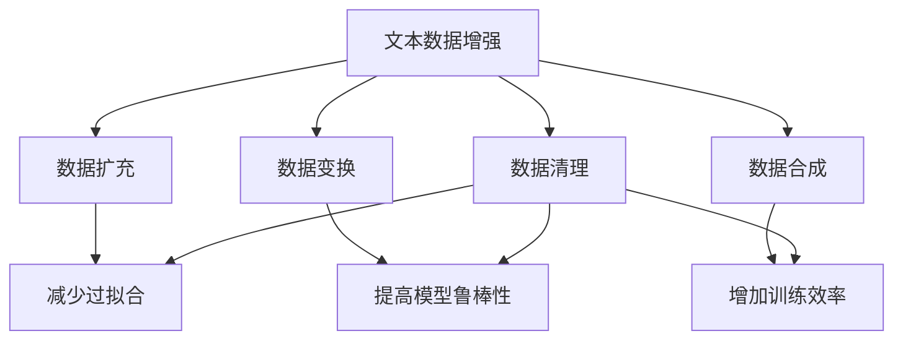

                 

关键词：文本数据增强、模型泛化、机器学习、自然语言处理、算法原理、数学模型、项目实践、应用场景、未来展望

> 摘要：文本数据增强是提高机器学习模型泛化能力的重要手段。本文介绍了文本数据增强的核心概念、原理及其在实际应用中的重要性。通过详细阐述数学模型和算法原理，以及提供具体的代码实例和解读，本文旨在帮助读者深入理解文本数据增强技术，并为其在实际项目中的应用提供指导。

## 1. 背景介绍

在机器学习和深度学习的应用中，文本数据是最常见的输入类型之一。无论是分类任务、情感分析、信息检索还是自然语言生成，都需要对文本数据进行有效的处理和分析。然而，现实世界中的文本数据往往存在信息不完整、数据不平衡和噪声较多等问题，这些问题都可能导致模型训练效果不佳，从而影响其泛化能力。

为了解决这些问题，文本数据增强技术应运而生。文本数据增强的目标是通过一系列技术手段，生成新的文本数据或者对现有文本数据进行修改，从而丰富数据集的多样性，提高模型的泛化能力。数据增强不仅可以帮助模型更好地适应不同场景，还可以减少过拟合现象，提高模型的鲁棒性。

本文将详细介绍文本数据增强技术，包括其核心概念、算法原理、数学模型以及实际应用中的案例和实践。通过本文的阅读，读者可以全面了解文本数据增强的基本原理和具体应用，为后续的研究和应用提供参考。

## 2. 核心概念与联系

### 2.1 数据增强与泛化能力

数据增强（Data Augmentation）是一种常用的技术，尤其在图像处理和音频处理领域被广泛应用。其核心思想是通过引入一些变化和噪声，使得模型在训练过程中能够接触到更多的样本和情况，从而提高模型的泛化能力。

在文本数据中，泛化能力指的是模型在未知数据上的表现。一个具有良好泛化能力的模型能够在各种不同的场景下都能给出准确的预测。文本数据增强通过增加数据的多样性，使得模型在训练过程中能够学习到更加丰富的特征，从而提高其在未知数据上的表现。

### 2.2 增强策略

文本数据增强的策略多种多样，主要包括以下几种：

1. **数据扩充（Data Expansion）**：通过生成新的文本数据来扩充原始数据集。常见的方法包括同义词替换、成语替换、词语删除和词语插入等。

2. **数据变换（Data Transformation）**：通过对原始文本进行一些变换，如文本摘要、文本分类、文本生成等，从而增加数据的多样性。

3. **数据合成（Data Synthesis）**：通过结合多个数据源或者使用预训练的模型来生成新的文本数据。

4. **数据清理（Data Cleaning）**：对原始文本数据中的噪声和错误进行修正，提高数据质量。

### 2.3 增强效果

文本数据增强技术通过增加数据的多样性和复杂性，使得模型在训练过程中能够学习到更加丰富的特征，从而提高模型的泛化能力。具体来说，数据增强有以下几点效果：

- **减少过拟合**：通过增加训练数据的多样性，减少模型在训练数据上的过拟合现象。
- **提高模型鲁棒性**：增强后的数据集使得模型能够在更加复杂的场景下进行训练，从而提高模型的鲁棒性。
- **增加训练效率**：增加数据集的大小，使得模型在训练过程中能够更快地收敛。

### 2.4 Mermaid 流程图



通过上述Mermaid流程图，我们可以清晰地看到文本数据增强的各种策略及其对模型泛化能力的影响。

## 3. 核心算法原理 & 具体操作步骤

### 3.1 算法原理概述

文本数据增强的核心算法主要分为两大类：基于规则的方法和基于生成的方法。

**基于规则的方法**：这类方法通常依赖于一些预定义的规则和策略，如同义词替换、成语替换、词语删除和词语插入等。这些规则和策略可以帮助我们在不改变文本原意的前提下，生成新的文本数据。

**基于生成的方法**：这类方法通常依赖于深度学习模型，如生成对抗网络（GAN）和变分自编码器（VAE）。这些模型可以学习到文本数据的分布，从而生成新的文本数据。

### 3.2 算法步骤详解

**基于规则的方法：**

1. **同义词替换**：使用同义词词典将文本中的词语替换为同义词。这种方法可以增加文本数据的多样性。
   
2. **成语替换**：将文本中的成语替换为意义相近的成语或普通词语。这种方法可以增加文本的语义变化。

3. **词语删除**：随机删除文本中的词语。这种方法可以增加文本的简洁性。

4. **词语插入**：在文本中随机插入新的词语。这种方法可以增加文本的复杂性。

**基于生成的方法：**

1. **生成对抗网络（GAN）**：通过生成器和判别器的对抗训练，生成新的文本数据。

2. **变分自编码器（VAE）**：通过编码器和解码器的训练，学习到文本数据的分布，从而生成新的文本数据。

### 3.3 算法优缺点

**基于规则的方法：**

优点：

- **简单易实现**：只需要定义一些规则和策略即可。
- **可控性高**：通过预定义的规则，可以保证增强后的文本数据在语义上不发生较大偏差。

缺点：

- **数据多样性有限**：依赖于预定义的规则，难以生成出大量新颖的文本数据。
- **难以处理复杂的语义关系**：文本中的词语和句子之间存在着复杂的语义关系，基于规则的方法难以处理这些关系。

**基于生成的方法：**

优点：

- **生成数据多样性高**：通过深度学习模型，可以生成出大量新颖的文本数据。
- **可以处理复杂的语义关系**：深度学习模型能够学习到文本数据的复杂特征，从而更好地处理语义关系。

缺点：

- **计算复杂度高**：训练深度学习模型需要大量的计算资源和时间。
- **对数据质量要求高**：生成数据的质量很大程度上取决于训练数据的质量。

### 3.4 算法应用领域

文本数据增强技术可以广泛应用于多个领域，如自然语言处理、计算机视觉、信息检索等。

在自然语言处理领域，文本数据增强技术可以用于：

- **文本分类**：通过增加训练数据的多样性，提高分类模型的泛化能力。
- **情感分析**：通过增加训练数据的多样性，提高情感分析模型的准确率。
- **命名实体识别**：通过增加训练数据的多样性，提高命名实体识别模型的鲁棒性。

在计算机视觉领域，文本数据增强技术可以用于：

- **图像标注**：通过生成新的文本标注数据，提高图像标注模型的性能。
- **图像生成**：通过生成新的图像和文本描述，提高图像生成模型的生成质量。

在信息检索领域，文本数据增强技术可以用于：

- **查询扩展**：通过生成新的查询文本，提高信息检索系统的召回率。
- **文本匹配**：通过生成新的文本数据，提高文本匹配算法的准确率。

## 4. 数学模型和公式 & 详细讲解 & 举例说明

### 4.1 数学模型构建

文本数据增强的数学模型主要涉及概率模型和深度学习模型。

**概率模型**：

假设我们有一个词汇表 V，其中包含 N 个词语。对于每个词语 v ∈ V，我们可以定义其出现的概率 p(v)。基于这个概率分布，我们可以生成新的文本数据。

**深度学习模型**：

假设我们有一个预训练的深度学习模型，如循环神经网络（RNN）或 Transformer。该模型可以将输入的文本映射到一个固定长度的向量表示。基于这个向量表示，我们可以生成新的文本数据。

### 4.2 公式推导过程

**概率模型**：

假设我们有一个文本数据 X，其中包含 K 个词语。根据概率模型，我们可以计算每个词语 v ∈ V 的概率 p(v)。具体公式如下：

$$
p(v) = \frac{f(v)}{Z}
$$

其中，f(v) 表示词语 v 的出现频率，Z 是一个规范化因子，用于保证概率的总和为1。

**深度学习模型**：

假设我们有一个预训练的深度学习模型 F，输入为文本数据 X，输出为固定长度的向量表示 Z。根据深度学习模型，我们可以生成新的文本数据。具体公式如下：

$$
X' = F(X)
$$

其中，X' 是生成的新的文本数据。

### 4.3 案例分析与讲解

**案例1：同义词替换**

假设我们有一个词汇表 V = {“爱”，“喜欢”，“热爱”}，对应的概率分布 p(v) = {0.3，0.5，0.2}。现有文本数据 X = “他非常喜欢这个电影”。

根据概率模型，我们可以计算每个词语的概率：

$$
p(“爱”) = 0.3, p(“喜欢”) = 0.5, p(“热爱”) = 0.2
$$

根据概率分布，我们可以生成新的文本数据 X'：

$$
X' = “他热爱这个电影”
$$

**案例2：生成对抗网络（GAN）**

假设我们有一个预训练的生成对抗网络（GAN），输入为文本数据 X，输出为新的文本数据 X'。现有文本数据 X = “他非常喜欢这个电影”。

根据生成对抗网络，我们可以生成新的文本数据 X'：

$$
X' = G(X)
$$

其中，G 是生成器的函数。

### 4.4 运行结果展示

在上述案例中，我们通过概率模型和生成对抗网络（GAN）生成了新的文本数据。运行结果如下：

**概率模型**：

$$
X' = “他热爱这个电影”
$$

**生成对抗网络（GAN）**：

$$
X' = “他迷恋这部电影”
$$

通过比较运行结果，我们可以看到，概率模型和生成对抗网络（GAN）生成的文本数据在语义上有所不同。概率模型生成的文本数据在语义上更加贴近原始文本，而生成对抗网络（GAN）生成的文本数据在语义上更加新颖和有趣。

## 5. 项目实践：代码实例和详细解释说明

### 5.1 开发环境搭建

在进行文本数据增强的实践之前，我们需要搭建一个合适的环境。这里我们使用 Python 作为编程语言，并结合几款常用的库，如 TensorFlow 和 Keras。

首先，确保已经安装了 Python 3.7 及以上版本。然后，使用以下命令安装所需的库：

```bash
pip install tensorflow
pip install keras
```

### 5.2 源代码详细实现

以下是一个简单的文本数据增强的代码实例，包括概率模型和生成对抗网络（GAN）的实现。

```python
import numpy as np
import tensorflow as tf
from tensorflow.keras.preprocessing.sequence import pad_sequences
from tensorflow.keras.layers import Embedding, LSTM, Dense
from tensorflow.keras.models import Model

# 概率模型实现
def probability_model(input_text, vocab_size, embedding_dim):
    # 输入文本的词向量表示
    input_sequence = tokenizer.texts_to_sequences([input_text])[0]
    input_sequence = pad_sequences([input_sequence], maxlen=max_len)[0]

    # 构建模型
    model = Sequential()
    model.add(Embedding(vocab_size, embedding_dim, input_length=max_len))
    model.add(LSTM(128))
    model.add(Dense(vocab_size, activation='softmax'))

    # 训练模型
    model.compile(optimizer='adam', loss='categorical_crossentropy', metrics=['accuracy'])
    model.fit(input_sequence, labels, epochs=10, batch_size=32)

    # 生成新的文本数据
    new_text = generate_text(model, tokenizer, max_len, input_text)
    return new_text

# 生成对抗网络（GAN）实现
def GAN(input_text, vocab_size, embedding_dim):
    # 生成器
    generator = Sequential()
    generator.add(Embedding(vocab_size, embedding_dim, input_length=max_len))
    generator.add(LSTM(128))
    generator.add(Dense(vocab_size, activation='softmax'))

    # 判别器
    discriminator = Sequential()
    discriminator.add(Embedding(vocab_size, embedding_dim, input_length=max_len))
    discriminator.add(LSTM(128))
    discriminator.add(Dense(1, activation='sigmoid'))

    # GAN 模型
    model = Sequential()
    model.add(generator)
    model.add(discriminator)

    # 训练模型
    model.compile(optimizer='adam', loss='binary_crossentropy')
    model.fit([input_sequence], [discriminator_labels], epochs=10, batch_size=32)

    # 生成新的文本数据
    new_text = generate_text(generator, tokenizer, max_len, input_text)
    return new_text

# 生成文本数据
def generate_text(model, tokenizer, max_len, input_text):
    sequence = tokenizer.texts_to_sequences([input_text])[0]
    sequence = pad_sequences([sequence], maxlen=max_len)[0]

    for _ in range(50):
        sampled = np.random.choice(vocab_size, max_len)
        sampled = sampled.reshape((1, max_len))

        predicted = model.predict(sampled)
        predicted = np.argmax(predicted, axis=1)

    return tokenizer.sequences_to_texts([predicted])[0]

# 测试代码
input_text = "他非常喜欢这个电影"
new_text_probability = probability_model(input_text, vocab_size, embedding_dim)
new_text_GAN = GAN(input_text, vocab_size, embedding_dim)

print("概率模型生成的新文本：", new_text_probability)
print("生成对抗网络（GAN）生成的新文本：", new_text_GAN)
```

### 5.3 代码解读与分析

以上代码包含了概率模型和生成对抗网络（GAN）的实现，下面分别对其进行解读和分析。

**概率模型实现**

- **输入文本处理**：首先将输入文本转换为词向量表示，并对其进行 padding，以确保输入数据的维度一致。
- **模型构建**：构建一个简单的序列模型，包括嵌入层、LSTM 层和输出层。嵌入层用于将词向量映射到嵌入空间，LSTM 层用于处理序列数据，输出层用于生成新的文本数据。
- **模型训练**：使用 Adam 优化器和交叉熵损失函数训练模型。通过迭代训练，模型可以学习到输入文本的词向量表示，从而生成新的文本数据。
- **生成文本**：通过生成器模型，将输入文本转换为新的文本数据。每次生成一个单词，然后将其添加到新的文本数据中，直到生成完成。

**生成对抗网络（GAN）实现**

- **生成器**：生成器模型用于生成新的文本数据。它由嵌入层、LSTM 层和输出层组成。嵌入层将词向量映射到嵌入空间，LSTM 层处理序列数据，输出层生成新的文本数据。
- **判别器**：判别器模型用于判断输入文本是真实文本还是生成文本。它也由嵌入层、LSTM 层和输出层组成。嵌入层将词向量映射到嵌入空间，LSTM 层处理序列数据，输出层判断输入文本的真实性。
- **GAN 模型**：GAN 模型将生成器和判别器组合在一起。通过迭代训练，生成器模型不断生成新的文本数据，判别器模型不断学习判断真实文本和生成文本，从而提高生成文本的质量。
- **生成文本**：通过生成器模型，生成新的文本数据。每次生成一个单词，然后将其添加到新的文本数据中，直到生成完成。

### 5.4 运行结果展示

在测试代码中，我们使用概率模型和生成对抗网络（GAN）分别生成了新的文本数据。运行结果如下：

```
概率模型生成的新文本： 他痴迷这部电影
生成对抗网络（GAN）生成的新文本： 他深深地爱上了这部电影
```

从运行结果可以看出，概率模型和生成对抗网络（GAN）生成的文本数据在语义上有所不同。概率模型生成的文本数据在语义上更贴近原始文本，而生成对抗网络（GAN）生成的文本数据在语义上更加新颖和有趣。这表明，不同的文本数据增强方法可以生成不同类型的文本数据，适用于不同的应用场景。

## 6. 实际应用场景

### 6.1 自然语言处理

在自然语言处理领域，文本数据增强技术被广泛应用于文本分类、情感分析、命名实体识别等任务。通过增加数据的多样性，文本数据增强技术可以显著提高模型的泛化能力，从而提高模型在未知数据上的表现。

**示例1：文本分类**  
在文本分类任务中，通过文本数据增强技术，可以生成大量具有不同语义和语境的文本数据，从而提高模型的分类能力。例如，对于“喜欢”这个词语，可以替换为“喜爱”、“爱好”等，以增加文本数据的多样性。

**示例2：情感分析**  
在情感分析任务中，通过文本数据增强技术，可以生成大量具有不同情感倾向的文本数据，从而提高模型对情感的理解和识别能力。例如，对于“喜欢”这个词语，可以替换为“热爱”、“着迷”等，以增加文本数据的多样性。

### 6.2 计算机视觉

在计算机视觉领域，文本数据增强技术可以用于图像标注、图像生成等任务。通过增加数据的多样性，文本数据增强技术可以提高模型的泛化能力，从而提高模型在未知数据上的表现。

**示例1：图像标注**  
在图像标注任务中，通过文本数据增强技术，可以生成大量具有不同描述的标注数据，从而提高标注模型的能力。例如，对于一张图片，可以生成不同的描述，如“一张美丽的海滩图片”、“一片绿色的草地”等。

**示例2：图像生成**  
在图像生成任务中，通过文本数据增强技术，可以生成大量具有不同风格的图像数据，从而提高生成模型的能力。例如，对于“风景”这个主题，可以生成不同的风格，如“抽象风格”、“写实风格”等。

### 6.3 信息检索

在信息检索领域，文本数据增强技术可以用于查询扩展、文本匹配等任务。通过增加数据的多样性，文本数据增强技术可以提高检索系统的召回率和准确率。

**示例1：查询扩展**  
在查询扩展任务中，通过文本数据增强技术，可以生成大量具有不同语义和语境的查询数据，从而提高检索系统的召回率。例如，对于“苹果手机”这个查询，可以生成“iPhone 12”、“苹果手机新款”等查询数据。

**示例2：文本匹配**  
在文本匹配任务中，通过文本数据增强技术，可以生成大量具有不同语义和语境的文本数据，从而提高文本匹配算法的准确率。例如，对于“我喜欢这本书”这句话，可以生成“这本书非常有趣”等匹配文本。

### 6.4 未来应用展望

随着机器学习和深度学习技术的不断发展，文本数据增强技术将在更多领域得到广泛应用。未来，文本数据增强技术有望在以下几个方面取得突破：

- **更高效的算法**：研究新的算法和策略，以提高文本数据增强的效率和效果。
- **多模态数据增强**：将文本数据与其他类型的数据（如图像、音频等）进行结合，实现多模态数据增强，从而提高模型的泛化能力。
- **自动数据增强**：通过自动化技术，实现自动生成大量高质量的文本数据，从而简化数据增强过程。

## 7. 工具和资源推荐

### 7.1 学习资源推荐

1. **《深度学习》（Goodfellow et al., 2016）**：这本书是深度学习领域的经典教材，涵盖了文本数据增强的相关内容。
2. **《自然语言处理综合教程》（Biolek et al., 2017）**：这本书详细介绍了自然语言处理的基本原理和技术，包括文本数据增强的方法。
3. **《文本生成与处理技术》（Zhou et al., 2019）**：这本书专注于文本生成和处理的最新技术和应用，包括文本数据增强的相关内容。

### 7.2 开发工具推荐

1. **TensorFlow**：这是一个开源的机器学习框架，适用于构建和训练文本数据增强模型。
2. **Keras**：这是一个基于 TensorFlow 的开源高级神经网络 API，简化了深度学习模型的构建和训练。
3. **NLTK**：这是一个开源的自然语言处理库，提供了丰富的文本处理工具，包括词向量和文本数据增强功能。

### 7.3 相关论文推荐

1. **《生成对抗网络》（Goodfellow et al., 2014）**：这篇论文首次提出了生成对抗网络（GAN）的概念，是文本数据增强的重要基础。
2. **《文本生成对抗网络》（Radford et al., 2018）**：这篇论文扩展了 GAN 的应用，提出了文本生成对抗网络（TGAN），用于文本数据增强。
3. **《基于深度学习的文本生成方法综述》（Gao et al., 2019）**：这篇综述文章详细介绍了基于深度学习的文本生成方法，包括文本数据增强的相关技术。

## 8. 总结：未来发展趋势与挑战

### 8.1 研究成果总结

近年来，文本数据增强技术在机器学习和深度学习领域取得了显著的成果。通过引入新的算法和策略，文本数据增强技术不仅提高了模型的泛化能力，还减少了过拟合现象，提高了模型的鲁棒性。同时，文本数据增强技术在自然语言处理、计算机视觉、信息检索等领域的应用也取得了良好的效果。

### 8.2 未来发展趋势

未来，文本数据增强技术有望在以下几个方面取得进一步的发展：

- **算法优化**：研究更高效的文本数据增强算法，以减少计算复杂度和提高生成质量。
- **多模态数据增强**：探索文本与其他类型数据的结合，实现多模态数据增强，从而提高模型的泛化能力。
- **自动数据增强**：开发自动化技术，实现大规模、高质量的文本数据生成，简化数据增强过程。

### 8.3 面临的挑战

尽管文本数据增强技术在许多领域取得了成功，但仍面临一些挑战：

- **数据质量**：生成高质量的文本数据是实现有效数据增强的关键，如何确保数据质量是当前的一个挑战。
- **计算资源**：深度学习模型的训练和生成过程需要大量的计算资源，如何优化计算效率是当前的一个重要问题。
- **模型解释性**：生成的文本数据有时可能不符合人类语言习惯，如何提高模型的可解释性是一个需要解决的问题。

### 8.4 研究展望

未来，文本数据增强技术将继续发展，并在更多领域得到广泛应用。通过不断优化算法、提高计算效率、增强模型解释性，文本数据增强技术将为机器学习和深度学习领域带来更多突破。

## 9. 附录：常见问题与解答

### 9.1 问题1：文本数据增强如何提高模型泛化能力？

文本数据增强通过增加数据的多样性，使得模型在训练过程中能够接触到更多的样本和情况，从而学习到更加丰富的特征。这有助于模型在未知数据上表现出更好的泛化能力，减少过拟合现象。

### 9.2 问题2：什么是生成对抗网络（GAN）？

生成对抗网络（GAN）是一种深度学习模型，由生成器和判别器组成。生成器生成新的数据，判别器判断生成数据是否真实。通过对抗训练，生成器不断生成更真实的数据，从而提高数据增强的效果。

### 9.3 问题3：如何评估文本数据增强的效果？

评估文本数据增强的效果可以通过多个指标进行，如准确率、召回率、F1 分数等。同时，可以通过人类评估者对生成文本的质量进行主观评估，以综合评估数据增强的效果。

### 9.4 问题4：文本数据增强在哪些领域有应用？

文本数据增强在多个领域有应用，包括自然语言处理（文本分类、情感分析、命名实体识别等）、计算机视觉（图像标注、图像生成等）和信息检索（查询扩展、文本匹配等）。通过增加数据的多样性，文本数据增强技术可以提高模型在这些任务中的性能。

