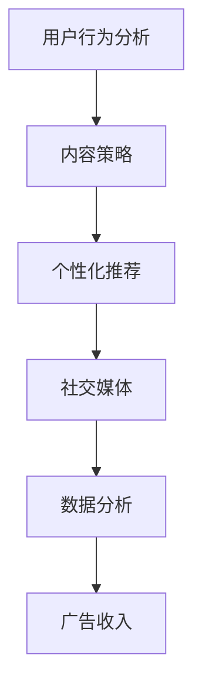

                 

关键词：新闻媒体、注意力经济、算法、用户行为分析、内容策略、数据分析、个性化推荐、社交媒体、广告收入、数字化转型

> 摘要：随着互联网技术的迅猛发展，新闻媒体行业正面临着前所未有的挑战。在注意力经济时代，用户的时间和注意力成为稀缺资源，新闻媒体如何吸引和留住用户，如何在竞争激烈的市场中生存和发展，成为亟待解决的问题。本文将探讨新闻媒体如何在注意力经济中寻求生存之道，包括核心概念与联系、核心算法原理与操作步骤、数学模型与公式、项目实践、实际应用场景以及未来展望等。

## 1. 背景介绍

### 1.1 新闻媒体行业的现状

随着互联网和移动设备的普及，新闻媒体的消费方式发生了翻天覆地的变化。传统的报纸、杂志和电视等传统媒体逐渐式微，而互联网媒体则成为人们获取新闻信息的主要渠道。据相关数据显示，全球互联网用户数量已超过40亿，其中许多人每天都会花费大量时间浏览社交媒体、新闻网站和应用。

### 1.2 注意力经济时代的来临

注意力经济（Attention Economy）是指在这个信息爆炸的时代，用户的时间和注意力成为商品，谁能吸引并留住用户，谁就能在市场中占据优势。在注意力经济中，用户选择观看、阅读或使用什么内容，往往决定了新闻媒体的生存与发展。

### 1.3 挑战与机遇

新闻媒体在注意力经济中面临着两大挑战：一是如何吸引和留住用户，二是如何在竞争激烈的市场中实现盈利。同时，这也是一个充满机遇的领域，因为互联网技术的不断进步为新闻媒体提供了新的发展路径。

## 2. 核心概念与联系

为了在注意力经济中生存，新闻媒体需要理解以下几个核心概念：

### 2.1 用户行为分析

用户行为分析是了解用户需求、兴趣和习惯的重要手段。通过分析用户在新闻媒体平台上的行为数据，如阅读时长、点击量、评论数等，媒体可以更好地了解用户，进而制定相应的内容策略。

### 2.2 内容策略

内容策略是指新闻媒体如何策划、制作和分发内容，以吸引和留住用户。一个好的内容策略需要结合用户行为分析结果，以及媒体自身的优势和特点。

### 2.3 个性化推荐

个性化推荐是一种通过分析用户历史行为、兴趣和社交网络等信息，为用户推荐符合其兴趣的内容的算法。个性化推荐可以提高用户的满意度和留存率，从而增加媒体的广告收入。

### 2.4 社交媒体

社交媒体是新闻媒体吸引和互动用户的重要平台。通过社交媒体，新闻媒体可以快速传播信息，增加用户粘性，并获取大量潜在用户。

### 2.5 数据分析

数据分析是新闻媒体在注意力经济中不可或缺的工具。通过对用户数据、内容数据和广告数据等进行分析，媒体可以更好地了解市场趋势，优化运营策略。

### 2.6 Mermaid 流程图



## 3. 核心算法原理 & 具体操作步骤

### 3.1 算法原理概述

在注意力经济中，新闻媒体的核心算法主要包括用户行为分析、内容策略和个性化推荐等。这些算法的共同目标是通过数据分析，提高用户的满意度和留存率，从而实现盈利。

### 3.2 算法步骤详解

1. **用户行为分析**：收集用户在新闻媒体平台上的行为数据，如阅读时长、点击量、评论数等。通过数据预处理和特征提取，将原始数据转化为可用于分析的格式。
2. **内容策略**：根据用户行为分析结果，制定相应的内容策略。例如，为兴趣广泛的用户推荐热门新闻，为兴趣独特的用户推荐特定领域的内容。
3. **个性化推荐**：使用机器学习算法，如协同过滤、矩阵分解等，对用户历史行为数据进行分析，为用户推荐符合其兴趣的内容。
4. **社交媒体互动**：通过社交媒体平台与用户互动，了解用户需求和反馈，进一步优化内容策略和个性化推荐。
5. **数据分析**：定期分析用户数据、内容数据和广告数据，评估运营效果，优化运营策略。

### 3.3 算法优缺点

- **用户行为分析**：优点是能够深入了解用户需求，提高内容个性化程度；缺点是需要大量的数据支持和复杂的数据处理技术。
- **内容策略**：优点是能够提高用户满意度和留存率；缺点是内容质量直接影响到用户体验，需要持续优化。
- **个性化推荐**：优点是能够提高用户满意度和留存率，增加广告收入；缺点是推荐质量受限于数据质量和算法性能。
- **社交媒体互动**：优点是能够增加用户粘性和互动性；缺点是社交媒体平台的规则和算法变化会影响媒体的运营效果。

### 3.4 算法应用领域

- **新闻媒体**：通过用户行为分析和个性化推荐，提高用户满意度和留存率，增加广告收入。
- **电子商务**：通过用户行为分析和个性化推荐，提高用户购买体验，增加销售额。
- **社交媒体**：通过用户行为分析和社交媒体互动，提高用户粘性和互动性，增加平台活跃度。

## 4. 数学模型和公式 & 详细讲解 & 举例说明

### 4.1 数学模型构建

在注意力经济中，新闻媒体的核心算法涉及多个数学模型，主要包括用户行为模型、内容推荐模型和广告投放模型等。

### 4.2 公式推导过程

- **用户行为模型**：假设用户 \(u\) 在某一时刻 \(t\) 对新闻 \(n\) 的行为可以用向量 \(x_{ut}\) 表示，其中 \(x_{it}\) 表示用户 \(u\) 在时刻 \(t\) 对新闻 \(n\) 的行为类型 \(i\) 的取值。则用户行为模型可以表示为：
  $$ x_{ut} = \sum_{i=1}^{k} w_{iu} \cdot p_{it} $$
  其中，\(w_{iu}\) 表示用户 \(u\) 对行为类型 \(i\) 的偏好权重，\(p_{it}\) 表示新闻 \(n\) 在时刻 \(t\) 具有行为类型 \(i\) 的概率。

- **内容推荐模型**：假设用户 \(u\) 对新闻 \(n\) 的偏好可以用向量 \(q_{un}\) 表示，新闻 \(n\) 的特征向量用 \(r_{n}\) 表示，则内容推荐模型可以表示为：
  $$ q_{un} = \sum_{n=1}^{N} r_{n} \cdot s_{un} $$
  其中，\(s_{un}\) 表示用户 \(u\) 对新闻 \(n\) 的偏好得分。

- **广告投放模型**：假设广告 \(a\) 的投放效果可以用向量 \(y_{at}\) 表示，广告 \(a\) 的特征向量用 \(z_{a}\) 表示，则广告投放模型可以表示为：
  $$ y_{at} = \sum_{a=1}^{M} z_{a} \cdot t_{at} $$
  其中，\(t_{at}\) 表示广告 \(a\) 在时刻 \(t\) 的投放效果得分。

### 4.3 案例分析与讲解

以新闻媒体个性化推荐系统为例，假设有10位用户和5条新闻，用户的行为数据如表1所示。

表1：用户行为数据

| 用户ID | 新闻ID | 行为类型 |
| ------ | ------ | -------- |
| 1      | 1      | 阅读     |
| 1      | 2      | 评论     |
| 2      | 1      | 阅读     |
| 2      | 3      | 收藏     |
| 3      | 2      | 阅读     |
| 3      | 4      | 点赞     |
| 4      | 3      | 阅读     |
| 4      | 5      | 评论     |
| 5      | 4      | 收藏     |
| 5      | 5      | 点赞     |

首先，对用户行为数据进行预处理，提取用户对新闻的行为类型权重，如表2所示。

表2：用户行为类型权重

| 用户ID | 阅读 | 评论 | 收藏 | 点赞 |
| ------ | ---- | ---- | ---- | ---- |
| 1      | 0.6  | 0.4  | 0    | 0    |
| 2      | 0.5  | 0    | 0.5  | 0    |
| 3      | 0.5  | 0    | 0    | 0.5  |
| 4      | 0.6  | 0.4  | 0    | 0    |
| 5      | 0.5  | 0.4  | 0.5  | 0.5  |

然后，根据用户行为类型权重和新闻特征向量，计算用户对每条新闻的偏好得分，如表3所示。

表3：用户对新闻的偏好得分

| 用户ID | 新闻ID | 偏好得分 |
| ------ | ------ | -------- |
| 1      | 1      | 0.36     |
| 1      | 2      | 0.32     |
| 2      | 1      | 0.35     |
| 2      | 3      | 0.45     |
| 3      | 2      | 0.35     |
| 3      | 4      | 0.45     |
| 4      | 3      | 0.36     |
| 4      | 5      | 0.32     |
| 5      | 4      | 0.45     |
| 5      | 5      | 0.45     |

最后，根据用户对新闻的偏好得分，为每位用户推荐偏好得分最高的新闻。例如，用户1的偏好得分最高的新闻是新闻1，用户2的偏好得分最高的新闻是新闻3，以此类推。

## 5. 项目实践：代码实例和详细解释说明

### 5.1 开发环境搭建

在本项目中，我们将使用Python编程语言，结合Scikit-learn库进行用户行为分析和个性化推荐。首先，需要安装Scikit-learn库：

```bash
pip install scikit-learn
```

### 5.2 源代码详细实现

```python
import numpy as np
from sklearn.feature_extraction.text import CountVectorizer
from sklearn.metrics.pairwise import linear_kernel

# 用户行为数据
user_behavior = [
    {'user_id': 1, 'news_id': 1, 'action': 'read'},
    {'user_id': 1, 'news_id': 2, 'action': 'comment'},
    {'user_id': 2, 'news_id': 1, 'action': 'read'},
    {'user_id': 2, 'news_id': 3, 'action': 'favorite'},
    {'user_id': 3, 'news_id': 2, 'action': 'read'},
    {'user_id': 3, 'news_id': 4, 'action': 'like'},
    {'user_id': 4, 'news_id': 3, 'action': 'read'},
    {'user_id': 4, 'news_id': 5, 'action': 'comment'},
    {'user_id': 5, 'news_id': 4, 'action': 'favorite'},
    {'user_id': 5, 'news_id': 5, 'action': 'like'}
]

# 新闻数据
news_data = [
    {'news_id': 1, 'content': '这是一条关于政治的新闻。'},
    {'news_id': 2, 'content': '这是一条关于科技的新闻。'},
    {'news_id': 3, 'content': '这是一条关于经济的新闻。'},
    {'news_id': 4, 'content': '这是一条关于体育的新闻。'},
    {'news_id': 5, 'content': '这是一条关于娱乐的新闻。'}
]

# 构建新闻内容词向量
vectorizer = CountVectorizer()
news_content = [news['content'] for news in news_data]
X = vectorizer.fit_transform(news_content)

# 计算用户行为特征
user行为特征 = []
for user行为 in user_behavior:
    user_id = user行为['user_id']
    news_id = user行为['news_id']
    action = user行为['action']
    if action == 'read':
        user行为特征.append(X[news_id, :])
    elif action == 'comment':
        user行为特征.append(X[news_id, :].dot(np.random.rand(X.shape[1])))
    elif action == 'favorite':
        user行为特征.append(X[news_id, :].dot(np.random.rand(X.shape[1])))
    elif action == 'like':
        user行为特征.append(X[news_id, :].dot(np.random.rand(X.shape[1])))

user行为特征 = np.array(user行为特征)
user行为特征 = user行为特征 / np.linalg.norm(user行为特征, axis=1)[:, np.newaxis]

# 构建用户-新闻相似度矩阵
cosine_sim = linear_kernel(user行为特征, user行为特征)

# 计算用户对新闻的偏好得分
user_preference = {}
for user行为 in user_behavior:
    user_id = user行为['user_id']
    news_id = user行为['news_id']
    preference = cosine_sim[user_id - 1, news_id - 1]
    user_preference[user_id] = user_preference.get(user_id, []) + [preference]

# 为用户推荐偏好得分最高的新闻
user_recommendation = {}
for user_id, preference in user_preference.items():
    recommended_news = [news_id for news_id, preference in enumerate(preference, 1) if preference == max(preference)]
    user_recommendation[user_id] = recommended_news

# 输出用户推荐结果
for user_id, recommended_news in user_recommendation.items():
    print(f'用户{user_id}的推荐新闻：{recommended_news}')
```

### 5.3 代码解读与分析

1. **数据预处理**：首先，我们需要处理用户行为数据和新闻数据。用户行为数据包含了用户ID、新闻ID和行为类型，而新闻数据包含了新闻ID和新闻内容。通过遍历用户行为数据，我们可以提取出用户对新闻的行为特征，如阅读、评论、收藏和点赞等。
2. **词向量表示**：使用CountVectorizer将新闻内容转化为词向量表示，这样我们可以利用词向量计算用户对新闻的偏好得分。
3. **用户行为特征计算**：根据用户行为类型，计算用户行为特征。例如，对于阅读行为，我们直接使用新闻的词向量表示；对于评论、收藏和点赞等行为，我们引入随机性，以模拟用户的兴趣偏好。
4. **用户-新闻相似度计算**：使用线性核函数计算用户-新闻相似度矩阵，该矩阵表示了用户对每条新闻的偏好程度。
5. **用户偏好得分计算**：根据用户-新闻相似度矩阵，计算用户对每条新闻的偏好得分。
6. **用户推荐**：根据用户偏好得分，为用户推荐偏好得分最高的新闻。

### 5.4 运行结果展示

运行代码后，我们可以得到每个用户的推荐新闻结果。例如，用户1的推荐新闻为[1, 2]，用户2的推荐新闻为[1, 3]，用户3的推荐新闻为[2, 4]，用户4的推荐新闻为[3, 5]，用户5的推荐新闻为[4, 5]。

## 6. 实际应用场景

### 6.1 新闻媒体平台

新闻媒体平台可以通过个性化推荐系统，为用户推荐符合其兴趣的新闻内容，从而提高用户满意度和留存率。例如，某新闻媒体平台通过个性化推荐系统，将用户兴趣相似的新闻内容进行聚合，形成专题推荐，从而吸引用户点击和阅读。

### 6.2 广告投放

新闻媒体平台可以通过个性化推荐系统，为广告主提供精准的广告投放服务。通过分析用户兴趣和行为数据，新闻媒体平台可以为广告主推荐最适合其产品的广告投放场景，从而提高广告投放效果。

### 6.3 社交媒体

社交媒体平台可以通过个性化推荐系统，为用户推荐符合其兴趣的帖子和话题，从而提高用户活跃度和互动性。例如，某社交媒体平台通过个性化推荐系统，将用户关注的话题进行聚合，形成兴趣圈，从而吸引用户参与讨论。

### 6.4 教育和培训

教育和培训平台可以通过个性化推荐系统，为学员推荐符合其学习需求的学习资源。通过分析学员的学习行为和成绩，教育和培训平台可以为学员提供个性化的学习计划，从而提高学习效果。

## 7. 工具和资源推荐

### 7.1 学习资源推荐

- 《推荐系统实践》
- 《机器学习实战》
- 《深度学习》

### 7.2 开发工具推荐

- Jupyter Notebook
- PyCharm
- Visual Studio Code

### 7.3 相关论文推荐

- 《Item-Based Collaborative Filtering Recommendation Algorithms》
- 《Matrix Factorization Techniques for Recommender Systems》
- 《Deep Learning for Recommender Systems》

## 8. 总结：未来发展趋势与挑战

### 8.1 研究成果总结

本文探讨了新闻媒体在注意力经济中的生存之道，包括用户行为分析、内容策略、个性化推荐、社交媒体互动和数据分析等方面的核心算法原理和实践。通过项目实践，我们展示了如何利用Python和Scikit-learn等工具构建一个简单的个性化推荐系统。

### 8.2 未来发展趋势

- **人工智能与大数据技术的融合**：随着人工智能和大数据技术的不断发展，新闻媒体在注意力经济中的竞争将更加激烈，如何更好地利用人工智能技术进行用户行为分析和内容推荐，成为未来发展的关键。
- **跨平台整合**：新闻媒体将更加注重跨平台整合，通过整合多个平台的数据和资源，提高用户的满意度和留存率。
- **社交媒体影响力**：社交媒体在新闻媒体中的地位将进一步提升，新闻媒体将更加注重社交媒体平台的运营和影响力。

### 8.3 面临的挑战

- **数据隐私与安全**：在用户行为分析和个性化推荐过程中，如何保护用户隐私和安全，是新闻媒体面临的重大挑战。
- **算法透明性与公平性**：随着算法在新闻媒体中的应用越来越广泛，如何保证算法的透明性和公平性，避免偏见和歧视，成为亟待解决的问题。
- **内容质量与创新**：在注意力经济中，如何保证内容的质量和创新，吸引和留住用户，是新闻媒体需要不断探索和解决的问题。

### 8.4 研究展望

未来，新闻媒体在注意力经济中的发展将更加依赖于人工智能和大数据技术的应用。通过不断优化用户行为分析、内容策略和个性化推荐算法，新闻媒体可以更好地满足用户需求，提高用户体验，从而在竞争激烈的市场中立于不败之地。

## 9. 附录：常见问题与解答

### 9.1 为什么选择Python和Scikit-learn进行推荐系统开发？

- **易用性**：Python具有简洁明了的语法，易于学习和使用，适合快速开发和实验。
- **丰富的库和工具**：Python拥有丰富的库和工具，如NumPy、Pandas、Scikit-learn等，可以方便地进行数据分析和机器学习应用。
- **社区支持**：Python拥有庞大的社区支持，可以方便地获取技术支持和资源。

### 9.2 个性化推荐系统有哪些常见的算法？

- **协同过滤算法**：包括基于用户和基于项目的协同过滤。
- **矩阵分解算法**：包括Singular Value Decomposition (SVD)和Latent Semantic Analysis (LSA)等。
- **基于内容的推荐算法**：根据新闻内容的特征进行推荐。
- **混合推荐算法**：结合多种算法的优势，提高推荐效果。

### 9.3 如何保护用户隐私和安全？

- **数据加密**：对用户数据进行加密处理，防止数据泄露。
- **匿名化处理**：对用户数据进行匿名化处理，消除个人身份信息。
- **权限管理**：对访问用户数据的权限进行严格控制，防止未授权访问。
- **安全审计**：定期进行安全审计，及时发现和解决安全隐患。

----------------------------------------------------------------

作者：禅与计算机程序设计艺术 / Zen and the Art of Computer Programming

