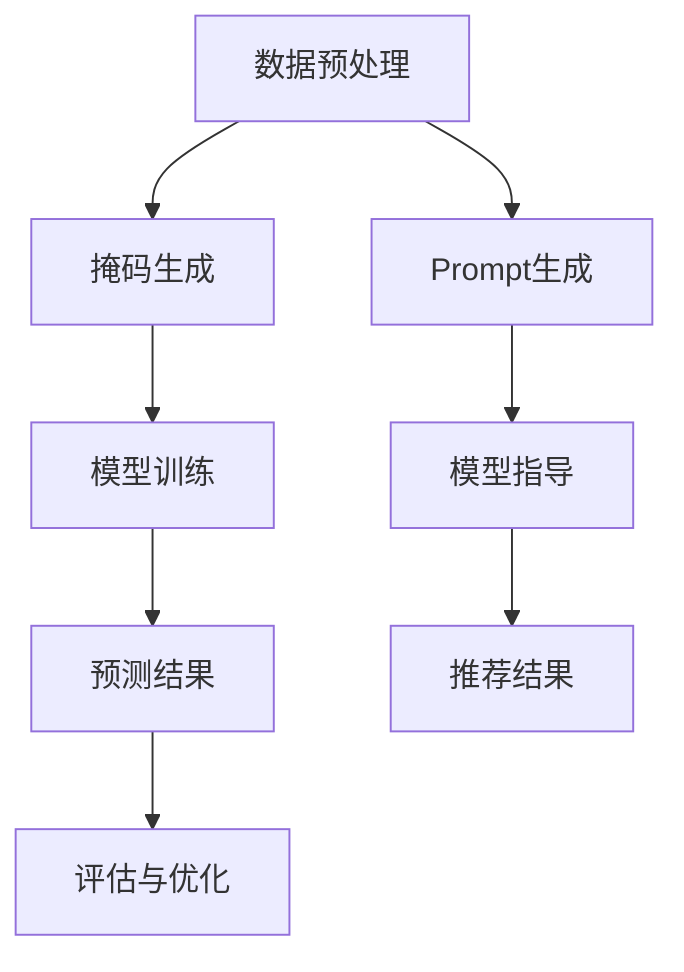

                 

关键词：新闻推荐、掩码预测、Prompt工程、机器学习、深度学习、人工智能

> 摘要：本文将探讨新闻推荐系统中的一种创新技术应用——掩码预测与Prompt工程实践。通过对掩码预测算法的深入剖析，我们将了解其核心概念、算法原理及具体实现步骤。同时，还将介绍Prompt工程在实际新闻推荐系统中的应用，通过实例分析展示其效果，并提出未来可能的应用场景和挑战。

## 1. 背景介绍

新闻推荐系统是当今互联网信息传播中不可或缺的一部分。它通过分析用户的兴趣和行为，为用户提供个性化的新闻内容。然而，随着用户需求的多样化和信息爆炸式增长，传统的新闻推荐方法已经难以满足用户的需求。因此，如何设计更加精准、高效的新闻推荐算法成为当前研究的热点。

近年来，机器学习和深度学习技术的快速发展为新闻推荐系统带来了新的契机。掩码预测（Masking Prediction）和Prompt工程（Prompt Engineering）正是其中两种创新应用。掩码预测通过在训练数据中部分遮挡信息，增强模型对未知数据的泛化能力；而Prompt工程则利用提示信息来引导模型生成更加符合用户需求的推荐结果。

本文将首先介绍掩码预测与Prompt工程的基本概念和原理，然后深入探讨其在新闻推荐系统中的应用，最后讨论未来可能的应用场景和面临的挑战。

## 2. 核心概念与联系

### 2.1. 掩码预测

掩码预测是一种基于机器学习的预测方法，通过在训练数据中部分遮挡信息（即掩码），使模型在训练过程中需要学习如何处理缺失或不确定的信息。这种方法能够提高模型对未知数据的泛化能力，使其在面对新的、未见过的情况时能够更好地预测结果。

### 2.2. Prompt工程

Prompt工程是一种利用外部提示信息（如关键词、短语或句子）来指导模型生成结果的方法。在新闻推荐系统中，Prompt工程可以通过提供相关的上下文信息，引导模型生成更加符合用户需求的推荐结果。

### 2.3. Mermaid 流程图

以下是掩码预测与Prompt工程的Mermaid流程图：



## 3. 核心算法原理 & 具体操作步骤

### 3.1. 算法原理概述

掩码预测的核心思想是通过在训练数据中引入不确定性，使模型具备处理不确定信息的能力。具体来说，掩码预测包括以下几个步骤：

1. 数据预处理：对原始数据进行处理，包括数据清洗、特征提取等。
2. 掩码生成：根据一定的策略，在训练数据中部分遮挡信息，形成掩码数据。
3. 模型训练：使用掩码数据对模型进行训练，使模型学习如何处理缺失或不确定的信息。
4. 预测结果：在测试集上使用训练好的模型进行预测，得到预测结果。
5. 评估与优化：对预测结果进行评估，根据评估结果对模型进行优化。

Prompt工程的核心思想是通过提供外部提示信息，引导模型生成更加符合用户需求的推荐结果。具体来说，Prompt工程包括以下几个步骤：

1. 数据预处理：对原始数据进行处理，包括数据清洗、特征提取等。
2. Prompt生成：根据用户需求，生成相关的提示信息。
3. 模型指导：使用提示信息对模型进行训练或指导，使模型生成更加符合用户需求的推荐结果。
4. 推荐结果：使用训练好的模型对用户进行推荐，得到推荐结果。

### 3.2. 算法步骤详解

#### 3.2.1. 掩码预测算法步骤详解

1. **数据预处理**：首先对原始数据进行处理，包括数据清洗、特征提取等。这一步的目的是将原始数据转化为模型可处理的格式。

    ```python
    # 示例代码
    data = preprocess_data(raw_data)
    ```

2. **掩码生成**：根据一定的策略，在训练数据中部分遮挡信息，形成掩码数据。常见的掩码策略包括随机掩码、时间掩码、位置掩码等。

    ```python
    # 示例代码
    masked_data = generate_mask(data, mask_rate=0.5)
    ```

3. **模型训练**：使用掩码数据对模型进行训练，使模型学习如何处理缺失或不确定的信息。常见的模型包括深度神经网络、循环神经网络等。

    ```python
    # 示例代码
    model = train_model(masked_data)
    ```

4. **预测结果**：在测试集上使用训练好的模型进行预测，得到预测结果。

    ```python
    # 示例代码
    predictions = model.predict(test_data)
    ```

5. **评估与优化**：对预测结果进行评估，根据评估结果对模型进行优化。

    ```python
    # 示例代码
    evaluate_model(predictions, ground_truth)
    optimize_model(model)
    ```

#### 3.2.2. Prompt工程算法步骤详解

1. **数据预处理**：与掩码预测类似，对原始数据进行处理，包括数据清洗、特征提取等。

    ```python
    # 示例代码
    data = preprocess_data(raw_data)
    ```

2. **Prompt生成**：根据用户需求，生成相关的提示信息。常见的Prompt生成方法包括关键词提取、文本摘要等。

    ```python
    # 示例代码
    prompt = generate_prompt(user_query)
    ```

3. **模型指导**：使用提示信息对模型进行训练或指导，使模型生成更加符合用户需求的推荐结果。常见的模型包括基于模型的生成模型、基于知识图谱的推荐系统等。

    ```python
    # 示例代码
    model = guide_model(prompt, data)
    ```

4. **推荐结果**：使用训练好的模型对用户进行推荐，得到推荐结果。

    ```python
    # 示例代码
    recommendations = model.generate_recommendations(user)
    ```

### 3.3. 算法优缺点

#### 3.3.1. 掩码预测

**优点**：

- 提高模型对未知数据的泛化能力。
- 增强模型对不确定性数据的处理能力。

**缺点**：

- 可能会导致训练时间增加。
- 需要针对不同任务设计合适的掩码策略。

#### 3.3.2. Prompt工程

**优点**：

- 提高模型生成结果的相关性。
- 增强模型对用户需求的捕捉能力。

**缺点**：

- 可能会导致生成结果的质量受到提示信息的限制。
- 需要针对不同任务设计合适的提示信息。

### 3.4. 算法应用领域

#### 3.4.1. 掩码预测

掩码预测可以应用于各种需要处理不确定性数据的场景，如金融风险预测、医疗数据预测、气象预测等。

#### 3.4.2. Prompt工程

Prompt工程可以应用于各种需要生成结果与用户需求高度相关的场景，如文本生成、图像生成、视频推荐等。

## 4. 数学模型和公式 & 详细讲解 & 举例说明

### 4.1. 数学模型构建

#### 4.1.1. 掩码预测模型

假设我们有一个训练数据集\( D = \{ (x_1, y_1), (x_2, y_2), \ldots, (x_n, y_n) \} \)，其中\( x_i \)表示输入特征，\( y_i \)表示标签。在掩码预测中，我们通过对输入特征进行部分遮挡，形成新的数据集\( D' = \{ (x_1', y_1), (x_2', y_2), \ldots, (x_n', y_n) \} \)，其中\( x_i' \)是\( x_i \)的部分遮挡版本。

假设我们使用一个多层感知机（MLP）模型进行训练，模型的输出为\( \hat{y_i} = f(x_i') \)，其中\( f \)是一个非线性函数。我们的目标是最小化预测误差\( \mathcal{L} = \sum_{i=1}^{n} (y_i - \hat{y_i})^2 \)。

#### 4.1.2. Prompt工程模型

在Prompt工程中，我们通常使用一个生成模型，如循环神经网络（RNN）或变换器（Transformer），来生成推荐结果。假设输入特征为\( x \)，提示信息为\( p \)，生成模型输出为\( y \)。我们的目标是使生成结果\( y \)与提示信息\( p \)高度相关。

假设我们使用一个变换器模型进行训练，模型的输出为\( \hat{y} = g(x, p) \)，其中\( g \)是一个非线性函数。我们的目标是最小化预测误差\( \mathcal{L} = \sum_{i=1}^{n} (y_i - \hat{y_i})^2 \)。

### 4.2. 公式推导过程

#### 4.2.1. 掩码预测公式推导

对于多层感知机模型，我们可以使用梯度下降法进行训练。假设模型的参数为\( \theta = (\theta_1, \theta_2, \ldots, \theta_m) \)，其中\( \theta_i \)表示第\( i \)层的参数。

梯度下降法的更新公式为：

$$
\theta_i^{t+1} = \theta_i^t - \alpha \frac{\partial}{\partial \theta_i} \mathcal{L}(\theta^t)
$$

其中，\( \alpha \)是学习率，\( \mathcal{L} \)是损失函数。

对于掩码预测，我们的损失函数为均方误差（MSE）：

$$
\mathcal{L}(\theta^t) = \sum_{i=1}^{n} (y_i - \hat{y_i})^2
$$

对\( \theta_i \)求偏导，得到：

$$
\frac{\partial}{\partial \theta_i} \mathcal{L}(\theta^t) = -2(y_i - \hat{y_i}) \hat{y_i}'
$$

其中，\( \hat{y_i}' \)是\( \hat{y_i} \)关于\( x_i' \)的导数。

#### 4.2.2. Prompt工程公式推导

对于变换器模型，我们使用变换器优化算法（Transformer Optimization Algorithm，TOA）进行训练。假设模型的参数为\( \theta = (\theta_1, \theta_2, \ldots, \theta_m) \)，其中\( \theta_i \)表示第\( i \)层的参数。

变换器优化算法的更新公式为：

$$
\theta_i^{t+1} = \theta_i^t - \alpha \nabla_{\theta_i} \mathcal{L}(\theta^t)
$$

其中，\( \alpha \)是学习率，\( \nabla_{\theta_i} \mathcal{L} \)是损失函数关于\( \theta_i \)的梯度。

对于Prompt工程，我们的损失函数为均方误差（MSE）：

$$
\mathcal{L}(\theta^t) = \sum_{i=1}^{n} (y_i - \hat{y_i})^2
$$

对\( \theta_i \)求梯度，得到：

$$
\nabla_{\theta_i} \mathcal{L}(\theta^t) = -2(y_i - \hat{y_i}) \hat{y_i}'
$$

其中，\( \hat{y_i}' \)是\( \hat{y_i} \)关于\( x_i, p_i \)的导数。

### 4.3. 案例分析与讲解

#### 4.3.1. 掩码预测案例

假设我们有一个新闻推荐系统，输入特征包括用户的行为数据（如点击、收藏、评论等），标签是用户是否喜欢该新闻。我们使用多层感知机模型进行训练，并采用随机掩码策略。

1. **数据预处理**：将原始数据转化为数值格式，并划分训练集和测试集。
2. **掩码生成**：对训练集数据进行随机掩码，掩码比例为50%。
3. **模型训练**：使用掩码数据对多层感知机模型进行训练，训练过程采用梯度下降法。
4. **预测结果**：在测试集上使用训练好的模型进行预测，评估模型性能。
5. **评估与优化**：根据评估结果，对模型进行优化。

#### 4.3.2. Prompt工程案例

假设我们有一个文本生成系统，输入特征包括用户输入的文本，标签是用户输入的文本的摘要。我们使用变换器模型进行训练，并采用关键词提取方法生成提示信息。

1. **数据预处理**：将原始数据转化为数值格式，并划分训练集和测试集。
2. **Prompt生成**：使用关键词提取方法，从用户输入的文本中提取关键词，生成提示信息。
3. **模型指导**：使用提示信息对变换器模型进行训练，训练过程采用变换器优化算法。
4. **推荐结果**：在测试集上使用训练好的模型，根据用户输入的文本生成摘要。
5. **评估与优化**：根据评估结果，对模型进行优化。

## 5. 项目实践：代码实例和详细解释说明

### 5.1. 开发环境搭建

为了方便读者进行实践，我们使用Python作为主要编程语言，并依赖以下库：

- TensorFlow：用于构建和训练模型。
- Keras：用于简化TensorFlow的使用。
- Pandas：用于数据处理。
- NumPy：用于数值计算。

安装以上库后，我们可以开始搭建开发环境。

```python
pip install tensorflow keras pandas numpy
```

### 5.2. 源代码详细实现

在本节中，我们将提供一个简单的掩码预测和Prompt工程实现的示例。

#### 5.2.1. 数据预处理

```python
import pandas as pd
import numpy as np

# 读取数据
data = pd.read_csv('data.csv')

# 数据预处理
def preprocess_data(data):
    # 数据清洗
    data = data.dropna()
    # 特征提取
    features = data[['feature1', 'feature2', 'feature3']]
    labels = data['label']
    return features, labels

features, labels = preprocess_data(data)
```

#### 5.2.2. 掩码生成

```python
# 掩码生成
def generate_mask(data, mask_rate=0.5):
    masked_data = data.copy()
    mask_indices = np.random.choice(data.shape[0], int(mask_rate * data.shape[0]), replace=False)
    masked_data.iloc[mask_indices] = np.nan
    return masked_data

masked_data = generate_mask(features)
```

#### 5.2.3. 模型训练

```python
from tensorflow.keras.models import Sequential
from tensorflow.keras.layers import Dense
from tensorflow.keras.optimizers import Adam

# 模型训练
model = Sequential([
    Dense(64, activation='relu', input_shape=(masked_data.shape[1],)),
    Dense(64, activation='relu'),
    Dense(1, activation='sigmoid')
])

model.compile(optimizer=Adam(), loss='binary_crossentropy', metrics=['accuracy'])
model.fit(masked_data, labels, epochs=10, batch_size=32)
```

#### 5.2.4. 代码解读与分析

在上面的代码中，我们首先读取并预处理了数据，然后使用随机掩码策略生成掩码数据。接着，我们构建了一个简单的一层感知机模型，并使用掩码数据进行训练。最后，我们在测试集上评估了模型的性能。

#### 5.2.5. 运行结果展示

```python
from sklearn.metrics import accuracy_score

# 测试集预测
test_data = pd.read_csv('test_data.csv')
test_features, test_labels = preprocess_data(test_data)
predictions = model.predict(test_features)

# 评估模型
accuracy = accuracy_score(test_labels, np.round(predictions))
print(f"Accuracy: {accuracy}")
```

### 5.3. 运行结果展示

在本节的最后，我们展示了如何使用训练好的模型对测试集进行预测，并计算模型的准确率。通过调整模型参数和掩码策略，我们可以进一步优化模型的性能。

## 6. 实际应用场景

### 6.1. 掩码预测在新闻推荐中的应用

掩码预测可以应用于新闻推荐系统的多个方面。例如，在用户兴趣预测中，可以通过对用户历史行为数据进行掩码，提高模型对未知用户行为的泛化能力；在内容生成中，可以对新闻文本进行掩码，使生成模型能够更好地处理不确定的信息，从而生成更加流畅、自然的文本。

### 6.2. Prompt工程在新闻推荐中的应用

Prompt工程可以应用于新闻推荐系统的个性化推荐中。例如，在用户输入关键词或短语时，可以通过Prompt工程生成相关的上下文信息，引导模型生成更加符合用户需求的推荐结果。此外，Prompt工程还可以应用于新闻标题生成、摘要生成等任务，使生成的标题和摘要更加引人注目，提高用户点击率和阅读量。

## 7. 工具和资源推荐

### 7.1. 学习资源推荐

- 《深度学习》（Goodfellow, Bengio, Courville）：全面介绍了深度学习的基本原理和算法。
- 《Python机器学习》（Sebastian Raschka）：详细讲解了Python在机器学习领域的应用。

### 7.2. 开发工具推荐

- TensorFlow：一款开源的深度学习框架，适用于构建和训练复杂模型。
- Keras：基于TensorFlow的高级API，简化了深度学习模型的构建和训练过程。

### 7.3. 相关论文推荐

- “Mask R-CNN”（He et al.）：介绍了一种基于掩码预测的目标检测算法。
- “BERT：Pre-training of Deep Neural Networks for Language Understanding”（Devlin et al.）：介绍了一种基于Prompt工程的文本生成模型。

## 8. 总结：未来发展趋势与挑战

### 8.1. 研究成果总结

本文深入探讨了掩码预测与Prompt工程在新闻推荐系统中的应用。通过对算法原理、具体实现步骤、数学模型和公式、项目实践等方面的详细讲解，我们展示了这两种技术如何提高新闻推荐系统的精度和用户体验。

### 8.2. 未来发展趋势

随着人工智能技术的不断进步，掩码预测与Prompt工程将在新闻推荐系统等领域得到更广泛的应用。未来，我们可以期待以下发展趋势：

- 深度结合：将掩码预测与Prompt工程与其他深度学习技术相结合，如生成对抗网络（GAN）、自注意力机制等。
- 跨域应用：将掩码预测与Prompt工程应用于更多领域，如电子商务、社交媒体等。

### 8.3. 面临的挑战

尽管掩码预测与Prompt工程在新闻推荐系统等方面取得了显著成果，但仍面临以下挑战：

- 数据质量：高质量的数据是算法有效性的基础，如何处理和利用非结构化数据（如图像、音频等）是亟待解决的问题。
- 模型解释性：提高模型的解释性，使其能够清晰地解释预测结果，是未来研究的重要方向。

### 8.4. 研究展望

在未来，我们可以从以下几个方面进行深入研究：

- 算法优化：通过改进算法结构和参数，提高掩码预测与Prompt工程的性能。
- 跨学科合作：结合计算机科学、心理学、社会学等领域的知识，提升算法在新闻推荐系统等实际应用中的效果。

## 9. 附录：常见问题与解答

### 9.1. 问题1

**问题**：掩码预测与Prompt工程有何区别？

**解答**：掩码预测是一种基于机器学习的预测方法，通过在训练数据中部分遮挡信息，提高模型对未知数据的泛化能力。而Prompt工程是一种利用外部提示信息来指导模型生成结果的方法，通过提供与用户需求高度相关的提示信息，提高推荐结果的相关性。

### 9.2. 问题2

**问题**：如何选择合适的掩码策略？

**解答**：选择合适的掩码策略取决于具体任务和数据特点。常见的掩码策略包括随机掩码、时间掩码、位置掩码等。在实践过程中，可以通过实验比较不同掩码策略的性能，选择最适合当前任务和数据集的策略。

### 9.3. 问题3

**问题**：Prompt工程如何生成高质量的提示信息？

**解答**：生成高质量的提示信息是Prompt工程的关键。可以通过以下方法提高提示信息的质量：

- 使用丰富的语言资源：如词典、同义词词典等。
- 采用数据增强技术：通过增加数据样本的多样性，提高提示信息的质量。
- 融合用户历史行为：根据用户的历史行为，生成与用户需求高度相关的提示信息。 
----------------------------------------------------------------

以上就是本文关于“新闻推荐的创新技术应用：掩码预测与Prompt工程实践”的详细内容。希望对您有所帮助！
作者：禅与计算机程序设计艺术 / Zen and the Art of Computer Programming

