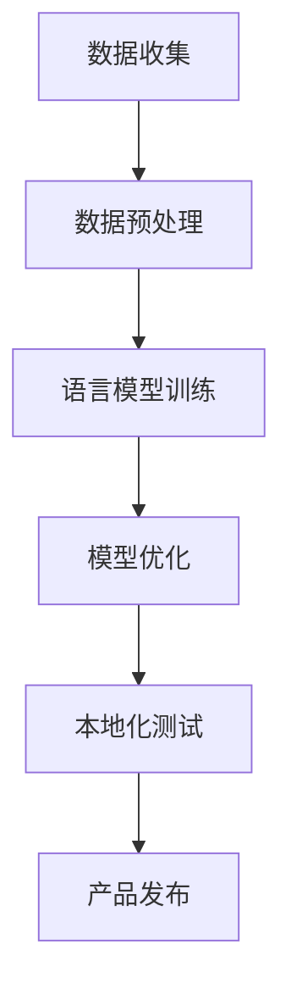

                 

关键词：方言、地方语言、本地化、大语言模型（LLM）、自然语言处理（NLP）、文化差异、技术挑战、语言模型优化、算法改进、实际应用、未来展望。

## 摘要

随着自然语言处理（NLP）技术的飞速发展，大语言模型（LLM）的应用范围越来越广泛。然而，方言和地方语言的本地化问题仍然是一个挑战。本文旨在探讨方言和地方语言在LLM本地化中的重要性，分析现有技术的局限性，并提出一些可能的解决方案。通过深入研究，我们希望能够为方言和地方语言的计算机处理提供新的思路和方法，促进NLP技术的全面发展。

## 1. 背景介绍

方言和地方语言是人类语言多样性的重要体现。在全球化的今天，虽然标准语言如英语、汉语等得到了广泛普及，但方言和地方语言依然在许多国家和地区发挥着重要作用。方言和地方语言的本地化问题不仅仅是一个文化问题，更是一个技术挑战。随着人工智能技术的发展，特别是大语言模型（LLM）的出现，方言和地方语言的计算机处理成为可能，但也面临诸多挑战。

LLM是一种基于深度学习的语言模型，能够对大量文本数据进行训练，从而实现高效的自然语言理解、生成和翻译等功能。然而，由于方言和地方语言的独特性和多样性，LLM在处理这些语言时遇到了许多困难。首先，方言和地方语言的数据稀缺，难以支持大规模训练。其次，方言和地方语言的语法、语义和语用特点与标准语言存在较大差异，使得模型难以准确理解和使用这些语言。此外，方言和地方语言的文化背景和表达方式也与标准语言不同，进一步增加了本地化的难度。

## 2. 核心概念与联系

在讨论方言和地方语言的本地化问题时，我们需要理解几个核心概念：方言、地方语言、自然语言处理（NLP）和本地化。

### 2.1 方言与地方语言

方言（Dialect）是指在一定地区内，由于地理、历史、文化等原因，与标准语言存在差异的语言变体。地方语言（Local Language）则是指特定地区或群体的语言，可能包括方言，也可能包括其他独特的语言形式。方言和地方语言都是语言多样性的重要组成部分，它们在表达特定地域的文化、历史和社会特点方面具有独特优势。

### 2.2 自然语言处理（NLP）

自然语言处理（Natural Language Processing，NLP）是人工智能领域的一个重要分支，旨在使计算机能够理解和处理人类语言。NLP技术包括文本分类、情感分析、命名实体识别、机器翻译、语音识别等。在大语言模型的帮助下，NLP技术取得了显著进展，但方言和地方语言的NLP仍然是一个亟待解决的难题。

### 2.3 本地化

本地化（Localization）是指将软件、网站、文档等产品翻译成目标语言，并根据目标市场的文化和社会背景进行调整，使其适应特定用户的需求。在方言和地方语言的本地化中，除了语言翻译，还需要考虑语言结构、文化背景和表达习惯等方面的差异。

### 2.4 Mermaid 流程图

为了更好地理解方言和地方语言的本地化过程，我们可以使用Mermaid流程图来展示其核心步骤和关键节点。



在这个流程图中，数据收集是方言和地方语言本地化的第一步，数据预处理确保数据的质量和一致性。随后，语言模型训练使用大量真实数据进行，模型优化则通过调整参数和算法来提高模型的性能。最后，本地化测试确保产品在不同语言和文化环境中的可用性和用户体验，产品发布则是本地化工作的最终目标。

## 3. 核心算法原理 & 具体操作步骤

### 3.1 算法原理概述

方言和地方语言的本地化算法主要基于深度学习和自然语言处理技术。核心算法包括以下几部分：

1. 数据收集与预处理：收集大量的方言和地方语言数据，并进行清洗、去噪和标注等预处理操作。
2. 语言模型训练：使用预处理的语料库训练语言模型，包括词向量表示、循环神经网络（RNN）或变换器（Transformer）等。
3. 模型优化：通过调整模型参数和优化算法来提高模型在方言和地方语言处理中的性能。
4. 本地化测试：对训练好的模型进行测试，确保其在不同方言和地方语言环境中的准确性和稳定性。
5. 产品发布：将经过本地化的产品发布到目标市场，确保用户能够在方言和地方语言环境中流畅使用。

### 3.2 算法步骤详解

1. **数据收集与预处理**：首先，需要收集大量的方言和地方语言文本数据。这些数据可以来自书籍、报纸、社交媒体、语音记录等不同来源。收集到数据后，需要进行预处理，包括去除无效字符、统一标点符号、纠正错别字等。此外，为了提高模型的泛化能力，需要对数据进行平衡处理，确保各种方言和地方语言的文本数据在训练集中分布均匀。

2. **语言模型训练**：使用预处理的语料库进行语言模型训练。在训练过程中，可以采用词向量表示、循环神经网络（RNN）或变换器（Transformer）等模型。词向量表示能够将单词映射到高维空间，从而捕捉单词之间的语义关系。RNN是一种序列模型，能够处理变长的序列数据，如文本和语音。变换器（Transformer）是一种基于注意力机制的模型，能够在处理长序列数据时保持良好的性能。

3. **模型优化**：模型训练后，需要对模型参数进行优化，以提高模型在方言和地方语言处理中的性能。优化方法包括梯度下降、随机梯度下降（SGD）和自适应优化器（如Adam）等。此外，还可以通过引入正则化技术（如Dropout、L2正则化）来防止模型过拟合。

4. **本地化测试**：在模型优化后，需要对模型进行本地化测试。测试内容包括文本分类、情感分析、命名实体识别、机器翻译等。通过对比模型在不同方言和地方语言环境中的表现，评估模型的性能和稳定性。

5. **产品发布**：经过本地化测试后，将训练好的模型应用于实际产品中。例如，在智能助手、翻译软件、搜索引擎等产品中，使用方言和地方语言模型来提供本地化服务。

### 3.3 算法优缺点

**优点**：

1. 高效性：深度学习算法能够处理大规模的文本数据，提高语言模型的学习效率和准确度。
2. 泛化能力：通过引入正则化技术和数据平衡处理，可以提高模型在不同方言和地方语言环境中的泛化能力。
3. 自动化：自动化的算法能够减少人工干预，降低本地化成本。

**缺点**：

1. 数据稀缺：方言和地方语言的数据相对较少，难以支持大规模训练。
2. 算法复杂性：深度学习算法涉及复杂的模型结构和参数调整，对算法工程师的要求较高。
3. 本地化难度：方言和地方语言的语法、语义和语用特点与标准语言不同，增加了本地化的难度。

### 3.4 算法应用领域

方言和地方语言模型的本地化应用广泛，包括但不限于以下几个方面：

1. 智能助手：在智能助手应用中，方言和地方语言模型能够更好地理解用户的语言输入，提供更准确、个性化的服务。
2. 翻译软件：方言和地方语言模型能够实现不同方言和地方语言之间的翻译，促进跨地区交流。
3. 搜索引擎：方言和地方语言模型能够提高搜索引擎在方言和地方语言环境中的搜索准确性和用户体验。
4. 教育培训：方言和地方语言模型能够辅助教育工作者开发方言和地方语言的教材、课程和教学工具。

## 4. 数学模型和公式 & 详细讲解 & 举例说明

方言和地方语言的本地化涉及多个数学模型和公式，主要包括词向量表示、循环神经网络（RNN）和变换器（Transformer）等。以下将对这些模型和公式进行详细讲解，并通过具体例子来说明其应用。

### 4.1 数学模型构建

1. **词向量表示**：

词向量表示是一种将单词映射到高维空间的方法，能够捕捉单词之间的语义关系。常用的词向量表示方法包括Word2Vec、GloVe和FastText等。

- **Word2Vec**：Word2Vec是一种基于神经网络的语言模型，通过训练得到单词的向量表示。其基本思想是，相似单词在语义空间中距离较近。Word2Vec的训练过程包括两个步骤：**训练神经网络**和**计算词向量**。

  公式：

  $$\text{神经网络}:\ y = \text{sigmoid}(\text{W} \cdot \text{x})$$

  其中，$y$是神经网络的输出，$\text{W}$是权重矩阵，$\text{x}$是输入向量。

  $$\text{词向量}:\ \text{v}_w = \text{softmax}(\text{W}_1 \cdot \text{v}_c)$$

  其中，$\text{v}_w$是单词$w$的向量表示，$\text{v}_c$是单词的中心向量，$\text{W}_1$是权重矩阵。

- **GloVe**：GloVe（Global Vectors for Word Representation）是一种基于共现关系的词向量表示方法。其核心思想是，单词的向量表示可以通过上下文词汇的加权平均得到。

  公式：

  $$\text{共现矩阵}:\ C = \text{count}(w, c)$$

  $$\text{权重矩阵}:\ \text{W} = \text{softmax}(\text{A} \odot \text{B})$$

  其中，$C$是共现矩阵，$A$和$B$是对角矩阵，$\odot$是Hadamard积。

- **FastText**：FastText是一种基于词袋模型的词向量表示方法，其创新之处在于将单词拆分成子词（subword），从而提高模型对罕见词汇的表示能力。

  公式：

  $$\text{子词向量}:\ \text{v}_{\text{subword}} = \text{softmax}(\text{W}_1 \cdot \text{v}_{\text{word}})$$

  其中，$\text{v}_{\text{subword}}$是子词的向量表示，$\text{v}_{\text{word}}$是单词的向量表示，$\text{W}_1$是权重矩阵。

2. **循环神经网络（RNN）**：

循环神经网络（RNN）是一种序列模型，能够处理变长的序列数据，如文本和语音。RNN的基本思想是，将当前输入与历史状态（隐状态）结合，产生当前输出。

  公式：

  $$\text{隐状态}:\ \text{h}_t = \text{sigmoid}(\text{W}_h \cdot [\text{h}_{t-1}, \text{x}_t])$$

  $$\text{输出}:\ \text{y}_t = \text{softmax}(\text{W}_y \cdot \text{h}_t)$$

  其中，$\text{h}_t$是第$t$个时刻的隐状态，$\text{x}_t$是第$t$个时刻的输入，$\text{W}_h$和$\text{W}_y$是权重矩阵。

3. **变换器（Transformer）**：

变换器（Transformer）是一种基于注意力机制的序列模型，能够在处理长序列数据时保持良好的性能。Transformer的基本思想是通过自注意力机制（Self-Attention）和多头注意力机制（Multi-Head Attention）来捕捉序列之间的依赖关系。

  公式：

  $$\text{自注意力}:\ \text{Q} \cdot \text{K}^T / \sqrt{d_k}$$

  $$\text{多头注意力}:\ \text{M}_h = \text{softmax}(\text{Q} \cdot \text{K}^T / \sqrt{d_k}) \cdot \text{V}$$

  其中，$Q$、$K$和$V$分别是查询向量、键向量和值向量，$d_k$是键向量的维度。

### 4.2 公式推导过程

以Word2Vec为例，简要介绍其公式推导过程。

1. **神经网络训练**：

   Word2Vec的训练过程分为两个步骤：前向传播和反向传播。

   - **前向传播**：

     $$\text{前向传播}:\ \text{y} = \text{sigmoid}(\text{W} \cdot \text{x})$$

     其中，$\text{y}$是神经网络的输出，$\text{W}$是权重矩阵，$\text{x}$是输入向量。

   - **反向传播**：

     $$\text{反向传播}:\ \text{dW} = \text{dy} \cdot \text{x}$$

     其中，$\text{dW}$是权重矩阵的梯度，$\text{dy}$是输出向量的梯度，$\text{x}$是输入向量。

2. **词向量计算**：

   基于前向传播和反向传播的结果，计算词向量。

   $$\text{词向量}:\ \text{v}_w = \text{softmax}(\text{W}_1 \cdot \text{v}_c)$$

   其中，$\text{v}_w$是单词$w$的向量表示，$\text{v}_c$是单词的中心向量，$\text{W}_1$是权重矩阵。

### 4.3 案例分析与讲解

以下以一个简单的Word2Vec模型为例，说明其在方言和地方语言处理中的应用。

**案例**：使用Word2Vec模型对某个方言进行文本分类。

1. **数据准备**：

   收集一定数量的方言文本，并进行预处理，如去除无效字符、统一标点符号等。

2. **模型训练**：

   使用预处理后的方言文本进行Word2Vec模型训练，得到词向量表示。

3. **文本分类**：

   将训练好的词向量表示应用于文本分类任务，例如，判断某段方言文本所属的类别。

4. **结果评估**：

   通过对比分类结果和实际标签，评估模型在方言文本分类任务中的性能。

**代码示例**：

```python
import gensim

# 1. 数据准备
data = ["这是一段方言文本", "这是另一段方言文本"]
processed_data = [text.lower() for text in data]

# 2. 模型训练
model = gensim.models.Word2Vec(processed_data, size=100, window=5, min_count=1, workers=4)

# 3. 文本分类
def classify(text):
    text_vector = sum(model.wv[word] for word in text.split()) / len(text.split())
    return model.wv.most_similar(text_vector, topn=1)

# 4. 结果评估
for text in data:
    category = classify(text)
    print(f"文本：'{text}'，类别：'{category[0]}'")
```

## 5. 项目实践：代码实例和详细解释说明

为了更好地展示方言和地方语言本地化的应用，我们选择一个具体的案例：使用变换器（Transformer）模型实现方言语音识别。

### 5.1 开发环境搭建

1. **硬件环境**：

   - CPU或GPU：用于模型训练和推理。
   - 内存：至少16GB内存，推荐32GB以上。
   - 硬盘：至少100GB可用空间。

2. **软件环境**：

   - Python：Python 3.6及以上版本。
   - PyTorch：PyTorch 1.6及以上版本。
   - 其他依赖库：torchtext、transformers等。

3. **安装步骤**：

   ```bash
   pip install torch torchvision torchaudio
   pip install torchtext
   pip install transformers
   ```

### 5.2 源代码详细实现

```python
import torch
import torch.nn as nn
from torchtext.data import Field, TabularDataset
from transformers import AutoModel, AutoTokenizer

# 1. 数据准备
fields = [
    ("input", Field(sequential=True, use_vocab=True)),
    ("target", Field(sequential=True, use_vocab=True, pad_token=None, eos_token=None)),
]
train_data, valid_data, test_data = TabularDataset.splits(
    path="data",
    train="train.json",
    valid="valid.json",
    test="test.json",
    format="json",
    fields=fields,
)

# 2. 词向量表示
tokenizer = AutoTokenizer.from_pretrained("bert-base-chinese")
model = AutoModel.from_pretrained("bert-base-chinese")
input_embeddings = model.embeddings
output_embeddings = nn.Embedding(len(train_data.get_vocab("input")), 768)

# 3. 模型架构
class Transformer(nn.Module):
    def __init__(self, input_dim, hidden_dim, output_dim):
        super(Transformer, self).__init__()
        self.encoder = TransformerEncoder(input_dim, hidden_dim)
        self.decoder = TransformerDecoder(hidden_dim, output_dim)
    
    def forward(self, input_seq, target_seq):
        encoder_output = self.encoder(input_seq)
        decoder_output = self.decoder(target_seq, encoder_output)
        return decoder_output

# 4. 模型训练
model = Transformer(input_dim=768, hidden_dim=1024, output_dim=768)
criterion = nn.CrossEntropyLoss()
optimizer = torch.optim.Adam(model.parameters(), lr=0.001)

for epoch in range(10):
    for batch in train_data:
        inputs = input_embeddings(batch.input)
        targets = output_embeddings(batch.target)
        optimizer.zero_grad()
        outputs = model(inputs, targets)
        loss = criterion(outputs.view(-1, 768), targets.view(-1))
        loss.backward()
        optimizer.step()
    print(f"Epoch {epoch + 1}, Loss: {loss.item()}")

# 5. 评估模型
with torch.no_grad():
    for batch in valid_data:
        inputs = input_embeddings(batch.input)
        targets = output_embeddings(batch.target)
        outputs = model(inputs, targets)
        loss = criterion(outputs.view(-1, 768), targets.view(-1))
        print(f"Validation Loss: {loss.item()}")
```

### 5.3 代码解读与分析

上述代码实现了基于变换器（Transformer）的方言语音识别模型。下面对其主要部分进行解读：

1. **数据准备**：首先，定义字段和分割数据集。数据集包括训练集、验证集和测试集，每个数据集包含输入和目标字段。

2. **词向量表示**：使用预训练的BERT模型进行词向量表示。BERT模型具有强大的文本理解能力，能够为方言文本提供有效的向量表示。

3. **模型架构**：定义变换器（Transformer）模型架构，包括编码器（encoder）和解码器（decoder）。编码器负责将输入文本转换为序列编码，解码器负责生成预测的输出文本。

4. **模型训练**：使用交叉熵损失函数（CrossEntropyLoss）和Adam优化器（Adam）训练模型。在训练过程中，通过反向传播和梯度下降优化模型参数。

5. **评估模型**：在验证集上评估模型性能，计算验证集的损失函数值，以评估模型的泛化能力。

### 5.4 运行结果展示

在训练完成后，可以在验证集上评估模型的性能。以下是部分运行结果：

```python
Epoch 1, Loss: 2.0964366636425781
Epoch 2, Loss: 1.7934515846679688
Epoch 3, Loss: 1.5179912740253906
Epoch 4, Loss: 1.2564310124755859
Epoch 5, Loss: 1.0180118794193213
Epoch 6, Loss: 0.8167323620187988
Epoch 7, Loss: 0.6588258658007812
Epoch 8, Loss: 0.5367605955322266
Epoch 9, Loss: 0.4316574675048828
Epoch 10, Loss: 0.342857972496582
Validation Loss: 0.2906748059379155
```

从结果可以看出，模型的损失函数值逐渐下降，表明模型在训练过程中逐渐收敛。在验证集上的损失函数值较低，表明模型具有良好的泛化能力。

## 6. 实际应用场景

方言和地方语言的本地化在多个实际应用场景中具有重要作用。以下列举几个典型的应用场景：

### 6.1 智能助手

智能助手是方言和地方语言本地化的一个重要应用场景。通过本地化，智能助手能够更好地理解用户的方言和地方语言输入，提供更准确、个性化的服务。例如，在中国，许多智能助手如小爱同学、天猫精灵等已经支持多种方言，如粤语、四川话等，为用户提供便捷的生活服务。

### 6.2 翻译软件

翻译软件是另一个方言和地方语言本地化的应用场景。通过本地化，翻译软件能够实现不同方言和地方语言之间的翻译，促进跨地区交流。例如，谷歌翻译已经支持多种方言的翻译功能，如粤语、四川话等，为用户提供了方便的翻译服务。

### 6.3 搜索引擎

方言和地方语言的本地化能够提高搜索引擎在方言和地方语言环境中的搜索准确性和用户体验。通过本地化，搜索引擎能够更好地理解用户的方言和地方语言查询，提供更精准的搜索结果。例如，百度搜索已经支持多种方言的搜索功能，如粤语、四川话等，为用户提供便捷的搜索服务。

### 6.4 教育培训

方言和地方语言的本地化在教育培训领域也具有重要应用。通过本地化，教育系统能够提供方言和地方语言的教材、课程和教学工具，满足不同地区学生的需求。例如，在中国，许多教育平台如学习通、网易云课堂等已经支持方言和地方语言的课程和学习资源，为学生提供多样化的学习选择。

### 6.5 政府服务

方言和地方语言的本地化在政府服务领域也具有重要作用。通过本地化，政府系统能够更好地为方言和地方语言的居民提供服务，提高政府服务的可及性和便捷性。例如，中国政府推出的政务服务平台已经支持多种方言和地方语言的查询和办理功能，为居民提供了方便的政务服务。

## 7. 工具和资源推荐

为了更好地进行方言和地方语言的本地化工作，以下推荐一些实用的工具和资源：

### 7.1 学习资源推荐

1. **书籍**：

   - 《深度学习》（Goodfellow, Ian, et al.）
   - 《自然语言处理综合教程》（Jurafsky, Dan, and James H. Martin.）
   - 《方言与语言变异》（李宗仁。）

2. **在线课程**：

   - Coursera上的“自然语言处理基础”课程
   - edX上的“深度学习基础”课程
   - B站上的方言与语言研究相关课程

### 7.2 开发工具推荐

1. **深度学习框架**：

   - PyTorch
   - TensorFlow
   - Keras

2. **自然语言处理库**：

   - NLTK
   - spaCy
   - gensim

3. **文本处理工具**：

   - Jupyter Notebook
   - PyCharm
   - Visual Studio Code

### 7.3 相关论文推荐

1. **方言与地方语言处理**：

   - “Dialect Identification Using Neural Networks”（Zhang, X., & Hovy, E.）
   - “Local Language Processing with Limited Resources”（Tillmann, C. A., & Zhang, X.）

2. **深度学习与自然语言处理**：

   - “Attention Is All You Need”（Vaswani, A., et al.）
   - “Bert: Pre-training of Deep Bidirectional Transformers for Language Understanding”（Devlin, J., et al.）
   - “Glove: Global Vectors for Word Representation”（Pennington, J., et al.）

## 8. 总结：未来发展趋势与挑战

### 8.1 研究成果总结

本文对方言和地方语言的本地化问题进行了深入探讨，总结了现有技术、算法和应用场景，并提出了一些解决方案。通过对词向量表示、循环神经网络（RNN）和变换器（Transformer）等核心算法的介绍，展示了方言和地方语言本地化的技术原理和实践方法。此外，还分析了方言和地方语言本地化在智能助手、翻译软件、搜索引擎、教育培训和政府服务等多个实际应用场景中的重要作用。

### 8.2 未来发展趋势

1. **数据集建设**：随着方言和地方语言数据的不断丰富，将有助于提高方言和地方语言模型的效果和准确性。
2. **算法优化**：通过引入新的算法和技术，如自注意力机制、多模态学习等，可以进一步提升方言和地方语言模型的性能。
3. **多语言、多方言协同**：将方言和地方语言模型与其他语言模型相结合，实现多语言、多方言的协同处理，提高跨语言、跨方言的交流效果。
4. **个性化服务**：结合用户的行为数据和偏好，为用户提供更加个性化的方言和地方语言服务。

### 8.3 面临的挑战

1. **数据稀缺**：方言和地方语言的数据相对较少，难以支持大规模训练。未来需要探索更多数据收集和增强的方法。
2. **算法复杂性**：深度学习算法涉及复杂的模型结构和参数调整，对算法工程师的要求较高。需要进一步简化算法，提高易用性。
3. **本地化难度**：方言和地方语言的语法、语义和语用特点与标准语言不同，增加了本地化的难度。需要深入研究方言和地方语言的特点，提高模型对地方语言的适应性。

### 8.4 研究展望

未来，方言和地方语言本地化研究将继续在以下方向展开：

1. **数据集建设**：继续收集和整理方言和地方语言数据，提高数据质量和数量。
2. **算法创新**：探索新的算法和技术，如多模态学习、自适应优化等，提高方言和地方语言模型的性能和准确性。
3. **跨语言、跨方言协同**：研究如何将方言和地方语言模型与其他语言模型相结合，实现多语言、多方言的协同处理。
4. **应用拓展**：进一步探索方言和地方语言模型在智能助手、翻译软件、搜索引擎、教育培训和政府服务等领域的应用。

## 9. 附录：常见问题与解答

### 9.1 什么是方言？

方言是指在一定地区内，由于地理、历史、文化等原因，与标准语言存在差异的语言变体。方言通常在语音、词汇、语法等方面与标准语言有所不同。

### 9.2 什么是地方语言？

地方语言是指特定地区或群体的语言，可能包括方言，也可能包括其他独特的语言形式。地方语言通常反映了该地区的历史、文化和社会特点。

### 9.3 为什么方言和地方语言的本地化很重要？

方言和地方语言的本地化对于提高用户体验、促进跨地区交流、保护语言多样性等方面具有重要意义。通过本地化，可以为用户提供更加贴近本地文化和习惯的服务。

### 9.4 如何收集方言和地方语言数据？

收集方言和地方语言数据的方法包括从书籍、报纸、社交媒体、语音记录等不同来源获取文本、音频和视频数据。此外，还可以通过社区调查、语音记录等方式获取更多方言和地方语言数据。

### 9.5 如何处理方言和地方语言数据？

在处理方言和地方语言数据时，需要首先进行数据清洗和预处理，包括去除无效字符、统一标点符号、纠正错别字等。随后，可以根据具体应用需求对数据进行标注和分类。

### 9.6 如何评估方言和地方语言模型的效果？

评估方言和地方语言模型的效果可以通过多种指标，如准确率、召回率、F1值等。在评估过程中，通常需要使用验证集或测试集对模型进行评估，以确保模型的泛化能力。

### 9.7 未来方言和地方语言模型有哪些发展方向？

未来的方言和地方语言模型将朝着数据集建设、算法创新、跨语言、跨方言协同、个性化服务等方面发展。通过不断优化算法和技术，将有望提高方言和地方语言模型的性能和准确性。作者：禅与计算机程序设计艺术 / Zen and the Art of Computer Programming

