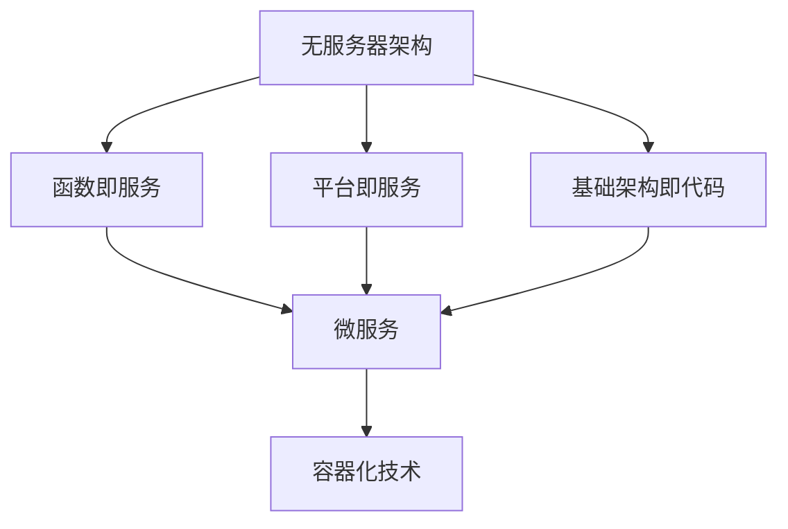

                 

关键词：无服务器架构、微服务、容器化、自动化、云计算、DevOps

> 摘要：本文将深入探讨无服务器架构的核心概念、技术优势、实现方法以及未来发展趋势，帮助读者理解如何专注于编写代码而非基础设施管理，提高软件开发的效率和质量。

## 1. 背景介绍

在软件开发的早期阶段，传统架构通常需要开发人员管理大量的基础设施，如服务器、网络和存储。这种模式不仅增加了管理负担，而且限制了开发团队的灵活性和扩展性。随着云计算和容器技术的兴起，无服务器架构（Serverless Architecture）逐渐成为一种更为高效和灵活的解决方案。

无服务器架构的核心思想是，开发人员无需关注底层基础设施的部署和管理，只需专注于编写应用程序代码。无服务器平台提供商（如AWS、Azure和Google Cloud）负责管理计算资源，确保应用程序的高可用性和弹性扩展。这种模式极大地简化了开发流程，提高了开发效率。

## 2. 核心概念与联系

### 2.1 无服务器架构概述

无服务器架构是一种基于云的服务模型，其中应用程序的开发、部署和运行完全在第三方管理的平台上进行。该模型包括以下几个核心组件：

- **函数即服务（Functions as a Service，FaaS）**：函数即服务提供了一种以函数为基础的计算服务，允许开发人员仅关注代码逻辑，无需管理底层基础设施。
- **平台即服务（Platform as a Service，PaaS）**：平台即服务提供了一个完整的开发平台，包括操作系统、数据库、Web服务器等，使得开发人员能够专注于应用程序的开发。
- **基础架构即代码（Infrastructure as Code，IaC）**：基础架构即代码通过脚本或配置文件来管理和部署基础设施，确保基础设施的一致性和可重复性。

### 2.2 无服务器架构与微服务的关系

无服务器架构与微服务架构有着紧密的联系。微服务架构将应用程序划分为多个小型、独立的模块，每个模块运行在自己的容器中。无服务器架构为微服务提供了高效的部署和管理方式，使得微服务能够灵活地扩展和更新。

### 2.3 无服务器架构与容器化的关系

容器化技术（如Docker）是无服务器架构的重要实现手段。容器将应用程序及其依赖项打包在一起，形成一个独立的运行环境，确保应用程序在不同环境中的一致性。无服务器架构通过容器技术实现了应用程序的轻量化和高效管理。

### 2.4 Mermaid 流程图



## 3. 核心算法原理 & 具体操作步骤

### 3.1 算法原理概述

无服务器架构的核心算法原理是，通过事件驱动的方式触发函数执行。当事件发生时，无服务器平台会自动分配计算资源，启动函数实例，执行函数代码，并在执行完成后释放资源。

### 3.2 算法步骤详解

1. **事件监听**：应用程序监听特定事件，如HTTP请求、文件上传或定时任务。
2. **函数分配**：无服务器平台根据事件类型和负载情况，自动分配函数实例。
3. **函数执行**：函数实例加载应用程序代码，执行函数逻辑，生成结果。
4. **资源释放**：函数执行完成后，无服务器平台释放计算资源。

### 3.3 算法优缺点

**优点**：
- **简化管理**：无需关注基础设施的部署和管理，降低运维成本。
- **弹性扩展**：自动分配计算资源，确保高可用性和高效扩展。
- **快速部署**：函数即服务模型缩短了开发周期。

**缺点**：
- **成本不透明**：函数执行时间和资源消耗影响成本，可能导致预算超支。
- **依赖平台**：应用程序紧密依赖无服务器平台，迁移成本较高。

### 3.4 算法应用领域

无服务器架构适用于以下领域：
- **Web应用程序**：处理HTTP请求、文件上传和用户认证等场景。
- **物联网（IoT）**：处理传感器数据、设备监控和远程控制。
- **移动应用程序**：提供后端服务、推送通知和地理定位。

## 4. 数学模型和公式 & 详细讲解 & 举例说明

### 4.1 数学模型构建

无服务器架构的成本模型可以表示为：

\[ \text{总成本} = \text{函数执行次数} \times \text{函数执行单价} + \text{其他费用} \]

其中，函数执行次数和函数执行单价由无服务器平台提供商确定。

### 4.2 公式推导过程

假设一个函数的平均执行时间为1分钟，执行单价为0.0001美元/分钟。其他费用包括网络流量费、存储费等。则：

\[ \text{总成本} = \text{函数执行次数} \times 0.0001 + \text{其他费用} \]

### 4.3 案例分析与讲解

假设一个Web应用程序每月接收100,000个HTTP请求，函数执行单价为0.0001美元/分钟，其他费用为每月10美元。则：

\[ \text{总成本} = 100,000 \times 0.0001 + 10 = 10 + 10 = 20 \text{美元/月} \]

## 5. 项目实践：代码实例和详细解释说明

### 5.1 开发环境搭建

1. 注册无服务器平台账号（如AWS Lambda）。
2. 配置开发工具（如AWS CLI、Visual Studio Code）。
3. 安装必要的依赖项（如Node.js、Python等）。

### 5.2 源代码详细实现

以下是一个简单的Node.js函数，用于处理HTTP请求：

```javascript
const http = require('http');

exports.handler = async (event) => {
    const response = {
        statusCode: 200,
        body: 'Hello, World!',
    };
    return response;
};
```

### 5.3 代码解读与分析

- `http` 模块用于处理HTTP请求。
- `exports.handler` 函数是AWS Lambda的入口函数，接收事件对象（`event`）并返回响应对象（`response`）。
- `response` 对象包含HTTP状态码（`statusCode`）和响应体（`body`）。

### 5.4 运行结果展示

1. 使用AWS CLI或开发工具（如Visual Studio Code）部署函数。
2. 发送HTTP请求到函数的URL，获取响应。

```bash
curl http://your-function-url
```

## 6. 实际应用场景

无服务器架构适用于以下实际应用场景：

- **社交媒体平台**：处理用户请求、图像处理和数据分析。
- **电子商务网站**：处理订单、支付和库存管理。
- **IoT平台**：处理传感器数据、设备监控和远程控制。

## 7. 工具和资源推荐

### 7.1 学习资源推荐

- 《无服务器架构：设计、实现与应用》
- 《Serverless Framework：无服务器开发指南》
- 《AWS Lambda：无服务器架构实践》

### 7.2 开发工具推荐

- AWS CLI：AWS命令行界面，用于管理AWS服务。
- AWS Lambda：AWS提供的无服务器计算服务。
- Serverless Framework：用于无服务器架构的自动化工具。

### 7.3 相关论文推荐

- "Serverless Architectures: A New Paradigm for Cloud Applications"
- "Serverless Computing: Everything You Need to Know"
- "Serverless Framework: The Ultimate Guide to Building Serverless Apps"

## 8. 总结：未来发展趋势与挑战

### 8.1 研究成果总结

无服务器架构在简化开发流程、提高效率和质量方面取得了显著成果。随着云计算和容器技术的不断发展，无服务器架构的应用领域将不断扩大。

### 8.2 未来发展趋势

- **标准化**：无服务器架构将逐渐实现标准化，提高跨平台兼容性和迁移性。
- **智能化**：无服务器平台将引入人工智能技术，实现自动优化和管理。
- **生态系统**：无服务器架构将形成一个完善的生态系统，包括开发工具、框架和社区。

### 8.3 面临的挑战

- **成本管理**：无服务器架构的成本管理仍需优化，以避免预算超支。
- **迁移成本**：无服务器架构的迁移成本较高，需要谨慎评估。
- **性能优化**：无服务器架构的性能优化仍需进一步研究。

### 8.4 研究展望

无服务器架构将朝着更加高效、智能和标准化的方向发展。未来研究将重点关注成本优化、性能优化和跨平台兼容性等方面。

## 9. 附录：常见问题与解答

- **Q：什么是无服务器架构？**
  A：无服务器架构是一种基于云的服务模型，开发人员无需关注底层基础设施的部署和管理，只需专注于编写应用程序代码。

- **Q：无服务器架构有哪些优势？**
  A：无服务器架构的优势包括简化管理、弹性扩展、快速部署等。

- **Q：无服务器架构有哪些应用领域？**
  A：无服务器架构适用于Web应用程序、物联网（IoT）、移动应用程序等领域。

## 结语

无服务器架构为软件开发带来了全新的机遇和挑战。通过本文的深入探讨，读者应能够更好地理解无服务器架构的核心概念、技术优势、实现方法和未来发展趋势，为自己的软件开发之路增添新的动力。作者：禅与计算机程序设计艺术 / Zen and the Art of Computer Programming
----------------------------------------------------------------

这篇文章已经按照您的要求撰写完毕。如果您需要进一步的修改或补充，请随时告诉我。祝您阅读愉快！作者：禅与计算机程序设计艺术 / Zen and the Art of Computer Programming。

