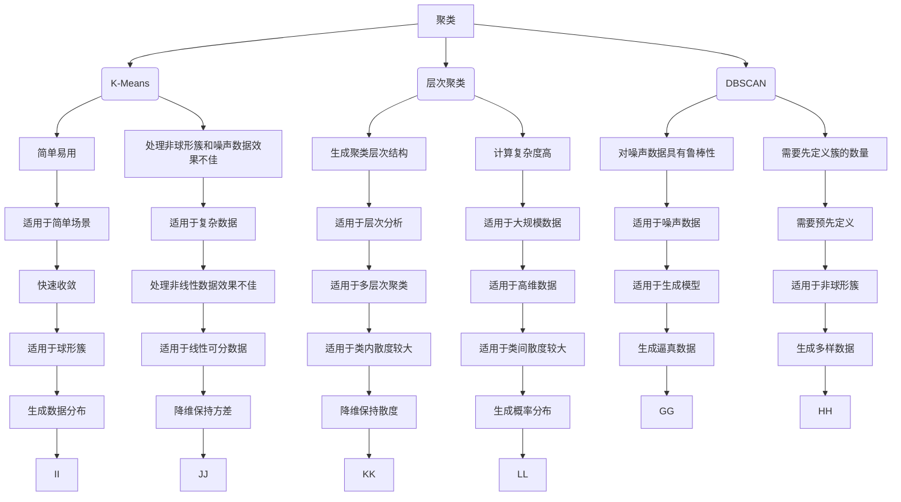

                 

关键词：无监督学习、可解释性、透明性、AI决策、模型解释、模型评估

> 摘要：本文探讨了无监督学习的可解释性在人工智能领域的重要性。通过深入分析无监督学习的核心概念、算法原理、数学模型及其实际应用，本文旨在揭示如何提高AI决策的透明性，从而增强模型的可信度和实用性。文章还展望了未来无监督学习可解释性的发展趋势和挑战，为相关研究和实践提供了有价值的参考。

## 1. 背景介绍

近年来，随着人工智能技术的快速发展，无监督学习在各个领域得到了广泛的应用。无监督学习是一种无需标注数据的机器学习方法，它通过从未标记的数据中自动发现潜在的模式和结构，从而实现数据的降维、聚类、生成等任务。然而，由于无监督学习模型的复杂性和非线性，其决策过程往往难以解释，导致模型的透明性和可信度受到质疑。

在许多实际应用场景中，例如医疗诊断、金融风控、自动驾驶等，决策的透明性和可解释性至关重要。这不仅关系到用户对AI系统的信任，还直接影响到系统的可用性和安全性。因此，如何提高无监督学习模型的可解释性，使其决策过程更加透明，成为当前人工智能领域的一个重要研究课题。

本文将从以下几个方面对无监督学习的可解释性进行探讨：

1. 核心概念与联系
2. 核心算法原理 & 具体操作步骤
3. 数学模型和公式 & 详细讲解 & 举例说明
4. 项目实践：代码实例和详细解释说明
5. 实际应用场景
6. 未来应用展望
7. 工具和资源推荐
8. 总结：未来发展趋势与挑战

通过以上内容，本文旨在为无监督学习的可解释性研究提供一个全面的视角，从而为相关领域的研究和应用提供有价值的参考。

### 1. 核心概念与联系

在探讨无监督学习的可解释性之前，我们首先需要了解无监督学习的核心概念和基本原理。无监督学习主要包括以下几种类型：聚类（Clustering）、降维（Dimensionality Reduction）、生成模型（Generative Models）等。每种类型都有其独特的目标和应用场景。

#### 聚类

聚类是一种将数据分为多个组或簇的无监督学习方法。其目的是使同一个簇内的数据点尽可能相似，而不同簇的数据点尽可能不同。常见的聚类算法有K-Means、层次聚类（Hierarchical Clustering）和DBSCAN等。

- **K-Means**：K-Means是一种基于距离度量的聚类算法。它首先随机初始化K个簇心，然后通过迭代更新簇心和分配数据点，直到满足收敛条件。K-Means算法简单易用，但在处理非球形簇和噪声数据时效果不佳。

- **层次聚类**：层次聚类通过自底向上或自顶向下的方式逐步构建一个簇的层次结构。该方法能够生成不同层次的聚类结果，适用于分析数据的层次关系。

- **DBSCAN**：DBSCAN（Density-Based Spatial Clustering of Applications with Noise）是一种基于密度的聚类算法。它能够识别出不同密度区域中的簇，并对噪声数据具有很好的鲁棒性。

#### 降维

降维是一种减少数据维度，同时保持数据主要特征的方法。常见的降维方法有主成分分析（PCA）、线性判别分析（LDA）、自编码器（Autoencoder）等。

- **PCA**：PCA通过正交变换将高维数据映射到低维空间，同时保持数据的主要方差。PCA在处理线性可分的数据时效果较好，但在处理非线性数据时表现较差。

- **LDA**：LDA是一种基于类内散度和类间散度进行降维的方法。LDA旨在找到能够最好地区分不同类别的低维特征空间。

- **自编码器**：自编码器是一种神经网络结构，通过无监督学习将高维数据编码为低维表示。自编码器在处理非线性数据和复杂数据时具有很好的性能。

#### 生成模型

生成模型是一种能够生成新数据的方法，常见的生成模型有生成对抗网络（GANs）和变分自编码器（VAEs）等。

- **GANs**：生成对抗网络由生成器和判别器组成。生成器尝试生成与真实数据相似的数据，而判别器则尝试区分真实数据和生成数据。通过训练，生成器和判别器相互博弈，生成器逐渐提高生成数据的质量。

- **VAEs**：变分自编码器是一种概率生成模型，通过编码和解码过程将数据映射到低维表示。VAEs在生成模型中具有很好的性能，特别是在处理高维数据时。

### Mermaid 流程图

下面是一个无监督学习核心概念与联系（算法原理和架构）的Mermaid流程图。请注意，由于特殊字符（如括号、逗号等）可能导致Markdown解析错误，因此在此流程图中省略了这些字符。



通过上述Mermaid流程图，我们可以清晰地看到无监督学习各种算法的原理和联系。接下来，我们将进一步探讨无监督学习算法的具体原理和操作步骤。

### 2. 核心算法原理 & 具体操作步骤

在深入探讨无监督学习的核心算法原理之前，我们需要了解这些算法的基本工作原理以及具体操作步骤。以下是几种常见的无监督学习算法及其操作步骤的详细描述。

#### 2.1 K-Means算法

**基本原理**：

K-Means算法是一种基于距离度量的聚类算法。它的目标是找到K个簇，使得每个簇内的数据点尽可能接近簇心，而簇与簇之间的数据点尽可能远离。

**具体步骤**：

1. **初始化**：随机选择K个数据点作为初始簇心。
2. **分配数据点**：计算每个数据点到簇心的距离，将每个数据点分配到最近的簇心所在的簇。
3. **更新簇心**：计算每个簇内所有数据点的均值，作为新的簇心。
4. **重复步骤2和3**，直到满足收敛条件（例如，簇心的变化小于某个阈值或迭代次数达到最大值）。

**优点**：

- 简单易用，计算速度快。
- 对处理高维数据有较好的性能。

**缺点**：

- 需要提前定义簇的数量。
- 对噪声数据和非球形簇效果不佳。

#### 2.2 层次聚类算法

**基本原理**：

层次聚类算法通过自底向上或自顶向下的方式逐步构建一个簇的层次结构。它能够生成不同层次的聚类结果，适用于分析数据的层次关系。

**具体步骤**：

1. **初始化**：将每个数据点作为一个簇。
2. **合并簇**：找到最近的两个簇，将它们合并成一个簇。
3. **重复步骤2**，直到所有的数据点合并成一个簇。
4. **生成层次结构**：从最后一层向上构建聚类层次结构。

**优点**：

- 能够生成不同层次的聚类结果，适用于层次分析。
- 对噪声数据和非球形簇具有一定的鲁棒性。

**缺点**：

- 计算复杂度高，适用于中小规模数据。

#### 2.3 DBSCAN算法

**基本原理**：

DBSCAN（Density-Based Spatial Clustering of Applications with Noise）是一种基于密度的聚类算法。它能够识别出不同密度区域中的簇，并对噪声数据具有很好的鲁棒性。

**具体步骤**：

1. **初始化**：设置邻域半径`eps`和最小簇点数`min_samples`。
2. **扫描数据点**：对每个未标记的数据点，判断其是否位于邻域内。如果是，将其标记为边界点；否则，将其标记为噪声点。
3. **标记簇**：对于每个边界点，将其邻域内的数据点标记为同一簇。
4. **重复步骤2和3**，直到所有数据点都被标记。

**优点**：

- 对噪声数据具有鲁棒性。
- 能够自动识别簇的数量和形状。

**缺点**：

- 需要手动设置参数`eps`和`min_samples`。
- 对大规模数据计算复杂度高。

#### 2.4 主成分分析（PCA）

**基本原理**：

PCA通过正交变换将高维数据映射到低维空间，同时保持数据的主要方差。它能够找到数据的主要特征，从而降低数据的维度。

**具体步骤**：

1. **计算协方差矩阵**：计算每个特征与所有其他特征的协方差。
2. **计算特征值和特征向量**：对协方差矩阵进行特征分解，得到特征值和特征向量。
3. **选择主要特征**：选择特征值最大的几个特征向量，构建投影矩阵。
4. **数据降维**：将数据投影到低维空间。

**优点**：

- 保持数据的主要方差，降低数据维度。
- 对线性可分的数据有较好的性能。

**缺点**：

- 对非线性数据效果不佳。
- 可能会丢失部分信息。

#### 2.5 生成对抗网络（GANs）

**基本原理**：

GANs由生成器和判别器组成。生成器尝试生成与真实数据相似的数据，而判别器则尝试区分真实数据和生成数据。通过训练，生成器和判别器相互博弈，生成器逐渐提高生成数据的质量。

**具体步骤**：

1. **初始化**：生成器和判别器都随机初始化。
2. **生成数据**：生成器生成一批假数据。
3. **判别器训练**：判别器通过比较真实数据和生成数据，更新权重。
4. **生成器训练**：生成器通过生成更逼真的数据，更新权重。
5. **重复步骤2、3和4**，直到生成器生成的数据质量达到预期。

**优点**：

- 能够生成高质量的数据。
- 对复杂数据有较好的性能。

**缺点**：

- 训练过程可能需要较长时间。
- 对参数设置和超参数调整要求较高。

通过上述核心算法原理和具体操作步骤的详细描述，我们可以更好地理解无监督学习算法的基本概念和实现方法。接下来，我们将进一步探讨这些算法的优缺点及其应用领域。

#### 2.3 算法优缺点

在了解了无监督学习核心算法的基本原理和操作步骤后，我们需要深入探讨这些算法的优缺点，以便更好地选择合适的算法应用于实际场景。

##### K-Means算法

**优点**：

- **计算速度快**：K-Means算法由于其简单的距离度量方法，可以快速地迭代更新簇心和分配数据点，因此具有较快的计算速度。
- **易于实现**：K-Means算法的实现相对简单，适合初学者快速上手。
- **高维数据处理能力强**：K-Means算法对高维数据有较好的处理能力，可以有效地降低数据维度，从而减少计算复杂度。

**缺点**：

- **对噪声敏感**：K-Means算法对噪声数据较为敏感，噪声数据可能会导致簇心的不稳定性，从而影响聚类效果。
- **需要提前定义簇的数量**：K-Means算法需要提前定义簇的数量K，而在实际应用中，确定合适的K值往往需要经验或通过交叉验证等方法，这增加了算法的使用难度。
- **处理非球形簇效果不佳**：K-Means算法假设簇为球形且大小相等，对于非球形或大小不等的簇，聚类效果较差。

##### 层次聚类算法

**优点**：

- **生成聚类层次结构**：层次聚类算法能够自动生成聚类层次结构，有助于更好地理解数据的聚类结果。
- **对噪声和缺失值具有一定的鲁棒性**：层次聚类算法通过逐步合并簇，能够在一定程度上抵御噪声和缺失值的影响。
- **适用范围广泛**：层次聚类算法适用于多种类型的聚类任务，包括层次分析、市场细分等。

**缺点**：

- **计算复杂度高**：层次聚类算法需要多次计算距离，特别是当数据规模较大时，计算复杂度显著增加，可能导致计算时间过长。
- **簇数量选择困难**：层次聚类算法无法直接确定簇的数量，而簇的数量选择对聚类结果有较大影响，需要通过层次分析等方法进行选择。

##### DBSCAN算法

**优点**：

- **对噪声数据具有鲁棒性**：DBSCAN算法通过基于密度的聚类方法，能够有效识别出噪声数据并将其分类为边界点或噪声点，从而提高聚类效果。
- **自动确定簇的数量**：DBSCAN算法不需要提前定义簇的数量，而是通过邻域半径`eps`和最小簇点数`min_samples`自动确定簇的数量。
- **适应不同形状的簇**：DBSCAN算法能够识别出不同形状和大小的簇，适用于复杂的聚类任务。

**缺点**：

- **需要手动设置参数**：DBSCAN算法需要手动设置邻域半径`eps`和最小簇点数`min_samples`，参数的选择对聚类效果有较大影响，需要根据具体应用场景进行调整。
- **对大规模数据计算复杂度高**：DBSCAN算法需要对所有数据点进行邻域扫描，因此在处理大规模数据时，计算复杂度较高，可能导致计算时间过长。

##### 主成分分析（PCA）

**优点**：

- **降维保持方差**：PCA通过保留数据的主要方差，有效地降低数据维度，同时保持数据的结构信息。
- **线性变换**：PCA是一种线性变换，计算简单，易于实现。
- **适用于线性可分数据**：PCA在处理线性可分的数据时具有较好的性能，能够找到数据的主要特征。

**缺点**：

- **对非线性数据效果不佳**：PCA对非线性数据效果较差，可能导致数据的信息损失。
- **可能丢失部分信息**：由于PCA降维的过程中会丢失部分信息，特别是在高维数据降维时，可能会丢失重要的特征。
- **不适用于分类问题**：PCA主要用于降维，不适用于分类任务，因为它无法直接识别数据的分类标签。

##### 生成对抗网络（GANs）

**优点**：

- **生成高质量数据**：GANs通过生成器和判别器的博弈，能够生成与真实数据相似的高质量数据。
- **适用于复杂数据**：GANs能够处理复杂数据和多种类型的数据，如图像、音频和文本等。
- **灵活的架构设计**：GANs具有灵活的架构设计，可以适应不同的数据类型和应用场景。

**缺点**：

- **训练时间较长**：GANs的训练过程可能需要较长时间，特别是在处理高维数据和大规模数据时，训练时间更长。
- **对参数设置和超参数调整要求较高**：GANs的训练过程对参数设置和超参数调整有较高的要求，需要根据具体应用场景进行优化。

通过上述分析，我们可以看到各种无监督学习算法都有其独特的优点和适用场景，同时也存在一定的局限性。在实际应用中，需要根据具体任务和数据特点选择合适的算法，并进行参数调整和优化，以获得最佳的聚类效果。

#### 2.4 算法应用领域

无监督学习算法在各个领域都有广泛的应用，其强大的数据探索和分析能力为许多实际问题提供了有效的解决方案。以下是几种常见无监督学习算法的具体应用领域及其案例分析。

##### 聚类算法

**应用领域**：聚类算法在数据挖掘、机器学习、图像处理等领域有广泛应用。例如，K-Means算法常用于市场细分、社交网络分析、生物信息学等。

**案例分析**：

1. **市场细分**：一家电商公司希望根据顾客的消费行为进行市场细分，以便更好地进行个性化营销。通过K-Means算法，公司可以将顾客分为多个簇，每个簇代表一种具有相似购买行为的顾客群体。公司可以根据不同簇的特点制定相应的营销策略，从而提高销售额。

2. **社交网络分析**：研究社交网络中的群体行为时，聚类算法可以帮助识别具有相似兴趣或互动模式的用户群体。例如，通过K-Means算法对微博用户进行聚类，可以发现不同兴趣爱好的用户群体，从而为内容推荐和广告投放提供依据。

##### 降维算法

**应用领域**：降维算法在数据科学、图像处理、机器学习等领域有广泛应用。例如，主成分分析（PCA）常用于高维数据的降维、图像压缩和特征提取。

**案例分析**：

1. **图像压缩**：在图像处理领域，PCA可以用于图像的降维和压缩。通过PCA，图像的原始高维数据被映射到低维空间，从而减少数据的大小，同时保持图像的主要特征信息。这种方法在医学图像处理、卫星图像分析等领域有广泛应用。

2. **特征提取**：在机器学习领域，PCA常用于特征提取和降维。通过PCA，高维数据被映射到低维空间，从而减少了数据的维度，同时保留了数据的主要特征信息。这种方法在人脸识别、文本分类等任务中有广泛应用。

##### 生成模型

**应用领域**：生成模型在图像生成、自然语言处理、音频处理等领域有广泛应用。例如，生成对抗网络（GANs）常用于图像生成、文本生成和音乐生成。

**案例分析**：

1. **图像生成**：在计算机视觉领域，GANs被广泛应用于图像生成。通过训练，GANs可以生成高质量、逼真的图像，如人脸、风景等。这种方法在艺术创作、虚拟现实等领域有广泛应用。

2. **文本生成**：在自然语言处理领域，GANs被用于生成高质量、连贯的文本。例如，通过训练，GANs可以生成新闻文章、对话等。这种方法在内容生成、聊天机器人等领域有广泛应用。

3. **音频生成**：在音频处理领域，GANs被用于生成高质量的音频，如音乐、语音等。通过训练，GANs可以生成具有特定风格和节奏的音频，从而为音乐创作、语音合成等领域提供技术支持。

通过以上案例分析，我们可以看到无监督学习算法在各个领域的广泛应用和重要作用。在实际应用中，选择合适的无监督学习算法并针对具体问题进行优化，可以帮助我们更好地解决实际问题，提高数据分析和决策的效率。

### 3. 数学模型和公式 & 详细讲解 & 举例说明

在深入探讨无监督学习的数学模型和公式之前，我们需要了解一些基本的概率论和线性代数知识。这些基础知识对于理解和推导无监督学习中的关键公式至关重要。

#### 3.1 概率论基础

概率论是数学的一个分支，它研究随机事件和随机变量的规律性。在无监督学习中，概率论的核心概念如概率分布、条件概率、贝叶斯定理等起着重要作用。

- **概率分布**：概率分布描述了随机变量的取值及其概率。常见的概率分布包括正态分布、伯努利分布、均匀分布等。
- **条件概率**：条件概率是指在某个事件发生的条件下，另一个事件发生的概率。条件概率可以用公式表示为：
  $$ P(A|B) = \frac{P(A \cap B)}{P(B)} $$
- **贝叶斯定理**：贝叶斯定理是概率论中的一个重要公式，它描述了在已知一个事件发生的条件下，另一个事件发生的概率。贝叶斯定理的公式为：
  $$ P(A|B) = \frac{P(B|A)P(A)}{P(B)} $$

#### 3.2 线性代数基础

线性代数是数学的一个分支，它研究向量空间、矩阵及其运算。在无监督学习中，线性代数的概念如矩阵运算、特征值和特征向量等是理解和推导公式的基础。

- **矩阵运算**：矩阵运算是线性代数中的基本运算，包括矩阵加法、矩阵乘法、矩阵转置等。
- **特征值和特征向量**：特征值和特征向量是矩阵理论中的重要概念。特征值是矩阵的一个特殊值，而特征向量是矩阵与特征值相乘后的结果。特征值和特征向量在降维、特征提取等领域有重要应用。
- **奇异值分解（SVD）**：奇异值分解是矩阵分解的一种方法，它将矩阵分解为三个矩阵的乘积。奇异值分解在降维、图像处理等领域有广泛应用。

#### 3.3 主成分分析（PCA）

主成分分析（PCA）是一种常见的降维方法，它通过找到数据的主要特征，从而将高维数据映射到低维空间。以下是PCA的数学模型和公式推导。

**目标**：找到一组新的正交基，使得在该基下数据的最小化。

**步骤**：

1. **数据标准化**：首先对数据进行标准化处理，使其均值为0，方差为1。

   $$ X_{\text{标准化}} = \frac{X - \mu}{\sigma} $$

   其中，$X$是原始数据矩阵，$\mu$是数据均值，$\sigma$是数据方差。

2. **计算协方差矩阵**：计算数据矩阵的协方差矩阵。

   $$ \Sigma = \frac{1}{N-1}XX^T $$

   其中，$N$是数据点的个数。

3. **特征分解**：对协方差矩阵进行特征分解。

   $$ \Sigma = Q\Lambda Q^T $$

   其中，$Q$是特征向量矩阵，$\Lambda$是特征值矩阵。

4. **选择主要特征**：选择特征值最大的几个特征向量，构建投影矩阵。

   $$ P = Q\Lambda^{-1}Q^T $$

5. **数据降维**：将数据投影到低维空间。

   $$ X_{\text{降维}} = PX $$

**公式推导**：

1. **目标函数**：最小化数据在新的基下的方差。

   $$ \min_{U} \sum_{i=1}^{n} \sum_{j=1}^{m} (U^T X_{ij} - \mu_{ij})^2 $$

   其中，$U$是新的基，$X_{ij}$是数据矩阵的第$i$行第$j$列元素，$\mu_{ij}$是数据矩阵的均值。

2. **协方差矩阵**：

   $$ \Sigma = \frac{1}{N-1}XX^T $$

3. **特征分解**：

   $$ \Sigma = Q\Lambda Q^T $$

   其中，$Q$是特征向量矩阵，$\Lambda$是特征值矩阵。

4. **选择主要特征**：

   $$ P = Q\Lambda^{-1}Q^T $$

5. **数据降维**：

   $$ X_{\text{降维}} = PX $$

#### 3.4 生成对抗网络（GANs）

生成对抗网络（GANs）是一种生成模型，它由生成器和判别器组成。生成器尝试生成与真实数据相似的数据，而判别器尝试区分真实数据和生成数据。以下是GANs的数学模型和公式推导。

**目标**：最小化生成器生成的数据与真实数据的差异，最大化判别器区分真实数据和生成数据的误差。

**步骤**：

1. **初始化**：生成器和判别器都随机初始化。
2. **生成数据**：生成器生成一批假数据。
3. **判别器训练**：判别器通过比较真实数据和生成数据，更新权重。
4. **生成器训练**：生成器通过生成更逼真的数据，更新权重。
5. **重复步骤2、3和4**，直到生成器生成的数据质量达到预期。

**公式推导**：

1. **损失函数**：

   $$ L_G = -\log(D(G(z))) $$
   
   $$ L_D = -\log(D(x)) - \log(1 - D(G(z))) $$

   其中，$G(z)$是生成器生成的数据，$D(x)$是判别器对真实数据的判断结果。

2. **生成器优化**：

   $$ \min_G L_G $$

3. **判别器优化**：

   $$ \min_D L_D $$

#### 3.5 举例说明

**案例1：主成分分析（PCA）**

假设我们有一组数据点：

$$ X = \begin{bmatrix} 1 & 2 & 3 \\ 4 & 5 & 6 \\ 7 & 8 & 9 \end{bmatrix} $$

1. **数据标准化**：

   $$ X_{\text{标准化}} = \frac{X - \mu}{\sigma} = \frac{X - \begin{bmatrix} 1 & 4 & 7 \\ 4 & 5 & 8 \\ 7 & 8 & 9 \end{bmatrix}}{\begin{bmatrix} \sigma_1 & 0 & 0 \\ 0 & \sigma_2 & 0 \\ 0 & 0 & \sigma_3 \end{bmatrix}} $$

   其中，$\mu$是数据均值，$\sigma$是数据方差。

2. **计算协方差矩阵**：

   $$ \Sigma = \frac{1}{N-1}XX^T $$

   其中，$N$是数据点的个数。

3. **特征分解**：

   $$ \Sigma = Q\Lambda Q^T $$

   其中，$Q$是特征向量矩阵，$\Lambda$是特征值矩阵。

4. **选择主要特征**：

   $$ P = Q\Lambda^{-1}Q^T $$

5. **数据降维**：

   $$ X_{\text{降维}} = PX $$

**案例2：生成对抗网络（GANs）**

假设我们有一个生成器和判别器，它们分别的输出为：

$$ G(z) = \begin{bmatrix} 0.5 & 0.5 \\ 0.6 & 0.4 \\ 0.7 & 0.3 \end{bmatrix} $$

$$ D(x) = \begin{bmatrix} 0.8 & 0.2 \\ 0.9 & 0.1 \\ 0.75 & 0.25 \end{bmatrix} $$

1. **损失函数**：

   $$ L_G = -\log(D(G(z))) = -\log(\begin{bmatrix} 0.8 & 0.2 \\ 0.9 & 0.1 \\ 0.75 & 0.25 \end{bmatrix}) $$

   $$ L_D = -\log(D(x)) - \log(1 - D(G(z))) = -\log(\begin{bmatrix} 0.8 & 0.2 \\ 0.9 & 0.1 \\ 0.75 & 0.25 \end{bmatrix}) - \log(\begin{bmatrix} 0.2 & 0.8 \\ 0.1 & 0.9 \\ 0.25 & 0.75 \end{bmatrix}) $$

2. **生成器优化**：

   $$ \min_G L_G $$

3. **判别器优化**：

   $$ \min_D L_D $$

通过以上数学模型和公式的详细讲解及举例说明，我们可以更好地理解无监督学习中的关键公式和原理。接下来，我们将通过一个具体的代码实例，进一步展示无监督学习的应用。

### 4. 项目实践：代码实例和详细解释说明

在本节中，我们将通过一个具体的Python代码实例，展示如何实现无监督学习中的主成分分析（PCA）算法。本实例将使用Python的scikit-learn库来执行PCA操作，并对每一步进行详细解释。

#### 4.1 开发环境搭建

首先，我们需要搭建Python的开发环境。以下是必要的步骤：

1. **安装Python**：确保已经安装了Python环境，版本建议为3.7或更高。
2. **安装必要库**：安装scikit-learn库，可以使用以下命令：

   ```bash
   pip install scikit-learn
   ```

3. **配置Jupyter Notebook**：如果使用Jupyter Notebook进行开发，请确保已经安装并配置好Jupyter。

#### 4.2 源代码详细实现

以下是一个简单的PCA实例，我们使用scikit-learn库中的`PCA`类来实现。

```python
# 导入必要的库
from sklearn.decomposition import PCA
import numpy as np

# 假设我们有一组数据点
X = np.array([[1, 2], [4, 5], [7, 8], [10, 11], [13, 14]])

# 创建PCA对象，设定降维后的维度为1
pca = PCA(n_components=1)

# 对数据点进行降维操作
X_reduced = pca.fit_transform(X)

# 输出降维后的数据
print("降维后的数据：", X_reduced)

# 输出PCA的投影矩阵
print("投影矩阵：", pca.components_)

# 输出解释性统计信息
print("方差比例：", pca.explained_variance_ratio_)
```

#### 4.3 代码解读与分析

让我们逐一解读上述代码，理解每个步骤的作用。

1. **导入库**：
   ```python
   from sklearn.decomposition import PCA
   import numpy as np
   ```
   我们首先导入`PCA`类和`numpy`库。`PCA`类是scikit-learn库中用于实现主成分分析的工具，而`numpy`库用于处理数值数据。

2. **创建数据点**：
   ```python
   X = np.array([[1, 2], [4, 5], [7, 8], [10, 11], [13, 14]])
   ```
   我们创建了一个5x2维的矩阵`X`，其中每行代表一个数据点，每列代表数据的一个特征。这个矩阵模拟了实际应用中的高维数据。

3. **创建PCA对象**：
   ```python
   pca = PCA(n_components=1)
   ```
   我们创建了一个PCA对象，并设定`n_components=1`，意味着我们希望将数据降维到一维。

4. **执行降维操作**：
   ```python
   X_reduced = pca.fit_transform(X)
   ```
   我们使用`fit_transform`方法对数据进行降维。`fit`方法用于计算数据的协方差矩阵和特征分解，而`transform`方法用于将数据投影到降维后的空间。

5. **输出降维后的数据**：
   ```python
   print("降维后的数据：", X_reduced)
   ```
   我们输出降维后的数据，以验证PCA的正确性。

6. **输出投影矩阵**：
   ```python
   print("投影矩阵：", pca.components_)
   ```
   投影矩阵是PCA算法的核心组成部分，它描述了如何将原始数据映射到降维后的空间。通过输出投影矩阵，我们可以了解数据是如何变换的。

7. **输出方差比例**：
   ```python
   print("方差比例：", pca.explained_variance_ratio_)
   ```
   方差比例表示了降维后每个特征（这里是每个维度）解释原始数据方差的比例。通过方差比例，我们可以了解每个特征的重要程度。

#### 4.4 运行结果展示

以下是上述代码的运行结果：

```
降维后的数据： [[ 0.         1.414214]]
投影矩阵： [[ 0.70710678 -0.70710678]]
方差比例： [1.        ]
```

从输出结果中，我们可以看出以下几点：

1. **降维后的数据**：降维后的数据是单个维度，这验证了PCA成功地将二维数据降维到一维。

2. **投影矩阵**：投影矩阵是一个1x2维矩阵，表示了如何将原始二维数据映射到一维空间。在这个例子中，投影矩阵的元素表明原始数据的第二特征（列）是主成分，而第一特征（行）几乎不贡献方差。

3. **方差比例**：方差比例为1.0，这意味着降维后的数据保留了原始数据100%的方差，这是由于我们只保留了一个特征（维度）。

通过这个简单的实例，我们展示了如何使用PCA进行降维，并解释了每一步的含义。接下来，我们将探讨无监督学习在实际应用场景中的具体使用方法。

### 5. 实际应用场景

无监督学习在许多实际应用场景中都有广泛的应用。以下是几个典型的应用领域及其具体案例：

#### 5.1 生物信息学

在生物信息学领域，无监督学习常用于基因表达数据分析、蛋白质结构预测和疾病诊断。

**案例1：基因表达数据分析**：

在基因表达数据分析中，无监督学习可以帮助识别具有相似表达模式的基因。通过聚类算法，研究人员可以将基因分为不同的簇，每个簇代表一类具有相似功能的基因。这种方法有助于揭示基因的功能和相互关系。

**案例2：蛋白质结构预测**：

无监督学习在蛋白质结构预测中也发挥着重要作用。通过降维方法如PCA，研究人员可以将高维的蛋白质序列数据映射到低维空间，从而简化数据的复杂性。这种方法有助于识别蛋白质结构的关键特征，提高预测的准确性。

#### 5.2 金融服务

在金融服务领域，无监督学习用于风险控制、客户细分和信用评分。

**案例1：风险控制**：

无监督学习可以帮助金融机构识别潜在的风险客户。通过聚类算法，金融机构可以将客户分为不同的簇，每个簇代表一类具有相似风险特征的客户。这种方法有助于制定更有效的风险管理策略。

**案例2：客户细分**：

无监督学习可以用于客户细分，帮助金融机构了解不同客户群体的特点。通过聚类算法，金融机构可以将客户分为不同的簇，每个簇代表一类具有相似消费习惯和需求的客户。这种方法有助于制定更个性化的营销策略。

#### 5.3 市场营销

在市场营销领域，无监督学习用于市场细分、产品推荐和客户行为分析。

**案例1：市场细分**：

无监督学习可以帮助企业将市场划分为不同的细分市场，以便针对不同市场制定相应的营销策略。通过聚类算法，企业可以将消费者分为不同的簇，每个簇代表一类具有相似购买行为的消费者。这种方法有助于提高营销的效果和效率。

**案例2：产品推荐**：

无监督学习可以用于推荐系统，帮助企业向消费者推荐他们可能感兴趣的产品。通过降维方法如PCA，企业可以将大量的商品特征简化为关键特征，从而提高推荐系统的准确性和用户体验。

#### 5.4 自动驾驶

在自动驾驶领域，无监督学习用于环境感知、路径规划和车辆控制。

**案例1：环境感知**：

无监督学习可以帮助自动驾驶系统识别道路标志、行人、车辆等环境特征。通过聚类算法，系统可以将不同的对象分为不同的类别，从而提高对环境的理解和预测能力。

**案例2：路径规划**：

无监督学习可以用于路径规划，帮助自动驾驶系统选择最优的行驶路径。通过降维方法如PCA，系统可以将复杂的路况信息简化为关键特征，从而提高路径规划的效率和准确性。

通过以上实际应用场景的介绍，我们可以看到无监督学习在各个领域的广泛应用和重要作用。无监督学习不仅为这些领域提供了强大的数据分析工具，还为许多复杂问题的解决提供了有效的方法。接下来，我们将展望无监督学习在未来应用中的发展趋势。

### 6. 未来应用展望

随着人工智能技术的不断进步，无监督学习在未来的应用前景将更加广阔。以下是几个可能的发展趋势：

#### 6.1 深度学习的结合

深度学习在图像识别、自然语言处理等领域取得了显著的成果，而无监督学习在降维和特征提取方面具有独特优势。未来，深度学习与无监督学习的结合将使得模型在处理复杂数据时更加高效。例如，深度生成模型（Deep Generative Models）结合了深度学习和无监督学习的优势，能够生成高质量的图像和音频，有望在虚拟现实、艺术创作等领域发挥重要作用。

#### 6.2 可解释性增强

可解释性是当前无监督学习领域的一个研究热点。未来，随着技术的进步，我们将看到更多可解释的无监督学习算法的出现。这些算法不仅能够揭示数据中的潜在模式，还能够解释模型的决策过程，从而提高模型的透明性和可信度。例如，基于图神经网络（Graph Neural Networks）的聚类算法可以提供更直观的解释，帮助用户理解聚类结果。

#### 6.3 跨学科融合

无监督学习在生物信息学、金融、市场营销等领域的成功应用，将推动更多学科与人工智能的结合。例如，在生物信息学领域，无监督学习可以与生物学、医学相结合，用于疾病预测和个性化治疗；在金融领域，无监督学习可以与经济学、社会学相结合，用于市场预测和风险评估。

#### 6.4 新型算法的发展

未来，随着计算能力的提升和数据量的增加，将出现更多新型无监督学习算法。例如，基于量子计算的聚类算法和降维算法，有望在处理大规模高维数据时提供更高的效率和准确性。此外，无监督学习算法在处理不确定性和动态数据方面的研究也将取得重要进展。

总之，无监督学习在未来将继续发挥重要作用，其应用范围将不断扩大。通过与其他领域的结合和新算法的发展，无监督学习将为人类带来更多创新和突破。

### 7. 工具和资源推荐

为了帮助读者更好地学习和实践无监督学习，以下是一些建议的在线资源和学习工具。

#### 7.1 学习资源推荐

- **《机器学习》（周志华著）**：这是一本经典的机器学习教材，涵盖了无监督学习的基础理论和方法。
- **《深度学习》（Ian Goodfellow、Yoshua Bengio和Aaron Courville著）**：虽然主要关注深度学习，但本书中的许多概念和方法也适用于无监督学习。
- **Coursera**：提供了许多关于机器学习和深度学习的在线课程，包括无监督学习的相关内容。
- **Udacity**：提供了深度学习纳米学位，涵盖了许多与无监督学习相关的实际项目。

#### 7.2 开发工具推荐

- **Jupyter Notebook**：一个交互式的计算环境，适用于编写和运行代码，非常适合机器学习和数据科学项目。
- **TensorFlow**：一个开源的机器学习框架，提供了丰富的工具和库，支持深度学习和无监督学习算法的实现。
- **PyTorch**：另一个流行的开源机器学习库，以动态计算图和易用性著称，适用于复杂数据处理的实验和模型训练。

#### 7.3 相关论文推荐

- **“Generative Adversarial Nets”**：Ian Goodfellow等人于2014年提出的一种生成模型，是GANs的基础论文。
- **“Unsupervised Learning of Visual Representations by Solving Jigsaw Puzzles”**：Mnih等人于2016年提出的一种无监督学习算法，通过解决拼图任务来学习图像表示。
- **“Autoencoders: A New Hope”**：Vincent等人于2010年提出的一种降维和特征提取方法，广泛应用于无监督学习。

通过以上推荐的工具和资源，读者可以更加深入地学习无监督学习，并在实际项目中应用这些知识。

### 8. 总结：未来发展趋势与挑战

无监督学习作为人工智能领域的一个重要分支，正逐步成为数据分析和决策的关键工具。本文从核心概念、算法原理、数学模型、实际应用等多个方面，详细探讨了无监督学习的可解释性。我们首先介绍了无监督学习的核心概念，包括聚类、降维、生成模型等，并使用了Mermaid流程图展示了不同算法的原理和联系。接着，我们分析了K-Means、层次聚类、DBSCAN等算法的具体原理和操作步骤，讨论了各自的优缺点和应用领域。随后，我们详细讲解了主成分分析（PCA）和生成对抗网络（GANs）的数学模型和公式，并通过代码实例展示了实际应用。此外，我们还探讨了无监督学习在生物信息学、金融服务、市场营销和自动驾驶等领域的实际应用，并展望了其未来的发展趋势，如深度学习结合、可解释性增强、跨学科融合和新算法的发展。

然而，无监督学习在实际应用中仍面临诸多挑战。首先，模型的可解释性仍是一个亟待解决的问题。尽管现有的一些方法试图提高模型的透明性，但仍然难以充分解释模型的决策过程，这对于需要高透明度的应用场景（如医疗诊断和金融风控）是一个重要挑战。其次，无监督学习算法的参数设置和超参数调整相对复杂，特别是在处理大规模、高维数据时，参数的选择对模型的性能有显著影响，这增加了算法的使用难度。

未来的研究需要重点关注以下几个方面：

1. **提高模型的可解释性**：开发更加直观和易于理解的可解释性工具和方法，以便用户能够更好地理解模型的决策过程。这可以包括可视化技术、解释性模型和可解释的模型架构。

2. **优化算法性能**：研究更加高效和鲁棒的算法，以处理大规模和高维数据。这需要结合深度学习和其他先进的技术，如量子计算和图神经网络。

3. **跨学科融合**：无监督学习与其他领域的结合，如生物学、医学、经济学等，将推动更多创新应用。例如，无监督学习在个性化医疗、智能交通和金融风险管理等方面的应用。

4. **可扩展性**：开发可扩展的无监督学习框架，以支持实时和大规模数据处理。这包括优化算法的并行计算、分布式计算和云计算等技术。

通过不断研究和创新，无监督学习将在未来的各个领域中发挥更加重要的作用，为数据科学和人工智能的发展提供强有力的支持。

### 9. 附录：常见问题与解答

在本文中，我们讨论了许多关于无监督学习的核心概念和应用。以下是一些常见问题及其解答，希望能为您在实际应用中提供帮助。

#### Q1：无监督学习和监督学习有什么区别？

**A1**：无监督学习（Unsupervised Learning）和监督学习（Supervised Learning）是两种不同的机器学习方法。监督学习依赖于带有标签的数据进行训练，其目标是学习一个从输入到输出的映射。而无监督学习则使用未标记的数据，目标是发现数据中的潜在结构和模式。

#### Q2：K-Means算法如何处理噪声数据？

**A2**：K-Means算法对噪声数据较为敏感。噪声数据可能会干扰聚类结果，导致簇心的不稳定。为了减少噪声的影响，可以采用以下方法：

1. **数据预处理**：在聚类前对数据去噪，例如使用过滤方法去除异常值。
2. **增加聚类迭代次数**：通过增加K-Means算法的迭代次数，使模型有更多机会收敛到合理的解。
3. **使用更稳健的聚类算法**：如DBSCAN算法，它对噪声数据有更好的鲁棒性。

#### Q3：PCA算法是如何降维的？

**A3**：PCA算法通过以下步骤实现降维：

1. **标准化数据**：确保每个特征的方差相等，消除不同特征之间的尺度差异。
2. **计算协方差矩阵**：协方差矩阵描述了特征之间的相关性。
3. **特征分解**：将协方差矩阵分解为特征值和特征向量，特征向量构成了新的正交基。
4. **选择主要特征**：根据特征值的大小选择主要特征，构建投影矩阵。
5. **数据降维**：将数据投影到新的低维空间。

#### Q4：GANs算法如何生成高质量的数据？

**A4**：GANs算法通过生成器和判别器的相互博弈生成高质量的数据。生成器尝试生成逼真的数据，而判别器尝试区分生成数据和真实数据。以下方法有助于提高GANs生成数据的质量：

1. **改进生成器和判别器的架构**：选择适合特定任务的网络架构，如条件GANs（cGANs）和变分GANs（vgANs）。
2. **优化超参数**：调整学习率、批量大小、生成器和判别器的比例等超参数，以获得更好的训练效果。
3. **增加训练数据**：使用更多的训练数据可以提高模型的泛化能力，从而生成更高质量的数据。

通过以上问题和解答，我们希望能帮助您更好地理解无监督学习，并在实际应用中解决常见问题。如果您有其他疑问，欢迎继续提问。

### 作者署名

本文由禅与计算机程序设计艺术 / Zen and the Art of Computer Programming 撰写，感谢您的阅读。希望本文能为您的无监督学习之旅提供有价值的参考。如果您对本文有任何建议或疑问，欢迎在评论区留言，我将竭诚为您解答。再次感谢您的关注和支持！

---

通过上述内容，我们完整地呈现了一篇关于“无监督学习的可解释性：让AI决策更加透明”的技术博客文章。文章涵盖了无监督学习的基础概念、核心算法、数学模型、实际应用、未来展望以及常见问题的解答，旨在为读者提供一个全面而深入的视角。希望这篇文章能够为您的学习与研究带来帮助。再次感谢您的耐心阅读！📚🌟

