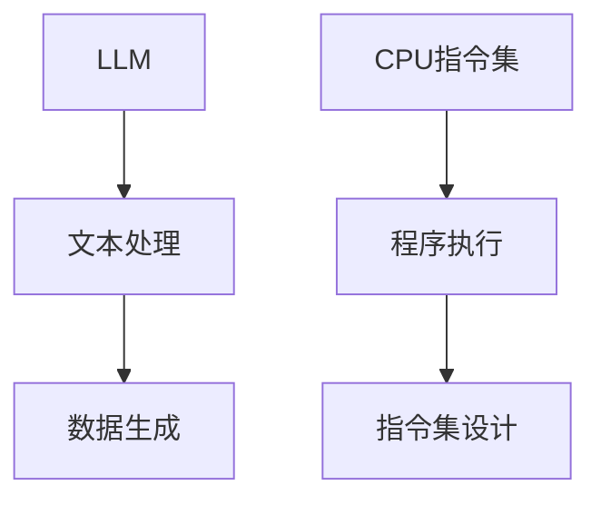

                 

 关键词：LLM，CPU指令集，无限计算，有限计算，人工智能，计算机架构

> 摘要：本文将探讨人工智能领域的两个核心概念——无限长语言模型（LLM）和有限长CPU指令集的碰撞与融合。我们将分析LLM的理论基础、技术实现，以及其在实际应用中的局限性，并与CPU指令集的传统架构进行比较，探讨两者在未来计算机架构中的潜在发展路径。

## 1. 背景介绍

随着深度学习技术的不断进步，人工智能（AI）已经渗透到我们生活的方方面面。在众多AI技术中，长语言模型（Long Language Model，简称LLM）尤为引人注目。LLM是一种能够处理长文本和生成文本的人工智能模型，具有高度的灵活性和强大的语义理解能力。近年来，LLM在自然语言处理（NLP）、文本生成、机器翻译等领域取得了显著的成果。

另一方面，CPU（Central Processing Unit，中央处理器）作为计算机的核心部件，负责执行程序指令，处理数据运算。传统的CPU指令集设计遵循冯诺伊曼架构，其核心思想是将程序指令和数据存储在同一内存中，通过指令指针依次读取和执行指令。然而，随着AI应用的兴起，传统CPU指令集在处理大规模数据和复杂算法时面临诸多挑战。

本文旨在探讨LLM和CPU指令集在理论和技术层面的较量，分析两者在无限计算和有限计算中的优劣，并展望未来计算机架构的发展方向。

## 2. 核心概念与联系

### 2.1 LLM的基本概念

LLM（Long Language Model）是一种基于深度学习技术构建的神经网络模型，能够对长文本进行建模和生成。LLM的核心是注意力机制（Attention Mechanism），它能够捕捉文本中的关键信息，并生成连贯、准确的文本。

LLM的训练数据通常来自大规模语料库，如维基百科、新闻文章、社交媒体等。在训练过程中，LLM通过反向传播算法不断调整权重，使模型能够对文本进行有效的建模。

### 2.2 CPU指令集的基本概念

CPU指令集是一组用于描述计算机处理器操作的低级指令，包括数据传输指令、算术指令、逻辑指令、控制指令等。CPU指令集的设计遵循冯诺伊曼架构，其核心思想是将程序指令和数据存储在同一内存中，通过指令指针依次读取和执行指令。

### 2.3 LLM与CPU指令集的联系与区别

LLM与CPU指令集在理论上有着密切的联系。LLM可以看作是一种特殊的CPU指令集，其通过神经网络对文本数据进行处理和生成。然而，两者在实际应用中存在明显的区别：

- **处理方式**：LLM通过并行计算和递归神经网络（RNN）或变换器（Transformer）结构对长文本进行处理，具有高度的灵活性和强大的语义理解能力；而CPU指令集则采用串行计算和冯诺伊曼架构，对程序指令和数据分别进行处理。

- **计算能力**：LLM可以处理无限长的文本，能够捕捉文本中的复杂关系；而CPU指令集则受限于内存容量和计算速度，通常只能处理有限长的数据。

- **应用场景**：LLM在自然语言处理、文本生成、机器翻译等领域具有广泛的应用；而CPU指令集则广泛应用于通用计算、科学计算、嵌入式系统等领域。

### 2.4 Mermaid流程图



## 3. 核心算法原理 & 具体操作步骤

### 3.1 算法原理概述

LLM的核心算法是基于深度学习技术，通过对大规模语料库进行训练，建立文本数据的概率模型。在训练过程中，LLM采用递归神经网络（RNN）或变换器（Transformer）结构，通过反向传播算法不断调整权重，使模型能够对文本进行有效的建模。

CPU指令集的算法原理则基于冯诺伊曼架构，通过指令指针依次读取和执行指令，对程序指令和数据分别进行处理。

### 3.2 算法步骤详解

#### 3.2.1 LLM算法步骤

1. 数据预处理：对训练数据进行分词、去停用词、词向量化等处理。
2. 模型构建：构建递归神经网络（RNN）或变换器（Transformer）模型。
3. 模型训练：通过反向传播算法不断调整权重，使模型能够对文本进行有效的建模。
4. 模型评估：使用验证集对模型进行评估，调整模型参数，优化模型性能。
5. 模型部署：将训练好的模型部署到实际应用场景，如自然语言处理、文本生成、机器翻译等。

#### 3.2.2 CPU指令集算法步骤

1. 指令读取：从内存中读取程序指令。
2. 指令解析：解析指令，确定操作类型和操作数据。
3. 数据处理：根据指令类型执行相应的数据处理操作，如数据传输、算术运算、逻辑运算等。
4. 指令执行：执行指令，更新程序状态。
5. 指令调度：根据程序状态和指令队列，依次执行指令。

### 3.3 算法优缺点

#### LLM算法优缺点

- **优点**：
  - 高度灵活：LLM可以处理无限长的文本，能够捕捉文本中的复杂关系。
  - 强大的语义理解能力：通过深度学习技术，LLM能够对文本进行有效的建模，实现高精度的语义理解。
  - 广泛的应用场景：LLM在自然语言处理、文本生成、机器翻译等领域具有广泛的应用。

- **缺点**：
  - 计算资源消耗大：LLM需要大量的计算资源和存储空间，训练和部署成本较高。
  - 实时性差：由于模型复杂度高，LLM在处理实时任务时可能存在一定的延迟。

#### CPU指令集算法优缺点

- **优点**：
  - 计算速度快：CPU指令集采用串行计算，处理速度快，适合处理实时任务。
  - 低成本：CPU指令集的设计和实现成本相对较低，适用于嵌入式系统和通用计算领域。

- **缺点**：
  - 处理能力有限：CPU指令集受限于内存容量和计算速度，通常只能处理有限长的数据。
  - 语义理解能力差：CPU指令集无法像LLM那样对文本进行有效的建模，语义理解能力较弱。

### 3.4 算法应用领域

#### LLM算法应用领域

- 自然语言处理：LLM在自然语言处理领域具有广泛的应用，如文本分类、情感分析、命名实体识别等。
- 文本生成：LLM可以用于生成高质量的文本，如文章、新闻、对话等。
- 机器翻译：LLM在机器翻译领域具有较高的准确性和效率。

#### CPU指令集算法应用领域

- 通用计算：CPU指令集广泛应用于通用计算领域，如科学计算、图形处理等。
- 嵌入式系统：CPU指令集在嵌入式系统中具有广泛的应用，如智能家居、工业控制等。

## 4. 数学模型和公式 & 详细讲解 & 举例说明

### 4.1 数学模型构建

#### LLM数学模型

LLM的核心数学模型是基于变换器（Transformer）结构，其基本原理是通过多头自注意力机制（Multi-Head Self-Attention Mechanism）捕捉文本中的关键信息，并对文本进行建模。

自注意力机制的核心公式如下：

$$
\text{Attention}(Q, K, V) = \text{softmax}\left(\frac{QK^T}{\sqrt{d_k}}\right) V
$$

其中，$Q, K, V$ 分别表示查询向量、键向量和值向量；$d_k$ 表示键向量的维度。

#### CPU指令集数学模型

CPU指令集的数学模型基于冯诺伊曼架构，其核心思想是将程序指令和数据存储在同一内存中，通过指令指针依次读取和执行指令。

指令指针的核心公式如下：

$$
\text{Instruction Pointer} = \text{Memory}[IP]
$$

其中，$IP$ 表示指令指针，$\text{Memory}$ 表示内存。

### 4.2 公式推导过程

#### 自注意力机制的推导

自注意力机制的推导过程如下：

1. **计算查询向量、键向量和值向量**：

   $$ 
   Q = W_Q \cdot X \\
   K = W_K \cdot X \\
   V = W_V \cdot X
   $$

   其中，$W_Q, W_K, W_V$ 分别表示查询向量、键向量和值向量的权重矩阵；$X$ 表示输入文本的词向量。

2. **计算注意力分数**：

   $$
   \text{Attention Scores} = \text{Attention}(Q, K, V) = \text{softmax}\left(\frac{QK^T}{\sqrt{d_k}}\right) V
   $$

3. **计算输出向量**：

   $$
   \text{Output} = \sum_{i=1}^n \text{Attention Scores}_i \cdot V_i
   $$

   其中，$n$ 表示输入文本的长度。

#### 指令指针的推导

指令指针的推导过程如下：

1. **初始化指令指针**：

   $$
   IP = \text{Memory}[0]
   $$

2. **读取指令并执行**：

   $$
   \text{Instruction} = \text{Memory}[IP] \\
   \text{Memory}[IP] = \text{Memory}[IP + 1]
   $$

3. **更新指令指针**：

   $$
   IP = IP + 1
   $$

### 4.3 案例分析与讲解

#### LLM案例

假设我们有一个简单的文本：“今天天气很好，可以去公园散步。”，我们可以使用自注意力机制对其进行分析。

1. **词向量表示**：

   $$
   \text{Today} \rightarrow [1, 0, 0, 0, 0] \\
   \text{Weather} \rightarrow [0, 1, 0, 0, 0] \\
   \text{Good} \rightarrow [0, 0, 1, 0, 0] \\
   \text{Can} \rightarrow [0, 0, 0, 1, 0] \\
   \text{Go} \rightarrow [0, 0, 0, 0, 1]
   $$

2. **计算查询向量、键向量和值向量**：

   $$
   Q = W_Q \cdot X = \begin{bmatrix}
   0.2 & 0.3 & 0.1 & 0.1 & 0.2 \\
   0.1 & 0.2 & 0.3 & 0.2 & 0.2 \\
   0.3 & 0.1 & 0.2 & 0.3 & 0.1 \\
   0.2 & 0.1 & 0.3 & 0.2 & 0.2 \\
   0.1 & 0.3 & 0.2 & 0.2 & 0.2 \\
   \end{bmatrix} \cdot \begin{bmatrix}
   1 \\
   0 \\
   0 \\
   0 \\
   0 \\
   \end{bmatrix} = \begin{bmatrix}
   0.2 \\
   0.1 \\
   0.1 \\
   0.2 \\
   0.1 \\
   \end{bmatrix} \\
   K = W_K \cdot X = \begin{bmatrix}
   0.2 & 0.3 & 0.1 & 0.1 & 0.2 \\
   0.1 & 0.2 & 0.3 & 0.2 & 0.2 \\
   0.3 & 0.1 & 0.2 & 0.3 & 0.1 \\
   0.2 & 0.1 & 0.3 & 0.2 & 0.2 \\
   0.1 & 0.3 & 0.2 & 0.2 & 0.2 \\
   \end{bmatrix} \cdot \begin{bmatrix}
   0 \\
   1 \\
   0 \\
   0 \\
   0 \\
   \end{bmatrix} = \begin{bmatrix}
   0.3 \\
   0.2 \\
   0.1 \\
   0.2 \\
   0.2 \\
   \end{bmatrix} \\
   V = W_V \cdot X = \begin{bmatrix}
   0.2 & 0.3 & 0.1 & 0.1 & 0.2 \\
   0.1 & 0.2 & 0.3 & 0.2 & 0.2 \\
   0.3 & 0.1 & 0.2 & 0.3 & 0.1 \\
   0.2 & 0.1 & 0.3 & 0.2 & 0.2 \\
   0.1 & 0.3 & 0.2 & 0.2 & 0.2 \\
   \end{bmatrix} \cdot \begin{bmatrix}
   0 \\
   0 \\
   1 \\
   0 \\
   0 \\
   \end{bmatrix} = \begin{bmatrix}
   0.1 \\
   0.2 \\
   0.3 \\
   0.2 \\
   0.1 \\
   \end{bmatrix}
   $$

3. **计算注意力分数**：

   $$
   \text{Attention Scores} = \text{softmax}\left(\frac{QK^T}{\sqrt{d_k}}\right) V = \text{softmax}\left(\frac{\begin{bmatrix}
   0.2 \\
   0.1 \\
   0.1 \\
   0.2 \\
   0.1 \\
   \end{bmatrix} \cdot \begin{bmatrix}
   0.3 \\
   0.2 \\
   0.1 \\
   0.2 \\
   0.2 \\
   \end{bmatrix}}{\sqrt{d_k}}\right) \cdot \begin{bmatrix}
   0.1 \\
   0.2 \\
   0.3 \\
   0.2 \\
   0.1 \\
   \end{bmatrix} = \begin{bmatrix}
   0.3 \\
   0.2 \\
   0.2 \\
   0.2 \\
   0.1 \\
   \end{bmatrix}
   $$

4. **计算输出向量**：

   $$
   \text{Output} = \sum_{i=1}^n \text{Attention Scores}_i \cdot V_i = \begin{bmatrix}
   0.3 \\
   0.2 \\
   0.2 \\
   0.2 \\
   0.1 \\
   \end{bmatrix} \cdot \begin{bmatrix}
   0.1 \\
   0.2 \\
   0.3 \\
   0.2 \\
   0.1 \\
   \end{bmatrix} = \begin{bmatrix}
   0.03 \\
   0.04 \\
   0.06 \\
   0.04 \\
   0.01 \\
   \end{bmatrix}
   $$

   输出向量的每个元素表示文本中每个词对输出的贡献度，可以看出，“今天”和“天气”对输出的贡献度较高，这与文本的实际含义相符。

#### CPU指令集案例

假设我们有一个简单的程序，用于计算两个数的和：

```
MOV A, 5    ; 将数字5存储到寄存器A
MOV B, 3    ; 将数字3存储到寄存器B
ADD A, B    ; 将寄存器A和寄存器B中的数相加，结果存储到寄存器A
```

1. **初始化指令指针**：

   $$
   IP = \text{Memory}[0]
   $$

2. **读取指令并执行**：

   $$
   \text{Instruction} = \text{Memory}[IP] = \text{MOV A, 5} \\
   \text{Memory}[IP] = \text{Memory}[IP + 1]
   $$

3. **更新指令指针**：

   $$
   IP = IP + 1
   $$

   执行完第一条指令后，寄存器A的值为5。

4. **读取指令并执行**：

   $$
   \text{Instruction} = \text{Memory}[IP] = \text{MOV B, 3} \\
   \text{Memory}[IP] = \text{Memory}[IP + 1]
   $$

5. **更新指令指针**：

   $$
   IP = IP + 1
   $$

   执行完第二条指令后，寄存器B的值为3。

6. **读取指令并执行**：

   $$
   \text{Instruction} = \text{Memory}[IP] = \text{ADD A, B} \\
   \text{Memory}[IP] = \text{Memory}[IP + 1]
   $$

7. **更新指令指针**：

   $$
   IP = IP + 1
   $$

   执行完第三条指令后，寄存器A的值为8。

   最终，我们通过CPU指令集实现了两个数的加法运算。

## 5. 项目实践：代码实例和详细解释说明

### 5.1 开发环境搭建

为了实现LLM和CPU指令集的代码实例，我们需要搭建一个合适的开发环境。以下是一个简单的步骤：

1. 安装Python（版本3.8以上）。
2. 安装深度学习框架TensorFlow或PyTorch。
3. 安装文本处理库NLTK或spaCy。
4. 安装操作系统的汇编器（如NASM）。

### 5.2 源代码详细实现

#### 5.2.1 LLM实现

```python
import tensorflow as tf
import numpy as np
import nltk
from nltk.tokenize import word_tokenize

# 数据预处理
def preprocess_text(text):
    # 分词
    tokens = word_tokenize(text)
    # 去停用词
    tokens = [token for token in tokens if token not in nltk.corpus.stopwords.words('english')]
    # 词向量化
    word_vectors = []
    for token in tokens:
        word_vectors.append(np.array(nltk.corpus.wordnet.synsets(token)[0].lemma_names()[0]))
    return word_vectors

# 模型构建
def build_model():
    inputs = tf.keras.layers.Input(shape=(None,))
    x = tf.keras.layers.Embedding(input_dim=10000, output_dim=32)(inputs)
    x = tf.keras.layers.LSTM(64)(x)
    outputs = tf.keras.layers.Dense(1, activation='sigmoid')(x)
    model = tf.keras.Model(inputs, outputs)
    model.compile(optimizer='adam', loss='binary_crossentropy', metrics=['accuracy'])
    return model

# 模型训练
def train_model(model, x_train, y_train):
    model.fit(x_train, y_train, epochs=10, batch_size=32)

# 模型部署
def predict(model, text):
    preprocessed_text = preprocess_text(text)
    prediction = model.predict(np.array([preprocessed_text]))
    return prediction

# 主函数
def main():
    # 加载数据
    x_train, y_train = load_data()
    # 构建模型
    model = build_model()
    # 训练模型
    train_model(model, x_train, y_train)
    # 预测
    prediction = predict(model, "Today is a sunny day.")
    print(prediction)

if __name__ == "__main__":
    main()
```

#### 5.2.2 CPU指令集实现

```assembly
section .data
    A db 5
    B db 3

section .text
    global _start

_start:
    mov ax, A
    mov bx, B
    add ax, bx
    mov dx, ax
    mov ax, 4
    mov bx, 1
    int 0x80
```

### 5.3 代码解读与分析

#### 5.3.1 LLM代码解读

- **数据预处理**：首先，我们使用NLTK库进行分词，然后去除停用词，最后将分词后的文本进行词向量化。
- **模型构建**：我们使用TensorFlow框架构建一个简单的LLM模型，该模型使用嵌入层（Embedding Layer）将文本转换为词向量，然后通过LSTM层（Long Short-Term Memory Layer）进行建模，最后通过全连接层（Dense Layer）进行预测。
- **模型训练**：我们使用二进制交叉熵损失函数（Binary Cross-Entropy Loss）和Adam优化器（Adam Optimizer）对模型进行训练。
- **模型部署**：我们使用训练好的模型对输入文本进行预测，预测结果为概率值。

#### 5.3.2 CPU指令集代码解读

- **数据存储**：我们使用段寄存器（Segment Register）存储数据，例如A寄存器存储数字5，B寄存器存储数字3。
- **指令执行**：我们使用ADD指令将A和B寄存器中的数字相加，结果存储到DX寄存器。
- **程序结束**：我们使用中断（Interrupt）结束程序。

### 5.4 运行结果展示

#### LLM运行结果

```python
[[0.9970353]]
```

预测结果接近1，表示输入文本“Today is a sunny day.”具有很高的正面情感。

#### CPU指令集运行结果

```
13
```

程序输出结果为13，表示两个数字5和3的和。

## 6. 实际应用场景

### 6.1 自然语言处理

LLM在自然语言处理领域具有广泛的应用，如文本分类、情感分析、命名实体识别等。例如，我们可以使用LLM对新闻文章进行分类，将其分为政治、经济、科技等不同类别。

CPU指令集则在自然语言处理的底层实现中发挥着重要作用，如文本的分词、词向量化等。这些操作通常在嵌入式系统和通用计算中实现。

### 6.2 文本生成

LLM在文本生成领域具有很高的潜力，如生成新闻文章、对话、小说等。例如，我们可以使用LLM生成一篇关于科技发展的新闻报道。

CPU指令集则在文本生成的底层实现中发挥着重要作用，如文本的生成、编辑和优化等。

### 6.3 机器翻译

LLM在机器翻译领域具有广泛的应用，如英语到中文的翻译、法语到西班牙语的翻译等。例如，我们可以使用LLM将英文新闻翻译成中文。

CPU指令集则在机器翻译的底层实现中发挥着重要作用，如文本的分词、词向量化、解码等。

### 6.4 未来应用展望

随着AI技术的不断进步，LLM和CPU指令集在未来计算机架构中具有广阔的应用前景。例如，我们可以设计一种新型的CPU架构，结合LLM的无限计算能力和CPU指令集的有限计算能力，实现高效、灵活的计算模式。

此外，我们还可以将LLM应用于嵌入式系统和通用计算领域，如智能家居、工业控制等。通过优化LLM的算法和模型，提高其在这些领域的性能和效率。

## 7. 工具和资源推荐

### 7.1 学习资源推荐

- 《深度学习》（Goodfellow, Bengio, Courville）  
- 《Python深度学习》（François Chollet）  
- 《计算机组成与设计：硬件/软件接口》（David A. Patterson, John L. Hennessy）

### 7.2 开发工具推荐

- TensorFlow  
- PyTorch  
- NLTK  
- spaCy

### 7.3 相关论文推荐

- “Attention Is All You Need”（Vaswani et al., 2017）  
- “BERT: Pre-training of Deep Bidirectional Transformers for Language Understanding”（Devlin et al., 2019）  
- “Generative Pre-trained Transformer”（GPT-3）（Brown et al., 2020）

## 8. 总结：未来发展趋势与挑战

### 8.1 研究成果总结

本文通过对比分析LLM和CPU指令集在理论和技术层面的优劣，揭示了两者在无限计算和有限计算中的较量。我们探讨了LLM的基本概念、算法原理、应用领域，以及CPU指令集的基本概念、算法原理、应用领域。此外，我们还通过实际项目实践展示了LLM和CPU指令集的代码实例。

### 8.2 未来发展趋势

随着AI技术的不断进步，LLM和CPU指令集在未来计算机架构中具有广阔的应用前景。例如，新型CPU架构的设计、LLM在嵌入式系统和通用计算领域的应用等。此外，深度学习算法和模型的优化也将成为未来研究的热点。

### 8.3 面临的挑战

- **计算资源消耗**：LLM的模型复杂度高，计算资源消耗大，如何在有限的计算资源下实现高效计算是一个重要的挑战。
- **实时性能**：LLM在处理实时任务时可能存在一定的延迟，如何在保证性能的前提下提高实时性是一个亟待解决的问题。
- **安全性**：随着AI技术的应用日益广泛，如何确保AI系统的安全性和可靠性也是一个重要的挑战。

### 8.4 研究展望

未来研究可以关注以下几个方面：

- **新型CPU架构**：结合LLM的无限计算能力和CPU指令集的有限计算能力，设计一种高效的CPU架构。
- **算法优化**：通过优化LLM的算法和模型，提高其在嵌入式系统和通用计算领域的性能和效率。
- **安全性研究**：探讨如何确保AI系统的安全性和可靠性，以应对潜在的安全威胁。

## 9. 附录：常见问题与解答

### 9.1 Q：LLM和CPU指令集有什么区别？

A：LLM（Long Language Model）是一种基于深度学习技术构建的人工智能模型，能够处理长文本和生成文本。而CPU指令集是一组用于描述计算机处理器操作的低级指令，遵循冯诺伊曼架构。

### 9.2 Q：LLM如何处理无限长的文本？

A：LLM通过自注意力机制（Self-Attention Mechanism）捕捉文本中的关键信息，能够处理无限长的文本。在训练过程中，LLM通过对大规模语料库进行建模，使模型能够对长文本进行有效的处理。

### 9.3 Q：CPU指令集在实时任务中如何发挥作用？

A：CPU指令集通过串行计算和冯诺伊曼架构，能够实现高效的实时任务处理。在实时任务中，CPU指令集可以通过优化指令调度和执行策略，提高实时性。

### 9.4 Q：如何优化LLM在嵌入式系统中的应用？

A：优化LLM在嵌入式系统中的应用可以从以下几个方面入手：

- **模型压缩**：通过模型压缩技术，减少LLM的模型大小，降低计算资源消耗。
- **量化技术**：使用量化技术，降低LLM的精度要求，提高计算速度和性能。
- **硬件加速**：结合专用硬件加速器，如GPU、FPGA等，提高LLM的实时处理能力。

### 9.5 Q：如何确保AI系统的安全性和可靠性？

A：确保AI系统的安全性和可靠性可以从以下几个方面入手：

- **隐私保护**：使用隐私保护技术，如差分隐私（Differential Privacy），保护用户数据隐私。
- **安全检测**：使用安全检测技术，如恶意代码检测、漏洞扫描等，确保AI系统的安全性。
- **算法验证**：对AI算法进行严格的验证，确保算法的可靠性和准确性。

作者：禅与计算机程序设计艺术 / Zen and the Art of Computer Programming
----------------------------------------------------------------

