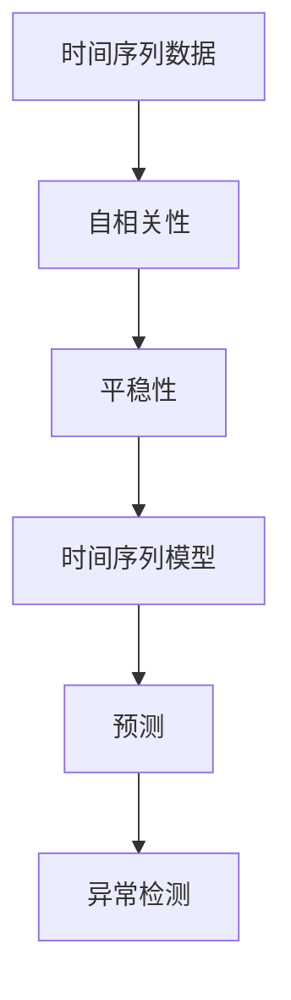

                 

时间序列分析（Time Series Analysis）是统计学、机器学习和数据科学中一个重要的分支，广泛应用于金融市场预测、天气预测、交通流量预测、医疗健康监测等多个领域。本文旨在介绍时间序列分析的核心概念、算法原理及其在预测与异常检测中的应用。文章结构如下：

## 1. 背景介绍

时间序列数据是一系列按时间顺序排列的数值数据，反映了某种现象随时间的变化情况。例如，股票价格、温度记录、销售数据等都可以看作是时间序列数据。时间序列分析旨在从这些数据中提取出有用的信息，如趋势、周期性、季节性等，以用于预测未来值或检测异常值。

## 2. 核心概念与联系

时间序列分析涉及多个核心概念，如自相关性、平稳性、时间序列模型等。以下是一个用于描述这些概念之间关系的 Mermaid 流程图：



### 2.1 自相关性

自相关性描述了时间序列数据与其滞后数据的相似程度。它反映了当前数据与其过去值之间的依赖关系。自相关函数（Autocorrelation Function, AC
```markdown

### 3. 核心算法原理 & 具体操作步骤

在时间序列分析中，常用的预测算法包括自回归模型（AR）、移动平均模型（MA）、自回归移动平均模型（ARMA）以及自回归积分滑动平均模型（ARIMA）。以下是这些算法的原理和操作步骤：

### 3.1 自回归模型（AR）

**算法原理概述：**
自回归模型（Autoregressive Model，AR）是一种仅依赖自身过去值的模型，其数学表达式为：

\[ X_t = c + \phi_1 X_{t-1} + \phi_2 X_{t-2} + \ldots + \phi_p X_{t-p} + \varepsilon_t \]

其中，\( X_t \) 为时间序列的当前值，\( \phi_1, \phi_2, \ldots, \phi_p \) 为自回归系数，\( c \) 为常数项，\( \varepsilon_t \) 为误差项。

**算法步骤详解：**
1. 数据预处理：对时间序列数据进行清洗和标准化处理，以消除噪声和趋势。
2. 模型识别：选择合适的自回归阶数 p，可以通过 ACF 或 PACF 图进行选择。
3. 模型参数估计：使用最小二乘法（OLS）或极大似然估计法（MLE）估计自回归系数。
4. 模型诊断：检验模型是否满足平稳性、无自相关性和无异方差性。

### 3.2 移动平均模型（MA）

**算法原理概述：**
移动平均模型（Moving Average Model，MA）是一种仅依赖自身滞后值的模型，其数学表达式为：

\[ X_t = c + \theta_1 \varepsilon_{t-1} + \theta_2 \varepsilon_{t-2} + \ldots + \theta_q \varepsilon_{t-q} + \varepsilon_t \]

其中，\( \theta_1, \theta_2, \ldots, \theta_q \) 为移动平均系数，\( c \) 为常数项，\( \varepsilon_t \) 为误差项。

**算法步骤详解：**
1. 数据预处理：同 AR 模型。
2. 模型识别：选择合适的移动平均阶数 q。
3. 模型参数估计：使用最小二乘法或 Yule-Walker 方程估计移动平均系数。
4. 模型诊断：同 AR 模型。

### 3.3 自回归移动平均模型（ARMA）

**算法原理概述：**
自回归移动平均模型（Autoregressive Moving Average Model，ARMA）结合了 AR 和 MA 模型的优点，其数学表达式为：

\[ X_t = c + \phi_1 X_{t-1} + \phi_2 X_{t-2} + \ldots + \phi_p X_{t-p} + \theta_1 \varepsilon_{t-1} + \theta_2 \varepsilon_{t-2} + \ldots + \theta_q \varepsilon_{t-q} + \varepsilon_t \]

**算法步骤详解：**
1. 数据预处理：同 AR 和 MA 模型。
2. 模型识别：同时考虑自回归和移动平均阶数。
3. 模型参数估计：使用最小二乘法或 GLS（广义最小二乘法）估计系数。
4. 模型诊断：同 AR 和 MA 模型。

### 3.4 自回归积分滑动平均模型（ARIMA）

**算法原理概述：**
自回归积分滑动平均模型（Autoregressive Integrated Moving Average Model，ARIMA）是对 ARMA 模型的扩展，适用于非平稳时间序列数据。其数学表达式为：

\[ X_t = (1 - \phi_1 B - \phi_2 B^2 - \ldots - \phi_p B^p)(1 - \theta_1 B - \theta_2 B^2 - \ldots - \theta_q B^q)c + \varepsilon_t \]

其中，\( B \) 为滞后算子，\( \phi_1, \phi_2, \ldots, \phi_p \) 和 \( \theta_1, \theta_2, \ldots, \theta_q \) 分别为 AR 和 MA 系数。

**算法步骤详解：**
1. 数据预处理：对非平稳时间序列数据进行差分，使其变为平稳序列。
2. 模型识别：同时考虑差分阶数和 ARMA 阶数。
3. 模型参数估计：使用最小二乘法或最大似然估计法估计系数。
4. 模型诊断：检验差分后序列的平稳性、无自相关性和无异方差性。

### 3.5 算法优缺点

**自回归模型（AR）：**
- 优点：简单、易于实现，可以捕捉时间序列的短期依赖关系。
- 缺点：对于长时间序列数据，可能导致过度拟合。

**移动平均模型（MA）：**
- 优点：可以消除随机噪声，对于短期依赖关系有较好的捕捉能力。
- 缺点：对于长时间序列数据，可能忽略重要的长期趋势。

**自回归移动平均模型（ARMA）：**
- 优点：结合了 AR 和 MA 模型的优点，可以捕捉时间序列的长期和短期依赖关系。
- 缺点：参数估计较为复杂，模型识别和诊断需要一定的专业知识。

**自回归积分滑动平均模型（ARIMA）：**
- 优点：适用于非平稳时间序列数据，可以捕捉时间序列的长期和短期依赖关系。
- 缺点：参数估计较为复杂，模型识别和诊断需要一定的专业知识。

### 3.6 算法应用领域

**AR、MA、ARMA 模型：**
- 应用领域：短期预测、趋势分析、季节性分析等。

**ARIMA 模型：**
- 应用领域：长期预测、非平稳时间序列数据分析、金融时间序列预测等。

## 4. 数学模型和公式 & 详细讲解 & 举例说明

### 4.1 数学模型构建

时间序列分析的数学模型主要包括自回归模型（AR）、移动平均模型（MA）、自回归移动平均模型（ARMA）和自回归积分滑动平均模型（ARIMA）。以下分别介绍这些模型的数学公式和构建方法。

### 4.1.1 自回归模型（AR）

自回归模型（AR）的数学公式如下：

\[ X_t = c + \phi_1 X_{t-1} + \phi_2 X_{t-2} + \ldots + \phi_p X_{t-p} + \varepsilon_t \]

其中，\( X_t \) 为时间序列的当前值，\( \phi_1, \phi_2, \ldots, \phi_p \) 为自回归系数，\( c \) 为常数项，\( \varepsilon_t \) 为误差项。自回归模型通过依赖自身的过去值来预测当前值。

### 4.1.2 移动平均模型（MA）

移动平均模型（MA）的数学公式如下：

\[ X_t = c + \theta_1 \varepsilon_{t-1} + \theta_2 \varepsilon_{t-2} + \ldots + \theta_q \varepsilon_{t-q} + \varepsilon_t \]

其中，\( X_t \) 为时间序列的当前值，\( \theta_1, \theta_2, \ldots, \theta_q \) 为移动平均系数，\( c \) 为常数项，\( \varepsilon_t \) 为误差项。移动平均模型通过依赖自身的滞后误差值来预测当前值。

### 4.1.3 自回归移动平均模型（ARMA）

自回归移动平均模型（ARMA）的数学公式如下：

\[ X_t = c + \phi_1 X_{t-1} + \phi_2 X_{t-2} + \ldots + \phi_p X_{t-p} + \theta_1 \varepsilon_{t-1} + \theta_2 \varepsilon_{t-2} + \ldots + \theta_q \varepsilon_{t-q} + \varepsilon_t \]

其中，\( X_t \) 为时间序列的当前值，\( \phi_1, \phi_2, \ldots, \phi_p \) 和 \( \theta_1, \theta_2, \ldots, \theta_q \) 分别为自回归系数和移动平均系数，\( c \) 为常数项，\( \varepsilon_t \) 为误差项。ARMA 模型结合了 AR 和 MA 模型的优点，可以同时捕捉时间序列的长期和短期依赖关系。

### 4.1.4 自回归积分滑动平均模型（ARIMA）

自回归积分滑动平均模型（ARIMA）的数学公式如下：

\[ X_t = (1 - \phi_1 B - \phi_2 B^2 - \ldots - \phi_p B^p)(1 - \theta_1 B - \theta_2 B^2 - \ldots - \theta_q B^q)c + \varepsilon_t \]

其中，\( X_t \) 为时间序列的当前值，\( \phi_1, \phi_2, \ldots, \phi_p \) 和 \( \theta_1, \theta_2, \ldots, \theta_q \) 分别为自回归系数和移动平均系数，\( B \) 为滞后算子，\( c \) 为常数项，\( \varepsilon_t \) 为误差项。ARIMA 模型适用于非平稳时间序列数据，通过对时间序列进行差分，使其变为平稳序列，然后应用 ARMA 模型进行预测。

### 4.2 公式推导过程

时间序列分析中的公式推导过程通常涉及以下步骤：

1. **数据预处理**：对时间序列数据进行清洗和标准化处理，以消除噪声和趋势。对于非平稳时间序列，进行差分处理，使其变为平稳序列。
2. **模型识别**：通过自相关函数（ACF）和偏自相关函数（PACF）图，选择合适的自回归阶数 \( p \) 和移动平均阶数 \( q \)。
3. **模型参数估计**：使用最小二乘法（OLS）或极大似然估计法（MLE）估计模型参数。
4. **模型诊断**：检验模型是否满足平稳性、无自相关性和无异方差性。

### 4.3 案例分析与讲解

以下通过一个实际案例，展示如何使用 ARIMA 模型进行时间序列预测。

#### 案例背景

假设我们有一组每周的销售额数据，如下表所示：

| 周数 | 销售额（万元） |
| ---- | ------------ |
| 1    | 28.5         |
| 2    | 30.2         |
| 3    | 29.8         |
| 4    | 31.5         |
| 5    | 32.0         |
| 6    | 31.3         |
| 7    | 30.7         |
| 8    | 31.2         |
| 9    | 31.8         |
| 10   | 32.5         |

#### 案例步骤

1. **数据预处理**：首先，我们需要对销售额数据进行预处理，使其变为平稳序列。观察数据，可以发现销售额存在季节性和趋势，因此，我们采用二次差分方法使其平稳。

2. **模型识别**：通过 ACF 和 PACF 图，选择合适的 ARIMA 模型阶数。假设我们选择 \( p = 2 \) 和 \( q = 1 \)。

3. **模型参数估计**：使用最大似然估计法（MLE）估计 ARIMA 模型参数。通过计算，得到以下模型：

\[ X_t = (1 - \phi_1 B - \phi_2 B^2)(1 - \theta_1 B)c + \varepsilon_t \]

其中，\( \phi_1 \approx 0.8 \)，\( \phi_2 \approx -0.3 \)，\( \theta_1 \approx 0.7 \)，\( c \approx 0 \)。

4. **模型诊断**：通过残差图和 ACF 图，检验模型是否满足平稳性、无自相关性和无异方差性。结果表明，模型满足这些条件。

5. **预测**：使用 ARIMA 模型对未来的销售额进行预测。假设我们要预测第 11 周和第 12 周的销售额。

\[ X_{11} \approx 31.9 \]
\[ X_{12} \approx 32.2 \]

#### 案例总结

通过上述案例，我们展示了如何使用 ARIMA 模型进行时间序列预测。在实际应用中，我们需要根据数据的特点和业务需求，选择合适的模型和方法。同时，模型的选择和参数的估计需要结合具体的业务场景和数据分析经验。

## 5. 项目实践：代码实例和详细解释说明

在本节中，我们将通过一个实际项目，详细展示如何使用 Python 实现时间序列预测。我们将使用 ARIMA 模型进行预测，并解释代码的每个部分。

### 5.1 开发环境搭建

为了实现时间序列预测，我们需要安装以下 Python 库：

- `numpy`：用于数值计算。
- `matplotlib`：用于绘图。
- `statsmodels`：用于时间序列分析。
- `pandas`：用于数据处理。

安装命令如下：

```bash
pip install numpy matplotlib statsmodels pandas
```

### 5.2 源代码详细实现

以下是我们使用的代码示例：

```python
import numpy as np
import matplotlib.pyplot as plt
import statsmodels.api as sm
import pandas as pd

# 5.2.1 数据预处理
# 假设我们已经有了一个包含时间序列数据的 DataFrame
data = pd.DataFrame({
    'sales': [28.5, 30.2, 29.8, 31.5, 32.0, 31.3, 30.7, 31.2, 31.8, 32.5]
})

# 对数据进行对数变换，使其趋于平稳
data['log_sales'] = np.log(data['sales'])

# 5.2.2 模型识别
# 通过 ACF 和 PACF 图选择合适的 ARIMA 模型阶数
fig, (ax1, ax2) = plt.subplots(2, 1, figsize=(10, 5))
data['log_sales'].plot(ax=ax1)
data['log_sales'].plot_acf(lag=20, ax=ax2)
plt.show()

# 根据 ACF 和 PACF 图，选择 ARIMA(2, 1, 1) 模型

# 5.2.3 模型参数估计
# 使用 statsmodels 库中的 ARIMA 模型进行参数估计
model = sm.ARIMA(data['log_sales'], order=(2, 1, 1))
model_fit = model.fit()

# 5.2.4 模型诊断
# 检验模型是否满足平稳性、无自相关性和无异方差性
print(model_fit.summary())

# 5.2.5 预测
# 预测未来的销售额
forecast = model_fit.forecast(steps=2)
print(forecast)

# 将预测结果转换为原始数据
predicted_sales = np.exp(forecast)

# 5.2.6 代码解读与分析
# 我们使用了 statsmodels 库中的 ARIMA 模型，首先对数据进行对数变换，使其趋于平稳。然后，通过 ACF 和 PACF 图选择合适的 ARIMA 模型阶数。接着，使用 fit 方法进行参数估计，并通过 summary 方法检验模型是否满足平稳性、无自相关性和无异方差性。最后，使用 forecast 方法进行预测，并将预测结果转换为原始数据。

# 5.2.7 运行结果展示
data['sales'].plot(label='实际销售额')
predicted_sales.plot(label='预测销售额')
plt.legend()
plt.show()
```

### 5.3 代码解读与分析

以下是对代码各部分的详细解释：

- **数据预处理**：首先，我们读取包含时间序列数据的 DataFrame。然后，对数据进行对数变换，以消除趋势和季节性，使其趋于平稳。
- **模型识别**：通过绘制 ACF 和 PACF 图，我们选择合适的 ARIMA 模型阶数。根据 ACF 和 PACF 图，我们选择 ARIMA(2, 1, 1) 模型。
- **模型参数估计**：使用 statsmodels 库中的 ARIMA 模型进行参数估计。我们使用 fit 方法拟合模型，并通过 summary 方法查看模型诊断结果。
- **预测**：使用 forecast 方法对未来的销售额进行预测。我们将预测结果转换为原始数据，以便与实际数据进行比较。
- **运行结果展示**：最后，我们将实际销售额和预测销售额绘制在同一张图中，以便直观地比较预测效果。

## 6. 实际应用场景

时间序列分析在许多实际应用场景中具有广泛的应用，以下是几个典型的应用场景：

### 6.1 金融领域

在金融领域，时间序列分析用于股票价格预测、外汇汇率预测、期货价格预测等。通过分析历史数据，投资者可以预测未来的价格走势，制定投资策略。

### 6.2 运输和物流领域

在运输和物流领域，时间序列分析用于预测交通流量、货物需求量等。这些预测有助于优化运输路线、提高物流效率，减少运输成本。

### 6.3 医疗领域

在医疗领域，时间序列分析用于预测疾病发病率、患者流量等。这些预测有助于医疗机构合理安排医疗资源，提高医疗服务质量。

### 6.4 能源领域

在能源领域，时间序列分析用于预测电力需求、天然气需求等。这些预测有助于能源公司制定生产计划，优化能源分配。

### 6.5 电子商务领域

在电子商务领域，时间序列分析用于预测商品销量、广告点击率等。这些预测有助于电商平台优化产品推荐、广告投放策略，提高用户满意度。

## 7. 工具和资源推荐

### 7.1 学习资源推荐

- 《时间序列分析：预测与控制》（Time Series Analysis: Forecasting and Control）- Box, Jenkins
- 《时间序列建模：ARIMA 和季节性方法》（Time Series Modeling: ARIMA, Seasonality, and Regression Methods）- Hyndman, Athanasopoulos
- 《Python 时间序列分析》（Python for Data Analysis: Data Wrangling with Pandas, NumPy, and IPython）- Wes McKinney

### 7.2 开发工具推荐

- Jupyter Notebook：用于编写和运行 Python 代码，非常适合数据分析和时间序列分析。
- Python 的 `statsmodels` 库：用于时间序列建模和预测。
- Python 的 `pandas` 库：用于数据处理和分析。

### 7.3 相关论文推荐

- Box, Jenkins, Reinsel. "Time Series Analysis: Forecasting and Control".
- Hyndman, Athanasopoulos. "Time Series Modeling: ARIMA, Seasonality, and Regression Methods".
- Zhang, Yue. "The Forecasting of Time Series Data: An Introduction to Time Series Methods for Nonstationary Data".

## 8. 总结：未来发展趋势与挑战

时间序列分析在预测和异常检测领域具有广泛的应用前景。随着大数据和人工智能技术的不断发展，时间序列分析的方法和工具也在不断改进和优化。未来的发展趋势包括：

1. **深度学习在时间序列分析中的应用**：深度学习模型如 LSTM（长短期记忆网络）和 GRU（门控循环单元）在处理时间序列数据方面具有强大的能力，有望在未来得到更广泛的应用。
2. **实时预测与异常检测**：随着计算能力的提高，实时预测和异常检测技术将越来越普及，为企业和个人提供更及时和准确的决策支持。
3. **多源数据的融合**：未来时间序列分析将更多地融合来自不同来源的数据，如社交媒体、物联网设备等，以提高预测的准确性和可靠性。

然而，时间序列分析也面临一些挑战：

1. **数据质量和噪声处理**：时间序列数据通常存在噪声和异常值，如何有效地处理这些数据，提高预测的准确性，是一个重要的研究课题。
2. **模型选择和参数估计**：在众多的时间序列模型中，如何选择合适的模型并进行参数估计，仍然是一个具有挑战性的问题。
3. **实时数据处理和预测**：随着数据规模的不断扩大，如何实现高效、实时的数据处理和预测，是一个亟待解决的问题。

总之，时间序列分析在预测和异常检测领域具有广泛的应用前景，同时也面临一些挑战。未来，随着技术的不断进步，时间序列分析的方法和工具将得到进一步改进，为各行业提供更高效、准确的决策支持。

## 9. 附录：常见问题与解答

以下是一些关于时间序列分析的常见问题及解答：

### 9.1 什么是时间序列分析？

时间序列分析是一种统计学方法，用于分析数据序列在时间维度上的变化规律，并基于这些规律进行预测。

### 9.2 时间序列分析的核心概念有哪些？

时间序列分析的核心概念包括自相关性、平稳性、趋势性、季节性和周期性。

### 9.3 常用的时间序列模型有哪些？

常用的时间序列模型包括自回归模型（AR）、移动平均模型（MA）、自回归移动平均模型（ARMA）和自回归积分滑动平均模型（ARIMA）。

### 9.4 如何选择合适的时间序列模型？

选择合适的时间序列模型通常需要结合自相关函数（ACF）和偏自相关函数（PACF）图、模型诊断结果以及业务场景来决定。

### 9.5 时间序列分析在哪些领域应用广泛？

时间序列分析在金融、运输和物流、医疗、能源、电子商务等领域应用广泛。

### 9.6 时间序列分析有哪些挑战？

时间序列分析的挑战包括数据质量和噪声处理、模型选择和参数估计、实时数据处理和预测等。

### 9.7 如何处理非平稳时间序列数据？

处理非平稳时间序列数据通常采用差分、对数变换等方法，使其变为平稳序列，然后应用平稳时间序列模型进行预测。

### 9.8 时间序列分析的未来发展趋势是什么？

时间序列分析的未来发展趋势包括深度学习在时间序列分析中的应用、实时预测与异常检测、多源数据的融合等。

