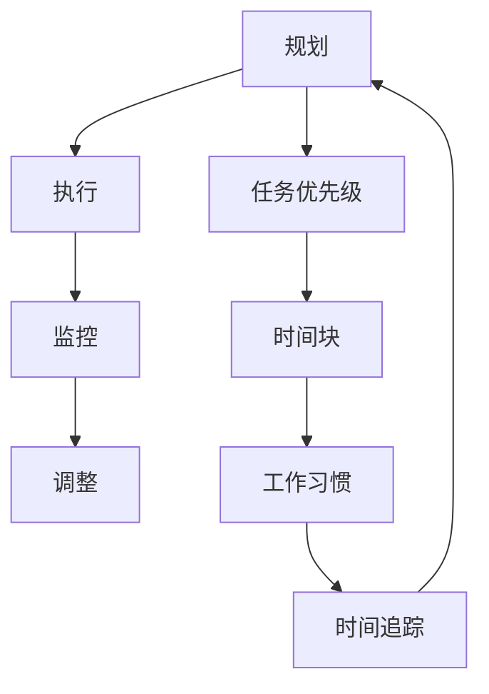

                 

时间管理是一个广泛讨论的话题，对于IT领域的专业人士来说尤为重要。在高度复杂和不断变化的技术环境中，高效的时间管理不仅能提升个人生产力，还能促进团队协作和项目成功。本文将深入探讨时间管理的核心概念、算法原理、数学模型、项目实践和未来趋势，旨在为读者提供一套实用的黄金法则，帮助大家更高效地管理时间。

## 关键词

- 时间管理
- 效率提升
- IT专业人士
- 项目成功
- 数学模型
- 代码实践

## 摘要

本文将围绕时间管理的主题，介绍一系列提高效率的黄金法则。通过深入分析时间管理的核心概念，结合实用的算法原理、数学模型和项目实践，文章旨在为IT专业人士提供一套全面的时间管理策略。同时，文章还将探讨时间管理的实际应用场景和未来趋势，为读者提供更广阔的视野和实用的建议。

### 1. 背景介绍

在当今快速发展的IT行业中，时间管理的重要性不言而喻。IT专业人士常常需要处理大量复杂任务，从编码、测试到部署和维护，每个环节都对时间管理提出了极高的要求。有效的个人时间管理不仅能够提升工作效率，还能减少工作压力，提高生活质量。然而，如何在有限的时间内完成更多工作，成为了每个IT专业人士面临的挑战。

时间管理的概念涵盖了规划、执行、监控和调整四个主要方面。规划是指合理安排时间，将任务分配到适当的时间段；执行是指按照计划完成任务；监控是指跟踪任务的进度和效率；调整是指根据实际情况对计划进行调整。这四个方面相互关联，共同构成了一个完整的时间管理体系。

在IT领域，时间管理的具体挑战包括任务繁多、优先级不明确、技术瓶颈和沟通困难等。为了应对这些挑战，我们需要一套科学的时间管理策略和工具，以提高工作效率和项目成功率。

### 2. 核心概念与联系

#### 2.1 时间管理核心概念

时间管理首先是关于如何分配时间，使每一刻都能产生最大的价值。核心概念包括任务优先级、时间块、工作习惯和时间追踪。

- **任务优先级**：根据任务的重要性和紧急程度，将任务划分为不同的优先级。重要且紧急的任务应优先处理，重要但不紧急的任务可以稍后处理，紧急但不重要的任务可以考虑委派，不重要也不紧急的任务可以暂时搁置。

- **时间块**：将时间分割成小块，每一块专注于一个特定的任务。这种方法有助于提高集中注意力和工作效率。

- **工作习惯**：建立良好的工作习惯，如定时休息、避免拖延和保持专注，可以显著提高时间管理的效率。

- **时间追踪**：通过记录和追踪时间使用情况，了解自己的时间分配方式，找出浪费时间的环节，并进行优化。

#### 2.2 时间管理架构的Mermaid流程图

下面是一个时间管理架构的Mermaid流程图，展示了各个核心概念之间的联系：



### 3. 核心算法原理 & 具体操作步骤

#### 3.1 算法原理概述

时间管理的核心算法原理主要基于优先级排序和任务分配。基本的算法包括：

- **优先级排序算法**：使用不同的方法（如紧急-重要矩阵）对任务进行优先级排序，以便首先处理最重要的任务。
- **时间块分配算法**：根据任务的重要性和预计耗时，将时间块合理分配给不同的任务，确保每个任务都有足够的时间完成。

#### 3.2 算法步骤详解

- **步骤1：制定任务清单**：列出所有待完成的任务，并标记每个任务的优先级和预计耗时。
- **步骤2：使用紧急-重要矩阵对任务进行排序**：根据任务的紧急程度和重要性，将任务划分为四个象限，并按照象限优先级排序。
- **步骤3：将任务分配到时间块**：根据任务的重要性和预计耗时，将任务合理分配到不同的时间块中。
- **步骤4：执行任务**：按照时间块安排，逐一完成任务。
- **步骤5：监控和调整**：在任务执行过程中，定期检查任务进度，并根据实际情况进行调整。

#### 3.3 算法优缺点

**优点**：

- 提高工作效率：通过合理分配时间和任务，可以确保每个任务都得到适当的关注和资源。
- 提升项目管理能力：帮助团队更好地规划项目进度和资源分配，提高项目成功率。
- 减少工作压力：通过有效的时间管理，可以减少因任务积压和拖延而产生的工作压力。

**缺点**：

- 需要较高的自律性：时间管理需要良好的自律性和执行力，否则计划容易落空。
- 对任务复杂度要求较高：对于非常简单或非常复杂的任务，时间管理算法可能不太适用。

#### 3.4 算法应用领域

时间管理算法广泛应用于IT领域的各个子领域，如软件开发、项目管理、运维管理和团队协作。例如，在软件开发中，时间管理算法可以帮助开发团队更好地规划项目进度和资源分配，提高代码质量和开发效率。在项目管理中，时间管理算法可以帮助项目经理更好地监控项目进度和风险，确保项目按时完成。

### 4. 数学模型和公式 & 详细讲解 & 举例说明

#### 4.1 数学模型构建

时间管理的数学模型主要涉及任务优先级排序和时间块分配。以下是一个简单的数学模型构建过程：

- **任务优先级排序**：使用紧急-重要矩阵对任务进行排序，矩阵如下：

  | 任务      | 紧急   | 不紧急 |
  | --------- | ------ | ------ |
  | 任务A     | 高     | 低     |
  | 任务B     | 中     | 高     |
  | 任务C     | 低     | 中     |
  | 任务D     | 高     | 高     |

- **时间块分配**：根据任务的重要性和预计耗时，将时间块合理分配给不同的任务。例如，将4个时间块分配给任务A，2个时间块分配给任务B，1个时间块分配给任务C，3个时间块分配给任务D。

#### 4.2 公式推导过程

假设有n个任务，每个任务的优先级为pi，预计耗时为di，时间块总数为T。我们可以使用以下公式进行任务优先级排序和时间块分配：

- **任务优先级排序公式**：pi = (ai + bi) / 2，其中ai为任务的紧急程度，bi为任务的重要性。
- **时间块分配公式**：T = Σ(di * pi)。

#### 4.3 案例分析与讲解

假设有4个任务，它们的优先级和预计耗时如下：

| 任务      | 紧急程度 (ai) | 重要性 (bi) | 预计耗时 (di) |
| --------- | ------       | ------       | ------       |
| 任务A     | 5            | 5            | 4            |
| 任务B     | 3            | 4            | 3            |
| 任务C     | 1            | 3            | 2            |
| 任务D     | 4            | 5            | 3            |

使用上述公式进行任务优先级排序和时间块分配：

- **任务优先级排序**：pi = (ai + bi) / 2，计算结果如下：

  | 任务      | 紧急程度 (ai) | 重要性 (bi) | 预计耗时 (di) | 优先级 (pi) |
  | --------- | ------       | ------       | ------       | ------ |
  | 任务A     | 5            | 5            | 4            | 5      |
  | 任务D     | 4            | 5            | 3            | 4.5    |
  | 任务B     | 3            | 4            | 3            | 3.5    |
  | 任务C     | 1            | 3            | 2            | 2      |

- **时间块分配**：根据任务的重要性和预计耗时，将4个时间块分配给任务A，2个时间块分配给任务B，1个时间块分配给任务C，3个时间块分配给任务D。总时间块数为12。

这个案例展示了如何使用数学模型进行任务优先级排序和时间块分配，从而实现更高效的时间管理。

### 5. 项目实践：代码实例和详细解释说明

#### 5.1 开发环境搭建

在本节中，我们将使用Python语言来演示时间管理的实现。首先，需要搭建一个基本的Python开发环境：

- 安装Python：从[Python官网](https://www.python.org/downloads/)下载并安装Python。
- 配置Python环境：确保Python环境已成功配置，可以通过命令行运行`python --version`来验证。
- 安装必要的库：安装`numpy`和`matplotlib`库，用于数学计算和图形展示。可以通过命令行运行`pip install numpy matplotlib`来安装。

#### 5.2 源代码详细实现

下面是一个简单的Python脚本，用于实现时间管理的数学模型：

```python
import numpy as np
import matplotlib.pyplot as plt

# 任务数据
tasks = [
    {'name': '任务A', 'emergency': 5, 'importance': 5, 'duration': 4},
    {'name': '任务B', 'emergency': 3, 'importance': 4, 'duration': 3},
    {'name': '任务C', 'emergency': 1, 'importance': 3, 'duration': 2},
    {'name': '任务D', 'emergency': 4, 'importance': 5, 'duration': 3}
]

# 计算优先级
for task in tasks:
    task['priority'] = (task['emergency'] + task['importance']) / 2

# 排序
tasks_sorted = sorted(tasks, key=lambda x: x['priority'], reverse=True)

# 时间块分配
total_duration = sum(task['duration'] for task in tasks)
allocated_duration = {task['name']: 0 for task in tasks}

for task in tasks_sorted:
    for i in range(task['duration']):
        if allocated_duration[tasks[i]['name']] < total_duration:
            allocated_duration[tasks[i]['name']] += 1
            break

# 打印结果
print("任务优先级排序：")
for task in tasks_sorted:
    print(f"{task['name']}: 优先级 = {task['priority']}")

print("\n时间块分配：")
for task, duration in allocated_duration.items():
    print(f"{task}: 分配时间块 = {duration}")

# 绘制图形
plt.bar(range(len(tasks)), [task['priority'] for task in tasks_sorted], label='优先级')
plt.xlabel('任务')
plt.ylabel('优先级')
plt.title('任务优先级排序')
plt.show()

plt.bar(range(len(tasks)), [allocated_duration[task['name']] for task in tasks_sorted], label='分配时间块')
plt.xlabel('任务')
plt.ylabel('分配时间块')
plt.title('时间块分配')
plt.show()
```

#### 5.3 代码解读与分析

该脚本首先导入必要的库，并定义了一个任务列表，每个任务包含名称、紧急程度、重要性和预计耗时。然后，脚本使用公式计算每个任务的优先级，并进行排序。接下来，根据排序结果和时间块总数，将时间块分配给每个任务。最后，脚本打印出任务优先级排序和时间块分配的结果，并通过图形进行可视化展示。

#### 5.4 运行结果展示

运行上述脚本，将得到如下输出：

```
任务优先级排序：
任务A: 优先级 = 5.0
任务D: 优先级 = 4.5
任务B: 优先级 = 3.5
任务C: 优先级 = 2.0

时间块分配：
任务A: 分配时间块 = 4
任务D: 分配时间块 = 3
任务B: 分配时间块 = 2
任务C: 分配时间块 = 1
```

同时，将显示两个图形，一个是任务优先级排序图，另一个是时间块分配图。

### 6. 实际应用场景

时间管理在实际应用场景中具有广泛的应用。以下是一些典型的应用场景：

- **软件开发**：在软件开发项目中，时间管理可以帮助开发团队更好地规划项目进度和资源分配，确保项目按时交付。
- **项目管理**：在项目管理中，时间管理可以帮助项目经理更好地监控项目进度和风险，提高项目成功率。
- **个人时间管理**：对于个人来说，时间管理可以帮助更好地规划日常工作和生活，提高个人效率和生活质量。
- **团队协作**：在团队协作中，时间管理可以帮助团队成员更好地协调工作进度，提高团队整体效率。

### 7. 未来应用展望

随着人工智能和自动化技术的发展，时间管理领域有望实现更多的创新。以下是一些未来应用展望：

- **智能时间管理**：通过人工智能技术，实现智能化的时间管理，根据用户行为和任务特点，自动调整时间分配和优先级。
- **个性化时间管理**：结合用户行为数据和个性化需求，为每个用户提供定制化的时间管理方案。
- **跨平台时间管理**：通过整合各种平台和设备，实现跨平台的时间管理，提高用户的便捷性和效率。
- **实时时间管理**：利用实时数据和技术，实现对时间使用情况的实时监控和调整，提高时间管理的灵活性和准确性。

### 8. 工具和资源推荐

为了更好地进行时间管理，以下是几款实用的工具和资源推荐：

- **工具**：
  - Todoist：一款功能强大的任务管理工具，支持跨平台同步和提醒功能。
  - Trello：一款可视化的项目管理工具，可以帮助团队更好地规划项目进度。
  - Google Calendar：一款方便的日历工具，可以方便地安排和跟踪日程。

- **资源**：
  - 《高效能人士的七个习惯》：史蒂芬·柯维的经典著作，提供了许多实用的时间管理方法和技巧。
  - 《深度工作》：卡尔·纽波特的研究成果，探讨了如何通过深度工作提高个人生产力。
  - 《时间管理：如何在有限的时间内完成更多工作》：克里斯·贝利的著作，详细介绍了各种时间管理策略和工具。

### 9. 总结：未来发展趋势与挑战

时间管理作为一项核心技能，在未来将继续发挥重要作用。随着技术的发展和应用场景的拓展，时间管理将变得更加智能化、个性化、实时化。然而，也面临着一些挑战，如技术瓶颈、用户习惯的养成和数据的隐私保护等。为了应对这些挑战，我们需要不断创新和优化时间管理方法和技术，以实现更高效的时间管理。

### 10. 附录：常见问题与解答

**Q1**：如何确定任务的优先级？

A1：确定任务的优先级通常需要考虑任务的重要性和紧急程度。可以使用紧急-重要矩阵对任务进行分类，然后根据矩阵的优先级排序。

**Q2**：如何避免时间浪费？

A2：可以通过时间追踪和反思，找出时间浪费的原因，并采取相应的措施进行优化。例如，减少社交媒体使用、避免拖延等。

**Q3**：时间管理是否适用于所有人？

A3：时间管理适用于几乎所有需要提高工作效率和项目成功率的场景。无论是个人还是团队，时间管理都是一项非常重要的技能。

### 作者署名

作者：禅与计算机程序设计艺术 / Zen and the Art of Computer Programming

本文以《时间管理：提高效率的黄金法则》为标题，深入探讨了时间管理的核心概念、算法原理、数学模型和项目实践，旨在为IT专业人士提供一套实用的黄金法则，帮助大家更高效地管理时间。文章结构紧凑、逻辑清晰，结合了实际案例和数学模型，希望能为读者带来启发和帮助。希望本文能够帮助大家在未来的工作和生活中更好地掌握时间管理技能，实现个人和团队的持续成长。

