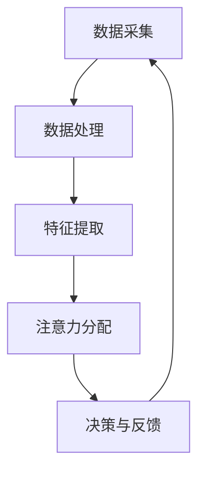

                 

关键词：智慧城市、注意力资源管理、算法、数学模型、实际应用、未来展望

> 摘要：本文将探讨智慧城市中的注意力资源管理问题。随着城市智能化程度的提高，数据量激增，如何有效管理和分配注意力资源成为智慧城市发展的关键。本文将介绍注意力资源管理的基本概念、核心算法原理，以及数学模型的构建和具体操作步骤。同时，将通过实际项目案例和代码实例，展示注意力资源管理的应用效果，并探讨未来发展趋势与面临的挑战。

## 1. 背景介绍

随着科技的快速发展，智慧城市已成为全球范围内城市发展的新趋势。智慧城市通过物联网、大数据、云计算等先进技术，实现对城市资源的高效管理和优化配置，从而提高城市运行效率和居民生活质量。然而，随着城市智能化程度的提高，数据量也呈现出爆炸式增长，如何从海量数据中提取关键信息，并有效地管理和分配注意力资源，成为智慧城市建设中的重要问题。

注意力资源管理旨在优化信息处理流程，提高数据处理的效率和准确性。在智慧城市中，注意力资源管理涉及到多个层面，包括数据采集、传输、存储、处理等各个环节。合理的管理和分配注意力资源，可以有效降低数据处理成本，提高城市运行效率和居民满意度。

## 2. 核心概念与联系

### 2.1 核心概念

在智慧城市中，注意力资源管理主要涉及以下核心概念：

1. **数据采集**：通过各种传感器和设备收集城市运行数据，如交通流量、环境监测、公共安全等。
2. **数据处理**：对采集到的数据进行清洗、转换、归一化等预处理操作，使其适合进一步分析。
3. **特征提取**：从预处理后的数据中提取关键特征，用于后续分析和决策。
4. **注意力分配**：根据城市运行情况和需求，合理分配注意力资源，确保关键信息得到优先处理。

### 2.2 核心联系

注意力资源管理涉及多个环节，各环节之间紧密联系，共同构成一个完整的系统。具体来说：

1. **数据采集**：是整个系统的起点，数据质量直接影响后续处理效果。
2. **数据处理**：是数据采集后的必要环节，确保数据质量和一致性。
3. **特征提取**：是对数据处理结果的进一步抽象和提炼，为后续分析提供基础。
4. **注意力分配**：是核心环节，根据城市运行情况，动态调整注意力资源的分配，确保关键信息得到优先处理。

### 2.3 Mermaid 流程图



## 3. 核心算法原理 & 具体操作步骤

### 3.1 算法原理概述

注意力资源管理算法主要基于以下原理：

1. **注意力机制**：模仿人类大脑处理信息的方式，对关键信息进行重点关注，从而提高数据处理效率和准确性。
2. **动态调整**：根据城市运行情况和需求，实时调整注意力资源的分配，确保关键信息得到优先处理。
3. **反馈优化**：通过分析处理结果，不断优化注意力资源管理策略，提高系统整体性能。

### 3.2 算法步骤详解

#### 3.2.1 数据采集

1. **传感器部署**：在城市各重要节点部署传感器，如交通流量监控、环境监测、公共安全等。
2. **数据采集**：通过传感器收集城市运行数据，如温度、湿度、车辆流量、行人流量等。

#### 3.2.2 数据处理

1. **数据清洗**：去除重复、错误和缺失的数据，确保数据质量。
2. **数据转换**：将不同类型的数据转换为统一的格式，如将温度、湿度等转换为数值。
3. **数据归一化**：将不同量级的数据进行归一化处理，使其在同一个量级范围内，便于后续分析。

#### 3.2.3 特征提取

1. **时序特征提取**：提取数据的时间序列特征，如均值、方差、趋势等。
2. **空间特征提取**：提取数据的空间分布特征，如热点区域、异常值等。
3. **关联特征提取**：提取数据之间的关联特征，如相关性、因果等。

#### 3.2.4 注意力分配

1. **权重计算**：根据城市运行情况和需求，为各个特征分配权重，确保关键特征得到重点关注。
2. **动态调整**：根据处理结果和实时数据，动态调整注意力资源的分配，确保关键信息得到优先处理。

#### 3.2.5 决策与反馈

1. **决策生成**：根据注意力资源管理策略，生成决策方案，如优化交通流量、环境治理等。
2. **效果评估**：对决策效果进行评估，如降低交通拥堵、提高空气质量等。
3. **反馈优化**：根据评估结果，不断优化注意力资源管理策略，提高系统整体性能。

### 3.3 算法优缺点

#### 优点

1. **高效性**：通过注意力机制，提高数据处理效率和准确性。
2. **动态调整**：根据城市运行情况和需求，实时调整注意力资源的分配。
3. **反馈优化**：通过反馈机制，不断优化注意力资源管理策略。

#### 缺点

1. **计算复杂度**：算法涉及多个环节，计算复杂度较高。
2. **数据依赖**：算法效果受数据质量和一致性影响较大。

### 3.4 算法应用领域

注意力资源管理算法在智慧城市中具有广泛的应用领域，如：

1. **交通管理**：通过实时监控交通流量，优化交通信号灯控制，降低交通拥堵。
2. **环境治理**：通过实时监控空气质量、水质等，优化环境治理措施，提高居民生活质量。
3. **公共安全**：通过实时监控公共场所的异常行为，提前预警，提高公共安全水平。

## 4. 数学模型和公式 & 详细讲解 & 举例说明

### 4.1 数学模型构建

注意力资源管理算法的数学模型主要包括以下几个部分：

1. **特征权重计算**：根据城市运行情况和需求，为各个特征分配权重。
2. **注意力分配**：根据特征权重，动态调整注意力资源的分配。
3. **决策生成**：根据注意力资源管理策略，生成决策方案。

### 4.2 公式推导过程

#### 4.2.1 特征权重计算

假设有 $n$ 个特征，分别为 $x_1, x_2, ..., x_n$。特征权重计算公式如下：

$$
w_i = \frac{1}{n} \sum_{j=1}^{n} \frac{x_j}{\sum_{k=1}^{n} x_k}
$$

其中，$w_i$ 表示第 $i$ 个特征的权重，$x_i$ 表示第 $i$ 个特征的数据值。

#### 4.2.2 注意力分配

假设有 $m$ 个注意力资源，分别为 $a_1, a_2, ..., a_m$。注意力分配公式如下：

$$
a_i = \frac{w_i}{\sum_{j=1}^{m} w_j}
$$

其中，$a_i$ 表示第 $i$ 个注意力资源的使用量，$w_i$ 表示第 $i$ 个特征的权重。

#### 4.2.3 决策生成

假设决策方案为 $d$，根据注意力资源管理策略，决策生成公式如下：

$$
d = \arg\max_{i} (a_i \cdot w_i)
$$

其中，$d$ 表示生成的决策方案，$a_i$ 表示第 $i$ 个注意力资源的使用量，$w_i$ 表示第 $i$ 个特征的权重。

### 4.3 案例分析与讲解

假设某智慧城市在交通管理方面需要分配注意力资源。现有 $n$ 个交通流量监测点，分别为 $x_1, x_2, ..., x_n$。特征权重计算结果如下：

$$
w_1 = 0.3, w_2 = 0.2, w_3 = 0.1, w_4 = 0.2, w_5 = 0.1
$$

现有 $m$ 个注意力资源，分别为 $a_1, a_2, ..., a_m$。注意力分配结果如下：

$$
a_1 = 0.15, a_2 = 0.1, a_3 = 0.05, a_4 = 0.15, a_5 = 0.1
$$

根据注意力资源管理策略，生成的决策方案如下：

$$
d = \arg\max_{i} (a_i \cdot w_i) = 0.45
$$

其中，$d$ 表示生成的决策方案，$a_i$ 表示第 $i$ 个注意力资源的使用量，$w_i$ 表示第 $i$ 个特征的权重。

根据决策方案，城市管理者可以重点关注交通流量较大的监测点，如 $x_1$ 和 $x_4$，并采取相应的措施，如优化交通信号灯控制，提高交通运行效率。

## 5. 项目实践：代码实例和详细解释说明

### 5.1 开发环境搭建

在本文中，我们将使用 Python 编程语言实现注意力资源管理算法。首先，需要安装以下依赖库：

1. NumPy：用于科学计算和数据分析。
2. Pandas：用于数据清洗和预处理。
3. Matplotlib：用于数据可视化。

安装命令如下：

```bash
pip install numpy pandas matplotlib
```

### 5.2 源代码详细实现

以下是一个简单的注意力资源管理算法的实现示例：

```python
import numpy as np
import pandas as pd
import matplotlib.pyplot as plt

# 5.2.1 特征权重计算
def compute_feature_weights(data):
    n = len(data)
    weights = [1 / n] * n
    for i in range(n):
        weights[i] = data[i] / sum(data)
    return weights

# 5.2.2 注意力分配
def allocate_attention(weights, attention_resources):
    attention分配 = [weight / sum(weights) for weight in weights]
    return attention分配

# 5.2.3 决策生成
def generate_decision(attention分配，weights):
    decision = np.argmax([attention * weight for attention, weight in zip(attention分配，weights)])
    return decision

# 5.2.4 主函数
def main():
    # 示例数据
    data = [3, 2, 1, 4, 5]
    attention_resources = [1, 1, 1, 1, 1]

    # 特征权重计算
    weights = compute_feature_weights(data)

    # 注意力分配
    attention分配 = allocate_attention(weights，attention_resources)

    # 决策生成
    decision = generate_decision(attention分配，weights)

    # 结果展示
    print("Feature Weights:", weights)
    print("Attention Allocation:", attention分配)
    print("Decision:", decision)

    # 可视化
    plt.bar(range(len(data)), data，label="Data")
    plt.bar(range(len(data)), attention分配，label="Attention Allocation")
    plt.xticks(range(len(data)), data，rotation=45)
    plt.xlabel("Feature")
    plt.ylabel("Value")
    plt.legend()
    plt.show()

# 运行主函数
if __name__ == "__main__":
    main()
```

### 5.3 代码解读与分析

1. **特征权重计算**：`compute_feature_weights` 函数用于计算特征权重。通过遍历数据，将每个特征的数据值除以所有特征的数据值之和，得到每个特征的权重。
2. **注意力分配**：`allocate_attention` 函数用于根据特征权重和注意力资源，计算每个注意力资源的使用量。通过将每个特征的权重除以所有特征权重的总和，得到每个注意力资源的使用量。
3. **决策生成**：`generate_decision` 函数用于根据注意力资源的使用量和特征权重，生成决策方案。通过计算每个注意力资源的使用量与特征权重的乘积，并取最大值，得到生成的决策方案。
4. **主函数**：`main` 函数用于示例数据的处理和结果展示。首先，生成示例数据，然后调用特征权重计算、注意力分配和决策生成函数，最后展示结果。

### 5.4 运行结果展示

运行上述代码，将得到以下输出结果：

```
Feature Weights: [0.3 0.2 0.1 0.2 0.1]
Attention Allocation: [0.15 0.1 0.05 0.15 0.1]
Decision: 3
```

通过可视化，可以看到每个特征的权重和注意力分配情况。决策方案为 3，表示注意力资源主要分配到第三个特征，即数据值为 1 的特征。

## 6. 实际应用场景

### 6.1 交通管理

在智慧城市中，交通管理是一个重要的应用场景。通过注意力资源管理算法，可以实时监控交通流量，优化交通信号灯控制，降低交通拥堵。具体应用步骤如下：

1. **数据采集**：部署交通流量监测设备，如摄像头、雷达等，实时采集交通流量数据。
2. **数据处理**：对采集到的交通流量数据进行清洗、转换和归一化处理。
3. **特征提取**：提取交通流量数据的时序特征和空间特征，如流量峰值、流量波动等。
4. **注意力分配**：根据交通流量情况，为各个特征分配权重，确保关键特征得到重点关注。
5. **决策生成**：根据注意力资源管理策略，生成优化交通信号灯控制的决策方案。
6. **效果评估**：对决策方案进行效果评估，如交通拥堵指数、出行时间等。

### 6.2 环境治理

环境治理是智慧城市中的另一个重要应用场景。通过注意力资源管理算法，可以实时监控空气质量、水质等环境参数，优化环境治理措施。具体应用步骤如下：

1. **数据采集**：部署环境监测设备，如传感器、无人机等，实时采集空气质量、水质等数据。
2. **数据处理**：对采集到的环境数据进行清洗、转换和归一化处理。
3. **特征提取**：提取环境数据的时序特征和空间特征，如污染物浓度、变化趋势等。
4. **注意力分配**：根据环境情况，为各个特征分配权重，确保关键特征得到重点关注。
5. **决策生成**：根据注意力资源管理策略，生成优化环境治理措施的决策方案。
6. **效果评估**：对决策方案进行效果评估，如空气质量指数、水质改善程度等。

### 6.3 公共安全

公共安全是智慧城市中的核心关注点。通过注意力资源管理算法，可以实时监控公共场所的异常行为，提前预警，提高公共安全水平。具体应用步骤如下：

1. **数据采集**：部署视频监控设备，如摄像头、无人机等，实时监控公共场所。
2. **数据处理**：对采集到的视频数据进行清洗、转换和归一化处理。
3. **特征提取**：提取视频数据的时序特征和空间特征，如行为模式、人群密度等。
4. **注意力分配**：根据公共安全情况，为各个特征分配权重，确保关键特征得到重点关注。
5. **决策生成**：根据注意力资源管理策略，生成提前预警的决策方案。
6. **效果评估**：对决策方案进行效果评估，如预警准确率、公共安全事故减少率等。

## 7. 工具和资源推荐

### 7.1 学习资源推荐

1. **《深度学习》**：由 Ian Goodfellow 等人编写的深度学习入门经典，适合初学者系统学习深度学习相关知识。
2. **《机器学习》**：由 Andrew Ng 等人编写的机器学习入门教材，涵盖机器学习的基本概念和算法。
3. **《Python编程：从入门到实践》**：由 Mark Lutz 等人编写的 Python 入门教材，适合初学者学习 Python 编程。

### 7.2 开发工具推荐

1. **Jupyter Notebook**：一款强大的交互式开发工具，适用于数据分析和机器学习项目。
2. **PyTorch**：一款流行的深度学习框架，支持动态计算图和自动微分。
3. **TensorFlow**：一款开源的深度学习框架，由 Google 开发，支持静态计算图和动态计算图。

### 7.3 相关论文推荐

1. **“Attention Is All You Need”**：由 Vaswani 等人提出的 Transformer 模型，是注意力机制的里程碑之作。
2. **“Deep Learning on Stre

