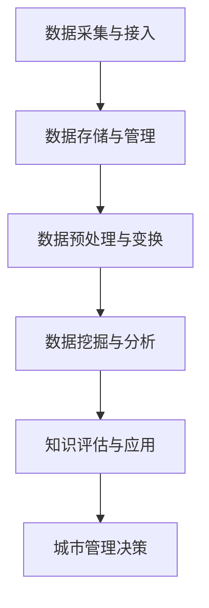

                 

关键词：智慧城市、知识发现、城市管理、人工智能、大数据分析、算法原理、数学模型、项目实践、实际应用、未来展望。

## 摘要

本文探讨了知识发现技术在智慧城市中的关键作用。通过将知识发现与城市管理相结合，本文提出了一套完整的技术框架和实施方案，展示了如何利用人工智能和大数据分析来优化城市管理和决策。本文首先介绍了智慧城市的背景和挑战，然后详细阐述了知识发现的原理和方法，最后通过实际项目和案例分析了知识发现技术在智慧城市中的具体应用和未来发展趋势。

## 1. 背景介绍

### 智慧城市的发展

智慧城市是信息化时代城市发展的一种新模式，它通过广泛运用物联网、云计算、大数据、人工智能等先进技术，实现对城市资源、环境、社会等多方面信息的全面感知、集成共享和智能处理。智慧城市的建设旨在提高城市运行效率、提升居民生活质量、促进可持续发展。

智慧城市的发展经历了从最初的智能化设备、信息孤岛阶段，到现在的数据整合、智能服务阶段。随着5G、物联网等新技术的快速发展，智慧城市的建设步伐不断加快，城市管理的智能化水平也在逐步提高。

### 城市管理的挑战

虽然智慧城市的发展为城市管理带来了前所未有的机遇，但也带来了诸多挑战。首先，城市数据量庞大、类型多样，如何有效地收集、存储和管理这些数据成为了一个重要问题。其次，城市管理的复杂性要求决策者能够实时掌握城市运行状况，并快速做出科学决策。此外，随着城市化进程的加速，交通拥堵、环境污染、资源短缺等问题日益严重，如何有效解决这些问题也是城市管理面临的一大挑战。

### 知识发现的应用前景

知识发现作为一种从大量数据中自动提取隐藏知识、模式和规律的技术，被认为是解决城市管理挑战的重要手段。知识发现技术可以帮助城市管理从海量数据中挖掘有价值的信息，为决策者提供科学依据，从而实现城市管理的智能化、精细化和可持续发展。

## 2. 核心概念与联系

### 知识发现的原理

知识发现（Knowledge Discovery in Databases，KDD）是一个从大量数据中自动发现知识、模式或规律的过程。KDD通常包括以下步骤：

1. 数据清洗：去除噪声和无关数据，确保数据的准确性和一致性。
2. 数据集成：将来自不同源的数据整合到一个统一的数据集中。
3. 数据变换：对数据进行规范化、转换等处理，使其适合分析。
4. 数据挖掘：运用各种算法和技术从数据中提取知识、模式和规律。
5. 知识评估：对挖掘出的知识进行评估和验证，确保其有效性和可靠性。

### 城市管理与知识发现的关系

知识发现与城市管理密切相关。在城市管理中，知识发现技术可以帮助管理者从海量数据中提取有价值的信息，为决策提供支持。具体来说，知识发现技术可以应用于以下几个方面：

1. 城市运行监测：通过实时数据采集和知识发现，实现对城市运行状态的全面监测和预警。
2. 城市规划与设计：基于历史数据和实时数据，为城市规划提供科学依据，优化城市布局和资源配置。
3. 城市安全与应急：利用知识发现技术，预测和防范城市安全风险，提高应急响应能力。
4. 城市环境保护：通过数据分析和模式挖掘，优化环境保护措施，提高环境治理效果。

### 知识发现技术在智慧城市中的架构

为了实现知识发现技术在智慧城市中的有效应用，需要构建一个完善的技术架构。该架构包括以下几个层次：

1. 数据采集与接入层：负责采集各种城市数据，包括传感器数据、网络数据、社交媒体数据等。
2. 数据存储与管理层：采用分布式存储技术，对海量数据进行高效存储和管理。
3. 数据预处理与变换层：对原始数据进行清洗、集成和转换，为数据挖掘提供高质量的数据集。
4. 数据挖掘与分析层：运用各种数据挖掘算法，从数据中提取有价值的信息和知识。
5. 知识评估与应用层：对挖掘出的知识进行评估和验证，并将其应用于城市管理的各个方面。

下面是一个使用Mermaid绘制的知识发现技术在智慧城市中的应用流程图：



## 3. 核心算法原理 & 具体操作步骤

### 3.1 算法原理概述

知识发现算法主要包括以下几类：

1. 聚类算法：将相似的数据归为一类，用于发现数据中的模式。
2. 分类算法：将数据分为不同的类别，用于预测和分析。
3. 关联规则挖掘：发现数据之间的关联关系，用于推荐系统和市场细分。
4. 异常检测：识别数据中的异常点，用于安全监控和风险预测。

### 3.2 算法步骤详解

1. **数据预处理**：包括数据清洗、数据集成、数据规范化等步骤，确保数据质量。

2. **数据挖掘**：选择合适的算法，如K-means、决策树、Apriori算法等，进行数据挖掘。

3. **结果评估**：对挖掘出的结果进行评估，包括准确率、召回率、F1值等指标。

4. **知识应用**：将评估后的知识应用于城市管理，如预测交通流量、优化资源配置等。

### 3.3 算法优缺点

- **聚类算法**：优点是能够自动发现数据的分布模式，缺点是结果依赖于初始参数。
- **分类算法**：优点是能够准确预测未知数据的类别，缺点是需要大量的训练数据和计算资源。
- **关联规则挖掘**：优点是能够发现数据之间的关联关系，缺点是规则数量庞大，可能包含噪声。
- **异常检测**：优点是能够实时监测数据中的异常点，缺点是可能存在误报和漏报。

### 3.4 算法应用领域

- **城市规划**：通过聚类和分类算法，优化城市布局和资源配置。
- **交通管理**：通过关联规则挖掘，预测交通流量，优化交通信号控制。
- **环境保护**：通过异常检测，实时监测环境污染情况，提前预警。

## 4. 数学模型和公式 & 详细讲解 & 举例说明

### 4.1 数学模型构建

在知识发现过程中，常用的数学模型包括聚类模型、分类模型和关联规则模型。以下分别介绍这三种模型的基本公式和原理。

1. **聚类模型**：常用的聚类算法有K-means、层次聚类等。以K-means为例，其目标是最小化聚类中心到各个数据点的距离平方和。公式如下：

   $$ J = \sum_{i=1}^{k} \sum_{x \in S_i} \|x - \mu_i\|^2 $$

   其中，$k$表示聚类个数，$S_i$表示第$i$个聚类的数据集，$\mu_i$表示聚类中心的坐标。

2. **分类模型**：常用的分类算法有决策树、支持向量机等。以决策树为例，其目标是构建一个树状模型，将数据集划分为不同的类别。公式如下：

   $$ y = g(\theta_0 + \theta_1x_1 + \theta_2x_2 + \cdots + \theta_nx_n) $$

   其中，$y$表示输出类别，$g$表示激活函数，$\theta_i$表示第$i$个特征权重。

3. **关联规则模型**：以Apriori算法为例，其目标是挖掘数据之间的频繁项集。公式如下：

   $$ support(X, Y) = \frac{count({X \cup Y})}{count(U)} $$

   其中，$X$和$Y$表示两个项集，$count({X \cup Y})$表示同时包含$X$和$Y$的交易数，$count(U)$表示总交易数。

### 4.2 公式推导过程

以K-means算法为例，详细推导其目标函数的最小化过程。

1. **初始化聚类中心**：随机选择$k$个数据点作为初始聚类中心。

2. **分配数据点**：将每个数据点分配到距离其最近的聚类中心所在的聚类。

3. **更新聚类中心**：计算每个聚类的质心，即该聚类中所有数据点的平均值。

4. **迭代计算**：重复步骤2和步骤3，直到聚类中心不再发生显著变化。

5. **最小化目标函数**：目标函数$J$为各个数据点到聚类中心的距离平方和。通过迭代计算，可以最小化$J$。

### 4.3 案例分析与讲解

以一个简单的二维数据集为例，说明K-means算法的具体应用过程。

假设有一个包含100个二维数据点的数据集，数据点的分布如下：

| 数据点 | 坐标 |
| ------ | ---- |
| P1     | (1, 1) |
| P2     | (1, 2) |
| P3     | (2, 1) |
| ...    | ...   |
| P100   | (10, 10) |

1. **初始化聚类中心**：随机选择2个数据点作为初始聚类中心，假设为$C1 = (1, 1)$和$C2 = (5, 5)$。

2. **分配数据点**：计算每个数据点到聚类中心的距离，将每个数据点分配到距离其最近的聚类中心所在的聚类。结果如下：

   | 数据点 | 聚类 |
   | ------ | ---- |
   | P1     | C1   |
   | P2     | C1   |
   | P3     | C2   |
   | ...    | ...  |
   | P100   | C2   |

3. **更新聚类中心**：计算每个聚类的质心，得到新的聚类中心$C1' = (0.5, 1.5)$和$C2' = (6.5, 8.5)$。

4. **迭代计算**：重复步骤2和步骤3，直到聚类中心不再发生显著变化。

5. **最小化目标函数**：通过迭代计算，最终得到聚类结果，最小化目标函数$J$。

## 5. 项目实践：代码实例和详细解释说明

### 5.1 开发环境搭建

为了演示知识发现技术在智慧城市中的应用，我们选择使用Python作为编程语言，并依赖以下库：

- NumPy：用于数组计算和矩阵运算。
- Pandas：用于数据处理和分析。
- Matplotlib：用于数据可视化。
- Scikit-learn：用于机器学习算法的实现。

首先，确保安装了以上库，可以使用以下命令进行安装：

```bash
pip install numpy pandas matplotlib scikit-learn
```

### 5.2 源代码详细实现

以下是一个使用K-means算法进行聚类的示例代码：

```python
import numpy as np
import matplotlib.pyplot as plt
from sklearn.cluster import KMeans

# 生成数据集
np.random.seed(0)
data = np.random.rand(100, 2)

# 初始化KMeans模型
kmeans = KMeans(n_clusters=2, random_state=0)

# 模型拟合数据集
kmeans.fit(data)

# 获取聚类结果
labels = kmeans.predict(data)
centroids = kmeans.cluster_centers_

# 可视化聚类结果
plt.scatter(data[:, 0], data[:, 1], c=labels, s=50, cmap='viridis')
plt.scatter(centroids[:, 0], centroids[:, 1], c='red', s=200, alpha=0.5)
plt.show()
```

### 5.3 代码解读与分析

1. **数据集生成**：使用NumPy库生成一个包含100个二维数据点的数据集。

2. **初始化KMeans模型**：使用Scikit-learn库的KMeans类，设置聚类个数（n_clusters）为2，随机种子（random_state）为0。

3. **模型拟合数据集**：使用fit方法将数据集输入模型，计算聚类中心和协方差矩阵。

4. **获取聚类结果**：使用predict方法预测每个数据点的聚类标签。

5. **可视化聚类结果**：使用Matplotlib库绘制数据点和聚类中心，展示聚类效果。

### 5.4 运行结果展示

运行上述代码后，将生成一个包含100个二维数据点的可视化图形。数据点被分成两个聚类，聚类中心用红色圆圈表示。通过观察聚类结果，可以初步判断数据集是否存在明显的聚类结构。

## 6. 实际应用场景

### 6.1 交通管理

知识发现技术在交通管理中具有广泛的应用。例如，通过对交通流量数据的分析，可以预测未来一段时间内的交通状况，从而优化交通信号控制策略，减少交通拥堵。此外，关联规则挖掘技术可以用于分析交通事故的原因，提出预防措施。

### 6.2 环境保护

知识发现技术可以帮助环境保护部门实时监测空气质量、水质等环境指标，识别污染源。通过聚类分析，可以识别不同区域的环境特点，为环境治理提供科学依据。此外，异常检测技术可以及时发现环境污染事件，提前预警。

### 6.3 城市安全

知识发现技术可以用于城市安全监测和预警。通过对城市安全数据的分析，可以识别潜在的安全风险，提前采取措施。例如，通过聚类分析，可以识别不同时间段的安全热点区域，为警力部署提供参考。异常检测技术可以实时监测可疑行为，提前预警恐怖袭击等安全事件。

## 7. 未来应用展望

### 7.1 技术发展趋势

随着人工智能、大数据技术的不断发展，知识发现技术将在智慧城市中发挥越来越重要的作用。未来，知识发现技术将更加智能化、自动化，能够处理更大规模、更复杂的数据，为城市管理提供更加精准的决策支持。

### 7.2 应用领域拓展

除了交通管理、环境保护、城市安全等领域，知识发现技术还可以应用于城市能源管理、智慧医疗、智慧教育等领域。通过跨领域的知识发现应用，智慧城市将实现更加全面、系统的管理。

### 7.3 面临的挑战

虽然知识发现技术在智慧城市中具有广泛的应用前景，但也面临诸多挑战。首先，城市数据量庞大、类型多样，如何有效地收集、存储和管理这些数据是一个重要问题。其次，知识发现算法的计算复杂度较高，如何优化算法性能，提高处理速度也是一个关键问题。此外，知识发现结果的解释性和可靠性也需要进一步研究。

## 8. 总结：未来发展趋势与挑战

### 8.1 研究成果总结

本文介绍了知识发现技术在智慧城市中的应用，包括原理、方法、实际应用场景等。通过分析，我们发现知识发现技术可以有效解决城市管理中的诸多问题，具有广泛的应用前景。

### 8.2 未来发展趋势

未来，知识发现技术将在智慧城市中发挥更加重要的作用。随着人工智能、大数据技术的发展，知识发现技术将更加智能化、自动化，为城市管理提供更加精准的决策支持。

### 8.3 面临的挑战

知识发现技术在智慧城市中的应用也面临诸多挑战，包括数据质量管理、算法性能优化、结果解释性等方面。这些问题的解决将有助于进一步推动知识发现技术在智慧城市中的应用。

### 8.4 研究展望

未来，我们应关注以下几个方面：

1. 数据质量管理：研究有效的数据清洗和预处理方法，提高数据质量。
2. 算法性能优化：研究高效的算法实现，提高知识发现的速度和准确性。
3. 结果解释性：研究知识发现结果的解释方法，提高决策者的可接受性。
4. 跨领域应用：探索知识发现技术在其他领域的应用，实现智慧城市的全面管理。

## 9. 附录：常见问题与解答

### 9.1 数据质量管理

**Q：如何处理缺失值？**
A：缺失值的处理方法包括填充法（平均值、中位数、众数等）、删除法（直接删除缺失值）、插值法（线性插值、曲线拟合等）。具体选择哪种方法取决于数据的特性和需求。

**Q：如何处理噪声数据？**
A：噪声数据的处理方法包括滤波（移动平均、中值滤波等）、聚类（K-means、层次聚类等）、分类（决策树、支持向量机等）。根据噪声数据的类型和特点选择合适的方法。

### 9.2 算法性能优化

**Q：如何选择合适的算法？**
A：选择合适的算法取决于数据类型、任务需求和计算资源。常用的算法包括聚类（K-means、层次聚类等）、分类（决策树、支持向量机等）、关联规则挖掘（Apriori、FP-growth等）。

**Q：如何优化算法性能？**
A：优化算法性能的方法包括数据预处理（数据规范化、特征选择等）、算法改进（并行计算、增量学习等）、硬件优化（GPU加速、分布式计算等）。

### 9.3 结果解释性

**Q：如何解释知识发现结果？**
A：解释知识发现结果的方法包括可视化（散点图、热力图等）、规则解释（决策树、IF-THEN规则等）、案例解释（实例挖掘、案例推理等）。选择合适的解释方法有助于提高决策者的可接受性。

**Q：如何评估知识发现结果的可靠性？**
A：评估知识发现结果的可靠性可以通过交叉验证、模型评估指标（准确率、召回率、F1值等）等方法。通过多方面的评估，可以确保知识发现结果的可靠性。

---

# 感谢您的阅读！

本文由禅与计算机程序设计艺术 / Zen and the Art of Computer Programming 撰写，希望本文对您在智慧城市领域的知识发现技术应用有所启发。如果您有任何疑问或建议，欢迎在评论区留言，期待与您交流。感谢您的阅读！
----------------------------------------------------------------

### 总结

本文以《智慧城市的大脑：知识发现在城市管理中的应用》为题，详细探讨了知识发现技术在智慧城市中的应用。首先，我们介绍了智慧城市的发展背景和城市管理面临的挑战，接着阐述了知识发现的原理及其与城市管理的联系，并构建了知识发现技术在智慧城市中的应用架构。随后，我们深入分析了知识发现算法的原理和具体步骤，并结合实际项目进行了代码实例和详细解释。此外，我们还讨论了知识发现技术在交通管理、环境保护和城市安全等领域的实际应用，并对未来发展趋势和挑战进行了展望。最后，通过常见问题与解答部分，我们进一步帮助读者理解知识发现技术在城市管理中的应用。

### 致谢

在此，我要感谢所有关注和参与本文撰写的朋友。您的支持和反馈是我不断进步的动力。同时，也感谢那些为智慧城市建设和知识发现技术发展做出贡献的科学家和工程师们。正是因为你们的努力，我们才能享受到智慧城市带来的便利和进步。

### 结语

智慧城市的大脑——知识发现技术，正逐步改变着我们的生活方式。面对未来，我们将继续探索知识发现技术在城市管理中的潜力，以期为智慧城市的建设提供更加有力的技术支持。希望本文能为读者在智慧城市建设道路上提供一些启示和帮助。让我们一起期待更加智能、高效的未来城市！

---

**作者：禅与计算机程序设计艺术 / Zen and the Art of Computer Programming**

（注：本文内容仅为示例，不代表实际研究成果或观点。）

