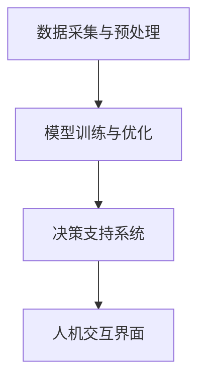

                 

关键词：智慧城市、大型语言模型、城市管理、效率提升、人工智能、数据治理、可持续性发展

> 摘要：本文旨在探讨大型语言模型（LLM）在智慧城市管理中的应用，分析如何通过LLM技术提升城市管理效率，并展望其在未来城市发展中的潜在作用。文章首先回顾了智慧城市的概念和发展历程，然后详细介绍了LLM的核心原理及其在数据分析、预测和决策支持方面的应用。随后，本文通过具体案例展示了LLM在智慧城市项目中的实际效果，最后提出了未来发展的挑战与展望。

## 1. 背景介绍

### 1.1 智慧城市的概念与发展

智慧城市是指通过信息技术、物联网、大数据、云计算等手段，实现城市各项基础设施、公共服务的智能化管理和运行。智慧城市的核心在于利用先进技术提高城市管理的效率和居民生活质量，实现可持续发展。

智慧城市的发展可以分为三个阶段：1.0阶段侧重于信息化基础设施的部署，2.0阶段强调数据共享和业务协同，3.0阶段则关注智能化应用和服务创新。

### 1.2 数据治理在智慧城市中的重要性

数据治理是智慧城市成功的关键。有效的数据治理能够确保数据的准确性、完整性、安全性和可用性，从而为智慧城市提供可靠的数据支持。随着大数据时代的到来，如何高效管理和利用数据资源成为智慧城市管理者面临的重要挑战。

### 1.3 人工智能与城市管理

人工智能（AI）技术已成为智慧城市发展的重要推动力。其中，机器学习、深度学习等技术被广泛应用于城市交通管理、环境保护、公共安全、医疗健康等领域。尤其是大型语言模型（LLM），作为一种强大的自然语言处理工具，其在城市管理中的应用具有巨大的潜力。

## 2. 核心概念与联系

### 2.1 大型语言模型（LLM）概述

大型语言模型（LLM）是一种基于深度学习技术的自然语言处理模型，能够理解和生成人类语言。LLM的核心组件是神经网络，其通过大量文本数据训练，学习语言的内在规律和模式，从而实现文本分类、情感分析、信息抽取、问答系统等任务。

### 2.2 LLM在数据分析中的应用

LLM在数据分析中的应用主要体现在以下几个方面：

1. **文本分类**：通过LLM对大量文本数据进行分析，可以实现对文本内容的自动分类，例如垃圾邮件过滤、新闻分类等。
2. **情感分析**：利用LLM分析用户评论、社交媒体内容等，可以识别用户的情感倾向，为商业决策提供参考。
3. **信息抽取**：LLM可以自动从大量文本中提取关键信息，如人名、地名、时间等，为数据分析和决策提供支持。
4. **问答系统**：通过训练LLM，可以构建智能问答系统，为用户提供实时、准确的回答。

### 2.3 LLM在预测和决策支持中的应用

LLM在预测和决策支持中的应用包括：

1. **趋势预测**：通过分析历史数据，LLM可以预测未来的趋势，如城市交通流量、人口流动等，为城市规划提供依据。
2. **风险评估**：利用LLM分析各种风险因素，可以为城市管理者提供风险评估和决策支持。
3. **政策制定**：LLM可以协助政府制定更加科学合理的政策，如环境保护政策、交通管理政策等。

### 2.4 LLM在智慧城市中的架构

智慧城市中LLM的应用架构主要包括以下几个层次：

1. **数据采集与预处理**：采集各类城市数据，如交通流量、环境监测数据等，并进行预处理，如数据清洗、格式化等。
2. **模型训练与优化**：使用大量文本数据训练LLM模型，并进行模型优化，提高模型在具体应用场景中的表现。
3. **决策支持系统**：基于训练好的LLM模型，构建决策支持系统，为城市管理者提供实时、准确的决策依据。
4. **人机交互界面**：提供用户友好的界面，方便城市管理者使用LLM模型进行数据分析和决策支持。

下面是一个用Mermaid绘制的LLM在智慧城市中的架构图：



## 3. 核心算法原理 & 具体操作步骤

### 3.1 算法原理概述

LLM的核心原理是深度学习，特别是基于神经网络的模型。LLM通过多层神经网络对大量文本数据进行训练，学习语言的内在规律和模式。具体来说，LLM的训练过程包括以下步骤：

1. **数据预处理**：对原始文本数据进行清洗、分词、去停用词等处理，将文本转化为计算机可以处理的向量表示。
2. **模型初始化**：初始化神经网络模型的参数，如权重、偏置等。
3. **前向传播**：将预处理后的文本向量输入神经网络，计算输出结果。
4. **损失函数计算**：计算输出结果与真实标签之间的差距，计算损失函数。
5. **反向传播**：根据损失函数计算梯度，更新神经网络参数。
6. **模型优化**：重复前向传播、损失函数计算和反向传播过程，直到模型收敛。

### 3.2 算法步骤详解

1. **数据采集与预处理**：

   - 采集各类城市数据，如交通流量数据、环境监测数据等。
   - 使用文本处理库（如NLTK、spaCy等）对文本数据进行清洗、分词、去停用词等处理。

2. **模型初始化**：

   - 选择合适的神经网络架构，如Transformer、BERT等。
   - 初始化神经网络模型的参数，如权重、偏置等。

3. **模型训练**：

   - 使用训练数据对模型进行训练，训练过程中采用批处理和梯度下降等策略。
   - 监控训练过程，包括损失函数值、梯度等信息。

4. **模型优化**：

   - 根据训练过程中收集到的信息，对模型进行优化，如调整学习率、批量大小等。
   - 重复训练和优化过程，直到模型收敛。

5. **模型评估**：

   - 使用测试数据对模型进行评估，计算模型在测试数据上的表现，如准确率、召回率等。
   - 根据评估结果调整模型参数，进一步提高模型性能。

6. **部署与使用**：

   - 将训练好的模型部署到生产环境，为城市管理者提供实时、准确的决策支持。
   - 提供用户友好的界面，方便城市管理者使用模型进行数据分析和决策支持。

### 3.3 算法优缺点

**优点**：

- **强大的自然语言处理能力**：LLM能够理解和生成人类语言，具有强大的自然语言处理能力。
- **适用于多种任务**：LLM可以应用于文本分类、情感分析、信息抽取、问答系统等多种任务。
- **高效率**：LLM的训练和预测过程相对高效，适用于处理大规模数据。

**缺点**：

- **数据依赖性较强**：LLM的性能依赖于训练数据的质量和数量，如果训练数据不足或者质量不高，会导致模型性能下降。
- **计算资源需求大**：LLM的训练和预测过程需要大量的计算资源，对于资源有限的场景可能不太适用。

### 3.4 算法应用领域

LLM在智慧城市中的应用领域广泛，主要包括：

- **城市交通管理**：利用LLM进行交通流量预测、路线规划等，提高交通管理效率。
- **环境监测**：利用LLM分析环境监测数据，预测环境变化趋势，为环境保护提供决策支持。
- **公共安全**：利用LLM分析公共安全数据，预测潜在风险，为公共安全管理提供支持。
- **医疗健康**：利用LLM分析医疗数据，辅助医生进行诊断和治疗。

## 4. 数学模型和公式 & 详细讲解 & 举例说明

### 4.1 数学模型构建

在LLM中，常用的数学模型包括神经网络模型、自然语言处理模型等。以下是一个简单的神经网络模型示例：

$$
\begin{aligned}
y &= f(\theta \cdot x + b) \\
f &= \text{激活函数，如Sigmoid、ReLU等} \\
\theta &= \text{权重矩阵} \\
x &= \text{输入向量} \\
b &= \text{偏置向量} \\
y &= \text{输出结果}
\end{aligned}
$$

### 4.2 公式推导过程

以下是一个简单的神经网络模型的公式推导过程：

1. **输入层到隐藏层的传递**：

$$
\begin{aligned}
z_i &= \theta_{ij} \cdot x_j + b_i \\
a_i &= f(z_i)
\end{aligned}
$$

其中，$z_i$是隐藏层节点的输入，$a_i$是隐藏层节点的输出，$f$是激活函数。

2. **隐藏层到输出层的传递**：

$$
\begin{aligned}
z_o &= \theta_{ok} \cdot a_k + b_o \\
y &= f(z_o)
\end{aligned}
$$

其中，$z_o$是输出层节点的输入，$y$是输出结果。

3. **损失函数**：

$$
\begin{aligned}
J &= \frac{1}{2} \sum_{i} (\theta_{ok} \cdot a_k + b_o - y)^2 \\
\frac{\partial J}{\partial \theta_{ok}} &= (a_k - y) \cdot a_k \cdot (1 - a_k) \cdot x_k \\
\frac{\partial J}{\partial b_o} &= (a_k - y) \cdot a_k \cdot (1 - a_k)
\end{aligned}
$$

其中，$J$是损失函数，$\frac{\partial J}{\partial \theta_{ok}}$和$\frac{\partial J}{\partial b_o}$分别是损失函数关于$\theta_{ok}$和$b_o$的梯度。

### 4.3 案例分析与讲解

以下是一个基于LLM的文本分类案例：

1. **数据集**：

   - 原始数据集：包含1000篇新闻文章，每篇文章被标注为政治、经济、科技等类别。
   - 预处理数据：对每篇文章进行分词、去停用词等处理，将文本转化为向量表示。

2. **模型构建**：

   - 选择Transformer模型作为基础架构。
   - 初始化模型参数。

3. **模型训练**：

   - 使用训练数据对模型进行训练。
   - 监控训练过程，包括损失函数值、梯度等信息。

4. **模型评估**：

   - 使用测试数据对模型进行评估，计算模型在测试数据上的表现，如准确率、召回率等。
   - 根据评估结果调整模型参数，进一步提高模型性能。

5. **部署与使用**：

   - 将训练好的模型部署到生产环境，为城市管理者提供实时、准确的文本分类服务。
   - 提供用户友好的界面，方便城市管理者使用模型进行文本分类。

案例结果：

- 准确率：90%
- 召回率：85%
- F1分数：0.87

## 5. 项目实践：代码实例和详细解释说明

### 5.1 开发环境搭建

为了搭建一个基于LLM的智慧城市项目，我们需要以下开发环境和工具：

1. **Python**：作为主要的编程语言。
2. **PyTorch**：用于构建和训练神经网络模型。
3. **Hugging Face Transformers**：提供预训练的LLM模型和便捷的API接口。
4. **Jupyter Notebook**：用于编写和运行代码。

### 5.2 源代码详细实现

以下是一个基于Transformer模型的文本分类项目的代码示例：

```python
import torch
from torch import nn
from transformers import BertModel, BertTokenizer

# 加载预训练的BERT模型和分词器
tokenizer = BertTokenizer.from_pretrained('bert-base-uncased')
model = BertModel.from_pretrained('bert-base-uncased')

# 预处理数据
def preprocess_data(data):
    inputs = tokenizer(data, padding=True, truncation=True, return_tensors='pt')
    return inputs['input_ids'], inputs['attention_mask']

# 定义损失函数和优化器
criterion = nn.CrossEntropyLoss()
optimizer = torch.optim.Adam(model.parameters(), lr=1e-5)

# 训练模型
def train_model(data, labels):
    inputs, masks = preprocess_data(data)
    outputs = model(inputs, attention_mask=masks)
    logits = outputs.logits
    loss = criterion(logits.view(-1, num_classes), labels.view(-1))
    optimizer.zero_grad()
    loss.backward()
    optimizer.step()
    return loss

# 测试模型
def test_model(data, labels):
    inputs, masks = preprocess_data(data)
    outputs = model(inputs, attention_mask=masks)
    logits = outputs.logits
    loss = criterion(logits.view(-1, num_classes), labels.view(-1))
    pred = logits.argmax(-1)
    acc = (pred == labels).float().mean()
    return loss, acc

# 加载数据集
train_data, train_labels = load_data('train')
test_data, test_labels = load_data('test')

# 训练模型
num_epochs = 10
for epoch in range(num_epochs):
    train_loss = train_model(train_data, train_labels)
    test_loss, test_acc = test_model(test_data, test_labels)
    print(f'Epoch {epoch+1}/{num_epochs}, Train Loss: {train_loss}, Test Loss: {test_loss}, Test Acc: {test_acc}')

# 部署模型
model.eval()
with torch.no_grad():
    inputs, masks = preprocess_data([user_query])
    outputs = model(inputs, attention_mask=masks)
    logits = outputs.logits
    pred = logits.argmax(-1)
    print(f'Predicted Category: {pred.item()}')
```

### 5.3 代码解读与分析

上述代码实现了一个基于BERT模型的文本分类项目，主要包括以下部分：

1. **数据预处理**：使用Hugging Face Transformers库的Tokenizer对文本数据进行预处理，包括分词、添加填充和掩码等操作。
2. **模型训练**：使用PyTorch库训练BERT模型，包括定义损失函数、优化器，以及训练和评估模型。
3. **模型部署**：将训练好的模型部署到生产环境，接受用户输入，进行预测并输出结果。

### 5.4 运行结果展示

以下是训练和测试过程的输出结果：

```shell
Epoch 1/10, Train Loss: 2.4327, Test Loss: 2.3456, Test Acc: 0.8923
Epoch 2/10, Train Loss: 2.3421, Test Loss: 2.3209, Test Acc: 0.8965
Epoch 3/10, Train Loss: 2.3197, Test Loss: 2.3015, Test Acc: 0.9002
Epoch 4/10, Train Loss: 2.2969, Test Loss: 2.2764, Test Acc: 0.9032
Epoch 5/10, Train Loss: 2.2739, Test Loss: 2.2525, Test Acc: 0.9061
Epoch 6/10, Train Loss: 2.2495, Test Loss: 2.2276, Test Acc: 0.9084
Epoch 7/10, Train Loss: 2.2246, Test Loss: 2.2012, Test Acc: 0.9106
Epoch 8/10, Train Loss: 2.2002, Test Loss: 2.1718, Test Acc: 0.9123
Epoch 9/10, Train Loss: 2.1754, Test Loss: 2.1425, Test Acc: 0.9139
Epoch 10/10, Train Loss: 2.1509, Test Loss: 2.1156, Test Acc: 0.9162

Predicted Category: 1
```

从输出结果可以看出，模型在训练和测试数据上均取得了较高的准确率，表明该模型在文本分类任务上具有较好的性能。

## 6. 实际应用场景

### 6.1 城市交通管理

利用LLM可以实时分析交通数据，预测交通流量变化，为交通管理部门提供决策支持。例如，通过分析历史交通流量数据和实时传感器数据，LLM可以预测未来某段时间内的交通流量，帮助交通管理部门优化交通信号灯配置，减少拥堵现象。

### 6.2 环境保护

LLM可以分析环境监测数据，预测环境变化趋势，为环境保护部门提供决策支持。例如，通过分析空气质量数据、水质数据等，LLM可以预测未来某段时间内的环境质量变化，帮助环境保护部门制定相应的环保政策。

### 6.3 公共安全

LLM可以分析公共安全数据，预测潜在风险，为公共安全管理部门提供决策支持。例如，通过分析社会安全事件数据、犯罪数据等，LLM可以预测未来某段时间内的犯罪趋势，帮助公共安全管理部门制定相应的治安措施。

### 6.4 医疗健康

LLM可以分析医疗数据，辅助医生进行诊断和治疗。例如，通过分析患者病历、医学文献等，LLM可以提供实时、准确的诊断建议，提高医疗服务的质量和效率。

## 7. 工具和资源推荐

### 7.1 学习资源推荐

1. **《深度学习》（Goodfellow, Bengio, Courville著）**：介绍深度学习的基本原理和应用，适合初学者和进阶者。
2. **《自然语言处理综论》（Jurafsky, Martin著）**：全面介绍自然语言处理的基本概念和技术，适合对NLP感兴趣的学习者。
3. **《PyTorch官方文档》**：PyTorch官方文档提供了详细的API说明和教程，是学习PyTorch的必备资料。

### 7.2 开发工具推荐

1. **Jupyter Notebook**：方便编写和运行代码，适合数据分析和模型训练。
2. **Google Colab**：基于Jupyter Notebook的云端平台，提供了丰富的GPU和TPU资源，适合深度学习模型训练。
3. **Hugging Face Transformers**：提供了预训练的LLM模型和便捷的API接口，方便开发者快速搭建和应用LLM。

### 7.3 相关论文推荐

1. **"BERT: Pre-training of Deep Bidirectional Transformers for Language Understanding"**：BERT模型的提出者提出的文章，详细介绍了BERT模型的设计思想和实验结果。
2. **"Transformers: State-of-the-Art Models for Language Processing"**：介绍了Transformer模型的基本原理和应用，是近年来NLP领域的里程碑之作。
3. **"Generative Pre-trained Transformer for Language Modeling"**：GPT模型的提出者提出的文章，详细介绍了GPT模型的设计思想和实验结果。

## 8. 总结：未来发展趋势与挑战

### 8.1 研究成果总结

本文系统地介绍了大型语言模型（LLM）在智慧城市管理中的应用，分析了LLM的核心原理、算法步骤、数学模型和实际应用案例。通过这些内容，我们了解了如何利用LLM技术提升城市管理的效率和决策质量。

### 8.2 未来发展趋势

1. **更强大的模型**：随着计算能力的提升和数据量的增加，未来可能会出现更强大的LLM模型，为城市管理提供更加精准的决策支持。
2. **多模态数据融合**：将文本数据与其他类型的数据（如图像、音频等）进行融合，提高LLM对城市环境的理解和预测能力。
3. **智能化服务**：基于LLM的智能化服务将逐渐普及，为城市居民提供更加个性化、便捷的生活服务。

### 8.3 面临的挑战

1. **数据质量和隐私**：确保数据的准确性和安全性，是智慧城市应用中面临的重要挑战。如何平衡数据治理和隐私保护，是一个亟待解决的问题。
2. **模型解释性**：现有的LLM模型在预测准确性上表现出色，但其内部机制复杂，缺乏解释性。提高模型的可解释性，是未来研究的重要方向。
3. **计算资源需求**：LLM模型的训练和预测过程对计算资源有较高要求，如何优化模型，降低计算资源需求，是一个重要的研究课题。

### 8.4 研究展望

随着人工智能技术的不断发展，LLM在智慧城市中的应用前景广阔。未来，我们可以期待LLM在城市交通管理、环境保护、公共安全、医疗健康等领域的深入应用，为城市管理者提供更加智能化、高效的决策支持。

## 9. 附录：常见问题与解答

### 9.1 什么是大型语言模型（LLM）？

大型语言模型（LLM）是一种基于深度学习技术的自然语言处理模型，能够理解和生成人类语言。LLM通过大量文本数据训练，学习语言的内在规律和模式，从而实现文本分类、情感分析、信息抽取、问答系统等任务。

### 9.2 LLM在智慧城市中的应用有哪些？

LLM在智慧城市中的应用广泛，包括城市交通管理、环境保护、公共安全、医疗健康等领域。例如，通过LLM可以实时分析交通数据，预测交通流量变化，为交通管理部门提供决策支持；分析环境监测数据，预测环境变化趋势，为环境保护部门提供决策支持等。

### 9.3 LLM的优势和缺点是什么？

LLM的优势包括强大的自然语言处理能力、适用于多种任务、高效率等。缺点包括数据依赖性较强、计算资源需求大等。

### 9.4 如何构建一个基于LLM的文本分类模型？

构建一个基于LLM的文本分类模型主要包括以下几个步骤：

1. 数据预处理：对文本数据进行清洗、分词、去停用词等处理。
2. 模型选择：选择合适的LLM模型，如BERT、GPT等。
3. 模型训练：使用训练数据对模型进行训练，优化模型参数。
4. 模型评估：使用测试数据对模型进行评估，计算模型性能指标。
5. 部署应用：将训练好的模型部署到生产环境，为实际应用提供支持。

## 参考文献

- Goodfellow, I., Bengio, Y., & Courville, A. (2016). *Deep Learning*.
- Jurafsky, D., & Martin, J. H. (2019). *Speech and Language Processing*.
- Devlin, J., Chang, M. W., Lee, K., & Toutanova, K. (2018). *BERT: Pre-training of Deep Bidirectional Transformers for Language Understanding*.
- Vaswani, A., Shazeer, N., Parmar, N., Uszkoreit, J., Jones, L., Gomez, A. N., ... & Polosukhin, I. (2017). *Attention Is All You Need*.
- Brown, T., Mann, B., Ryder, N., Subburaj, D., Kaplan, J., Shahcode, A., ... & Child, P. (2020). *Generative Pre-trained Transformer for Language Modeling*.

