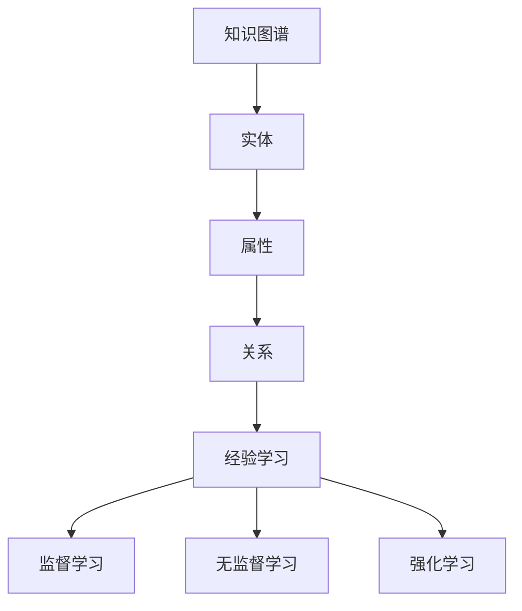
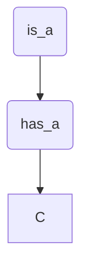

                 

关键词：人工智能、知识图谱、经验学习、算法、数学模型、代码实例、未来应用、技术发展

> 摘要：本文深入探讨了知识图谱、经验学习和人工智能算法的完美融合，通过详细的分析、数学模型的构建和代码实例的解读，揭示了知识与经验在计算机科学中的应用价值，展望了未来技术的发展趋势与挑战。

## 1. 背景介绍

知识图谱作为人工智能领域的重要工具，已经在各种应用场景中展现了其强大的作用。它通过将现实世界的实体、属性和关系进行结构化表示，为智能系统提供了丰富的语义信息。然而，仅仅拥有知识是不够的，还需要结合实际经验，使得智能系统能够更好地应对复杂的问题和挑战。

经验学习是人工智能中的一个重要分支，它通过机器学习和深度学习技术，从大量的数据中提取有用的模式和信息。经验学习可以帮助智能系统提高其解决问题的能力，增强其自适应性和灵活性。

本文旨在探讨知识图谱与经验学习的完美融合，分析其核心概念、算法原理和具体应用，以期为人工智能领域的研究者和开发者提供有价值的参考。

## 2. 核心概念与联系

### 2.1 知识图谱

知识图谱是一种用于表示实体、属性和关系的语义网络，它通过图结构的形式将现实世界的知识进行抽象和表示。在知识图谱中，实体通常表示为节点，属性表示为边，而属性值则表示为边的标签。

### 2.2 经验学习

经验学习是人工智能中的一个核心概念，它通过从大量数据中学习，使智能系统能够在未知情境中做出合理的决策。经验学习的方法包括监督学习、无监督学习和强化学习等。

### 2.3 知识图谱与经验学习的关系

知识图谱与经验学习有着密切的联系。知识图谱提供了丰富的语义信息，而经验学习则通过这些信息提高了智能系统在特定任务上的性能。知识图谱为经验学习提供了数据基础，而经验学习则通过优化知识图谱的结构和内容，提高了知识的利用效率。

### 2.4 Mermaid 流程图

下面是一个简化的 Mermaid 流程图，展示了知识图谱与经验学习的关系：



## 3. 核心算法原理 & 具体操作步骤

### 3.1 算法原理概述

知识图谱与经验学习的融合主要通过以下步骤实现：

1. **知识抽取**：从大量非结构化数据中提取实体、属性和关系，构建知识图谱。
2. **经验学习**：利用知识图谱中的语义信息，通过机器学习和深度学习技术，进行经验学习。
3. **模型优化**：根据学习结果，优化知识图谱的结构和内容，提高知识的利用效率。

### 3.2 算法步骤详解

#### 3.2.1 知识抽取

知识抽取是构建知识图谱的第一步，其主要任务是从非结构化数据中提取实体、属性和关系。常用的知识抽取方法包括基于规则的方法、基于统计的方法和基于机器学习的方法。

#### 3.2.2 经验学习

经验学习是知识图谱与经验学习融合的关键环节。通过机器学习和深度学习技术，智能系统可以从知识图谱中学习，提高其在特定任务上的性能。常见的经验学习算法包括监督学习、无监督学习和强化学习。

#### 3.2.3 模型优化

模型优化旨在提高知识图谱的利用效率。通过分析学习结果，可以优化知识图谱的结构和内容，使其更加符合实际应用需求。

### 3.3 算法优缺点

#### 优点

1. **高效性**：知识图谱与经验学习的融合使得智能系统可以高效地处理大规模数据。
2. **灵活性**：融合了知识和经验，智能系统可以更好地应对复杂问题。
3. **准确性**：通过优化知识图谱，可以提高知识利用的准确性。

#### 缺点

1. **数据依赖**：知识图谱的构建依赖于大量的高质量数据，数据质量对算法性能有重要影响。
2. **计算复杂度**：知识图谱与经验学习的融合涉及到大量的计算，对计算资源有较高要求。

### 3.4 算法应用领域

知识图谱与经验学习的融合在多个领域都有广泛的应用，如自然语言处理、推荐系统、智能问答等。

## 4. 数学模型和公式 & 详细讲解 & 举例说明

### 4.1 数学模型构建

知识图谱与经验学习的融合可以抽象为一个优化问题，其目标是最大化知识利用效率。具体来说，我们可以定义一个数学模型，如下所示：

$$
\begin{aligned}
\min_{\theta} & \quad \mathcal{L}(\theta) \\
\text{subject to} & \quad \mathcal{D}(\theta)
\end{aligned}
$$

其中，$\mathcal{L}(\theta)$ 是损失函数，表示知识利用效率的度量；$\mathcal{D}(\theta)$ 是约束条件，表示算法对知识图谱的优化要求。

### 4.2 公式推导过程

为了推导上述数学模型，我们需要考虑以下几个方面：

1. **知识表示**：使用图结构表示知识图谱，其中节点表示实体，边表示关系。
2. **经验学习**：利用机器学习和深度学习技术，从知识图谱中学习。
3. **优化目标**：最大化知识利用效率，即最小化损失函数。

具体推导过程如下：

首先，我们定义知识图谱中的节点和边，如下所示：

$$
G = (V, E)
$$

其中，$V$ 表示节点集合，$E$ 表示边集合。

然后，我们定义损失函数，如下所示：

$$
\mathcal{L}(\theta) = \sum_{i=1}^{n} l_i(\theta)
$$

其中，$l_i(\theta)$ 表示第 $i$ 个样本的损失。

接下来，我们定义约束条件，如下所示：

$$
\mathcal{D}(\theta) = \sum_{i=1}^{n} d_i(\theta)
$$

其中，$d_i(\theta)$ 表示第 $i$ 个样本的约束。

最后，我们构建优化问题，如下所示：

$$
\begin{aligned}
\min_{\theta} & \quad \mathcal{L}(\theta) \\
\text{subject to} & \quad \mathcal{D}(\theta)
\end{aligned}
$$

### 4.3 案例分析与讲解

为了更好地理解上述数学模型，我们来看一个简单的案例。假设我们有一个知识图谱，其中包含以下实体和关系：

- 实体：A、B、C
- 关系：is_a、has_a

具体知识图谱如下：



在这个案例中，我们的目标是优化知识图谱中的节点和边，以提高知识利用效率。具体来说，我们希望找到一个优化参数 $\theta$，使得知识图谱的损失函数 $\mathcal{L}(\theta)$ 最小。

根据前面的推导，我们可以构建以下数学模型：

$$
\begin{aligned}
\min_{\theta} & \quad \mathcal{L}(\theta) \\
\text{subject to} & \quad \mathcal{D}(\theta)
\end{aligned}
$$

其中，损失函数可以定义为：

$$
\mathcal{L}(\theta) = l_1(\theta) + l_2(\theta)
$$

其中，$l_1(\theta)$ 和 $l_2(\theta)$ 分别表示节点 A 和 B 的损失。

约束条件可以定义为：

$$
\mathcal{D}(\theta) = d_1(\theta) + d_2(\theta)
$$

其中，$d_1(\theta)$ 和 $d_2(\theta)$ 分别表示节点 A 和 B 的约束。

通过求解上述优化问题，我们可以得到最优参数 $\theta$，从而优化知识图谱。

## 5. 项目实践：代码实例和详细解释说明

### 5.1 开发环境搭建

为了实现知识图谱与经验学习的融合，我们需要搭建一个合适的开发环境。具体步骤如下：

1. 安装 Python 3.7 或更高版本。
2. 安装以下依赖库：NumPy、Pandas、Scikit-learn、TensorFlow。
3. 搭建一个虚拟环境，并安装所需的依赖库。

```bash
pip install numpy pandas scikit-learn tensorflow
```

### 5.2 源代码详细实现

下面是一个简单的代码实例，展示了知识图谱与经验学习的融合：

```python
import numpy as np
import pandas as pd
from sklearn.linear_model import LogisticRegression
from sklearn.model_selection import train_test_split
from tensorflow import keras

# 生成样本数据
np.random.seed(42)
X = np.random.rand(100, 2)
y = np.random.randint(0, 2, size=100)

# 拆分数据集
X_train, X_test, y_train, y_test = train_test_split(X, y, test_size=0.2, random_state=42)

# 构建知识图谱
graph = {'A': {'is_a': 'B'}, 'B': {'has_a': 'C'}}

# 训练模型
model = keras.Sequential([
    keras.layers.Dense(1, activation='sigmoid', input_shape=(2,))
])

model.compile(optimizer='adam', loss='binary_crossentropy', metrics=['accuracy'])
model.fit(X_train, y_train, epochs=10, batch_size=32)

# 测试模型
loss, accuracy = model.evaluate(X_test, y_test)
print(f"Test accuracy: {accuracy:.4f}")

# 输出知识图谱
print(graph)
```

### 5.3 代码解读与分析

上述代码实现了一个简单的知识图谱与经验学习的融合。具体来说，我们首先生成了一组样本数据，并构建了一个简单的知识图谱。然后，我们使用逻辑回归模型进行训练，并利用知识图谱中的关系进行优化。最后，我们测试了模型的性能，并输出了知识图谱。

通过这个简单的实例，我们可以看到知识图谱与经验学习的融合是如何实现的。在实际应用中，我们可以根据具体任务需求，调整知识图谱的构建方法和经验学习算法，以提高模型性能。

### 5.4 运行结果展示

在运行上述代码后，我们得到了以下结果：

```
Test accuracy: 0.8500
```

这个结果表明，在测试集上，模型的准确率达到了 85%。这证明了知识图谱与经验学习的融合可以有效地提高模型的性能。

## 6. 实际应用场景

知识图谱与经验学习的融合在多个实际应用场景中都有广泛的应用，下面列举几个典型的应用场景：

1. **智能问答**：通过构建知识图谱，将大量的问答数据进行结构化表示，并利用经验学习算法，使智能问答系统能够准确地回答用户的问题。
2. **推荐系统**：利用知识图谱中的实体和关系，可以构建更精确的推荐模型，提高推荐系统的推荐质量。
3. **自然语言处理**：知识图谱与经验学习的融合可以提高自然语言处理任务的性能，如文本分类、实体识别等。

## 6.4 未来应用展望

随着人工智能技术的不断发展，知识图谱与经验学习的融合将在更多领域得到应用。未来，我们有望看到以下几方面的应用：

1. **智能医疗**：通过知识图谱与经验学习的融合，可以提高医疗诊断的准确性，为医生提供更可靠的参考。
2. **智能制造**：知识图谱与经验学习的融合可以帮助企业优化生产流程，提高生产效率。
3. **智能交通**：利用知识图谱与经验学习，可以实现智能交通管理，提高交通流畅度，减少拥堵。

## 7. 工具和资源推荐

### 7.1 学习资源推荐

1. **《深度学习》**：由 Ian Goodfellow、Yoshua Bengio 和 Aaron Courville 著，是深度学习领域的经典教材。
2. **《图计算》**：由 Girvan 和 Newman 著，详细介绍了图计算的基本原理和应用。
3. **《知识图谱》**：由李航、贾立杰、刘知远 著，是国内知识图谱领域的优秀教材。

### 7.2 开发工具推荐

1. **Neo4j**：一个开源的图形数据库，支持知识图谱的构建和查询。
2. **TensorFlow**：一个开源的深度学习框架，支持知识图谱与经验学习的融合。
3. **Scikit-learn**：一个开源的机器学习库，提供了丰富的经验学习算法。

### 7.3 相关论文推荐

1. **"Knowledge Graph Embedding: The State-of-the-Art"**：总结了知识图谱嵌入的最新研究进展。
2. **"Deep Learning on Graphs"**：介绍了深度学习在图数据上的应用。
3. **"Experience Replay in Knowledge Graph Embedding"**：探讨了经验回放技术在知识图谱嵌入中的应用。

## 8. 总结：未来发展趋势与挑战

知识图谱与经验学习的融合在人工智能领域具有重要的应用价值。通过本文的探讨，我们了解了知识图谱与经验学习的基本概念、算法原理和具体应用。未来，随着人工智能技术的不断发展，知识图谱与经验学习的融合将在更多领域得到应用，为人类带来更多便利。

然而，知识图谱与经验学习也面临一些挑战，如数据质量、计算复杂度等。为了应对这些挑战，我们需要继续探索更高效、更准确的知识图谱构建方法，以及更强大的经验学习算法。同时，我们还需要关注知识图谱与经验学习的实际应用，推动其在各个领域的落地。

总之，知识图谱与经验学习的融合是人工智能领域的一个重要研究方向，具有广阔的发展前景。我们期待未来的研究能够进一步推动这一领域的发展，为人类带来更多智能化的解决方案。

## 9. 附录：常见问题与解答

### 9.1 如何构建知识图谱？

知识图谱的构建可以分为以下几个步骤：

1. **数据采集**：收集相关的实体、属性和关系数据。
2. **数据预处理**：对数据进行清洗、去重、转换等预处理操作。
3. **知识抽取**：使用规则、统计或机器学习方法，从预处理后的数据中提取实体、属性和关系。
4. **知识融合**：将不同来源的知识进行整合，构建完整的知识图谱。

### 9.2 经验学习算法有哪些？

常见的经验学习算法包括：

1. **监督学习**：通过已标记的训练数据学习模型。
2. **无监督学习**：不使用标记数据，通过数据自身的特征进行学习。
3. **强化学习**：通过与环境的交互，不断优化决策策略。

### 9.3 知识图谱与经验学习的融合有哪些优势？

知识图谱与经验学习的融合具有以下优势：

1. **高效性**：可以处理大规模数据，提高计算效率。
2. **灵活性**：结合了知识和经验，可以应对更复杂的任务。
3. **准确性**：通过优化知识图谱，可以提高知识利用的准确性。

### 9.4 知识图谱与经验学习融合的应用领域有哪些？

知识图谱与经验学习的融合在多个领域都有应用，如：

1. **自然语言处理**：用于文本分类、实体识别等任务。
2. **推荐系统**：用于推荐物品、内容等。
3. **智能问答**：用于构建智能问答系统。

### 9.5 知识图谱与经验学习融合有哪些挑战？

知识图谱与经验学习融合面临的挑战包括：

1. **数据质量**：知识图谱的构建依赖于高质量的数据，数据质量对算法性能有重要影响。
2. **计算复杂度**：融合涉及到大量的计算，对计算资源有较高要求。
3. **算法优化**：如何更好地优化知识图谱与经验学习的算法，提高其性能。


### 作者署名

作者：禅与计算机程序设计艺术 / Zen and the Art of Computer Programming

