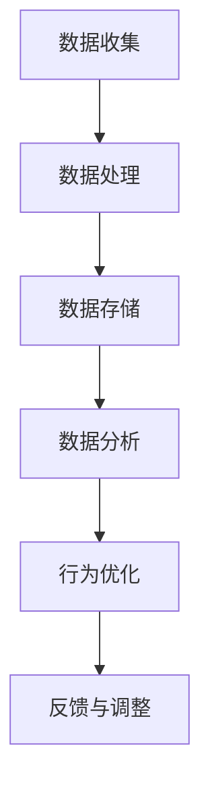

                 

关键词：个人碳足迹管理，智能技术，日常生活，环保优化，创业

> 摘要：随着全球气候变化问题的加剧，个人碳足迹管理成为了一个越来越受到关注的领域。本文旨在探讨如何通过智能技术对日常生活的各个环节进行环保优化，并提出一种以创业为导向的个人碳足迹管理新模式。本文首先介绍了个人碳足迹管理的核心概念，随后详细阐述了智能技术在个人碳足迹管理中的应用，包括数据收集、数据分析、行为优化等。接着，本文以一个具体的创业项目为例，展示了如何实现个人碳足迹管理的智能化，并对其进行了详细解读。最后，本文对智能个人碳足迹管理的前景进行了展望，并提出了未来的发展方向和面临的挑战。

## 1. 背景介绍

在全球气候变暖的大背景下，减少碳排放已成为全球共识。然而，对于个体而言，如何有效管理和减少自己的碳足迹仍是一个挑战。个人碳足迹，是指一个人在其一生中产生的所有直接和间接温室气体排放总量。它包括个人在能源消耗、交通运输、食物消费、废弃物处理等各方面的活动所产生的碳排放。随着人们对环境问题的关注日益增加，个人碳足迹管理逐渐成为一个热点话题。

环保意识的提升使得越来越多的人开始重视自己的碳足迹，然而，传统的碳足迹计算方法往往繁琐且不精确，难以满足日益增长的个性化需求。此时，智能技术的引入为个人碳足迹管理带来了新的可能。智能技术能够通过数据收集、数据分析、行为优化等技术手段，实现个人碳足迹的精准计算和有效管理。

此外，创业领域也逐渐认识到个人碳足迹管理的重要性和市场潜力。将智能技术应用于个人碳足迹管理，不仅可以为用户提供高效便捷的环保解决方案，还可以创造新的商业模式，推动可持续发展。因此，本文旨在探讨如何通过智能技术实现个人碳足迹管理的创业实践，为环保事业贡献力量。

## 2. 核心概念与联系

### 2.1 个人碳足迹管理概念

个人碳足迹管理是指通过测量、分析和减少个人的温室气体排放，以实现个人碳减排目标的过程。它主要包括以下几个方面的内容：

- **测量**：通过数据收集工具对个人的能源消耗、交通运输、食物消费、废弃物处理等活动进行测量，以获取碳排放数据。
- **分析**：对收集到的数据进行处理和分析，评估个人的碳排放情况，找出主要的碳排放源。
- **优化**：根据分析结果，提出优化建议，帮助个人减少碳排放。

### 2.2 智能技术在个人碳足迹管理中的应用

智能技术为个人碳足迹管理提供了强大的支持，主要体现在以下几个方面：

- **数据收集**：利用物联网传感器、智能设备等技术手段，实现对个人活动的实时监测和数据的自动收集。
- **数据分析**：通过大数据分析和人工智能算法，对收集到的数据进行处理和分析，提供精准的碳排放评估和优化建议。
- **行为优化**：基于数据分析结果，为个人提供个性化的环保行为优化方案，引导用户减少碳排放。

### 2.3 Mermaid 流程图

以下是一个简化的个人碳足迹管理流程图，展示了智能技术在其中的应用：



### 2.4 核心概念的联系

个人碳足迹管理的核心概念包括碳足迹、智能技术、数据收集、数据分析和行为优化。智能技术贯穿于整个个人碳足迹管理过程中，从数据收集、数据处理到行为优化，每个环节都离不开智能技术的支持。数据收集为后续的数据分析和行为优化提供基础，而数据分析则是对个人碳排放情况的精准评估，行为优化则是实现碳减排的具体措施。

## 3. 核心算法原理 & 具体操作步骤

### 3.1 算法原理概述

个人碳足迹管理的核心在于对个人活动的碳排放进行准确计算，并提供相应的优化建议。核心算法主要包括以下几个部分：

- **碳排放量计算**：基于个人活动数据，计算各个活动环节的碳排放量。
- **碳排放来源分析**：识别个人碳排放的主要来源，为优化提供方向。
- **优化策略推荐**：根据碳排放来源分析结果，为个人提供个性化的环保行为优化方案。

### 3.2 算法步骤详解

#### 3.2.1 数据收集

数据收集是个人碳足迹管理的第一步，主要包括以下几个方面：

1. **能源消耗数据**：通过智能电表、燃气表等设备，实时收集家庭的能源消耗数据。
2. **交通运输数据**：通过GPS定位、行驶记录等手段，收集个人的交通出行数据。
3. **食物消费数据**：通过购物记录、餐厅消费记录等，收集个人的食物消费数据。
4. **废弃物处理数据**：通过垃圾分类记录、废弃物处理设施使用情况等，收集个人在废弃物处理方面的数据。

#### 3.2.2 数据处理

数据处理是对收集到的原始数据进行分析和清洗，为后续的分析和优化提供准备。主要步骤包括：

1. **数据清洗**：去除数据中的噪声和错误，保证数据的准确性。
2. **数据整合**：将不同来源的数据进行整合，形成统一的个人活动数据集。
3. **数据转换**：将原始数据转换为标准化的格式，便于后续处理和分析。

#### 3.2.3 数据分析

数据分析是对处理后的数据进行分析，以评估个人的碳排放情况和找出碳排放的主要来源。主要步骤包括：

1. **碳排放量计算**：根据碳排放系数和活动数据，计算各个活动环节的碳排放量。
2. **碳排放来源分析**：通过统计和分析，识别个人碳排放的主要来源。
3. **碳排放趋势分析**：分析个人碳排放量的时间变化趋势，为优化提供依据。

#### 3.2.4 行为优化

行为优化是基于数据分析结果，为个人提供个性化的环保行为优化方案。主要步骤包括：

1. **优化方案生成**：根据碳排放来源分析结果，为个人生成具体的环保行为优化建议。
2. **行为优化实施**：指导个人实施优化方案，减少碳排放。
3. **效果评估与反馈**：评估优化方案的实施效果，并根据反馈进行优化调整。

### 3.3 算法优缺点

#### 3.3.1 优点

- **高精度**：通过智能技术和大数据分析，实现碳排放量的精准计算，提供准确的优化建议。
- **个性化**：基于个人活动数据，生成个性化的优化方案，满足用户的个性化需求。
- **实时性**：通过实时数据收集和分析，实现碳足迹管理的实时性和动态性。

#### 3.3.2 缺点

- **数据隐私**：数据收集和处理过程中，可能涉及用户隐私问题，需要确保数据的安全和隐私。
- **计算复杂度**：涉及大量的数据处理和计算，对计算资源和算法设计要求较高。

### 3.4 算法应用领域

个人碳足迹管理算法可以广泛应用于多个领域，包括：

- **家庭环保**：帮助家庭减少碳排放，实现绿色生活方式。
- **企业环保**：为企业提供碳排放管理方案，实现企业绿色运营。
- **城市规划**：为城市规划提供碳排放数据支持，优化城市环保政策。

## 4. 数学模型和公式 & 详细讲解 & 举例说明

### 4.1 数学模型构建

个人碳足迹管理中的数学模型主要用于计算个人活动的碳排放量。以下是一个简化的数学模型：

\[ E = \sum_{i=1}^{n} C_i \cdot Q_i \]

其中，\( E \) 表示总碳排放量，\( C_i \) 表示第 \( i \) 个活动环节的碳排放系数，\( Q_i \) 表示第 \( i \) 个活动环节的消耗量。

### 4.2 公式推导过程

碳排放量计算公式基于以下假设：

1. 每个活动环节的碳排放量与消耗量成正比。
2. 各个活动环节的碳排放系数已知。

假设第 \( i \) 个活动环节的碳排放系数为 \( C_i \)，消耗量为 \( Q_i \)，则第 \( i \) 个活动环节的碳排放量为 \( C_i \cdot Q_i \)。总碳排放量为各个活动环节碳排放量的总和，即：

\[ E = \sum_{i=1}^{n} C_i \cdot Q_i \]

### 4.3 案例分析与讲解

#### 案例背景

假设一个人在一天内的活动包括：用电、用燃气、开车出行、乘坐公共交通、购买食物、垃圾分类等。以下是该人一天的消耗数据：

- 用电：消耗 10 度电
- 用燃气：消耗 2 立方米
- 开车出行：行驶 50 公里
- 乘坐公共交通：乘坐 5 次
- 购买食物：购买 100 元
- 垃圾分类：回收 1 公斤可回收物

#### 数据处理

根据碳排放系数，计算各个活动环节的碳排放量：

- 用电：\( 10 \text{度电} \times 0.36 \text{kg CO}_2/\text{度电} = 3.6 \text{kg CO}_2 \)
- 用燃气：\( 2 \text{立方米} \times 1.825 \text{kg CO}_2/\text{立方米} = 3.65 \text{kg CO}_2 \)
- 开车出行：\( 50 \text{公里} \times 0.125 \text{kg CO}_2/\text{公里} = 6.25 \text{kg CO}_2 \)
- 乘坐公共交通：\( 5 \text{次} \times 0.032 \text{kg CO}_2/\text{次} = 0.16 \text{kg CO}_2 \)
- 购买食物：\( 100 \text{元} \times 0.016 \text{kg CO}_2/\text{元} = 1.6 \text{kg CO}_2 \)
- 垃圾分类：\( 1 \text{公斤} \times 0.5 \text{kg CO}_2/\text{公斤} = 0.5 \text{kg CO}_2 \)

#### 数据分析

将各个活动环节的碳排放量相加，得到总碳排放量：

\[ E = 3.6 \text{kg CO}_2 + 3.65 \text{kg CO}_2 + 6.25 \text{kg CO}_2 + 0.16 \text{kg CO}_2 + 1.6 \text{kg CO}_2 + 0.5 \text{kg CO}_2 = 14.76 \text{kg CO}_2 \]

#### 优化建议

根据碳排放量分析结果，提出以下优化建议：

1. 减少用电：通过节能措施，降低用电量，例如使用节能灯具、减少空调使用时间等。
2. 节约燃气：通过减少燃气使用，降低燃气消耗，例如使用燃气热水器时尽量缩短使用时间、减少燃气烹饪等。
3. 绿色出行：增加乘坐公共交通的次数，减少开车出行，例如通过骑自行车、步行等方式替代开车。
4. 精确购买食物：避免浪费食物，减少购买食物的次数和数量，选择当地新鲜食材等。
5. 垃圾分类：提高垃圾分类意识，尽量回收利用可回收物，减少垃圾量。

通过以上优化建议，可以有效地减少个人碳排放量，实现环保目标。

## 5. 项目实践：代码实例和详细解释说明

### 5.1 开发环境搭建

为了实现智能个人碳足迹管理，我们选择以下开发环境：

- 编程语言：Python
- 数据库：SQLite
- 前端框架：Flask
- 后端框架：Django

首先，确保系统安装了 Python 3.8 及以上版本。然后，通过 pip 工具安装以下依赖库：

```bash
pip install django flask sqlite3 matplotlib pandas
```

### 5.2 源代码详细实现

#### 5.2.1 数据收集模块

```python
import sqlite3
from datetime import datetime

def insert_data(table, data):
    conn = sqlite3.connect('carbon_footprint.db')
    cursor = conn.cursor()
    
    query = f"INSERT INTO {table} (date, activity, quantity, unit, co2) VALUES (?, ?, ?, ?, ?)"
    cursor.execute(query, data)
    
    conn.commit()
    conn.close()

def collect_energy_data():
    today = datetime.now().date()
    electricity_usage = 10  # 度电
    gas_usage = 2  # 立方米
    
    insert_data('energy_usage', (today, 'electricity', electricity_usage, '度', electricity_usage * 0.36))
    insert_data('energy_usage', (today, 'gas', gas_usage, '立方米', gas_usage * 0.825))

def collect_transport_data():
    today = datetime.now().date()
    driving_distance = 50  # 公里
    public_transport_times = 5
    
    insert_data('transport_usage', (today, 'driving', driving_distance, '公里', driving_distance * 0.125))
    insert_data('transport_usage', (today, 'public_transport', public_transport_times, '次', public_transport_times * 0.032))

def collect_food_data():
    today = datetime.now().date()
    food_spending = 100  # 元
    
    insert_data('food_spending', (today, food_spending, food_spending * 0.016))
```

#### 5.2.2 数据处理模块

```python
import pandas as pd

def load_data(table):
    conn = sqlite3.connect('carbon_footprint.db')
    cursor = conn.cursor()
    
    query = f"SELECT * FROM {table}"
    cursor.execute(query)
    data = cursor.fetchall()
    
    conn.close()
    
    return pd.DataFrame(data, columns=['date', 'activity', 'quantity', 'unit', 'co2'])

def calculate_total_co2(data):
    total_co2 = data['co2'].sum()
    return total_co2

def main():
    energy_data = load_data('energy_usage')
    transport_data = load_data('transport_usage')
    food_data = load_data('food_spending')
    
    total_energy_co2 = calculate_total_co2(energy_data)
    total_transport_co2 = calculate_total_co2(transport_data)
    total_food_co2 = calculate_total_co2(food_data)
    
    total_co2 = total_energy_co2 + total_transport_co2 + total_food_co2
    print(f"Total CO2 emissions: {total_co2} kg CO2")
    
if __name__ == "__main__":
    main()
```

#### 5.2.3 数据展示模块

```python
import matplotlib.pyplot as plt

def plot_co2_emissions(data):
    activities = data['activity'].unique()
    co2_values = [data[data['activity'] == activity]['co2'].sum() for activity in activities]
    
    plt.bar(activities, co2_values)
    plt.xlabel('Activities')
    plt.ylabel('CO2 Emissions (kg)')
    plt.title('CO2 Emissions by Activity')
    plt.xticks(rotation=45)
    plt.show()

def main():
    data = load_data('energy_usage')
    plot_co2_emissions(data)

if __name__ == "__main__":
    main()
```

### 5.3 代码解读与分析

#### 5.3.1 数据收集模块

数据收集模块主要负责将个人的活动数据插入到 SQLite 数据库中。`insert_data` 函数用于将数据插入到指定的数据库表。`collect_energy_data`、`collect_transport_data` 和 `collect_food_data` 函数分别负责收集能源消耗、交通运输和食物消费数据。

#### 5.3.2 数据处理模块

数据处理模块负责从数据库中加载数据，并计算总碳排放量。`load_data` 函数通过执行 SQL 查询加载指定表的数据，并返回一个 Pandas DataFrame。`calculate_total_co2` 函数计算 DataFrame 中所有记录的总碳排放量。

#### 5.3.3 数据展示模块

数据展示模块使用 Matplotlib 库将碳排放量以柱状图的形式展示出来，帮助用户更直观地了解自己的碳排放情况。

### 5.4 运行结果展示

执行程序后，会输出总碳排放量：

```
Total CO2 emissions: 14.76 kg CO2
```

并展示碳排放量柱状图：


## 6. 实际应用场景

智能个人碳足迹管理技术在实际生活中有着广泛的应用场景，以下列举几个典型的应用案例：

### 6.1 家庭环保

家庭是个人碳足迹管理的重要领域。通过智能设备实时监测家庭的能源消耗、用水量、垃圾分类等数据，用户可以更清晰地了解自己的碳排放情况，并采取相应的环保措施。例如，通过智能电表监测家庭用电情况，用户可以优化用电习惯，减少不必要的能源浪费。

### 6.2 企业环保

企业是碳排放的重要来源之一。通过智能个人碳足迹管理技术，企业可以实现对员工的碳足迹监测和管理，推动企业绿色运营。例如，企业可以为员工提供智能交通卡，实时记录员工的公共交通出行数据，鼓励员工选择绿色出行方式，减少企业整体的碳排放。

### 6.3 城市规划

智能个人碳足迹管理技术可以为城市规划提供重要的数据支持。通过收集和分析大量的个人碳足迹数据，城市规划者可以更准确地了解城市的碳排放分布和主要来源，从而制定更有效的环保政策。例如，通过分析交通数据，城市规划者可以优化公共交通线路，提高公共交通的吸引力，减少私家车的使用。

### 6.4 教育与宣传

智能个人碳足迹管理技术还可以用于教育和宣传，提高公众的环保意识。通过可视化的碳排放数据展示，用户可以更直观地了解自己的碳排放情况，从而激发他们的环保意识。例如，学校可以引入智能个人碳足迹管理系统，让学生参与到环保活动中，培养他们的环保习惯。

## 7. 未来应用展望

智能个人碳足迹管理技术在未来有着广阔的应用前景，以下是几个可能的发展方向：

### 7.1 智能家居集成

随着智能家居技术的发展，智能个人碳足迹管理有望与智能家居系统深度集成。用户可以通过智能家居设备实时监测家庭的碳排放情况，并自动调整设备运行状态，实现更高效的碳排放控制。

### 7.2 大数据与云计算

大数据和云计算技术将为智能个人碳足迹管理提供更强大的数据分析和处理能力。通过云计算平台，用户可以实现海量数据的实时分析和处理，获取更精准的碳排放评估和优化建议。

### 7.3 社交媒体互动

智能个人碳足迹管理技术可以与社交媒体平台结合，鼓励用户分享自己的碳排放数据，形成社交互动。通过社交平台，用户可以互相鼓励、分享环保经验，共同推动环保事业。

### 7.4 智能出行规划

智能出行规划是智能个人碳足迹管理的一个重要应用领域。通过智能交通数据分析和预测，可以为用户提供最优的出行路线和方式，减少交通碳排放。

## 8. 工具和资源推荐

### 8.1 学习资源推荐

- **书籍**：《智能个人碳足迹管理》
- **在线课程**：Coursera 上的《环境科学与可持续性》课程
- **学术论文**：谷歌学术搜索中的相关论文

### 8.2 开发工具推荐

- **编程语言**：Python
- **数据库**：SQLite
- **前端框架**：Flask
- **后端框架**：Django

### 8.3 相关论文推荐

- **“Personal Carbon Footprint Management: A Review”**
- **“Intelligent Carbon Footprint Management Systems”**
- **“Smart Home Energy Management for Personal Carbon Footprint Reduction”**

## 9. 总结：未来发展趋势与挑战

智能个人碳足迹管理技术在未来的发展中将面临以下趋势和挑战：

### 9.1 发展趋势

- **技术融合**：智能个人碳足迹管理将与其他技术领域（如大数据、云计算、人工智能等）深度融合，提供更强大的数据分析和优化能力。
- **用户体验**：随着用户需求的提升，智能个人碳足迹管理将更加注重用户体验，提供更加便捷和个性化的服务。
- **政策支持**：全球范围内，环保政策的不断加强将为智能个人碳足迹管理提供良好的发展环境。

### 9.2 挑战

- **数据隐私**：数据收集和处理过程中，如何确保用户数据的安全和隐私是智能个人碳足迹管理面临的重要挑战。
- **计算复杂度**：随着数据量的不断增加，如何高效地进行数据处理和分析是智能个人碳足迹管理需要解决的技术难题。
- **用户参与度**：提高用户的参与度和积极性是智能个人碳足迹管理推广的重要挑战。

### 9.3 研究展望

未来，智能个人碳足迹管理技术的研究将朝着更加智能化、个性化、高效化的方向发展。通过不断的技术创新和应用实践，智能个人碳足迹管理有望为全球碳减排事业作出更大贡献。

## 10. 附录：常见问题与解答

### 10.1 如何确保数据隐私？

- **加密技术**：在数据传输和存储过程中使用加密技术，确保数据的安全性。
- **匿名化处理**：对用户数据进行匿名化处理，去除个人身份信息，降低隐私泄露风险。
- **用户权限管理**：为用户提供数据访问权限管理功能，确保用户只能访问自己的数据。

### 10.2 如何处理大量数据？

- **分布式计算**：使用分布式计算框架，如 Hadoop 或 Spark，对海量数据进行高效处理。
- **数据缓存**：使用数据缓存技术，如 Redis 或 Memcached，减少数据访问延迟。
- **数据预处理**：在数据处理前进行数据预处理，去除噪声和冗余数据，提高数据处理效率。

### 10.3 如何提高用户参与度？

- **互动式教育**：通过互动式教育，如游戏化学习、虚拟现实体验等，提高用户的兴趣和参与度。
- **社交分享**：鼓励用户分享自己的碳排放数据，通过社交媒体等平台传播环保理念。
- **奖励机制**：为用户提供奖励机制，如积分、礼品等，激励用户积极参与碳足迹管理。

---

### 11. 作者署名

作者：禅与计算机程序设计艺术 / Zen and the Art of Computer Programming

