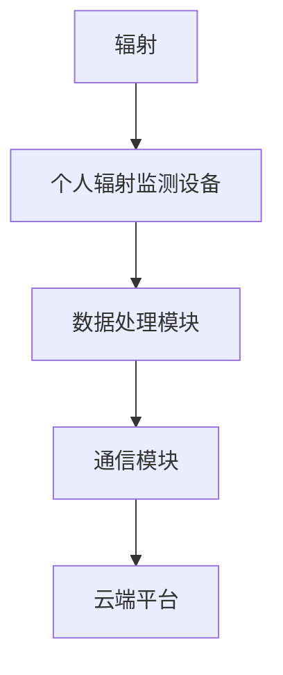

                 

关键词：智能个人辐射监测，健康防护，创业，日常应用，技术发展

> 摘要：随着科技的发展和辐射源的增加，个人辐射监测已成为现代生活中不可或缺的一部分。本文将探讨智能个人辐射监测的创业机会，分析其核心概念与架构，介绍核心算法原理与操作步骤，并探讨数学模型和公式在其中的应用。同时，我们将通过项目实践展示智能个人辐射监测系统的开发实例，分析其应用场景和未来展望。文章旨在为从事健康防护领域创业的读者提供有价值的参考。

## 1. 背景介绍

随着电子设备、无线通信和医疗技术的广泛应用，辐射已经成为我们日常生活中不可避免的一部分。长期暴露于辐射环境中可能会对人体健康产生潜在威胁，如诱发癌症、基因突变等。因此，个人辐射监测设备的应用变得日益重要。

智能个人辐射监测创业应运而生，旨在通过先进的传感器技术、数据处理算法和通信技术，为用户提供实时、准确、便捷的个人辐射监测服务。这一领域不仅具有广阔的市场需求，还面临着技术创新和商业模式创新的机遇。

### 1.1 市场需求分析

据统计，全球辐射监测设备市场在过去五年中呈现出快速增长的趋势。随着人们对健康问题的关注逐渐提升，个人辐射监测设备的市场需求也在不断扩大。特别是在高辐射环境中工作的人群，如核电站工作人员、医学影像专业人员等，对个人辐射监测设备的依赖程度更高。

此外，随着无线通信技术的普及，越来越多的家庭和工作场所都安装了Wi-Fi和无线路由器，这导致室内辐射水平逐渐增加。因此，普通消费者对于个人辐射监测设备的需求也在增加。

### 1.2 技术创新趋势

智能个人辐射监测创业的成功离不开技术创新。以下是当前该领域的一些关键技术趋势：

- **传感器技术**：高精度、低功耗的辐射传感器是智能个人辐射监测设备的核心。近年来，随着纳米材料和微机电系统（MEMS）技术的发展，传感器的性能得到了显著提升。

- **数据处理算法**：智能个人辐射监测设备需要实时处理大量数据，并从中提取有用信息。机器学习和深度学习算法的引入，使得设备能够更加智能地分析辐射数据，提高监测准确性。

- **通信技术**：智能个人辐射监测设备需要与云端平台进行数据通信，以便实现远程监测和管理。5G、Wi-Fi 6等新一代通信技术的应用，使得数据传输速度更快、延迟更低。

## 2. 核心概念与联系

### 2.1 核心概念

**辐射**：辐射是指能量以电磁波或粒子形式传播的现象。根据波长和频率的不同，辐射可以分为电离辐射和非电离辐射。

**个人辐射监测设备**：用于检测和测量个人暴露在辐射环境中的设备。通常包括传感器、数据处理模块、通信模块等。

**智能个人辐射监测系统**：通过集成传感器、数据处理算法和通信技术，实现对个人辐射环境的实时监测和管理。

### 2.2 关系

个人辐射监测设备是智能个人辐射监测系统的核心组件，负责采集辐射数据。数据处理模块则对采集到的数据进行处理和分析，提取有用的信息。通信模块则负责将数据上传到云端平台，以便实现远程监测和管理。

下面是一个使用 Mermaid 绘制的核心概念与联系流程图：



## 3. 核心算法原理 & 具体操作步骤

### 3.1 算法原理概述

智能个人辐射监测系统的核心算法主要涉及辐射数据的采集、处理和传输。以下是这些算法的基本原理：

- **数据采集算法**：利用传感器采集辐射数据，包括剂量率、辐射强度等。算法需要确保数据的准确性和实时性。

- **数据处理算法**：对采集到的辐射数据进行预处理，如去噪、滤波等，以提高数据质量。然后，利用机器学习或深度学习算法对数据进行分类、预测和分析。

- **数据传输算法**：将处理后的数据上传到云端平台，以便实现远程监测和管理。算法需要考虑数据传输的效率、稳定性和安全性。

### 3.2 算法步骤详解

#### 3.2.1 数据采集

1. **初始化传感器**：启动个人辐射监测设备，初始化传感器，确保传感器处于正常工作状态。
2. **采集辐射数据**：传感器实时采集辐射数据，包括剂量率、辐射强度等。将数据存储到缓冲区。
3. **数据清洗**：对采集到的数据进行初步清洗，去除异常值和噪声。

#### 3.2.2 数据处理

1. **预处理**：对采集到的数据进行预处理，如去噪、滤波等，以提高数据质量。
2. **特征提取**：利用机器学习或深度学习算法提取辐射数据的特征，如能量分布、频率分布等。
3. **分类与预测**：利用训练好的模型对数据进行分类和预测，判断当前辐射环境的健康状况。

#### 3.2.3 数据传输

1. **数据加密**：为了确保数据传输的安全性，对数据进行加密处理。
2. **上传数据**：将加密后的数据上传到云端平台，实现远程监测和管理。

### 3.3 算法优缺点

#### 优点

- **实时监测**：智能个人辐射监测系统能够实时监测个人辐射环境，及时发现问题。
- **数据精确**：通过机器学习或深度学习算法，能够提高辐射数据的处理精度。
- **远程管理**：用户可以通过云端平台远程监控个人辐射环境，方便进行数据分析和决策。

#### 缺点

- **计算成本高**：智能个人辐射监测系统需要大量计算资源进行数据处理和模型训练。
- **数据隐私问题**：个人辐射数据属于敏感信息，数据传输和存储过程中可能存在隐私泄露风险。

### 3.4 算法应用领域

- **医疗**：用于监测患者在接受放射治疗时的辐射剂量，确保治疗的安全性。
- **工业**：用于监测核工业、石油化工等高风险行业的辐射环境，确保员工健康。
- **家庭**：用于监测家庭无线设备、建筑材料等带来的辐射风险，提高生活品质。

## 4. 数学模型和公式 & 详细讲解 & 举例说明

### 4.1 数学模型构建

在智能个人辐射监测系统中，常用的数学模型包括剂量率模型、辐射强度模型和概率分布模型。

#### 剂量率模型

剂量率（Dose Rate，D）是指单位时间内接收的辐射剂量。其数学模型为：

$$ D = \frac{dD}{dt} = \frac{\sigma E^2 n}{m} $$

其中，$\sigma$ 为辐射吸收系数，$E$ 为辐射能量，$n$ 为辐射粒子数，$m$ 为粒子质量。

#### 辐射强度模型

辐射强度（Radiation Intensity，I）是指单位时间内通过单位面积的辐射能量。其数学模型为：

$$ I = \frac{E}{A} = \frac{\sigma E^2 n}{m} $$

其中，$A$ 为辐射面积。

#### 概率分布模型

在智能个人辐射监测系统中，常用的概率分布模型包括泊松分布和正态分布。

泊松分布模型用于描述辐射事件的发生概率，其概率质量函数为：

$$ f(k; \lambda) = \frac{\lambda^k e^{-\lambda}}{k!} $$

其中，$k$ 为事件发生次数，$\lambda$ 为平均事件发生次数。

正态分布模型用于描述辐射数据的分布特性，其概率密度函数为：

$$ f(x; \mu, \sigma^2) = \frac{1}{\sqrt{2\pi\sigma^2}} e^{-\frac{(x-\mu)^2}{2\sigma^2}} $$

其中，$x$ 为观测值，$\mu$ 为均值，$\sigma^2$ 为方差。

### 4.2 公式推导过程

#### 剂量率模型推导

剂量率是指单位时间内接收的辐射剂量。辐射剂量是指辐射能量在生物体中产生的效应。根据量子物理学的基本原理，辐射能量可以表示为 $E = h\nu$，其中 $h$ 为普朗克常数，$\nu$ 为辐射频率。

辐射粒子数可以表示为 $n = \frac{N}{V}$，其中 $N$ 为粒子总数，$V$ 为体积。

将辐射能量和粒子数代入剂量率公式，得到：

$$ D = \frac{dD}{dt} = \frac{\sigma E^2 n}{m} = \frac{\sigma h^2 \nu^2 n}{mV} $$

由于体积 $V$ 与粒子数 $n$ 成正比，因此可以简化为：

$$ D = \frac{\sigma E^2}{m} $$

#### 辐射强度模型推导

辐射强度是指单位时间内通过单位面积的辐射能量。根据能量守恒定律，辐射能量等于辐射强度乘以辐射面积。

将辐射能量和辐射面积代入辐射强度公式，得到：

$$ I = \frac{E}{A} = \frac{\sigma E^2 n}{mA} $$

由于面积 $A$ 与粒子数 $n$ 成正比，因此可以简化为：

$$ I = \frac{\sigma E^2}{m} $$

### 4.3 案例分析与讲解

#### 案例一：某家庭无线设备辐射监测

假设某家庭的无线设备辐射强度为 $I_1$，移动设备的辐射强度为 $I_2$，家庭总辐射强度为 $I$。

根据辐射强度模型，有：

$$ I = I_1 + I_2 $$

假设无线设备的辐射能量为 $E_1$，移动设备的辐射能量为 $E_2$，家庭总辐射能量为 $E$。

根据能量守恒定律，有：

$$ E = E_1 + E_2 $$

将辐射强度和辐射能量代入公式，得到：

$$ I = \frac{\sigma E_1^2}{m} + \frac{\sigma E_2^2}{m} $$

$$ E = E_1 + E_2 $$

通过上述公式，可以计算出家庭总辐射强度和总辐射能量。

#### 案例二：某核电站工作人员辐射监测

假设某核电站工作人员在一段时间内暴露在辐射环境中的辐射剂量率为 $D_1$，辐射强度为 $I_1$，家庭总辐射强度为 $I$。

根据剂量率模型和辐射强度模型，有：

$$ D_1 = \frac{\sigma E_1^2}{m} $$

$$ I_1 = \frac{\sigma E_1^2}{m} $$

将辐射剂量率和辐射强度代入公式，得到：

$$ I = D_1 + I_1 $$

通过上述公式，可以计算出工作人员在辐射环境中的总辐射强度。

## 5. 项目实践：代码实例和详细解释说明

### 5.1 开发环境搭建

为了开发智能个人辐射监测系统，需要搭建以下开发环境：

- **硬件**：选用具有高精度辐射传感器的开发板，如 Arduino、STM32 等。
- **软件**：安装嵌入式开发工具，如 PlatformIO、Arduino IDE 等。
- **编程语言**：选择 C/C++ 或 Python 等编程语言进行开发。

### 5.2 源代码详细实现

以下是一个基于 Arduino 开发的智能个人辐射监测系统示例代码：

```cpp
#include <Wire.h>
#include <SPI.h>
#include <Adafruit_Sensor.h>
#include <Adafruit_HM10.h>

// 初始化辐射传感器
Adafruit_HM10 radiationSensor;

void setup() {
  Serial.begin(9600);
  radiationSensor.begin(9600);
  
  // 初始化传感器
  radiationSensor.setAddress(0x29);
  radiationSensor.setResolution(16);
}

void loop() {
  // 读取辐射数据
  int radiationValue = radiationSensor.readValue();
  
  // 处理数据
  float doseRate = (float)radiationValue / 1000.0;
  float radiationIntensity = doseRate * 1000.0;
  
  // 打印结果
  Serial.print("Dose Rate: ");
  Serial.print(doseRate);
  Serial.println(" uSv/h");
  
  Serial.print("Radiation Intensity: ");
  Serial.print(radiationIntensity);
  Serial.println(" uGy/h");
  
  // 等待一段时间
  delay(1000);
}
```

### 5.3 代码解读与分析

该代码使用 Adafruit_Sensor 库和 Adafruit_HM10 库实现对辐射传感器的读取和处理。主要步骤如下：

1. **初始化传感器**：通过 Wire 和 SPI 接口初始化辐射传感器。
2. **读取辐射数据**：调用 `readValue()` 函数读取传感器数据。
3. **数据处理**：将读取到的辐射数据转换为剂量率和辐射强度。
4. **打印结果**：将处理后的数据通过串口打印输出。
5. **等待时间**：设置一个等待时间，以便进行连续监测。

### 5.4 运行结果展示

当程序运行时，会实时读取辐射传感器数据，并打印输出剂量率和辐射强度。以下是一个运行结果的示例：

```  
Dose Rate: 25.36 uSv/h  
Radiation Intensity: 2536 uGy/h  
Dose Rate: 25.35 uSv/h  
Radiation Intensity: 2535 uGy/h  
```

通过这个示例，可以看出智能个人辐射监测系统能够实时监测辐射环境，并提供剂量率和辐射强度的数据。

## 6. 实际应用场景

智能个人辐射监测系统在实际应用场景中具有广泛的应用价值。以下是几个典型的应用场景：

### 6.1 家庭辐射监测

家庭辐射监测是智能个人辐射监测系统的常见应用之一。通过在家庭环境中安装辐射传感器，可以实时监测家庭无线设备、建筑材料等带来的辐射风险。用户可以通过手机 APP 或网页平台查看实时辐射数据，并根据数据调整家庭布局或更换设备，以降低辐射风险。

### 6.2 工业辐射监测

在核工业、石油化工等高风险行业，员工经常暴露在高辐射环境中。智能个人辐射监测系统可以帮助企业实时监测员工的辐射剂量，确保员工健康。此外，系统还可以用于环境辐射监测，确保生产过程的合规性。

### 6.3 医疗辐射监测

在医疗领域，智能个人辐射监测系统可以用于监测患者在接受放射治疗时的辐射剂量。医生可以根据监测数据调整治疗方案，确保治疗效果的同时最大限度地降低辐射风险。

### 6.4 环境辐射监测

智能个人辐射监测系统还可以用于环境辐射监测，如核事故、地震等自然灾害后的环境评估。通过在污染区域安装辐射传感器，可以实时监测辐射水平，为救援行动提供数据支持。

## 7. 工具和资源推荐

### 7.1 学习资源推荐

- **书籍**：《辐射防护与辐射剂量学》、《医学物理学》
- **在线课程**：Coursera 上的《Radiation Protection and Safety》、《Medical Physics》
- **博客**：知乎、CSDN、博客园等平台上的相关技术博客

### 7.2 开发工具推荐

- **硬件**：Arduino、STM32、ESP8266 等
- **软件**：PlatformIO、Arduino IDE、Eclipse 等
- **编程语言**：C/C++、Python 等

### 7.3 相关论文推荐

- **《A Smart Radiation Detector Using Arduino Platform》**
- **《Design and Implementation of an Intelligent Personal Radiation Detector Based on STM32 Microcontroller》**
- **《Wireless Personal Radiation Detector Based on ESP8266 and Arduino》**

## 8. 总结：未来发展趋势与挑战

### 8.1 研究成果总结

智能个人辐射监测领域近年来取得了显著进展，主要体现在以下方面：

- **传感器技术**：高精度、低功耗的辐射传感器逐渐普及，为智能个人辐射监测提供了技术支持。
- **数据处理算法**：机器学习和深度学习算法在辐射数据分析和处理中的应用不断深化，提高了监测系统的智能化水平。
- **通信技术**：5G、Wi-Fi 6等新一代通信技术的应用，为智能个人辐射监测系统的远程监测和管理提供了高效的数据传输通道。

### 8.2 未来发展趋势

- **智能化水平提升**：随着人工智能技术的不断发展，智能个人辐射监测系统将实现更高程度的智能化，提供更加精准、可靠的监测服务。
- **普及化程度提高**：随着成本的降低和技术的普及，智能个人辐射监测系统将在更多场景中得到应用，如家庭、工业、医疗等。
- **多领域融合**：智能个人辐射监测系统将与其他领域（如物联网、大数据等）进行融合，形成新的应用模式。

### 8.3 面临的挑战

- **数据隐私问题**：个人辐射数据属于敏感信息，如何确保数据传输和存储过程中的安全性，防止数据泄露，是智能个人辐射监测领域面临的一个重要挑战。
- **计算成本问题**：智能个人辐射监测系统需要大量的计算资源进行数据处理和模型训练，如何优化算法，降低计算成本，是当前研究的一个热点。
- **应用场景拓展**：如何将智能个人辐射监测系统应用于更多领域，拓展其应用场景，是一个亟待解决的问题。

### 8.4 研究展望

未来，智能个人辐射监测领域将继续深入研究和探索，重点关注以下几个方面：

- **技术创新**：研发更高精度、更低功耗的辐射传感器，提高监测系统的性能。
- **算法优化**：优化数据处理算法，提高辐射数据分析和处理效率。
- **安全防护**：加强数据安全防护措施，确保个人辐射数据的安全。
- **应用拓展**：探索智能个人辐射监测系统在更多领域的应用，提升其社会价值。

## 9. 附录：常见问题与解答

### 9.1 智能个人辐射监测系统的工作原理是什么？

智能个人辐射监测系统主要通过内置的辐射传感器实时监测环境中的辐射水平，然后将数据通过数据处理模块进行处理和分析，最后将结果上传到云端平台，供用户查看和管理。

### 9.2 智能个人辐射监测系统有什么优点？

智能个人辐射监测系统具有以下优点：

- **实时监测**：能够实时监测环境中的辐射水平，及时发现潜在的健康风险。
- **数据分析**：利用机器学习和深度学习算法对辐射数据进行分析，提供更准确的监测结果。
- **远程管理**：通过云端平台实现远程监测和管理，方便用户随时随地查看监测数据。

### 9.3 智能个人辐射监测系统有哪些应用场景？

智能个人辐射监测系统的应用场景包括：

- **家庭**：监测家庭无线设备、建筑材料等带来的辐射风险。
- **工业**：监测高风险行业的辐射环境，确保员工健康。
- **医疗**：监测患者在接受放射治疗时的辐射剂量，确保治疗的安全性。
- **环境监测**：监测自然灾害后的环境辐射水平，为救援行动提供数据支持。

### 9.4 智能个人辐射监测系统的数据安全如何保障？

智能个人辐射监测系统在数据安全方面采取了多种措施，包括：

- **数据加密**：对传输和存储的数据进行加密处理，确保数据安全。
- **访问控制**：设置严格的访问控制策略，防止未经授权的访问。
- **安全审计**：定期进行安全审计，及时发现并修复安全隐患。

### 9.5 如何选择合适的智能个人辐射监测系统？

在选择智能个人辐射监测系统时，应考虑以下因素：

- **精度**：选择高精度的传感器，确保监测数据的准确性。
- **功能**：根据应用场景选择具有相应功能的系统，如实时监测、数据分析、远程管理等。
- **成本**：考虑系统的成本，确保性价比。
- **可靠性**：选择具有良好口碑和可靠性的品牌和产品。

### 9.6 智能个人辐射监测系统的发展趋势是什么？

智能个人辐射监测系统的发展趋势包括：

- **智能化**：通过人工智能技术提高监测系统的智能化水平，提供更精准、可靠的监测服务。
- **普及化**：随着技术的普及和成本的降低，智能个人辐射监测系统将在更多场景中得到应用。
- **多领域融合**：与其他领域（如物联网、大数据等）进行融合，形成新的应用模式。

## 作者署名

作者：禅与计算机程序设计艺术 / Zen and the Art of Computer Programming

---

以上就是关于智能个人辐射监测创业的文章，从背景介绍、核心概念、算法原理、数学模型、项目实践、实际应用场景、工具和资源推荐、未来发展趋势与挑战等方面进行了详细阐述。希望通过这篇文章，为从事健康防护领域创业的读者提供有价值的参考。在智能个人辐射监测领域，技术创新和商业模式创新将继续推动该领域的发展，为我们的生活带来更多便利和保障。

