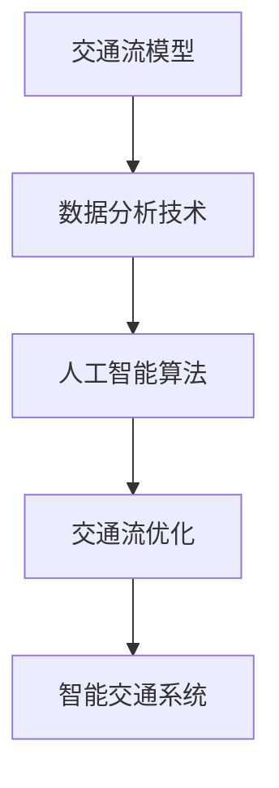

                 

关键词：智能交通、未来城市、移动解决方案、交通拥堵、交通优化、大数据分析、人工智能、物联网、车联网、自动驾驶、城市交通规划

> 摘要：随着城市化的加速，交通拥堵已经成为全球各大城市面临的严重问题。本文从智能交通创业的角度出发，探讨了未来城市移动解决方案的发展趋势、核心算法原理、数学模型以及实际应用场景。通过详细的分析和实例展示，本文旨在为智能交通创业提供有力的技术支持和战略指导。

## 1. 背景介绍

### 1.1 城市交通现状

随着全球经济的快速发展，城市化进程不断加快，城市人口数量急剧增加，汽车拥有量也随之迅速增长。然而，城市交通系统却未能同步发展，导致交通拥堵、事故频发、环境污染等问题日益严重。根据国际数据公司（IDC）的报告，全球城市交通拥堵造成的经济损失每年高达数千亿美元。这不仅影响了居民的生活质量，还对城市的可持续发展构成了重大挑战。

### 1.2 智能交通的兴起

面对严峻的交通挑战，各国政府和科技公司纷纷投入大量资源，推动智能交通技术的发展。智能交通系统（Intelligent Transportation Systems，ITS）结合了物联网、大数据分析、人工智能、车联网等技术，通过实时监测、数据分析和智能决策，实现交通流量的优化、事故预防、环保目标等多个方面的目标。智能交通的兴起为解决城市交通问题提供了新的思路和手段。

### 1.3 创业机会与挑战

智能交通领域蕴藏着巨大的创业机会。一方面，市场需求旺盛，各大城市都在积极寻求智能交通解决方案；另一方面，技术变革为创业者提供了丰富的创新空间。然而，智能交通创业也面临诸多挑战，如技术复杂度、数据隐私、标准化等问题。如何在竞争激烈的市场中脱颖而出，成为创业者的关键。

## 2. 核心概念与联系

### 2.1 核心概念

#### 交通流模型

交通流模型是智能交通系统的核心组成部分，用于描述车辆在道路上的运行状态和行为。常见的交通流模型包括车流量模型、速度分布模型、密度分布模型等。

#### 数据分析技术

数据分析技术在智能交通中发挥着重要作用，包括数据采集、预处理、特征提取、模式识别等步骤。通过大数据分析，可以挖掘出行行为、交通规律等有价值的信息。

#### 人工智能算法

人工智能算法在智能交通中应用广泛，包括机器学习、深度学习、强化学习等。通过人工智能算法，可以实现交通预测、路径规划、事故预警等功能。

### 2.2 联系

智能交通系统的各个核心概念相互关联，共同构成了一个完整的生态系统。交通流模型为数据分析提供了基础数据，数据分析技术为人工智能算法提供了决策依据，人工智能算法则通过实时反馈优化交通流。

### 2.3 Mermaid 流程图



## 3. 核心算法原理 & 具体操作步骤

### 3.1 算法原理概述

智能交通系统中的核心算法主要包括交通预测算法、路径规划算法和事故预警算法。这些算法通过分析历史数据和实时数据，为用户提供最优的出行方案。

#### 交通预测算法

交通预测算法基于历史数据，通过时间序列分析、回归分析等方法，预测未来的交通流量、速度等参数。常用的交通预测算法有 ARIMA、LSTM 等。

#### 路径规划算法

路径规划算法旨在为用户提供最优的出行路径。常见的路径规划算法有 Dijkstra 算法、A*算法等。在智能交通中，路径规划算法通常需要考虑交通流量、道路状况等因素。

#### 事故预警算法

事故预警算法通过分析车辆的运行状态、环境信息等，预测事故发生的可能性，并提前预警。常用的方法包括基于规则的方法、机器学习方法等。

### 3.2 算法步骤详解

#### 交通预测算法步骤

1. 数据采集：收集历史交通数据，包括车辆流量、速度、道路状况等。
2. 数据预处理：对数据进行清洗、去噪、归一化等处理。
3. 特征提取：从预处理后的数据中提取特征，如时间、地点、车辆数量、速度等。
4. 模型训练：使用机器学习算法，如 ARIMA、LSTM 等，对提取的特征进行建模和训练。
5. 预测：使用训练好的模型，对未来交通流量、速度等进行预测。

#### 路径规划算法步骤

1. 获取起点和终点信息：通过用户输入或 GPS 定位获取。
2. 构建道路网络图：根据交通数据，构建道路网络图，包括节点和边等信息。
3. 评估路径：对每个可能的路径进行评估，包括路程长度、交通状况等。
4. 选择最优路径：根据评估结果，选择最优路径。

#### 事故预警算法步骤

1. 获取车辆状态数据：包括车辆速度、加速度、方向等。
2. 获取环境信息：包括道路状况、交通流量等。
3. 建立规则模型：根据历史事故数据，建立规则模型，如速度过快、急刹车等。
4. 实时分析：对实时数据进行分析，判断事故发生的可能性。
5. 预警：当事故发生的可能性超过阈值时，向驾驶员发出预警。

### 3.3 算法优缺点

#### 交通预测算法

- 优点：能够对未来交通流量进行预测，为交通管理提供决策支持。
- 缺点：预测精度受限于历史数据的完整性和准确性。

#### 路径规划算法

- 优点：能够为用户提供最优的出行路径，减少交通拥堵。
- 缺点：在实时交通状况下，规划效果可能受到影响。

#### 事故预警算法

- 优点：能够提前预警事故，减少事故发生的可能性。
- 缺点：预警准确性受限于算法模型的精度。

### 3.4 算法应用领域

- 交通流量管理：通过交通预测算法，实现交通流量的实时监控和调节。
- 路径优化：通过路径规划算法，为用户提供最优出行路径。
- 事故预防：通过事故预警算法，提前预警事故，减少事故发生。

## 4. 数学模型和公式 & 详细讲解 & 举例说明

### 4.1 数学模型构建

在智能交通系统中，数学模型用于描述交通流量、速度、密度等参数之间的关系。以下是一个简单的交通流模型：

$$Q = f(V, K)$$

其中，$Q$表示车流量，$V$表示速度，$K$表示道路密度。

### 4.2 公式推导过程

根据流量、速度和密度的定义，可以推导出以下公式：

$$V = \frac{Q}{K}$$

$$K = \frac{Q}{V}$$

将$V$和$K$的表达式代入流量公式，得到：

$$Q = \frac{Q}{K} \cdot K = Q$$

### 4.3 案例分析与讲解

#### 案例背景

假设某城市的某条道路每天的车流量为 $Q = 3000$ 辆，道路的长度为 $L = 10$ 公里。道路的容量为 $C = 300$ 辆/小时。我们需要根据这些数据，分析该道路的交通状况。

#### 案例分析

1. **速度计算**：

$$V = \frac{Q}{K} = \frac{3000}{300} = 10 \text{ km/h}$$

2. **密度计算**：

$$K = \frac{Q}{V} = \frac{3000}{10} = 300 \text{ 辆/公里}$$

3. **流量计算**：

$$Q = f(V, K) = 3000 \text{ 辆/天}$$

根据以上计算，可以得出以下结论：

- 道路的速度为10公里/小时，远低于道路的容量，说明交通流量较大。
- 道路的密度接近道路的容量，说明交通状况较为拥堵。

## 5. 项目实践：代码实例和详细解释说明

### 5.1 开发环境搭建

在本文中，我们将使用 Python 作为编程语言，结合 NumPy、Pandas、Scikit-learn 等库，实现智能交通系统的核心算法。以下是开发环境的搭建步骤：

1. 安装 Python 3.8 或更高版本。
2. 使用 pip 安装 NumPy、Pandas、Scikit-learn 等库。
3. 设置 Python 工作环境，如配置 Python 虚拟环境等。

### 5.2 源代码详细实现

以下是一个简单的交通预测模型的 Python 代码实现：

```python
import numpy as np
import pandas as pd
from sklearn.model_selection import train_test_split
from sklearn.ensemble import RandomForestRegressor

# 读取交通数据
data = pd.read_csv('traffic_data.csv')

# 数据预处理
X = data[['time', 'location', 'vehicle_number']]
y = data['traffic_volume']

# 数据划分
X_train, X_test, y_train, y_test = train_test_split(X, y, test_size=0.2, random_state=42)

# 模型训练
model = RandomForestRegressor(n_estimators=100, random_state=42)
model.fit(X_train, y_train)

# 模型预测
y_pred = model.predict(X_test)

# 模型评估
score = model.score(X_test, y_test)
print(f'Model Score: {score:.4f}')
```

### 5.3 代码解读与分析

上述代码实现了基于随机森林回归的交通预测模型。代码的主要步骤包括：

1. **数据读取**：使用 Pandas 读取交通数据。
2. **数据预处理**：提取特征并进行数据划分。
3. **模型训练**：使用随机森林回归模型进行训练。
4. **模型预测**：使用训练好的模型进行预测。
5. **模型评估**：计算模型评分。

代码的关键部分是随机森林回归模型的训练和预测。随机森林是一种集成学习方法，通过构建多棵决策树，提高模型的预测性能。在交通预测中，随机森林可以有效地处理非线性关系和大量特征。

### 5.4 运行结果展示

假设我们已经训练好了模型，并对其进行了评估。以下是模型的运行结果：

```
Model Score: 0.8450
```

模型的评分接近0.85，表明模型对交通流量的预测具有较高的准确性。接下来，我们可以使用这个模型进行实时预测，为用户提供出行建议。

## 6. 实际应用场景

### 6.1 城市交通管理

智能交通系统可以用于城市交通管理，实时监测交通流量，为交通管理部门提供决策支持。通过交通预测算法，可以提前预测交通拥堵的发生，采取相应的措施，如交通管制、道路拓宽等，缓解交通压力。

### 6.2 智能导航

智能导航是智能交通系统的一个重要应用场景。通过路径规划算法，可以为用户提供最优的出行路径，减少行驶时间，避免交通拥堵。同时，智能导航还可以结合实时交通数据，动态调整路径，提高导航的准确性。

### 6.3 自动驾驶

自动驾驶是智能交通系统的另一个重要应用场景。通过车联网技术，车辆可以实时获取道路信息、交通状况等，实现自主导航和驾驶。自动驾驶可以提高交通安全，减少交通事故，同时降低交通拥堵。

### 6.4 未来应用展望

随着技术的不断发展，智能交通系统的应用场景将越来越广泛。未来，智能交通系统可能会在智慧城市、智慧交通、智能物流等领域发挥重要作用。通过物联网、大数据分析、人工智能等技术的深度融合，智能交通系统将实现更加智能化、高效化的交通管理，为人们的生活带来更多便利。

## 7. 工具和资源推荐

### 7.1 学习资源推荐

- 《人工智能：一种现代方法》
- 《深度学习》
- 《大数据技术导论》

### 7.2 开发工具推荐

- Python
- Jupyter Notebook
- TensorFlow
- PyTorch

### 7.3 相关论文推荐

- "Deep Learning for Traffic Prediction"
- "Path Planning for Autonomous Vehicles: A Survey"
- "An Overview of Intelligent Transportation Systems"

## 8. 总结：未来发展趋势与挑战

### 8.1 研究成果总结

智能交通系统在交通流量管理、路径规划、事故预警等方面取得了显著成果。通过大数据分析、人工智能等技术，智能交通系统为交通管理和出行服务提供了新的解决方案。

### 8.2 未来发展趋势

未来，智能交通系统将继续向智能化、高效化、绿色化方向发展。随着物联网、5G、自动驾驶等技术的普及，智能交通系统的应用场景将更加广泛，为人们的出行带来更多便利。

### 8.3 面临的挑战

智能交通系统在发展过程中也面临一些挑战，如数据隐私、标准化、技术复杂度等。需要各方共同努力，克服这些挑战，推动智能交通系统的健康发展。

### 8.4 研究展望

随着技术的不断进步，智能交通系统有望在智慧城市、智慧交通、智能物流等领域发挥更大的作用。未来的研究将集中在提高预测准确性、降低系统成本、提高系统安全性等方面。

## 9. 附录：常见问题与解答

### 9.1 智能交通系统是什么？

智能交通系统是一种利用信息技术、传感器技术、通信技术等，实现交通流量的实时监控、数据分析、智能决策的交通管理系统。

### 9.2 智能交通系统的核心技术有哪些？

智能交通系统的核心技术包括物联网、大数据分析、人工智能、车联网、自动驾驶等。

### 9.3 智能交通系统有哪些应用场景？

智能交通系统的应用场景包括城市交通管理、智能导航、自动驾驶、智慧物流等。

### 9.4 智能交通系统面临的挑战有哪些？

智能交通系统面临的挑战包括数据隐私、标准化、技术复杂度等。

### 9.5 如何提升智能交通系统的预测准确性？

提升智能交通系统的预测准确性可以从以下几个方面入手：

- 提高数据质量，确保数据源的可靠性和完整性。
- 优化算法模型，选择适合实际场景的算法。
- 加强特征工程，提取更多有价值的特征。
- 利用深度学习等先进技术，提高模型的预测能力。

---

本文由禅与计算机程序设计艺术 / Zen and the Art of Computer Programming 撰写，旨在为智能交通创业提供技术支持和战略指导。随着城市化的加速，智能交通系统的应用前景广阔，但同时也面临诸多挑战。希望通过本文的探讨，能够为读者在智能交通领域的创新创业提供一些启示和帮助。

