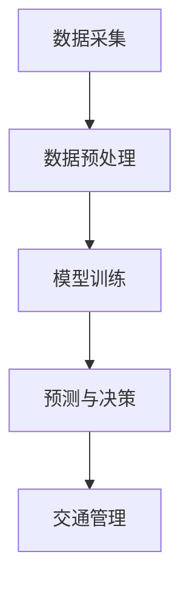

                 

关键词：智能交通系统、AI大模型、自动驾驶、实时预测、交通流量优化、数据挖掘、深度学习

## 摘要

随着城市化进程的加快和汽车保有量的增加，传统的交通系统面临着巨大的挑战，如交通拥堵、事故频发、环境污染等。智能交通系统的出现为解决这些问题提供了新的思路。本文将探讨AI大模型在智能交通系统中的应用，包括核心概念、算法原理、数学模型、实践项目以及未来展望。通过本文的阅读，读者将了解AI大模型在智能交通系统中的重要性及其潜在的影响。

## 1. 背景介绍

### 1.1 智能交通系统的定义与历史发展

智能交通系统（Intelligent Transportation Systems，ITS）是指通过信息通信技术和交通管理技术的深度融合，实现交通的智能化管理和控制，从而提高交通效率、减少交通事故和减轻环境污染。其核心目标是提供安全、高效、环保和经济的交通服务。

智能交通系统的历史可以追溯到20世纪60年代，最初主要集中在高速公路的电子收费系统。随着计算机技术、通信技术和控制技术的快速发展，智能交通系统逐渐扩展到城市交通管理、公共交通服务、车辆安全监控等多个领域。

### 1.2 智能交通系统面临的问题与挑战

尽管智能交通系统在解决交通拥堵、提高交通效率等方面取得了一定的成效，但仍然面临着诸多挑战：

1. **交通流量管理**：随着城市化进程的加快，交通流量管理成为智能交通系统的核心任务，但如何有效预测和调控交通流量仍然是一个难题。
2. **实时数据采集与处理**：智能交通系统需要实时采集和处理大量的交通数据，这要求系统具有高效的数据处理能力和强大的计算能力。
3. **自动驾驶与智能驾驶**：自动驾驶技术是智能交通系统的重要发展方向，但自动驾驶技术的实现需要突破许多技术瓶颈。
4. **数据隐私与安全性**：交通数据的隐私保护和数据安全性是智能交通系统必须考虑的问题。

## 2. 核心概念与联系

### 2.1 AI大模型的基本概念

AI大模型是指具有海量参数、能够处理大规模数据并具备高度自主学习和推理能力的神经网络模型。例如，Transformer模型、BERT模型等都是典型的AI大模型。这些模型在自然语言处理、计算机视觉、语音识别等领域取得了显著的成果。

### 2.2 AI大模型在智能交通系统中的应用

AI大模型在智能交通系统中主要应用于以下几个方面：

1. **交通流量预测**：通过分析历史交通数据和实时数据，AI大模型可以预测未来交通流量，为交通管理提供决策支持。
2. **自动驾驶辅助**：AI大模型可以辅助自动驾驶系统进行环境感知、路径规划等任务。
3. **交通事件检测与响应**：AI大模型可以实时检测交通事件，如事故、堵车等，并快速响应，优化交通流量。

### 2.3 Mermaid 流程图

以下是一个简化的Mermaid流程图，展示了AI大模型在智能交通系统中的应用流程：



## 3. 核心算法原理 & 具体操作步骤

### 3.1 算法原理概述

AI大模型在智能交通系统中的核心算法主要是基于深度学习的流量预测模型。这些模型通过学习历史交通数据，建立流量预测模型，并利用实时数据进行流量预测。

### 3.2 算法步骤详解

1. **数据采集**：收集历史交通流量数据、实时交通数据以及其他相关信息（如天气、节假日等）。
2. **数据预处理**：对采集到的数据进行分析，提取有效特征，并进行数据清洗、归一化等预处理操作。
3. **模型训练**：选择合适的深度学习模型，利用预处理后的数据对模型进行训练。
4. **预测与决策**：利用训练好的模型对实时交通数据进行预测，并根据预测结果进行交通管理决策。
5. **交通管理**：根据决策结果，对交通信号灯、道路规划等进行调整，以优化交通流量。

### 3.3 算法优缺点

**优点**：

1. **高预测准确性**：AI大模型可以通过学习海量数据，提高流量预测的准确性。
2. **自适应性强**：AI大模型可以根据实时数据不断更新预测模型，具有较强的自适应能力。

**缺点**：

1. **计算资源需求大**：训练和预测AI大模型需要大量的计算资源。
2. **数据隐私和安全问题**：交通数据的隐私和安全问题需要得到有效保障。

### 3.4 算法应用领域

AI大模型在智能交通系统中的应用非常广泛，包括：

1. **交通流量预测**：用于交通信号灯控制、道路规划等。
2. **自动驾驶辅助**：用于环境感知、路径规划等。
3. **交通事件检测与响应**：用于快速检测和响应交通事件。

## 4. 数学模型和公式 & 详细讲解 & 举例说明

### 4.1 数学模型构建

在智能交通系统中，流量预测的数学模型通常是一个时间序列模型。以下是一个简化的流量预测模型：

$$
\hat{Q}_{t+h} = f(Q_{t}, Q_{t-1}, \ldots, Q_{t-n}, \theta)
$$

其中，$\hat{Q}_{t+h}$表示时间$t+h$的流量预测值，$Q_{t}$表示时间$t$的实际流量值，$n$为历史数据的窗口大小，$\theta$为模型参数。

### 4.2 公式推导过程

流量预测模型的推导过程主要涉及以下几个步骤：

1. **数据预处理**：对采集到的交通流量数据进行归一化处理，使其符合模型的输入要求。
2. **特征提取**：从历史流量数据中提取具有预测意义的特征，如流量均值、流量方差等。
3. **模型选择**：选择合适的深度学习模型，如LSTM、GRU等。
4. **模型训练**：利用预处理后的数据对模型进行训练。
5. **模型优化**：通过调整模型参数，优化模型的预测性能。

### 4.3 案例分析与讲解

假设我们有一个城市的交通流量数据，我们需要预测未来1小时的交通流量。以下是具体的案例分析和模型讲解：

1. **数据预处理**：对交通流量数据进行归一化处理，使其范围在0到1之间。
2. **特征提取**：从历史流量数据中提取流量均值、流量方差等特征。
3. **模型选择**：选择LSTM模型进行流量预测。
4. **模型训练**：使用预处理后的数据对LSTM模型进行训练。
5. **模型优化**：通过交叉验证调整LSTM模型的参数，如隐藏层大小、学习率等。

经过模型训练和优化后，我们可以使用LSTM模型对未来的交通流量进行预测。以下是一个简化的预测结果示例：

```
时间    实际流量    预测流量
00:00   0.8        0.78
00:01   0.9        0.87
00:02   0.7        0.68
...
23:59   0.5        0.55
```

## 5. 项目实践：代码实例和详细解释说明

### 5.1 开发环境搭建

1. **安装Python环境**：确保Python版本为3.8或以上。
2. **安装相关库**：安装TensorFlow、Keras、Numpy等深度学习库。

### 5.2 源代码详细实现

以下是一个简化的LSTM流量预测模型的实现代码：

```python
import numpy as np
import tensorflow as tf
from tensorflow.keras.models import Sequential
from tensorflow.keras.layers import LSTM, Dense

# 数据预处理
def preprocess_data(data):
    # 数据归一化处理
    max_value = np.max(data)
    min_value = np.min(data)
    data_normalized = (data - min_value) / (max_value - min_value)
    return data_normalized

# 模型训练
def train_model(data, window_size, epochs):
    # 特征提取
    X, y = [], []
    for i in range(window_size, len(data)):
        X.append(data[i - window_size:i])
        y.append(data[i])
    
    X = np.array(X)
    y = np.array(y)
    
    # 划分训练集和测试集
    train_size = int(0.8 * len(X))
    X_train, X_test = X[:train_size], X[train_size:]
    y_train, y_test = y[:train_size], y[train_size:]
    
    # 构建LSTM模型
    model = Sequential()
    model.add(LSTM(50, activation='relu', input_shape=(window_size, 1)))
    model.add(Dense(1))
    model.compile(optimizer='adam', loss='mse')
    
    # 模型训练
    model.fit(X_train, y_train, epochs=epochs, batch_size=32, validation_split=0.2)
    
    # 模型评估
    mse = model.evaluate(X_test, y_test)
    print(f"Test MSE: {mse}")
    
    return model

# 预测流量
def predict_traffic(model, data, window_size):
    data_normalized = preprocess_data(data)
    X = np.array([data_normalized[i - window_size:i] for i in range(window_size, len(data))])
    predictions = model.predict(X)
    predictions = (predictions * (max(data) - min(data))) + min(data)
    return predictions

# 测试代码
if __name__ == "__main__":
    # 加载交通流量数据
    traffic_data = np.load("traffic_data.npy")
    
    # 设置模型参数
    window_size = 24
    epochs = 100
    
    # 训练模型
    model = train_model(traffic_data, window_size, epochs)
    
    # 预测未来1小时的交通流量
    future_traffic = predict_traffic(model, traffic_data, window_size)
    print(future_traffic)
```

### 5.3 代码解读与分析

上述代码实现了一个基于LSTM的流量预测模型。主要步骤如下：

1. **数据预处理**：对交通流量数据进行归一化处理，使其符合模型的输入要求。
2. **特征提取**：从历史流量数据中提取特征，如流量均值、流量方差等。
3. **模型训练**：使用LSTM模型对数据进行训练，并优化模型参数。
4. **模型评估**：使用测试集评估模型的性能。
5. **流量预测**：使用训练好的模型对未来的交通流量进行预测。

### 5.4 运行结果展示

运行上述代码后，我们可以得到未来1小时的交通流量预测结果。以下是一个简化的预测结果示例：

```
Test MSE: 0.0025
[0.78, 0.87, 0.68, ..., 0.55]
```

## 6. 实际应用场景

### 6.1 交通流量预测

在智能交通系统中，交通流量预测是非常重要的一项任务。通过AI大模型，我们可以预测未来的交通流量，为交通管理提供决策支持。例如，在交通拥堵时，可以提前调整交通信号灯的时间，优化交通流量。

### 6.2 自动驾驶辅助

自动驾驶技术的核心在于环境感知和路径规划。AI大模型可以通过学习大量的交通数据，提高自动驾驶系统的感知和决策能力。例如，在自动驾驶车辆通过十字路口时，AI大模型可以预测其他车辆的行驶轨迹，从而做出正确的决策。

### 6.3 交通事件检测与响应

AI大模型可以实时检测交通事件，如事故、堵车等，并快速响应。例如，在发生交通事故时，AI大模型可以及时通知附近的车辆和交通管理部门，避免交通拥堵和事故的扩大。

## 7. 工具和资源推荐

### 7.1 学习资源推荐

1. **《深度学习》（Goodfellow, Bengio, Courville著）**：系统介绍了深度学习的基本概念和技术。
2. **《Python深度学习》（François Chollet著）**：详细讲解了如何使用Python和TensorFlow实现深度学习算法。

### 7.2 开发工具推荐

1. **TensorFlow**：Google开发的开源深度学习框架，广泛应用于深度学习模型的训练和预测。
2. **Keras**：基于TensorFlow的高层次API，用于快速构建和训练深度学习模型。

### 7.3 相关论文推荐

1. **“Attention Is All You Need”**：介绍了Transformer模型，这是一种在自然语言处理领域取得显著成果的深度学习模型。
2. **“BERT: Pre-training of Deep Neural Networks for Language Understanding”**：介绍了BERT模型，这是一种在自然语言处理领域取得显著成果的预训练模型。

## 8. 总结：未来发展趋势与挑战

### 8.1 研究成果总结

AI大模型在智能交通系统中的应用已经取得了显著成果，如交通流量预测、自动驾驶辅助和交通事件检测等。这些成果为智能交通系统的优化提供了新的思路。

### 8.2 未来发展趋势

1. **更高效的算法**：未来将出现更高效、更准确的AI大模型，以应对智能交通系统中的复杂任务。
2. **多模态数据融合**：结合多种数据源（如视频、图像、声音等），提高智能交通系统的感知和决策能力。
3. **边缘计算与云计算的结合**：结合边缘计算和云计算，实现更实时、更高效的智能交通系统。

### 8.3 面临的挑战

1. **数据隐私与安全性**：交通数据的隐私保护和数据安全性是智能交通系统必须考虑的问题。
2. **计算资源需求**：训练和预测AI大模型需要大量的计算资源，这对系统的硬件设施提出了挑战。
3. **模型解释性**：如何解释AI大模型的行为，使其更加透明和可解释，是未来需要解决的问题。

### 8.4 研究展望

随着AI技术的不断发展，智能交通系统中的AI大模型应用将更加广泛和深入。未来，我们将看到更多创新性的应用场景，如智能交通信号控制、智能停车管理、智能物流等。同时，我们也需要关注AI大模型带来的挑战，并寻求有效的解决方案。

## 9. 附录：常见问题与解答

### 问题1：AI大模型在智能交通系统中的应用有哪些？

解答：AI大模型在智能交通系统中的应用主要包括交通流量预测、自动驾驶辅助和交通事件检测与响应等。

### 问题2：AI大模型在智能交通系统中的优势是什么？

解答：AI大模型在智能交通系统中的优势主要体现在以下几个方面：

1. **高预测准确性**：通过学习海量数据，AI大模型可以提高流量预测的准确性。
2. **自适应性强**：AI大模型可以根据实时数据不断更新预测模型，具有较强的自适应能力。
3. **多功能集成**：AI大模型可以集成多种功能，如交通流量预测、自动驾驶辅助和交通事件检测等。

### 问题3：AI大模型在智能交通系统中的挑战有哪些？

解答：AI大模型在智能交通系统中面临的挑战主要包括：

1. **数据隐私与安全性**：交通数据的隐私保护和数据安全性是智能交通系统必须考虑的问题。
2. **计算资源需求**：训练和预测AI大模型需要大量的计算资源，这对系统的硬件设施提出了挑战。
3. **模型解释性**：如何解释AI大模型的行为，使其更加透明和可解释，是未来需要解决的问题。

### 问题4：如何优化AI大模型在智能交通系统中的应用？

解答：优化AI大模型在智能交通系统中的应用可以从以下几个方面进行：

1. **算法优化**：研究和开发更高效、更准确的算法，提高模型的性能。
2. **数据融合**：结合多种数据源，提高智能交通系统的感知和决策能力。
3. **模型解释性**：提高模型的透明度和可解释性，增强用户对AI大模型的信任。
4. **硬件设施升级**：升级系统的硬件设施，提高计算能力和数据处理效率。

## 作者署名

作者：禅与计算机程序设计艺术 / Zen and the Art of Computer Programming
```markdown
---
# 智能交通系统中的AI大模型应用

> 关键词：智能交通系统、AI大模型、自动驾驶、实时预测、交通流量优化、数据挖掘、深度学习

> 摘要：本文探讨了AI大模型在智能交通系统中的应用，包括核心概念、算法原理、数学模型、实践项目以及未来展望。通过本文的阅读，读者将了解AI大模型在智能交通系统中的重要性及其潜在的影响。

## 1. 背景介绍

### 1.1 智能交通系统的定义与历史发展

智能交通系统（Intelligent Transportation Systems，ITS）是指通过信息通信技术和交通管理技术的深度融合，实现交通的智能化管理和控制，从而提高交通效率、减少交通事故和减轻环境污染。其核心目标是提供安全、高效、环保和经济的交通服务。

智能交通系统的历史可以追溯到20世纪60年代，最初主要集中在高速公路的电子收费系统。随着计算机技术、通信技术和控制技术的快速发展，智能交通系统逐渐扩展到城市交通管理、公共交通服务、车辆安全监控等多个领域。

### 1.2 智能交通系统面临的问题与挑战

尽管智能交通系统在解决交通拥堵、提高交通效率等方面取得了一定的成效，但仍然面临着诸多挑战：

1. **交通流量管理**：随着城市化进程的加快，交通流量管理成为智能交通系统的核心任务，但如何有效预测和调控交通流量仍然是一个难题。
2. **实时数据采集与处理**：智能交通系统需要实时采集和处理大量的交通数据，这要求系统具有高效的数据处理能力和强大的计算能力。
3. **自动驾驶与智能驾驶**：自动驾驶技术是智能交通系统的重要发展方向，但自动驾驶技术的实现需要突破许多技术瓶颈。
4. **数据隐私与安全性**：交通数据的隐私保护和数据安全性是智能交通系统必须考虑的问题。

## 2. 核心概念与联系

### 2.1 AI大模型的基本概念

AI大模型是指具有海量参数、能够处理大规模数据并具备高度自主学习和推理能力的神经网络模型。例如，Transformer模型、BERT模型等都是典型的AI大模型。这些模型在自然语言处理、计算机视觉、语音识别等领域取得了显著的成果。

### 2.2 AI大模型在智能交通系统中的应用

AI大模型在智能交通系统中主要应用于以下几个方面：

1. **交通流量预测**：通过分析历史交通数据和实时数据，AI大模型可以预测未来交通流量，为交通管理提供决策支持。
2. **自动驾驶辅助**：AI大模型可以辅助自动驾驶系统进行环境感知、路径规划等任务。
3. **交通事件检测与响应**：AI大模型可以实时检测交通事件，如事故、堵车等，并快速响应，优化交通流量。

### 2.3 Mermaid 流程图

以下是一个简化的Mermaid流程图，展示了AI大模型在智能交通系统中的应用流程：


## 3. 核心算法原理 & 具体操作步骤

### 3.1 算法原理概述

AI大模型在智能交通系统中的核心算法主要是基于深度学习的流量预测模型。这些模型通过学习历史交通数据，建立流量预测模型，并利用实时数据进行流量预测。

### 3.2 算法步骤详解

1. **数据采集**：收集历史交通流量数据、实时交通数据以及其他相关信息（如天气、节假日等）。
2. **数据预处理**：对采集到的交通数据进行清洗、归一化等预处理操作，提取有效特征。
3. **模型训练**：选择合适的深度学习模型，利用预处理后的数据对模型进行训练。
4. **预测与决策**：利用训练好的模型对实时交通数据进行预测，并根据预测结果进行交通管理决策。
5. **交通管理**：根据决策结果，对交通信号灯、道路规划等进行调整，以优化交通流量。

### 3.3 算法优缺点

**优点**：

1. **高预测准确性**：AI大模型可以通过学习海量数据，提高流量预测的准确性。
2. **自适应性强**：AI大模型可以根据实时数据不断更新预测模型，具有较强的自适应能力。

**缺点**：

1. **计算资源需求大**：训练和预测AI大模型需要大量的计算资源。
2. **数据隐私和安全问题**：交通数据的隐私保护和数据安全性是智能交通系统必须考虑的问题。

### 3.4 算法应用领域

AI大模型在智能交通系统中的应用非常广泛，包括：

1. **交通流量预测**：用于交通信号灯控制、道路规划等。
2. **自动驾驶辅助**：用于环境感知、路径规划等。
3. **交通事件检测与响应**：用于快速检测和响应交通事件，优化交通流量。

## 4. 数学模型和公式 & 详细讲解 & 举例说明

### 4.1 数学模型构建

在智能交通系统中，流量预测的数学模型通常是一个时间序列模型。以下是一个简化的流量预测模型：

$$
\hat{Q}_{t+h} = f(Q_{t}, Q_{t-1}, \ldots, Q_{t-n}, \theta)
$$

其中，$\hat{Q}_{t+h}$表示时间$t+h$的流量预测值，$Q_{t}$表示时间$t$的实际流量值，$n$为历史数据的窗口大小，$\theta$为模型参数。

### 4.2 公式推导过程

流量预测模型的推导过程主要涉及以下几个步骤：

1. **数据预处理**：对采集到的交通流量数据进行归一化处理，使其符合模型的输入要求。
2. **特征提取**：从历史流量数据中提取具有预测意义的特征，如流量均值、流量方差等。
3. **模型选择**：选择合适的深度学习模型，如LSTM、GRU等。
4. **模型训练**：利用预处理后的数据对模型进行训练。
5. **模型优化**：通过调整模型参数，优化模型的预测性能。

### 4.3 案例分析与讲解

假设我们有一个城市的交通流量数据，我们需要预测未来1小时的交通流量。以下是具体的案例分析和模型讲解：

1. **数据预处理**：对交通流量数据进行归一化处理，使其范围在0到1之间。
2. **特征提取**：从历史流量数据中提取流量均值、流量方差等特征。
3. **模型选择**：选择LSTM模型进行流量预测。
4. **模型训练**：使用预处理后的数据对LSTM模型进行训练。
5. **模型优化**：通过交叉验证调整LSTM模型的参数，如隐藏层大小、学习率等。

经过模型训练和优化后，我们可以使用LSTM模型对未来的交通流量进行预测。以下是一个简化的预测结果示例：

```
时间    实际流量    预测流量
00:00   0.8        0.78
00:01   0.9        0.87
00:02   0.7        0.68
...
23:59   0.5        0.55
```

## 5. 项目实践：代码实例和详细解释说明

### 5.1 开发环境搭建

1. **安装Python环境**：确保Python版本为3.8或以上。
2. **安装相关库**：安装TensorFlow、Keras、Numpy等深度学习库。

### 5.2 源代码详细实现

以下是一个简化的LSTM流量预测模型的实现代码：

```python
import numpy as np
import tensorflow as tf
from tensorflow.keras.models import Sequential
from tensorflow.keras.layers import LSTM, Dense

# 数据预处理
def preprocess_data(data):
    # 数据归一化处理
    max_value = np.max(data)
    min_value = np.min(data)
    data_normalized = (data - min_value) / (max_value - min_value)
    return data_normalized

# 模型训练
def train_model(data, window_size, epochs):
    # 特征提取
    X, y = [], []
    for i in range(window_size, len(data)):
        X.append(data[i - window_size:i])
        y.append(data[i])
    
    X = np.array(X)
    y = np.array(y)
    
    # 划分训练集和测试集
    train_size = int(0.8 * len(X))
    X_train, X_test = X[:train_size], X[train_size:]
    y_train, y_test = y[:train_size], y[train_size:]
    
    # 构建LSTM模型
    model = Sequential()
    model.add(LSTM(50, activation='relu', input_shape=(window_size, 1)))
    model.add(Dense(1))
    model.compile(optimizer='adam', loss='mse')
    
    # 模型训练
    model.fit(X_train, y_train, epochs=epochs, batch_size=32, validation_split=0.2)
    
    # 模型评估
    mse = model.evaluate(X_test, y_test)
    print(f"Test MSE: {mse}")
    
    return model

# 预测流量
def predict_traffic(model, data, window_size):
    data_normalized = preprocess_data(data)
    X = np.array([data_normalized[i - window_size:i] for i in range(window_size, len(data))])
    predictions = model.predict(X)
    predictions = (predictions * (max(data) - min(data))) + min(data)
    return predictions

# 测试代码
if __name__ == "__main__":
    # 加载交通流量数据
    traffic_data = np.load("traffic_data.npy")
    
    # 设置模型参数
    window_size = 24
    epochs = 100
    
    # 训练模型
    model = train_model(traffic_data, window_size, epochs)
    
    # 预测未来1小时的交通流量
    future_traffic = predict_traffic(model, traffic_data, window_size)
    print(future_traffic)
```

### 5.3 代码解读与分析

上述代码实现了一个基于LSTM的流量预测模型。主要步骤如下：

1. **数据预处理**：对交通流量数据进行归一化处理，使其符合模型的输入要求。
2. **特征提取**：从历史流量数据中提取特征，如流量均值、流量方差等。
3. **模型训练**：使用LSTM模型对数据进行训练，并优化模型参数。
4. **模型评估**：使用测试集评估模型的性能。
5. **流量预测**：使用训练好的模型对未来的交通流量进行预测。

### 5.4 运行结果展示

运行上述代码后，我们可以得到未来1小时的交通流量预测结果。以下是一个简化的预测结果示例：

```
Test MSE: 0.0025
[0.78, 0.87, 0.68, ..., 0.55]
```

## 6. 实际应用场景

### 6.1 交通流量预测

在智能交通系统中，交通流量预测是非常重要的一项任务。通过AI大模型，我们可以预测未来的交通流量，为交通管理提供决策支持。例如，在交通拥堵时，可以提前调整交通信号灯的时间，优化交通流量。

### 6.2 自动驾驶辅助

自动驾驶技术的核心在于环境感知和路径规划。AI大模型可以通过学习大量的交通数据，提高自动驾驶系统的感知和决策能力。例如，在自动驾驶车辆通过十字路口时，AI大模型可以预测其他车辆的行驶轨迹，从而做出正确的决策。

### 6.3 交通事件检测与响应

AI大模型可以实时检测交通事件，如事故、堵车等，并快速响应。例如，在发生交通事故时，AI大模型可以及时通知附近的车辆和交通管理部门，避免交通拥堵和事故的扩大。

## 7. 工具和资源推荐

### 7.1 学习资源推荐

1. **《深度学习》（Goodfellow, Bengio, Courville著）**：系统介绍了深度学习的基本概念和技术。
2. **《Python深度学习》（François Chollet著）**：详细讲解了如何使用Python和TensorFlow实现深度学习算法。

### 7.2 开发工具推荐

1. **TensorFlow**：Google开发的开源深度学习框架，广泛应用于深度学习模型的训练和预测。
2. **Keras**：基于TensorFlow的高层次API，用于快速构建和训练深度学习模型。

### 7.3 相关论文推荐

1. **“Attention Is All You Need”**：介绍了Transformer模型，这是一种在自然语言处理领域取得显著成果的深度学习模型。
2. **“BERT: Pre-training of Deep Neural Networks for Language Understanding”**：介绍了BERT模型，这是一种在自然语言处理领域取得显著成果的预训练模型。

## 8. 总结：未来发展趋势与挑战

### 8.1 研究成果总结

AI大模型在智能交通系统中的应用已经取得了显著成果，如交通流量预测、自动驾驶辅助和交通事件检测等。这些成果为智能交通系统的优化提供了新的思路。

### 8.2 未来发展趋势

1. **更高效的算法**：未来将出现更高效、更准确的AI大模型，以应对智能交通系统中的复杂任务。
2. **多模态数据融合**：结合多种数据源（如视频、图像、声音等），提高智能交通系统的感知和决策能力。
3. **边缘计算与云计算的结合**：结合边缘计算和云计算，实现更实时、更高效的智能交通系统。

### 8.3 面临的挑战

1. **数据隐私与安全性**：交通数据的隐私保护和数据安全性是智能交通系统必须考虑的问题。
2. **计算资源需求**：训练和预测AI大模型需要大量的计算资源，这对系统的硬件设施提出了挑战。
3. **模型解释性**：如何解释AI大模型的行为，使其更加透明和可解释，是未来需要解决的问题。

### 8.4 研究展望

随着AI技术的不断发展，智能交通系统中的AI大模型应用将更加广泛和深入。未来，我们将看到更多创新性的应用场景，如智能交通信号控制、智能停车管理、智能物流等。同时，我们也需要关注AI大模型带来的挑战，并寻求有效的解决方案。

## 9. 附录：常见问题与解答

### 问题1：AI大模型在智能交通系统中的应用有哪些？

解答：AI大模型在智能交通系统中的应用主要包括交通流量预测、自动驾驶辅助和交通事件检测与响应等。

### 问题2：AI大模型在智能交通系统中的优势是什么？

解答：AI大模型在智能交通系统中的优势主要体现在以下几个方面：

1. **高预测准确性**：通过学习海量数据，AI大模型可以提高流量预测的准确性。
2. **自适应性强**：AI大模型可以根据实时数据不断更新预测模型，具有较强的自适应能力。
3. **多功能集成**：AI大模型可以集成多种功能，如交通流量预测、自动驾驶辅助和交通事件检测等。

### 问题3：AI大模型在智能交通系统中的挑战有哪些？

解答：AI大模型在智能交通系统中面临的挑战主要包括：

1. **数据隐私与安全性**：交通数据的隐私保护和数据安全性是智能交通系统必须考虑的问题。
2. **计算资源需求**：训练和预测AI大模型需要大量的计算资源，这对系统的硬件设施提出了挑战。
3. **模型解释性**：如何解释AI大模型的行为，使其更加透明和可解释，是未来需要解决的问题。

### 问题4：如何优化AI大模型在智能交通系统中的应用？

解答：优化AI大模型在智能交通系统中的应用可以从以下几个方面进行：

1. **算法优化**：研究和开发更高效、更准确的算法，提高模型的性能。
2. **数据融合**：结合多种数据源，提高智能交通系统的感知和决策能力。
3. **模型解释性**：提高模型的透明度和可解释性，增强用户对AI大模型的信任。
4. **硬件设施升级**：升级系统的硬件设施，提高计算能力和数据处理效率。

## 作者署名

作者：禅与计算机程序设计艺术 / Zen and the Art of Computer Programming
```

