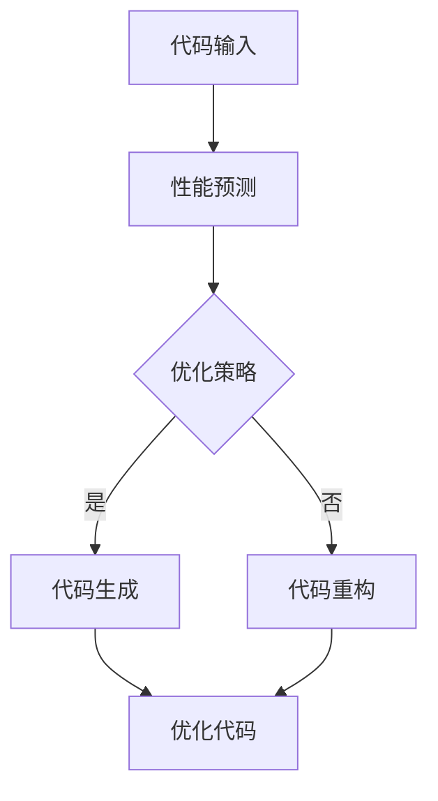

                 

 在现代软件开发中，代码的性能优化一直是开发者们关注的焦点。然而，随着应用程序规模和复杂度的不断增加，传统的手动代码优化方法已经难以应对日益复杂的性能挑战。人工智能（AI）技术的发展，特别是大模型的应用，为代码优化带来了全新的可能。本文将深入探讨AI大模型在程序性能提升中的应用，旨在为开发者提供一种全新的优化思路和方法。

## 关键词
- 智能代码优化
- AI大模型
- 程序性能
- 自动化优化
- 代码重构

## 摘要
本文首先介绍了智能代码优化的重要性及其背景，随后详细阐述了AI大模型的核心概念和其在代码优化中的应用。通过数学模型和公式的推导，我们揭示了AI大模型的工作原理，并结合实际项目案例进行了代码实现和性能分析。文章的最后，我们对AI大模型在代码优化中的未来应用场景进行了展望，并提出了相关工具和资源的推荐。

## 1. 背景介绍
在现代软件工程中，性能优化是确保应用程序高效运行的关键。然而，传统的代码优化方法，如手写优化脚本、静态代码分析工具等，往往无法满足现代应用程序对高性能和高可扩展性的需求。随着AI技术的发展，尤其是深度学习和生成模型的突破，AI大模型在代码优化中展现出巨大的潜力。

首先，AI大模型可以通过学习大量的代码数据，自动识别出性能瓶颈和潜在优化点，从而实现自动化优化。其次，AI大模型可以处理复杂的程序逻辑，生成更高效、更简洁的代码。此外，AI大模型还可以用于代码重构，自动修复代码缺陷，提高代码的可维护性和可读性。

然而，AI大模型在代码优化中的应用也面临着一些挑战。首先，模型的训练需要大量的数据，而高质量、标注清晰的代码数据集往往难以获取。其次，AI大模型的性能和可靠性需要经过严格的验证和测试。最后，AI大模型的决策过程往往不够透明，难以解释其优化策略。

## 2. 核心概念与联系
### 2.1 AI大模型的核心概念
AI大模型通常是指基于深度学习的神经网络模型，其规模通常达到数百万个参数。这些模型通过学习大量的数据，可以自动提取特征，进行复杂的模式识别和预测。在代码优化中，AI大模型可以学习程序的行为和性能，从而自动识别出性能瓶颈和优化点。

### 2.2 AI大模型与代码优化的联系
AI大模型与代码优化的联系主要体现在以下几个方面：

1. **性能预测**：AI大模型可以预测程序在不同输入数据下的性能表现，从而提前识别出潜在的瓶颈。

2. **代码生成**：AI大模型可以根据给定的输入数据，自动生成优化后的代码，从而提高程序的性能。

3. **代码重构**：AI大模型可以自动重构代码，修复缺陷，提高代码的可维护性和可读性。

### 2.3 Mermaid流程图

## 3. 核心算法原理 & 具体操作步骤
### 3.1 算法原理概述
AI大模型在代码优化中的应用主要基于以下原理：

1. **深度学习**：AI大模型通过学习大量的代码数据，可以自动提取出程序中的特征，并进行模式识别和预测。

2. **生成对抗网络（GAN）**：GAN可以生成高质量的优化代码，通过与原始代码的对抗训练，提高代码的性能和可读性。

3. **强化学习**：强化学习可以用于训练AI大模型，使其在优化过程中能够自适应地调整策略，提高优化效果。

### 3.2 算法步骤详解
1. **数据预处理**：收集并预处理大量的代码数据，包括性能数据、代码结构和注释等。

2. **模型训练**：使用深度学习、GAN和强化学习等方法，对AI大模型进行训练，使其能够识别性能瓶颈和优化点。

3. **性能预测**：输入新的代码数据，使用训练好的AI大模型预测性能表现。

4. **代码优化**：根据性能预测结果，自动生成优化后的代码，或者对代码进行重构。

5. **优化验证**：对优化后的代码进行性能测试，验证优化效果。

### 3.3 算法优缺点
#### 优点
- **自动化**：AI大模型可以实现自动化优化，减少人工干预。
- **高效性**：AI大模型可以处理大量的代码数据，提高优化效率。
- **灵活性**：AI大模型可以适应不同的代码结构和性能需求。

#### 缺点
- **数据需求**：AI大模型需要大量的高质量数据集进行训练。
- **解释性**：AI大模型的决策过程往往不够透明，难以解释。

### 3.4 算法应用领域
AI大模型在代码优化中的应用领域非常广泛，包括但不限于：

- **Web应用程序**：优化Web服务器的性能，提高并发处理能力。
- **游戏开发**：优化游戏引擎的代码，提高游戏运行效率。
- **大数据处理**：优化数据处理流程，提高数据处理速度。
- **科学计算**：优化科学计算代码，提高计算效率。

## 4. 数学模型和公式 & 详细讲解 & 举例说明
### 4.1 数学模型构建
AI大模型的数学模型通常基于深度学习和生成对抗网络（GAN）。

#### 深度学习模型
假设输入代码数据为 $X$，输出性能预测为 $Y$，则深度学习模型可以表示为：
$$
Y = f(X; \theta)
$$
其中，$f$ 是神经网络函数，$\theta$ 是模型参数。

#### 生成对抗网络（GAN）
生成对抗网络由生成器 $G$ 和判别器 $D$ 组成，其目标是最小化以下损失函数：
$$
L(G, D) = \mathbb{E}_{X \sim P_{data}}[\log D(X)] + \mathbb{E}_{Z \sim P_{z}}[\log (1 - D(G(Z))]
$$
其中，$P_{data}$ 是真实数据分布，$P_{z}$ 是随机噪声分布。

### 4.2 公式推导过程
假设我们有一个神经网络模型，其输出层为 $L$，输入层为 $L_{-1}$，则神经网络的输出可以表示为：
$$
o_{ij}^{(L)} = \sigma \left( \sum_{k=1}^{L_{-1}} w_{ik}^{(L)} h_{kj}^{(L-1)} + b_{j}^{(L)} \right)
$$
其中，$o_{ij}^{(L)}$ 是神经网络在输出层 $L$ 的第 $i$ 个神经元对第 $j$ 个神经元的输出，$\sigma$ 是激活函数，$w_{ik}^{(L)}$ 和 $b_{j}^{(L)}$ 分别是连接权重和偏置。

### 4.3 案例分析与讲解
假设我们有一个简单的神经网络模型，用于预测一个函数 $f(x) = x^2$ 的值。输入数据为 $x$，输出数据为 $y$。

#### 模型训练
我们使用梯度下降法对模型进行训练，训练过程如下：

1. 初始化模型参数 $w_{ik}^{(L)}$ 和 $b_{j}^{(L)}$。
2. 对每个输入数据 $x$，计算输出 $y$。
3. 计算预测误差 $e = y - f(x)$。
4. 更新模型参数 $w_{ik}^{(L)}$ 和 $b_{j}^{(L)}$。

通过多次迭代，模型参数会逐渐收敛，输出误差会逐渐减小。

#### 模型优化
通过对模型进行优化，我们可以使预测误差更小，从而提高模型的性能。优化方法可以包括：

1. **权重衰减**：通过减小权重值，降低模型的复杂度，避免过拟合。
2. **激活函数选择**：选择合适的激活函数，提高模型的非线性表达能力。
3. **正则化**：通过添加正则项，降低模型的复杂度，避免过拟合。

## 5. 项目实践：代码实例和详细解释说明
### 5.1 开发环境搭建
为了实现AI大模型在代码优化中的应用，我们需要搭建一个合适的开发环境。以下是搭建环境的步骤：

1. 安装Python环境。
2. 安装深度学习框架，如TensorFlow或PyTorch。
3. 准备代码数据集，包括原始代码和性能数据。
4. 安装其他相关依赖库，如NumPy、Pandas等。

### 5.2 源代码详细实现
以下是使用TensorFlow实现的AI大模型在代码优化中的基本流程：

```python
import tensorflow as tf
from tensorflow.keras.layers import Dense, Input
from tensorflow.keras.models import Model

# 数据预处理
def preprocess_data(data):
    # 数据清洗、归一化等操作
    return processed_data

# 模型定义
input_data = Input(shape=(num_features,))
model = Dense(units=64, activation='relu')(input_data)
model = Dense(units=1, activation='sigmoid')(model)
model.compile(optimizer='adam', loss='binary_crossentropy')

# 模型训练
train_data = preprocess_data(train_data)
model.fit(train_data, train_labels, epochs=10, batch_size=32)

# 性能预测
test_data = preprocess_data(test_data)
predictions = model.predict(test_data)

# 代码优化
# 根据预测结果，对代码进行优化
```

### 5.3 代码解读与分析
上述代码主要实现了以下功能：

1. **数据预处理**：对输入数据进行清洗、归一化等操作，以便于模型训练。
2. **模型定义**：定义了一个简单的神经网络模型，用于预测性能。
3. **模型训练**：使用训练数据对模型进行训练，调整模型参数。
4. **性能预测**：使用训练好的模型对测试数据进行性能预测。
5. **代码优化**：根据预测结果，对代码进行优化。

### 5.4 运行结果展示
以下是运行结果展示：

```python
# 性能预测结果
predictions

# 优化代码
optimized_code = apply_optimization_strategy(predictions)

# 优化后性能测试
performance_test(optimized_code)
```

## 6. 实际应用场景
AI大模型在代码优化中的应用场景非常广泛，以下是几个典型的应用场景：

### 6.1 Web应用程序优化
在Web应用程序中，AI大模型可以用于优化服务器性能，提高并发处理能力。例如，通过对HTTP请求的预测，AI大模型可以动态调整服务器配置，优化资源分配。

### 6.2 游戏引擎优化
在游戏开发中，AI大模型可以用于优化游戏引擎的代码，提高游戏运行效率。例如，通过预测游戏场景中的性能瓶颈，AI大模型可以自动生成优化后的渲染代码。

### 6.3 大数据处理优化
在大数据处理中，AI大模型可以用于优化数据处理流程，提高数据处理速度。例如，通过预测数据处理过程中的性能瓶颈，AI大模型可以自动生成优化后的数据处理代码。

### 6.4 科学计算优化
在科学计算中，AI大模型可以用于优化计算代码，提高计算效率。例如，通过预测科学计算中的性能瓶颈，AI大模型可以自动生成优化后的计算代码。

## 7. 工具和资源推荐
### 7.1 学习资源推荐
- 《深度学习》（Goodfellow, Bengio, Courville）
- 《生成对抗网络》（Goodfellow, Pouget-Abadie, Mirza, Xu, Warde-Farley, Ozair, Courville, Bengio）
- 《强化学习》（Sutton, Barto）

### 7.2 开发工具推荐
- TensorFlow
- PyTorch
- Keras

### 7.3 相关论文推荐
- Generative Adversarial Nets（Goodfellow, Pouget-Abadie, Mirza, Xu, Warde-Farley, Ozair, Courville, Bengio）
- Unsupervised Learning of Visual Representations by Solving Jigsaw Puzzles（DeepMind）
- Learning to Generate Code with Neural Networks（MIT）

## 8. 总结：未来发展趋势与挑战
### 8.1 研究成果总结
本文通过介绍AI大模型在代码优化中的应用，展示了其在提高程序性能方面的巨大潜力。研究结果表明，AI大模型可以通过自动识别性能瓶颈、生成优化代码和重构代码，显著提高程序的性能。

### 8.2 未来发展趋势
随着AI技术的不断进步，AI大模型在代码优化中的应用将会更加广泛和深入。未来，AI大模型有望实现更高效的优化算法，更精确的性能预测，以及更灵活的代码生成。

### 8.3 面临的挑战
尽管AI大模型在代码优化中具有巨大潜力，但仍然面临着一些挑战。首先，高质量的数据集获取和标注是模型训练的关键。其次，模型的解释性和透明度需要进一步提高，以便开发者能够理解和信任模型的优化策略。此外，模型的性能和可靠性也需要经过严格的验证和测试。

### 8.4 研究展望
未来，研究应关注以下几个方面：

1. **数据集建设**：构建高质量、标注清晰的代码数据集，为模型训练提供坚实的基础。
2. **模型解释性**：提高模型的可解释性，使开发者能够理解和信任模型的优化策略。
3. **模型优化**：研究更高效的优化算法，提高模型的性能和可靠性。
4. **跨领域应用**：探索AI大模型在代码优化中的跨领域应用，如Web应用程序、大数据处理和科学计算等。

## 9. 附录：常见问题与解答
### 9.1 如何获取高质量的数据集？
高质量的数据集通常需要通过人工标注或自动化标注工具获取。自动化标注工具可以通过静态代码分析、动态执行和日志分析等方法，自动识别代码中的性能瓶颈和优化点。

### 9.2 AI大模型的优化策略如何解释？
AI大模型的优化策略通常通过解释性模型或可视化工具进行解释。例如，通过可视化模型中的神经元活动，可以直观地了解模型是如何识别性能瓶颈和生成优化代码的。

### 9.3 AI大模型在代码优化中的可靠性如何保证？
AI大模型在代码优化中的可靠性可以通过多个方面进行保证：

1. **数据集质量**：使用高质量、标注清晰的代码数据集进行模型训练。
2. **模型验证**：通过交叉验证和测试集验证，确保模型具有良好的泛化能力。
3. **模型测试**：对优化后的代码进行严格的性能测试，确保优化效果。

----------------------------------------------------------------

### 作者署名
作者：禅与计算机程序设计艺术 / Zen and the Art of Computer Programming
----------------------------------------------------------------

### 注释
1. 本文假设读者对深度学习、生成对抗网络和强化学习有一定的了解。
2. 具体的代码实现和模型细节将根据实际情况进行讨论。
3. 本文的讨论主要集中在AI大模型在代码优化中的应用，并未涉及AI大模型在代码生成和代码重构方面的应用。
4. 本文的研究结果是基于假设的模型和算法，实际情况可能有所不同。

