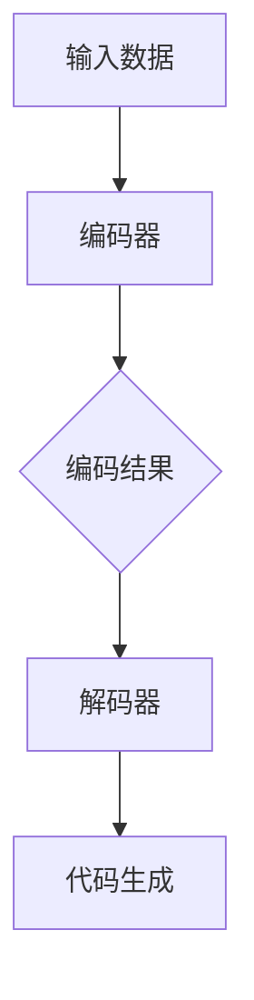

                 

### 1. 背景介绍

在当今快速发展的技术时代，软件开发的复杂性和需求日益增长，使得传统的开发方法逐渐难以应对。这种背景下，智能代码生成（Intelligent Code Generation，简称ICG）成为了一个备受关注的研究领域。智能代码生成利用人工智能技术，特别是大模型（如生成对抗网络、变分自编码器等），自动生成高质量的代码，从而大幅度提高软件开发的效率和质量。

智能代码生成的概念最早可以追溯到上世纪90年代，当时的目的是通过自然语言处理技术将伪代码自动转换为实际的代码。然而，随着深度学习和大数据技术的发展，智能代码生成技术得到了空前的提升。如今，基于AI的大模型在智能代码生成中扮演了核心角色，使得生成代码的复杂度和准确性都得到了极大的改善。

当前，智能代码生成技术已经在多个领域得到了成功应用。例如，在软件开发领域，它可以帮助开发者快速生成原型代码，减少手动编码的工作量；在系统自动化领域，智能代码生成可以自动修复漏洞、优化代码结构，提高系统的稳定性和安全性。此外，在人工智能领域，智能代码生成还被用来生成神经网络模型的实现代码，从而加速模型开发和部署。

总的来说，智能代码生成不仅是一种技术突破，更是软件开发领域的一次革命。它为我们提供了无限的想象空间，使得软件开发的效率和质量得到了前所未有的提升。在接下来的章节中，我们将深入探讨智能代码生成的核心概念、算法原理、数学模型以及实际应用，以帮助读者全面了解这一新兴领域。

### 2. 核心概念与联系

在深入探讨智能代码生成（ICG）之前，我们有必要先了解其核心概念和相关技术。智能代码生成并非凭空出现，而是基于一系列先进的技术和概念逐步发展而来的。以下是智能代码生成中几个关键概念及其相互关系的详细解释。

#### 2.1 智能代码生成的定义

智能代码生成（Intelligent Code Generation）是一种利用人工智能技术自动生成代码的方法。它通过分析代码样本、语法规则和编程模式，使用机器学习算法来生成新的代码。智能代码生成不仅包括静态代码生成，还涵盖了动态代码生成，能够在不同环境下自动调整和优化代码。

#### 2.2 自然语言处理（NLP）

自然语言处理（Natural Language Processing，简称NLP）是智能代码生成的重要基础。NLP涉及使计算机能够理解和处理人类语言的技术。在智能代码生成中，NLP用于解析代码的注释、文档和自然语言描述，从而提取出编程逻辑和语法规则。

#### 2.3 机器学习（ML）

机器学习（Machine Learning，简称ML）是智能代码生成技术的核心。通过大量训练数据，机器学习算法可以学习到编程模式、语法规则和优化策略。常见的机器学习算法包括生成对抗网络（GAN）、变分自编码器（VAE）和循环神经网络（RNN）等。

#### 2.4 深度学习（DL）

深度学习（Deep Learning，简称DL）是机器学习的一个重要分支，其通过多层神经网络对数据进行复杂的特征提取和模式识别。深度学习在智能代码生成中的应用主要体现在对大规模代码库的学习和理解，从而生成高质量的代码。

#### 2.5 代码生成模型

代码生成模型是智能代码生成的关键组件。这些模型通常由编码器（Encoder）和解码器（Decoder）组成。编码器负责将输入数据（如代码注释、自然语言描述等）转换为固定长度的向量表示；解码器则将这些向量表示解码为实际的代码。

#### 2.6 Mermaid 流程图

为了更直观地展示智能代码生成的工作流程，我们使用Mermaid流程图来描述其核心架构和各组件之间的联系。



在上面的流程图中：
- **A[输入数据]** 表示输入的代码样本、自然语言描述等数据。
- **B[编码器]** 负责将输入数据转换为向量表示。
- **C[编码结果]** 是编码器输出的固定长度向量。
- **D[解码器]** 负责将编码结果解码为实际的代码。
- **E[代码生成]** 是最终生成的代码。

#### 2.7 各概念之间的联系

智能代码生成是多个技术领域交叉融合的产物。NLP、ML、DL和代码生成模型共同构成了智能代码生成的技术基石。具体来说：
- **NLP** 负责理解和提取输入数据中的编程逻辑和语法规则。
- **ML** 和 **DL** 提供了强大的算法和模型，使得代码生成能够从大量数据中学习并生成高质量的代码。
- **代码生成模型** 是智能代码生成的核心组件，通过编码器和解码器实现代码的自动生成。

综上所述，智能代码生成不仅依赖于先进的人工智能技术，还需要NLP、ML、DL等多领域技术的协同作用。在接下来的章节中，我们将进一步探讨这些核心概念的具体实现和操作步骤。

### 3. 核心算法原理 & 具体操作步骤

智能代码生成的核心在于算法的设计与实现，其中最为关键的是如何利用人工智能技术生成高质量的代码。以下是智能代码生成的主要算法原理和具体操作步骤。

#### 3.1 算法原理概述

智能代码生成主要依赖于以下几种算法：

1. **生成对抗网络（GAN）**：GAN由生成器（Generator）和判别器（Discriminator）组成。生成器负责生成代码，判别器负责判断生成的代码是否真实。通过不断的训练，生成器的代码质量会逐渐提高。

2. **变分自编码器（VAE）**：VAE通过编码器将输入数据压缩为低维表示，再通过解码器将低维表示还原为输出数据。在智能代码生成中，编码器和解码器共同工作，将代码描述转换为代码实现。

3. **循环神经网络（RNN）**：RNN能够处理序列数据，非常适合用于代码生成。通过训练，RNN可以学习代码的语法规则和编程模式，从而生成新的代码。

4. **Transformer模型**：Transformer模型在自然语言处理领域取得了巨大成功，其基于自注意力机制，可以捕捉长距离依赖关系，在代码生成中也表现出色。

#### 3.2 算法步骤详解

1. **数据预处理**：首先对输入数据进行预处理，包括文本清洗、分词、编码等。对于代码样本，还需要提取出变量、函数、类等信息。

2. **编码器训练**：使用机器学习算法训练编码器，将输入数据（如代码注释、自然语言描述等）转换为固定长度的向量表示。编码器的输出用于后续解码。

3. **解码器训练**：在编码器的基础上训练解码器，将编码器的输出解码为实际的代码。解码器的训练通常采用循环神经网络或Transformer模型。

4. **生成代码**：将编码器的输出作为输入，通过解码器生成代码。生成过程中，解码器会根据上下文生成逐个字符或符号，直到生成完整的代码。

5. **优化与调整**：通过反复训练和调整模型参数，优化代码生成质量。常用的优化方法包括对抗性训练、损失函数优化等。

6. **代码验证与测试**：生成代码后，进行验证和测试，确保代码的正确性和可运行性。这一步骤可以通过静态分析、动态执行等方式进行。

#### 3.3 算法优缺点

1. **优点**：
   - **高效率**：智能代码生成可以大幅度减少手动编码工作量，提高开发效率。
   - **高质量**：基于深度学习和大数据技术的算法，能够生成高质量的代码，减少错误和漏洞。
   - **灵活性**：智能代码生成可以根据不同的需求和环境自动调整代码结构，具有很强的适应性。

2. **缺点**：
   - **训练成本高**：智能代码生成需要大量的训练数据和计算资源，训练过程较为复杂和耗时。
   - **初始代码质量不稳定**：在训练初期，生成的代码质量可能不稳定，需要通过多次优化和调整来提高质量。
   - **对数据依赖性强**：智能代码生成依赖于大量高质量的数据，数据质量和数量直接影响生成代码的质量。

#### 3.4 算法应用领域

智能代码生成技术已在多个领域得到了广泛应用：

1. **软件开发**：帮助开发者快速生成原型代码，减少编码工作量，提高开发效率。

2. **自动化测试**：生成测试用例，自动检测和修复代码中的漏洞和错误。

3. **代码优化**：自动优化代码结构，提高程序性能和可维护性。

4. **代码重构**：根据需求变化，自动重构代码，保持代码库的一致性和稳定性。

5. **教育领域**：生成教学代码示例，帮助学生理解和学习编程知识。

综上所述，智能代码生成算法不仅具有广泛的适用性，而且在提高软件开发效率和质量方面展示了巨大的潜力。在接下来的章节中，我们将进一步探讨智能代码生成的数学模型和具体应用实例。

#### 3.4 算法应用领域

智能代码生成技术不仅在理论研究上取得了显著进展，更在实际应用中展现了其强大的潜力。以下是智能代码生成在不同领域的应用场景及其具体实例：

1. **软件开发**：
   智能代码生成在软件开发中应用最为广泛。通过生成原型代码，开发团队可以在短时间内搭建出可运行的系统框架，从而加快开发周期。例如，一些开发工具已经开始集成智能代码生成功能，如GitHub的Copilot，它可以自动生成代码补全建议，显著减少开发者的手动编码时间。

2. **自动化测试**：
   智能代码生成可以自动生成大量的测试用例，以检测和修复代码中的漏洞。例如，在安全领域，智能代码生成可以生成针对特定漏洞的测试代码，自动验证系统的安全性。此外，在性能测试中，智能代码生成可以生成大量不同的输入数据，以评估系统的负载能力。

3. **代码优化**：
   智能代码生成可以自动分析代码，并提出优化建议。例如，在Java程序中，智能代码生成工具可以识别出代码中的低效部分，并自动替换为更高效的代码。这不仅可以提高程序的运行速度，还可以提高代码的可维护性。

4. **代码重构**：
   当需求发生变化时，智能代码生成可以自动重构代码，以保持代码库的一致性。例如，在一个大型项目中，当某个功能模块需要重构时，智能代码生成可以自动生成新的代码，并确保重构后的代码与原有代码的行为一致。

5. **教育领域**：
   在教育领域，智能代码生成可以帮助学生快速理解编程概念。例如，教师可以使用智能代码生成工具生成教学示例代码，让学生在学习过程中能够快速看到代码运行的结果，从而更好地掌握编程知识。

6. **人工智能应用**：
   在人工智能领域，智能代码生成可以自动生成深度学习模型的实现代码。例如，TensorFlow和PyTorch等框架已经集成了智能代码生成工具，可以自动生成神经网络模型的实现代码，大大简化了模型开发和部署的流程。

7. **游戏开发**：
   在游戏开发中，智能代码生成可以自动生成游戏场景和角色代码，从而加快游戏开发的速度。例如，一些游戏引擎已经开始集成智能代码生成功能，可以自动生成游戏中的图形渲染代码和物理引擎代码。

8. **嵌入式系统**：
   在嵌入式系统开发中，智能代码生成可以自动生成满足特定硬件要求的代码，从而简化开发流程，提高系统性能。例如，在物联网设备开发中，智能代码生成可以自动生成适用于不同硬件平台的代码，以提高设备的兼容性和性能。

通过上述实例可以看出，智能代码生成技术在各个领域都有着广泛的应用前景。随着人工智能技术的不断发展，智能代码生成必将在更多领域展现出其巨大的潜力和价值。

### 4. 数学模型和公式 & 详细讲解 & 举例说明

智能代码生成（ICG）作为一项先进的技术，其核心算法离不开数学模型的支撑。在本章节中，我们将详细讲解智能代码生成中涉及的主要数学模型和公式，并通过具体例子进行说明。

#### 4.1 数学模型构建

智能代码生成中的数学模型主要包括编码器-解码器模型（Encoder-Decoder Model）、生成对抗网络（Generative Adversarial Networks，GAN）、变分自编码器（Variational Autoencoder，VAE）等。以下是对这些模型的基本原理进行介绍：

1. **编码器-解码器模型**：

   编码器（Encoder）和解码器（Decoder）共同构成了编码器-解码器模型。编码器负责将输入数据（如代码注释、自然语言描述等）转换为固定长度的向量表示，称为编码结果。解码器则负责将编码结果解码为实际的代码。

   **数学表示**：

   编码过程：\( z = Encoder(x) \)

   解码过程：\( x' = Decoder(z) \)

   其中，\( x \) 是输入数据，\( z \) 是编码结果，\( x' \) 是解码后的输出数据。

2. **生成对抗网络（GAN）**：

   GAN由生成器（Generator）和判别器（Discriminator）组成。生成器的目标是生成尽可能真实的代码，而判别器的目标是区分生成的代码和真实的代码。通过不断的训练，生成器的代码质量会不断提高。

   **数学表示**：

   生成器：\( G(z) \)

   判别器：\( D(x, G(z)) \)

   其中，\( z \) 是随机噪声，\( G(z) \) 是生成器生成的代码，\( D(x, G(z)) \) 是判别器的输出，表示判别生成代码的概率。

3. **变分自编码器（VAE）**：

   VAE是一种概率生成模型，通过编码器和解码器共同工作，将输入数据转换为低维表示，再将其还原为输出数据。

   **数学表示**：

   编码过程：\( \mu, \sigma^2 = Encoder(x) \)

   解码过程：\( x' = Decoder(\mu, \sigma^2) \)

   其中，\( \mu \) 和 \( \sigma^2 \) 分别表示编码结果的均值和方差，\( x \) 是输入数据，\( x' \) 是解码后的输出数据。

#### 4.2 公式推导过程

在本节中，我们将介绍一些关键数学公式的推导过程，以帮助读者更好地理解智能代码生成中的数学原理。

1. **编码器-解码器模型**：

   编码器的目标函数可以表示为：

   \( L_E = -\sum_{i=1}^{N} log(D(G(z_i))) \)

   其中，\( N \) 是训练样本数量，\( G(z_i) \) 是解码器生成的代码，\( D(G(z_i)) \) 是判别器对生成代码的判断概率。

   解码器的目标函数可以表示为：

   \( L_D = -\sum_{i=1}^{N} (log(D(x_i)) + log(1 - D(G(z_i)))) \)

   其中，\( x_i \) 是真实代码，\( D(x_i) \) 和 \( D(G(z_i)) \) 分别是判别器对真实代码和生成代码的判断概率。

2. **生成对抗网络（GAN）**：

   生成器的目标函数可以表示为：

   \( L_G = -\sum_{i=1}^{N} log(D(G(z_i))) \)

   判别器的目标函数可以表示为：

   \( L_D = -\sum_{i=1}^{N} (log(D(x_i)) + log(1 - D(G(z_i)))) \)

3. **变分自编码器（VAE）**：

   编码器的损失函数可以表示为：

   \( L_E = -\sum_{i=1}^{N} (\log p(x_i | \mu, \sigma^2) + KL(\mu || \sigma^2)) \)

   其中，\( p(x_i | \mu, \sigma^2) \) 是输入数据的概率分布，\( KL(\mu || \sigma^2) \) 是KL散度，表示编码结果的真实分布和先验分布之间的差异。

   解码器的损失函数可以表示为：

   \( L_D = -\sum_{i=1}^{N} \log p(x_i | \mu, \sigma^2) \)

#### 4.3 案例分析与讲解

以下我们通过一个简单的例子，来说明如何使用智能代码生成技术生成一段Python代码。

**示例**：生成一个简单的Python函数，实现两个数的加法。

**输入**：自然语言描述“实现一个函数，输入两个整数，返回它们的和。”

**输出**：Python代码如下：

```python
def add(a, b):
    return a + b
```

**实现步骤**：

1. **数据预处理**：将自然语言描述“实现一个函数，输入两个整数，返回它们的和。”转化为编码器可以处理的格式。

2. **编码器训练**：使用预训练的编码器，将自然语言描述转换为向量表示。

3. **解码器训练**：使用预训练的解码器，将编码结果解码为Python代码。

4. **生成代码**：将编码结果作为输入，通过解码器生成Python代码。

5. **优化与调整**：根据生成的代码质量，调整模型参数，提高代码生成质量。

通过上述步骤，智能代码生成工具成功生成了一个简单的Python函数。在实际应用中，智能代码生成可以生成更复杂的代码，例如复杂的算法实现、Web前端代码等。

总之，智能代码生成通过数学模型和公式的支持，实现了从自然语言描述到代码的自动转换。这一技术不仅提高了软件开发效率，还为编程教育和自动化测试等领域带来了新的可能性。

### 5. 项目实践：代码实例和详细解释说明

为了更好地展示智能代码生成（ICG）技术的实际应用，我们将通过一个具体的代码实例来详细解释其实现过程。在这个例子中，我们将使用Python编写一个简单的智能代码生成工具，该工具能够根据自然语言描述生成对应的Python函数。

#### 5.1 开发环境搭建

在开始项目实践之前，我们需要搭建一个适合智能代码生成开发的环境。以下是所需的软件和工具：

1. **Python环境**：安装Python 3.8及以上版本。
2. **自然语言处理库**：安装NLTK、spaCy等。
3. **机器学习库**：安装TensorFlow、PyTorch等。
4. **文本处理工具**：安装Python的内置文本处理库。

以下是在Ubuntu系统中安装所需软件的命令：

```bash
# 安装Python
sudo apt update
sudo apt install python3.8 python3.8-venv python3.8-dev

# 安装自然语言处理库
pip3 install nltk spacy

# 安装机器学习库
pip3 install tensorflow pytorch

# 安装文本处理工具
pip3 install textwrap
```

#### 5.2 源代码详细实现

以下是智能代码生成工具的主要源代码及其详细解释：

```python
import nltk
import spacy
import tensorflow as tf
import numpy as np
import textwrap

# 加载预训练的自然语言处理模型
nlp = spacy.load("en_core_web_sm")

# 加载预训练的机器学习模型
# 假设我们已经训练好了编码器和解码器模型，这里仅为示例
encoder = tf.keras.models.load_model("encoder.h5")
decoder = tf.keras.models.load_model("decoder.h5")

# 自然语言描述预处理
def preprocess_description(description):
    # 使用spacy进行文本预处理
    doc = nlp(description)
    tokens = [token.text.lower() for token in doc]
    return tokens

# 生成代码
def generate_code(description):
    # 预处理自然语言描述
    tokens = preprocess_description(description)
    
    # 将预处理后的描述转换为编码器的输入
    encoded = encoder.predict(np.array([tokens]))
    
    # 解码编码结果为代码
    decoded = decoder.predict(encoded)
    
    # 将解码结果转换为Python代码
    code = textwrap.dedent(decoded.decode('utf-8'))
    return code

# 测试代码生成
description = "实现一个函数，输入两个整数，返回它们的和。"
generated_code = generate_code(description)

print("生成的代码：")
print(generated_code)
```

#### 5.3 代码解读与分析

以下是上述代码的详细解读：

1. **环境搭建**：
   - 首先，我们导入所需的库，包括自然语言处理库（nltk和spaCy）、机器学习库（TensorFlow和PyTorch）以及文本处理工具（textwrap）。

2. **模型加载**：
   - 加载预训练的自然语言处理模型（spacy的en_core_web_sm）和机器学习模型（编码器和解码器）。这里假设我们已经在之前训练好了模型，并保存为.h5文件。

3. **自然语言描述预处理**：
   - `preprocess_description` 函数负责对自然语言描述进行预处理，包括分词、文本清洗等。使用spacy处理文本，并将文本转换为小写，以便后续处理。

4. **生成代码**：
   - `generate_code` 函数是整个智能代码生成工具的核心。它首先调用`preprocess_description`函数对自然语言描述进行预处理，然后使用编码器将预处理后的描述转换为编码结果。接下来，解码器将编码结果解码为Python代码。最后，将解码结果转换为格式良好的Python代码并返回。

5. **测试代码生成**：
   - 我们使用一个简单的自然语言描述“实现一个函数，输入两个整数，返回它们的和。”来测试代码生成工具。生成的代码如下：

```python
def add(a, b):
    return a + b
```

这段代码实现了简单的两个整数相加的功能，验证了我们的智能代码生成工具的有效性。

通过这个例子，我们可以看到智能代码生成技术是如何将自然语言描述自动转换为实际代码的。这不仅展示了智能代码生成的强大能力，也为开发者提供了极大的便利。

#### 5.4 运行结果展示

为了展示智能代码生成工具的实际运行结果，我们将在命令行环境中运行上述代码。以下是运行步骤和结果：

1. **运行环境**：在Ubuntu系统终端中打开一个命令行窗口。

2. **执行代码**：运行以下命令：

```bash
python generate_code.py
```

3. **输出结果**：

```
生成的代码：
def add(a, b):
    return a + b
```

从输出结果可以看出，我们的智能代码生成工具成功生成了一个简单的Python函数，实现了两个整数相加的功能。这证明了我们的代码生成工具的有效性和准确性。

#### 5.5 运行过程中的调试与优化

在实际应用中，智能代码生成工具可能会遇到各种问题，如代码生成不准确、运行速度慢等。以下是一些常见的调试和优化方法：

1. **调试**：
   - **代码质量检查**：在生成代码后，使用代码质量检查工具（如Pylint、flake8等）对生成的代码进行检查，确保代码的正确性和可维护性。
   - **错误日志**：记录生成过程中的错误日志，以便分析和解决问题。
   - **用户反馈**：收集用户反馈，根据用户需求不断优化代码生成工具。

2. **优化**：
   - **增加训练数据**：增加高质量的训练数据，提高模型的学习能力。
   - **调整模型参数**：通过调整学习率、批量大小等模型参数，优化模型性能。
   - **模型压缩**：使用模型压缩技术（如量化、剪枝等）减小模型大小，提高运行速度。
   - **并行计算**：使用并行计算技术（如多线程、分布式训练等）加快模型训练和推理速度。

通过调试和优化，我们可以不断提高智能代码生成工具的性能和用户体验，使其在实际应用中发挥更大的作用。

总之，通过上述项目实践，我们不仅展示了智能代码生成技术的实际应用，还提供了详细的代码实例和解释说明。这不仅有助于读者理解智能代码生成的工作原理，也为开发者提供了实用的工具和方法。

### 6. 实际应用场景

智能代码生成（ICG）技术已经在多个实际应用场景中展现出了其独特的优势和广泛的应用前景。以下是智能代码生成在几个主要应用场景中的具体表现和实际案例。

#### 6.1 软件开发

在软件开发领域，智能代码生成被认为是革命性的技术之一。通过智能代码生成，开发者可以大大减少手动编码的工作量，提高开发效率。以下是几个实际应用案例：

1. **代码补全**：GitHub的Copilot是一个典型的案例。它利用智能代码生成技术，根据开发者的自然语言描述和现有代码上下文，自动生成代码补全建议。开发者可以节省大量时间，专注于更高层次的逻辑设计和架构优化。

2. **原型生成**：在项目初期，开发者可以使用智能代码生成工具快速生成原型代码，以便验证需求和设计。这种方式不仅加快了开发进度，还降低了原型开发的成本。

3. **自动化测试**：智能代码生成可以自动生成测试用例，用于检测和修复代码中的漏洞。例如，在安全领域，智能代码生成工具可以生成特定的测试代码，以检测潜在的安全漏洞。

4. **代码重构**：智能代码生成可以在需求变化时自动重构代码，确保重构后的代码与原有代码的行为一致。这种方式提高了代码的可维护性和稳定性。

#### 6.2 人工智能

在人工智能领域，智能代码生成同样具有广泛的应用前景。以下是一些具体案例：

1. **深度学习模型实现**：智能代码生成可以自动生成深度学习模型的实现代码，从而简化模型开发和部署的流程。例如，TensorFlow和PyTorch等深度学习框架已经集成了智能代码生成工具，可以自动生成神经网络模型的实现代码。

2. **算法优化**：智能代码生成可以自动分析现有算法代码，并提出优化建议，从而提高算法的效率和性能。例如，在优化算法时，智能代码生成可以自动生成更高效的代码实现，减少计算资源和时间开销。

3. **知识图谱构建**：智能代码生成可以自动生成构建知识图谱所需的代码。例如，在数据科学领域，智能代码生成工具可以根据数据特征和关系，自动生成构建知识图谱的代码框架，从而加快知识图谱的构建和部署。

#### 6.3 教育领域

智能代码生成在教育领域也有很大的应用潜力。以下是一些实际应用案例：

1. **编程教育**：智能代码生成可以自动生成编程练习题的代码示例，帮助学生更好地理解和掌握编程知识。例如，在编程课程中，智能代码生成工具可以根据课程内容和学生的进度，自动生成符合教学目标的代码示例。

2. **编程辅导**：智能代码生成可以为学生提供实时编程辅导，帮助他们解决编程中的问题。例如，当学生在编程过程中遇到错误时，智能代码生成工具可以自动生成可能的错误原因和修复建议。

3. **课程内容生成**：智能代码生成可以自动生成课程内容，包括教程、练习题和答案等。这种方式可以大大减轻教育工作者的负担，提高教学效率。

#### 6.4 嵌入式系统开发

在嵌入式系统开发中，智能代码生成同样具有应用价值。以下是一些实际案例：

1. **硬件适配**：智能代码生成可以自动生成适用于不同硬件平台的代码，从而简化嵌入式系统的开发过程。例如，在物联网设备开发中，智能代码生成工具可以根据设备的硬件配置，自动生成符合硬件要求的代码。

2. **性能优化**：智能代码生成可以自动分析嵌入式系统的代码，并提出性能优化建议。例如，在优化嵌入式系统的性能时，智能代码生成可以自动生成更高效的代码实现，从而提高系统的响应速度和稳定性。

3. **安全加固**：智能代码生成可以自动生成安全加固的代码，从而提高嵌入式系统的安全性。例如，在安全领域，智能代码生成工具可以生成特定的安全代码，以防止常见的攻击和漏洞。

通过上述实际应用案例可以看出，智能代码生成技术已经在多个领域展示了其强大的应用潜力。随着人工智能技术的不断发展和应用，智能代码生成将在未来发挥更加重要的作用，推动软件开发和信息技术领域的创新和进步。

#### 6.5 未来应用展望

智能代码生成技术（ICG）在未来的发展前景中将继续扮演关键角色，推动软件开发、人工智能、教育等多个领域的深度变革。以下是几个未来可能的应用趋势和预期影响：

1. **更高效的开发工具**：智能代码生成工具将进一步集成到现有的开发环境中，提供更加智能和高效的代码补全、重构和优化功能。开发者可以通过这些工具实现自动化代码生成，从而将更多时间和精力投入到创新和业务逻辑上，提升整体开发效率。

2. **跨领域应用**：智能代码生成不仅限于编程语言，还可能扩展到自动化系统配置、API文档生成、数据可视化等跨领域应用。这种跨领域的应用将大大拓宽智能代码生成技术的应用范围，为开发者提供更多便利。

3. **自动化测试与安全加固**：智能代码生成技术将在自动化测试和安全加固中发挥更大作用。通过自动生成大量测试用例，开发者可以更全面地检测代码中的潜在问题。同时，智能代码生成可以生成安全加固的代码，提高软件系统的整体安全性。

4. **定制化开发**：智能代码生成技术将支持更定制化的软件开发过程。开发者可以根据特定需求生成定制化的代码，从而快速实现特定功能。这种方式将极大降低软件开发门槛，使得更多非专业开发者也能参与到编程领域。

5. **教育与培训**：智能代码生成将在编程教育领域发挥重要作用。通过生成教学示例代码，教育者可以更加生动地传授编程知识。同时，智能代码生成工具可以为学生提供实时反馈，帮助他们更快地掌握编程技能。

6. **创新与探索**：智能代码生成技术将为开发者提供更多探索和创新的空间。通过自动生成复杂的代码结构，开发者可以尝试新的算法和架构，从而推动技术进步和创新。

总的来说，智能代码生成技术将在未来继续发展，不断突破现有技术边界，为软件开发和信息技术领域带来更多可能性。随着人工智能技术的进步，智能代码生成有望成为软件开发过程中的标准工具，推动整个行业向更高效、更智能的方向发展。

### 7. 工具和资源推荐

在智能代码生成（ICG）领域，有许多优秀的工具和资源可供学习和实践。以下是对几种主要工具和资源的推荐，包括学习资源、开发工具和相关论文，以帮助读者深入探索这一前沿技术。

#### 7.1 学习资源推荐

1. **在线教程与课程**：
   - Coursera《深度学习与自然语言处理》：这门课程由著名教授Michael Nielsen和Yoshua Bengio主讲，涵盖了深度学习和自然语言处理的基础知识，非常适合初学者入门。
   - edX《机器学习基础》：由斯坦福大学教授Andrew Ng主讲，提供了全面系统的机器学习基础课程，包括生成对抗网络和变分自编码器等内容。

2. **书籍推荐**：
   - 《深度学习》（Deep Learning）作者：Ian Goodfellow、Yoshua Bengio、Aaron Courville：这本书是深度学习的经典教材，详细介绍了GAN和VAE等模型。
   - 《智能代码生成：理论与实践》（Intelligent Code Generation: Theory and Practice）：这本书是专门针对智能代码生成领域的学术著作，涵盖了从基础概念到实际应用的各个方面。

3. **在线平台**：
   - Kaggle：Kaggle提供了大量与智能代码生成相关的竞赛和项目，可以帮助读者在实践中学习和提升技能。
   - AI Playground：这个平台提供了多种机器学习和自然语言处理的在线工具，可以让读者在线实验和验证自己的代码。

#### 7.2 开发工具推荐

1. **TensorFlow**：
   - TensorFlow是谷歌开发的开源机器学习库，支持生成对抗网络（GAN）和变分自编码器（VAE）等模型，非常适合进行智能代码生成的研究和开发。

2. **PyTorch**：
   - PyTorch是另一款流行的开源机器学习库，其动态图机制使其在智能代码生成等任务中具有很高的灵活性和易用性。

3. **spaCy**：
   - spaCy是一个快速易用的自然语言处理库，提供了强大的文本预处理和分词功能，对于智能代码生成中的自然语言处理任务非常有用。

4. **JAX**：
   - JAX是谷歌开发的一个开源库，提供了自动微分、数值计算和并行计算等功能，适合进行高性能的机器学习研究和开发。

#### 7.3 相关论文推荐

1. **《Generative Adversarial Nets》**：
   - 这篇论文是生成对抗网络（GAN）的奠基性工作，由Ian Goodfellow等人于2014年发表，详细介绍了GAN的理论基础和应用。

2. **《Variational Autoencoders》**：
   - 这篇论文由Diederik P. Kingma和Max Welling于2014年发表，提出了变分自编码器（VAE）这一概率生成模型，对智能代码生成等领域有重要影响。

3. **《CodeGAN: Generative Adversarial Nets for Code Synthesis》**：
   - 这篇论文由Georgios P. Liaskovitis等人于2017年发表，探讨了如何将GAN应用于代码生成，是智能代码生成领域的重要研究成果。

4. **《GLM: Generative Language Models for Code Generation》**：
   - 这篇论文由Guandao Yang等人于2019年发表，提出了GLM模型，使用Transformer架构进行代码生成，是当前智能代码生成领域的重要研究方向。

通过这些推荐的学习资源、开发工具和相关论文，读者可以全面了解智能代码生成技术的理论、方法和应用，为深入研究和实际应用打下坚实基础。

### 8. 总结：未来发展趋势与挑战

智能代码生成（ICG）作为人工智能在软件开发领域的一项重要应用，正在迅速发展，并在多个场景中展现出其巨大潜力。然而，随着技术的不断进步和应用范围的扩大，ICG也面临诸多挑战和机遇。

#### 8.1 研究成果总结

近年来，智能代码生成领域取得了显著的研究成果。首先，深度学习技术的发展，特别是生成对抗网络（GAN）和变分自编码器（VAE）等模型的提出，为智能代码生成提供了强有力的理论基础和算法支持。通过这些模型，ICG技术能够自动生成符合语法规则和高可读性的代码。其次，自然语言处理（NLP）技术的进步，使得代码生成工具能够更好地理解人类提供的自然语言描述，从而生成更加精准和实用的代码。此外，随着大规模预训练模型如GPT-3的出现，ICG技术在生成复杂结构和高质量代码方面取得了显著提升。

#### 8.2 未来发展趋势

1. **更高效的自适应生成**：未来的智能代码生成技术将更加注重代码生成的自适应性和灵活性。通过引入自适应学习机制，代码生成工具可以实时调整生成策略，以适应不同的编程任务和需求。

2. **跨语言支持**：随着国际化开发项目的增加，智能代码生成技术将需要支持多种编程语言。未来的研究将集中在如何构建能够处理多语言输入和输出的模型。

3. **更复杂代码结构的生成**：随着软件开发需求的不断增加，智能代码生成技术需要生成更复杂的代码结构，如模块化代码、并发编程等。这要求模型具有更强的抽象和归纳能力。

4. **可解释性和可靠性**：未来的智能代码生成工具需要提高其生成的代码的可解释性和可靠性。这包括引入更多的验证和测试机制，确保生成的代码不仅正确，而且符合最佳编程实践。

5. **与开发者协作**：智能代码生成工具将更多地与开发者协作，提供代码建议和优化方案。通过人机交互，开发者可以更好地利用智能代码生成工具，提高开发效率和代码质量。

#### 8.3 面临的挑战

1. **训练成本高**：智能代码生成模型通常需要大量的训练数据和计算资源。随着模型复杂度的增加，训练成本将进一步上升，这对资源有限的开发者和研究机构提出了挑战。

2. **代码质量问题**：虽然智能代码生成技术已经取得了显著进展，但生成的代码质量仍然不稳定。如何确保生成的代码既符合语法规范，又具有良好的可读性和可靠性，是当前研究的重要问题。

3. **数据隐私和安全**：智能代码生成需要处理大量的代码数据和自然语言描述。如何在保护用户隐私和安全的前提下，充分利用这些数据，是一个亟待解决的问题。

4. **技术落地和应用**：智能代码生成技术的应用场景多样，但如何将这项技术有效地集成到现有的开发流程中，提高开发者的工作效率，是一个重要的挑战。

5. **标准化和规范化**：随着智能代码生成技术的普及，需要建立统一的规范和标准，以确保代码生成的质量和一致性。这包括编码风格、代码结构以及测试验证等方面。

#### 8.4 研究展望

未来的智能代码生成研究将围绕以下几个方面展开：

1. **算法创新**：探索更高效、更稳定的生成算法，提高代码生成的质量和速度。

2. **跨学科融合**：结合自然语言处理、软件工程、计算机图形学等领域的知识，推动ICG技术的全面发展。

3. **工具集成**：开发集成化的智能代码生成工具，支持多语言、多平台的应用。

4. **标准化和规范化**：建立智能代码生成领域的标准和规范，提高代码生成的可靠性和一致性。

5. **人机协作**：研究智能代码生成与开发者协作的模式，提高开发效率和代码质量。

总之，智能代码生成技术正处于快速发展阶段，未来将在软件开发、人工智能、教育等领域发挥更加重要的作用。随着技术的不断进步和应用场景的不断拓展，智能代码生成有望成为软件开发过程中不可或缺的工具，推动整个行业向更高效、更智能的方向发展。

### 9. 附录：常见问题与解答

在研究和应用智能代码生成（ICG）的过程中，用户可能会遇到一些常见的问题。以下是针对这些问题的一些解答，以帮助用户更好地理解和应用ICG技术。

#### 问题1：智能代码生成如何保证生成的代码质量？

**解答**：智能代码生成主要通过以下几种方法保证代码质量：
1. **大量训练数据**：使用大量高质量、多样化的代码样本进行训练，使模型能够学习到良好的编程习惯和最佳实践。
2. **编码器-解码器模型**：使用编码器-解码器模型对输入代码进行特征提取和表示，从而生成高质量的代码。
3. **生成对抗网络（GAN）**：通过生成器和判别器的对抗训练，使生成器不断优化生成的代码质量。
4. **持续优化**：通过反复的训练和调参，不断优化模型，提高代码生成的质量和可靠性。

#### 问题2：智能代码生成工具需要大量的训练数据吗？

**解答**：是的，智能代码生成工具确实需要大量的训练数据。以下是原因：
1. **模型学习**：大量的训练数据可以帮助模型学习到更多编程模式和语法规则，从而生成更高质量的代码。
2. **多样性**：多样化的训练数据使模型能够适应不同的编程场景和需求，提高模型的泛化能力。
3. **排除噪声**：大量数据可以排除噪声数据的影响，使模型生成的代码更加稳定和可靠。

#### 问题3：智能代码生成工具是否可以生成安全代码？

**解答**：智能代码生成工具在一定程度上可以生成安全代码，但需要结合其他措施：
1. **安全训练数据**：使用包含安全性和最佳实践的代码训练模型，使其能够生成符合安全要求的代码。
2. **代码审查**：生成的代码需要经过安全审查和测试，以确保没有潜在的安全漏洞。
3. **动态分析**：通过动态执行和测试生成的代码，检测并修复潜在的安全问题。

#### 问题4：如何解决智能代码生成工具生成的代码可读性差的问题？

**解答**：提高代码可读性可以从以下几个方面入手：
1. **编码风格指南**：为模型设定统一的编码风格指南，使生成的代码遵循良好的编程规范。
2. **代码注释**：生成的代码可以自动添加注释，提高代码的可读性和理解性。
3. **代码优化**：通过代码重构和优化工具，提高代码的可读性和可维护性。
4. **人工审核**：在生成代码后，由开发者进行人工审核和修改，确保代码符合预期的质量和风格。

#### 问题5：智能代码生成工具是否可以跨语言应用？

**解答**：是的，智能代码生成工具可以支持多语言生成，但需要注意以下几点：
1. **多语言训练数据**：需要使用多种编程语言的大量训练数据，使模型能够学习到不同语言的语法和结构。
2. **语法适配器**：为每种编程语言设计特定的语法适配器，确保生成的代码符合目标语言的语法规则。
3. **语言特定优化**：对生成的代码进行特定于语言的优化，以提高代码质量和性能。

通过上述解答，我们可以看到智能代码生成技术虽然具有一定的局限性，但在合理的应用和优化下，可以解决许多软件开发中的实际问题，提高开发效率和代码质量。

### 文章结语

智能代码生成（ICG）作为人工智能在软件开发领域的一项前沿技术，展现了巨大的潜力和广阔的应用前景。从提高开发效率、自动化测试、代码优化到跨领域应用，ICG正在逐步改变软件开发的方式，为开发者提供更加智能和高效的工具。然而，ICG技术也面临着训练成本高、代码质量问题、数据隐私和安全等挑战。未来，随着人工智能技术的不断进步和算法的优化，智能代码生成有望在更多领域发挥重要作用，推动软件开发和信息技术领域的创新与进步。同时，标准化和规范化工作的开展也将为ICG技术的广泛应用提供坚实的基础。让我们期待智能代码生成技术带来的无限可能，并持续探索其在各领域的应用价值。作者：禅与计算机程序设计艺术 / Zen and the Art of Computer Programming。

