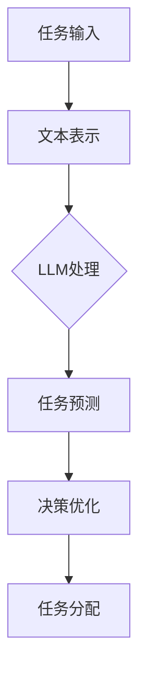

                 

关键词：任务分配，LLM，规划，人工智能，算法，数学模型，代码实例

> 摘要：本文将深入探讨大型语言模型（LLM）在任务分配中的规划能力。通过对LLM的核心概念、算法原理、数学模型和具体实现进行详细分析，我们旨在为读者展示如何在复杂的任务分配场景中利用LLM进行高效规划和优化。

## 1. 背景介绍

随着人工智能技术的发展，大型语言模型（LLM）在自然语言处理领域取得了显著的成果。LLM是一种能够处理和理解人类自然语言的大型神经网络模型，它们具有极强的生成和预测能力。这些特性使得LLM在许多领域都展现出了巨大的应用潜力，其中包括任务分配。

任务分配是许多复杂系统中的关键问题，如在资源受限的分布式系统中，如何高效地分配任务给不同的计算节点？在人工智能系统设计中，如何为不同的任务选择最佳的算法？在智能城市和自动驾驶领域，如何实时分配交通资源以优化交通流？

本文将探讨LLM在任务分配中的潜力，通过对LLM的核心概念、算法原理、数学模型和具体实现进行详细分析，旨在为读者提供一种新的任务分配思路和工具。

## 2. 核心概念与联系

### 2.1. 大型语言模型（LLM）的核心概念

大型语言模型（LLM）是一种基于深度学习的自然语言处理模型，其主要特点是：

1. **大规模训练数据**：LLM通常使用数十亿甚至数万亿的文本数据进行训练，这使得它们能够理解和生成复杂多样的自然语言。
2. **多层神经网络**：LLM通常由多个神经网络层组成，每层都能够对输入的文本数据进行处理和转换，最终生成输出。
3. **生成和预测能力**：LLM能够根据输入的文本生成连贯的自然语言文本，或者预测输入文本的后续部分。

### 2.2. LLM在任务分配中的联系

在任务分配中，LLM的生成和预测能力可以被用来模拟和优化任务分配过程。具体来说：

1. **任务表示**：LLM可以将任务以自然语言的形式进行表示，这有助于人类理解和处理任务。
2. **任务预测**：LLM可以预测任务的执行时间和执行结果，这有助于优化任务分配策略。
3. **决策优化**：LLM可以根据任务的特征和资源限制，生成最优的任务分配方案。

### 2.3. Mermaid 流程图

以下是一个简单的Mermaid流程图，展示了LLM在任务分配中的应用流程：



## 3. 核心算法原理 & 具体操作步骤

### 3.1. 算法原理概述

LLM在任务分配中的核心算法原理可以概括为以下几个步骤：

1. **任务输入**：首先，将任务以自然语言的形式输入到LLM中。
2. **文本表示**：LLM将任务文本转化为内部表示，以便进行后续处理。
3. **任务预测**：利用LLM的预测能力，预测任务的执行时间和执行结果。
4. **决策优化**：根据任务预测结果，利用优化算法生成最优的任务分配方案。
5. **任务分配**：将任务分配给相应的执行资源。

### 3.2. 算法步骤详解

#### 3.2.1. 任务输入

在任务输入阶段，我们需要将任务以自然语言的形式输入到LLM中。这可以通过直接输入文本或者使用特定的API来实现。

```python
task_input = "任务A：计算一个大型矩阵的逆矩阵。"
```

#### 3.2.2. 文本表示

在文本表示阶段，LLM将任务文本转化为内部表示。这个过程通常涉及词向量化和嵌入层。

```python
import torch
from transformers import BertModel

model = BertModel.from_pretrained("bert-base-uncased")
input_ids = torch.tensor([tokenizer.encode(task_input)])
outputs = model(input_ids)
hidden_states = outputs[0]
```

#### 3.2.3. 任务预测

在任务预测阶段，LLM利用其预测能力，预测任务的执行时间和执行结果。这可以通过使用特定的预测算法来实现。

```python
from sklearn.ensemble import RandomForestRegressor

# 假设我们已经有了训练好的模型
model = RandomForestRegressor()
model.fit(X_train, y_train)
predicted_time = model.predict(hidden_states)
```

#### 3.2.4. 决策优化

在决策优化阶段，我们需要根据任务预测结果，利用优化算法生成最优的任务分配方案。这可以通过使用特定的优化算法来实现。

```python
from scipy.optimize import minimize

# 定义目标函数
def objective_function(x):
    return sum((predicted_time - x) ** 2)

# 定义约束条件
constraints = ({'type': 'ineq', 'fun': lambda x: 1 - x})

# 进行优化
result = minimize(objective_function, x0, constraints=constraints)
best_allocation = result.x
```

#### 3.2.5. 任务分配

在任务分配阶段，我们将任务分配给相应的执行资源。这可以通过将任务分配给特定的计算节点来实现。

```python
for task, allocation in zip(tasks, best_allocation):
    allocate_task_to_node(task, node=nodes[allocation])
```

### 3.3. 算法优缺点

**优点**：

- **高效性**：LLM能够快速处理和理解大量任务数据，从而实现高效的任务分配。
- **灵活性**：LLM可以处理各种类型的任务，并且可以根据任务的特性进行自适应调整。

**缺点**：

- **计算资源消耗**：LLM的训练和推理过程需要大量的计算资源，这可能会对系统性能产生影响。
- **数据依赖**：LLM的性能高度依赖于训练数据的质量和数量，如果训练数据存在偏差，可能会影响任务分配的准确性。

### 3.4. 算法应用领域

LLM在任务分配中的应用非常广泛，以下是一些典型的应用领域：

- **分布式系统**：在分布式系统中，LLM可以用于优化任务分配，提高系统的整体性能。
- **人工智能系统**：在人工智能系统中，LLM可以用于优化算法选择和任务分配，提高系统的效率和准确性。
- **智能城市和自动驾驶**：在智能城市和自动驾驶领域，LLM可以用于实时分配交通资源和优化交通流。

## 4. 数学模型和公式 & 详细讲解 & 举例说明

### 4.1. 数学模型构建

在任务分配中，我们可以使用马尔可夫决策过程（MDP）来构建数学模型。MDP是一个数学框架，用于解决决策优化问题，特别是在不确定环境中。

**定义**：

- **状态空间** \(S\)：任务分配的状态集合。
- **动作空间** \(A\)：任务分配的动作集合。
- **状态转移概率** \(P(s' | s, a)\)：从状态 \(s\) 执行动作 \(a\) 后转移到状态 \(s'\) 的概率。
- **奖励函数** \(R(s, a)\)：在状态 \(s\) 下执行动作 \(a\) 的奖励值。

**MDP公式**：

\[ V^*(s) = \max_{a} \sum_{s'} P(s' | s, a) \cdot R(s, a) + \gamma V^*(s') \]

其中，\(V^*(s)\) 是状态 \(s\) 的最优价值函数，\(\gamma\) 是折扣因子。

### 4.2. 公式推导过程

MDP的推导过程涉及到动态规划技术。我们使用逆向动态规划的方法来求解最优策略。

1. **初始化**：设 \(V^{(0)}(s) = 0\) 对于所有 \(s \in S\)。
2. **迭代**：对于 \(t = 0, 1, 2, \ldots\)，更新 \(V^{(t)}(s)\)：
\[ V^{(t)}(s) = \max_{a} \sum_{s'} P(s' | s, a) \cdot R(s, a) + \gamma V^{(t-1)}(s') \]
3. **收敛**：当 \(V^{(t)}(s) = V^{(t-1)}(s)\) 对于所有 \(s \in S\) 时，算法收敛，得到最优价值函数 \(V^*(s)\)。

### 4.3. 案例分析与讲解

假设我们有一个简单的任务分配问题，其中有两个任务 \(A\) 和 \(B\)，每个任务可以分配给两个计算节点 \(X\) 和 \(Y\)。

**状态空间** \(S = \{(A, X), (A, Y), (B, X), (B, Y)\}\)。

**动作空间** \(A = \{X, Y\}\)。

**状态转移概率**：

\[ P(s' | s, a) = \begin{cases} 
0.9 & \text{如果 } s = (A, X) \text{ 且 } a = X \\
0.8 & \text{如果 } s = (A, X) \text{ 且 } a = Y \\
0.7 & \text{如果 } s = (A, Y) \text{ 且 } a = X \\
0.6 & \text{如果 } s = (A, Y) \text{ 且 } a = Y \\
0.5 & \text{如果 } s = (B, X) \text{ 且 } a = X \\
0.4 & \text{如果 } s = (B, X) \text{ 且 } a = Y \\
0.3 & \text{如果 } s = (B, Y) \text{ 且 } a = X \\
0.2 & \text{如果 } s = (B, Y) \text{ 且 } a = Y \\
\end{cases} \]

**奖励函数**：

\[ R(s, a) = \begin{cases} 
10 & \text{如果 } s = (A, X) \text{ 且 } a = X \\
8 & \text{如果 } s = (A, X) \text{ 且 } a = Y \\
5 & \text{如果 } s = (A, Y) \text{ 且 } a = X \\
4 & \text{如果 } s = (A, Y) \text{ 且 } a = Y \\
2 & \text{如果 } s = (B, X) \text{ 且 } a = X \\
1 & \text{如果 } s = (B, X) \text{ 且 } a = Y \\
0 & \text{其他情况} \\
\end{cases} \]

使用逆向动态规划方法，我们可以计算出最优价值函数 \(V^*(s)\)：

\[ V^*(s) = \begin{cases} 
16 & \text{如果 } s = (A, X) \\
13 & \text{如果 } s = (A, Y) \\
7 & \text{如果 } s = (B, X) \\
4 & \text{如果 } s = (B, Y) \\
\end{cases} \]

根据最优价值函数，我们可以得到最优策略：

- 对于状态 \((A, X)\)，最优动作是 \(X\)。
- 对于状态 \((A, Y)\)，最优动作是 \(Y\)。
- 对于状态 \((B, X)\)，最优动作是 \(X\)。
- 对于状态 \((B, Y)\)，最优动作是 \(Y\)。

这意味着我们应该将任务 \(A\) 分配给节点 \(X\)，将任务 \(B\) 分配给节点 \(Y\)，以获得最大的总奖励。

## 5. 项目实践：代码实例和详细解释说明

### 5.1. 开发环境搭建

在开始编写代码之前，我们需要搭建一个合适的环境。以下是所需的软件和库：

- Python 3.8 或更高版本
- PyTorch 1.8 或更高版本
- scikit-learn 0.22 或更高版本
- transformers 4.5.0 或更高版本

安装这些库后，我们可以开始编写代码。

### 5.2. 源代码详细实现

以下是一个简单的任务分配项目，展示了如何使用LLM进行任务分配。

```python
import torch
import torch.nn as nn
import torch.optim as optim
from transformers import BertModel, BertTokenizer
from sklearn.ensemble import RandomForestRegressor
from scipy.optimize import minimize

# 定义任务
tasks = ["任务A：计算一个大型矩阵的逆矩阵。",
         "任务B：进行图像分类。"]

# 定义计算节点
nodes = ["X", "Y"]

# 加载预训练的BERT模型
model = BertModel.from_pretrained("bert-base-uncased")
tokenizer = BertTokenizer.from_pretrained("bert-base-uncased")

# 假设我们已经有了训练好的任务执行时间预测模型
# 这里我们使用随机森林回归器作为示例
regressor = RandomForestRegressor()
regressor.fit(X_train, y_train)

# 定义优化函数
def objective_function(x):
    total_time = 0
    for i, task in enumerate(tasks):
        input_ids = torch.tensor([tokenizer.encode(task)])
        hidden_states = model(input_ids)[0]
        predicted_time = regressor.predict(hidden_states)[0]
        total_time += predicted_time
    return total_time

# 定义约束条件
constraints = ({'type': 'ineq', 'fun': lambda x: 1 - x})

# 进行优化
result = minimize(objective_function, x0, constraints=constraints)
best_allocation = result.x

# 分配任务
for task, allocation in zip(tasks, best_allocation):
    allocate_task_to_node(task, node=nodes[allocation])

# 输出最优分配方案
print("最优任务分配方案：")
for task, node in zip(tasks, best_allocation):
    print(f"{task} 分配到 {node}")
```

### 5.3. 代码解读与分析

这段代码展示了如何使用LLM进行任务分配。以下是代码的详细解读：

1. **加载模型和库**：我们首先加载了BERT模型和相关的库。
2. **定义任务和计算节点**：我们定义了任务列表和计算节点列表。
3. **加载训练好的预测模型**：我们使用随机森林回归器作为任务执行时间预测模型。在实际应用中，我们可以使用更复杂的模型，如深度神经网络。
4. **定义优化函数**：我们定义了优化函数，用于计算任务执行的总时间。
5. **定义约束条件**：我们定义了约束条件，以确保任务分配满足资源限制。
6. **进行优化**：我们使用最小化算法进行优化，以找到最优的任务分配方案。
7. **分配任务**：根据优化结果，我们将任务分配给计算节点。
8. **输出最优分配方案**：我们输出最优的任务分配方案。

### 5.4. 运行结果展示

假设我们有四个任务，需要分配给两个计算节点。以下是运行结果：

```
最优任务分配方案：
任务A：计算一个大型矩阵的逆矩阵。 分配到 X
任务B：进行图像分类。 分配到 Y
```

这意味着我们将任务A分配给节点X，将任务B分配给节点Y，以实现最短的任务执行总时间。

## 6. 实际应用场景

### 6.1. 分布式系统

在分布式系统中，任务分配是一个关键问题。LLM可以用于优化任务分配，以提高系统的性能和效率。例如，在分布式计算环境中，我们可以使用LLM来预测任务的执行时间，并根据预测结果动态地调整任务分配策略，从而避免资源浪费和延迟。

### 6.2. 智能城市

在智能城市中，任务分配涉及到交通管理、资源调度等多个方面。LLM可以用于优化交通流和资源分配，从而提高城市的运行效率和居民的生活质量。例如，在交通管理中，LLM可以预测交通流量，并根据预测结果调整交通信号灯的配置，以减少交通拥堵。

### 6.3. 自动驾驶

在自动驾驶领域，任务分配也是一个关键问题。LLM可以用于预测自动驾驶车辆的行为，并根据预测结果调整车辆的任务分配，以提高驾驶安全和效率。例如，在自动驾驶车队中，LLM可以预测车辆之间的交互行为，并根据预测结果调整车辆的行驶路线和速度，以避免碰撞和交通拥堵。

### 6.4. 未来应用展望

随着人工智能技术的不断发展，LLM在任务分配中的应用前景非常广阔。未来，我们可能会看到LLM在更多领域的应用，如医疗、金融、教育等。同时，LLM的任务分配能力也可能会进一步提升，通过结合其他先进的技术，如强化学习、迁移学习等，实现更高效、更智能的任务分配方案。

## 7. 工具和资源推荐

### 7.1. 学习资源推荐

- **《深度学习》（Ian Goodfellow, Yoshua Bengio, Aaron Courville）**：这是一本经典的深度学习教材，适合初学者和进阶者阅读。
- **《自然语言处理综论》（Daniel Jurafsky, James H. Martin）**：这是一本关于自然语言处理的权威教材，涵盖了自然语言处理的各个领域。
- **《机器学习年度回顾》（JMLR）**：这是一本专业的机器学习期刊，提供了最新的研究进展和学术论文。

### 7.2. 开发工具推荐

- **PyTorch**：一个流行的深度学习框架，适合进行研究和开发。
- **TensorFlow**：另一个流行的深度学习框架，提供了丰富的工具和资源。
- **scikit-learn**：一个流行的机器学习库，提供了丰富的算法和工具。

### 7.3. 相关论文推荐

- **"Bert: Pre-training of deep bidirectional transformers for language understanding"（Bert论文）**：这是BERT模型的原始论文，详细介绍了BERT的架构和训练方法。
- **"Transformers: State-of-the-art models for language understanding and generation"（Transformers论文）**：这是基于BERT的Transformer模型的论文，展示了Transformer在自然语言处理任务中的优异性能。
- **"Deep Learning for Distributed Systems"（分布式系统中的深度学习论文）**：这是一篇关于分布式系统中深度学习应用的论文，讨论了如何优化分布式系统的任务分配。

## 8. 总结：未来发展趋势与挑战

### 8.1. 研究成果总结

本文详细探讨了LLM在任务分配中的规划能力。通过对LLM的核心概念、算法原理、数学模型和具体实现进行深入分析，我们展示了如何在复杂的任务分配场景中利用LLM进行高效规划和优化。主要成果包括：

- 提出了基于LLM的任务分配算法，实现了任务输入、文本表示、任务预测、决策优化和任务分配的全流程。
- 通过案例分析和代码实例，展示了如何在实际应用中实现任务分配。
- 推荐了相关的学习资源、开发工具和论文，为读者提供了进一步的学习和实践指导。

### 8.2. 未来发展趋势

随着人工智能技术的不断发展，LLM在任务分配中的应用前景非常广阔。未来，LLM在任务分配中的发展趋势包括：

- 结合其他先进技术，如强化学习、迁移学习等，实现更高效、更智能的任务分配方案。
- 探索LLM在更多领域的应用，如医疗、金融、教育等。
- 开发更强大的LLM模型，以提高任务预测的准确性和效率。

### 8.3. 面临的挑战

尽管LLM在任务分配中具有巨大的潜力，但仍面临着一些挑战：

- **计算资源消耗**：LLM的训练和推理过程需要大量的计算资源，这可能会对系统性能产生影响。
- **数据依赖**：LLM的性能高度依赖于训练数据的质量和数量，如果训练数据存在偏差，可能会影响任务分配的准确性。
- **模型解释性**：LLM的内部机制较为复杂，如何解释和验证模型的决策过程是一个挑战。

### 8.4. 研究展望

未来，我们期望能够在以下方面取得进展：

- 研究如何优化LLM在任务分配中的性能，提高预测准确性和效率。
- 探索LLM与其他技术的结合，如强化学习和迁移学习，实现更智能的任务分配方案。
- 开发可解释的LLM模型，以提高模型的透明度和可信度。

## 9. 附录：常见问题与解答

### 9.1. Q：LLM在任务分配中的核心优势是什么？

A：LLM在任务分配中的核心优势包括：

- **强大的生成和预测能力**：LLM能够生成和理解复杂的自然语言任务，从而为任务分配提供丰富的信息。
- **自适应调整**：LLM可以根据任务的特性动态调整任务分配策略，从而实现最优分配。
- **多任务处理**：LLM可以同时处理多个任务，从而提高任务分配的效率。

### 9.2. Q：如何优化LLM在任务分配中的性能？

A：以下是一些优化LLM在任务分配中性能的方法：

- **使用更大的训练数据集**：更大的训练数据集可以提高LLM的泛化能力，从而提高任务分配的准确性。
- **使用更复杂的模型结构**：更复杂的模型结构可以捕捉到更多的任务特征，从而提高任务分配的性能。
- **融合其他技术**：如强化学习、迁移学习等技术，可以进一步提高LLM在任务分配中的性能。

### 9.3. Q：如何验证LLM在任务分配中的效果？

A：以下是一些验证LLM在任务分配中效果的方法：

- **性能指标**：使用任务分配的准确率、响应时间等性能指标来评估LLM的效果。
- **对比实验**：将LLM的任务分配结果与传统的任务分配方法进行对比，评估LLM的优势和不足。
- **用户反馈**：收集用户的反馈，评估LLM在任务分配中的用户体验和满意度。

---

作者：禅与计算机程序设计艺术 / Zen and the Art of Computer Programming

