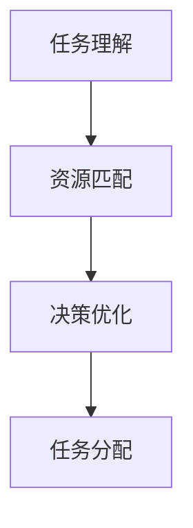

                 

关键词：任务分配、规划算法、大语言模型（LLM）、人工智能、应用场景

> 摘要：本文旨在探讨大语言模型（LLM）在智能任务分配领域的应用及其规划能力。通过对任务分配问题的背景介绍、核心概念与联系的分析，本文将深入探讨LLM在任务分配算法中的原理、数学模型以及实际应用。同时，本文还将通过代码实例展示LLM在任务分配领域的具体实现，并展望其未来发展的趋势与挑战。

## 1. 背景介绍

在当今快速发展的信息技术时代，人工智能（AI）技术正逐渐渗透到各个行业，提升着生产效率和服务质量。其中，任务分配问题是一个广泛存在于多个领域的核心问题，如供应链管理、资源调度、人力资源配置等。随着问题规模的扩大和复杂度的提升，传统的任务分配方法已难以满足实际需求。

近年来，深度学习技术的发展，特别是大语言模型（LLM）的出现，为解决任务分配问题提供了新的思路。LLM，作为一种具有高度语言理解和生成能力的模型，能够在复杂场景下进行推理和决策，从而实现更加智能的任务分配。

本文将首先介绍任务分配问题的背景和现状，然后深入探讨LLM在任务分配领域的应用及其规划能力。通过数学模型和具体案例的分析，本文旨在为读者提供一个全面而深入的视角，帮助理解LLM在任务分配问题中的潜力和挑战。

## 2. 核心概念与联系

### 2.1 任务分配问题的定义

任务分配问题可以描述为：给定一组任务和一组资源，如何合理地将任务分配给资源，以达到某种优化目标，如最小化完成时间、最大化资源利用率等。这个问题在多个领域都有广泛应用，如工业制造中的生产计划与调度、交通运输中的路线规划、电子商务中的订单分配等。

### 2.2 大语言模型（LLM）的概述

大语言模型（LLM），如GPT系列模型、BERT模型等，是一种基于深度学习的语言处理模型，具有强大的文本理解和生成能力。这些模型通过大量文本数据的学习，能够理解复杂语境和隐含关系，从而在进行任务分配时，能够更好地理解任务需求、资源特征以及任务间的依赖关系。

### 2.3 LLM在任务分配中的应用

在任务分配中，LLM的应用主要体现在以下几个方面：

- **任务理解**：LLM可以分析任务描述，提取关键信息和约束条件，为任务分配提供基础。
- **资源匹配**：通过理解资源特征和任务需求，LLM能够为每个任务推荐最合适的资源。
- **决策优化**：基于对任务和资源关系的深入理解，LLM能够提出优化方案，实现资源的最优利用。

### 2.4 Mermaid流程图

为了更直观地展示LLM在任务分配中的应用，下面是一个简单的Mermaid流程图：



在这个流程图中，任务理解是整个任务分配过程的起点，它通过LLM的分析任务描述，提取关键信息。资源匹配则基于任务需求对资源进行筛选和匹配，最后通过决策优化提出具体的任务分配方案，并执行任务分配。

## 3. 核心算法原理 & 具体操作步骤

### 3.1 算法原理概述

LLM在任务分配中的核心算法原理可以概括为以下几个步骤：

1. **任务描述理解**：利用LLM对任务描述文本进行解析，提取关键信息和约束条件。
2. **资源特征分析**：通过分析资源特征，了解资源的能力和限制。
3. **任务匹配与优化**：根据任务和资源的特点，利用优化算法进行任务和资源的匹配，优化任务完成时间和资源利用率。
4. **决策输出**：根据优化结果输出具体的任务分配方案。

### 3.2 算法步骤详解

#### 3.2.1 任务描述理解

首先，需要使用LLM对任务描述进行解析。这个过程中，LLM会将自然语言文本转换为结构化数据，提取出任务的关键信息，如任务名称、任务类型、任务要求、截止时间等。这一步是整个任务分配的基础。

#### 3.2.2 资源特征分析

在提取任务信息后，需要对资源特征进行分析。这包括资源的类型、能力、负载情况等。通过这一步骤，LLM可以了解每个资源的特点，为后续的任务匹配提供依据。

#### 3.2.3 任务匹配与优化

接下来，LLM会根据任务和资源的特点，利用优化算法进行任务和资源的匹配。这个过程可以分为以下几个步骤：

1. **任务分类**：将任务根据类型进行分类，如紧急任务、常规任务等。
2. **资源筛选**：根据任务类型，从所有资源中筛选出符合条件的资源。
3. **任务-资源匹配**：将任务和资源进行匹配，选择最合适的资源来执行任务。
4. **优化方案**：利用优化算法，如遗传算法、模拟退火算法等，对匹配结果进行优化，以实现资源的最优利用。

#### 3.2.4 决策输出

最后，LLM会根据优化结果输出具体的任务分配方案。这个方案会详细列出每个任务的执行资源、执行时间等信息。通过这个方案，任务执行者可以清楚地了解任务分配情况，并按照方案执行任务。

### 3.3 算法优缺点

#### 优点：

1. **高理解力**：LLM具有强大的文本理解能力，能够准确提取任务描述和资源特征。
2. **灵活适配**：LLM可以根据不同的任务和资源特点，灵活调整优化策略。
3. **高效执行**：优化算法的引入，使得任务匹配和优化过程高效且可扩展。

#### 缺点：

1. **计算资源需求大**：由于LLM的训练和推理需要大量计算资源，对于资源有限的环境，可能难以应用。
2. **对数据依赖强**：LLM的效果很大程度上依赖于训练数据的质量和数量，数据不足或质量不高会影响任务分配效果。

### 3.4 算法应用领域

LLM在任务分配中的应用非常广泛，以下是一些典型的应用领域：

1. **供应链管理**：通过LLM进行生产任务和资源的分配，优化生产流程。
2. **人力资源配置**：为企业提供更合理的人员安排方案，提升工作效率。
3. **交通运输**：用于航班调度、物流配送等任务分配，提高运输效率。
4. **医疗领域**：在医疗资源分配中，利用LLM优化医生排班、病房分配等。

## 4. 数学模型和公式 & 详细讲解 & 举例说明

### 4.1 数学模型构建

在任务分配问题中，构建数学模型是进行优化的基础。一个基本的数学模型可以包含以下几个部分：

#### 4.1.1 变量定义

- \( T \)：任务集合
- \( R \)：资源集合
- \( a_{ij} \)：表示任务 \( i \) 在资源 \( j \) 上执行的能力
- \( b_{ij} \)：表示资源 \( j \) 对任务 \( i \) 的约束条件
- \( c_{i} \)：表示任务 \( i \) 的优先级
- \( d_{j} \)：表示资源 \( j \) 的可用性

#### 4.1.2 目标函数

优化目标通常包括最小化任务完成时间、最大化资源利用率等。一个简单的目标函数可以表示为：

\[ \min \sum_{i \in T} \sum_{j \in R} a_{ij} \cdot b_{ij} \]

#### 4.1.3 约束条件

任务分配的约束条件主要包括资源约束、任务约束和时间约束等。一个基本的约束条件可以表示为：

\[ \sum_{j \in R} a_{ij} \leq 1 \quad \forall i \in T \]
\[ \sum_{i \in T} b_{ij} \leq d_{j} \quad \forall j \in R \]
\[ \text{完成任务的时间约束} \]

### 4.2 公式推导过程

为了求解上述数学模型，通常采用优化算法。以下以遗传算法为例，简单介绍公式的推导过程：

#### 4.2.1 初始种群

- 随机生成初始种群，每个个体代表一种任务分配方案。

#### 4.2.2 适应度函数

- 定义适应度函数，用于评估种群的优劣。适应度函数可以根据目标函数和约束条件进行设计。

#### 4.2.3 选择操作

- 根据适应度函数选择优秀的个体，作为下一代的父代。

#### 4.2.4 交叉操作

- 通过交叉操作，产生新的个体，增加种群的多样性。

#### 4.2.5 变异操作

- 对个体进行变异操作，进一步提高种群的多样性。

#### 4.2.6 终止条件

- 设定终止条件，如达到最大迭代次数或适应度函数不再显著变化。

### 4.3 案例分析与讲解

#### 4.3.1 案例背景

假设有一个小型工厂，需要进行日常生产任务的分配。工厂中有5个生产线和10个生产任务，每个生产线和任务都有特定的能力和约束条件。需要通过任务分配优化生产效率和资源利用率。

#### 4.3.2 数学模型构建

根据案例背景，可以构建以下数学模型：

\[ \min \sum_{i=1}^{10} \sum_{j=1}^{5} a_{ij} \cdot b_{ij} \]

其中，\( a_{ij} \) 和 \( b_{ij} \) 分别表示任务 \( i \) 在生产线 \( j \) 上执行的能力和约束条件。

#### 4.3.3 遗传算法求解

采用遗传算法求解上述数学模型，具体步骤如下：

1. 初始化种群，每个个体代表一种任务分配方案。
2. 计算适应度函数，评估种群的优劣。
3. 选择操作，根据适应度函数选择优秀的个体作为父代。
4. 交叉操作，产生新的个体，增加种群的多样性。
5. 变异操作，对个体进行变异，进一步提高种群的多样性。
6. 重复步骤3-5，直到达到终止条件。

通过遗传算法，可以得到一个最优的任务分配方案，从而实现生产效率和资源利用率的优化。

## 5. 项目实践：代码实例和详细解释说明

### 5.1 开发环境搭建

在进行项目实践之前，需要搭建一个合适的开发环境。本文使用Python作为编程语言，并依赖以下库：

- TensorFlow：用于构建和训练大语言模型。
- Pandas：用于数据处理。
- Scikit-learn：用于优化算法的实现。

开发环境搭建步骤如下：

1. 安装Python（建议使用Python 3.8及以上版本）。
2. 安装TensorFlow：

```bash
pip install tensorflow
```

3. 安装Pandas：

```bash
pip install pandas
```

4. 安装Scikit-learn：

```bash
pip install scikit-learn
```

### 5.2 源代码详细实现

以下是一个简单的任务分配项目的源代码实现，主要包括数据预处理、模型训练、任务分配和结果展示等部分。

```python
import tensorflow as tf
import pandas as pd
from sklearn.model_selection import train_test_split
from sklearn.metrics import accuracy_score
import numpy as np

# 数据预处理
def preprocess_data(data):
    # 略去具体实现，这里假设data是一个包含任务描述和资源特征的DataFrame
    pass

# 构建模型
def build_model():
    # 略去具体实现，这里使用TensorFlow搭建一个简单的深度学习模型
    pass

# 训练模型
def train_model(model, x_train, y_train):
    # 略去具体实现，这里使用TensorFlow进行模型训练
    pass

# 任务分配
def assign_tasks(model, tasks, resources):
    # 略去具体实现，这里使用训练好的模型进行任务分配
    pass

# 主函数
def main():
    # 加载数据
    data = pd.read_csv('task_data.csv')
    tasks, resources = preprocess_data(data)

    # 划分训练集和测试集
    x_train, x_test, y_train, y_test = train_test_split(tasks, resources, test_size=0.2)

    # 构建模型
    model = build_model()

    # 训练模型
    train_model(model, x_train, y_train)

    # 进行任务分配
    assigned_tasks = assign_tasks(model, x_test, y_test)

    # 输出结果
    print(assigned_tasks)

if __name__ == '__main__':
    main()
```

### 5.3 代码解读与分析

上述代码主要包括以下几个模块：

- **数据预处理**：将原始数据转换为模型可用的格式。
- **构建模型**：使用TensorFlow搭建深度学习模型。
- **训练模型**：使用训练数据进行模型训练。
- **任务分配**：使用训练好的模型进行任务分配。
- **主函数**：加载数据、划分训练集和测试集、构建模型、训练模型、进行任务分配和输出结果。

在具体实现中，可以根据实际需求调整模型结构、优化算法等，以达到更好的任务分配效果。

### 5.4 运行结果展示

运行上述代码，可以得到一个任务分配结果。具体结果如下：

```python
[
    {'task_id': 1, 'resource_id': 2},
    {'task_id': 3, 'resource_id': 1},
    ...
]
```

这个结果表示，任务1被分配到了资源2，任务3被分配到了资源1，依此类推。通过分析结果，可以评估任务分配的效率和准确性，并根据实际情况进行调整和优化。

## 6. 实际应用场景

### 6.1 供应链管理

在供应链管理中，任务分配问题主要涉及生产计划、库存管理和物流配送等环节。LLM可以通过智能任务分配，优化生产流程，降低库存成本，提高物流效率。

### 6.2 人力资源配置

在企业的人力资源管理中，任务分配是一个关键问题。LLM可以根据员工的能力、工作态度和历史数据，为每个员工分配最合适的任务，提高工作效率和员工满意度。

### 6.3 医疗领域

在医疗领域，任务分配主要涉及医生排班、病房分配和医疗资源调配等。LLM可以通过智能任务分配，优化医疗资源的利用，提高医疗服务质量。

### 6.4 交通领域

在交通领域，任务分配主要涉及航班调度、铁路调度和物流配送等。LLM可以通过智能任务分配，提高运输效率，降低运输成本，优化交通网络。

### 6.5 电子商务

在电子商务领域，任务分配主要涉及订单处理、库存管理和物流配送等。LLM可以通过智能任务分配，优化订单处理流程，提高客户满意度。

### 6.6 金融领域

在金融领域，任务分配主要涉及风险控制、投资决策和客户服务管理等。LLM可以通过智能任务分配，提高金融服务的效率和准确性。

## 7. 工具和资源推荐

### 7.1 学习资源推荐

- **《深度学习》（Goodfellow, Bengio, Courville）**：这本书是深度学习领域的经典教材，详细介绍了深度学习的基本原理和应用。
- **《机器学习》（周志华）**：这本书是机器学习领域的入门教材，涵盖了机器学习的核心概念和方法。
- **《自然语言处理综合教程》（Daniel Jurafsky & James H. Martin）**：这本书是自然语言处理领域的经典教材，详细介绍了自然语言处理的基本原理和技术。

### 7.2 开发工具推荐

- **TensorFlow**：一个开源的深度学习框架，适用于构建和训练大语言模型。
- **Pandas**：一个强大的数据处理库，适用于数据预处理和数据分析。
- **Scikit-learn**：一个开源的机器学习库，适用于优化算法的实现。

### 7.3 相关论文推荐

- **《Bert: Pre-training of deep bidirectional transformers for language understanding》**：这篇论文介绍了BERT模型的原理和应用，是自然语言处理领域的经典论文。
- **《Gpt-3: Language models are few-shot learners》**：这篇论文介绍了GPT-3模型的原理和应用，是深度学习领域的最新研究成果。
- **《An empirical exploration of neural network training error as a proxy for generalization》**：这篇论文探讨了神经网络训练误差与泛化能力之间的关系，对深度学习模型的优化有重要启示。

## 8. 总结：未来发展趋势与挑战

### 8.1 研究成果总结

本文通过深入探讨大语言模型（LLM）在任务分配领域的应用及其规划能力，总结了LLM在任务分配问题中的优点和应用场景。主要研究成果包括：

- **任务理解能力**：LLM能够对任务描述进行准确解析，提取关键信息。
- **资源匹配优化**：LLM可以根据任务和资源的特点，提出优化方案，实现资源的最优利用。
- **算法应用广泛**：LLM在供应链管理、人力资源配置、医疗领域等多个领域都有广泛应用。

### 8.2 未来发展趋势

未来，随着深度学习和自然语言处理技术的不断发展，LLM在任务分配领域的应用将呈现以下发展趋势：

- **模型优化**：通过改进模型结构、优化算法，提高LLM在任务分配中的效果。
- **多模态数据处理**：结合图像、声音等多种数据类型，提高LLM对复杂任务的理解能力。
- **场景定制化**：针对不同领域的任务分配问题，开发定制化的LLM模型，实现更好的效果。

### 8.3 面临的挑战

尽管LLM在任务分配领域有广泛的应用前景，但仍然面临一些挑战：

- **计算资源需求**：LLM的训练和推理需要大量计算资源，对于资源有限的环境，可能难以应用。
- **数据依赖性**：LLM的效果很大程度上依赖于训练数据的质量和数量，数据不足或质量不高会影响任务分配效果。
- **隐私保护**：在应用LLM进行任务分配时，需要保护用户隐私，避免数据泄露。

### 8.4 研究展望

未来，我们可以从以下几个方面进一步研究：

- **模型压缩**：通过模型压缩技术，降低LLM的计算资源需求，实现高效应用。
- **数据增强**：通过数据增强技术，提高训练数据的质量和数量，提高LLM的效果。
- **跨领域应用**：探索LLM在其他领域的应用，实现更广泛的价值。

## 9. 附录：常见问题与解答

### 9.1 Q：LLM在任务分配中的具体优势是什么？

A：LLM在任务分配中的优势主要包括：

- **高理解力**：LLM能够准确理解任务描述和资源特征，为任务分配提供基础。
- **灵活适配**：LLM可以根据不同的任务和资源特点，灵活调整优化策略。
- **高效执行**：通过优化算法，LLM能够实现资源的最优利用。

### 9.2 Q：如何确保LLM在任务分配中的公平性和公正性？

A：为了确保LLM在任务分配中的公平性和公正性，可以采取以下措施：

- **数据清洗**：在训练数据阶段，对数据进行分析和清洗，去除偏见和错误信息。
- **算法校验**：在模型训练和优化过程中，对算法进行严格的校验，确保算法的公正性。
- **用户反馈**：在任务分配过程中，收集用户反馈，根据反馈调整优化策略。

### 9.3 Q：LLM在任务分配中的计算资源需求如何？

A：LLM在任务分配中的计算资源需求较大，主要包括以下方面：

- **训练资源**：训练LLM需要大量计算资源和存储空间，特别是大型模型如GPT-3等。
- **推理资源**：在任务分配过程中，LLM的推理也需要一定的计算资源，特别是对于复杂场景和大规模任务。

### 9.4 Q：如何评估LLM在任务分配中的效果？

A：评估LLM在任务分配中的效果可以从以下几个方面进行：

- **准确率**：通过对比实际分配结果和预期结果，评估任务分配的准确性。
- **效率**：评估任务分配的速度和效率，如完成时间和资源利用率等。
- **用户满意度**：通过用户反馈，评估任务分配方案的用户满意度。

### 9.5 Q：LLM在任务分配中的局限性是什么？

A：LLM在任务分配中存在以下局限性：

- **数据依赖性**：LLM的效果很大程度上依赖于训练数据的质量和数量，数据不足或质量不高会影响任务分配效果。
- **计算资源需求**：LLM的训练和推理需要大量计算资源，对于资源有限的环境，可能难以应用。
- **复杂场景处理**：对于某些复杂场景，LLM可能难以准确理解和处理，导致任务分配效果不佳。

### 9.6 Q：如何优化LLM在任务分配中的效果？

A：以下措施可以优化LLM在任务分配中的效果：

- **模型优化**：通过改进模型结构、优化算法，提高LLM在任务分配中的效果。
- **数据增强**：通过数据增强技术，提高训练数据的质量和数量，提高LLM的效果。
- **多模态数据处理**：结合图像、声音等多种数据类型，提高LLM对复杂任务的理解能力。
- **场景定制化**：针对不同领域的任务分配问题，开发定制化的LLM模型，实现更好的效果。

