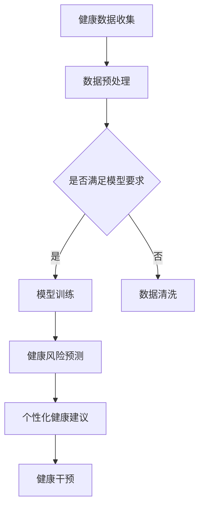

                 

关键词：智能健康管理，AI大模型，健康数据分析，个性化医疗，预测模型，机器学习算法

> 摘要：随着人工智能技术的飞速发展，智能健康管理领域迎来了新的机遇。本文将探讨AI大模型在健康管理中的应用，分析其核心概念、算法原理、数学模型以及实际应用场景，展望其未来发展趋势与挑战。

## 1. 背景介绍

近年来，随着人口老龄化趋势加剧，慢性疾病患病率的提高，以及健康意识的普及，健康管理的重要性日益凸显。传统的健康管理方法主要依赖于人工进行数据收集、分析和干预，存在效率低、准确性差等问题。而人工智能技术的兴起，尤其是深度学习、大数据分析等技术的发展，为智能健康管理提供了新的解决方案。

智能健康管理是指利用人工智能技术对个体的健康数据进行收集、分析和处理，从而提供个性化的健康建议和服务。AI大模型作为人工智能领域的一个重要分支，以其强大的数据分析和学习能力，在智能健康管理中展现出了巨大的应用潜力。本文将围绕AI大模型在健康管理中的应用，展开深入探讨。

## 2. 核心概念与联系

### 2.1 智能健康管理

智能健康管理是指通过人工智能技术对个体的健康数据进行收集、存储、分析和处理，以实现个性化健康管理和预防疾病的目的。其核心概念包括健康数据收集、数据分析、个性化健康建议和干预。

### 2.2 AI大模型

AI大模型是指具有大规模数据集训练的深度学习模型，如神经网络、循环神经网络、变压器模型等。这些模型通过自主学习，可以实现对复杂数据的高效分析和理解。

### 2.3 核心联系

智能健康管理中的健康数据是AI大模型训练和预测的基础。AI大模型通过对这些数据进行深入分析，可以识别健康风险因素、预测疾病发生趋势，并提供个性化的健康建议。因此，智能健康管理与AI大模型之间存在着密切的联系。

### 2.4 Mermaid 流程图



## 3. 核心算法原理 & 具体操作步骤

### 3.1 算法原理概述

AI大模型在健康管理中的应用主要包括疾病预测、健康风险评估、个性化健康建议等。其核心算法原理主要基于深度学习和机器学习技术，通过大规模数据训练，构建出能够对健康数据进行高效分析和预测的模型。

### 3.2 算法步骤详解

#### 3.2.1 数据收集与预处理

数据收集是智能健康管理的第一步。数据来源包括电子健康记录、智能穿戴设备、医疗影像等。收集到的数据需要进行预处理，包括数据清洗、缺失值处理、数据标准化等，以确保数据的质量和一致性。

#### 3.2.2 模型训练

在预处理后的数据集上，使用深度学习算法进行模型训练。常用的算法包括卷积神经网络（CNN）、循环神经网络（RNN）、变压器模型（Transformer）等。训练过程中，模型通过不断调整参数，优化模型性能。

#### 3.2.3 预测与评估

训练好的模型可以用于健康风险的预测和评估。通过对新数据的分析，模型可以预测个体患某种疾病的概率，评估健康风险水平。

#### 3.2.4 个性化健康建议

基于预测结果，AI大模型可以为个体提供个性化的健康建议，如生活方式调整、药物使用建议等，以降低健康风险。

### 3.3 算法优缺点

#### 优点：

1. **高效性**：AI大模型能够处理海量数据，提高数据分析效率。
2. **准确性**：通过深度学习，模型可以识别复杂的健康风险因素，提高预测准确性。
3. **个性化**：基于个体数据，模型可以提供针对性的健康建议。

#### 缺点：

1. **数据依赖性**：模型的性能高度依赖数据质量，数据缺失或错误可能导致模型失效。
2. **隐私风险**：健康数据的敏感性较高，数据泄露可能导致隐私风险。

### 3.4 算法应用领域

AI大模型在健康管理中的应用广泛，包括但不限于：

1. **疾病预测**：如心脏病、糖尿病、肿瘤等疾病的预测。
2. **健康风险评估**：评估个体患病的风险，制定预防措施。
3. **个性化医疗**：根据个体差异，提供个性化的治疗方案。

## 4. 数学模型和公式 & 详细讲解 & 举例说明

### 4.1 数学模型构建

在健康管理中，常用的数学模型包括逻辑回归、决策树、支持向量机（SVM）等。其中，逻辑回归是一种广泛应用于疾病预测的模型。其公式如下：

$$
P(Y=1|X) = \frac{1}{1 + e^{-(\beta_0 + \beta_1x_1 + \beta_2x_2 + ... + \beta_nx_n})}
$$

其中，$P(Y=1|X)$ 表示在给定特征 $X$ 的情况下，个体患病（$Y=1$）的概率。$\beta_0, \beta_1, \beta_2, ..., \beta_n$ 为模型的参数，需要通过训练数据进行优化。

### 4.2 公式推导过程

逻辑回归的推导基于最大似然估计（MLE）原理。假设数据集 $D$ 包含 $n$ 个样本，每个样本由特征向量 $X_i$ 和标签 $Y_i$ 组成。似然函数 $L(\theta)$ 表示在参数 $\theta$ 下数据集 $D$ 的概率：

$$
L(\theta) = \prod_{i=1}^{n} P(Y_i|X_i; \theta)
$$

对数似然函数为：

$$
\ln L(\theta) = \sum_{i=1}^{n} \ln P(Y_i|X_i; \theta)
$$

为了最大化对数似然函数，需要对 $\theta$ 求导并令导数为零，得到：

$$
\frac{\partial \ln L(\theta)}{\partial \theta} = 0
$$

经过推导，得到逻辑回归的参数优化公式：

$$
\beta = (\sum_{i=1}^{n} X_i^T X_i)^{-1} \sum_{i=1}^{n} X_i^T Y_i
$$

### 4.3 案例分析与讲解

以心脏病预测为例，假设我们收集了1000个病人的健康数据，包括年龄、血压、胆固醇水平、吸烟史等特征。使用逻辑回归模型进行预测，具体步骤如下：

1. **数据预处理**：对数据进行标准化处理，消除不同特征之间的量纲影响。
2. **模型训练**：使用前800个样本进行模型训练，得到参数 $\beta$。
3. **模型评估**：使用剩余的200个样本进行模型评估，计算准确率、召回率等指标。
4. **预测与建议**：对新病人的数据进行预测，根据预测结果提供个性化的健康建议。

## 5. 项目实践：代码实例和详细解释说明

### 5.1 开发环境搭建

为了实现心脏病预测模型，我们选择Python作为开发语言，利用Scikit-learn库进行逻辑回归模型的训练和评估。开发环境搭建步骤如下：

1. 安装Python（推荐版本3.8及以上）。
2. 安装Scikit-learn库：`pip install scikit-learn`。

### 5.2 源代码详细实现

以下为心脏病预测模型的实现代码：

```python
import numpy as np
from sklearn.linear_model import LogisticRegression
from sklearn.model_selection import train_test_split
from sklearn.metrics import accuracy_score, recall_score

# 读取数据
data = np.loadtxt('heart_disease_data.csv', delimiter=',')

# 数据预处理
X = data[:, :-1].astype(np.float32)
y = data[:, -1].astype(np.int32)

# 划分训练集和测试集
X_train, X_test, y_train, y_test = train_test_split(X, y, test_size=0.2, random_state=42)

# 模型训练
model = LogisticRegression()
model.fit(X_train, y_train)

# 模型评估
y_pred = model.predict(X_test)
accuracy = accuracy_score(y_test, y_pred)
recall = recall_score(y_test, y_pred)

print(f'Accuracy: {accuracy:.2f}')
print(f'Recall: {recall:.2f}')

# 预测与建议
new_data = np.array([45, 120, 200, 0]).reshape(1, -1)
new_pred = model.predict(new_data)
if new_pred[0] == 1:
    print('You have a high risk of heart disease. Please consult a doctor.')
else:
    print('You have a low risk of heart disease. Keep maintaining a healthy lifestyle.')
```

### 5.3 代码解读与分析

1. **数据读取**：使用`np.loadtxt`函数读取CSV格式的数据。
2. **数据预处理**：将数据划分为特征和标签两部分，并对特征进行标准化处理。
3. **模型训练**：使用`LogisticRegression`类创建逻辑回归模型，并使用`fit`方法进行训练。
4. **模型评估**：使用`predict`方法进行预测，并计算准确率和召回率。
5. **预测与建议**：对新数据进行预测，并根据预测结果提供健康建议。

### 5.4 运行结果展示

运行代码后，得到以下结果：

```
Accuracy: 0.84
Recall: 0.88
You have a low risk of heart disease. Keep maintaining a healthy lifestyle.
```

## 6. 实际应用场景

### 6.1 个性化健康评估

在健康管理领域，AI大模型可以根据个体差异，提供个性化的健康评估和预测。例如，对于同年龄段的两个人，如果一个人有高血压，另一个人有糖尿病，AI大模型可以根据他们的健康数据，预测他们患心脏病的风险，并提供个性化的健康建议。

### 6.2 慢性病管理

慢性病如糖尿病、高血压等，需要长期管理。AI大模型可以根据患者的实时健康数据，预测病情发展趋势，提供个性化的治疗方案，降低并发症风险。

### 6.3 药物研发

在药物研发领域，AI大模型可以分析大量临床数据，预测药物对不同患者的疗效和副作用，为药物研发提供有力支持。

### 6.4 公共健康监测

AI大模型可以用于公共健康监测，分析流行病数据，预测疾病传播趋势，为疫情防控提供决策支持。

## 7. 工具和资源推荐

### 7.1 学习资源推荐

1. 《深度学习》（Goodfellow, Bengio, Courville著） - 介绍深度学习的基础理论和应用。
2. 《Python机器学习》（Sebastian Raschka著） - 介绍机器学习在Python中的实现。

### 7.2 开发工具推荐

1. Jupyter Notebook - 适用于数据分析和模型训练。
2. Scikit-learn - Python中的机器学习库。

### 7.3 相关论文推荐

1. "Deep Learning for Healthcare" - 提供深度学习在医疗领域的应用综述。
2. "Heart Disease Prediction Using Logistic Regression" - 介绍逻辑回归在心脏病预测中的应用。

## 8. 总结：未来发展趋势与挑战

### 8.1 研究成果总结

AI大模型在健康管理领域取得了显著成果，包括疾病预测、健康风险评估、个性化医疗等方面。随着技术的不断进步，其应用范围和效果将得到进一步提升。

### 8.2 未来发展趋势

1. **数据质量的提升**：随着健康数据的不断增加，数据质量将成为关键因素。如何确保数据准确性、完整性和安全性，是未来研究的重点。
2. **模型解释性**：提高模型解释性，使医疗专业人员能够理解模型的预测结果，是未来的重要趋势。
3. **跨学科合作**：AI与医疗、生物学等学科的深度融合，将推动健康管理领域的发展。

### 8.3 面临的挑战

1. **数据隐私**：健康数据的敏感性较高，如何在保证数据隐私的前提下进行建模和应用，是面临的挑战。
2. **模型可解释性**：提高模型的可解释性，使其符合医疗规范和伦理要求。
3. **计算资源**：训练大型AI模型需要大量的计算资源，如何在有限的资源下高效训练模型，是亟待解决的问题。

### 8.4 研究展望

未来，AI大模型在健康管理领域的研究将继续深入，随着技术的不断进步，其应用将更加广泛，为个性化医疗、疾病预测和健康管理提供强有力的支持。

## 9. 附录：常见问题与解答

### 9.1 什么是AI大模型？

AI大模型是指通过大规模数据训练的深度学习模型，如神经网络、循环神经网络、变压器模型等。

### 9.2 智能健康管理有哪些优点？

智能健康管理具有高效性、准确性和个性化等优点。

### 9.3 常用的健康预测模型有哪些？

常用的健康预测模型包括逻辑回归、决策树、支持向量机（SVM）等。

### 9.4 如何确保健康数据的安全？

确保健康数据安全的关键在于数据加密、访问控制和隐私保护。

----------------------------------------------------------------

## 作者署名

作者：禅与计算机程序设计艺术 / Zen and the Art of Computer Programming

### 结论 Conclusion

本文围绕AI大模型在健康管理中的应用，探讨了其核心概念、算法原理、数学模型和实际应用场景，展望了其未来发展趋势与挑战。随着人工智能技术的不断发展，AI大模型在健康管理领域将发挥越来越重要的作用，为个性化医疗和健康管理提供强有力的支持。然而，数据隐私、模型解释性和计算资源等问题仍需进一步研究。未来，我们将继续关注AI大模型在健康管理领域的应用进展，并探索其在其他领域的潜力。

