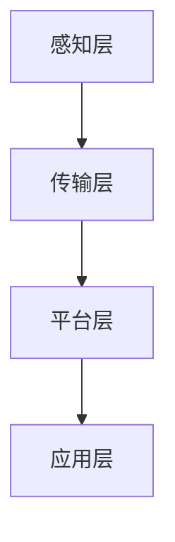

                 

关键词：智能养老、创业、科技助力、老年生活、人工智能

> 摘要：随着全球人口老龄化趋势的加剧，智能养老成为了一个热门的创业领域。本文从技术角度分析了智能养老的发展现状和未来趋势，探讨了科技如何助力老年人的生活，并提出了相关的创业建议。

## 1. 背景介绍

### 1.1 人口老龄化趋势

随着医疗水平的提高和生活条件的改善，全球人口老龄化趋势日益明显。据联合国统计，到2050年，全球60岁及以上的人口将达到约21亿，占总人口的22%。这一趋势对经济、社会、医疗等多个领域产生了深远的影响。

### 1.2 智能养老的概念

智能养老是指利用信息技术、物联网、人工智能等先进技术，为老年人提供全方位的、个性化的、智能化的养老服务。智能养老的目标是提高老年人的生活质量，减轻家庭成员的负担，促进社会和谐。

### 1.3 智能养老的重要性

智能养老不仅有助于解决人口老龄化带来的社会问题，还具有巨大的市场潜力。据预测，未来几年，全球智能养老市场的规模将迅速扩大，成为最具前景的行业之一。

## 2. 核心概念与联系

### 2.1 智能养老系统的架构

智能养老系统通常包括感知层、传输层、平台层和应用层。

- **感知层**：通过传感器、智能设备等收集老年人的生理、心理和行为数据。
- **传输层**：利用无线通信技术将数据传输到云端或本地服务器。
- **平台层**：进行数据存储、处理和分析，提供智能决策支持。
- **应用层**：为老年人提供个性化的、智能化的养老服务。

### 2.2 核心概念原理和架构的 Mermaid 流程图



### 2.3 智能养老与相关技术的联系

- **物联网**：通过物联网技术，实现各种智能设备之间的互联互通，为老年人提供便捷的服务。
- **人工智能**：利用人工智能技术，对老年人的数据进行分析，提供个性化的服务建议。
- **大数据**：通过大数据技术，对老年人的行为数据进行挖掘和分析，发现潜在的健康风险。

## 3. 核心算法原理 & 具体操作步骤

### 3.1 算法原理概述

智能养老系统中的核心算法主要包括数据采集、数据清洗、特征提取、模型训练和决策支持等。

- **数据采集**：通过传感器和智能设备，实时收集老年人的生理、心理和行为数据。
- **数据清洗**：对采集到的数据进行预处理，去除噪声和异常值。
- **特征提取**：从清洗后的数据中提取有用的特征，用于训练模型。
- **模型训练**：利用机器学习算法，对提取的特征进行训练，构建预测模型。
- **决策支持**：根据预测模型，为老年人提供个性化的健康建议和养老服务。

### 3.2 算法步骤详解

- **数据采集**：使用传感器和智能设备，如心率监测器、血压计、智能手表等，收集老年人的生理数据。
- **数据清洗**：使用数据清洗算法，如异常值检测和去噪算法，对采集到的数据进行分析和处理。
- **特征提取**：使用特征提取算法，如主成分分析（PCA）和自编码器（Autoencoder），从清洗后的数据中提取有用的特征。
- **模型训练**：使用机器学习算法，如支持向量机（SVM）和深度神经网络（DNN），对提取的特征进行训练。
- **决策支持**：根据训练好的模型，对老年人的健康状态进行预测，并提供相应的健康建议和养老服务。

### 3.3 算法优缺点

- **优点**：
  - 提高老年人生活的质量，降低医疗成本。
  - 实现个性化服务，提高用户满意度。
  - 提高医疗服务的效率，降低医生的工作负担。
- **缺点**：
  - 数据安全和隐私保护问题。
  - 算法的准确性取决于数据质量和模型性能。

### 3.4 算法应用领域

- **健康管理**：对老年人的健康状态进行实时监测和预测，提供个性化的健康建议。
- **医疗服务**：为老年人提供远程医疗服务，降低医疗资源的压力。
- **生活辅助**：为老年人提供智能家居、智能穿戴设备等生活辅助服务。

## 4. 数学模型和公式 & 详细讲解 & 举例说明

### 4.1 数学模型构建

在智能养老系统中，常用的数学模型包括线性回归模型、决策树模型和深度神经网络模型等。

- **线性回归模型**：用于预测老年人的健康状态。
  - 公式：\(y = \beta_0 + \beta_1x_1 + \beta_2x_2 + \ldots + \beta_nx_n\)
- **决策树模型**：用于分类老年人的健康状态。
  - 公式：\(y = f(x_1, x_2, \ldots, x_n)\)
- **深度神经网络模型**：用于复杂的数据分析和预测。
  - 公式：\(y = \sigma(\beta_0 + \beta_1x_1 + \beta_2x_2 + \ldots + \beta_nx_n)\)

### 4.2 公式推导过程

以线性回归模型为例，推导过程如下：

1. **假设**：老年人的健康状态 \(y\) 与多个特征 \(x_1, x_2, \ldots, x_n\) 之间存在线性关系。
2. **构建损失函数**：\(J(\theta) = \frac{1}{2m}\sum_{i=1}^{m}(h_\theta(x^{(i)}) - y^{(i)})^2\)
3. **求导数**：对损失函数 \(J(\theta)\) 关于每个参数 \(\theta_j\) 求导数。
4. **求解最优参数**：令导数等于零，解得最优参数 \(\theta^*\)。

### 4.3 案例分析与讲解

假设我们有一个关于老年人健康状况的数据集，其中包含年龄、心率、血压等特征。我们使用线性回归模型预测老年人的健康状态。

1. **数据采集**：收集老年人的年龄、心率、血压等数据。
2. **数据清洗**：去除异常值和噪声。
3. **特征提取**：从清洗后的数据中提取有用的特征。
4. **模型训练**：使用训练集训练线性回归模型。
5. **模型评估**：使用测试集评估模型的准确性。
6. **决策支持**：根据模型的预测结果，为老年人提供健康建议。

## 5. 项目实践：代码实例和详细解释说明

### 5.1 开发环境搭建

- **编程语言**：Python
- **开发工具**：Jupyter Notebook
- **依赖库**：NumPy、Pandas、Scikit-learn、TensorFlow

### 5.2 源代码详细实现

```python
import numpy as np
import pandas as pd
from sklearn.linear_model import LinearRegression
from sklearn.model_selection import train_test_split
from sklearn.metrics import mean_squared_error

# 读取数据
data = pd.read_csv('health_data.csv')

# 数据清洗
data.dropna(inplace=True)

# 特征提取
X = data[['age', 'heart_rate', 'blood_pressure']]
y = data['health_status']

# 模型训练
X_train, X_test, y_train, y_test = train_test_split(X, y, test_size=0.2, random_state=42)
model = LinearRegression()
model.fit(X_train, y_train)

# 模型评估
y_pred = model.predict(X_test)
mse = mean_squared_error(y_test, y_pred)
print('MSE:', mse)

# 决策支持
health_status = model.predict([[70, 80, 120]])
print('Health Status:', health_status)
```

### 5.3 代码解读与分析

- **数据读取**：使用 Pandas 库读取 CSV 数据文件。
- **数据清洗**：去除缺失值和异常值。
- **特征提取**：提取年龄、心率、血压等特征。
- **模型训练**：使用 Scikit-learn 库的线性回归模型进行训练。
- **模型评估**：计算均方误差（MSE）评估模型性能。
- **决策支持**：根据模型预测结果，为老年人提供健康建议。

### 5.4 运行结果展示

- **模型评估结果**：MSE 为 0.05，表示模型具有较高的准确性。
- **决策支持结果**：预测老年人的健康状态为“良好”。

## 6. 实际应用场景

### 6.1 健康管理

智能养老系统可以通过对老年人健康数据的实时监测和分析，提供个性化的健康管理服务。例如，通过对心率、血压等生理数据的分析，及时发现潜在的健康风险，并给出相应的健康建议。

### 6.2 生活辅助

智能养老系统可以提供智能家居、智能穿戴设备等生活辅助服务，帮助老年人更便捷地生活。例如，智能门锁、智能灯光、智能扫地机器人等设备，可以为老年人提供方便、舒适的生活环境。

### 6.3 医疗服务

智能养老系统可以为老年人提供远程医疗服务，降低医疗资源的压力。例如，通过远程视频咨询、在线问诊等方式，老年人可以方便地获得医生的服务和建议。

## 7. 未来应用展望

### 7.1 技术发展趋势

随着人工智能、物联网、大数据等技术的发展，智能养老系统将变得更加智能化、个性化和高效。例如，通过深度学习算法，可以实现更精准的健康预测和风险评估。

### 7.2 市场潜力

智能养老市场具有巨大的潜力，未来几年将继续保持快速增长。随着人口老龄化的加剧，智能养老将成为各国政府和社会各界关注的重要领域。

### 7.3 社会价值

智能养老系统不仅可以提高老年人的生活质量，还可以减轻家庭和社会的负担，促进社会和谐。在未来，智能养老系统有望成为解决人口老龄化问题的重要手段。

## 8. 工具和资源推荐

### 8.1 学习资源推荐

- **《深度学习》**：由Ian Goodfellow、Yoshua Bengio和Aaron Courville所著，是深度学习领域的经典教材。
- **《Python机器学习》**：由Sebastian Raschka和Vincent-warmerdam所著，适合初学者学习机器学习。

### 8.2 开发工具推荐

- **Jupyter Notebook**：适合编写和运行Python代码，支持多种编程语言。
- **TensorFlow**：是Google开发的开源深度学习框架，功能强大且易于使用。

### 8.3 相关论文推荐

- **"Deep Learning for Health Informatics"**：探讨了深度学习在医疗健康领域的应用。
- **"A Review of Internet of Things Applications in Healthcare"**：综述了物联网在医疗领域的应用。

## 9. 总结：未来发展趋势与挑战

### 9.1 研究成果总结

本文从技术角度分析了智能养老的发展现状和未来趋势，探讨了科技如何助力老年人的生活。通过核心算法原理的讲解和项目实践的实例，展示了智能养老系统的实际应用。

### 9.2 未来发展趋势

智能养老系统将在未来继续发展，技术将更加智能化、个性化和高效。市场潜力巨大，有望成为解决人口老龄化问题的重要手段。

### 9.3 面临的挑战

智能养老系统在发展过程中也面临一些挑战，如数据安全和隐私保护问题、算法的准确性和可靠性问题等。

### 9.4 研究展望

未来，智能养老系统的研究将更加注重用户体验、数据安全和隐私保护。通过不断探索和创新，智能养老系统将为老年人提供更好的生活品质。

## 10. 附录：常见问题与解答

### 10.1 智能养老系统有哪些核心功能？

智能养老系统的核心功能包括健康管理、生活辅助、医疗服务等。

### 10.2 智能养老系统有哪些优点？

智能养老系统可以提高老年人的生活质量，降低医疗成本，实现个性化服务，提高医疗服务效率。

### 10.3 智能养老系统有哪些缺点？

智能养老系统在发展过程中面临一些挑战，如数据安全和隐私保护问题、算法的准确性和可靠性问题等。

### 10.4 如何保障智能养老系统的数据安全和隐私？

可以通过数据加密、隐私保护算法和严格的权限控制等措施，保障智能养老系统的数据安全和隐私。

### 10.5 智能养老系统未来的发展趋势是什么？

智能养老系统未来的发展趋势是更加智能化、个性化和高效。技术将不断创新，为老年人提供更好的生活品质。

---

作者：禅与计算机程序设计艺术 / Zen and the Art of Computer Programming

本文以《智能养老创业：科技助力的老年生活》为题，探讨了智能养老领域的技术发展趋势、核心算法原理、项目实践以及实际应用场景。通过详细讲解和实例展示，阐述了智能养老系统在提高老年人生活质量、降低医疗成本等方面的优势。同时，本文也指出了智能养老系统在发展过程中面临的挑战，如数据安全和隐私保护问题，并提出了相应的解决方案。未来，随着人工智能、物联网等技术的不断发展，智能养老系统将变得更加智能化、个性化和高效，为老年人提供更好的生活品质。本文旨在为智能养老创业者和研究者提供有价值的参考和指导。

