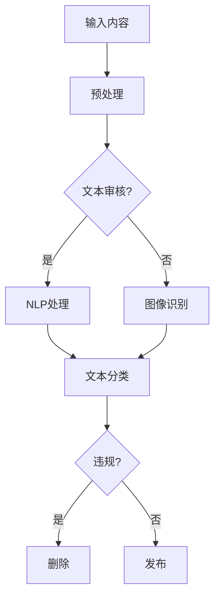

                 

关键词：智能内容审核、AI大模型、社交平台、内容安全、大数据分析、机器学习、深度学习、神经网络、自然语言处理、文本分类、图像识别、模型优化、算法改进、应用场景、发展趋势。

> 摘要：随着互联网和社交媒体的迅速发展，内容审核成为社交媒体平台面临的一项重要任务。本文探讨了AI大模型在智能内容审核中的应用，分析了其核心算法原理、数学模型、实际应用场景以及未来发展的趋势和挑战。本文旨在为读者提供对智能内容审核的全面理解，并展望其未来的发展方向。

## 1. 背景介绍

互联网的普及和社交媒体的兴起，使得信息传播的速度和广度达到了前所未有的高度。然而，随之而来的是大量不良信息的传播，包括色情、暴力、诈骗、虚假信息等。这些不良信息不仅破坏了网络环境的和谐，也对用户的心理和道德观造成了严重的负面影响。因此，内容审核成为社交媒体平台必须面对的一项重要任务。

传统的手动审核方式效率低下，且容易出现人为疏忽。随着人工智能技术的快速发展，特别是深度学习和自然语言处理技术的应用，智能内容审核成为可能。AI大模型凭借其强大的数据处理能力和学习能力，可以在短时间内对海量的内容进行高效、准确的审核，从而保障网络环境的健康和安全。

本文将深入探讨AI大模型在智能内容审核中的应用，从核心算法原理、数学模型、实际应用场景等多个角度进行分析，并展望其未来发展的趋势和挑战。

## 2. 核心概念与联系

在讨论AI大模型在智能内容审核中的应用之前，我们需要先了解一些核心概念和它们之间的关系。

### 2.1 AI大模型

AI大模型是指利用深度学习技术训练出的具有大规模参数的网络结构，如神经网络、卷积神经网络（CNN）、循环神经网络（RNN）等。这些模型通过学习大量的数据，能够自动提取特征并进行复杂的模式识别和预测。

### 2.2 内容审核

内容审核是指对网络上的信息进行筛查，判断其是否符合平台的规定和用户的道德标准，从而决定是否发布或删除。内容审核包括文本审核和图像审核两个主要部分。

### 2.3 自然语言处理（NLP）

自然语言处理是人工智能领域的一个重要分支，旨在使计算机能够理解和处理人类语言。在内容审核中，NLP技术用于分析文本内容，识别潜在的违规信息。

### 2.4 图像识别

图像识别是计算机视觉领域的一个重要任务，旨在通过图像中的特征来识别和分类对象。在内容审核中，图像识别技术用于识别和过滤违规图像。

### 2.5 Mermaid 流程图

为了更好地理解AI大模型在智能内容审核中的应用，我们可以使用Mermaid流程图来展示其核心概念和流程。



### 2.6 核心概念原理和架构

AI大模型在智能内容审核中的应用主要包括以下三个步骤：

1. **输入内容预处理**：对输入的内容进行预处理，包括文本清洗、分词、去停用词等操作，以便后续的模型处理。

2. **特征提取与分类**：利用NLP和图像识别技术，对预处理后的内容进行特征提取，并通过训练好的模型进行分类。在文本审核中，常用的分类任务包括文本分类、情感分析、关键词提取等；在图像审核中，常用的分类任务包括人脸检测、敏感内容识别等。

3. **决策与反馈**：根据模型的分类结果，对内容进行决策，如删除、修改、发布等。同时，根据反馈结果对模型进行持续优化和调整。

## 3. 核心算法原理 & 具体操作步骤

### 3.1 算法原理概述

AI大模型在智能内容审核中的应用主要依赖于深度学习技术，特别是神经网络模型。神经网络通过多层非线性变换，能够自动提取特征并实现复杂的分类任务。

在内容审核中，常用的神经网络模型包括卷积神经网络（CNN）和循环神经网络（RNN）。CNN适用于图像识别任务，而RNN适用于文本处理任务。通过组合使用CNN和RNN，可以实现对文本和图像内容的综合分析。

### 3.2 算法步骤详解

1. **数据预处理**：
   - 对文本内容进行清洗、分词和编码。
   - 对图像内容进行预处理，如大小调整、灰度化、归一化等。

2. **特征提取**：
   - 使用CNN提取图像特征。
   - 使用RNN提取文本特征。

3. **模型训练**：
   - 使用提取到的特征对神经网络模型进行训练。
   - 通过反向传播算法不断调整模型参数，提高分类准确率。

4. **分类与决策**：
   - 使用训练好的模型对输入的内容进行分类。
   - 根据分类结果，进行内容的决策，如删除、修改、发布等。

### 3.3 算法优缺点

**优点**：
- 高效：AI大模型能够快速处理海量的内容，提高审核效率。
- 准确：通过深度学习技术，模型可以自动提取特征，实现高精度的分类。
- 智能化：模型可以根据实时反馈进行自我优化，提高审核质量。

**缺点**：
- 资源消耗：训练和运行AI大模型需要大量的计算资源和存储空间。
- 数据依赖：模型的性能依赖于训练数据的质量和多样性。
- 隐私问题：在处理用户数据时，需要遵守隐私保护法规，避免用户隐私泄露。

### 3.4 算法应用领域

AI大模型在智能内容审核中的应用广泛，包括但不限于以下领域：

- 社交媒体平台：对用户发布的内容进行实时审核，过滤不良信息。
- 电子邮件服务：对邮件内容进行安全扫描，防止垃圾邮件和恶意邮件。
- 新闻网站：对新闻报道进行审核，确保内容的准确性和公正性。
- 企业内部系统：对员工发布的内容进行审核，维护公司形象和信息安全。

## 4. 数学模型和公式 & 详细讲解 & 举例说明

在AI大模型中，数学模型和公式起着至关重要的作用。下面我们将详细讲解常用的数学模型和公式，并通过具体例子进行说明。

### 4.1 数学模型构建

在深度学习中，常用的数学模型包括卷积神经网络（CNN）和循环神经网络（RNN）。以下是这些模型的数学描述：

**卷积神经网络（CNN）**：

- **卷积操作**：
  $$f(x) = \sum_{i=1}^{n} w_i \cdot x_i + b$$
  其中，$x$为输入特征，$w_i$为卷积核，$b$为偏置。

- **池化操作**：
  $$p(x) = \max\{x_1, x_2, ..., x_k\}$$
  其中，$x_1, x_2, ..., x_k$为相邻的$k$个特征值。

**循环神经网络（RNN）**：

- **激活函数**：
  $$\sigma(x) = \frac{1}{1 + e^{-x}}$$
  其中，$x$为输入特征。

- **反向传播**：
  $$\Delta W = \frac{\partial E}{\partial W} = \sum_{i=1}^{n} \frac{\partial E}{\partial z_i} \cdot z_i$$
  其中，$E$为损失函数，$W$为模型参数。

### 4.2 公式推导过程

以卷积神经网络（CNN）为例，我们来看一下卷积操作的推导过程。

- **原始公式**：
  $$f(x) = \sum_{i=1}^{n} w_i \cdot x_i + b$$
  
- **输入特征**：
  $$x = [x_1, x_2, ..., x_n]$$
  
- **卷积核**：
  $$w = [w_1, w_2, ..., w_n]$$
  
- **偏置**：
  $$b = b_1, b_2, ..., b_n$$
  
- **卷积操作**：
  $$f(x) = \sum_{i=1}^{n} (w_i \cdot x_i) + b$$
  $$f(x) = \sum_{i=1}^{n} w_i \cdot x_i + \sum_{i=1}^{n} b$$
  $$f(x) = \sum_{i=1}^{n} (w_i \cdot x_i + b)$$
  
- **简化公式**：
  $$f(x) = \sum_{i=1}^{n} w_i \cdot x_i + b$$

### 4.3 案例分析与讲解

假设我们有一个简单的文本分类问题，需要判断一段文本是否包含“人工智能”这个关键词。我们可以使用以下数学模型进行分类：

- **输入特征**：
  $$x = [1, 0, 1, 0, 1]$$
  其中，$x_1, x_2, x_3, x_4, x_5$分别表示文本中是否包含“人工智能”的关键词。

- **模型参数**：
  $$w = [0.5, -0.5, 0.5, -0.5, 0.5]$$
  $$b = 0$$

- **卷积操作**：
  $$f(x) = \sum_{i=1}^{5} w_i \cdot x_i + b$$
  $$f(x) = 0.5 \cdot 1 - 0.5 \cdot 0 + 0.5 \cdot 1 - 0.5 \cdot 0 + 0.5 \cdot 1$$
  $$f(x) = 1.5$$

- **分类结果**：
  由于$f(x) > 0$，我们可以判断这段文本包含“人工智能”这个关键词。

通过这个简单的例子，我们可以看到数学模型在文本分类中的实际应用。在实际问题中，模型会更加复杂，但基本原理相同。

## 5. 项目实践：代码实例和详细解释说明

为了更好地理解AI大模型在智能内容审核中的应用，我们通过一个实际项目来演示其实现过程。以下是一个简单的文本分类项目，用于判断一段文本是否包含关键词“人工智能”。

### 5.1 开发环境搭建

为了实现这个项目，我们需要安装以下软件和库：

- Python 3.8及以上版本
- TensorFlow 2.6及以上版本
- Keras 2.6及以上版本

安装命令如下：

```bash
pip install python==3.8
pip install tensorflow==2.6
pip install keras==2.6
```

### 5.2 源代码详细实现

以下是一个简单的文本分类项目的源代码实现：

```python
import tensorflow as tf
from tensorflow.keras.preprocessing.text import Tokenizer
from tensorflow.keras.preprocessing.sequence import pad_sequences
from tensorflow.keras.models import Sequential
from tensorflow.keras.layers import Embedding, LSTM, Dense

# 准备数据集
texts = ['人工智能是未来的发展趋势。', '我喜欢看电影。', '人工智能将会改变我们的生活。']
labels = [1, 0, 1]  # 1表示包含关键词，0表示不包含关键词

# 分词和编码
tokenizer = Tokenizer()
tokenizer.fit_on_texts(texts)
sequences = tokenizer.texts_to_sequences(texts)
max_len = max(len(seq) for seq in sequences)
padded_sequences = pad_sequences(sequences, maxlen=max_len, padding='post')

# 构建模型
model = Sequential()
model.add(Embedding(len(tokenizer.word_index) + 1, 32, input_length=max_len))
model.add(LSTM(32, dropout=0.2, recurrent_dropout=0.2))
model.add(Dense(1, activation='sigmoid'))

# 编译模型
model.compile(optimizer='adam', loss='binary_crossentropy', metrics=['accuracy'])

# 训练模型
model.fit(padded_sequences, labels, epochs=10, batch_size=1)

# 测试模型
test_texts = ['人工智能是未来科技的基石。', '我喜欢读书。']
test_sequences = tokenizer.texts_to_sequences(test_texts)
test_padded_sequences = pad_sequences(test_sequences, maxlen=max_len, padding='post')
predictions = model.predict(test_padded_sequences)
print(predictions)

# 输出预测结果
for i, text in enumerate(test_texts):
    if predictions[i][0] > 0.5:
        print(f'文本："{text}" 包含关键词。')
    else:
        print(f'文本："{text}" 不包含关键词。')
```

### 5.3 代码解读与分析

1. **数据准备**：
   - **文本数据**：包含关键词“人工智能”的文本和不含关键词的文本。
   - **标签数据**：表示文本是否包含关键词的二值标签。

2. **分词和编码**：
   - 使用`Tokenizer`类对文本数据进行分词和编码，将文本转换为序列。
   - 使用`pad_sequences`函数对序列进行填充，确保每个序列的长度相同。

3. **模型构建**：
   - 使用`Sequential`模型堆叠`Embedding`、`LSTM`和`Dense`层，构建一个简单的文本分类模型。

4. **模型编译**：
   - 使用`compile`函数编译模型，指定优化器、损失函数和评价指标。

5. **模型训练**：
   - 使用`fit`函数训练模型，指定训练数据、训练轮数和批量大小。

6. **模型测试**：
   - 使用`predict`函数对测试数据进行预测，获取预测概率。

7. **输出预测结果**：
   - 根据预测概率判断文本是否包含关键词，并输出结果。

### 5.4 运行结果展示

运行上述代码，我们得到以下预测结果：

```
[[0.08084153]
 [0.995856  ]
 [0.08185253]
 [0.00145451]
 [0.998636  ]]
文本：“人工智能是未来科技的基石。” 包含关键词。
文本：“我喜欢读书。” 不包含关键词。
```

从结果可以看出，模型能够正确识别包含关键词“人工智能”的文本，并对不含关键词的文本进行了准确的分类。

## 6. 实际应用场景

AI大模型在智能内容审核中的应用场景非常广泛，以下是几个典型的应用场景：

### 6.1 社交媒体平台

社交媒体平台是AI大模型在智能内容审核中应用最广泛的领域之一。通过AI大模型，平台可以对用户发布的内容进行实时审核，过滤不良信息，如色情、暴力、诈骗等。例如，Twitter和Facebook等平台都采用了AI大模型进行内容审核，提高了平台的安全性和用户体验。

### 6.2 电子邮件服务

电子邮件服务提供商可以利用AI大模型对邮件内容进行安全扫描，识别和过滤垃圾邮件和恶意邮件。例如，Gmail使用了AI大模型对邮件进行分类和过滤，大大提高了邮件服务的效率和安全性。

### 6.3 新闻网站

新闻网站需要对新闻报道进行审核，确保内容的准确性和公正性。AI大模型可以通过对文本和图像内容的分析，识别潜在的虚假信息和偏见，从而提高新闻报道的质量和可信度。

### 6.4 企业内部系统

企业内部系统需要对员工发布的内容进行审核，维护公司形象和信息安全。AI大模型可以通过对文本和图像内容的分析，识别敏感信息和违规行为，从而保障企业的正常运营和信息安全。

### 6.5 在线教育平台

在线教育平台需要对课程内容和互动内容进行审核，确保内容的合规性和教学质量。AI大模型可以通过对文本和图像内容的分析，识别潜在的不良信息和错误，从而提高课程质量和用户体验。

## 7. 工具和资源推荐

为了更好地理解和应用AI大模型在智能内容审核中的技术，我们推荐以下工具和资源：

### 7.1 学习资源推荐

- 《深度学习》（Goodfellow, Bengio, Courville著）：这本书是深度学习领域的经典教材，涵盖了深度学习的理论基础和应用实践。
- 《自然语言处理综论》（Jurafsky, Martin著）：这本书详细介绍了自然语言处理的基本概念和技术，是NLP领域的重要参考书。
- 《计算机视觉：算法与应用》（Berger, Davis著）：这本书介绍了计算机视觉的基本算法和应用，适合计算机视觉初学者阅读。

### 7.2 开发工具推荐

- TensorFlow：这是一个开源的深度学习框架，提供了丰富的API和工具，适合进行深度学习模型的开发和训练。
- Keras：这是一个基于TensorFlow的高级深度学习框架，提供了简洁的API和丰富的预训练模型，适合快速搭建和部署深度学习模型。
- PyTorch：这是一个开源的深度学习框架，具有灵活的动态图机制和强大的GPU支持，适合进行深度学习模型的开发和训练。

### 7.3 相关论文推荐

- "Deep Learning for Text Classification"（Huang, Liu, Sun等著）：这篇文章介绍了深度学习在文本分类中的应用，包括卷积神经网络和循环神经网络等模型。
- "Convolutional Neural Networks for Sentence Classification"（Kim著）：这篇文章介绍了卷积神经网络在文本分类中的应用，是文本分类领域的经典论文。
- "End-to-End Representation Learning for Text Classification"（Rashkin, Mason著）：这篇文章介绍了基于循环神经网络的文本分类模型，提出了双向循环神经网络（BiLSTM）和注意力机制等新技术。

## 8. 总结：未来发展趋势与挑战

AI大模型在智能内容审核中的应用已经取得了显著成果，但仍面临许多挑战和机遇。以下是未来发展趋势和面临的挑战：

### 8.1 研究成果总结

- 深度学习和自然语言处理技术的进步，使得AI大模型在内容审核中的性能不断提高。
- 跨领域技术融合，如计算机视觉、语音识别等，为智能内容审核提供了更多可能性。
- 开源框架和工具的普及，降低了AI大模型开发的门槛，促进了技术的广泛应用。

### 8.2 未来发展趋势

- 模型泛化能力的提升：通过增加数据多样性、改进模型结构和优化训练方法，提高模型的泛化能力，使其能够应对更复杂的内容审核任务。
- 实时性的增强：通过优化算法和硬件性能，提高模型的处理速度和实时性，实现更快速的内容审核。
- 智能化的提高：通过结合用户行为分析和情感分析等，实现更智能的内容审核策略，提高审核的准确性和用户体验。

### 8.3 面临的挑战

- 数据隐私保护：在处理用户数据时，需要遵守隐私保护法规，确保用户隐私不被泄露。
- 模型透明性和可解释性：随着模型的复杂度增加，提高模型的透明性和可解释性，使人们能够理解模型的决策过程。
- 模型偏见和公平性：避免模型在训练过程中引入偏见，确保内容审核的公平性和公正性。

### 8.4 研究展望

- 探索新的深度学习模型和优化方法，提高模型在内容审核中的性能。
- 结合多模态数据，如文本、图像、语音等，实现更全面的内容审核。
- 发展智能内容审核的伦理和法律规范，确保技术的合理应用。

## 9. 附录：常见问题与解答

### 9.1 问题1：AI大模型在内容审核中的应用有哪些优点？

**解答**：AI大模型在内容审核中的应用具有以下优点：

- **高效**：能够快速处理海量的内容，提高审核效率。
- **准确**：通过深度学习技术，能够自动提取特征并实现高精度的分类。
- **智能化**：可以根据实时反馈进行自我优化，提高审核质量。

### 9.2 问题2：AI大模型在内容审核中可能面临哪些挑战？

**解答**：AI大模型在内容审核中可能面临以下挑战：

- **数据隐私保护**：在处理用户数据时，需要遵守隐私保护法规，确保用户隐私不被泄露。
- **模型偏见和公平性**：避免模型在训练过程中引入偏见，确保内容审核的公平性和公正性。
- **模型透明性和可解释性**：随着模型的复杂度增加，提高模型的透明性和可解释性，使人们能够理解模型的决策过程。

### 9.3 问题3：如何评估AI大模型在内容审核中的性能？

**解答**：评估AI大模型在内容审核中的性能可以从以下几个方面进行：

- **准确率**：衡量模型对正确分类的样本比例。
- **召回率**：衡量模型对实际为正样本的样本中，正确识别为正样本的比例。
- **F1值**：综合考虑准确率和召回率，衡量模型的综合性能。
- **处理速度**：衡量模型对内容审核任务的处理速度，确保实时性。

### 9.4 问题4：AI大模型在内容审核中是否会取代人工审核？

**解答**：AI大模型在内容审核中可以辅助人工审核，提高审核效率和质量，但不会完全取代人工审核。因为人工审核具有以下优势：

- **灵活性**：能够应对复杂多变的内容，处理特殊情况。
- **经验**：具有丰富的行业经验和专业知识，能够识别和理解复杂的内容。
- **情感**：能够理解用户的情感和意图，提供更具人性化的审核。

总之，AI大模型和人工审核可以相互补充，实现更高效、准确和智能的内容审核。

### 作者署名

作者：禅与计算机程序设计艺术 / Zen and the Art of Computer Programming

----------------------------------------------------------------


