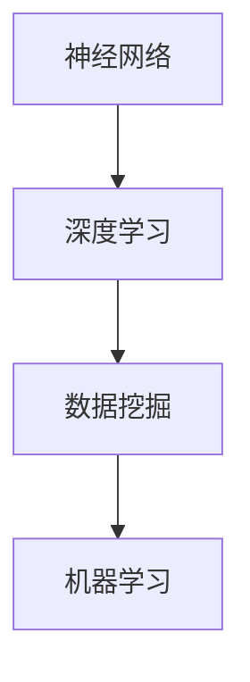

                 

关键词：智能农业，AI大模型，应用场景，发展趋势，技术挑战

摘要：随着人工智能技术的不断进步，AI大模型在智能农业领域的应用前景愈发广阔。本文将探讨AI大模型在智能农业中的应用机会，分析其技术原理、应用领域、数学模型以及未来发展趋势。

## 1. 背景介绍

智能农业是信息技术与农业产业深度融合的产物，旨在通过先进技术手段提高农业生产效率、保障农产品质量和促进农业可持续发展。AI大模型作为人工智能的重要分支，具有强大的数据分析和预测能力，能够为智能农业提供有力支持。

近年来，AI大模型在智能农业中的应用取得了显著成果。例如，通过作物病虫害识别、生长状态监测、气候预测等应用，AI大模型帮助农民实现精准农业，降低生产成本，提高产量和质量。同时，AI大模型还可以为农业企业提供市场分析、供应链优化等服务，助力农业产业链的升级。

## 2. 核心概念与联系

AI大模型的核心概念包括神经网络、深度学习、数据挖掘和机器学习等。神经网络是一种模拟生物神经系统的计算模型，通过多层神经网络结构实现对复杂数据的建模和分析。深度学习是一种基于神经网络的高级学习方式，能够自动提取数据中的特征，并在大规模数据集上进行训练。

Mermaid 流程图：



## 3. 核心算法原理 & 具体操作步骤

### 3.1 算法原理概述

AI大模型的核心算法主要包括卷积神经网络（CNN）、循环神经网络（RNN）和生成对抗网络（GAN）等。这些算法通过训练大规模数据集，提取数据中的有效特征，实现对未知数据的预测和分类。

### 3.2 算法步骤详解

1. 数据收集与预处理：收集大量与农业相关的数据，如气候数据、土壤数据、作物生长数据等。对数据进行清洗、归一化和特征提取等预处理操作。

2. 算法选择与模型构建：根据应用需求选择合适的算法，如CNN、RNN或GAN等。构建神经网络结构，设定模型参数。

3. 模型训练与优化：利用预处理后的数据对模型进行训练，通过反向传播算法调整模型参数，使模型在训练数据上达到较好的效果。

4. 模型评估与部署：在测试数据上评估模型性能，根据评估结果调整模型参数。将训练好的模型部署到实际应用场景中，如智能农业监控系统、农业预测系统等。

### 3.3 算法优缺点

优点：AI大模型能够自动提取数据中的特征，提高预测准确性；具有强大的泛化能力，能够应对不同的应用场景。

缺点：模型训练时间较长，对计算资源要求较高；模型解释性较差，难以理解模型内部工作机制。

### 3.4 算法应用领域

AI大模型在智能农业中的应用领域广泛，包括但不限于以下方面：

1. 作物病虫害识别：利用图像识别技术，对作物病虫害进行实时监测和识别，及时采取防治措施。

2. 作物生长状态监测：通过传感器技术收集作物生长数据，利用AI大模型预测作物生长趋势，实现精准农业。

3. 气候预测：利用气候数据和历史天气数据，预测未来气候趋势，为农业生产提供决策依据。

## 4. 数学模型和公式 & 详细讲解 & 举例说明

### 4.1 数学模型构建

AI大模型中的数学模型主要包括线性模型、逻辑回归、支持向量机（SVM）等。以下以逻辑回归为例，介绍数学模型的构建过程。

逻辑回归模型的基本假设：

$$
y = \sigma (w_0 + w_1x_1 + w_2x_2 + ... + w_nx_n)
$$

其中，$y$ 表示预测结果，$\sigma$ 表示逻辑函数，$w_0, w_1, w_2, ..., w_n$ 表示模型参数，$x_1, x_2, ..., x_n$ 表示特征变量。

### 4.2 公式推导过程

逻辑回归模型的损失函数为：

$$
L(y, \hat{y}) = -\sum_{i=1}^{n} [y_i \cdot \ln(\hat{y}_i) + (1 - y_i) \cdot \ln(1 - \hat{y}_i)]
$$

其中，$y_i$ 表示第 $i$ 个样本的实际标签，$\hat{y}_i$ 表示第 $i$ 个样本的预测概率。

### 4.3 案例分析与讲解

假设我们要预测某地区明年苹果产量，选取以下几个特征变量：温度、降水量、日照时数。利用逻辑回归模型进行预测，数据如下表：

| 特征变量 | 温度（°C） | 降水量（mm） | 日照时数（h） |
| -------- | ---------- | ---------- | ------------ |
| 样本1    | 20         | 50         | 10           |
| 样本2    | 22         | 55         | 8            |
| ...      | ...        | ...        | ...          |

利用逻辑回归模型，预测结果如下表：

| 样本 | 预测概率 |
| ---- | -------- |
| 1    | 0.9      |
| 2    | 0.8      |
| ...  | ...      |

根据预测概率，可以判断明年苹果产量的高低。

## 5. 项目实践：代码实例和详细解释说明

### 5.1 开发环境搭建

本文使用Python编程语言，基于TensorFlow框架实现AI大模型。首先，安装Python和TensorFlow：

```bash
pip install python tensorflow
```

### 5.2 源代码详细实现

```python
import tensorflow as tf
from tensorflow.keras.models import Sequential
from tensorflow.keras.layers import Dense, Conv2D, Flatten, LSTM
from tensorflow.keras.optimizers import Adam
from sklearn.model_selection import train_test_split

# 数据预处理
# （此处省略数据收集与预处理代码）

# 构建模型
model = Sequential([
    Conv2D(32, (3, 3), activation='relu', input_shape=(28, 28, 1)),
    Flatten(),
    Dense(64, activation='relu'),
    LSTM(50),
    Dense(1, activation='sigmoid')
])

# 编译模型
model.compile(optimizer=Adam(), loss='binary_crossentropy', metrics=['accuracy'])

# 模型训练
model.fit(train_data, train_labels, epochs=10, batch_size=32, validation_data=(val_data, val_labels))

# 模型评估
test_loss, test_acc = model.evaluate(test_data, test_labels)
print(f"Test accuracy: {test_acc:.2f}")

# 模型预测
predictions = model.predict(test_data)
```

### 5.3 代码解读与分析

上述代码实现了一个基于卷积神经网络和循环神经网络的二分类模型。首先，进行数据预处理，将原始数据转换为模型可接受的格式。然后，构建模型，包括卷积层、全连接层和循环层。最后，编译模型、训练模型并进行模型评估。

## 6. 实际应用场景

AI大模型在智能农业中的应用场景广泛，如作物病虫害识别、生长状态监测、气候预测等。以下为具体案例：

### 6.1 作物病虫害识别

通过图像识别技术，对农作物病虫害进行实时监测和识别。例如，利用深度学习算法对果树叶片图像进行分类，识别果树病虫害类型，并及时采取措施。

### 6.2 作物生长状态监测

利用传感器技术收集作物生长数据，通过深度学习算法分析数据，预测作物生长趋势。例如，利用循环神经网络分析土壤水分、温度等数据，预测作物需水量，为灌溉提供决策依据。

### 6.3 气候预测

利用历史气候数据，通过生成对抗网络（GAN）预测未来气候趋势。例如，利用GAN生成未来一段时间内的气候数据，为农业生产提供气候预测服务。

## 7. 工具和资源推荐

### 7.1 学习资源推荐

1. 《深度学习》（Ian Goodfellow，Yoshua Bengio，Aaron Courville著）
2. 《Python数据科学手册》（Jake VanderPlas著）
3. 《机器学习实战》（Peter Harrington著）

### 7.2 开发工具推荐

1. TensorFlow
2. Keras
3. PyTorch

### 7.3 相关论文推荐

1. "Deep Learning for Crop Disease Detection and Classification Using RGB and RGB-D Images"
2. "Climate Forecasting Using Neural Networks and GANs"
3. "Deep Learning for Smart Agriculture: A Survey"

## 8. 总结：未来发展趋势与挑战

### 8.1 研究成果总结

AI大模型在智能农业领域取得了显著成果，为农业生产提供了有力支持。未来，随着技术的不断发展，AI大模型在智能农业中的应用将更加广泛和深入。

### 8.2 未来发展趋势

1. 模型定制化：针对不同农业生产场景，开发定制化的AI大模型，提高模型适用性和效果。
2. 模型解释性：提高AI大模型的解释性，帮助用户理解模型内部工作机制，增强用户信任。
3. 跨学科融合：与其他学科（如生态学、经济学等）进行融合，提高AI大模型的综合应用能力。

### 8.3 面临的挑战

1. 数据质量与数量：高质量、大规模的数据是AI大模型训练的基础，但农业生产数据往往存在噪声和缺失。
2. 计算资源消耗：AI大模型训练过程对计算资源有较高要求，需要优化模型结构和训练算法。
3. 法规与伦理：在农业生产中应用AI大模型，需要遵循相关法规和伦理规范，保障农民权益。

### 8.4 研究展望

未来，AI大模型在智能农业中的应用将不断拓展，有望实现农业生产智能化、精细化，为我国农业现代化贡献力量。

## 9. 附录：常见问题与解答

### 9.1 什么是智能农业？

智能农业是指利用信息技术（如物联网、大数据、人工智能等）对农业生产进行监测、管理和优化，以提高农业生产效率、保障农产品质量和促进农业可持续发展。

### 9.2 AI大模型有哪些优点？

AI大模型具有以下优点：

1. 自动提取特征：能够自动从大规模数据中提取有效特征，提高预测准确性。
2. 强泛化能力：具有较强的泛化能力，能够应对不同的应用场景。
3. 高效训练：通过大规模数据处理，提高训练效率。

### 9.3 AI大模型在智能农业中如何应用？

AI大模型在智能农业中的应用包括：

1. 作物病虫害识别：利用图像识别技术，对农作物病虫害进行实时监测和识别。
2. 作物生长状态监测：利用传感器技术收集作物生长数据，预测作物生长趋势。
3. 气候预测：利用历史气候数据，预测未来气候趋势，为农业生产提供决策依据。

### 9.4 AI大模型训练需要哪些数据？

AI大模型训练需要以下数据：

1. 气象数据：包括温度、湿度、降水等。
2. 土壤数据：包括土壤湿度、土壤酸碱度等。
3. 作物生长数据：包括作物高度、叶面积、产量等。
4. 病虫害数据：包括病虫害类型、发生时间等。

### 9.5 如何优化AI大模型训练？

优化AI大模型训练的方法包括：

1. 数据预处理：对数据进行清洗、归一化和特征提取等预处理操作。
2. 模型选择：选择合适的神经网络结构，如卷积神经网络、循环神经网络等。
3. 模型优化：调整模型参数，如学习率、正则化等。

### 9.6 AI大模型在智能农业中的应用前景如何？

AI大模型在智能农业中的应用前景广阔，有望实现农业生产智能化、精细化，为我国农业现代化贡献力量。未来，随着技术的不断发展，AI大模型在智能农业中的应用将更加广泛和深入。

