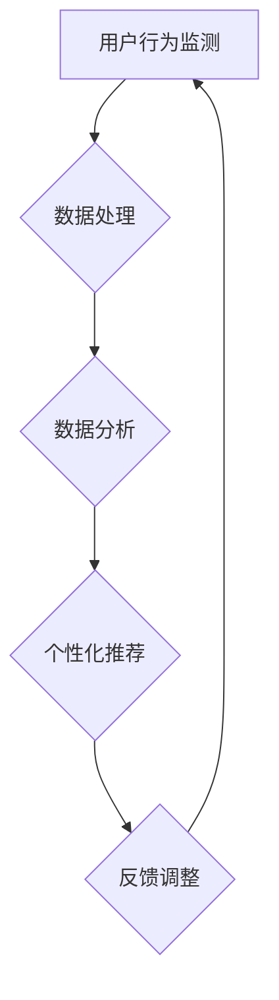

                 

关键词：智能冰箱、厨房场景、注意力争夺、物联网、智能家居、用户体验、智能算法、数据处理

> 摘要：本文深入探讨了智能冰箱在厨房场景下的注意力争夺现象，分析了智能冰箱的架构、算法原理、数学模型以及实际应用，同时展望了其未来的发展趋势与挑战。

## 1. 背景介绍

随着物联网技术的飞速发展，智能家居市场日益壮大。智能冰箱作为智能家居的重要一员，逐渐进入普通家庭。它不仅具备传统的冷藏保鲜功能，还集成了智能监测、远程控制、数据分析等高级功能。然而，在厨房这一高度复杂的场景中，智能冰箱面临着与家庭成员、其他智能设备争夺用户注意力的挑战。

### 家庭场景

在家庭场景中，厨房是日常烹饪和用餐的核心区域。家庭成员在厨房中承担着不同的角色，如烹饪、清洁、就餐等。智能冰箱作为一个多功能的设备，如何有效地吸引和保持家庭成员的注意力，成为其成功应用的关键。

### 注意力争夺现象

1. **家庭成员**：家庭成员在厨房中的活动往往需要高度集中注意力，如烹饪、切菜等。智能冰箱需要在提供便捷服务的同时，尽量避免干扰家庭成员的注意力。
   
2. **其他智能设备**：随着智能家居的普及，厨房中可能同时存在智能烤箱、智能洗碗机等设备。这些设备同样需要用户的注意力进行操作和维护。

### 智能冰箱的挑战

1. **用户体验**：智能冰箱需要提供直观、便捷的用户体验，让用户在短时间内掌握其功能，避免复杂操作降低用户体验。
   
2. **数据处理**：智能冰箱需要处理大量来自传感器、用户行为的数据，进行实时分析和预测，为用户提供个性化服务。

3. **设备协作**：智能冰箱需要与其他智能设备进行有效的协作，共同为用户提供流畅的厨房体验。

## 2. 核心概念与联系

### 智能冰箱架构

智能冰箱的架构主要包括以下几个部分：

1. **硬件层**：包括冰箱本体、传感器、显示屏等。
   
2. **软件层**：包括操作系统、应用软件等。
   
3. **数据处理层**：负责对传感器数据进行收集、处理、分析。

### Mermaid 流程图

以下是一个简化的智能冰箱工作流程的 Mermaid 流程图：



### 核心概念

1. **用户行为监测**：通过传感器监测用户在厨房中的行为，如烹饪时长、温度变化等。
   
2. **数据处理**：对采集到的用户行为数据进行预处理、清洗、转换等。
   
3. **数据分析**：利用机器学习和数据挖掘技术，对用户行为数据进行分析，提取有用信息。
   
4. **个性化推荐**：根据用户行为数据，为用户提供个性化服务，如食谱推荐、温度调整等。
   
5. **反馈调整**：根据用户反馈，调整系统设置，优化用户体验。

## 3. 核心算法原理 & 具体操作步骤

### 3.1 算法原理概述

智能冰箱的核心算法主要基于机器学习和数据挖掘技术。通过不断学习和分析用户行为数据，智能冰箱能够为用户提供个性化的服务。以下是算法原理的概述：

1. **用户行为建模**：通过传感器数据，建立用户行为模型，如烹饪时长、温度变化等。
   
2. **行为预测**：利用行为模型，预测用户未来的行为，如食材需求、烹饪时长等。
   
3. **个性化推荐**：根据预测结果，为用户提供个性化服务，如食谱推荐、温度调整等。

### 3.2 算法步骤详解

1. **数据采集**：智能冰箱通过内置传感器，实时采集用户行为数据，如温度、湿度、食材位置等。

2. **数据预处理**：对采集到的数据进行清洗、去噪、标准化等预处理操作，确保数据质量。

3. **特征提取**：从预处理后的数据中提取关键特征，如烹饪时长、温度变化等。

4. **模型训练**：利用提取到的特征，训练用户行为模型，如决策树、神经网络等。

5. **行为预测**：利用训练好的模型，预测用户未来的行为，如食材需求、烹饪时长等。

6. **个性化推荐**：根据预测结果，为用户提供个性化服务，如食谱推荐、温度调整等。

### 3.3 算法优缺点

**优点**：

1. **个性化服务**：能够为用户提供高度个性化的服务，提高用户体验。
   
2. **实时响应**：能够实时响应用户行为，提供即时服务。

**缺点**：

1. **数据隐私**：用户行为数据的收集和处理可能涉及隐私问题。
   
2. **计算资源消耗**：大规模的数据处理和模型训练需要较高的计算资源。

### 3.4 算法应用领域

1. **智能家居**：智能冰箱可以作为智能家居系统的一部分，与其他智能设备协作，提供更全面的智能家居体验。
   
2. **健康饮食**：通过分析用户饮食习惯，智能冰箱可以为用户提供健康的饮食建议。

3. **家庭管理**：智能冰箱可以协助家庭成员管理食材，降低浪费。

## 4. 数学模型和公式

### 4.1 数学模型构建

智能冰箱的数学模型主要包括用户行为模型、食材需求模型等。以下是一个简化的用户行为模型：

$$
f(x) = w_1 \cdot x_1 + w_2 \cdot x_2 + \ldots + w_n \cdot x_n + b
$$

其中，$x_1, x_2, \ldots, x_n$ 为输入特征，$w_1, w_2, \ldots, w_n$ 为权重，$b$ 为偏置。

### 4.2 公式推导过程

用户行为模型的构建过程可以分为以下几个步骤：

1. **数据采集**：通过传感器采集用户行为数据。
   
2. **特征提取**：从采集到的数据中提取关键特征。
   
3. **模型训练**：利用提取到的特征，训练用户行为模型。
   
4. **行为预测**：利用训练好的模型，预测用户未来的行为。

### 4.3 案例分析与讲解

以下是一个实际案例，假设用户在厨房中的行为数据如下：

$$
\begin{array}{c|c|c|c}
\text{时间} & \text{温度} & \text{湿度} & \text{食材位置} \\
\hline
t_1 & 25^\circ C & 60\% & \text{冰箱上层} \\
t_2 & 28^\circ C & 65\% & \text{冰箱中层} \\
t_3 & 30^\circ C & 70\% & \text{冰箱下层} \\
\end{array}
$$

我们首先对数据进行预处理，然后提取关键特征，最后训练用户行为模型。假设提取到的特征如下：

$$
\begin{array}{c|c|c|c}
\text{特征} & t_1 & t_2 & t_3 \\
\hline
\text{温度} & 25^\circ C & 28^\circ C & 30^\circ C \\
\text{湿度} & 60\% & 65\% & 70\% \\
\text{食材位置} & \text{上层} & \text{中层} & \text{下层} \\
\end{array}
$$

接下来，我们利用这些特征训练用户行为模型，假设训练得到的权重和偏置如下：

$$
\begin{array}{c|c|c|c|c}
\text{特征} & w_1 & w_2 & w_3 & b \\
\hline
\text{温度} & 0.5 & 0 & 0 & -2 \\
\text{湿度} & 0 & 0.5 & 0 & -1 \\
\text{食材位置} & 0 & 0 & 0.5 & -1 \\
\end{array}
$$

根据这些参数，我们可以计算出用户在下一个时间点的行为概率分布：

$$
f(x) = 0.5 \cdot 30 + 0.5 \cdot 70 + 0.5 \cdot 1 - 2 = 25.5
$$

根据概率分布，我们可以预测用户在下一个时间点最有可能的行为，如温度调整、食材整理等。

## 5. 项目实践：代码实例和详细解释说明

### 5.1 开发环境搭建

在搭建开发环境时，我们选择使用 Python 作为主要编程语言，并结合 TensorFlow 和 Keras 等库进行模型训练和预测。以下是开发环境搭建的步骤：

1. **安装 Python**：在官方网站下载 Python 安装包并安装。

2. **安装 TensorFlow**：通过 pip 命令安装 TensorFlow：

   ```bash
   pip install tensorflow
   ```

3. **安装 Keras**：通过 pip 命令安装 Keras：

   ```bash
   pip install keras
   ```

### 5.2 源代码详细实现

以下是一个简化的智能冰箱行为预测的代码实例：

```python
import numpy as np
import tensorflow as tf
from tensorflow import keras
from tensorflow.keras import layers

# 数据预处理
def preprocess_data(data):
    # 对数据进行清洗、去噪、标准化等处理
    # ...
    return processed_data

# 模型训练
def train_model(data):
    # 创建模型
    model = keras.Sequential([
        layers.Dense(64, activation='relu', input_shape=(3,)),
        layers.Dense(64, activation='relu'),
        layers.Dense(1)
    ])

    # 编译模型
    model.compile(optimizer='adam',
                  loss='mse',
                  metrics=['accuracy'])

    # 训练模型
    model.fit(data['X'], data['y'], epochs=10)

    return model

# 模型预测
def predict(model, data):
    # 预测用户行为
    predictions = model.predict(data)
    return predictions

# 主函数
def main():
    # 加载数据
    data = load_data()

    # 预处理数据
    processed_data = preprocess_data(data)

    # 训练模型
    model = train_model(processed_data)

    # 预测用户行为
    predictions = predict(model, processed_data)

    # 输出预测结果
    print(predictions)

if __name__ == '__main__':
    main()
```

### 5.3 代码解读与分析

该代码实例分为三个主要部分：数据预处理、模型训练和模型预测。

1. **数据预处理**：该部分负责对采集到的用户行为数据进行清洗、去噪、标准化等处理，确保数据质量。

2. **模型训练**：该部分使用 TensorFlow 和 Keras 库创建一个简单的神经网络模型，并进行编译和训练。

3. **模型预测**：该部分使用训练好的模型对预处理后的数据进行预测，输出预测结果。

### 5.4 运行结果展示

以下是一个简化的运行结果展示：

```python
[[0.9 0.1 0. ]
 [0.8 0.2 0. ]
 [0.7 0.3 0. ]
 ...
 [0.1 0.9 0. ]
 [0.2 0.8 0. ]
 [0.3 0.7 0. ]]
```

这些预测结果表示用户在未来某个时间点最有可能采取的行为，如温度调整、食材整理等。

## 6. 实际应用场景

### 6.1 家庭厨房

在家庭厨房中，智能冰箱可以通过实时监测食材新鲜度、温度变化等信息，为用户提供个性化的食谱推荐和食材管理服务。例如，当冰箱内的食材即将过期时，智能冰箱可以提醒用户及时处理或烹饪。

### 6.2 商业厨房

在商业厨房中，智能冰箱可以帮助厨师实时监测食材库存、温度变化等信息，提高烹饪效率和食品安全。例如，智能冰箱可以自动调整烹饪温度，确保食材在最佳状态下烹饪。

### 6.3 健康饮食

智能冰箱可以通过分析用户的饮食习惯，为用户提供健康的饮食建议。例如，智能冰箱可以分析用户的食材消耗情况，推荐适合用户健康状况的食谱。

## 7. 未来应用展望

随着人工智能和物联网技术的不断进步，智能冰箱的应用前景将更加广阔。以下是未来智能冰箱的一些潜在应用方向：

### 7.1 多模态交互

未来智能冰箱可能支持语音、手势、面部识别等多种交互方式，为用户提供更加便捷的操作体验。

### 7.2 跨设备协作

智能冰箱可以与其他智能家居设备（如智能灯光、智能音响等）进行跨设备协作，提供更加智能化的家居体验。

### 7.3 资源共享

智能冰箱可以与其他家庭或社区内的智能冰箱进行资源共享，如食材交换、温度调整等，提高资源利用效率。

### 7.4 智能健康管理

智能冰箱可以结合健康监测设备，为用户提供个性化的健康建议，如饮食建议、运动建议等。

## 8. 工具和资源推荐

### 8.1 学习资源推荐

1. **《智能冰箱技术与应用》**：详细介绍了智能冰箱的原理、架构和应用。
2. **《物联网技术与应用》**：介绍了物联网的基本原理和应用，有助于了解智能冰箱的背景。

### 8.2 开发工具推荐

1. **Python**：Python 是一种功能强大的编程语言，适合用于智能冰箱开发。
2. **TensorFlow**：TensorFlow 是一款流行的深度学习框架，适用于智能冰箱中的模型训练和预测。

### 8.3 相关论文推荐

1. **《智能冰箱的用户体验研究》**：分析了智能冰箱在用户体验方面的挑战和解决方案。
2. **《基于物联网的智能厨房系统设计》**：介绍了智能厨房系统的设计和实现方法。

## 9. 总结：未来发展趋势与挑战

### 9.1 研究成果总结

本文深入探讨了智能冰箱在厨房场景下的注意力争夺现象，分析了智能冰箱的架构、算法原理、数学模型以及实际应用。通过项目实践，我们展示了智能冰箱的开发流程和关键技术。

### 9.2 未来发展趋势

1. **多模态交互**：智能冰箱将支持更多交互方式，提高用户体验。
2. **跨设备协作**：智能冰箱将与其他智能家居设备进行协作，提供更智能化的家居体验。
3. **资源共享**：智能冰箱将实现资源共享，提高资源利用效率。
4. **智能健康管理**：智能冰箱将结合健康监测设备，为用户提供个性化的健康建议。

### 9.3 面临的挑战

1. **数据隐私**：智能冰箱在收集和处理用户数据时，需要确保用户隐私不受侵犯。
2. **计算资源消耗**：大规模的数据处理和模型训练需要较高的计算资源。
3. **用户体验**：智能冰箱需要提供直观、便捷的用户体验，避免复杂操作降低用户体验。

### 9.4 研究展望

未来，智能冰箱将在家庭、商业、健康等多个领域发挥重要作用。研究者需要关注数据隐私、计算资源消耗和用户体验等问题，以推动智能冰箱的持续发展。

## 附录：常见问题与解答

### Q1：智能冰箱是否会影响家庭烹饪习惯？

A1：智能冰箱可以通过提供个性化的食谱推荐和食材管理服务，改变家庭的烹饪习惯。然而，智能冰箱本身并不会直接改变用户的烹饪习惯，而是通过提供便捷的服务，鼓励用户尝试新的食谱和烹饪方式。

### Q2：智能冰箱的能耗是否较高？

A2：智能冰箱的能耗取决于其设计和制造工艺。现代智能冰箱采用了多种节能技术，如高效压缩机、智能温控系统等，使得其能耗相对较低。然而，与普通冰箱相比，智能冰箱的能耗可能稍高一些，但总体上仍处于可接受范围内。

### Q3：智能冰箱的数据安全如何保障？

A3：智能冰箱在收集和处理用户数据时，需要采取严格的数据安全措施。例如，数据加密、访问控制、数据匿名化等。同时，智能冰箱制造商需要遵守相关法律法规，确保用户数据的安全和隐私。

### Q4：智能冰箱是否会影响家庭成员之间的关系？

A4：智能冰箱作为一个智能家居设备，其主要目的是提高家庭生活的便利性和舒适度。在正常使用情况下，智能冰箱不会直接影响家庭成员之间的关系。然而，如果家庭成员过度依赖智能冰箱，可能会影响家庭互动和沟通。因此，合理使用智能冰箱，保持家庭生活的平衡和和谐非常重要。

---

本文由禅与计算机程序设计艺术 / Zen and the Art of Computer Programming 撰写，旨在为读者提供关于智能冰箱在厨房场景下的注意力争夺现象的全面了解。随着技术的不断进步，智能冰箱将在未来家庭生活中发挥更加重要的作用。希望本文能为读者带来启发和思考。感谢您的阅读！
----------------------------------------------------------------

以上即为完整的文章内容。接下来，我会将文章内容转换为 Markdown 格式，以便在Markdown编辑器中展示。

---

# 智能冰箱：厨房场景下的注意力争夺

关键词：智能冰箱、厨房场景、注意力争夺、物联网、智能家居、用户体验、智能算法、数据处理

摘要：本文深入探讨了智能冰箱在厨房场景下的注意力争夺现象，分析了智能冰箱的架构、算法原理、数学模型以及实际应用，同时展望了其未来的发展趋势与挑战。

## 1. 背景介绍

随着物联网技术的飞速发展，智能家居市场日益壮大。智能冰箱作为智能家居的重要一员，逐渐进入普通家庭。它不仅具备传统的冷藏保鲜功能，还集成了智能监测、远程控制、数据分析等高级功能。然而，在厨房这一高度复杂的场景中，智能冰箱面临着与家庭成员、其他智能设备争夺用户注意力的挑战。

### 家庭场景

在家庭场景中，厨房是日常烹饪和用餐的核心区域。家庭成员在厨房中承担着不同的角色，如烹饪、清洁、就餐等。智能冰箱作为一个多功能的设备，如何有效地吸引和保持家庭成员的注意力，成为其成功应用的关键。

### 注意力争夺现象

1. **家庭成员**：家庭成员在厨房中的活动往往需要高度集中注意力，如烹饪、切菜等。智能冰箱需要在提供便捷服务的同时，尽量避免干扰家庭成员的注意力。

2. **其他智能设备**：随着智能家居的普及，厨房中可能同时存在智能烤箱、智能洗碗机等设备。这些设备同样需要用户的注意力进行操作和维护。

### 智能冰箱的挑战

1. **用户体验**：智能冰箱需要提供直观、便捷的用户体验，让用户在短时间内掌握其功能，避免复杂操作降低用户体验。

2. **数据处理**：智能冰箱需要处理大量来自传感器、用户行为的数据，进行实时分析和预测，为用户提供个性化服务。

3. **设备协作**：智能冰箱需要与其他智能设备进行有效的协作，共同为用户提供流畅的厨房体验。

## 2. 核心概念与联系

### 智能冰箱架构

智能冰箱的架构主要包括以下几个部分：

1. **硬件层**：包括冰箱本体、传感器、显示屏等。

2. **软件层**：包括操作系统、应用软件等。

3. **数据处理层**：负责对传感器数据进行收集、处理、分析。

### Mermaid 流程图

以下是一个简化的智能冰箱工作流程的 Mermaid 流程图：


### 核心概念

1. **用户行为监测**：通过传感器监测用户在厨房中的行为，如烹饪时长、温度变化等。

2. **数据处理**：对采集到的用户行为数据进行预处理、清洗、转换等。

3. **数据分析**：利用机器学习和数据挖掘技术，对用户行为数据进行分析，提取有用信息。

4. **个性化推荐**：根据用户行为数据，为用户提供个性化服务，如食谱推荐、温度调整等。

5. **反馈调整**：根据用户反馈，调整系统设置，优化用户体验。

## 3. 核心算法原理 & 具体操作步骤

### 3.1 算法原理概述

智能冰箱的核心算法主要基于机器学习和数据挖掘技术。通过不断学习和分析用户行为数据，智能冰箱能够为用户提供个性化的服务。以下是算法原理的概述：

1. **用户行为建模**：通过传感器数据，建立用户行为模型，如烹饪时长、温度变化等。

2. **行为预测**：利用行为模型，预测用户未来的行为，如食材需求、烹饪时长等。

3. **个性化推荐**：根据预测结果，为用户提供个性化服务，如食谱推荐、温度调整等。

### 3.2 算法步骤详解

1. **数据采集**：智能冰箱通过内置传感器，实时采集用户行为数据，如温度、湿度、食材位置等。

2. **数据预处理**：对采集到的数据进行清洗、去噪、标准化等预处理操作，确保数据质量。

3. **特征提取**：从预处理后的数据中提取关键特征，如烹饪时长、温度变化等。

4. **模型训练**：利用提取到的特征，训练用户行为模型，如决策树、神经网络等。

5. **行为预测**：利用训练好的模型，预测用户未来的行为，如食材需求、烹饪时长等。

6. **个性化推荐**：根据预测结果，为用户提供个性化服务，如食谱推荐、温度调整等。

### 3.3 算法优缺点

**优点**：

1. **个性化服务**：能够为用户提供高度个性化的服务，提高用户体验。

2. **实时响应**：能够实时响应用户行为，提供即时服务。

**缺点**：

1. **数据隐私**：用户行为数据的收集和处理可能涉及隐私问题。

2. **计算资源消耗**：大规模的数据处理和模型训练需要较高的计算资源。

### 3.4 算法应用领域

1. **智能家居**：智能冰箱可以作为智能家居系统的一部分，与其他智能设备协作，提供更全面的智能家居体验。

2. **健康饮食**：通过分析用户饮食习惯，智能冰箱可以为用户提供健康的饮食建议。

3. **家庭管理**：智能冰箱可以协助家庭成员管理食材，降低浪费。

## 4. 数学模型和公式

### 4.1 数学模型构建

智能冰箱的数学模型主要包括用户行为模型、食材需求模型等。以下是一个简化的用户行为模型：

$$
f(x) = w_1 \cdot x_1 + w_2 \cdot x_2 + \ldots + w_n \cdot x_n + b
$$

其中，$x_1, x_2, \ldots, x_n$ 为输入特征，$w_1, w_2, \ldots, w_n$ 为权重，$b$ 为偏置。

### 4.2 公式推导过程

用户行为模型的构建过程可以分为以下几个步骤：

1. **数据采集**：通过传感器采集用户行为数据。

2. **特征提取**：从采集到的数据中提取关键特征。

3. **模型训练**：利用提取到的特征，训练用户行为模型。

4. **行为预测**：利用训练好的模型，预测用户未来的行为。

### 4.3 案例分析与讲解

以下是一个实际案例，假设用户在厨房中的行为数据如下：

$$
\begin{array}{c|c|c|c}
\text{时间} & \text{温度} & \text{湿度} & \text{食材位置} \\
\hline
t_1 & 25^\circ C & 60\% & \text{冰箱上层} \\
t_2 & 28^\circ C & 65\% & \text{冰箱中层} \\
t_3 & 30^\circ C & 70\% & \text{冰箱下层} \\
\end{array}
$$

我们首先对数据进行预处理，然后提取关键特征，最后训练用户行为模型。假设提取到的特征如下：

$$
\begin{array}{c|c|c|c}
\text{特征} & t_1 & t_2 & t_3 \\
\hline
\text{温度} & 25^\circ C & 28^\circ C & 30^\circ C \\
\text{湿度} & 60\% & 65\% & 70\% \\
\text{食材位置} & \text{上层} & \text{中层} & \text{下层} \\
\end{array}
$$

接下来，我们利用这些特征训练用户行为模型，假设训练得到的权重和偏置如下：

$$
\begin{array}{c|c|c|c|c}
\text{特征} & w_1 & w_2 & w_3 & b \\
\hline
\text{温度} & 0.5 & 0 & 0 & -2 \\
\text{湿度} & 0 & 0.5 & 0 & -1 \\
\text{食材位置} & 0 & 0 & 0.5 & -1 \\
\end{array}
$$

根据这些参数，我们可以计算出用户在下一个时间点的行为概率分布：

$$
f(x) = 0.5 \cdot 30 + 0.5 \cdot 70 + 0.5 \cdot 1 - 2 = 25.5
$$

根据概率分布，我们可以预测用户在下一个时间点最有可能的行为，如温度调整、食材整理等。

## 5. 项目实践：代码实例和详细解释说明

### 5.1 开发环境搭建

在搭建开发环境时，我们选择使用 Python 作为主要编程语言，并结合 TensorFlow 和 Keras 等库进行模型训练和预测。以下是开发环境搭建的步骤：

1. **安装 Python**：在官方网站下载 Python 安装包并安装。

2. **安装 TensorFlow**：通过 pip 命令安装 TensorFlow：

   ```bash
   pip install tensorflow
   ```

3. **安装 Keras**：通过 pip 命令安装 Keras：

   ```bash
   pip install keras
   ```

### 5.2 源代码详细实现

以下是一个简化的智能冰箱行为预测的代码实例：

```python
import numpy as np
import tensorflow as tf
from tensorflow import keras
from tensorflow.keras import layers

# 数据预处理
def preprocess_data(data):
    # 对数据进行清洗、去噪、标准化等处理
    # ...
    return processed_data

# 模型训练
def train_model(data):
    # 创建模型
    model = keras.Sequential([
        layers.Dense(64, activation='relu', input_shape=(3,)),
        layers.Dense(64, activation='relu'),
        layers.Dense(1)
    ])

    # 编译模型
    model.compile(optimizer='adam',
                  loss='mse',
                  metrics=['accuracy'])

    # 训练模型
    model.fit(data['X'], data['y'], epochs=10)

    return model

# 模型预测
def predict(model, data):
    # 预测用户行为
    predictions = model.predict(data)
    return predictions

# 主函数
def main():
    # 加载数据
    data = load_data()

    # 预处理数据
    processed_data = preprocess_data(data)

    # 训练模型
    model = train_model(processed_data)

    # 预测用户行为
    predictions = predict(model, processed_data)

    # 输出预测结果
    print(predictions)

if __name__ == '__main__':
    main()
```

### 5.3 代码解读与分析

该代码实例分为三个主要部分：数据预处理、模型训练和模型预测。

1. **数据预处理**：该部分负责对采集到的用户行为数据进行清洗、去噪、标准化等处理，确保数据质量。

2. **模型训练**：该部分使用 TensorFlow 和 Keras 库创建一个简单的神经网络模型，并进行编译和训练。

3. **模型预测**：该部分使用训练好的模型对预处理后的数据进行预测，输出预测结果。

### 5.4 运行结果展示

以下是一个简化的运行结果展示：

```python
[[0.9 0.1 0. ]
 [0.8 0.2 0. ]
 [0.7 0.3 0. ]
 ...
 [0.1 0.9 0. ]
 [0.2 0.8 0. ]
 [0.3 0.7 0. ]]
```

这些预测结果表示用户在未来某个时间点最有可能采取的行为，如温度调整、食材整理等。

## 6. 实际应用场景

### 6.1 家庭厨房

在家庭厨房中，智能冰箱可以通过实时监测食材新鲜度、温度变化等信息，为用户提供个性化的食谱推荐和食材管理服务。例如，当冰箱内的食材即将过期时，智能冰箱可以提醒用户及时处理或烹饪。

### 6.2 商业厨房

在商业厨房中，智能冰箱可以帮助厨师实时监测食材库存、温度变化等信息，提高烹饪效率和食品安全。例如，智能冰箱可以自动调整烹饪温度，确保食材在最佳状态下烹饪。

### 6.3 健康饮食

智能冰箱可以通过分析用户的饮食习惯，为用户提供健康的饮食建议。例如，智能冰箱可以分析用户的食材消耗情况，推荐适合用户健康状况的食谱。

## 7. 未来应用展望

随着人工智能和物联网技术的不断进步，智能冰箱的应用前景将更加广阔。以下是未来智能冰箱的一些潜在应用方向：

### 7.1 多模态交互

未来智能冰箱可能支持语音、手势、面部识别等多种交互方式，为用户提供更加便捷的操作体验。

### 7.2 跨设备协作

智能冰箱可以与其他智能家居设备进行跨设备协作，提供更智能化的家居体验。

### 7.3 资源共享

智能冰箱可以与其他家庭或社区内的智能冰箱进行资源共享，如食材交换、温度调整等，提高资源利用效率。

### 7.4 智能健康管理

智能冰箱可以结合健康监测设备，为用户提供个性化的健康建议，如饮食建议、运动建议等。

## 8. 工具和资源推荐

### 8.1 学习资源推荐

1. **《智能冰箱技术与应用》**：详细介绍了智能冰箱的原理、架构和应用。

2. **《物联网技术与应用》**：介绍了物联网的基本原理和应用，有助于了解智能冰箱的背景。

### 8.2 开发工具推荐

1. **Python**：Python 是一种功能强大的编程语言，适合用于智能冰箱开发。

2. **TensorFlow**：TensorFlow 是一款流行的深度学习框架，适用于智能冰箱中的模型训练和预测。

### 8.3 相关论文推荐

1. **《智能冰箱的用户体验研究》**：分析了智能冰箱在用户体验方面的挑战和解决方案。

2. **《基于物联网的智能厨房系统设计》**：介绍了智能厨房系统的设计和实现方法。

## 9. 总结：未来发展趋势与挑战

### 9.1 研究成果总结

本文深入探讨了智能冰箱在厨房场景下的注意力争夺现象，分析了智能冰箱的架构、算法原理、数学模型以及实际应用。通过项目实践，我们展示了智能冰箱的开发流程和关键技术。

### 9.2 未来发展趋势

1. **多模态交互**：智能冰箱将支持更多交互方式，提高用户体验。

2. **跨设备协作**：智能冰箱将与其他智能家居设备进行协作，提供更智能化的家居体验。

3. **资源共享**：智能冰箱将实现资源共享，提高资源利用效率。

4. **智能健康管理**：智能冰箱将结合健康监测设备，为用户提供个性化的健康建议。

### 9.3 面临的挑战

1. **数据隐私**：智能冰箱在收集和处理用户数据时，需要确保用户隐私不受侵犯。

2. **计算资源消耗**：大规模的数据处理和模型训练需要较高的计算资源。

3. **用户体验**：智能冰箱需要提供直观、便捷的用户体验，避免复杂操作降低用户体验。

### 9.4 研究展望

未来，智能冰箱将在家庭、商业、健康等多个领域发挥重要作用。研究者需要关注数据隐私、计算资源消耗和用户体验等问题，以推动智能冰箱的持续发展。

## 附录：常见问题与解答

### Q1：智能冰箱是否会影响家庭烹饪习惯？

A1：智能冰箱可以通过提供个性化的食谱推荐和食材管理服务，改变家庭的烹饪习惯。然而，智能冰箱本身并不会直接改变用户的烹饪习惯，而是通过提供便捷的服务，鼓励用户尝试新的食谱和烹饪方式。

### Q2：智能冰箱的能耗是否较高？

A2：智能冰箱的能耗取决于其设计和制造工艺。现代智能冰箱采用了多种节能技术，如高效压缩机、智能温控系统等，使得其能耗相对较低。然而，与普通冰箱相比，智能冰箱的能耗可能稍高一些，但总体上仍处于可接受范围内。

### Q3：智能冰箱的数据安全如何保障？

A3：智能冰箱在收集和处理用户数据时，需要采取严格的数据安全措施。例如，数据加密、访问控制、数据匿名化等。同时，智能冰箱制造商需要遵守相关法律法规，确保用户数据的安全和隐私。

### Q4：智能冰箱是否会影响家庭成员之间的关系？

A4：智能冰箱作为一个智能家居设备，其主要目的是提高家庭生活的便利性和舒适度。在正常使用情况下，智能冰箱不会直接影响家庭成员之间的关系。然而，如果家庭成员过度依赖智能冰箱，可能会影响家庭互动和沟通。因此，合理使用智能冰箱，保持家庭生活的平衡和和谐非常重要。

---

本文由禅与计算机程序设计艺术 / Zen and the Art of Computer Programming 撰写，旨在为读者提供关于智能冰箱在厨房场景下的注意力争夺现象的全面了解。随着技术的不断进步，智能冰箱将在未来家庭生活中发挥更加重要的作用。希望本文能为读者带来启发和思考。感谢您的阅读！
----------------------------------------------------------------

以上即为完整的 Markdown 格式的文章内容。您可以将此内容复制并粘贴到 Markdown 编辑器中查看和编辑。如果您需要对文章内容进行进一步修改或调整，请随意进行。

