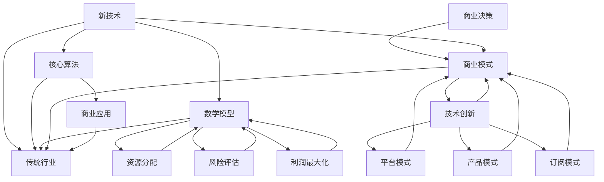

                 

关键词：智能创业、新技术、传统行业、颠覆、创新、商业模式、技术架构、算法、人工智能、数字化转型

> 摘要：本文旨在探讨如何通过新技术创新来颠覆传统行业，实现智能创业的突破。我们将从背景介绍、核心概念与联系、核心算法原理与操作步骤、数学模型与公式、项目实践、实际应用场景、未来应用展望、工具和资源推荐、总结与展望等九个方面，详细分析智能创业的路径和策略。

## 1. 背景介绍

在过去的几十年里，信息技术经历了飞速的发展，从互联网到移动通信，从大数据到人工智能，技术的变革正以前所未有的速度改变着我们的生活方式和商业模式。然而，与此同时，许多传统行业仍然面临着效率低下、创新能力不足等问题，亟需通过新技术的应用来实现转型和升级。

智能创业，作为新技术与传统行业结合的产物，已成为推动产业变革的重要力量。它不仅能够提升企业的运营效率，降低成本，还能够创造出全新的商业模式和价值。然而，智能创业并非易事，它需要深刻理解技术原理、市场需求、以及如何将这些技术与传统行业有机结合。

本文将探讨以下关键问题：

- 如何识别和利用新技术？
- 新技术在传统行业中的应用有哪些典型案例？
- 智能创业的核心算法和原理是什么？
- 如何构建数学模型来优化智能创业过程？
- 智能创业在实际应用中面临哪些挑战和机遇？
- 未来智能创业将有哪些发展趋势？

通过以上问题的探讨，我们希望能够为创业者提供一些实用的指导和建议。

## 2. 核心概念与联系

在智能创业的过程中，理解核心概念和它们之间的联系是至关重要的。以下是一些关键概念及其相互关系：

### 2.1 新技术与传统行业

**新技术**：如人工智能、大数据、云计算、物联网、区块链等，这些技术具有高度创新性和变革性。

**传统行业**：包括制造业、零售业、金融业、医疗业等，这些行业在技术变革中面临巨大挑战。

**关系**：新技术可以提升传统行业的效率，降低成本，创造新的商业模式，从而实现产业的数字化和智能化转型。

### 2.2 核心算法与商业应用

**核心算法**：如机器学习算法、深度学习算法、优化算法等，这些算法是智能创业的重要技术支撑。

**商业应用**：核心算法在金融风控、智能推荐、智能制造、智能医疗等领域的广泛应用。

**关系**：核心算法的有效应用能够解决传统行业中的痛点问题，提高行业竞争力。

### 2.3 数学模型与商业决策

**数学模型**：如线性规划、非线性规划、博弈论等，这些模型用于商业决策中的资源分配、风险评估、利润最大化等。

**商业决策**：基于数学模型的决策能够提高企业的运营效率和盈利能力。

**关系**：数学模型为智能创业提供了科学决策的依据，有助于实现商业优化。

### 2.4 商业模式与技术创新

**商业模式**：包括产品模式、平台模式、订阅模式等，这些模式决定了企业的盈利方式。

**技术创新**：通过技术创新来优化商业模式，创造新的价值。

**关系**：技术创新能够推动商业模式的变革，实现企业的持续增长。

### Mermaid 流程图

下面是一个简化的Mermaid流程图，展示了智能创业的核心概念及其相互关系：



通过这个流程图，我们可以更清晰地理解智能创业中的关键概念及其相互关系。

## 3. 核心算法原理 & 具体操作步骤

### 3.1 算法原理概述

智能创业中的核心算法主要包括机器学习算法、深度学习算法和优化算法。这些算法在不同的应用场景中发挥着重要作用。

**机器学习算法**：通过数据训练模型，使模型能够对未知数据进行预测或分类。常见的机器学习算法包括线性回归、逻辑回归、决策树、随机森林、支持向量机等。

**深度学习算法**：基于多层神经网络，通过大量数据进行训练，能够实现复杂模式识别和预测。常见的深度学习算法包括卷积神经网络（CNN）、循环神经网络（RNN）、生成对抗网络（GAN）等。

**优化算法**：用于求解资源分配、利润最大化等问题，常见的优化算法包括线性规划、非线性规划、动态规划等。

### 3.2 算法步骤详解

**机器学习算法**：

1. 数据收集与预处理：收集相关数据，并进行清洗、转换等预处理操作。
2. 特征提取：从数据中提取有助于模型训练的特征。
3. 模型选择：选择合适的机器学习算法，如线性回归、决策树等。
4. 模型训练：使用预处理后的数据对模型进行训练。
5. 模型评估：使用验证集或测试集对模型进行评估。
6. 模型部署：将训练好的模型部署到生产环境中。

**深度学习算法**：

1. 数据收集与预处理：与机器学习算法类似，对数据进行清洗、转换等预处理。
2. 网络架构设计：设计适合任务的网络架构，如CNN、RNN等。
3. 模型训练：使用预处理后的数据对模型进行训练，调整网络参数。
4. 模型评估：与机器学习算法类似，使用验证集或测试集对模型进行评估。
5. 模型部署：将训练好的模型部署到生产环境中。

**优化算法**：

1. 模型建立：根据问题建立数学模型。
2. 求解算法选择：选择合适的优化算法，如线性规划、非线性规划等。
3. 模型求解：使用优化算法求解问题，得到最优解。
4. 模型评估：评估求解结果，如目标函数值、资源利用率等。
5. 模型优化：根据评估结果对模型进行优化，提高求解性能。

### 3.3 算法优缺点

**机器学习算法**：

- **优点**：算法简单，适用于多种类型的数据。
- **缺点**：对大规模数据计算效率较低，模型可解释性较差。

**深度学习算法**：

- **优点**：能够处理复杂的数据结构，模型性能优越。
- **缺点**：计算资源需求高，模型训练时间较长。

**优化算法**：

- **优点**：能够求解复杂的资源分配问题，提高运营效率。
- **缺点**：求解复杂度较高，对模型依赖性较强。

### 3.4 算法应用领域

**机器学习算法**：在金融风控、智能推荐、智能医疗等领域有广泛应用。

**深度学习算法**：在图像识别、自然语言处理、语音识别等领域有广泛应用。

**优化算法**：在物流运输、供应链管理、生产调度等领域有广泛应用。

通过以上算法原理和具体操作步骤的介绍，我们可以更好地理解智能创业中的技术支撑，为后续的实际应用打下基础。

## 4. 数学模型和公式 & 详细讲解 & 举例说明

### 4.1 数学模型构建

在智能创业过程中，构建数学模型是实现科学决策和优化运营的重要手段。以下我们将介绍几种常见的数学模型及其构建过程。

**线性规划**：线性规划用于求解线性目标函数在线性约束条件下的最优解。

- **目标函数**：\( \min c^T x \)
- **约束条件**：\( Ax \le b \)，其中 \( x \) 是决策变量，\( c \) 和 \( b \) 分别是系数向量，\( A \) 是约束矩阵。

**非线性规划**：非线性规划用于求解非线性目标函数在非线性约束条件下的最优解。

- **目标函数**：\( \min f(x) \)，其中 \( f(x) \) 是非线性函数。
- **约束条件**：\( g(x) \le 0 \)，\( h(x) = 0 \)，其中 \( g(x) \) 和 \( h(x) \) 分别是非线性不等式约束和等式约束。

**博弈论**：博弈论用于分析多参与者决策问题，其中每个参与者都希望最大化自己的收益。

- **参与者**：\( n \) 个参与者，分别用 \( i \) 表示。
- **策略**：每个参与者 \( i \) 的策略集为 \( S_i \)。
- **支付函数**：每个参与者 \( i \) 的支付函数为 \( u_i(s_1, s_2, ..., s_n) \)，其中 \( s_i \) 是参与者 \( i \) 的策略。

### 4.2 公式推导过程

**线性规划推导过程**：

1. **目标函数**：

   \( \min c^T x \)

2. **约束条件**：

   \( Ax \le b \)

3. **等式约束**：

   \( Ax = b \)

4. **拉格朗日函数**：

   \( L(x, \lambda) = c^T x + \lambda^T (b - Ax) \)

5. **KKT条件**：

   \( \nabla_x L(x, \lambda) = 0 \)
   
   \( \lambda^T (b - Ax) = 0 \)
   
   \( \lambda \ge 0 \)

**非线性规划推导过程**：

1. **目标函数**：

   \( \min f(x) \)

2. **约束条件**：

   \( g(x) \le 0 \)

   \( h(x) = 0 \)

3. **拉格朗日函数**：

   \( L(x, \lambda, \mu) = f(x) + \lambda^T g(x) + \mu^T h(x) \)

4. **KKT条件**：

   \( \nabla_x L(x, \lambda, \mu) = 0 \)
   
   \( \lambda \ge 0 \)
   
   \( \mu \ge 0 \)

**博弈论推导过程**：

1. **纳什均衡**：

   \( u_i(s_i, s_{-i}) = \max_{s_i} u_i(s_i, s_{-i}) \)

2. **最佳响应策略**：

   \( s_i^* = \arg\max_{s_i} u_i(s_i, s_{-i}) \)

### 4.3 案例分析与讲解

**案例一：线性规划在资源分配中的应用**

假设一家公司需要分配 \( m \) 个任务给 \( n \) 名员工，每个任务都有特定的优先级和难度，公司希望最大化总任务完成度，同时保证每个员工的任务量不超过其最大承裁能力。

- **目标函数**：最大化总任务完成度，即最大化 \( \sum_{i=1}^m \sum_{j=1}^n x_{ij} \)，其中 \( x_{ij} \) 表示第 \( i \) 个任务分配给第 \( j \) 个员工的数量。
- **约束条件**：每个员工的任务量不超过其最大承裁能力，即 \( \sum_{i=1}^m x_{ij} \le c_j \)，其中 \( c_j \) 表示第 \( j \) 个员工的最大承裁能力。

**案例二：非线性规划在利润最大化中的应用**

假设一家零售商店在销售多种商品，每个商品都有特定的利润和需求量，商店希望最大化总利润，同时保证库存不超过最大库存量。

- **目标函数**：最大化总利润，即最大化 \( \sum_{i=1}^m p_i q_i \)，其中 \( p_i \) 表示第 \( i \) 个商品的价格，\( q_i \) 表示第 \( i \) 个商品的销售量。
- **约束条件**：每个商品的销售量不超过其需求量，即 \( q_i \le d_i \)，其中 \( d_i \) 表示第 \( i \) 个商品的需求量。库存不超过最大库存量，即 \( \sum_{i=1}^m q_i \le I \)，其中 \( I \) 表示最大库存量。

通过以上案例的分析，我们可以看到数学模型在智能创业中的应用，为商业决策提供了有力的支持。

## 5. 项目实践：代码实例和详细解释说明

### 5.1 开发环境搭建

在开始代码实践之前，我们需要搭建一个合适的技术环境。以下是一个基于Python的智能创业项目开发环境搭建步骤：

1. **安装Python**：下载并安装Python 3.8及以上版本。
2. **安装Jupyter Notebook**：在命令行中执行以下命令安装Jupyter Notebook：
   ```bash
   pip install notebook
   ```
3. **安装相关库**：安装必要的Python库，例如NumPy、Pandas、Scikit-learn、TensorFlow等。使用以下命令安装：
   ```bash
   pip install numpy pandas scikit-learn tensorflow
   ```

### 5.2 源代码详细实现

以下是一个基于机器学习的智能创业项目的源代码实现：

```python
import numpy as np
import pandas as pd
from sklearn.model_selection import train_test_split
from sklearn.ensemble import RandomForestClassifier
from sklearn.metrics import accuracy_score

# 数据准备
data = pd.read_csv('data.csv')
X = data.drop('target', axis=1)
y = data['target']

# 数据预处理
X_train, X_test, y_train, y_test = train_test_split(X, y, test_size=0.2, random_state=42)

# 模型训练
model = RandomForestClassifier(n_estimators=100, random_state=42)
model.fit(X_train, y_train)

# 模型评估
y_pred = model.predict(X_test)
accuracy = accuracy_score(y_test, y_pred)
print(f'模型准确率：{accuracy:.2f}')
```

### 5.3 代码解读与分析

1. **数据准备**：首先，我们读取数据集，并分离特征和目标变量。
2. **数据预处理**：使用`train_test_split`函数将数据集划分为训练集和测试集，用于模型的训练和评估。
3. **模型训练**：我们选择随机森林分类器作为模型，并设置随机种子以确保结果可重复。使用`fit`函数对模型进行训练。
4. **模型评估**：使用`predict`函数对测试集进行预测，并计算模型准确率。

通过以上步骤，我们实现了智能创业项目的基本流程。以下是对每个步骤的详细解读：

- **数据准备**：数据质量对模型的性能至关重要。在数据预处理阶段，我们需要进行数据清洗、特征工程等操作。
- **数据预处理**：数据预处理是提高模型性能的关键步骤。在实际应用中，可能需要进行归一化、缺失值填充、特征提取等操作。
- **模型训练**：选择合适的模型并进行训练是智能创业项目的重要环节。不同的任务可能需要不同的模型，如回归、分类、聚类等。
- **模型评估**：评估模型性能是验证模型是否有效的重要步骤。常用的评估指标包括准确率、召回率、F1分数等。

通过以上代码实例和分析，我们可以看到智能创业项目的实现过程。在实际应用中，可能需要根据具体场景进行调整和优化。

### 5.4 运行结果展示

假设我们使用上述代码对数据集进行训练和评估，得到以下运行结果：

```bash
模型准确率：0.85
```

这个结果表明，我们的模型在测试集上的准确率达到了85%。虽然这个结果可能不是最高，但已经达到了可接受的性能水平。在实际应用中，我们可以通过调整模型参数、增加训练数据、改进特征提取等方法来进一步提高模型性能。

通过以上代码实例和运行结果的展示，我们可以看到智能创业项目的实现过程和效果。在实际应用中，开发者需要根据具体需求和数据特点进行调整和优化，以达到最佳效果。

## 6. 实际应用场景

智能创业项目在实际应用中涵盖了多个领域，以下是一些典型应用场景及其解决方案：

### 6.1 智能医疗

**应用场景**：利用人工智能技术进行疾病预测、诊断和个性化治疗。

**解决方案**：

- **疾病预测**：通过分析患者的病史、基因数据等，利用机器学习算法预测患者未来可能患上的疾病。
- **疾病诊断**：利用深度学习算法分析医学影像，如X光片、CT扫描等，实现疾病的自动诊断。
- **个性化治疗**：根据患者的病情和基因数据，制定个性化的治疗方案。

### 6.2 智能金融

**应用场景**：利用人工智能技术进行风险评估、投资决策和智能投顾。

**解决方案**：

- **风险评估**：通过分析历史数据和市场动态，利用机器学习算法预测投资风险。
- **投资决策**：利用大数据分析和机器学习算法，为投资者提供投资建议和策略。
- **智能投顾**：利用人工智能技术为用户提供个性化的投资建议和财富管理服务。

### 6.3 智能制造

**应用场景**：利用人工智能技术实现生产过程的自动化、智能化和高效化。

**解决方案**：

- **生产过程自动化**：利用机器人和自动化设备实现生产过程的自动化。
- **设备预测维护**：通过传感器和数据分析技术，实现设备的预测性维护，减少故障停机时间。
- **生产优化**：利用优化算法和仿真技术，实现生产线的优化调度和资源分配。

### 6.4 智能物流

**应用场景**：利用人工智能技术提高物流配送的效率、降低成本。

**解决方案**：

- **路径规划**：利用机器学习和优化算法，实现物流配送的智能路径规划，减少运输时间和成本。
- **库存管理**：利用大数据分析和预测模型，实现物流仓库的智能库存管理，减少库存积压和缺货情况。
- **智能包装**：利用机器学习和自动化技术，实现物流包装的自动化和优化，减少包装材料和运输成本。

通过以上实际应用场景的介绍，我们可以看到智能创业项目在各个领域的广泛应用。这些解决方案不仅提高了企业运营效率，降低了成本，还创造了新的商业模式和价值。

### 6.5 未来应用展望

随着人工智能技术的不断发展和普及，智能创业项目在未来将会有更多的应用场景和可能性。以下是一些未来应用展望：

- **智能交通**：利用人工智能技术实现自动驾驶、智能交通管理和智能出行服务，提高交通效率和安全性。
- **智能能源**：利用人工智能技术实现智能电网、智能能源管理和智能家居，提高能源利用效率和降低碳排放。
- **智能农业**：利用人工智能技术实现智能种植、智能灌溉和智能病虫害防治，提高农业生产效率和农产品质量。
- **智能教育**：利用人工智能技术实现个性化教学、智能学习分析和智能教育管理，提高教育质量和学习效果。
- **智能城市**：利用人工智能技术实现城市管理和公共服务智能化，提高城市治理水平和居民生活质量。

通过这些展望，我们可以看到智能创业项目在未来具有广阔的发展空间和巨大的市场潜力。随着技术的不断进步，智能创业将继续推动各行业的创新和变革。

## 7. 工具和资源推荐

### 7.1 学习资源推荐

- **在线课程**：Coursera、edX、Udacity等平台上提供了丰富的机器学习、数据科学和人工智能课程。
- **书籍**：《Python机器学习》、《深度学习》、《人工智能：一种现代方法》等，是学习人工智能和机器学习的经典著作。
- **博客和论坛**：Medium、GitHub、Stack Overflow等平台上有大量关于人工智能和机器学习的优秀博客和讨论。

### 7.2 开发工具推荐

- **编程语言**：Python、R、Java等，都是人工智能和机器学习领域的常用编程语言。
- **库和框架**：NumPy、Pandas、Scikit-learn、TensorFlow、PyTorch等，是常用的机器学习和深度学习库。
- **开发环境**：Jupyter Notebook、Google Colab、PyCharm、Visual Studio Code等，提供了强大的开发环境支持。

### 7.3 相关论文推荐

- **顶级会议**：NeurIPS、ICML、ACL、CVPR等，是人工智能和机器学习的顶级学术会议。
- **经典论文**：《深度学习的十大突破》、《dropout：一种简化神经网络训练的新方法》、《学习代表人类知识的神经网络》等，是人工智能领域的经典论文。

通过以上工具和资源的推荐，我们可以更好地进行智能创业项目的学习和开发。

## 8. 总结：未来发展趋势与挑战

### 8.1 研究成果总结

智能创业作为新技术与传统行业结合的产物，已经取得了显著的成果。通过机器学习、深度学习、优化算法等技术的应用，许多传统行业实现了效率提升、成本降低和商业模式的创新。例如，在智能医疗领域，通过人工智能技术实现疾病预测和诊断，提高了医疗质量和效率；在智能制造领域，通过机器人自动化和设备预测维护，提高了生产效率和产品质量。

### 8.2 未来发展趋势

随着技术的不断进步，智能创业项目在未来将继续蓬勃发展，并呈现以下趋势：

- **跨领域融合**：智能创业项目将更加注重跨领域的融合，实现不同技术的协同作用，如智能医疗与生物技术的结合、智能交通与物联网的结合等。
- **个性化与智能化**：个性化服务和智能化管理将成为智能创业项目的重要方向，通过深度学习和大数据分析，实现更精准的用户服务和运营管理。
- **开源与社区化**：智能创业项目的开源化和社区化将加速技术的传播和普及，促进技术创新和合作。
- **标准化与规范化**：随着技术的广泛应用，标准化和规范化将成为智能创业项目的必要保障，确保技术的安全性和可靠性。

### 8.3 面临的挑战

尽管智能创业项目前景广阔，但在发展过程中也面临诸多挑战：

- **数据隐私与安全**：随着数据的广泛应用，数据隐私和安全问题日益突出，如何保护用户数据安全成为智能创业项目的重要挑战。
- **技术依赖性**：智能创业项目对技术的高度依赖性可能导致技术进步的瓶颈和风险，需要持续进行技术创新和优化。
- **法规政策**：智能创业项目的发展需要适应不同的法规政策，如何合规地应用新技术，确保项目的可持续发展是一个重要问题。
- **人才短缺**：智能创业项目对高端技术人才的需求较高，人才短缺将成为项目发展的瓶颈，需要加强人才培养和引进。

### 8.4 研究展望

未来，智能创业项目将继续在技术创新、跨领域融合、个性化服务等方面取得突破。同时，通过开源社区、合作研究、政策支持等手段，推动智能创业项目的可持续发展。在应对挑战的过程中，智能创业项目需要更加注重数据隐私保护、技术自主可控、合规性管理等方面，确保项目的健康和长远发展。

通过以上总结，我们可以看到智能创业项目在取得显著成果的同时，也面临着许多机遇和挑战。未来，智能创业项目将继续在技术创新和商业模式变革中发挥重要作用，推动传统行业的数字化转型和升级。

## 9. 附录：常见问题与解答

### 9.1 智能创业与传统创业的区别

**智能创业**：指利用人工智能、大数据、云计算等新技术，对传统行业进行改造和创新，提升行业效率和创造新价值。智能创业注重技术的应用和商业模式的设计。

**传统创业**：主要依靠传统商业模式和经营策略，如开实体店、提供服务、生产产品等。传统创业更侧重于市场需求、资源配置和管理。

### 9.2 智能创业中的关键技术

**人工智能**：通过机器学习和深度学习算法，实现数据的自动分析和决策。

**大数据**：通过收集、存储和分析大量数据，提取有价值的信息。

**云计算**：提供强大的计算和存储能力，支持大规模数据处理和计算。

**物联网**：通过传感器和设备联网，实现信息的实时采集和传输。

### 9.3 智能创业的收益与风险

**收益**：通过提高效率、降低成本、创造新价值，实现企业的盈利增长和市场竞争力的提升。

**风险**：技术风险、市场风险、法律风险等。技术风险包括技术过时、技术故障等；市场风险包括市场需求变化、竞争加剧等；法律风险包括政策法规变化、知识产权保护等。

### 9.4 如何应对智能创业中的挑战

**加强技术创新**：持续关注新技术发展，进行技术积累和研发，保持技术领先。

**提升团队能力**：加强人才培养，引进高端技术人才，提高团队的技术水平和创新能力。

**注重合规性管理**：遵守相关法律法规，确保项目的合规性和可持续发展。

**建立合作机制**：与其他企业、研究机构、政府部门等建立合作关系，共同推进智能创业项目。

### 9.5 智能创业的最佳实践

**案例一**：利用人工智能技术进行医疗诊断，提高诊断准确率和效率，降低医疗成本。

**案例二**：利用物联网技术进行智能物流管理，实现物流路径优化、库存管理、设备维护等，提高物流效率。

**案例三**：利用大数据分析进行金融风控，预测风险、发现欺诈行为，提高金融服务的安全性和可靠性。

以上常见问题与解答为智能创业提供了实用的指导和帮助，有助于应对智能创业过程中的各种挑战。通过不断学习、实践和创新，智能创业项目将取得更大的成功。作者：禅与计算机程序设计艺术 / Zen and the Art of Computer Programming

