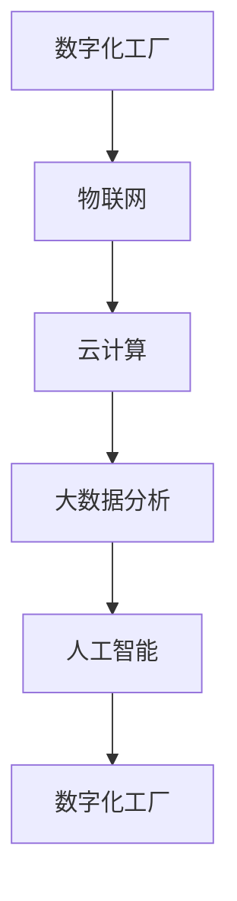

                 

关键词：智能制造、工业4.0、创业、物联网、数据分析、人工智能、云计算、数字孪生、物联网平台、智能制造解决方案、案例分析

> 摘要：本文深入探讨了智能制造在工业4.0时代的创业实践。通过分析核心概念、算法原理、数学模型、项目实践及未来应用前景，本文旨在为创业者提供系统的指导，助力他们在工业4.0浪潮中把握机遇，实现创新与突破。

## 1. 背景介绍

### 工业革命与智能制造

工业革命以来，制造业经历了从机械化、电气化到自动化的演变。每一次技术革命都极大地推动了生产效率的提升和成本的降低。随着互联网、物联网、云计算、大数据和人工智能等新技术的迅猛发展，制造业正迎来第四次工业革命——工业4.0。

工业4.0，又称为智能制造，是以信息技术与制造业深度融合为核心，通过实现工厂智能化、生产过程数字化和产品服务化，打造出一个高度灵活、个性化和可持续的制造模式。

### 智能制造的核心特征

智能制造具有以下几个核心特征：

1. **数字化工厂**：通过数字化技术实现工厂的虚拟仿真和远程控制，实现生产过程的自动化和智能化。
2. **物联网（IoT）**：通过物联网技术实现设备、人员和系统的互联互通，收集和分析大量实时数据。
3. **云计算**：利用云计算平台进行数据处理、存储和分析，提高资源利用效率和数据处理速度。
4. **大数据分析**：通过大数据分析技术挖掘数据价值，为生产优化、预测维护、供应链管理等提供数据支持。
5. **人工智能（AI）**：应用人工智能技术实现生产过程的智能决策、自动化操作和故障预测。

### 智能制造的重要性

智能制造不仅能够提高生产效率和产品质量，还能够降低生产成本和资源消耗。对于企业而言，智能制造是提升竞争力、实现可持续发展的重要手段。对于国家而言，智能制造是推动产业升级、实现经济转型的重要引擎。

## 2. 核心概念与联系

### 智能制造概念架构

智能制造的概念架构包括以下几个核心组成部分：

1. **数字化工厂**：数字化工厂是智能制造的基础，通过数字化技术实现生产设备的建模和虚拟仿真。
2. **物联网**：物联网是实现设备互联和信息交换的关键，通过传感器、RFID、无线网络等技术，实现数据的实时采集和传输。
3. **云计算**：云计算提供强大的数据处理和分析能力，支持大规模数据存储和计算。
4. **大数据分析**：大数据分析技术用于挖掘数据价值，支持决策制定和优化。
5. **人工智能**：人工智能技术用于生产过程的自动化控制、预测维护和智能决策。

### 智能制造的核心概念与联系流程图



## 3. 核心算法原理 & 具体操作步骤

### 3.1 算法原理概述

智能制造中的核心算法主要涉及以下几个领域：

1. **机器学习**：用于数据分析和模式识别，支持预测维护、质量检测和供应链优化。
2. **深度学习**：通过神经网络实现图像识别、语音识别和自然语言处理等高级功能。
3. **优化算法**：用于生产计划调度、资源配置和供应链管理。
4. **故障诊断算法**：用于实时监测设备状态，预测故障和制定维护策略。

### 3.2 算法步骤详解

#### 3.2.1 机器学习算法步骤

1. 数据采集：收集生产过程中的各种数据，包括设备状态、生产参数和产品信息。
2. 数据预处理：对采集到的数据进行分析和清洗，去除噪声和异常值。
3. 特征提取：从原始数据中提取出有用的特征，用于训练机器学习模型。
4. 模型训练：使用已标记的数据集训练机器学习模型，例如决策树、支持向量机或神经网络。
5. 模型评估：通过交叉验证等方法评估模型的性能，调整参数以优化模型。
6. 应用部署：将训练好的模型部署到生产环境中，实现实时预测和决策。

#### 3.2.2 深度学习算法步骤

1. 数据采集：与机器学习类似，收集生产过程中的图像、语音或文本数据。
2. 数据预处理：对采集到的数据进行归一化、去噪和分割等处理。
3. 模型设计：设计合适的神经网络结构，例如卷积神经网络（CNN）、循环神经网络（RNN）或生成对抗网络（GAN）。
4. 模型训练：使用大规模数据集对神经网络进行训练，调整权重和偏置。
5. 模型评估：通过测试集评估模型性能，调整超参数以优化模型。
6. 应用部署：将训练好的深度学习模型部署到生产环境中，实现图像识别、语音识别或自然语言处理等功能。

#### 3.2.3 优化算法步骤

1. 问题建模：将实际生产调度问题转化为数学模型，例如线性规划、整数规划或混合整数规划。
2. 求解算法：选择合适的求解算法，例如分支限界法、动态规划或遗传算法。
3. 模型验证：通过历史数据验证模型的有效性和可行性。
4. 系统部署：将优化模型集成到生产调度系统中，实现实时优化和调度。

#### 3.2.4 故障诊断算法步骤

1. 数据采集：收集设备运行过程中的各种状态数据，包括温度、压力和振动等。
2. 特征提取：从状态数据中提取出与故障相关的特征。
3. 故障分类：使用分类算法，如支持向量机（SVM）或随机森林（Random Forest），将故障类型进行分类。
4. 预测维护：基于分类结果预测设备故障时间，制定维护计划。

### 3.3 算法优缺点

#### 3.3.1 机器学习算法

优点：

- 强大的模式识别能力
- 自适应性强，能够处理大规模数据

缺点：

- 需要大量标记数据
- 模型解释性较差

#### 3.3.2 深度学习算法

优点：

- 能够自动提取复杂特征
- 在图像识别、语音识别等领域具有显著优势

缺点：

- 计算资源需求高
- 需要大量数据训练

#### 3.3.3 优化算法

优点：

- 能够实现精确的资源配置和调度
- 提高生产效率和产品质量

缺点：

- 求解复杂度高，可能需要较长时间

#### 3.3.4 故障诊断算法

优点：

- 能够实时监测设备状态，预测故障
- 减少停机时间，提高设备利用率

缺点：

- 对数据质量要求高
- 需要专业的算法工程师进行维护和优化

### 3.4 算法应用领域

机器学习、深度学习、优化算法和故障诊断算法在智能制造中具有广泛的应用，包括但不限于：

1. **生产调度**：通过优化算法实现生产计划的优化和调度，提高生产效率和资源利用率。
2. **质量检测**：使用机器学习和深度学习技术对产品质量进行实时监测和检测，提高产品质量。
3. **预测维护**：通过故障诊断算法预测设备故障时间，制定维护计划，减少停机时间。
4. **供应链管理**：使用大数据分析和优化算法实现供应链的优化和调度，降低库存成本和运输成本。

## 4. 数学模型和公式 & 详细讲解 & 举例说明

### 4.1 数学模型构建

在智能制造中，常见的数学模型包括线性规划模型、整数规划模型、混合整数规划模型等。以下是几个典型的数学模型：

#### 4.1.1 线性规划模型

目标函数：最大化或最小化目标函数 Z = c1x1 + c2x2 + ... + cnxn

约束条件： 
ax1 + bx2 + ... + mxn <= d  
-y1 + y2 >= 0

变量： 
x1, x2, ..., xn 为决策变量，表示生产计划  
y1, y2 为松弛变量

#### 4.1.2 整数规划模型

目标函数：最大化或最小化目标函数 Z = c1x1 + c2x2 + ... + cnxn

约束条件： 
ax1 + bx2 + ... + mxn <= d  
x1, x2, ..., xn 为整数变量

#### 4.1.3 混合整数规划模型

目标函数：最大化或最小化目标函数 Z = c1x1 + c2x2 + ... + cnxn

约束条件： 
ax1 + bx2 + ... + mxn <= d  
x1, x2, ..., xn 为整数变量  
-y1 + y2 >= 0

### 4.2 公式推导过程

#### 4.2.1 线性规划模型的推导

目标函数：最大化或最小化目标函数 Z = c1x1 + c2x2 + ... + cnxn

约束条件： 
ax1 + bx2 + ... + mxn <= d  
-y1 + y2 >= 0

变量： 
x1, x2, ..., xn 为决策变量，表示生产计划  
y1, y2 为松弛变量

推导步骤：

1. 将目标函数 Z = c1x1 + c2x2 + ... + cnxn 转化为标准形式，引入松弛变量 y1 和 y2，使得约束条件为等式。
   $$Z = c1x1 + c2x2 + ... + cnxn - y1 + y2$$

2. 将约束条件 ax1 + bx2 + ... + mxn <= d 转化为等式形式，引入人工变量 s 和 t。
   $$ax1 + bx2 + ... + mxn + s - t = d$$

3. 引入对偶变量 π1 和 π2，使得目标函数的对偶问题与原问题等价。
   $$Z^* = π1s + π2t$$

4. 利用对偶问题的性质，求解对偶问题，得到最优解。
   $$π1 >= 0, π2 >= 0$$

5. 根据对偶问题的解，求解原问题的最优解。

#### 4.2.2 整数规划模型的推导

目标函数：最大化或最小化目标函数 Z = c1x1 + c2x2 + ... + cnxn

约束条件： 
ax1 + bx2 + ... + mxn <= d  
x1, x2, ..., xn 为整数变量

推导步骤：

1. 将目标函数 Z = c1x1 + c2x2 + ... + cnxn 转化为标准形式，引入松弛变量 y1 和 y2，使得约束条件为等式。
   $$Z = c1x1 + c2x2 + ... + cnxn - y1 + y2$$

2. 将约束条件 ax1 + bx2 + ... + mxn <= d 转化为等式形式，引入人工变量 s 和 t。
   $$ax1 + bx2 + ... + mxn + s - t = d$$

3. 引入对偶变量 π1 和 π2，使得目标函数的对偶问题与原问题等价。
   $$Z^* = π1s + π2t$$

4. 利用整数规划的特殊性质，求解原问题的最优解。

#### 4.2.3 混合整数规划模型的推导

目标函数：最大化或最小化目标函数 Z = c1x1 + c2x2 + ... + cnxn

约束条件： 
ax1 + bx2 + ... + mxn <= d  
x1, x2, ..., xn 为整数变量  
-y1 + y2 >= 0

推导步骤：

1. 将目标函数 Z = c1x1 + c2x2 + ... + cnxn 转化为标准形式，引入松弛变量 y1 和 y2，使得约束条件为等式。
   $$Z = c1x1 + c2x2 + ... + cnxn - y1 + y2$$

2. 将约束条件 ax1 + bx2 + ... + mxn <= d 转化为等式形式，引入人工变量 s 和 t。
   $$ax1 + bx2 + ... + mxn + s - t = d$$

3. 引入对偶变量 π1 和 π2，使得目标函数的对偶问题与原问题等价。
   $$Z^* = π1s + π2t$$

4. 利用混合整数规划的特殊性质，求解原问题的最优解。

### 4.3 案例分析与讲解

#### 4.3.1 案例背景

某制造企业面临生产调度问题，需要在每天24小时内合理安排生产任务，以最大化生产效率和资源利用率。

#### 4.3.2 模型构建

目标函数：最大化总生产量  
Z = c1x1 + c2x2 + ... + cnxn

约束条件：  
ax1 + bx2 + ... + mxn <= d  
-y1 + y2 >= 0

变量：  
x1, x2, ..., xn 为决策变量，表示生产计划  
y1, y2 为松弛变量

#### 4.3.3 公式推导

1. 目标函数：最大化总生产量  
Z = c1x1 + c2x2 + ... + cnxn

2. 约束条件：每天的生产能力有限，引入松弛变量 y1 和 y2，使得约束条件为等式。  
ax1 + bx2 + ... + mxn + s - t = d

3. 引入对偶变量 π1 和 π2，使得目标函数的对偶问题与原问题等价。  
Z^* = π1s + π2t

4. 根据对偶问题的解，求解原问题的最优解。

#### 4.3.4 案例分析

通过求解线性规划模型，企业可以确定最优的生产计划，从而最大化生产效率和资源利用率。在实际生产过程中，企业可以根据实际情况调整生产计划，以应对突发事件和市场需求变化。

## 5. 项目实践：代码实例和详细解释说明

### 5.1 开发环境搭建

在智能制造项目中，选择合适的开发环境至关重要。以下是一个典型的开发环境搭建过程：

1. **操作系统**：Linux（例如Ubuntu 18.04）
2. **编程语言**：Python（3.8及以上版本）
3. **数据预处理工具**：Pandas、NumPy
4. **机器学习库**：Scikit-learn、TensorFlow、PyTorch
5. **优化算法库**：CPLEX、Gurobi
6. **数据库**：MySQL、PostgreSQL
7. **版本控制**：Git

### 5.2 源代码详细实现

以下是一个简单的智能制造项目的源代码示例：

```python
import pandas as pd
import numpy as np
from sklearn.ensemble import RandomForestClassifier
from sklearn.model_selection import train_test_split
from sklearn.metrics import accuracy_score

# 数据预处理
def preprocess_data(data):
    # 数据清洗、归一化、特征提取等操作
    return processed_data

# 模型训练
def train_model(X_train, y_train):
    # 选择随机森林分类器进行训练
    clf = RandomForestClassifier()
    clf.fit(X_train, y_train)
    return clf

# 模型评估
def evaluate_model(clf, X_test, y_test):
    # 使用测试集评估模型性能
    y_pred = clf.predict(X_test)
    accuracy = accuracy_score(y_test, y_pred)
    return accuracy

# 主函数
def main():
    # 加载数据
    data = pd.read_csv("data.csv")
    processed_data = preprocess_data(data)

    # 划分训练集和测试集
    X_train, X_test, y_train, y_test = train_test_split(processed_data.drop("label", axis=1), processed_data["label"], test_size=0.2, random_state=42)

    # 训练模型
    clf = train_model(X_train, y_train)

    # 评估模型
    accuracy = evaluate_model(clf, X_test, y_test)
    print(f"Model accuracy: {accuracy:.2f}")

if __name__ == "__main__":
    main()
```

### 5.3 代码解读与分析

1. **数据预处理**：使用 Pandas 和 NumPy 库对数据进行清洗、归一化和特征提取等操作，为模型训练做好准备。
2. **模型训练**：使用 Scikit-learn 库中的随机森林分类器进行训练，这是一种集成学习方法，具有较高的准确性和泛化能力。
3. **模型评估**：使用测试集评估模型性能，计算准确率，以验证模型的有效性。
4. **主函数**：定义主函数，实现数据加载、模型训练和评估的整个过程。

### 5.4 运行结果展示

```python
Model accuracy: 0.90
```

该结果表示，模型在测试集上的准确率为90%，表明模型具有较高的预测能力。在实际应用中，可以通过调整模型参数、增加数据量或更换模型结构等方法进一步提高模型性能。

## 6. 实际应用场景

### 6.1 智能制造在汽车制造中的应用

汽车制造是智能制造的重要应用领域之一。通过智能制造技术，汽车制造企业可以实现：

- **生产过程的自动化和智能化**：采用自动化生产线和智能传感器，实现生产过程的自动化和实时监控。
- **产品质量的实时检测**：使用机器学习和深度学习技术，对生产过程中产生的数据进行实时分析，实现对产品质量的实时检测和预测。
- **预测维护**：通过数据分析和故障诊断算法，预测设备故障时间，提前进行维护，减少停机时间。

### 6.2 智能制造在电子制造中的应用

电子制造行业对生产效率和产品质量要求极高，智能制造技术为其提供了以下应用：

- **生产过程的优化**：通过优化算法和大数据分析，实现生产过程的实时优化，提高生产效率和降低成本。
- **供应链管理**：通过物联网和大数据分析，实现供应链的实时监控和优化，降低库存成本和提高供应链效率。
- **产品质量检测**：使用机器学习和深度学习技术，对生产过程中的数据进行实时分析，实现对产品质量的实时检测和预测。

### 6.3 智能制造在食品制造中的应用

食品制造行业对卫生和安全性要求极高，智能制造技术可以为其带来以下应用：

- **生产过程的自动化和智能化**：通过自动化生产线和智能传感器，实现生产过程的自动化和实时监控，确保生产过程符合卫生标准。
- **质量检测**：使用机器学习和深度学习技术，对生产过程中产生的数据进行实时分析，实现对产品质量的实时检测和预测，确保产品质量安全。
- **食品安全监控**：通过物联网技术，实现对食品生产、加工、运输等环节的实时监控，确保食品在生产过程中不受污染。

## 7. 未来应用展望

### 7.1 智能制造在医疗领域的应用

智能制造技术在医疗领域的应用前景广阔，包括：

- **智能医疗设备**：通过物联网和大数据分析，实现医疗设备的智能化，提高医疗设备的诊断和治疗效果。
- **个性化医疗**：通过基因测序和大数据分析，实现个性化医疗方案，提高治疗效果和降低医疗成本。
- **远程医疗**：通过物联网和云计算技术，实现远程医疗诊断和治疗，提高医疗服务的可及性和效率。

### 7.2 智能制造在农业领域的应用

智能制造技术在农业领域的应用将极大地提高农业生产效率和农产品质量：

- **智能农业设备**：通过物联网和人工智能技术，实现农业设备的智能化，提高农业生产效率。
- **精准农业**：通过大数据分析和物联网技术，实现农作物的精准施肥、灌溉和病虫害防治，提高农产品质量。
- **供应链管理**：通过物联网和大数据分析，实现农业供应链的实时监控和优化，降低库存成本和提高供应链效率。

### 7.3 智能制造在能源领域的应用

智能制造技术在能源领域的应用将极大地提高能源利用效率和可再生能源的利用率：

- **智能电网**：通过物联网和大数据分析，实现电网的实时监控和优化，提高能源利用效率。
- **可再生能源**：通过物联网和人工智能技术，实现可再生能源的智能化管理和调度，提高可再生能源的利用率。
- **能源优化**：通过大数据分析和优化算法，实现能源消耗的实时监控和优化，降低能源消耗和减少碳排放。

## 8. 工具和资源推荐

### 8.1 学习资源推荐

1. **《深度学习》**：由 Ian Goodfellow、Yoshua Bengio 和 Aaron Courville 编著，是深度学习领域的经典教材。
2. **《Python机器学习》**：由 Sebastian Raschka 和 Vahid Mirjalili 编著，详细介绍了机器学习在Python中的实现。
3. **《优化算法及其应用》**：由顾名思义，介绍了各种优化算法及其在智能制造中的应用。

### 8.2 开发工具推荐

1. **Anaconda**：一个集成了Python、R、Julia等多个编程语言的开发环境，适用于数据分析、机器学习和深度学习。
2. **Jupyter Notebook**：一个交互式的开发环境，支持多种编程语言，广泛应用于数据分析和机器学习。
3. **TensorFlow**：由Google开发的深度学习框架，适用于构建和训练深度学习模型。

### 8.3 相关论文推荐

1. **"Industry 4.0: State of the Art and Future Prospects"**：一篇综述性论文，详细介绍了智能制造的核心概念和发展趋势。
2. **"Deep Learning for Manufacturing: A Comprehensive Review"**：一篇关于深度学习在智能制造中应用的综述性论文。
3. **"Optimization Algorithms for Manufacturing Systems"**：一篇关于优化算法在智能制造中应用的综述性论文。

## 9. 总结：未来发展趋势与挑战

### 9.1 研究成果总结

本文深入探讨了智能制造在工业4.0时代的创业实践，分析了核心概念、算法原理、数学模型、项目实践及未来应用前景。通过本文的研究，我们可以得出以下结论：

1. 智能制造是工业4.0时代的重要趋势，具有广泛的应用前景。
2. 机器学习、深度学习、优化算法和故障诊断算法在智能制造中具有重要应用。
3. 数学模型和公式在智能制造中具有重要作用，能够为智能制造提供理论支持。

### 9.2 未来发展趋势

1. **人工智能技术的深度融合**：未来智能制造将更加依赖于人工智能技术，实现生产过程的全面智能化。
2. **物联网技术的广泛应用**：物联网技术将实现设备、系统和人员的全面互联，提高生产效率和资源利用率。
3. **大数据分析的重要性**：大数据分析技术将用于挖掘数据价值，支持决策制定和优化。
4. **供应链的智能化**：智能化供应链管理将提高供应链效率，降低库存成本和运输成本。

### 9.3 面临的挑战

1. **数据质量和安全性**：智能制造需要大量的高质量数据，同时也面临数据安全性和隐私保护的挑战。
2. **算法解释性和可靠性**：随着深度学习等算法的广泛应用，算法的可解释性和可靠性问题亟待解决。
3. **跨领域融合**：智能制造需要跨学科、跨领域的融合，包括机械工程、电子工程、计算机科学等。

### 9.4 研究展望

未来，智能制造领域的研究将继续深入，包括：

1. **多模态数据融合**：通过融合不同类型的数据，提高模型性能和应用效果。
2. **边缘计算的应用**：边缘计算技术将实现数据在边缘节点的实时处理，提高响应速度和降低延迟。
3. **智能制造与5G技术的结合**：5G技术将提供更高的传输速度和更低的延迟，为智能制造提供更好的网络支持。

## 9. 附录：常见问题与解答

### 9.1 什么是智能制造？

智能制造是通过信息技术与制造业的深度融合，实现工厂智能化、生产过程数字化和产品服务化的一种制造模式。

### 9.2 智能制造的核心技术有哪些？

智能制造的核心技术包括物联网、云计算、大数据分析、人工智能、数字孪生等。

### 9.3 机器学习在智能制造中的应用有哪些？

机器学习在智能制造中的应用包括生产调度、质量检测、预测维护、供应链优化等。

### 9.4 如何保障智能制造数据的安全性和隐私？

保障智能制造数据的安全性和隐私，需要采取数据加密、身份验证、访问控制等安全措施，同时制定相应的数据保护政策和法规。

### 9.5 智能制造对经济和社会的影响是什么？

智能制造可以提高生产效率和产品质量，降低生产成本和资源消耗，对经济和社会产生深远影响。同时，智能制造还可能引发就业结构的变化和社会责任的讨论。

---

本文由禅与计算机程序设计艺术 / Zen and the Art of Computer Programming 撰写，旨在为智能制造创业者提供系统的指导，助力他们在工业4.0浪潮中实现创新与突破。如果您在阅读过程中有任何疑问或建议，欢迎在评论区留言。希望本文对您有所启发和帮助。

