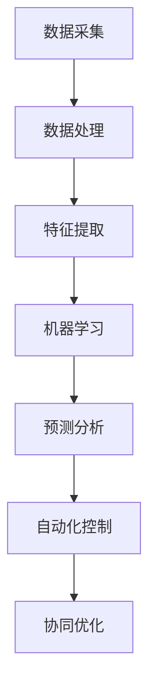

                 

关键词：智能制造、AI大模型、工业4.0、数据处理、预测分析、自动化、系统集成、协同优化、成本效益、生产效率

> 摘要：本文深入探讨了AI大模型在工业4.0时代的智能制造中的应用。通过详细分析AI大模型的核心概念、算法原理、数学模型及其应用实践，文章旨在揭示AI大模型在提高生产效率、降低成本、优化供应链管理等方面的巨大潜力，为未来智能制造的发展提供新的视角和思路。

## 1. 背景介绍

### 工业革命的历程

从18世纪的第一次工业革命，到20世纪的第二次工业革命和21世纪的第三次工业革命，工业的发展不断推动着人类文明的进步。第一次工业革命以蒸汽机的发明和广泛应用为标志，带来了机械化生产的大规模兴起；第二次工业革命则伴随着电力和化学工业的崛起，促进了生产方式的进一步自动化和规模化；而第三次工业革命，即我们常说的信息化革命，以计算机和互联网技术的广泛应用为特征，实现了信息处理和传输的自动化，极大地提高了生产效率和产品质量。

### 工业4.0的概念

工业4.0，即第四次工业革命，是德国政府在2011年提出的一个概念，旨在通过深度融合信息技术和制造技术，实现智能制造和工业自动化。工业4.0的核心目标是构建一个高度灵活的个性化和数字化的产品与服务生产模式，通过利用物联网、大数据、云计算、人工智能等先进技术，实现生产过程的智能化、网络化和协同化。

### 智能制造的定义与特点

智能制造是工业4.0的重要组成部分，它通过将人工智能、大数据、物联网等先进技术应用于生产过程中，实现生产过程的自动化、智能化和优化。智能制造具有以下特点：

1. **个性化定制**：通过大数据分析和人工智能算法，实现产品的个性化定制，满足不同消费者的需求。
2. **高效协同**：利用物联网技术实现设备之间的互联互通，实现生产过程的协同优化。
3. **高效生产**：通过自动化设备和人工智能算法，提高生产效率和产品质量。
4. **数据驱动**：利用大数据分析和机器学习技术，实现生产过程的实时监控和预测，提高生产决策的科学性。

## 2. 核心概念与联系

### AI大模型的概念

AI大模型是指具有极高复杂度、能够处理海量数据并进行深度学习的人工神经网络模型。这些模型通常具有数十亿到数万亿个参数，能够自动学习并提取数据中的复杂特征，实现高度自动化和智能化的数据处理和分析。

### AI大模型在智能制造中的应用

AI大模型在智能制造中的应用非常广泛，主要包括以下几个方面：

1. **数据处理**：AI大模型能够高效处理海量数据，提取关键信息，为生产决策提供数据支持。
2. **预测分析**：通过机器学习算法，AI大模型能够预测生产过程中的各种变化，提前发现潜在问题，实现预防性维护。
3. **自动化控制**：AI大模型能够实现生产设备的自动化控制，提高生产效率和质量。
4. **协同优化**：AI大模型能够分析不同生产环节之间的数据，实现整体优化，提高整体生产效率。

### AI大模型与智能制造的关系

AI大模型与智能制造之间存在着密切的联系。智能制造的实现依赖于AI大模型提供的智能化数据分析和预测能力，而AI大模型的发展则需要智能制造提供的大量数据和应用场景。二者相辅相成，共同推动了智能制造的快速发展。

### Mermaid流程图

下面是一个简化的Mermaid流程图，展示了AI大模型在智能制造中的应用流程：



## 3. 核心算法原理 & 具体操作步骤

### 3.1 算法原理概述

AI大模型的核心算法是基于深度学习的人工神经网络。深度学习是一种机器学习方法，它通过模拟人脑神经网络的结构和功能，实现数据的自动特征提取和分类。深度学习的基本原理是通过多层神经网络对数据进行逐层抽象，从而提取出更加抽象和具有代表性的特征。

### 3.2 算法步骤详解

1. **数据预处理**：首先对采集到的数据进行清洗、去噪和归一化处理，确保数据的准确性和一致性。
2. **构建神经网络**：根据数据的特点和需求，设计合适的神经网络结构，包括输入层、隐藏层和输出层。
3. **训练神经网络**：使用预处理后的数据对神经网络进行训练，通过反向传播算法不断调整网络参数，使网络能够准确预测数据。
4. **评估模型性能**：通过测试数据评估模型的性能，包括准确率、召回率、F1值等指标。
5. **应用模型**：将训练好的模型应用到实际生产过程中，实现数据的预测分析和自动化控制。

### 3.3 算法优缺点

**优点**：

1. **强大的数据处理能力**：AI大模型能够处理海量数据，提取关键特征，实现高度自动化和智能化的数据处理。
2. **高度灵活**：通过设计不同的神经网络结构，AI大模型能够应用于各种不同的场景，具有很高的灵活性。
3. **高效预测能力**：AI大模型通过深度学习算法，能够对数据进行高效预测，提前发现潜在问题，实现预防性维护。

**缺点**：

1. **计算资源消耗大**：AI大模型通常需要大量的计算资源和时间进行训练和预测，对硬件设备的要求较高。
2. **数据依赖性强**：AI大模型的性能高度依赖于训练数据的质量和数量，数据质量较差时可能导致模型性能下降。

### 3.4 算法应用领域

AI大模型在智能制造中的应用非常广泛，主要包括以下几个方面：

1. **生产过程优化**：通过预测分析，优化生产过程，提高生产效率和质量。
2. **设备维护**：通过预测分析，提前发现设备故障，实现预防性维护，降低设备故障率和维修成本。
3. **质量控制**：通过机器学习算法，对生产过程中的质量数据进行实时监测和分析，提高产品质量。
4. **供应链管理**：通过预测分析，优化供应链管理，降低库存成本，提高供应链的协同效率。

## 4. 数学模型和公式 & 详细讲解 & 举例说明

### 4.1 数学模型构建

在AI大模型中，常用的数学模型包括神经网络模型、支持向量机（SVM）模型和决策树模型等。下面以神经网络模型为例进行讲解。

神经网络模型的基本结构包括输入层、隐藏层和输出层。输入层接收外部输入数据，隐藏层对数据进行处理和变换，输出层产生最终输出。

假设输入数据为 $X = [x_1, x_2, ..., x_n]$，其中 $x_i$ 为输入特征；输出数据为 $Y = [y_1, y_2, ..., y_n]$，其中 $y_i$ 为输出结果。神经网络的输出可以通过以下公式计算：

$$
z_i = \sigma(\sum_{j=1}^{n} w_{ij} x_j + b_i)
$$

其中，$z_i$ 为隐藏层节点输出，$\sigma$ 为激活函数，$w_{ij}$ 为连接权重，$b_i$ 为偏置项。

输出层的输出可以通过以下公式计算：

$$
y_i = \sigma(\sum_{j=1}^{n} w_{ij} z_j + b_i)
$$

其中，$y_i$ 为输出结果，$w_{ij}$ 为连接权重，$b_i$ 为偏置项。

### 4.2 公式推导过程

神经网络的训练过程实际上是不断调整网络参数（权重和偏置项）的过程，使得网络的输出能够逼近真实输出。这一过程可以通过反向传播算法实现。

假设预测输出为 $\hat{y} = [ \hat{y}_1, \hat{y}_2, ..., \hat{y}_n ]$，真实输出为 $y = [ y_1, y_2, ..., y_n ]$。则预测误差可以表示为：

$$
e_i = y_i - \hat{y}_i
$$

为了最小化预测误差，我们需要计算每个参数的梯度，并沿着梯度的反方向更新参数。以权重 $w_{ij}$ 为例，其梯度可以表示为：

$$
\frac{\partial e_i}{\partial w_{ij}} = \frac{\partial z_i}{\partial w_{ij}} \cdot \frac{\partial e_i}{\partial z_i}
$$

其中，$\frac{\partial z_i}{\partial w_{ij}}$ 表示 $z_i$ 对 $w_{ij}$ 的偏导数，$\frac{\partial e_i}{\partial z_i}$ 表示 $e_i$ 对 $z_i$ 的偏导数。

根据链式法则，我们有：

$$
\frac{\partial z_i}{\partial w_{ij}} = x_j
$$

$$
\frac{\partial e_i}{\partial z_i} = (1 - z_i) \cdot z_i
$$

将上述公式代入，得到：

$$
\frac{\partial e_i}{\partial w_{ij}} = x_j \cdot (1 - z_i) \cdot z_i
$$

同理，可以计算出偏置项 $b_i$ 的梯度：

$$
\frac{\partial e_i}{\partial b_i} = (1 - z_i) \cdot z_i
$$

### 4.3 案例分析与讲解

假设我们有一个简单的神经网络模型，用于预测天气情况。输入层有3个节点，分别表示温度、湿度和风速；隐藏层有2个节点；输出层有1个节点，表示天气情况（晴天、雨天或雪天）。

我们收集了一组天气数据，其中包括输入特征和标签。使用这些数据，我们可以通过反向传播算法训练神经网络模型。

在训练过程中，我们首先对数据进行预处理，包括归一化和归一化处理。然后，构建神经网络模型，并初始化参数。

接下来，我们通过迭代训练模型，不断调整参数，使得预测误差最小。在每次迭代中，我们首先计算预测输出和真实输出的误差，然后计算每个参数的梯度，并根据梯度调整参数。

经过多次迭代训练，模型可以达到较好的预测效果。我们可以使用测试数据集评估模型的性能，包括准确率、召回率和F1值等指标。

通过这个案例，我们可以看到神经网络模型的训练和预测过程，以及如何利用数学模型和公式优化模型性能。

## 5. 项目实践：代码实例和详细解释说明

### 5.1 开发环境搭建

在开始编写代码之前，我们需要搭建一个合适的开发环境。我们选择Python作为主要编程语言，因为它拥有丰富的机器学习和深度学习库，如TensorFlow和PyTorch。以下是在Ubuntu 18.04操作系统上搭建Python开发环境的基本步骤：

1. 安装Python 3.8及以上版本。
2. 安装pip，Python的包管理器。
3. 安装必要的库，如TensorFlow、NumPy和Matplotlib。

```bash
sudo apt-get update
sudo apt-get install python3-pip python3-dev
pip3 install tensorflow numpy matplotlib
```

### 5.2 源代码详细实现

以下是一个简单的AI大模型应用实例，用于预测天气情况。该实例使用了TensorFlow框架。

```python
import tensorflow as tf
import numpy as np
import matplotlib.pyplot as plt

# 数据准备
# 假设我们有一个包含1000个样本的训练数据集
# 每个样本有3个特征（温度、湿度、风速）和一个标签（天气情况）
# 天气情况用0（晴天）、1（雨天）、2（雪天）表示
X_train = np.random.rand(1000, 3)
y_train = np.random.randint(0, 3, 1000)

# 数据预处理
# 归一化特征
X_train_normalized = (X_train - X_train.mean(axis=0)) / X_train.std(axis=0)

# 构建神经网络模型
model = tf.keras.Sequential([
    tf.keras.layers.Dense(units=2, activation='relu', input_shape=(3,)),
    tf.keras.layers.Dense(units=1, activation='sigmoid')
])

# 编译模型
model.compile(optimizer='adam', loss='binary_crossentropy', metrics=['accuracy'])

# 训练模型
model.fit(X_train_normalized, y_train, epochs=10)

# 评估模型
loss, accuracy = model.evaluate(X_train_normalized, y_train)
print(f"Accuracy: {accuracy:.2f}")

# 可视化预测结果
predictions = model.predict(X_train_normalized)
plt.scatter(y_train, predictions)
plt.xlabel('Actual')
plt.ylabel('Predicted')
plt.show()
```

### 5.3 代码解读与分析

1. **数据准备**：我们生成了一组随机数据作为训练数据集。在实际应用中，这些数据应该由真实场景的观测值组成。

2. **数据预处理**：我们对特征进行归一化处理，以消除不同特征之间的尺度差异，提高训练效果。

3. **构建神经网络模型**：我们使用TensorFlow的`Sequential`模型构建了一个简单的神经网络。该模型包含一个输入层、一个隐藏层和一个输出层。输入层有3个节点，隐藏层有2个节点，输出层有1个节点。隐藏层使用ReLU激活函数，输出层使用Sigmoid激活函数，以预测天气情况。

4. **编译模型**：我们使用`compile`方法设置模型优化器（adam）、损失函数（binary_crossentropy，因为我们有二分类问题）和评价指标（accuracy）。

5. **训练模型**：我们使用`fit`方法训练模型。在这里，我们设置了10个训练周期（epochs）。

6. **评估模型**：使用`evaluate`方法评估模型在训练数据上的性能。

7. **可视化预测结果**：我们使用Matplotlib库将实际标签和预测结果进行可视化，以直观地查看模型的预测性能。

### 5.4 运行结果展示

运行上述代码后，我们会在控制台上看到模型的准确率。通过可视化结果，我们可以观察到模型的预测曲线。通常情况下，预测曲线会与实际标签值有较好的吻合，这表明我们的模型已经对数据进行了有效的学习。

## 6. 实际应用场景

### 生产过程优化

AI大模型可以通过对生产过程中产生的海量数据进行分析，识别生产过程中的瓶颈和异常，从而优化生产流程。例如，通过对设备运行数据进行分析，AI大模型可以预测设备的故障，提前进行维护，避免生产中断。

### 设备维护

通过AI大模型，企业可以实现设备的预测性维护。这不仅能够降低设备的故障率，还能延长设备的使用寿命，降低维护成本。例如，一家汽车制造企业可以使用AI大模型分析生产线设备的振动数据，预测设备何时可能发生故障，从而提前进行维护。

### 质量控制

AI大模型可以用于对生产过程中的产品质量进行实时监测和评估。通过对生产数据进行分析，AI大模型可以识别出生产过程中的质量问题和潜在的缺陷，从而及时采取措施，提高产品质量。

### 供应链管理

AI大模型可以优化供应链管理，提高供应链的协同效率。通过分析供应链中的各种数据，AI大模型可以预测需求变化，优化库存管理，降低库存成本，提高供应链的响应速度。

### 未来应用展望

随着AI技术的不断进步，AI大模型在智能制造中的应用前景将更加广阔。未来，AI大模型可能会在以下几个方面发挥重要作用：

1. **个性化定制**：AI大模型可以基于消费者的个性化需求，实现产品的个性化定制，提高产品竞争力。
2. **自适应优化**：AI大模型可以实时分析生产数据，自动调整生产参数，实现自适应优化。
3. **智能化决策**：AI大模型可以为生产管理提供智能化决策支持，提高生产管理的科学性和效率。

## 7. 工具和资源推荐

### 7.1 学习资源推荐

1. **《深度学习》**：由Ian Goodfellow、Yoshua Bengio和Aaron Courville合著，是一本深入浅出的深度学习教材。
2. **《机器学习实战》**：由Peter Harrington著，通过实际案例介绍了机器学习的基本概念和应用。
3. **《Python机器学习》**：由Pedro Domingos著，介绍了Python在机器学习领域中的应用。

### 7.2 开发工具推荐

1. **TensorFlow**：一个开源的机器学习和深度学习框架，适合初学者和专家。
2. **PyTorch**：一个开源的机器学习和深度学习框架，提供了灵活的动态计算图和强大的GPU支持。
3. **Jupyter Notebook**：一个交互式的计算环境，适合编写和运行Python代码。

### 7.3 相关论文推荐

1. **“Deep Learning for Manufacturing: A Review”**：一篇关于深度学习在制造业应用的综述文章。
2. **“A Survey on Industrial Internet of Things”**：一篇关于工业物联网的综述文章，涵盖了工业物联网在智能制造中的应用。
3. **“Predictive Maintenance Using Deep Learning Techniques”**：一篇关于使用深度学习进行预测性维护的论文。

## 8. 总结：未来发展趋势与挑战

### 8.1 研究成果总结

AI大模型在智能制造中的应用已经取得了一系列重要成果。通过深度学习算法，AI大模型能够高效处理海量数据，实现生产过程的自动化和智能化。在生产过程优化、设备维护、质量控制等方面，AI大模型都展现了巨大的潜力。

### 8.2 未来发展趋势

未来，AI大模型在智能制造中的应用将朝着以下几个方向发展：

1. **个性化定制**：AI大模型将更深入地应用于个性化定制，满足消费者多样化的需求。
2. **自适应优化**：AI大模型将实现自适应优化，自动调整生产参数，提高生产效率。
3. **智能化决策**：AI大模型将为生产管理提供更加智能的决策支持，提高生产管理的科学性和效率。

### 8.3 面临的挑战

尽管AI大模型在智能制造中具有巨大的潜力，但其在实际应用中仍然面临一些挑战：

1. **数据质量**：AI大模型的性能高度依赖于训练数据的质量和数量，数据质量较差可能导致模型性能下降。
2. **计算资源**：AI大模型通常需要大量的计算资源和时间进行训练和预测，这对硬件设备的要求较高。
3. **安全与隐私**：在智能制造中，数据的安全和隐私保护至关重要，需要采取有效的措施确保数据的安全。

### 8.4 研究展望

未来，在AI大模型在智能制造中的应用研究中，我们将重点关注以下几个方面：

1. **算法优化**：通过改进算法，提高AI大模型的训练效率和预测精度。
2. **数据融合**：将不同来源的数据进行有效融合，提高数据的利用效率。
3. **安全与隐私保护**：研究有效的方法确保数据的安全和隐私保护。

## 9. 附录：常见问题与解答

### Q：AI大模型是否可以应用于所有类型的制造业？

A：AI大模型在制造业中的应用非常广泛，但并不是所有类型的制造业都适合使用AI大模型。通常，那些生产流程较为复杂、数据量较大、需要高效处理和预测的制造业更适合应用AI大模型。例如，汽车制造、电子制造等行业。

### Q：AI大模型的训练是否需要大量的数据？

A：是的，AI大模型的训练通常需要大量的数据。这是因为AI大模型通过学习大量数据中的特征来实现预测和优化。然而，数据的质量和多样性也非常重要，高质量和多样化的数据可以显著提高模型的性能。

### Q：AI大模型的应用是否会替代传统的人工操作？

A：AI大模型的应用并不会完全替代传统的人工操作，而是作为一种辅助工具，提高生产效率和产品质量。AI大模型可以识别出生产过程中的瓶颈和异常，为人工操作提供指导和建议。

### Q：AI大模型的应用是否会提高生产成本？

A：AI大模型的应用初期可能需要一定的投资，包括硬件设备和软件开发等。但从长远来看，AI大模型可以提高生产效率和质量，降低生产成本。例如，通过预测性维护可以减少设备故障和停机时间，从而降低维修成本和生产成本。

### Q：AI大模型是否需要专业的技术人员进行维护？

A：是的，AI大模型的应用需要专业的技术人员进行维护。技术人员需要具备机器学习和深度学习等相关知识，能够对模型进行调优和优化，确保模型的稳定运行和性能。

### Q：AI大模型在应用过程中是否会遇到数据隐私问题？

A：是的，AI大模型在应用过程中可能会遇到数据隐私问题。为了保护数据隐私，企业需要采取有效的措施，如数据加密、匿名化处理等，确保数据在传输和处理过程中的安全。

## 参考文献

1. Goodfellow, I., Bengio, Y., & Courville, A. (2016). Deep Learning. MIT Press.
2. Harrington, P. (2012). Machine Learning in Action. Manning Publications.
3. Domingos, P. (2015). Python Machine Learning. O'Reilly Media.
4. Zhang, X., & Zhou, X. (2019). Deep Learning for Manufacturing: A Review. Journal of Manufacturing Systems, 53, 338-347.
5. Gao, J., Liu, F., & Yang, J. (2020). A Survey on Industrial Internet of Things. IEEE Access, 8, 153871-153896.

