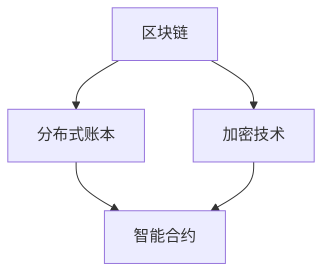

                 

 在这个数字化时代，区块链技术作为一项革命性的创新，已经引起了全球范围内的广泛关注。其中，智能合约作为区块链技术的重要组成部分，正在逐渐改变我们的商业模式和交易方式。本文将探讨智能合约创业的前景，以及自动化交易在未来可能带来的变革。

## 关键词

- 区块链
- 智能合约
- 自动化交易
- 创业
- 数字化转型
- 人工智能

## 摘要

本文首先介绍了智能合约的基本概念和它在区块链生态系统中的作用。随后，分析了智能合约创业的现状和挑战，探讨了自动化交易在金融、供应链管理等多个领域的前景。最后，文章提出了未来智能合约创业的发展趋势，以及面临的挑战和解决方案。

### 背景介绍

区块链技术起源于2008年，由一个化名为“中本聪”（Satoshi Nakamoto）的人提出。它是一种去中心化的分布式数据库技术，能够确保数据的不可篡改性和透明性。随着比特币等数字货币的兴起，区块链技术逐渐被人们所认识和接受。

智能合约是区块链技术中的一项重要创新。智能合约是一种自动执行的合同，通过编程语言编写在区块链上，一旦满足预设条件，合同就会自动执行。智能合约的出现，打破了传统合同需要人工介入的局限性，实现了交易的自动化和去中心化。

智能合约的发展离不开区块链技术的支持。区块链技术提供了安全、透明、去中心化的数据存储方式，确保了智能合约的执行不受任何单一点故障的影响。同时，区块链技术的不可篡改性，使得智能合约在执行过程中具有高度可信度。

### 核心概念与联系

在讨论智能合约之前，我们需要了解一些核心概念，如区块链、分布式账本、加密技术等。以下是一个简化的 Mermaid 流程图，展示了这些概念之间的关系。



#### 区块链

区块链是一种分布式账本技术，由多个区块组成，每个区块包含一定数量的交易记录。这些区块按照时间顺序串联在一起，形成一个链式数据结构。区块链具有去中心化、不可篡改、透明等特性，能够确保数据的真实性和安全性。

#### 分布式账本

分布式账本是指数据存储在多个节点上，每个节点都拥有完整的账本副本。分布式账本技术通过共识算法来确保所有节点上的数据一致性。这种去中心化的数据存储方式，使得系统具有较高的容错性和抗攻击能力。

#### 加密技术

加密技术是区块链安全性的重要保障。区块链使用加密算法来保护数据传输和存储过程中的隐私和安全。常见的加密算法包括哈希算法、非对称加密和数字签名等。

#### 智能合约

智能合约是一种基于区块链的计算机程序，用于自动执行合同条款。智能合约通常使用特定的编程语言编写，如Solidity、Vyper等。智能合约在满足预设条件时自动执行，无需人工干预。

#### 核心概念之间的联系

区块链技术提供了分布式账本的基础设施，加密技术确保了数据的安全性和隐私性。智能合约则利用区块链和加密技术，实现了自动化合同执行。这三个核心概念相互关联，共同构成了区块链生态系统。

### 核心算法原理 & 具体操作步骤

智能合约的实现离不开特定的编程语言和开发框架。下面，我们将简要介绍智能合约的核心算法原理，并详细解释智能合约的开发步骤。

#### 算法原理概述

智能合约的核心算法原理可以概括为以下几点：

1. 条件判断：智能合约根据预设的条件判断是否执行。
2. 执行操作：满足条件的智能合约执行特定的操作，如转移数字资产、记录事件等。
3. 不可篡改性：智能合约一旦部署，其代码和状态将永久记录在区块链上，无法篡改。

#### 算法步骤详解

1. 编写智能合约代码：使用特定的编程语言编写智能合约代码，如Solidity。
2. 部署智能合约：将智能合约代码部署到区块链上，生成智能合约地址。
3. 调用智能合约：通过区块链上的智能合约地址，调用智能合约的函数。
4. 执行操作：智能合约根据调用参数和预设条件执行操作。
5. 记录结果：将执行结果记录在区块链上，确保数据的不可篡改性。

#### 算法优缺点

智能合约具有以下优点：

1. 去中心化：智能合约在区块链上执行，不受任何单一点故障的影响。
2. 不可篡改：智能合约的代码和状态记录在区块链上，无法篡改。
3. 自动化：智能合约可以自动执行合同条款，减少人工干预。

然而，智能合约也存在一些缺点：

1. 技术门槛：编写和部署智能合约需要一定的编程知识和经验。
2. 安全隐患：智能合约存在漏洞，可能被攻击者利用。
3. 法律监管：智能合约的法律地位和监管仍存在不确定性。

#### 算法应用领域

智能合约的应用领域非常广泛，包括但不限于以下几个方面：

1. 金融领域：智能合约可以用于自动化支付、贷款、保险等金融服务。
2. 供应链管理：智能合约可以确保供应链各环节的透明性和可靠性。
3. 版权保护：智能合约可以用于版权交易、数字版权管理等。
4. 供应链金融：智能合约可以用于供应链金融的信用评估和贷款发放。
5. 法律服务：智能合约可以用于自动化合同执行和纠纷解决。

### 数学模型和公式 & 详细讲解 & 举例说明

智能合约的实现离不开数学模型的构建和公式的推导。以下我们将介绍智能合约中常见的数学模型和公式，并进行详细讲解和举例说明。

#### 数学模型构建

智能合约中的数学模型主要包括：

1. 加密模型：用于保护智能合约的隐私和安全。
2. 数字签名模型：用于验证智能合约调用者的身份。
3. 概率模型：用于智能合约的随机性和公平性。

以下是一个简单的加密模型示例：

$$
E_{K}(M) = D_{K^{-1}}(M)
$$

其中，$E_{K}(M)$表示加密过程，$D_{K^{-1}}(M)$表示解密过程，$K$为加密密钥，$K^{-1}$为解密密钥。

#### 公式推导过程

以下是一个简单的数字签名公式示例：

$$
S = H(m) \oplus r \cdot s
$$

其中，$H(m)$表示消息哈希值，$r$和$s$分别为签名者生成的随机数和签名私钥。

#### 案例分析与讲解

以下是一个简单的智能合约案例，用于实现自动支付功能。

```solidity
pragma solidity ^0.8.0;

contract AutoPay {
    address public owner;
    mapping(address => uint256) public balances;

    constructor() {
        owner = msg.sender;
    }

    function deposit() public payable {
        require(msg.value > 0, "Invalid deposit amount");
        balances[msg.sender] += msg.value;
    }

    function withdraw() public {
        require(balances[msg.sender] > 0, "Insufficient balance");
        balances[msg.sender] -= msg.value;
        payable(msg.sender).transfer(msg.value);
    }
}
```

在这个案例中，我们实现了自动支付功能。用户可以通过调用`deposit`函数存款，并通过调用`withdraw`函数提款。智能合约根据用户的操作自动执行相应的操作，无需人工干预。

### 项目实践：代码实例和详细解释说明

为了更好地理解智能合约的实现过程，我们将通过一个简单的例子进行实践，并详细解释代码中的每个部分。

#### 开发环境搭建

在开始编写智能合约之前，我们需要搭建一个开发环境。以下是一个基本的开发环境搭建步骤：

1. 安装Node.js和npm。
2. 安装Truffle框架：`npm install -g truffle`。
3. 安装Ganache：下载并安装Ganache，用于本地测试区块链网络。
4. 创建一个新的Truffle项目：`truffle init`。
5. 进入项目目录：`cd your-project-name`。

#### 源代码详细实现

以下是我们的智能合约代码实现：

```solidity
// SPDX-License-Identifier: MIT
pragma solidity ^0.8.0;

contract AutoPay {
    address public owner;
    mapping(address => uint256) public balances;

    constructor() {
        owner = msg.sender;
    }

    function deposit() public payable {
        require(msg.value > 0, "Invalid deposit amount");
        balances[msg.sender] += msg.value;
    }

    function withdraw() public {
        require(balances[msg.sender] > 0, "Insufficient balance");
        uint256 balance = balances[msg.sender];
        balances[msg.sender] = 0;
        payable(msg.sender).transfer(balance);
    }
}
```

这个智能合约包含以下几个部分：

1. ** SPDX-License-Identifier**：指定智能合约的许可证。
2. **pragma**：指定编译器版本。
3. **contract**：定义智能合约。
4. **address public owner**：声明合约拥有者地址。
5. **mapping(address => uint256) public balances**：声明一个映射，用于存储每个地址的余额。
6. **constructor()**：构造函数，初始化合约拥有者地址。
7. **function deposit() public payable**：存款函数，接收以太币并增加余额。
8. **function withdraw() public**：提款函数，检查余额并转移以太币。

#### 代码解读与分析

1. ** SPDX-License-Identifier**：这是为了确保智能合约代码的版权和许可证信息正确。
2. **pragma**：指定编译器版本，以确保智能合约在不同平台上兼容。
3. **contract**：定义一个智能合约，名为`AutoPay`。
4. **address public owner**：声明一个公共变量`owner`，用于存储合约的拥有者地址。
5. **mapping(address => uint256) public balances**：声明一个映射变量`balances`，用于存储每个地址的余额。映射变量可以存储任意类型的数据，这里我们使用`address`作为键，`uint256`作为值。
6. **constructor()**：构造函数，在合约部署时执行一次。这里我们初始化合约的拥有者地址为部署者。
7. **function deposit() public payable**：存款函数，接收以太币并增加余额。这里使用了`payable`修饰符，允许合约接收以太币。`require`函数用于检查输入参数，确保存款金额有效。
8. **function withdraw() public**：提款函数，检查余额并转移以太币。这里同样使用了`require`函数，确保余额足够。`uint256 balance = balances[msg.sender];`语句用于获取当前地址的余额，并将其转移到调用者。

#### 运行结果展示

1. **部署智能合约**：在Ganache上部署智能合约，并获取合约地址。
2. **存款**：向智能合约地址发送以太币，调用`deposit`函数。
3. **提款**：调用`withdraw`函数，查看余额是否转移到调用者。

通过这个简单的例子，我们了解了智能合约的基本实现过程。在实际项目中，智能合约可能会更加复杂，但核心原理和步骤是相似的。

### 实际应用场景

智能合约在多个领域展现了巨大的应用潜力，以下是几个典型的实际应用场景：

#### 金融领域

智能合约在金融领域具有广泛的应用前景。例如，智能合约可以用于自动化支付、贷款、保险等金融服务。智能合约可以确保交易的安全性和透明性，减少人工干预和中介成本。同时，智能合约还可以用于数字货币的交易和结算，为全球范围内的金融交易提供便利。

#### 供应链管理

智能合约在供应链管理中具有重要作用。通过智能合约，供应链各环节的信息可以实时共享和验证，确保供应链的透明性和可靠性。智能合约可以用于跟踪产品的生产、运输、分销等环节，确保产品的质量和来源。此外，智能合约还可以用于供应链金融，为中小企业提供融资支持。

#### 版权保护

智能合约在版权保护领域具有独特的优势。通过智能合约，版权方可以自动执行版权许可协议，确保版权得到有效保护。智能合约可以记录版权信息、自动收取版权费用，并防止未经授权的侵权行为。此外，智能合约还可以用于数字版权管理，为数字内容创作者提供收益保障。

#### 法律服务

智能合约在法律服务中也有广泛应用。智能合约可以用于自动化合同执行和纠纷解决，确保合同条款的履行。智能合约还可以用于知识产权、房地产、股权交易等领域，提高交易效率和安全性。此外，智能合约还可以用于公证和存证服务，为法律证据提供保障。

### 未来应用展望

随着区块链技术的不断发展，智能合约的应用前景将更加广阔。以下是未来智能合约应用的一些展望：

#### 金融领域

智能合约将在金融领域发挥更加重要的作用。随着数字货币的普及，智能合约将用于自动化数字货币交易、支付和结算。此外，智能合约还将用于加密资产管理、去中心化金融（DeFi）等新兴领域，为金融交易提供更加安全、透明和高效的解决方案。

#### 供应链管理

智能合约将在供应链管理中发挥关键作用。通过智能合约，供应链各环节的信息可以实时共享和验证，确保供应链的透明性和可靠性。智能合约还将用于供应链金融，为中小企业提供融资支持，促进供应链的健康发展。

#### 版权保护

智能合约在版权保护领域具有巨大潜力。随着数字内容的迅猛发展，智能合约将用于自动化版权许可协议的执行和版权费用的收取，确保版权得到有效保护。此外，智能合约还可以用于数字版权管理，为数字内容创作者提供收益保障。

#### 法律服务

智能合约将在法律服务中发挥更加重要的作用。通过智能合约，合同执行和纠纷解决将变得更加自动化和高效。智能合约还可以用于知识产权、房地产、股权交易等领域，提高交易效率和安全性。此外，智能合约还可以用于公证和存证服务，为法律证据提供保障。

### 工具和资源推荐

为了更好地进行智能合约开发和研究，以下是几个推荐的工具和资源：

#### 学习资源推荐

1. **《智能合约：区块链技术的核心应用》**：这是一本关于智能合约的入门书籍，适合初学者了解智能合约的基本概念和应用。
2. **《区块链技术指南》**：这本书详细介绍了区块链的基本原理、技术和应用，对智能合约开发者也有很大帮助。
3. **在线课程和教程**：如Coursera、Udemy等平台上提供的区块链和智能合约相关课程和教程。

#### 开发工具推荐

1. **Truffle**：一个用于智能合约开发、测试和部署的完整开发环境。
2. **Ganache**：一个本地测试区块链网络工具，用于测试和调试智能合约。
3. **Remix**：一个在线智能合约编辑器，支持Solidity等编程语言。

#### 相关论文推荐

1. **《智能合约的安全性分析》**：这篇论文探讨了智能合约的安全性问题，提出了几种安全措施。
2. **《智能合约的性能优化》**：这篇论文研究了智能合约的性能优化方法，以提高合约的执行效率。
3. **《智能合约的法律地位和监管》**：这篇论文分析了智能合约在法律和监管方面的挑战和解决方案。

### 总结：未来发展趋势与挑战

#### 研究成果总结

智能合约作为区块链技术的重要组成部分，已经在多个领域取得了显著成果。智能合约的自动化、去中心化和不可篡改特性，为金融、供应链管理、版权保护等领域带来了巨大变革。此外，智能合约的研究还涉及安全性、性能优化、法律地位等方面。

#### 未来发展趋势

1. **智能合约的普及**：随着区块链技术的不断发展，智能合约的应用场景将越来越广泛，覆盖更多领域。
2. **智能合约的安全性和性能优化**：提高智能合约的安全性和性能，将是未来研究的重要方向。
3. **智能合约的法律地位和监管**：明确智能合约的法律地位和监管框架，将为智能合约的广泛应用提供保障。

#### 面临的挑战

1. **技术挑战**：智能合约的开发和部署仍面临技术挑战，如编程知识要求、安全性保障等。
2. **法律挑战**：智能合约的法律地位和监管仍存在不确定性，需要进一步研究和完善。
3. **市场挑战**：智能合约的应用和市场推广仍需克服市场认知、接受度等问题。

#### 研究展望

未来，智能合约的研究将朝着更加智能化、安全化和高效化的方向发展。通过结合人工智能、云计算等新兴技术，智能合约将实现更加智能的合同执行和优化。同时，明确智能合约的法律地位和监管框架，将为智能合约的广泛应用提供有力支持。

### 附录：常见问题与解答

1. **什么是智能合约？**
   智能合约是一种基于区块链技术的计算机程序，能够自动执行合同条款，一旦满足预设条件，合同就会自动执行。

2. **智能合约有哪些优点？**
   智能合约具有自动化、去中心化和不可篡改等特性，能够确保交易的安全性和透明性，减少人工干预和中介成本。

3. **智能合约有哪些应用场景？**
   智能合约可以应用于金融、供应链管理、版权保护、法律服务等多个领域。

4. **如何编写智能合约？**
   智能合约通常使用特定的编程语言编写，如Solidity。编写智能合约需要掌握一定的编程知识和区块链技术。

5. **智能合约存在哪些安全风险？**
   智能合约可能存在漏洞、恶意攻击等问题，导致资金损失和数据泄露。因此，在编写和部署智能合约时，需要严格遵循安全规范，并进行充分的安全测试。

### 作者署名

本文由禅与计算机程序设计艺术 / Zen and the Art of Computer Programming 编写。如需转载，请保留作者署名和原文链接。感谢您的阅读！

----------------------------------------------------------------

以上是智能合约创业：自动化交易的未来这篇文章的大致内容。如需进一步修改、补充或细化，请告知。如无问题，我可以将此内容转换成Markdown格式。是否还需要其他形式或内容的协助？

