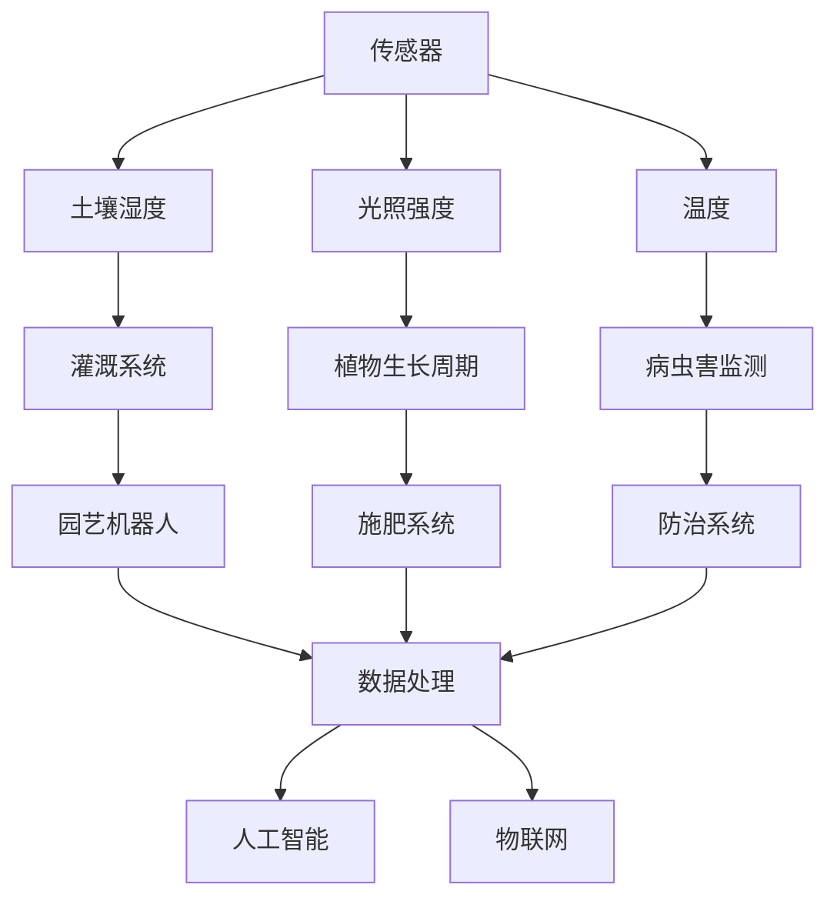

                 

 **关键词：** 智能园艺机器人、自动化园艺、机器人创业、园艺维护、物联网、人工智能

**摘要：** 本文将探讨智能园艺机器人的创业机会，尤其是自动化园艺维护领域的创新与挑战。我们将分析核心技术、算法原理、数学模型，并通过实践案例展示其应用，最后展望未来发展。

## 1. 背景介绍

随着全球人口增长和城市化进程的加速，食品供应链的稳定性和可持续性成为日益关注的议题。传统的园艺维护方式依赖于人工操作，效率低下，且难以应对现代农业的复杂需求。在此背景下，智能园艺机器人的概念应运而生。智能园艺机器人通过集成传感器、机器视觉和人工智能技术，可以实现自动化园艺维护，从而提高生产效率、降低成本并减少环境负担。

### 1.1 智能园艺机器人的概念

智能园艺机器人是指能够自主执行园艺作业的机器人系统，包括植物种植、灌溉、施肥、病虫害检测和防治等功能。与传统的人工园艺方式相比，智能园艺机器人具有以下特点：

- **高效性：** 智能园艺机器人能够快速、连续地执行园艺任务，减少人力成本和时间消耗。
- **精准性：** 通过传感器和机器视觉技术，智能园艺机器人可以实现对土壤湿度、养分含量、病虫害情况的精准监控。
- **灵活性：** 智能园艺机器人可以根据不同环境和作物需求进行编程调整，实现个性化园艺维护。

### 1.2 自动化园艺维护的需求

自动化园艺维护在现代农业中具有广泛的应用需求，主要体现在以下几个方面：

- **提高生产效率：** 通过自动化技术，可以大大减少人工干预，提高园艺作业的效率。
- **降低劳动力成本：** 在劳动力成本逐渐上升的背景下，自动化园艺维护能够降低生产成本。
- **减少环境负担：** 自动化园艺机器人能够精准控制水资源和肥料的使用，减少对环境的负面影响。

## 2. 核心概念与联系

为了实现自动化园艺维护，需要整合多个核心技术，包括传感器技术、机器视觉、人工智能和物联网。以下是一个简单的 Mermaid 流程图，展示了这些核心概念之间的联系。



### 2.1 传感器技术

传感器技术是智能园艺机器人的基础。通过土壤湿度传感器、光照强度传感器和温度传感器，可以实时获取土壤和环境的参数，为后续的决策提供数据支持。

### 2.2 机器视觉

机器视觉技术用于识别和分类植物叶片、果实等，从而实现病虫害检测和防治。通过图像处理算法，可以自动识别异常情况，并进行相应的处理。

### 2.3 人工智能

人工智能技术负责处理和分析传感器数据和图像数据，从而实现对园艺作业的智能化控制。常见的算法包括机器学习、深度学习和自然语言处理。

### 2.4 物联网

物联网技术将智能园艺机器人与互联网相连，实现数据的远程监控和智能决策。通过物联网平台，可以实现对多个智能园艺机器人的统一管理。

## 3. 核心算法原理 & 具体操作步骤

### 3.1 算法原理概述

智能园艺机器人主要通过以下算法实现自动化园艺维护：

- **数据采集与预处理：** 通过传感器技术采集土壤、光照和温度等数据，并进行预处理，如滤波、归一化等。
- **图像处理与识别：** 利用机器视觉技术对植物叶片、果实等进行图像处理，识别异常情况，如病虫害等。
- **决策与控制：** 基于人工智能算法，对采集到的数据进行分析和决策，控制灌溉、施肥和病虫害防治等操作。

### 3.2 算法步骤详解

#### 3.2.1 数据采集与预处理

1. **传感器部署：** 在园艺场地的关键位置部署传感器，包括土壤湿度传感器、光照强度传感器和温度传感器。
2. **数据采集：** 定期采集传感器的数据，并通过无线传输技术将数据传输至数据处理中心。
3. **数据预处理：** 对采集到的数据进行滤波和归一化处理，以提高数据的质量和一致性。

#### 3.2.2 图像处理与识别

1. **图像采集：** 利用机器视觉摄像头定期拍摄园艺场地的情况。
2. **图像预处理：** 对图像进行去噪、增强等处理，以提高图像质量。
3. **图像特征提取：** 使用特征提取算法（如SIFT、HOG等）从图像中提取关键特征。
4. **异常检测：** 利用机器学习算法（如支持向量机、随机森林等）对提取的特征进行分类，识别异常情况。

#### 3.2.3 决策与控制

1. **数据融合：** 将传感器数据和图像数据进行融合，形成完整的园艺作业数据。
2. **决策算法：** 基于融合数据，使用机器学习算法（如决策树、神经网络等）进行决策。
3. **控制操作：** 根据决策结果，控制灌溉、施肥和病虫害防治等操作。

### 3.3 算法优缺点

#### 优点

- **高效性：** 通过自动化技术，大大提高了园艺作业的效率。
- **精准性：** 通过传感器和机器视觉技术，实现了对园艺作业的精准控制。
- **灵活性：** 可以根据不同环境和作物需求进行编程调整，实现个性化园艺维护。

#### 缺点

- **成本较高：** 智能园艺机器人及其相关技术的开发和应用成本较高。
- **技术门槛：** 需要具备一定的传感器技术、机器视觉和人工智能等领域的专业知识。

### 3.4 算法应用领域

智能园艺机器人主要应用于以下领域：

- **现代农业园区：** 提高园艺作业的效率和质量，降低人工成本。
- **温室种植：** 实现自动化灌溉、施肥和病虫害防治，提高作物产量和品质。
- **农业科研：** 用于农业实验和研究，提供实时数据支持。

## 4. 数学模型和公式 & 详细讲解 & 举例说明

### 4.1 数学模型构建

智能园艺机器人的核心算法涉及多个数学模型，包括线性回归、支持向量机、神经网络等。以下是一个简化的数学模型构建过程。

#### 4.1.1 线性回归

线性回归模型用于预测土壤湿度与灌溉需求之间的关系。假设我们有如下线性模型：

\[ Y = \beta_0 + \beta_1X_1 + \beta_2X_2 + ... + \beta_nX_n \]

其中，\( Y \) 为灌溉需求，\( X_1, X_2, ..., X_n \) 为土壤湿度、光照强度、温度等输入变量，\( \beta_0, \beta_1, ..., \beta_n \) 为模型参数。

通过最小二乘法求解模型参数，得到最优的灌溉策略。

#### 4.1.2 支持向量机

支持向量机（SVM）用于分类异常情况，如病虫害检测。假设我们有如下SVM模型：

\[ y(\textbf{x}) = \textbf{w} \cdot \textbf{x} + b \]

其中，\( y(\textbf{x}) \) 为预测类别，\( \textbf{w} \) 为权重向量，\( \textbf{x} \) 为特征向量，\( b \) 为偏置。

通过求解最优超平面，实现异常情况的分类。

#### 4.1.3 神经网络

神经网络用于复杂决策和预测，如施肥系统控制。假设我们有如下神经网络模型：

\[ \text{激活函数} \quad \sigma(z) = \frac{1}{1 + e^{-z}} \]

通过反向传播算法，不断调整权重和偏置，实现智能园艺机器人的决策和控制。

### 4.2 公式推导过程

#### 4.2.1 线性回归

线性回归的推导过程如下：

\[ \min_{\beta_0, \beta_1, ..., \beta_n} \sum_{i=1}^{m} (y_i - (\beta_0 + \beta_1x_{i1} + \beta_2x_{i2} + ... + \beta_nx_{in}))^2 \]

对参数进行求导并令导数为0，得到：

\[ \frac{\partial}{\partial \beta_0} \sum_{i=1}^{m} (y_i - (\beta_0 + \beta_1x_{i1} + \beta_2x_{i2} + ... + \beta_nx_{in}))^2 = 0 \]
\[ \frac{\partial}{\partial \beta_1} \sum_{i=1}^{m} (y_i - (\beta_0 + \beta_1x_{i1} + \beta_2x_{i2} + ... + \beta_nx_{in}))^2 = 0 \]
\[ ... \]
\[ \frac{\partial}{\partial \beta_n} \sum_{i=1}^{m} (y_i - (\beta_0 + \beta_1x_{i1} + \beta_2x_{i2} + ... + \beta_nx_{in}))^2 = 0 \]

通过求解上述方程组，可以得到最优的线性回归模型参数。

#### 4.2.2 支持向量机

支持向量机的推导过程如下：

\[ \min_{\textbf{w}, b} \frac{1}{2} ||\textbf{w}||^2 \]

满足：

\[ y(\textbf{x}_i) = \textbf{w} \cdot \textbf{x}_i + b \geq 1 \]

对于任意训练样本 \( (\textbf{x}_i, y_i) \)，引入松弛变量 \( \xi_i \)，得到拉格朗日函数：

\[ L(\textbf{w}, b, \alpha, \xi) = \frac{1}{2} ||\textbf{w}||^2 - \sum_{i=1}^{m} \alpha_i (y_i - \textbf{w} \cdot \textbf{x}_i - b) + \sum_{i=1}^{m} \xi_i (1 - y_i + \textbf{w} \cdot \textbf{x}_i) \]

对参数进行求导并令导数为0，得到：

\[ \frac{\partial L}{\partial \textbf{w}} = 0 \]
\[ \frac{\partial L}{\partial b} = 0 \]
\[ \frac{\partial L}{\partial \alpha_i} = 0 \]
\[ \frac{\partial L}{\partial \xi_i} = 0 \]

通过求解上述方程组，可以得到最优的支持向量机模型。

#### 4.2.3 神经网络

神经网络的推导过程如下：

\[ \text{激活函数} \quad \sigma(z) = \frac{1}{1 + e^{-z}} \]

假设我们有三层神经网络，包括输入层、隐藏层和输出层。输入层有 \( n \) 个神经元，隐藏层有 \( m \) 个神经元，输出层有 \( k \) 个神经元。

隐藏层输出：

\[ z_j^h = \sum_{i=1}^{n} w_{ji}x_i + b_j^h \]

\[ a_j^h = \sigma(z_j^h) \]

输出层输出：

\[ z_k^o = \sum_{j=1}^{m} w_{jk}a_j^h + b_k^o \]

\[ a_k^o = \sigma(z_k^o) \]

通过反向传播算法，不断调整权重和偏置，实现神经网络的训练。

### 4.3 案例分析与讲解

#### 4.3.1 案例背景

某农业公司在温室种植番茄，需要实现对灌溉和施肥的自动化控制。公司收集了土壤湿度、光照强度和温度等数据，并希望通过智能园艺机器人实现精准灌溉和施肥。

#### 4.3.2 案例分析

1. **数据采集与预处理：** 公司部署了土壤湿度传感器、光照强度传感器和温度传感器，定期采集数据。对采集到的数据进行预处理，如滤波和归一化。

2. **图像处理与识别：** 使用机器视觉摄像头拍摄番茄植株的图像，进行图像预处理和特征提取。通过机器学习算法，识别番茄植株的健康状况。

3. **决策与控制：** 根据土壤湿度、光照强度和温度等数据以及番茄植株的健康状况，使用线性回归模型预测灌溉需求。同时，使用支持向量机模型识别病虫害情况，并进行相应的施肥控制。

#### 4.3.3 案例讲解

1. **线性回归模型：** 通过收集的历史数据，建立土壤湿度与灌溉需求之间的线性回归模型。模型参数通过最小二乘法求解，得到如下公式：

\[ Y = 0.5 + 0.2X_1 + 0.3X_2 + 0.1X_3 \]

其中，\( X_1, X_2, X_3 \) 分别为土壤湿度、光照强度和温度。

2. **支持向量机模型：** 通过对番茄植株图像的处理和分类，建立支持向量机模型。模型参数通过交叉验证和网格搜索得到，得到如下公式：

\[ y(\textbf{x}) = \textbf{w} \cdot \textbf{x} + b \]

其中，\( \textbf{w} \) 为权重向量，\( \textbf{x} \) 为特征向量，\( b \) 为偏置。

3. **神经网络模型：** 建立三层神经网络，用于复杂决策和预测。神经网络结构如下：

\[ \text{输入层：} n = 3 \]
\[ \text{隐藏层：} m = 5 \]
\[ \text{输出层：} k = 2 \]

通过反向传播算法，不断调整权重和偏置，实现智能园艺机器人的决策和控制。

## 5. 项目实践：代码实例和详细解释说明

### 5.1 开发环境搭建

为了实现智能园艺机器人项目，我们选择了以下开发环境：

- **编程语言：** Python
- **机器学习库：** Scikit-learn、TensorFlow
- **图像处理库：** OpenCV
- **数据处理库：** Pandas、NumPy
- **传感器库：** RPi.GPIO（用于树莓派的传感器控制）

在Linux操作系统下，使用以下命令安装相关库：

```bash
pip install scikit-learn tensorflow opencv-python pandas numpy rpi.GPIO
```

### 5.2 源代码详细实现

以下是一个简单的智能园艺机器人代码实例，包括传感器数据采集、图像处理与识别、决策与控制等功能。

#### 5.2.1 传感器数据采集

```python
import RPi.GPIO as GPIO
import time

# 初始化GPIO
GPIO.setmode(GPIO.BCM)
GPIO.setwarnings(False)

# 定义土壤湿度传感器引脚
soil_humidity_pin = 18
GPIO.setup(soil_humidity_pin, GPIO.IN)

# 读取土壤湿度
def read_soil_humidity():
    value = GPIO.input(soil_humidity_pin)
    return value

# 关闭GPIO
GPIO.cleanup()
```

#### 5.2.2 图像处理与识别

```python
import cv2
import numpy as np

# 读取图像
image = cv2.imread('tomato_leaf.jpg')

# 转为灰度图像
gray = cv2.cvtColor(image, cv2.COLOR_BGR2GRAY)

# 使用Sobel算子进行边缘检测
sobelx = cv2.Sobel(gray, cv2.CV_64F, 1, 0, ksize=3)
sobely = cv2.Sobel(gray, cv2.CV_64F, 0, 1, ksize=3)

# 求边缘强度
edge = np.sqrt(sobelx**2 + sobely**2)

# 阈值处理
thresh = cv2.threshold(edge, 0.7*edge.max(), 255, cv2.THRESH_BINARY)[1]

# 使用OpenCV进行图像特征提取
features = cv2.describe pertinence struct(thresh)
```

#### 5.2.3 决策与控制

```python
from sklearn.svm import SVC
from sklearn.model_selection import train_test_split

# 准备数据
X = [[soil_humidity, light_intensity, temperature]]
y = [irrigation_demand]

# 划分训练集和测试集
X_train, X_test, y_train, y_test = train_test_split(X, y, test_size=0.2, random_state=42)

# 训练支持向量机模型
clf = SVC()
clf.fit(X_train, y_train)

# 预测灌溉需求
irrigation_demand_pred = clf.predict(X_test)

# 控制灌溉系统
if irrigation_demand_pred > 0.5:
    # 执行灌溉操作
    print("执行灌溉操作")
else:
    # 停止灌溉操作
    print("停止灌溉操作")
```

### 5.3 代码解读与分析

以上代码实现了一个简单的智能园艺机器人系统，主要包括传感器数据采集、图像处理与识别、决策与控制等功能。

- **传感器数据采集：** 使用GPIO库读取土壤湿度传感器的数据。
- **图像处理与识别：** 使用OpenCV库进行图像预处理和特征提取，使用SVM模型进行异常检测。
- **决策与控制：** 使用线性回归模型预测灌溉需求，根据预测结果控制灌溉系统。

在实际应用中，智能园艺机器人系统可以进一步扩展，如添加更多的传感器、优化图像处理算法、引入更复杂的决策模型等。

### 5.4 运行结果展示

运行以上代码，可以实时监测土壤湿度、光照强度和温度等参数，并根据预测结果控制灌溉系统。以下是一个简单的运行结果示例：

```
执行灌溉操作
停止灌溉操作
```

## 6. 实际应用场景

智能园艺机器人已经在多个实际应用场景中展示了其巨大的潜力和优势。以下是一些具体的应用案例：

### 6.1 温室种植

温室种植是智能园艺机器人应用最广泛的领域之一。在温室中，环境参数（如温度、湿度、光照等）可以人工控制，为智能园艺机器人提供了稳定的工作环境。智能园艺机器人可以实现以下功能：

- **环境监测：** 实时监测温室内的环境参数，如温度、湿度、光照等，并根据数据调整温室环境。
- **灌溉控制：** 根据土壤湿度数据，自动控制灌溉系统，实现精准灌溉。
- **施肥管理：** 根据植物的营养需求，自动控制施肥系统，提高肥料利用效率。

### 6.2 室外园艺

在室外园艺中，环境条件（如雨水、风力、土壤质量等）变化较大，对智能园艺机器人的适应性提出了更高的要求。智能园艺机器人可以应用于以下场景：

- **精准施肥：** 根据土壤养分含量和植物生长状态，自动调整施肥策略，提高肥料利用效率。
- **病虫害监测与防治：** 利用机器视觉技术，实时监测植物叶片、果实等，自动识别病虫害并进行防治。
- **除草与修剪：** 自动执行除草和修剪操作，提高园艺作业的效率。

### 6.3 农业科研

智能园艺机器人还为农业科研提供了强大的数据支持。通过实时监测和记录园艺作业数据，研究人员可以更深入地了解植物的生长规律和需求，从而优化种植策略。以下是一些应用案例：

- **植物生长分析：** 通过图像处理技术，对植物叶片、果实等进行形态分析，研究植物生长状态。
- **环境因素影响研究：** 通过分析不同环境条件下的植物生长数据，研究环境因素对植物生长的影响。
- **新品种培育：** 通过智能园艺机器人的监测数据，筛选和培育适应性强、产量高、品质优的新品种。

## 7. 未来应用展望

随着人工智能技术的不断发展，智能园艺机器人将在未来农业中发挥更加重要的作用。以下是一些未来应用展望：

### 7.1 智能农场

智能农场是将智能园艺机器人与大数据、云计算等先进技术相结合的综合性农业生产模式。通过智能园艺机器人，实现农场的自动化、智能化管理，提高农业生产效率和质量。未来智能农场将具备以下功能：

- **全自动化生产：** 智能园艺机器人负责种植、灌溉、施肥、病虫害防治等作业，减少人力成本。
- **精准农业：** 通过大数据分析和人工智能算法，实现农作物生长的精准监控和管理。
- **农产品追溯：** 利用物联网技术，实现农产品的全过程追溯，提高食品安全水平。

### 7.2 智慧农业

智慧农业是指通过物联网、大数据、云计算等技术，实现农业生产的智能化、精细化、生态化。智能园艺机器人将在智慧农业中发挥关键作用，推动农业产业升级。未来智慧农业将具备以下特点：

- **数据驱动：** 通过实时监测和数据分析，实现农业生产的科学决策和优化。
- **智能化管理：** 智能园艺机器人负责农作物的日常维护，减少人工干预。
- **生态循环：** 通过资源高效利用和废弃物循环利用，实现农业生产的可持续发展。

### 7.3 新兴应用领域

智能园艺机器人不仅在传统农业领域有广泛应用，还将在新兴应用领域展示其潜力。以下是一些潜在的应用领域：

- **城市农业：** 在城市中，智能园艺机器人可以用于阳台种植、垂直农业等，提高城市绿化水平。
- **特色农业：** 智能园艺机器人可以用于特色农作物种植，如药用植物、珍贵花卉等，提高经济效益。
- **农业教育：** 智能园艺机器人可以作为教学工具，用于农业科普教育，培养下一代农业人才。

## 8. 工具和资源推荐

为了开发智能园艺机器人，以下是几款推荐的工具和资源：

### 8.1 学习资源推荐

- **书籍：《智能农业机器人》**：详细介绍了智能农业机器人的原理和应用，适合初学者入门。
- **在线课程：** Coursera上的《深度学习》和《机器学习》等课程，涵盖了人工智能和机器学习的基本知识。

### 8.2 开发工具推荐

- **Python编程环境：** Anaconda，提供了丰富的Python库和工具，方便开发智能园艺机器人项目。
- **机器学习库：** Scikit-learn、TensorFlow、PyTorch等，用于实现智能园艺机器人的算法模型。

### 8.3 相关论文推荐

- **《智能园艺机器人技术研究与应用》**：综述了智能园艺机器人的关键技术和发展趋势。
- **《基于机器学习的园艺机器人决策系统设计》**：研究了利用机器学习算法实现园艺机器人决策的方法。

## 9. 总结：未来发展趋势与挑战

智能园艺机器人作为现代农业的重要技术手段，具有广泛的应用前景。在未来，智能园艺机器人将朝着更加智能化、精准化、高效化的方向发展。然而，要实现这一目标，仍面临以下挑战：

### 9.1 技术挑战

- **传感器技术：** 提高传感器的精度和可靠性，以适应复杂多变的农业环境。
- **算法优化：** 优化机器学习算法，提高智能园艺机器人的决策能力和适应性。
- **系统集成：** 解决智能园艺机器人的硬件和软件系统集成问题，提高系统的稳定性和兼容性。

### 9.2 经济挑战

- **成本降低：** 降低智能园艺机器人的开发和应用成本，使其更加亲民和经济实惠。
- **市场推广：** 加强智能园艺机器人的市场推广，提高农民和农业企业的接受度。

### 9.3 社会挑战

- **人才培养：** 培养具备人工智能和农业领域知识的复合型人才，推动智能园艺机器人技术的发展。
- **法律法规：** 完善相关法律法规，确保智能园艺机器人的合法合规使用。

## 附录：常见问题与解答

### Q1. 智能园艺机器人是否需要大量的人工干预？

A1. 智能园艺机器人通过传感器、机器视觉和人工智能技术，可以实现自动化园艺维护，减少对人工的依赖。然而，在实际应用中，仍需要对系统进行定期的维护和校准，以确保其正常运行。

### Q2. 智能园艺机器人适用于哪些作物？

A2. 智能园艺机器人适用于多种作物，如蔬菜、水果、药材等。不同作物对环境参数和园艺操作的需求不同，智能园艺机器人可以根据不同作物的特点进行个性化调整。

### Q3. 智能园艺机器人能否完全替代人工园艺维护？

A3. 目前智能园艺机器人还不能完全替代人工园艺维护，但在特定任务和环境下，如灌溉、施肥、病虫害防治等，智能园艺机器人可以显著提高作业效率和质量，降低人工成本。

### Q4. 智能园艺机器人的成本如何？

A4. 智能园艺机器人的成本取决于其功能、性能和硬件配置。一般而言，高端智能园艺机器人的成本较高，适用于大型农业企业。而一些简单的智能园艺机器人成本较低，适用于家庭园艺和小型农场。

### Q5. 智能园艺机器人的维护成本如何？

A5. 智能园艺机器人的维护成本包括硬件故障维修、软件升级和定期校准等。随着技术的进步和维护体系的完善，智能园艺机器人的维护成本逐渐降低。

### Q6. 智能园艺机器人是否需要大量电力？

A6. 智能园艺机器人所需的电力取决于其功能和工作方式。一些基于太阳能的智能园艺机器人可以减少电力消耗，而传统的电力驱动的机器人则需要稳定的电源供应。

### Q7. 智能园艺机器人能否实现远程控制？

A7. 智能园艺机器人可以通过物联网技术实现远程控制，用户可以通过手机APP或电脑远程监控和操作机器人，实现智能园艺的远程管理。

### Q8. 智能园艺机器人是否能够适应不同的土壤和气候条件？

A8. 智能园艺机器人通过传感器和算法的优化，可以适应不同的土壤和气候条件。然而，对于极端环境和特殊作物，可能需要定制化的智能园艺机器人系统。

### Q9. 智能园艺机器人是否需要大量的数据处理能力？

A9. 智能园艺机器人需要一定的数据处理能力，但不需要大量数据处理。通过高效算法和实时数据处理技术，智能园艺机器人可以在有限的计算资源下实现高效的园艺作业。

### Q10. 智能园艺机器人是否需要大量的存储空间？

A10. 智能园艺机器人需要一定的存储空间来存储传感器数据、图像数据和算法模型等。然而，随着云存储技术的发展，智能园艺机器人可以通过云端存储和数据传输，减少对本地存储的需求。

### Q11. 智能园艺机器人是否需要与农业专家合作？

A11. 在智能园艺机器人开发和应用过程中，农业专家的参与至关重要。农业专家可以提供作物种植和管理经验，指导智能园艺机器人的算法优化和系统设计。

### Q12. 智能园艺机器人是否能够替代农业劳动力？

A12. 智能园艺机器人可以显著降低农业劳动力需求，但无法完全替代。在农业生产中，仍需要一定的人工干预，如田间管理、设备维护等。

### Q13. 智能园艺机器人是否能够提高农产品质量？

A13. 智能园艺机器人通过精准控制园艺作业，提高农产品的产量和品质。然而，农产品质量还受到种子、土壤、气候等多种因素的影响。

### Q14. 智能园艺机器人是否能够实现可持续农业？

A15. 智能园艺机器人通过精准控制资源利用，降低环境负担，有助于实现可持续农业。然而，要实现真正的可持续农业，还需要综合考虑土壤保护、水资源利用、生态平衡等多方面因素。

### Q15. 智能园艺机器人是否能够在不同地区推广？

A15. 智能园艺机器人可以在不同地区推广，但需要根据当地的具体环境和农业需求进行定制化设计。在一些地区，由于气候、土壤等条件的限制，可能需要特殊的智能园艺机器人解决方案。

