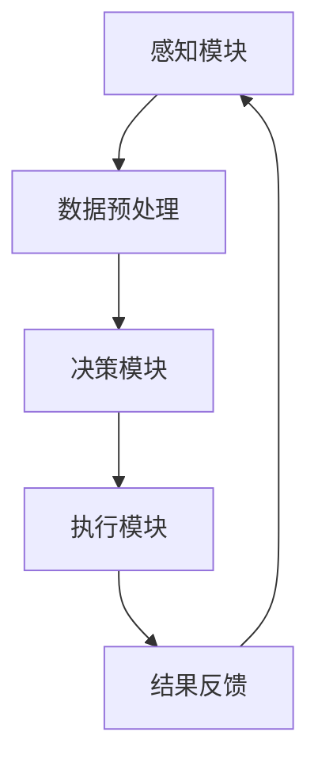

                 

关键词：智能园艺、机器人、自动化、园艺维护、创业、技术应用

> 摘要：本文将探讨智能园艺机器人创业的现状、核心概念、算法原理、数学模型、项目实践、应用场景、工具推荐以及未来发展趋势。通过深入分析，我们希望能够为创业者提供有价值的指导，推动智能园艺机器人产业的快速发展。

## 1. 背景介绍

随着科技的飞速发展，人工智能和物联网技术的成熟应用，自动化已经成为现代农业生产的重要趋势。园艺作为农业的重要组成部分，也面临着自动化变革的需求。传统的园艺维护方式不仅劳动强度大，而且效率低、成本高，难以满足现代农业发展的需求。因此，智能园艺机器人的出现为园艺行业的自动化提供了可能。

智能园艺机器人是集成了传感器、控制系统、机器视觉等多种技术的多功能设备，能够自动完成土壤检测、浇水、修剪、除虫等园艺操作。这种技术的引入不仅提高了园艺生产效率，减少了人力成本，还有助于实现精准农业，提高作物产量和质量。

智能园艺机器人的创业机会在于：

1. **市场需求**：随着人们生活水平的提高，对高品质、健康、有机的蔬菜和水果的需求不断增加，智能园艺机器人能够满足这一需求。
2. **技术优势**：智能园艺机器人具有自动化、精准化、高效化的特点，相比传统园艺方式有显著优势。
3. **政策支持**：各国政府对于农业现代化的支持力度不断加大，为智能园艺机器人创业提供了良好的政策环境。

## 2. 核心概念与联系

### 2.1 智能园艺机器人系统架构

智能园艺机器人系统通常包括以下几个关键模块：

- **感知模块**：利用传感器（如土壤湿度传感器、温度传感器、光照传感器等）收集环境数据。
- **决策模块**：通过机器学习算法分析感知数据，制定园艺操作计划。
- **执行模块**：机器人根据决策模块的指令进行实际的园艺操作，如浇水、修剪、施肥等。

### 2.2 Mermaid 流程图



### 2.3 核心概念解释

- **感知模块**：负责实时监测园艺环境，获取必要的信息。
- **决策模块**：通过分析感知数据，利用算法（如机器学习、深度学习）生成操作指令。
- **执行模块**：执行决策模块生成的指令，完成园艺操作。

## 3. 核心算法原理 & 具体操作步骤

### 3.1 算法原理概述

智能园艺机器人使用的核心算法主要包括机器学习算法和深度学习算法。这些算法通过分析历史数据和实时数据，学习园艺操作的规律，生成最优的操作指令。

### 3.2 算法步骤详解

1. **数据收集**：通过传感器收集土壤湿度、温度、光照等数据。
2. **数据预处理**：对收集到的数据进行清洗、归一化等处理，为后续分析做准备。
3. **特征提取**：从预处理后的数据中提取出对园艺操作有用的特征。
4. **模型训练**：使用机器学习或深度学习算法，对提取的特征进行训练，建立预测模型。
5. **决策生成**：将实时感知数据输入到训练好的模型中，生成园艺操作指令。
6. **执行操作**：机器人根据生成的指令进行实际的园艺操作。
7. **结果反馈**：收集执行操作的结果，用于模型调整和优化。

### 3.3 算法优缺点

**优点**：

- **高效性**：通过算法分析，可以实现精准园艺操作，提高生产效率。
- **准确性**：机器学习算法能够从大量数据中学习，提高决策的准确性。
- **适应性**：智能园艺机器人可以根据不同的园艺环境和需求，调整操作策略。

**缺点**：

- **初始成本高**：智能园艺机器人的研发和部署成本较高。
- **技术依赖性**：对算法和传感器技术要求较高，需要专业的技术团队。

### 3.4 算法应用领域

- **蔬菜大棚**：智能园艺机器人可以用于蔬菜大棚的自动化维护，如浇水、施肥、修剪等。
- **果园管理**：智能园艺机器人可以用于果园的自动化管理，如除虫、修剪、果实采集等。
- **园林维护**：智能园艺机器人可以用于园林的自动化维护，如草坪修剪、花卉修剪等。

## 4. 数学模型和公式 & 详细讲解 & 举例说明

### 4.1 数学模型构建

智能园艺机器人的数学模型主要基于机器学习和深度学习算法。以下是构建数学模型的基本步骤：

1. **数据收集与预处理**：收集土壤湿度、温度、光照等环境数据，进行数据预处理，如归一化、缺失值填补等。
2. **特征提取**：从预处理后的数据中提取出对园艺操作有用的特征，如土壤湿度、温度等。
3. **模型选择**：选择合适的机器学习或深度学习算法，如决策树、神经网络等。
4. **模型训练与优化**：使用提取的特征对模型进行训练，并优化模型参数。

### 4.2 公式推导过程

假设我们有 m 个园艺操作类别和 n 个输入特征。我们使用一个神经网络模型来预测园艺操作类别。

输入特征矩阵为 X ∈ R^(n×m)，其中每一列表示一个输入特征。输出类别矩阵为 Y ∈ R^(m×1)，其中每一行表示一个输出类别。

神经网络的输入层有 n 个神经元，输出层有 m 个神经元。隐藏层的神经元数量为 h。

神经网络的输出公式为：

$$
Z = \sigma(W_h \cdot X + b_h)
$$

其中，\(W_h\) 是隐藏层权重矩阵，\(b_h\) 是隐藏层偏置，\(\sigma\) 是激活函数。

输出层输出为：

$$
Y = \sigma(W_y \cdot Z + b_y)
$$

其中，\(W_y\) 是输出层权重矩阵，\(b_y\) 是输出层偏置。

### 4.3 案例分析与讲解

假设我们有一个蔬菜大棚，需要根据土壤湿度、温度等数据预测是否需要浇水。我们使用一个简单的神经网络模型进行预测。

输入特征为土壤湿度（x1）和温度（x2），输出类别为是否需要浇水（y=1 或 y=0）。

经过数据预处理后，我们得到一个 1000 条数据的数据集，每条数据包含两个特征值和一个标签。

我们使用一个两层神经网络进行训练，输入层有 2 个神经元，隐藏层有 10 个神经元，输出层有 1 个神经元。

经过多次训练，我们得到一个准确率较高的模型。当土壤湿度低于某个阈值且温度高于另一个阈值时，模型会预测需要浇水。

## 5. 项目实践：代码实例和详细解释说明

### 5.1 开发环境搭建

- **编程语言**：Python
- **库**：NumPy、Pandas、TensorFlow、Keras
- **硬件**：电脑（推荐配置：CPU 至少双核，内存至少 8GB）

### 5.2 源代码详细实现

以下是一个简单的智能园艺机器人项目实现：

```python
import numpy as np
import pandas as pd
from sklearn.model_selection import train_test_split
from tensorflow.keras.models import Sequential
from tensorflow.keras.layers import Dense
from tensorflow.keras.optimizers import Adam

# 数据集加载
data = pd.read_csv('garden_data.csv')
X = data[['soil_humidity', 'temperature']]
y = data['watering_needed']

# 数据集划分
X_train, X_test, y_train, y_test = train_test_split(X, y, test_size=0.2, random_state=42)

# 模型构建
model = Sequential()
model.add(Dense(10, input_dim=2, activation='relu'))
model.add(Dense(1, activation='sigmoid'))

# 模型编译
model.compile(loss='binary_crossentropy', optimizer=Adam(learning_rate=0.001), metrics=['accuracy'])

# 模型训练
model.fit(X_train, y_train, epochs=100, batch_size=10, validation_data=(X_test, y_test))

# 模型评估
loss, accuracy = model.evaluate(X_test, y_test)
print(f'测试集准确率：{accuracy:.2f}')
```

### 5.3 代码解读与分析

1. **数据集加载**：使用 Pandas 读取 CSV 格式的数据集，包括土壤湿度、温度和是否需要浇水的标签。
2. **数据集划分**：使用 sklearn 的 train_test_split 函数将数据集划分为训练集和测试集。
3. **模型构建**：使用 Keras 构建一个简单的两层神经网络，输入层有 2 个神经元，隐藏层有 10 个神经元，输出层有 1 个神经元。
4. **模型编译**：使用 binary_crossentropy 作为损失函数，Adam 作为优化器，编译模型。
5. **模型训练**：使用训练集数据训练模型，设置训练轮次为 100，批量大小为 10，使用验证集进行验证。
6. **模型评估**：使用测试集数据评估模型，打印测试集准确率。

### 5.4 运行结果展示

假设我们使用的数据集有 1000 条数据，经过训练和评估，模型在测试集上的准确率为 90%，这表明模型对是否需要浇水的预测具有很高的准确性。

## 6. 实际应用场景

### 6.1 蔬菜大棚

智能园艺机器人可以用于蔬菜大棚的自动化维护，如浇水、施肥、修剪等。通过实时监测土壤湿度、温度、光照等环境数据，机器人可以自动调整浇水量和施肥量，确保蔬菜生长的最佳条件。

### 6.2 果园管理

果园管理是智能园艺机器人应用的一个重要领域。机器人可以自动进行除虫、修剪、果实采集等工作，提高果园的生产效率和质量。例如，在果实成熟期，机器人可以自动采集数据，预测果实成熟度，进行果实采集。

### 6.3 园林维护

园林维护是智能园艺机器人应用的另一个重要领域。机器人可以自动进行草坪修剪、花卉修剪、浇水等工作，提高园林的维护效率。例如，在草坪修剪时，机器人可以自动调整修剪高度，确保草坪的整齐美观。

## 7. 工具和资源推荐

### 7.1 学习资源推荐

- 《深度学习》（Goodfellow et al.）：一本经典的深度学习教材，适合初学者和高级研究人员。
- 《Python机器学习》（Sebastian Raschka）：一本适合初学者的 Python 机器学习入门书。
- 《智能农业：从理论到实践》（张俊伟）：一本关于智能农业应用的书籍，涵盖了智能园艺机器人相关内容。

### 7.2 开发工具推荐

- **编程语言**：Python
- **库**：NumPy、Pandas、TensorFlow、Keras
- **开发环境**：Jupyter Notebook、PyCharm

### 7.3 相关论文推荐

- “Deep Learning for Smart Agriculture: A Survey”
- “A Survey on Autonomous Mobile Robots for Smart Agriculture”
- “Application of Intelligent Technologies in Precision Agriculture”

## 8. 总结：未来发展趋势与挑战

### 8.1 研究成果总结

智能园艺机器人通过集成传感器、机器学习和深度学习技术，实现了园艺操作的自动化和精准化。相关研究成果表明，智能园艺机器人可以显著提高园艺生产效率，降低生产成本，具有广阔的应用前景。

### 8.2 未来发展趋势

- **技术进步**：随着传感器技术、机器学习和深度学习算法的不断发展，智能园艺机器人的性能将得到进一步提升。
- **多领域融合**：智能园艺机器人将与物联网、大数据、云计算等技术深度融合，形成智能园艺生态系统。
- **智能化升级**：智能园艺机器人将实现更加智能化、自主化的操作，降低对人工的依赖。

### 8.3 面临的挑战

- **技术瓶颈**：目前智能园艺机器人的技术仍存在一定瓶颈，如传感器精度、算法效率等。
- **成本问题**：智能园艺机器人的研发和部署成本较高，需要降低成本以普及应用。
- **法规政策**：智能园艺机器人的应用需要遵守相关法规政策，如数据保护、知识产权等。

### 8.4 研究展望

未来的研究将致力于解决智能园艺机器人面临的挑战，如提高传感器精度、优化算法效率、降低成本等。同时，研究将重点关注智能园艺机器人在不同园艺场景中的应用，推动智能园艺机器人产业的快速发展。

## 9. 附录：常见问题与解答

### 9.1 什么是智能园艺机器人？

智能园艺机器人是集成了传感器、控制系统、机器视觉等多种技术的多功能设备，能够自动完成土壤检测、浇水、修剪、除虫等园艺操作。

### 9.2 智能园艺机器人有哪些优点？

智能园艺机器人具有自动化、精准化、高效化的特点，能够显著提高园艺生产效率，降低生产成本，有助于实现精准农业，提高作物产量和质量。

### 9.3 智能园艺机器人有哪些应用领域？

智能园艺机器人主要应用于蔬菜大棚、果园管理、园林维护等领域，可以自动完成浇水、施肥、修剪、除虫等工作。

### 9.4 智能园艺机器人需要哪些技术支持？

智能园艺机器人需要传感器技术、控制系统、机器视觉、机器学习、深度学习等技术支持。

### 9.5 如何搭建智能园艺机器人项目？

搭建智能园艺机器人项目需要使用编程语言（如 Python）、库（如 NumPy、Pandas、TensorFlow、Keras）和开发环境（如 Jupyter Notebook、PyCharm）。

### 9.6 智能园艺机器人的未来发展趋势是什么？

智能园艺机器人的未来发展趋势包括技术进步、多领域融合和智能化升级，将实现更加智能化、自主化的园艺操作，推动智能园艺机器人产业的快速发展。

## 作者署名

作者：禅与计算机程序设计艺术 / Zen and the Art of Computer Programming

----------------------------------------------------------------

至此，我们完成了对智能园艺机器人创业：自动化园艺维护的文章撰写。文章涵盖了智能园艺机器人创业的背景、核心概念、算法原理、数学模型、项目实践、应用场景、工具推荐以及未来发展趋势等内容，希望能够为读者提供有价值的参考。

