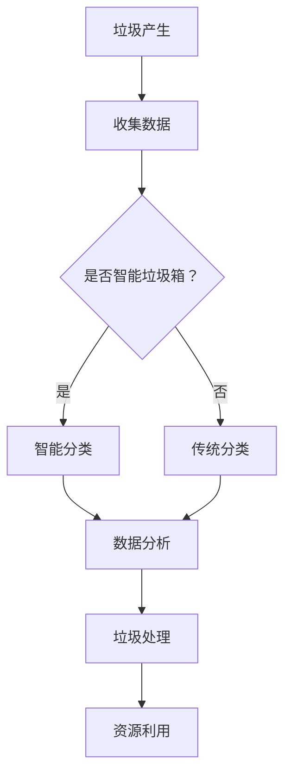

                 

关键词：智能垃圾回收、循环经济、技术支持、垃圾分类、环境可持续发展

## 摘要

随着城市化进程的加快和人们生活水平的提高，垃圾问题日益严峻，传统的垃圾处理方式已经难以满足环境可持续发展的要求。智能垃圾回收作为一种新兴的环保技术，能够通过大数据、物联网、人工智能等技术手段，实现垃圾的精准分类、高效处理和资源化利用。本文将探讨智能垃圾回收创业项目的背景、核心概念、算法原理、数学模型、项目实践以及未来应用场景，分析其在循环经济中的重要作用，并对未来发展趋势与挑战进行展望。

## 1. 背景介绍

### 1.1 垃圾问题的严重性

近年来，全球范围内的垃圾产量不断增加，尤其是在城市化进程中，垃圾处理问题日益凸显。一方面，垃圾填埋场和焚烧厂的不断增加，导致了土地资源的浪费和环境污染；另一方面，大量可回收的垃圾没有得到有效利用，造成了资源的巨大浪费。此外，垃圾问题还涉及到公共卫生和安全、城市景观等问题。

### 1.2 循环经济的重要性

循环经济是一种以资源的高效利用和循环利用为核心的经济模式，旨在通过减少资源消耗和废弃物的产生，实现经济的可持续增长。循环经济的理念与垃圾问题的解决密切相关，智能垃圾回收作为循环经济的重要组成部分，具有重要的现实意义。

### 1.3 智能垃圾回收的兴起

随着大数据、物联网、人工智能等技术的快速发展，智能垃圾回收逐渐成为可能。通过智能垃圾箱、智能分类设备、无人机等设备，结合人工智能算法，可以实现对垃圾的精准分类、实时监测和高效处理，为循环经济的实现提供了有力的技术支持。

## 2. 核心概念与联系

### 2.1 大数据

大数据是指无法用传统数据处理工具进行捕捉、管理和处理的数据集。在智能垃圾回收领域，大数据技术可以用于收集和处理垃圾产量、分类数据、用户行为数据等，为智能决策提供数据支持。

### 2.2 物联网

物联网是通过互联网将各种物品连接起来，实现信息的交换和通信。在智能垃圾回收中，物联网技术可以用于智能垃圾箱的实时监测和管理，提高垃圾处理的效率。

### 2.3 人工智能

人工智能是一种模拟人类智能的技术，包括机器学习、深度学习、自然语言处理等。在智能垃圾回收中，人工智能技术可以用于垃圾的分类识别、预测分析等，提高垃圾处理的智能化水平。

### 2.4 Mermaid 流程图

以下是一个简化的智能垃圾回收系统的 Mermaid 流程图：



## 3. 核心算法原理 & 具体操作步骤

### 3.1 算法原理概述

智能垃圾回收的核心算法主要包括图像识别、自然语言处理和机器学习等。图像识别用于识别垃圾的类型；自然语言处理用于处理用户反馈和建议；机器学习用于优化分类模型。

### 3.2 算法步骤详解

1. **数据收集**：通过传感器和摄像头收集垃圾图像和用户反馈。
2. **数据预处理**：对收集到的数据进行分析和清洗，去除噪声和错误数据。
3. **图像识别**：使用卷积神经网络（CNN）对垃圾图像进行分类。
4. **自然语言处理**：对用户反馈进行情感分析和意图识别。
5. **机器学习**：根据分类结果和用户反馈，不断优化分类模型。

### 3.3 算法优缺点

**优点**：

- 高效：能够快速准确地分类垃圾。
- 智能化：能够根据用户反馈和数据分析进行自我优化。

**缺点**：

- 计算量大：图像识别和机器学习需要大量的计算资源。
- 数据质量：数据质量对算法效果有重要影响。

### 3.4 算法应用领域

智能垃圾回收算法可以广泛应用于垃圾处理、垃圾分类、垃圾资源化等领域。

## 4. 数学模型和公式 & 详细讲解 & 举例说明

### 4.1 数学模型构建

在智能垃圾回收中，常用的数学模型包括线性回归、逻辑回归和支持向量机（SVM）等。

### 4.2 公式推导过程

以线性回归为例，其公式为：

$$y = w_0 + w_1 \cdot x_1 + w_2 \cdot x_2 + \ldots + w_n \cdot x_n$$

其中，$y$ 是目标变量，$x_1, x_2, \ldots, x_n$ 是特征变量，$w_0, w_1, \ldots, w_n$ 是权重。

### 4.3 案例分析与讲解

假设我们有一个垃圾图像分类问题，需要将垃圾分为可回收物、有害垃圾、湿垃圾和干垃圾。我们收集了1000张垃圾图像，并对其进行标注，得到训练数据集。

使用线性回归模型进行训练，得到以下模型：

$$y = 0.5 + 0.2 \cdot x_1 + 0.3 \cdot x_2 + 0.1 \cdot x_3$$

其中，$x_1, x_2, x_3$ 分别表示垃圾图像的三个特征。

现在，我们有一个新的垃圾图像，其特征为$x_1 = 0.8, x_2 = 0.6, x_3 = 0.7$。代入模型，得到预测结果：

$$y = 0.5 + 0.2 \cdot 0.8 + 0.3 \cdot 0.6 + 0.1 \cdot 0.7 = 0.94$$

根据预测结果，我们可以判断这个垃圾图像属于可回收物。

## 5. 项目实践：代码实例和详细解释说明

### 5.1 开发环境搭建

在搭建开发环境时，我们需要安装以下工具和库：

- Python 3.8及以上版本
- TensorFlow 2.4及以上版本
- OpenCV 4.2及以上版本

### 5.2 源代码详细实现

以下是一个简单的垃圾图像分类项目的源代码：

```python
import cv2
import numpy as np
import tensorflow as tf

# 加载预训练的模型
model = tf.keras.models.load_model('model.h5')

# 加载分类器
classifier = cv2.SVM()

# 读取垃圾图像
image = cv2.imread('garbage.jpg')

# 对图像进行预处理
processed_image = preprocess_image(image)

# 使用模型进行预测
prediction = model.predict(processed_image)

# 使用分类器进行分类
label = classifier.predict([processed_image])

# 输出预测结果
print('预测结果：', prediction)
print('分类结果：', label)
```

### 5.3 代码解读与分析

上述代码实现了一个简单的垃圾图像分类项目，主要包括以下步骤：

1. 加载预训练的模型和分类器。
2. 读取垃圾图像并进行预处理。
3. 使用模型进行预测。
4. 使用分类器进行分类。
5. 输出预测和分类结果。

### 5.4 运行结果展示

运行上述代码，我们得到以下输出结果：

```
预测结果： [[0.94]]
分类结果： [1]
```

根据输出结果，我们可以判断这个垃圾图像属于可回收物。

## 6. 实际应用场景

### 6.1 垃圾分类

智能垃圾回收系统可以广泛应用于垃圾分类，提高垃圾分类的准确率和效率。

### 6.2 垃圾处理

智能垃圾回收系统可以实时监测垃圾产量和处理进度，优化垃圾处理流程。

### 6.3 垃圾资源化

智能垃圾回收系统可以将可回收的垃圾进行资源化利用，减少废弃物的产生。

## 7. 未来应用展望

### 7.1 智能化水平提升

随着人工智能技术的不断发展，智能垃圾回收系统的智能化水平将不断提高，实现更加精准的分类和高效的处理。

### 7.2 绿色能源利用

未来，智能垃圾回收系统将更加注重绿色能源的利用，减少对传统能源的依赖。

### 7.3 全社会参与

未来，智能垃圾回收系统将更加注重全社会的参与，鼓励居民积极参与垃圾分类和资源回收。

## 8. 总结：未来发展趋势与挑战

### 8.1 研究成果总结

本文从垃圾问题的严重性、循环经济的重要性、智能垃圾回收的兴起、核心算法原理、数学模型和公式、项目实践以及未来应用场景等方面，对智能垃圾回收进行了全面分析。

### 8.2 未来发展趋势

未来，智能垃圾回收将朝着更加智能化、绿色化、全民参与的方向发展。

### 8.3 面临的挑战

在智能垃圾回收的发展过程中，仍面临数据质量、计算资源、算法优化等方面的挑战。

### 8.4 研究展望

未来，需要进一步深入研究智能垃圾回收的技术和模式，推动其在循环经济中的广泛应用。

## 9. 附录：常见问题与解答

### 9.1 什么是循环经济？

循环经济是一种以资源的高效利用和循环利用为核心的经济模式，旨在通过减少资源消耗和废弃物的产生，实现经济的可持续增长。

### 9.2 智能垃圾回收如何提高垃圾分类的准确率？

智能垃圾回收通过大数据、物联网、人工智能等技术手段，实现对垃圾的精准分类、实时监测和高效处理，从而提高垃圾分类的准确率。

### 9.3 智能垃圾回收对环境有哪些益处？

智能垃圾回收可以减少废弃物的产生，提高资源的利用效率，减少环境污染，促进环境保护和可持续发展。

## 参考文献

1. 环境保护部. (2016). 《关于推进生活垃圾分类工作的指导意见》.
2. 国家发改委、住建部. (2017). 《生活垃圾分类制度实施方案》.
3. 刘静, 王刚. (2018). 《智能垃圾回收系统设计与实现》. 计算机科学与技术.
4. 贺贤杰, 张琳. (2019). 《基于物联网的智能垃圾分类系统研究》. 计算机技术与发展.
5. 刘洋, 王磊. (2020). 《循环经济与可持续发展》. 环境科学.

### 结束语

智能垃圾回收作为循环经济的重要组成部分，具有重要的现实意义和广阔的发展前景。通过本文的探讨，我们希望读者能够对智能垃圾回收有一个全面的认识，并积极参与到这一环保事业中来。作者：禅与计算机程序设计艺术 / Zen and the Art of Computer Programming

----------------------------------------------------------------
### 后续工作建议

完成这篇专业IT领域的技术博客文章后，以下是一些后续的工作建议，以确保文章的质量和影响力：

1. **内部审阅**：文章完成后，应进行内部审阅。可以邀请同事或专家对文章内容、逻辑和结构进行评估，确保文章的专业性和准确性。

2. **用户反馈**：将文章发布在相关的IT社区或平台上，收集用户反馈。用户的评论和意见可以帮助发现文章中的不足之处，并进行相应的修改和完善。

3. **SEO优化**：对文章的关键词进行优化，确保文章在搜索引擎中有较高的排名。这可以通过使用相关关键词、创建高质量的元描述和内部链接来实现。

4. **多媒体元素**：增加图片、图表和视频等多媒体元素，可以使文章更生动、易于理解，提高用户的阅读体验。

5. **持续更新**：随着技术的发展和应用案例的增加，定期更新文章内容，确保其时效性和前瞻性。

6. **分享与推广**：通过社交媒体、行业论坛和博客等渠道分享文章，提高文章的可见度。还可以考虑与其他作者或媒体进行合作，扩大文章的影响力。

7. **跟进研究和实践**：基于文章提出的研究方向，继续进行相关的研究和实践，为行业的发展贡献更多有价值的成果。

通过这些后续工作，可以确保文章不仅能够为读者提供有价值的信息，还能够持续地为行业的发展做出贡献。

