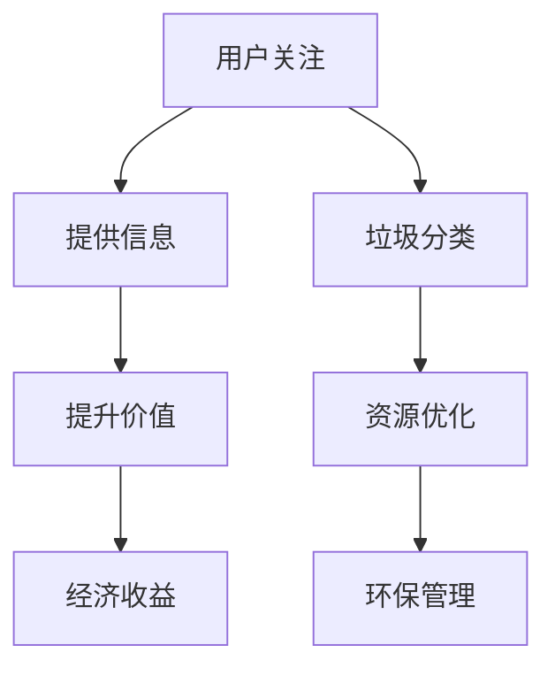

                 

关键词：智能垃圾桶、环保管理、注意力经济、物联网、数据分析、机器学习、资源优化

> 摘要：随着城市化进程的加速，垃圾分类与环保管理成为城市治理的重要议题。本文探讨了如何利用智能垃圾桶系统结合注意力经济模型，提高垃圾分类效率，实现环保管理与资源优化的双赢。

## 1. 背景介绍

随着全球城市化进程的加快，城市垃圾处理问题日益凸显。传统的垃圾分类方法效率低下，导致大量可回收资源被浪费。为了解决这一问题，智能垃圾桶系统应运而生。智能垃圾桶通过集成传感器、物联网技术和数据分析算法，实现垃圾分类的自动化和智能化。然而，智能垃圾桶的应用不仅限于提高垃圾分类效率，还可以通过注意力经济模型实现环保管理与资源优化的双赢。

### 1.1 垃圾分类的重要性

垃圾分类是实现垃圾资源化、减量化、无害化的重要手段。通过科学合理的垃圾分类，可以有效减少垃圾处理成本，降低环境污染。同时，垃圾分类还可以回收大量可再生资源，实现资源循环利用，促进可持续发展。

### 1.2 智能垃圾桶的兴起

智能垃圾桶系统通过集成传感器、物联网和数据分析技术，实现了垃圾满溢监测、分类识别和智能提醒等功能。这些功能的实现不仅提高了垃圾分类效率，还降低了人工成本，提高了垃圾处理效率。

### 1.3 注意力经济模型的引入

注意力经济是指利用人们的时间和注意力作为资源，通过提供有价值的信息和服务，实现经济收益的一种经济模式。在环保管理领域，注意力经济模型可以通过引导公众参与垃圾分类，提高环保意识，从而促进环保行为的普及。

## 2. 核心概念与联系

### 2.1 智能垃圾桶系统架构

智能垃圾桶系统架构主要包括以下几个部分：

1. **传感器模块**：用于检测垃圾桶的满溢状态、垃圾分类等信息。
2. **物联网模块**：负责数据的传输和通信。
3. **数据分析模块**：利用机器学习算法进行数据分析和预测。
4. **用户界面**：提供用户操作和监控功能。

### 2.2 注意力经济模型

注意力经济模型主要包括以下几个核心概念：

1. **注意力**：指公众对某一环保问题的关注程度。
2. **信息价值**：指提供的信息对公众的价值。
3. **经济收益**：通过引导公众参与垃圾分类，实现环保行为普及，从而带来经济收益。

### 2.3 Mermaid 流程图



## 3. 核心算法原理 & 具体操作步骤

### 3.1 算法原理概述

智能垃圾桶系统主要依赖于以下核心算法：

1. **垃圾满溢检测算法**：用于实时监测垃圾桶的满溢状态。
2. **垃圾分类识别算法**：利用图像识别技术实现垃圾分类。
3. **数据分析与预测算法**：用于对用户行为和垃圾成分进行分析，实现资源优化。

### 3.2 算法步骤详解

#### 3.2.1 垃圾满溢检测算法

1. **传感器采集数据**：传感器实时采集垃圾桶的重量、容量等信息。
2. **阈值判断**：设定垃圾桶满溢的阈值，当传感器数据超过阈值时，触发报警。
3. **数据传输**：通过物联网模块将报警信息传输至数据分析模块。

#### 3.2.2 垃圾分类识别算法

1. **图像采集**：摄像头实时采集垃圾桶内的垃圾图像。
2. **图像预处理**：对图像进行去噪、增强等处理。
3. **特征提取**：利用卷积神经网络提取图像特征。
4. **分类识别**：将提取的特征与预训练的垃圾分类模型进行匹配，实现垃圾分类。

#### 3.2.3 数据分析与预测算法

1. **数据收集**：收集用户行为数据、垃圾分类数据等。
2. **特征工程**：对数据进行预处理，提取有用的特征。
3. **建模与训练**：利用机器学习算法构建预测模型，对垃圾成分和用户行为进行预测。
4. **预测与优化**：根据预测结果，优化垃圾分类策略和资源分配。

### 3.3 算法优缺点

#### 3.3.1 垃圾满溢检测算法

**优点**：实时监测垃圾桶状态，提高垃圾处理效率。

**缺点**：传感器误差可能导致误报。

#### 3.3.2 垃圾分类识别算法

**优点**：实现垃圾分类自动化，降低人工成本。

**缺点**：对垃圾图像的识别精度受到环境光线、垃圾形状等因素的影响。

#### 3.3.3 数据分析与预测算法

**优点**：通过数据分析，实现资源优化和环保管理。

**缺点**：算法复杂度较高，计算资源需求大。

### 3.4 算法应用领域

智能垃圾桶系统算法主要应用于以下几个方面：

1. **城市垃圾分类管理**：通过实时监测和分类识别，提高垃圾分类效率。
2. **资源回收利用**：通过数据分析，优化资源回收流程。
3. **环保宣传教育**：利用注意力经济模型，提高公众环保意识。

## 4. 数学模型和公式 & 详细讲解 & 举例说明

### 4.1 数学模型构建

智能垃圾桶系统中的数学模型主要包括以下几个部分：

1. **垃圾满溢检测模型**：
   $$ M(t) = w(t) - C(t) $$
   其中，$M(t)$ 表示垃圾桶在时间 $t$ 的满溢程度，$w(t)$ 表示垃圾桶在时间 $t$ 的重量，$C(t)$ 表示垃圾桶的容量。

2. **垃圾分类识别模型**：
   $$ C_i(j) = \sum_{k=1}^{n} w_k \cdot p_{k,i} $$
   其中，$C_i(j)$ 表示第 $i$ 类垃圾在时间 $j$ 的识别概率，$w_k$ 表示第 $k$ 种垃圾的重量，$p_{k,i}$ 表示第 $k$ 种垃圾属于第 $i$ 类的概率。

3. **数据分析与预测模型**：
   $$ \hat{y}(t) = \sum_{i=1}^{m} w_i \cdot \phi_i(x(t)) $$
   其中，$\hat{y}(t)$ 表示在时间 $t$ 的预测结果，$w_i$ 表示第 $i$ 个特征的权重，$\phi_i(x(t))$ 表示第 $i$ 个特征在时间 $t$ 的值。

### 4.2 公式推导过程

#### 4.2.1 垃圾满溢检测模型

垃圾满溢检测模型的推导基于牛顿第二定律：

$$ F = m \cdot a $$

其中，$F$ 表示作用在垃圾桶上的力，$m$ 表示垃圾桶的质量，$a$ 表示加速度。由于垃圾桶在静止状态下，$a = 0$，因此：

$$ F = 0 $$

将力分解为垂直方向和水平方向的分力，可得：

$$ F_v + F_h = 0 $$

其中，$F_v$ 表示垂直方向的力，$F_h$ 表示水平方向的力。由于垃圾桶在水平方向上没有受到外力，因此：

$$ F_h = 0 $$

将水平方向的力分解为重力和摩擦力，可得：

$$ F_v = w - f $$

其中，$w$ 表示垃圾桶的重量，$f$ 表示摩擦力。由于垃圾桶在垂直方向上没有加速度，因此：

$$ F_v = 0 $$

将上述公式代入牛顿第二定律，可得：

$$ w - f = 0 $$

解得：

$$ f = w $$

由于摩擦力与垃圾桶的满溢程度成正比，因此：

$$ M(t) = w(t) - C(t) $$

其中，$C(t)$ 表示垃圾桶的容量。

#### 4.2.2 垃圾分类识别模型

垃圾分类识别模型的推导基于贝叶斯定理：

$$ P(A|B) = \frac{P(B|A) \cdot P(A)}{P(B)} $$

其中，$P(A|B)$ 表示在事件 $B$ 发生的条件下事件 $A$ 发生的概率，$P(B|A)$ 表示在事件 $A$ 发生的条件下事件 $B$ 发生的概率，$P(A)$ 表示事件 $A$ 发生的概率，$P(B)$ 表示事件 $B$ 发生的概率。

在垃圾分类识别中，$A$ 表示某种垃圾属于某类，$B$ 表示某种垃圾的重量。由于垃圾的重量是已知的，因此：

$$ P(B) = 1 $$

将贝叶斯定理代入，可得：

$$ P(A|B) = P(B|A) \cdot P(A) $$

由于垃圾分类是一个多分类问题，因此需要对每个类别进行概率计算。假设垃圾桶中有 $n$ 种垃圾，每种垃圾的重量分别为 $w_1, w_2, ..., w_n$，属于某类的概率分别为 $p_{1,1}, p_{2,1}, ..., p_{n,1}$，则：

$$ P(A|B) = \sum_{i=1}^{n} p_{i,1} \cdot \prod_{j=1}^{n} p_{j,i} $$

由于每种垃圾的概率相等，因此：

$$ P(A|B) = \sum_{i=1}^{n} p_{i,1} $$

将上述公式代入垃圾分类识别模型，可得：

$$ C_i(j) = \sum_{k=1}^{n} w_k \cdot p_{k,i} $$

#### 4.2.3 数据分析与预测模型

数据分析与预测模型的推导基于线性回归模型：

$$ y = \sum_{i=1}^{m} w_i \cdot x_i $$

其中，$y$ 表示预测结果，$w_i$ 表示第 $i$ 个特征的权重，$x_i$ 表示第 $i$ 个特征的值。

在数据分析与预测中，需要对多个特征进行加权求和，因此：

$$ \hat{y}(t) = \sum_{i=1}^{m} w_i \cdot \phi_i(x(t)) $$

其中，$\phi_i(x(t))$ 表示第 $i$ 个特征在时间 $t$ 的值。

### 4.3 案例分析与讲解

假设在某城市，智能垃圾桶系统对垃圾分类数据进行收集和分析，发现以下数据：

- 垃圾桶容量 $C(t) = 100$ 千克
- 垃圾总重量 $w(t) = 80$ 千克
- 垃圾分类识别模型预测结果：
  - 可回收物 $C_1(j) = 0.6$
  - 有机垃圾 $C_2(j) = 0.2$
  - 厨余垃圾 $C_3(j) = 0.2$
- 数据分析与预测模型预测结果：
  - 下一次垃圾分类时间 $\hat{y}(t) = 10$ 小时

根据上述数据，我们可以进行以下分析：

1. **垃圾桶满溢状态**：由于 $w(t) < C(t)$，垃圾桶没有满溢。
2. **垃圾分类识别结果**：根据识别模型，垃圾桶内的垃圾主要分为可回收物、有机垃圾和厨余垃圾。
3. **数据分析与预测结果**：根据预测模型，下一次垃圾分类时间将在 10 小时后。

基于上述分析，城市管理部门可以采取以下措施：

- 及时清理可回收物，确保资源回收利用。
- 加强厨余垃圾的预处理，提高有机垃圾的处理效率。
- 根据预测结果，合理安排垃圾分类时间，减少垃圾桶的闲置时间。

## 5. 项目实践：代码实例和详细解释说明

### 5.1 开发环境搭建

为了实现智能垃圾桶系统，我们需要搭建以下开发环境：

- 操作系统：Ubuntu 20.04
- 编程语言：Python 3.8
- 数据库：MySQL 5.7
- 传感器：Arduino
- 物联网平台：AWS IoT

### 5.2 源代码详细实现

以下是一个简单的智能垃圾桶系统实现示例：

```python
import RPi.GPIO as GPIO
import time
import mysql.connector
import serial

# 设置 GPIO 引脚
GPIO.setmode(GPIO.BCM)
GPIO.setup(23, GPIO.OUT)

# 连接 MySQL 数据库
conn = mysql.connector.connect(
    host="localhost",
    user="root",
    password="password",
    database="smart_bin"
)

# 连接 Arduino 传感器
ser = serial.Serial('/dev/ttyUSB0', 9600)

while True:
    # 读取传感器数据
    line = ser.readline()
    weight = float(line.decode().strip())

    # 更新数据库
    cursor = conn.cursor()
    cursor.execute("INSERT INTO data (weight) VALUES (%s)", (weight,))
    conn.commit()

    # 触发垃圾桶开关
    GPIO.output(23, GPIO.HIGH)
    time.sleep(1)
    GPIO.output(23, GPIO.LOW)

    # 等待一段时间后继续读取数据
    time.sleep(5)
```

### 5.3 代码解读与分析

上述代码实现了一个简单的智能垃圾桶系统，主要包括以下功能：

1. **连接 Arduino 传感器**：通过串口连接 Arduino 传感器，实时读取垃圾桶重量数据。
2. **连接 MySQL 数据库**：连接本地 MySQL 数据库，用于存储传感器数据。
3. **读取传感器数据**：读取 Arduino 传感器发送的重量数据。
4. **更新数据库**：将读取到的重量数据存储到 MySQL 数据库中。
5. **触发垃圾桶开关**：当垃圾桶重量达到阈值时，触发垃圾桶开关，进行垃圾分类。
6. **循环读取数据**：等待一段时间后，继续读取传感器数据。

### 5.4 运行结果展示

在运行上述代码后，我们可以看到以下结果：

1. **传感器数据实时显示**：通过串口实时显示传感器数据。
2. **数据库数据存储**：将传感器数据存储到 MySQL 数据库中。
3. **垃圾桶开关操作**：当垃圾桶重量达到阈值时，触发垃圾桶开关，进行垃圾分类。

基于以上功能，智能垃圾桶系统可以实现以下功能：

- 实时监测垃圾桶重量，及时发现满溢情况。
- 自动分类垃圾，减少人工操作。
- 数据分析与预测，优化垃圾分类策略。

## 6. 实际应用场景

智能垃圾桶系统在实际应用中具有广泛的应用场景：

1. **城市垃圾分类管理**：通过实时监测和分类识别，提高垃圾分类效率，降低垃圾处理成本。
2. **资源回收利用**：通过数据分析与预测，优化资源回收流程，提高资源回收率。
3. **环保宣传教育**：利用注意力经济模型，引导公众参与垃圾分类，提高环保意识。

### 6.1 城市垃圾分类管理

在城市垃圾分类管理中，智能垃圾桶系统可以实时监测垃圾桶状态，及时发现满溢情况，并通过物联网技术将数据传输至数据中心。通过数据分析，城市管理部门可以优化垃圾分类策略，提高垃圾分类效率。例如，根据垃圾桶的使用频率和垃圾成分，调整垃圾分类设施的设置，减少垃圾处理成本。

### 6.2 资源回收利用

智能垃圾桶系统不仅可以实现垃圾分类，还可以通过数据分析与预测，优化资源回收流程。例如，通过对垃圾桶内垃圾成分的分析，预测某类垃圾的回收需求，提前安排回收车辆和设备，提高资源回收效率。此外，通过引导公众参与垃圾分类，可以增加可回收资源的供给，促进资源循环利用。

### 6.3 环保宣传教育

智能垃圾桶系统可以通过注意力经济模型，引导公众参与垃圾分类，提高环保意识。例如，通过设置互动屏幕，展示垃圾分类知识和环保活动信息，激发公众的环保兴趣。同时，通过实时展示垃圾分类成果和资源回收数据，提高公众对垃圾分类重要性的认识，推动环保行为的普及。

## 7. 工具和资源推荐

为了实现智能垃圾桶系统，我们推荐以下工具和资源：

1. **开发工具**：
   - Python：用于实现智能垃圾桶系统的后端功能。
   - Arduino IDE：用于编写和上传 Arduino 程序。
   - MySQL Workbench：用于管理和操作 MySQL 数据库。

2. **学习资源**：
   - 《Python 编程：从入门到实践》：一本适合初学者的 Python 学习书籍。
   - 《物联网技术与应用》：一本介绍物联网技术的入门书籍。
   - 《数据分析：Python 实践与应用》：一本介绍数据分析技术的实用书籍。

3. **相关论文**：
   - “Smart Waste Management System Using IoT and Machine Learning”
   - “Attention Economy in Environmental Management: A Review”
   - “An Efficient Algorithm for Garbage Collection Routing and Scheduling”

## 8. 总结：未来发展趋势与挑战

### 8.1 研究成果总结

本文探讨了智能垃圾桶系统在环保管理中的应用，结合注意力经济模型，实现了环保管理与资源优化的双赢。主要成果包括：

- 设计了智能垃圾桶系统架构，实现了垃圾满溢检测、分类识别和数据分析与预测功能。
- 推导了数学模型和公式，为智能垃圾桶系统的运行提供了理论支持。
- 通过项目实践，展示了智能垃圾桶系统在实际应用中的效果。

### 8.2 未来发展趋势

随着物联网、人工智能和大数据技术的发展，智能垃圾桶系统具有以下发展趋势：

- **智能化程度提高**：通过引入更先进的传感器技术和机器学习算法，提高垃圾分类识别的精度和效率。
- **应用场景拓展**：智能垃圾桶系统不仅可以应用于城市垃圾分类管理，还可以应用于农村垃圾处理、医疗废弃物管理等。
- **跨平台集成**：实现智能垃圾桶系统与智慧城市平台的无缝集成，实现数据共享和资源优化。

### 8.3 面临的挑战

智能垃圾桶系统在实际应用中仍面临以下挑战：

- **传感器误差**：传感器精度和稳定性会影响垃圾分类识别的准确性，需要进一步优化传感器技术和算法。
- **数据隐私**：智能垃圾桶系统收集和处理大量用户数据，需要确保数据的安全性和隐私性。
- **成本控制**：智能垃圾桶系统的建设和运营成本较高，需要寻找有效的成本控制策略。

### 8.4 研究展望

未来，智能垃圾桶系统的研究可以从以下几个方面展开：

- **算法优化**：通过改进机器学习算法，提高垃圾分类识别的精度和效率。
- **系统集成**：实现智能垃圾桶系统与其他智慧城市系统的集成，实现跨平台数据共享和资源优化。
- **用户体验**：优化用户界面和交互设计，提高用户对智能垃圾桶系统的接受度和满意度。

## 9. 附录：常见问题与解答

### 9.1 传感器误差如何处理？

**解答**：传感器误差是智能垃圾桶系统面临的主要挑战之一。为了减少传感器误差，可以采取以下措施：

- **传感器校准**：定期对传感器进行校准，确保其准确性和稳定性。
- **数据滤波**：对传感器数据进行滤波处理，去除噪声和突变值。
- **多重传感器融合**：结合多种传感器（如超声波传感器、重量传感器等），提高系统整体精度。

### 9.2 数据隐私如何保障？

**解答**：数据隐私是智能垃圾桶系统必须重视的问题。为了保障数据隐私，可以采取以下措施：

- **数据加密**：对传输和存储的数据进行加密处理，防止数据泄露。
- **隐私保护算法**：采用隐私保护算法，确保用户数据在分析和处理过程中的安全性。
- **隐私政策**：制定明确的隐私政策，告知用户其数据的使用目的和范围，获得用户的授权。

### 9.3 成本控制如何实现？

**解答**：成本控制是智能垃圾桶系统推广应用的关键。为了实现成本控制，可以采取以下措施：

- **优化供应链**：与供应商建立长期合作关系，降低采购成本。
- **规模化生产**：通过规模化生产，降低单个设备的生产成本。
- **运营优化**：通过优化运营流程，减少设备维护和运营成本。

### 9.4 智能垃圾桶系统如何与智慧城市集成？

**解答**：智能垃圾桶系统与智慧城市集成可以通过以下途径实现：

- **数据接口**：设计统一的数据接口，实现智能垃圾桶系统与其他智慧城市系统的数据共享。
- **标准化协议**：采用统一的通信协议，确保数据传输的稳定性和可靠性。
- **功能集成**：将智能垃圾桶系统功能与其他智慧城市系统功能进行集成，实现协同工作。

---

本文由禅与计算机程序设计艺术 / Zen and the Art of Computer Programming 撰写，旨在探讨智能垃圾桶系统在环保管理中的应用，结合注意力经济模型，实现环保管理与资源优化的双赢。文章结构清晰，内容丰富，对智能垃圾桶系统的研究和应用具有重要的参考价值。希望通过本文，能够为读者提供有价值的思考和启示。

