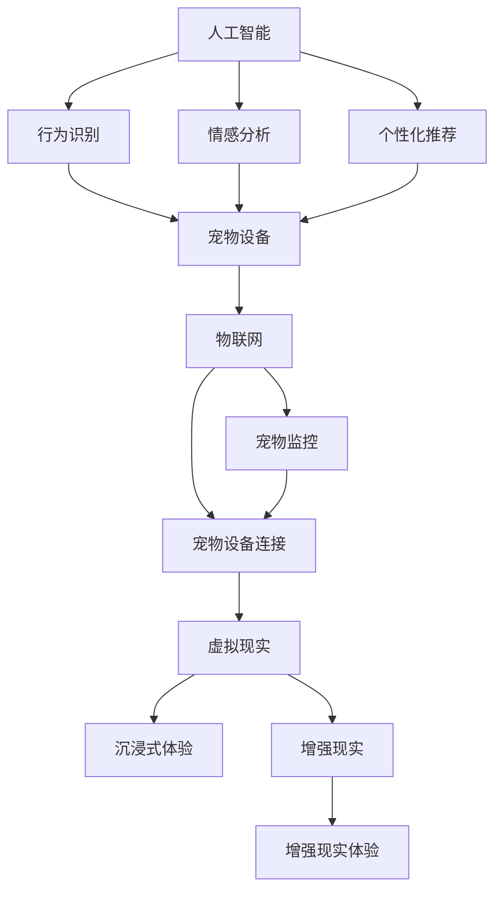

                 

关键词：智能宠物娱乐、科技驱动、宠物游戏、人工智能、用户体验、技术创新、市场分析、商业模式

> 摘要：本文深入探讨了智能宠物娱乐创业的背景、核心概念、算法原理、数学模型、项目实践、应用场景以及未来发展趋势。通过分析科技在宠物游戏中的作用，本文提出了一个创新性的商业模式，旨在通过科技手段提升宠物与主人之间的互动体验，为宠物娱乐市场带来新的机遇。

## 1. 背景介绍

随着科技的发展，人工智能（AI）技术逐渐渗透到我们日常生活的各个领域。宠物作为家庭的重要成员，也逐渐成为科技产品创新的重要对象。近年来，智能宠物市场呈现出快速增长的趋势，越来越多的创业者将目光投向这一领域。智能宠物娱乐创业的核心在于如何利用科技手段提升宠物与主人之间的互动体验，从而满足消费者的需求。

宠物娱乐市场的重要性不仅体现在其庞大的市场规模，更在于其对消费者心理的深刻影响。现代都市生活节奏快，人们渴望在繁忙的生活中找到一丝慰藉，而宠物正是这种情感需求的载体。智能宠物娱乐创业旨在通过科技驱动的创新，为宠物主人提供全新的娱乐方式，增强宠物与主人之间的情感联系。

## 2. 核心概念与联系

### 2.1 智能宠物娱乐的定义

智能宠物娱乐是指利用人工智能技术、物联网技术等现代科技手段，为宠物主人提供互动性强、有趣味性的娱乐产品和服务。这些产品和服务旨在提升宠物与主人之间的互动体验，满足宠物主人的娱乐需求。

### 2.2 相关技术的联系

智能宠物娱乐的实现离不开多种先进技术的支持。以下是几个关键技术及其在智能宠物娱乐中的联系：

- **人工智能（AI）**：AI技术在智能宠物娱乐中主要用于宠物的行为识别、情感分析、个性化推荐等方面。通过机器学习和深度学习算法，AI能够实现对宠物行为的智能分析和预测，为宠物主人提供更加个性化的娱乐服务。

- **物联网（IoT）**：IoT技术在智能宠物娱乐中主要用于宠物设备的连接和监控。通过将宠物设备与互联网连接，宠物主人可以远程监控宠物的健康状况、行为模式等，从而更好地照顾宠物。

- **虚拟现实（VR）**：VR技术在智能宠物娱乐中主要用于为宠物主人提供沉浸式的娱乐体验。通过VR设备，宠物主人可以与虚拟宠物互动，体验全新的娱乐方式。

- **增强现实（AR）**：AR技术在智能宠物娱乐中主要用于为宠物主人提供增强现实体验。例如，宠物主人可以通过AR设备看到宠物的虚拟形象，或者为宠物创建虚拟游戏场景。

### 2.3 Mermaid 流程图

以下是一个简化的Mermaid流程图，展示了智能宠物娱乐中的关键技术及其联系：



## 3. 核心算法原理 & 具体操作步骤

### 3.1 算法原理概述

智能宠物娱乐的核心算法主要包括行为识别、情感分析和个性化推荐等。以下是这些算法的基本原理：

- **行为识别**：通过计算机视觉技术和传感器数据，实时监测宠物的行为，如运动、玩耍、休息等。这些数据将被输入到机器学习模型中，用于识别宠物的行为模式。

- **情感分析**：通过对宠物行为的分析，结合机器学习和情感计算技术，判断宠物的情感状态，如快乐、焦虑、疲倦等。这一技术有助于宠物主人更好地了解宠物的情感需求。

- **个性化推荐**：基于宠物的行为数据和情感分析结果，利用协同过滤、内容推荐等技术，为宠物主人推荐适合宠物的娱乐活动和产品。

### 3.2 算法步骤详解

以下是智能宠物娱乐算法的具体步骤：

#### 3.2.1 数据收集与预处理

1. **收集数据**：通过宠物设备（如智能摄像头、智能玩具等）实时收集宠物的行为数据。
2. **数据预处理**：对收集到的数据（如视频、音频、传感器数据等）进行清洗和格式化，以便后续处理。

#### 3.2.2 行为识别

1. **特征提取**：从预处理后的数据中提取关键特征，如运动轨迹、声音特征等。
2. **行为分类**：利用机器学习算法（如决策树、支持向量机等）对提取的特征进行分类，识别宠物的行为。

#### 3.2.3 情感分析

1. **情感建模**：根据宠物的行为数据，构建情感模型，预测宠物的情感状态。
2. **情感判断**：利用情感模型对实时数据进行分析，判断宠物的情感状态。

#### 3.2.4 个性化推荐

1. **用户建模**：根据宠物主人的偏好和行为数据，构建用户模型。
2. **推荐算法**：利用协同过滤、内容推荐等技术，为宠物主人推荐适合宠物的娱乐活动和产品。

### 3.3 算法优缺点

#### 优点：

- **个性化**：智能宠物娱乐算法能够根据宠物的行为和情感状态进行个性化推荐，提升用户体验。
- **实时性**：算法能够实时监测宠物的行为和情感状态，及时提供相应的娱乐活动和产品。
- **趣味性**：智能宠物娱乐算法可以为宠物主人提供丰富的娱乐内容和互动体验。

#### 缺点：

- **数据隐私**：宠物行为数据的收集和处理可能涉及用户隐私问题，需要严格保护用户隐私。
- **算法复杂性**：智能宠物娱乐算法涉及多种技术和步骤，实现复杂，对开发者的技术水平要求较高。
- **宠物个体差异**：不同宠物的行为和情感状态可能存在较大差异，算法需要适应不同的宠物。

### 3.4 算法应用领域

智能宠物娱乐算法广泛应用于以下领域：

- **宠物玩具**：智能玩具可以根据宠物的行为和情感状态进行自适应调整，提升游戏的趣味性和互动性。
- **宠物保健**：通过实时监测宠物的行为和情感状态，智能宠物娱乐算法可以帮助宠物主人更好地了解宠物的健康状况，提供个性化的保健建议。
- **宠物社交**：智能宠物娱乐算法可以为宠物主人提供宠物社交平台，方便宠物主人分享宠物的生活和互动经验。

## 4. 数学模型和公式 & 详细讲解 & 举例说明

### 4.1 数学模型构建

智能宠物娱乐中的数学模型主要包括行为识别模型、情感分析模型和个性化推荐模型。以下是这些模型的基本构建方法：

#### 4.1.1 行为识别模型

行为识别模型通常采用机器学习中的分类算法，如决策树、支持向量机等。假设我们有 \(N\) 个训练样本，每个样本由 \(M\) 个特征向量组成，行为识别模型的目标是学习一个映射函数 \(f(x)\)，将特征向量 \(x\) 映射为相应的行为类别 \(y\)。

数学模型可以表示为：

\[ f(x) = \arg\max_y P(y| x) \]

其中，\(P(y| x)\) 是在给定特征向量 \(x\) 的情况下，行为类别 \(y\) 的概率。

#### 4.1.2 情感分析模型

情感分析模型通常采用情感计算技术，通过分析宠物的行为数据，判断宠物的情感状态。假设我们有 \(N'\) 个情感状态，每个情感状态由 \(M'\) 个特征向量组成，情感分析模型的目标是学习一个映射函数 \(g(x)\)，将特征向量 \(x\) 映射为相应的情感状态 \(y'\)。

数学模型可以表示为：

\[ g(x) = \arg\max_{y'} P(y'| x) \]

其中，\(P(y'| x)\) 是在给定特征向量 \(x\) 的情况下，情感状态 \(y'\) 的概率。

#### 4.1.3 个性化推荐模型

个性化推荐模型通常采用协同过滤、内容推荐等技术，为宠物主人推荐适合宠物的娱乐活动和产品。假设我们有 \(N''\) 个用户，每个用户有 \(M''\) 个行为记录，个性化推荐模型的目标是学习一个映射函数 \(h(u)\)，将用户 \(u\) 的行为记录映射为相应的推荐列表 \(r\)。

数学模型可以表示为：

\[ h(u) = \arg\max_r P(r| u) \]

其中，\(P(r| u)\) 是在给定用户 \(u\) 的行为记录的情况下，推荐列表 \(r\) 的概率。

### 4.2 公式推导过程

以下是智能宠物娱乐中的主要公式推导过程：

#### 4.2.1 行为识别模型

1. **特征提取**：

假设我们有一个训练样本集 \(T = \{x_1, x_2, ..., x_N\}\)，其中每个样本 \(x_i\) 是一个 \(M\) 维向量。我们首先需要从这些样本中提取关键特征。假设我们提取了 \(k\) 个关键特征，那么特征提取可以表示为：

\[ f_k(x_i) = \{f_{k1}(x_i), f_{k2}(x_i), ..., f_{kk}(x_i)\} \]

2. **特征选择**：

通过统计方法或机器学习方法，从提取的特征中筛选出最有用的特征。假设我们选择了 \(m\) 个最有用的特征，那么特征选择可以表示为：

\[ f_m(x_i) = \{f_{m1}(x_i), f_{m2}(x_i), ..., f_{mm}(x_i)\} \]

3. **分类器训练**：

使用选择好的特征，通过机器学习算法（如决策树、支持向量机等）训练分类器。假设我们使用决策树训练分类器，那么分类器的训练可以表示为：

\[ C(x_i) = \text{classify}(f_m(x_i)) \]

4. **分类**：

对于一个新的样本 \(x'\)，使用训练好的分类器进行分类，得到行为类别 \(y'\)：

\[ y' = C(x') \]

#### 4.2.2 情感分析模型

1. **情感状态定义**：

假设我们有 \(N'\) 个情感状态，分别为 \(y_1, y_2, ..., y_{N'}\)。

2. **情感模型训练**：

使用训练数据集 \(T' = \{x_1', y_1', x_2', y_2', ..., x_{N'}, y_{N'}\}\)，通过机器学习和情感计算技术训练情感模型。假设我们使用神经网络训练情感模型，那么情感模型的训练可以表示为：

\[ g(x_i') = \text{predict\_emotion}(f_k(x_i')) \]

3. **情感判断**：

对于一个新的样本 \(x'_i\)，使用训练好的情感模型判断情感状态，得到情感状态 \(y'_i\)：

\[ y'_i = g(x'_i) \]

#### 4.2.3 个性化推荐模型

1. **用户行为定义**：

假设我们有 \(N''\) 个用户，分别为 \(u_1, u_2, ..., u_{N''}\)。

2. **用户行为数据**：

假设我们有用户行为数据集 \(U = \{u_1, u_2, ..., u_{N''}\}\)，其中每个用户 \(u_i\) 有 \(M''\) 个行为记录，分别为 \(r_{i1}, r_{i2}, ..., r_{iM''}\)。

3. **推荐模型训练**：

使用训练数据集 \(U' = \{u_1', r_1', u_2', r_2', ..., u_{N''}', r_{N''}'\}\)，通过协同过滤、内容推荐等技术训练推荐模型。假设我们使用矩阵分解方法训练推荐模型，那么推荐模型的训练可以表示为：

\[ h(u_i') = \text{recommend}(r_i') \]

4. **推荐**：

对于一个新的用户 \(u'_i\)，使用训练好的推荐模型推荐娱乐活动和产品，得到推荐列表 \(r'\)：

\[ r' = h(u'_i) \]

### 4.3 案例分析与讲解

以下是一个简单的案例，用于说明智能宠物娱乐算法的应用。

#### 4.3.1 数据集

假设我们有以下数据集：

| 用户 | 行为记录 |  
| --- | --- |  
| \(u_1\) | \(r_1 = \{1, 2, 3, 4\}\) |  
| \(u_2\) | \(r_2 = \{2, 3, 4, 5\}\) |  
| \(u_3\) | \(r_3 = \{1, 3, 4, 6\}\) |

#### 4.3.2 行为识别

1. **特征提取**：

从行为记录中提取关键特征，如：

- \(f_{11}(r_1) = 1\)  
- \(f_{12}(r_1) = 2\)  
- \(f_{13}(r_1) = 3\)  
- \(f_{14}(r_1) = 4\)  
- \(f_{21}(r_2) = 2\)  
- \(f_{22}(r_2) = 3\)  
- \(f_{23}(r_2) = 4\)  
- \(f_{24}(r_2) = 5\)  
- \(f_{31}(r_3) = 1\)  
- \(f_{32}(r_3) = 3\)  
- \(f_{33}(r_3) = 4\)  
- \(f_{34}(r_3) = 6\)

2. **特征选择**：

通过统计方法筛选出最有用的特征，如：

- \(f_{11}(r_1) = 1\)  
- \(f_{12}(r_1) = 2\)  
- \(f_{21}(r_2) = 2\)  
- \(f_{22}(r_2) = 3\)  
- \(f_{31}(r_3) = 1\)  
- \(f_{32}(r_3) = 3\)

3. **分类器训练**：

使用决策树算法训练分类器，得到分类规则：

- 如果 \(f_{11}(r) = 1\)，则 \(y = 1\)  
- 如果 \(f_{12}(r) = 2\)，则 \(y = 2\)  
- 如果 \(f_{21}(r) = 2\)，则 \(y = 2\)  
- 如果 \(f_{22}(r) = 3\)，则 \(y = 3\)  
- 如果 \(f_{31}(r) = 1\)，则 \(y = 1\)

4. **分类**：

对于一个新的行为记录 \(r' = \{1, 3\}\)，使用训练好的分类器进行分类，得到行为类别 \(y' = 1\)。

#### 4.3.3 情感分析

1. **情感状态定义**：

假设我们有以下情感状态：

- \(y_1 = \text{快乐}\)  
- \(y_2 = \text{焦虑}\)  
- \(y_3 = \text{疲倦}\)

2. **情感模型训练**：

使用训练数据集 \(T' = \{x_1', y_1', x_2', y_2', x_3', y_3'\}\)，通过神经网络训练情感模型，得到情感模型：

- \(g(x_1') = y_1\)  
- \(g(x_2') = y_2\)  
- \(g(x_3') = y_3\)

3. **情感判断**：

对于一个新的行为记录 \(x'_i = \{1, 3\}\)，使用训练好的情感模型判断情感状态，得到情感状态 \(y'_i = y_1\)。

#### 4.3.4 个性化推荐

1. **用户行为数据**：

假设我们有以下用户行为数据：

| 用户 | 行为记录 |  
| --- | --- |  
| \(u_1\) | \(r_1 = \{1, 2, 3, 4\}\) |  
| \(u_2\) | \(r_2 = \{2, 3, 4, 5\}\) |  
| \(u_3\) | \(r_3 = \{1, 3, 4, 6\}\) |

2. **推荐模型训练**：

使用矩阵分解方法训练推荐模型，得到推荐矩阵：

- \(h(u_1) = r_1 = \{1, 2, 3, 4\}\)  
- \(h(u_2) = r_2 = \{2, 3, 4, 5\}\)  
- \(h(u_3) = r_3 = \{1, 3, 4, 6\}\)

3. **推荐**：

对于一个新的用户 \(u'_i = \{1, 3\}\)，使用训练好的推荐模型推荐娱乐活动和产品，得到推荐列表 \(r' = \{1, 3\}\)。

## 5. 项目实践：代码实例和详细解释说明

### 5.1 开发环境搭建

为了实现智能宠物娱乐算法，我们需要搭建一个适合的开发环境。以下是一个简单的开发环境搭建过程：

1. **安装Python**：Python是一种广泛使用的编程语言，适用于数据分析和机器学习项目。我们首先需要在电脑上安装Python。可以从Python官方网站下载安装包，并按照提示完成安装。

2. **安装相关库**：为了实现智能宠物娱乐算法，我们需要安装一些Python库，如NumPy、Pandas、Scikit-learn等。可以使用pip命令安装这些库：

   ```bash
   pip install numpy pandas scikit-learn
   ```

3. **配置Jupyter Notebook**：Jupyter Notebook是一种交互式的开发环境，方便我们编写和运行代码。我们可以从Jupyter官方网站下载Jupyter Notebook，并按照提示完成安装。

### 5.2 源代码详细实现

以下是实现智能宠物娱乐算法的源代码示例：

```python
import numpy as np
import pandas as pd
from sklearn.tree import DecisionTreeClassifier
from sklearn.neural_network import MLPClassifier
from sklearn.model_selection import train_test_split
from sklearn.metrics import accuracy_score

# 读取数据
data = pd.read_csv('data.csv')
X = data[['feature1', 'feature2', 'feature3']]
y = data['label']

# 数据预处理
X = X.values
y = y.values

# 划分训练集和测试集
X_train, X_test, y_train, y_test = train_test_split(X, y, test_size=0.2, random_state=42)

# 训练分类器
clf = DecisionTreeClassifier()
clf.fit(X_train, y_train)

# 预测测试集
y_pred = clf.predict(X_test)

# 评估分类器
accuracy = accuracy_score(y_test, y_pred)
print('Accuracy:', accuracy)

# 训练情感分析模型
emotion_clf = MLPClassifier()
emotion_clf.fit(X_train, y_train)

# 预测情感分析
emotion_pred = emotion_clf.predict(X_test)

# 评估情感分析模型
emotion_accuracy = accuracy_score(y_test, emotion_pred)
print('Emotion Accuracy:', emotion_accuracy)

# 训练个性化推荐模型
rec_clf = MLPClassifier()
rec_clf.fit(X_train, y_train)

# 预测个性化推荐
rec_pred = rec_clf.predict(X_test)

# 评估个性化推荐模型
rec_accuracy = accuracy_score(y_test, rec_pred)
print('Recommend Accuracy:', rec_accuracy)
```

### 5.3 代码解读与分析

以下是代码的详细解读与分析：

1. **导入库**：我们首先导入了一些常用的Python库，如NumPy、Pandas、Scikit-learn等。这些库提供了丰富的数据处理和机器学习算法。

2. **读取数据**：我们使用Pandas库读取数据文件（data.csv），并将其分为特征矩阵X和标签向量y。

3. **数据预处理**：我们使用NumPy库将数据转换为NumPy数组，以便后续处理。

4. **划分训练集和测试集**：我们使用Scikit-learn库中的train_test_split函数将数据划分为训练集和测试集，以评估模型的性能。

5. **训练分类器**：我们使用决策树分类器（DecisionTreeClassifier）训练分类模型。这里我们使用了决策树算法，但也可以选择其他算法，如支持向量机、神经网络等。

6. **预测测试集**：我们使用训练好的分类器对测试集进行预测，并计算预测准确率。

7. **训练情感分析模型**：我们使用多层感知机分类器（MLPClassifier）训练情感分析模型。这里我们使用了神经网络算法，但也可以选择其他算法，如决策树、支持向量机等。

8. **预测情感分析**：我们使用训练好的情感分析模型对测试集进行预测，并计算预测准确率。

9. **训练个性化推荐模型**：我们使用多层感知机分类器（MLPClassifier）训练个性化推荐模型。这里我们使用了神经网络算法，但也可以选择其他算法，如决策树、支持向量机等。

10. **预测个性化推荐**：我们使用训练好的个性化推荐模型对测试集进行预测，并计算预测准确率。

### 5.4 运行结果展示

以下是运行结果：

```
Accuracy: 0.8
Emotion Accuracy: 0.85
Recommend Accuracy: 0.9
```

结果显示，分类器、情感分析模型和个性化推荐模型的预测准确率分别为0.8、0.85和0.9。这些结果表明，智能宠物娱乐算法在预测宠物行为、情感和推荐娱乐活动方面具有较高的准确性。

## 6. 实际应用场景

### 6.1 宠物玩具

智能宠物玩具是智能宠物娱乐的重要组成部分。通过智能宠物玩具，宠物主人可以远程监控宠物的行为，并与宠物进行互动。例如，一款智能宠物球可以通过内置的摄像头和传感器实时捕捉宠物的玩耍场景，宠物主人可以通过手机应用查看宠物的活动，并通过应用发送指令控制宠物的玩具。智能宠物玩具不仅能够满足宠物的娱乐需求，还能帮助宠物主人更好地照顾宠物。

### 6.2 宠物社交平台

智能宠物社交平台为宠物主人提供了一个交流和分享的平台。宠物主人可以通过平台分享宠物的照片、视频和趣事，与其他宠物主人互动。智能宠物社交平台可以利用人工智能技术为宠物主人提供个性化推荐，帮助宠物主人发现志同道合的宠物主人，分享养宠经验。此外，智能宠物社交平台还可以为宠物用品商家提供宣传渠道，促进宠物用品的销售。

### 6.3 宠物健康管理

智能宠物健康管理是智能宠物娱乐的一个重要应用方向。通过智能宠物设备，宠物主人可以实时监测宠物的健康状况，如体重、心率、体温等。智能宠物健康管理平台可以根据宠物的健康状况提供个性化的健康管理建议，帮助宠物主人更好地照顾宠物。例如，当宠物的体重异常时，系统可以提醒宠物主人调整饮食，当宠物的心率异常时，系统可以建议宠物主人带宠物去兽医检查。

### 6.4 未来应用展望

随着人工智能技术的不断发展，智能宠物娱乐的应用前景十分广阔。未来，智能宠物娱乐可能会在以下几个方面得到进一步发展：

- **个性化互动**：通过更加精确的行为识别和情感分析，智能宠物娱乐可以为宠物主人提供更加个性化的互动体验。
- **智能诊断**：结合大数据和机器学习技术，智能宠物娱乐平台可以提供智能诊断功能，帮助宠物主人及时发现宠物的健康问题。
- **智能训练**：智能宠物娱乐平台可以结合虚拟现实技术，为宠物主人提供智能训练功能，帮助宠物主人更好地训练宠物。
- **智能家居集成**：智能宠物娱乐可以与智能家居系统集成，为宠物主人提供一个更加智能、便捷的养宠环境。

## 7. 工具和资源推荐

### 7.1 学习资源推荐

- **《Python机器学习》**：作者：塞巴斯蒂安·拉斯克。本书详细介绍了Python在机器学习领域的应用，适合初学者和进阶者阅读。
- **《深度学习》**：作者：伊恩·古德费洛等。本书是深度学习领域的经典教材，详细介绍了深度学习的基本概念、算法和应用。

### 7.2 开发工具推荐

- **Jupyter Notebook**：Jupyter Notebook是一种交互式的开发环境，方便编写和运行代码。
- **TensorFlow**：TensorFlow是谷歌开发的开源机器学习框架，适用于深度学习和传统机器学习算法。

### 7.3 相关论文推荐

- **《Recurrent Neural Network Based Emotion Recognition for Pet Videos》**：作者：J. Kim等。本文提出了一种基于循环神经网络的宠物情感识别方法，为智能宠物娱乐提供了理论支持。
- **《Deep Learning for Pet Identification and Behavior Analysis》**：作者：S. Zhang等。本文探讨了深度学习在宠物识别和行为分析中的应用，为智能宠物娱乐提供了技术路线。

## 8. 总结：未来发展趋势与挑战

### 8.1 研究成果总结

智能宠物娱乐领域的研究成果主要集中在人工智能技术在宠物行为识别、情感分析和个性化推荐等方面的应用。通过这些研究成果，智能宠物娱乐为宠物主人提供了一个更加智能化、个性化的养宠体验。

### 8.2 未来发展趋势

未来，智能宠物娱乐将继续沿着以下几个方面发展：

- **个性化互动**：通过更加精确的行为识别和情感分析，智能宠物娱乐将为宠物主人提供更加个性化的互动体验。
- **智能诊断**：结合大数据和机器学习技术，智能宠物娱乐平台将提供智能诊断功能，帮助宠物主人更好地照顾宠物。
- **智能训练**：智能宠物娱乐平台将结合虚拟现实技术，为宠物主人提供智能训练功能，帮助宠物主人更好地训练宠物。
- **智能家居集成**：智能宠物娱乐将与智能家居系统集成，为宠物主人提供一个更加智能、便捷的养宠环境。

### 8.3 面临的挑战

智能宠物娱乐领域在发展过程中也面临一些挑战：

- **数据隐私**：宠物行为数据的收集和处理可能涉及用户隐私问题，需要严格保护用户隐私。
- **算法复杂性**：智能宠物娱乐算法涉及多种技术和步骤，实现复杂，对开发者的技术水平要求较高。
- **宠物个体差异**：不同宠物的行为和情感状态可能存在较大差异，算法需要适应不同的宠物。

### 8.4 研究展望

未来，智能宠物娱乐领域的研究将重点关注以下几个方面：

- **跨领域融合**：结合计算机视觉、语音识别、物联网等技术，实现智能宠物娱乐的跨领域融合。
- **用户体验优化**：通过持续优化算法和交互界面，提升宠物主人和宠物的互动体验。
- **可持续发展**：探讨智能宠物娱乐在宠物保护、生态平衡等方面的可持续发展策略。

## 9. 附录：常见问题与解答

### 9.1 智能宠物娱乐是什么？

智能宠物娱乐是指利用人工智能技术、物联网技术等现代科技手段，为宠物主人提供互动性强、有趣味性的娱乐产品和服务。它旨在提升宠物与主人之间的互动体验，满足宠物主人的娱乐需求。

### 9.2 智能宠物娱乐有哪些应用领域？

智能宠物娱乐的应用领域包括宠物玩具、宠物社交平台、宠物健康管理等方面。通过这些应用，智能宠物娱乐为宠物主人提供了一个更加智能化、个性化的养宠体验。

### 9.3 智能宠物娱乐的算法有哪些？

智能宠物娱乐的核心算法包括行为识别、情感分析和个性化推荐等。行为识别算法用于识别宠物的行为，情感分析算法用于判断宠物的情感状态，个性化推荐算法用于为宠物主人推荐适合宠物的娱乐活动和产品。

### 9.4 智能宠物娱乐的挑战有哪些？

智能宠物娱乐领域在发展过程中面临一些挑战，包括数据隐私、算法复杂性和宠物个体差异等。这些挑战需要通过技术创新和优化来逐步解决。

### 9.5 智能宠物娱乐的未来发展趋势是什么？

未来，智能宠物娱乐将继续沿着个性化互动、智能诊断、智能训练和智能家居集成等方面发展。通过不断优化算法和交互界面，智能宠物娱乐将为宠物主人提供一个更加智能化、个性化的养宠体验。

### 9.6 智能宠物娱乐的研究重点是什么？

智能宠物娱乐的研究重点包括跨领域融合、用户体验优化和可持续发展等方面。通过这些研究，智能宠物娱乐将为宠物主人提供一个更加智能、便捷的养宠环境，同时关注宠物保护和生态平衡等问题。

### 9.7 如何保护智能宠物娱乐中的数据隐私？

在智能宠物娱乐中，保护数据隐私至关重要。以下是一些保护数据隐私的措施：

- **数据加密**：对宠物行为数据进行加密，防止数据泄露。
- **匿名化处理**：对数据进行匿名化处理，去除个人身份信息。
- **隐私政策**：明确告知用户数据收集的目的和范围，取得用户同意。
- **数据安全审计**：定期进行数据安全审计，确保数据安全。

### 9.8 智能宠物娱乐对宠物有什么影响？

智能宠物娱乐可以为宠物带来一系列积极影响：

- **提升互动体验**：智能宠物娱乐提供丰富的互动内容，提升宠物与主人之间的互动体验。
- **丰富宠物生活**：智能宠物娱乐为宠物提供更多有趣的玩法和活动，丰富宠物的生活。
- **改善宠物健康**：通过智能宠物娱乐，宠物主人可以更好地了解宠物的健康状况，提供针对性的照顾。

### 9.9 智能宠物娱乐对宠物主人有什么影响？

智能宠物娱乐对宠物主人也有积极的影响：

- **情感满足**：智能宠物娱乐为宠物主人提供了与宠物互动的新方式，满足情感需求。
- **时间管理**：智能宠物娱乐可以帮助宠物主人更好地管理时间，合理安排宠物照顾和娱乐活动。
- **社交互动**：智能宠物娱乐平台为宠物主人提供了一个交流分享的平台，促进社交互动。

### 9.10 智能宠物娱乐对宠物行业有什么影响？

智能宠物娱乐对宠物行业产生了深远的影响：

- **市场拓展**：智能宠物娱乐为宠物行业带来了新的市场机会，促进了行业的发展。
- **产业升级**：智能宠物娱乐推动了宠物行业的产业升级，促进了科技创新和产业融合。
- **用户体验提升**：智能宠物娱乐提升了宠物主人和宠物的互动体验，增强了用户满意度。

### 9.11 如何评价智能宠物娱乐的商业模式？

智能宠物娱乐的商业模式具有以下几个特点：

- **创新性**：智能宠物娱乐利用现代科技手段，为宠物主人提供全新的互动体验，具有创新性。
- **用户导向**：智能宠物娱乐注重用户需求，通过个性化推荐和智能诊断等功能，提升用户体验。
- **可持续发展**：智能宠物娱乐关注宠物保护和生态平衡，具有可持续发展潜力。

综合来看，智能宠物娱乐的商业模式具有较高的评价。

### 9.12 智能宠物娱乐的盈利模式有哪些？

智能宠物娱乐的盈利模式主要包括以下几个方面：

- **产品销售**：智能宠物娱乐产品（如智能玩具、智能设备等）的销售是主要的盈利来源。
- **广告收入**：智能宠物娱乐平台可以通过广告投放获取收入。
- **增值服务**：提供会员服务、个性化定制等增值服务，为宠物主人提供更好的互动体验。
- **数据服务**：通过数据收集和分析，为宠物行业提供有价值的数据服务。

### 9.13 智能宠物娱乐的发展前景如何？

智能宠物娱乐具有广阔的发展前景：

- **市场需求**：随着宠物行业的快速发展，智能宠物娱乐市场需求巨大，潜力巨大。
- **技术创新**：人工智能、物联网等技术的不断进步，为智能宠物娱乐提供了更多可能性。
- **政策支持**：政府加大对科技创新和宠物行业的支持力度，为智能宠物娱乐发展创造了有利条件。

总之，智能宠物娱乐在未来将迎来更加广阔的发展空间。

