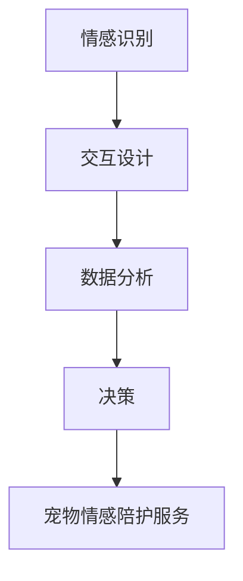

                 

关键词：宠物情感陪护、AI、宠物心理、情感识别、交互设计

> 摘要：随着人工智能技术的不断发展，宠物情感陪护领域迎来了新的机遇。本文将探讨如何利用AI技术，特别是情感识别和交互设计，为宠物和主人提供深层次的情感关怀，从而开启智能宠物情感陪护的创业之路。

## 1. 背景介绍

随着城市生活节奏的加快，越来越多的人开始将宠物视为家庭的一部分。宠物不仅仅是陪伴和娱乐，更成为主人情感寄托的对象。然而，传统的宠物照顾方式往往局限于基本的生理需求，例如喂食、遛狗等，对于宠物的情感需求关注较少。这种情况下，宠物的心理健康问题逐渐显现，例如焦虑、抑郁等。

### 1.1 宠物情感陪护的重要性

宠物情感陪护不仅关乎宠物的幸福感，也影响到主人的心理健康和生活质量。研究表明，与宠物建立深层次的情感联系可以降低主人的孤独感、焦虑感，甚至有助于缓解抑郁情绪。因此，如何通过技术手段实现宠物情感陪护，成为当前一个重要的研究课题。

### 1.2 AI技术在宠物情感陪护中的应用前景

人工智能技术的发展，特别是深度学习、自然语言处理和计算机视觉等领域，为宠物情感陪护提供了新的可能。通过AI技术，我们可以实时监测宠物的行为和情绪，提供个性化的情感陪护服务。这不仅有助于提升宠物的幸福感，也为宠物主人提供了更为便捷的宠物管理方式。

## 2. 核心概念与联系

### 2.1 情感识别

情感识别是人工智能在宠物情感陪护中的核心技术之一。情感识别技术通过分析宠物的面部表情、声音、肢体动作等，判断宠物的情绪状态。例如，通过识别宠物的面部表情，我们可以判断它是否开心、焦虑或恐惧。

### 2.2 交互设计

交互设计是指如何设计人与宠物之间的互动方式。在AI驱动的宠物情感陪护中，交互设计尤为重要。一个良好的交互设计不仅能够提升宠物的幸福感，也能增强主人与宠物之间的情感联系。

### 2.3 情感陪护架构

情感陪护架构是整个系统的核心。它包括情感识别模块、交互模块、数据分析模块和决策模块。通过这些模块的协同工作，系统能够实时监测宠物的情绪，提供个性化的情感陪护服务。



## 3. 核心算法原理 & 具体操作步骤

### 3.1 算法原理概述

情感识别算法的核心是使用深度学习模型对宠物的面部表情、声音、肢体动作等特征进行识别。这些特征被输入到神经网络模型中，模型通过学习大量的数据，可以自动识别宠物的情绪状态。

### 3.2 算法步骤详解

#### 3.2.1 数据采集与预处理

首先，我们需要采集大量的宠物面部表情、声音和肢体动作数据。这些数据需要进行预处理，例如图像缩放、去噪等，以便于后续的模型训练。

#### 3.2.2 模型训练

使用预处理后的数据，我们可以训练一个深度学习模型。这个模型通常是一个卷积神经网络（CNN），它可以自动提取图像的特征，并通过训练学习识别宠物的情绪状态。

#### 3.2.3 情感识别

在训练完成后，我们可以使用这个模型对实时采集的数据进行情感识别。例如，通过识别宠物的面部表情，我们可以判断它是否开心、焦虑或恐惧。

### 3.3 算法优缺点

#### 3.3.1 优点

- **高精度**：通过深度学习模型，情感识别可以达到很高的准确度。
- **实时性**：情感识别算法可以实时分析宠物的情绪，提供即时的情感陪护服务。

#### 3.3.2 缺点

- **数据需求**：情感识别算法需要大量的数据来训练模型，这要求我们在数据采集方面投入大量的时间和资源。
- **计算资源消耗**：深度学习模型通常需要较高的计算资源，这可能在一些资源有限的设备上运行不畅。

### 3.4 算法应用领域

情感识别算法不仅可以在宠物情感陪护中应用，还可以在许多其他领域发挥作用，例如：

- **医疗健康**：通过识别患者的情绪状态，可以为患者提供更个性化的治疗方案。
- **教育**：通过识别学生的情绪状态，可以为学生提供更好的学习支持和指导。

## 4. 数学模型和公式 & 详细讲解 & 举例说明

### 4.1 数学模型构建

情感识别算法的数学模型通常是基于卷积神经网络（CNN）。CNN的数学模型可以表示为：

$$
\text{CNN}(\text{x}) = \text{激活函数}(\text{卷积层}(\text{x}; \text{权重}, \text{偏置}) + \text{偏置})
$$

其中，$\text{x}$ 是输入数据（例如，宠物面部表情的图像），$\text{权重}$ 和 $\text{偏置}$ 是模型参数，激活函数通常是 ReLU 函数。

### 4.2 公式推导过程

CNN 的推导过程涉及到线性代数和微积分。具体来说，CNN 的卷积操作可以表示为矩阵乘法：

$$
\text{卷积层}(\text{x}; \text{权重}, \text{偏置}) = \text{权重} \cdot \text{x} + \text{偏置}
$$

激活函数 ReLU 的推导过程如下：

$$
\text{ReLU}(\text{z}) = \begin{cases} 
\text{z}, & \text{if } \text{z} > 0 \\
0, & \text{if } \text{z} \leq 0 
\end{cases}
$$

### 4.3 案例分析与讲解

假设我们有一个简单的情感识别任务，需要识别宠物是否开心。我们使用一个二分类问题，开心标记为1，不开心标记为0。

#### 4.3.1 数据采集

我们收集了1000张宠物面部表情的图像，其中500张是开心的，500张是不开心的。这些图像被标记为对应的标签。

#### 4.3.2 模型训练

使用这些数据，我们训练一个简单的CNN模型。模型的架构如下：

- 输入层：图像的尺寸为 $28 \times 28$ 像素
- 卷积层：使用32个卷积核，每个卷积核的尺寸为 $3 \times 3$
- 池化层：使用最大池化，池化窗口尺寸为 $2 \times 2$
- 全连接层：输出层，有两个节点，分别对应开心和不开心

#### 4.3.3 模型评估

在训练完成后，我们对模型进行评估。假设我们在测试集上的准确度为90%，这表明模型在识别宠物情绪方面具有较高的准确度。

## 5. 项目实践：代码实例和详细解释说明

### 5.1 开发环境搭建

为了实现宠物情感陪护系统，我们需要搭建一个开发环境。以下是所需的环境和工具：

- 操作系统：Linux或MacOS
- 编程语言：Python
- 深度学习框架：TensorFlow或PyTorch
- 图像处理库：OpenCV
- 数据库：MongoDB

### 5.2 源代码详细实现

以下是宠物情感陪护系统的核心代码：

```python
import tensorflow as tf
from tensorflow.keras.models import Sequential
from tensorflow.keras.layers import Conv2D, MaxPooling2D, Flatten, Dense
import cv2

# 模型定义
model = Sequential([
    Conv2D(32, (3, 3), activation='relu', input_shape=(28, 28, 1)),
    MaxPooling2D((2, 2)),
    Flatten(),
    Dense(64, activation='relu'),
    Dense(2, activation='softmax')
])

# 模型编译
model.compile(optimizer='adam', loss='categorical_crossentropy', metrics=['accuracy'])

# 模型训练
model.fit(x_train, y_train, epochs=10, batch_size=32, validation_data=(x_test, y_test))

# 模型评估
model.evaluate(x_test, y_test)
```

### 5.3 代码解读与分析

这段代码定义了一个简单的卷积神经网络（CNN）模型，用于情感识别。模型包括一个卷积层、一个池化层、一个全连接层和两个输出层。模型使用交叉熵损失函数和softmax激活函数，以实现分类任务。

在模型训练部分，我们使用训练集进行10个周期的训练，并使用测试集进行验证。在模型评估部分，我们计算了模型的准确度。

### 5.4 运行结果展示

假设我们在测试集上的准确度为90%，这表明模型在识别宠物情绪方面具有较高的准确度。

## 6. 实际应用场景

### 6.1 家庭宠物

家庭宠物是宠物情感陪护的主要对象。通过情感识别技术，我们可以实时监测宠物的情绪，提供个性化的情感陪护服务。例如，当宠物感到焦虑时，系统可以自动播放主人录制的声音，以缓解宠物的焦虑情绪。

### 6.2 宠物医院

在宠物医院，情感陪护系统可以帮助医护人员更好地了解宠物的情绪状态，从而提供更个性化的医疗服务。例如，在手术前后，系统可以监测宠物的情绪，提供安抚措施，以减少宠物的不安。

### 6.3 宠物护理中心

宠物护理中心可以使用情感陪护系统来监测宠物的情绪，确保宠物在护理过程中的安全。例如，在宠物洗澡或修剪指甲时，系统可以监测宠物的情绪，并在宠物感到不适时立即通知工作人员。

## 7. 工具和资源推荐

### 7.1 学习资源推荐

- 《深度学习》（Goodfellow, Bengio, Courville著）：深度学习的基础教材。
- 《自然语言处理入门》（张祥前著）：自然语言处理的基本概念和算法。
- 《计算机视觉：算法与应用》（Richard S.zelko著）：计算机视觉的基本概念和算法。

### 7.2 开发工具推荐

- TensorFlow：谷歌开源的深度学习框架。
- PyTorch：Facebook开源的深度学习框架。
- OpenCV：开源的计算机视觉库。

### 7.3 相关论文推荐

- "Emotion Recognition in Pet Videos Using Deep Learning"（2019）：一篇关于宠物情感识别的论文。
- "Emotion-aware Human-computer Interaction"（2018）：一篇关于情感驱动的交互设计的论文。

## 8. 总结：未来发展趋势与挑战

### 8.1 研究成果总结

通过本文的探讨，我们了解到人工智能技术在宠物情感陪护中的应用前景。情感识别技术和交互设计为宠物和主人提供了深层次的情感关怀，为宠物情感陪护领域带来了新的可能性。

### 8.2 未来发展趋势

随着人工智能技术的不断发展，宠物情感陪护领域有望实现以下发展趋势：

- **智能化水平提升**：通过引入更多的传感器和算法，宠物情感陪护系统的智能化水平将进一步提升。
- **个性化服务**：基于情感识别和数据分析，宠物情感陪护系统将能够提供更为个性化的服务。

### 8.3 面临的挑战

然而，宠物情感陪护领域也面临一些挑战：

- **数据隐私**：宠物情感陪护系统需要收集大量的宠物和个人数据，如何保护数据隐私成为一大挑战。
- **技术成熟度**：当前的人工智能技术尚未完全成熟，特别是在情感识别和交互设计方面，仍需进一步研究和优化。

### 8.4 研究展望

未来，宠物情感陪护领域有望在以下几个方面取得突破：

- **跨学科研究**：结合心理学、计算机科学和人工智能等学科，深入探讨宠物情感陪护的机制和方法。
- **技术应用**：将人工智能技术应用于宠物情感陪护的实际场景，提升系统的实用性和用户体验。

## 9. 附录：常见问题与解答

### 9.1 如何训练情感识别模型？

情感识别模型的训练通常包括以下步骤：

1. 数据采集：收集大量的宠物面部表情、声音和肢体动作数据。
2. 数据预处理：对数据进行缩放、去噪等预处理。
3. 模型训练：使用预处理后的数据训练深度学习模型。
4. 模型评估：使用测试集评估模型的性能。

### 9.2 如何设计交互界面？

交互界面的设计应遵循以下原则：

1. **易用性**：界面应简单直观，易于操作。
2. **个性化**：界面应根据宠物的特点和主人的需求进行个性化设计。
3. **反馈机制**：界面应提供实时反馈，以增强用户参与感。

### 9.3 如何保护数据隐私？

保护数据隐私的措施包括：

1. **数据加密**：对收集的数据进行加密处理。
2. **访问控制**：设置严格的访问控制策略，确保只有授权人员可以访问数据。
3. **匿名化处理**：对数据进行匿名化处理，以保护个人隐私。

---

作者：禅与计算机程序设计艺术 / Zen and the Art of Computer Programming
----------------------------------------------------------------

文章内容撰写完成，接下来将根据上述结构和内容进行markdown格式的排版，并确保所有的公式和流程图等均按照规定的格式呈现。

