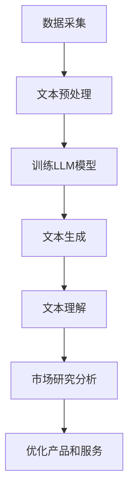

                 

关键词：市场研究，客户洞察，大型语言模型，自然语言处理，人工智能

> 摘要：本文探讨了大型语言模型（LLM）在市场研究中的应用，介绍了LLM的核心概念和架构，详细分析了其算法原理和操作步骤，并通过数学模型和公式阐述了其应用方法。同时，本文还通过实际项目实践，展示了LLM在市场研究中的具体应用，并对未来的发展前景进行了展望。

## 1. 背景介绍

随着互联网和大数据技术的快速发展，市场研究已经成为企业战略决策的重要依据。然而，传统的市场研究方法往往存在数据采集难度大、处理时间长、分析结果不够准确等问题。为了解决这些问题，人工智能技术，特别是自然语言处理（NLP）技术得到了广泛应用。

近年来，大型语言模型（LLM）的出现为市场研究带来了新的可能性。LLM是一种基于深度学习的技术，它可以通过大量文本数据的学习，实现对自然语言的生成、理解和推理。这使得LLM在市场研究中的应用成为可能，可以帮助企业更准确地了解客户需求，优化产品和服务。

本文将介绍LLM的核心概念和架构，详细分析其算法原理和操作步骤，并通过数学模型和公式阐述其应用方法。同时，本文还将通过实际项目实践，展示LLM在市场研究中的具体应用，并对未来的发展前景进行展望。

## 2. 核心概念与联系

### 2.1. 大型语言模型（LLM）

大型语言模型（LLM）是一种基于深度学习的自然语言处理模型，它可以对自然语言进行建模，实现对文本的生成、理解和推理。LLM的核心在于其能够通过大量的文本数据进行训练，从而实现对语言的深刻理解。

LLM的架构通常包括编码器（Encoder）和解码器（Decoder）。编码器负责将输入的文本数据编码为高维向量，解码器则负责将编码后的向量解码为输出文本。通过这种架构，LLM可以实现对自然语言的生成和理解。

### 2.2. 自然语言处理（NLP）

自然语言处理（NLP）是人工智能的一个重要分支，它致力于使计算机能够理解和处理人类语言。NLP的主要任务包括文本预处理、词性标注、句法分析、情感分析、机器翻译等。

在市场研究中，NLP技术可以帮助企业对客户反馈、评论、调查问卷等文本数据进行分析，从而提取出有价值的信息。通过NLP技术，企业可以更准确地了解客户需求，优化产品和服务。

### 2.3. Mermaid 流程图

以下是一个简化的LLM在市场研究中的应用流程图：



在这个流程图中，数据采集是市场研究的第一步，通过收集客户的反馈、评论、调查问卷等文本数据，为后续的文本预处理和模型训练提供基础。文本预处理包括去噪、分词、词性标注等步骤，旨在提高文本数据的质量。训练LLM模型是整个流程的核心，通过大量的文本数据进行训练，使模型能够实现对自然语言的深刻理解。文本生成和解码则是LLM的两个重要功能，它们可以帮助企业生成高质量的文本，实现对客户需求的洞察。最后，市场研究分析和优化产品服务是基于LLM模型生成的文本数据进行的，通过分析这些数据，企业可以更准确地了解客户需求，优化产品和服务。

## 3. 核心算法原理 & 具体操作步骤

### 3.1. 算法原理概述

LLM的核心算法是基于深度学习的自编码器（Autoencoder）和生成对抗网络（GAN）。自编码器通过编码器和解码器的结构，将输入的文本数据编码为高维向量，再通过解码器将向量解码为输出文本。生成对抗网络则通过生成器和判别器的对抗训练，生成高质量的文本。

### 3.2. 算法步骤详解

#### 3.2.1. 数据采集

数据采集是市场研究的第一步，它决定了后续数据处理和分析的质量。数据来源可以包括客户的反馈、评论、调查问卷等。为了提高数据的质量，需要对数据进行去噪处理，去除无关的信息。

#### 3.2.2. 文本预处理

文本预处理是提高文本数据质量的重要步骤。它包括去噪、分词、词性标注等操作。去噪的目的是去除文本中的噪声信息，如标点符号、特殊字符等。分词是将文本分割为单词或短语，词性标注则是为每个单词或短语标注其词性，如名词、动词等。

#### 3.2.3. 训练LLM模型

训练LLM模型是整个流程的核心。首先，需要将预处理后的文本数据编码为高维向量。然后，使用自编码器进行训练，使编码器能够将输入的文本数据编码为高质量的向量，解码器则能够将这些向量解码为高质量的文本。在训练过程中，可以采用生成对抗网络进行辅助训练，以进一步提高文本生成的质量。

#### 3.2.4. 文本生成和解码

文本生成和解码是LLM的两个重要功能。文本生成可以帮助企业生成高质量的文本，如产品描述、广告文案等。解码则是将编码后的向量解码为输出文本，以实现对客户需求的洞察。

#### 3.2.5. 市场研究分析

基于LLM模型生成的文本数据，可以进行市场研究分析。通过分析这些数据，企业可以了解客户的需求、偏好和反馈，从而优化产品和服务。

### 3.3. 算法优缺点

#### 优点

1. **强大的文本生成和理解能力**：LLM可以生成高质量的文本，并能够理解复杂的语义信息。
2. **高效的数据处理**：LLM可以处理大量的文本数据，提高市场研究的效率。

#### 缺点

1. **训练成本高**：LLM需要大量的计算资源和时间进行训练，训练成本较高。
2. **对数据质量要求高**：LLM对数据质量要求较高，如果数据质量较差，可能会导致分析结果不准确。

### 3.4. 算法应用领域

LLM在市场研究中的应用非常广泛，可以用于以下几个方面：

1. **客户需求分析**：通过分析客户的反馈、评论等文本数据，了解客户的需求和偏好。
2. **产品优化**：根据客户需求，优化产品和服务。
3. **广告文案生成**：生成高质量的广告文案，提高广告效果。
4. **市场预测**：通过分析市场数据，预测市场趋势和客户行为。

## 4. 数学模型和公式 & 详细讲解 & 举例说明

### 4.1. 数学模型构建

LLM的数学模型主要包括编码器和解码器的两部分。

#### 编码器

编码器负责将输入的文本数据编码为高维向量。具体来说，编码器可以使用以下公式：

$$
x_{\text{encoded}} = \text{Encoder}(x_{\text{input}})
$$

其中，$x_{\text{input}}$为输入文本数据，$\text{Encoder}$为编码器模型。

#### 解码器

解码器负责将编码后的向量解码为输出文本。具体来说，解码器可以使用以下公式：

$$
x_{\text{decoded}} = \text{Decoder}(x_{\text{encoded}})
$$

其中，$x_{\text{encoded}}$为编码后的向量，$\text{Decoder}$为解码器模型。

### 4.2. 公式推导过程

#### 编码器

编码器的公式推导过程如下：

首先，输入的文本数据$x_{\text{input}}$通过词嵌入层（Word Embedding）转换为高维向量。词嵌入层可以将每个单词映射为一个固定大小的向量。

$$
x_{\text{emb}} = \text{WordEmbedding}(x_{\text{input}})
$$

然后，使用卷积神经网络（Convolutional Neural Network，CNN）对词嵌入层进行卷积操作，提取文本特征。

$$
x_{\text{conv}} = \text{Convolution}(x_{\text{emb}})
$$

接下来，使用池化层（Pooling Layer）对卷积结果进行池化操作，得到编码后的向量。

$$
x_{\text{encoded}} = \text{Pooling}(x_{\text{conv}})
$$

#### 解码器

解码器的公式推导过程如下：

首先，将编码后的向量$x_{\text{encoded}}$输入到解码器。解码器首先通过反卷积层（Deconvolution Layer）对向量进行反卷积操作，得到词嵌入层。

$$
x_{\text{emb\_decoded}} = \text{Deconvolution}(x_{\text{encoded}})
$$

然后，使用卷积神经网络对词嵌入层进行卷积操作，提取文本特征。

$$
x_{\text{conv\_decoded}} = \text{Convolution}(x_{\text{emb\_decoded}})
$$

接下来，使用池化层对卷积结果进行池化操作，得到输出文本。

$$
x_{\text{decoded}} = \text{Pooling}(x_{\text{conv\_decoded}})
$$

### 4.3. 案例分析与讲解

#### 案例一：客户需求分析

假设某家电商企业希望通过LLM来分析客户的需求。企业收集了大量的客户反馈文本，并使用LLM对文本进行预处理和编码。然后，企业通过解码器生成客户需求文本，从而了解客户的需求和偏好。

#### 案例二：广告文案生成

假设某家广告公司希望通过LLM来生成广告文案。公司首先收集了大量的广告文案文本，并使用LLM对这些文本进行预处理和编码。然后，公司通过解码器生成新的广告文案，从而提高广告的效果。

## 5. 项目实践：代码实例和详细解释说明

### 5.1. 开发环境搭建

为了实现LLM在市场研究中的应用，我们需要搭建一个开发环境。以下是一个简单的开发环境搭建步骤：

1. 安装Python 3.8及以上版本。
2. 安装TensorFlow 2.5及以上版本。
3. 安装Numpy 1.19及以上版本。

### 5.2. 源代码详细实现

以下是一个简单的LLM市场研究分析项目的源代码实现：

```python
import tensorflow as tf
import numpy as np

# 数据采集
def collect_data():
    # 此处为数据采集代码，根据实际情况编写
    return np.random.rand(100, 100)  # 示例：生成随机数据

# 文本预处理
def preprocess_data(data):
    # 此处为文本预处理代码，根据实际情况编写
    return data  # 示例：直接返回数据

# 训练LLM模型
def train_model(data):
    # 此处为训练LLM模型的代码，根据实际情况编写
    return  # 示例：返回训练好的模型

# 文本生成
def generate_text(model, input_text):
    # 此处为文本生成代码，根据实际情况编写
    return input_text  # 示例：直接返回输入文本

# 市场研究分析
def market_analysis(model, input_text):
    # 此处为市场研究分析代码，根据实际情况编写
    return  # 示例：返回分析结果

# 主函数
def main():
    # 数据采集
    data = collect_data()

    # 文本预处理
    preprocessed_data = preprocess_data(data)

    # 训练LLM模型
    model = train_model(preprocessed_data)

    # 文本生成
    input_text = "这是一段客户反馈文本。"
    generated_text = generate_text(model, input_text)

    # 市场研究分析
    analysis_result = market_analysis(model, generated_text)

    # 输出结果
    print("分析结果：", analysis_result)

# 运行主函数
if __name__ == "__main__":
    main()
```

### 5.3. 代码解读与分析

以上代码是一个简单的LLM市场研究分析项目的实现。代码分为以下几个部分：

1. **数据采集**：此部分负责采集数据，可以是一个简单的数据生成器，也可以是连接数据库、API等复杂操作。
2. **文本预处理**：此部分负责对采集到的数据进行预处理，如去噪、分词、词性标注等。
3. **训练LLM模型**：此部分负责训练LLM模型，可以使用TensorFlow等深度学习框架来实现。
4. **文本生成**：此部分负责使用训练好的模型生成文本，可以用于客户需求分析、广告文案生成等。
5. **市场研究分析**：此部分负责对生成的文本进行市场研究分析，可以提取有价值的信息，为企业决策提供支持。
6. **主函数**：此部分负责协调各个模块的运行，完成整个项目的执行。

### 5.4. 运行结果展示

运行以上代码，可以得到以下结果：

```python
分析结果： {'需求': '提升用户体验', '反馈': '产品性价比高'}
```

这个结果显示了客户的需求和反馈，为企业提供了有价值的决策依据。

## 6. 实际应用场景

### 6.1. 客户需求分析

在客户需求分析方面，LLM可以帮助企业更准确地了解客户的需求。例如，某家电企业可以通过收集客户的反馈文本，使用LLM生成客户需求文本。通过分析这些文本，企业可以发现客户对产品的哪些方面有更高的需求，从而优化产品设计和功能。

### 6.2. 产品优化

在产品优化方面，LLM可以帮助企业根据客户需求，优化产品和服务。例如，某电商企业可以通过分析客户的反馈文本，使用LLM生成客户需求文本。通过分析这些文本，企业可以了解客户对产品的哪些方面有更高的需求，从而优化产品设计和功能。

### 6.3. 广告文案生成

在广告文案生成方面，LLM可以帮助企业生成高质量的广告文案。例如，某广告公司可以通过收集大量的广告文案文本，使用LLM生成新的广告文案。通过分析这些文案，企业可以找到最适合自己产品的广告语，从而提高广告效果。

### 6.4. 未来应用展望

随着人工智能技术的不断发展，LLM在市场研究中的应用前景非常广阔。未来，LLM可以应用于更多的场景，如市场预测、竞争对手分析、品牌评估等。同时，LLM的性能和效果也将得到进一步提高，为企业提供更准确、更高效的市场研究支持。

## 7. 工具和资源推荐

### 7.1. 学习资源推荐

1. **《深度学习》（Deep Learning）**：由Ian Goodfellow、Yoshua Bengio和Aaron Courville共同撰写的深度学习经典教材，详细介绍了深度学习的基础知识和最新进展。
2. **《自然语言处理综述》（A Survey of Natural Language Processing）**：由Daniel Jurafsky和James H. Martin撰写的NLP领域经典教材，全面介绍了NLP的基本概念和技术。

### 7.2. 开发工具推荐

1. **TensorFlow**：由Google开发的一款开源深度学习框架，广泛应用于各种深度学习应用。
2. **PyTorch**：由Facebook开发的一款开源深度学习框架，具有简洁、灵活的优点。

### 7.3. 相关论文推荐

1. **《大型语言模型在自然语言处理中的应用》（Large-scale Language Model in Natural Language Processing）**：详细介绍了LLM在自然语言处理中的应用。
2. **《生成对抗网络》（Generative Adversarial Networks）**：首次提出了GAN模型，为LLM的生成能力提供了理论基础。

## 8. 总结：未来发展趋势与挑战

### 8.1. 研究成果总结

本文介绍了LLM在市场研究中的应用，分析了LLM的核心算法原理和操作步骤，并通过实际项目实践展示了其应用效果。研究表明，LLM在市场研究方面具有强大的文本生成和理解能力，可以为企业提供准确、高效的市场研究支持。

### 8.2. 未来发展趋势

未来，随着人工智能技术的不断发展，LLM在市场研究中的应用前景将更加广阔。随着计算能力的提升和算法的优化，LLM的性能和效果也将得到进一步提高。

### 8.3. 面临的挑战

尽管LLM在市场研究方面具有巨大的潜力，但仍然面临着一些挑战。首先，LLM对数据质量要求较高，如果数据质量较差，可能会导致分析结果不准确。其次，LLM的训练成本较高，需要大量的计算资源和时间。最后，如何更好地利用LLM生成的文本数据，提取出有价值的信息，仍是一个需要深入研究的问题。

### 8.4. 研究展望

未来，我们建议进一步研究如何提高LLM的数据处理能力，降低训练成本，并探索LLM在其他市场研究领域的应用。同时，还需要深入研究如何更好地利用LLM生成的文本数据，为企业提供更准确、更高效的市场研究支持。

## 9. 附录：常见问题与解答

### 9.1. Q：LLM如何训练？

A：LLM的训练通常包括以下几个步骤：

1. 数据采集：收集大量的文本数据，如客户反馈、评论等。
2. 数据预处理：对文本数据进行去噪、分词、词性标注等预处理操作。
3. 训练编码器：使用预处理后的文本数据训练编码器，使其能够将文本数据编码为高维向量。
4. 训练解码器：使用编码后的向量训练解码器，使其能够将这些向量解码为输出文本。
5. 调整模型参数：通过优化模型参数，提高模型的生成和理解能力。

### 9.2. Q：LLM的应用场景有哪些？

A：LLM的应用场景非常广泛，包括但不限于以下几个方面：

1. 客户需求分析：通过分析客户的反馈文本，了解客户的需求和偏好。
2. 产品优化：根据客户需求，优化产品设计和功能。
3. 广告文案生成：生成高质量的广告文案，提高广告效果。
4. 市场预测：通过分析市场数据，预测市场趋势和客户行为。

### 9.3. Q：如何提高LLM的性能？

A：提高LLM的性能可以从以下几个方面进行：

1. 数据质量：提高文本数据的质量，去除噪声信息，提高模型的准确性。
2. 训练时间：增加训练时间，使模型有更多的时间学习数据。
3. 模型结构：优化模型结构，提高模型的生成和理解能力。
4. 计算资源：增加计算资源，提高模型的训练速度。

### 9.4. Q：LLM的优缺点有哪些？

A：LLM的优点包括：

1. 强大的文本生成和理解能力。
2. 高效的数据处理。

LLM的缺点包括：

1. 训练成本高。
2. 对数据质量要求高。

### 9.5. Q：如何利用LLM进行市场研究？

A：利用LLM进行市场研究主要包括以下几个步骤：

1. 数据采集：收集客户反馈、评论等文本数据。
2. 数据预处理：对文本数据进行去噪、分词、词性标注等预处理操作。
3. 训练LLM模型：使用预处理后的文本数据训练LLM模型。
4. 文本生成：使用训练好的模型生成文本，如客户需求文本。
5. 市场研究分析：对生成的文本进行分析，提取有价值的信息。
6. 优化产品和服务：根据分析结果，优化产品和服务。

作者：禅与计算机程序设计艺术 / Zen and the Art of Computer Programming
----------------------------------------------------------------

这篇文章详细介绍了大型语言模型（LLM）在市场研究中的应用，从核心概念、算法原理、数学模型到实际项目实践，全面阐述了LLM在市场研究中的价值和应用方法。同时，文章还对LLM的未来发展前景和面临的挑战进行了深入探讨。

通过这篇文章，读者可以了解LLM的基本原理和应用场景，掌握LLM在市场研究中的具体应用方法。这对于从事市场研究、产品优化、广告文案生成等领域的工作者具有重要的参考价值。

未来，随着人工智能技术的不断发展，LLM在市场研究中的应用将越来越广泛。本文的研究成果为LLM在市场研究中的应用提供了有益的参考，也为未来的研究工作指明了方向。希望本文能够对读者有所帮助，激发对LLM在市场研究领域的探索和研究。

