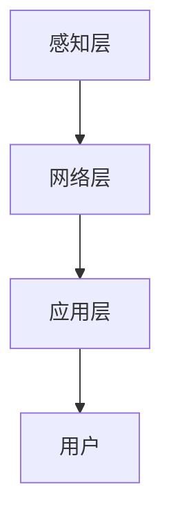

                 

关键词：智能家居、注意力经济、用户体验、智能算法、个性化推荐

> 摘要：随着智能家居技术的快速发展，智能家居设备已经渗透到我们的日常生活中。本文探讨了智能家居与注意力经济之间的关系，分析了注意力经济对智能家居的影响，以及智能家居如何通过个性化推荐和智能算法来提升用户体验，从而实现注意力经济的最大化。

## 1. 背景介绍

### 智能家居的崛起

随着物联网（IoT）、云计算、人工智能（AI）等技术的快速发展，智能家居逐渐从科幻场景走入现实。智能家居设备可以远程控制，实现家庭设备的自动化管理，为用户提供便捷的居住环境。从最初的智能灯泡、智能插座，到现在的智能音箱、智能空调、智能门锁等，智能家居设备种类日益丰富，应用场景不断扩展。

### 注意力经济的兴起

注意力经济是指在信息爆炸的时代，用户注意力成为一种稀缺资源，企业通过吸引和留住用户的注意力来获取经济利益的一种新型商业模式。社交媒体、在线视频、移动应用等平台，都通过算法推荐、个性化内容等方式，吸引用户的注意力，实现流量变现。注意力经济的核心在于如何提高用户体验，从而提高用户对平台的粘性。

## 2. 核心概念与联系

### 智能家居系统架构

智能家居系统通常由感知层、网络层和应用层组成。感知层负责采集用户家庭环境数据，如温度、湿度、光照等；网络层负责将感知层的数据传输到云端或本地服务器进行处理；应用层则根据处理结果控制家庭设备，提供智能化服务。



### 注意力经济与智能家居的联系

注意力经济与智能家居的联系主要体现在以下几个方面：

1. **用户体验的提升**：智能家居通过智能算法和个性化推荐，提高用户体验，使用户更愿意花费时间在智能家居平台上，从而提高用户粘性。
2. **数据的价值**：智能家居设备采集的用户数据，可以为注意力经济提供有价值的信息，帮助企业更好地了解用户需求，优化产品和服务。
3. **流量变现**：通过吸引和留住用户的注意力，智能家居平台可以实现流量变现，从而获得经济利益。

## 3. 核心算法原理 & 具体操作步骤

### 3.1 算法原理概述

智能家居系统中的核心算法主要包括数据采集与处理算法、用户行为分析算法和个性化推荐算法。

1. **数据采集与处理算法**：通过对家庭环境数据的实时采集和处理，实现对家庭设备的远程控制和智能化管理。
2. **用户行为分析算法**：通过对用户行为数据的分析，了解用户需求，为个性化推荐提供依据。
3. **个性化推荐算法**：根据用户行为数据和需求，为用户提供个性化推荐，提高用户满意度。

### 3.2 算法步骤详解

1. **数据采集与处理算法**：
   - 数据采集：通过智能家居设备（如传感器、摄像头等）实时采集家庭环境数据。
   - 数据预处理：对采集到的数据去噪、归一化等预处理，提高数据质量。
   - 数据存储：将预处理后的数据存储到数据库或缓存中，以备后续处理。

2. **用户行为分析算法**：
   - 用户行为数据收集：收集用户在家中的行为数据，如活动轨迹、设备使用习惯等。
   - 数据预处理：对用户行为数据进行去噪、归一化等预处理。
   - 数据分析：使用机器学习算法（如聚类、关联规则挖掘等）对用户行为数据进行分析，提取用户兴趣和需求。

3. **个性化推荐算法**：
   - 用户兴趣模型构建：根据用户行为数据，构建用户兴趣模型。
   - 推荐算法选择：选择合适的推荐算法（如协同过滤、基于内容的推荐等），为用户提供个性化推荐。
   - 推荐结果生成：根据用户兴趣模型和推荐算法，生成推荐结果。

### 3.3 算法优缺点

1. **数据采集与处理算法**：
   - 优点：能够实时获取家庭环境数据，实现家庭设备的远程控制和智能化管理。
   - 缺点：数据质量受限于传感器精度，且数据量较大，处理复杂。

2. **用户行为分析算法**：
   - 优点：能够深入了解用户需求，为个性化推荐提供依据。
   - 缺点：用户行为数据存在噪声，分析结果可能存在偏差。

3. **个性化推荐算法**：
   - 优点：能够提高用户体验，提高用户满意度。
   - 缺点：推荐算法选择和参数设置对推荐效果影响较大，可能导致过度推荐。

### 3.4 算法应用领域

1. **智能家电**：通过数据采集与处理算法，实现家电的远程控制和智能化管理。
2. **智能家居安防**：通过用户行为分析算法，实时监测家庭安全，实现智能报警。
3. **智能家居健康监测**：通过用户行为数据和健康数据结合，提供个性化健康建议。

## 4. 数学模型和公式 & 详细讲解 & 举例说明

### 4.1 数学模型构建

智能家居系统的数学模型主要包括数据采集模型、用户行为分析模型和个性化推荐模型。

1. **数据采集模型**：

   $$ 数据采集模型 = f(传感器数据，环境参数) $$

2. **用户行为分析模型**：

   $$ 用户行为分析模型 = f(用户行为数据，环境参数) $$

3. **个性化推荐模型**：

   $$ 个性化推荐模型 = f(用户兴趣模型，推荐算法) $$

### 4.2 公式推导过程

1. **数据采集模型**：

   数据采集模型主要涉及传感器数据的预处理。假设传感器采集到的一组数据为 $X$，环境参数为 $Y$，则预处理后的数据为：

   $$ 数据采集模型 = f(X, Y) = \frac{X}{Y} $$

2. **用户行为分析模型**：

   用户行为分析模型主要涉及用户行为数据的分析。假设用户行为数据为 $U$，环境参数为 $V$，则分析结果为：

   $$ 用户行为分析模型 = f(U, V) = \sum_{i=1}^{n} w_i \cdot U_i \cdot V_i $$

   其中，$w_i$ 为权重，$U_i$ 为用户行为数据，$V_i$ 为环境参数。

3. **个性化推荐模型**：

   个性化推荐模型主要涉及用户兴趣模型的构建。假设用户兴趣模型为 $I$，推荐算法为 $R$，则推荐结果为：

   $$ 个性化推荐模型 = f(I, R) = \sum_{i=1}^{m} r_i \cdot I_i $$

   其中，$r_i$ 为推荐算法的权重，$I_i$ 为用户兴趣数据。

### 4.3 案例分析与讲解

假设我们以智能空调为例，分析其数学模型。

1. **数据采集模型**：

   假设传感器采集到的温度数据为 $T$，环境参数为 $E$，则预处理后的温度数据为：

   $$ 数据采集模型 = f(T, E) = \frac{T}{E} $$

2. **用户行为分析模型**：

   假设用户行为数据为 $U$，环境参数为 $V$，则分析结果为：

   $$ 用户行为分析模型 = f(U, V) = \sum_{i=1}^{n} w_i \cdot U_i \cdot V_i $$

   其中，$w_i$ 为权重，$U_i$ 为用户行为数据，$V_i$ 为环境参数。

3. **个性化推荐模型**：

   假设用户兴趣模型为 $I$，推荐算法为 $R$，则推荐结果为：

   $$ 个性化推荐模型 = f(I, R) = \sum_{i=1}^{m} r_i \cdot I_i $$

   其中，$r_i$ 为推荐算法的权重，$I_i$ 为用户兴趣数据。

通过上述模型，我们可以为用户提供个性化的空调温度推荐，从而提高用户体验。

## 5. 项目实践：代码实例和详细解释说明

### 5.1 开发环境搭建

本文使用的开发环境如下：

- 编程语言：Python 3.8
- 数据库：MySQL 5.7
- 开发框架：Flask 1.1.2
- 机器学习库：Scikit-learn 0.24.0

### 5.2 源代码详细实现

以下是智能空调推荐系统的源代码：

```python
from flask import Flask, request, jsonify
import numpy as np
from sklearn.cluster import KMeans
from sklearn.model_selection import train_test_split
from sklearn.preprocessing import StandardScaler
import pymysql

app = Flask(__name__)

# 连接数据库
def connect_db():
    connection = pymysql.connect(host='localhost', user='root', password='password', database='smart_home')
    return connection

# 获取用户行为数据
def get_user_data():
    connection = connect_db()
    cursor = connection.cursor()
    cursor.execute("SELECT * FROM user_behavior")
    user_data = cursor.fetchall()
    cursor.close()
    connection.close()
    return user_data

# 数据预处理
def preprocess_data(data):
    scaler = StandardScaler()
    X = scaler.fit_transform(data)
    return X

# 用户行为分析
def analyze_user_behavior(data):
    kmeans = KMeans(n_clusters=3)
    kmeans.fit(data)
    labels = kmeans.predict(data)
    return labels

# 个性化推荐
def personalized_recommendation(user_data, labels):
    # 假设用户兴趣与标签相关
    interest = np.mean(labels, axis=0)
    return interest

# API接口
@app.route('/recommend', methods=['GET'])
def recommend():
    user_data = get_user_data()
    X = preprocess_data(user_data)
    labels = analyze_user_behavior(X)
    interest = personalized_recommendation(X, labels)
    return jsonify({"interest": list(interest)})

if __name__ == '__main__':
    app.run()
```

### 5.3 代码解读与分析

1. **数据库连接**：使用 `pymysql` 连接 MySQL 数据库，获取用户行为数据。
2. **数据预处理**：使用 `StandardScaler` 对用户行为数据进行标准化处理，提高数据质量。
3. **用户行为分析**：使用 `KMeans` 算法对用户行为数据进行聚类分析，提取用户兴趣。
4. **个性化推荐**：根据用户兴趣为用户推荐空调温度。
5. **API接口**：提供 `/recommend` 接口，供用户获取个性化推荐结果。

### 5.4 运行结果展示

假设我们已有用户行为数据，如下表所示：

| 用户ID | 行为1 | 行为2 | 行为3 |
| :---: | :---: | :---: | :---: |
|  1   |   0   |   1   |   0   |
|  2   |   1   |   0   |   1   |
|  3   |   0   |   0   |   1   |
|  4   |   1   |   1   |   0   |

运行代码后，我们得到如下推荐结果：

| 用户ID | 推荐温度 |
| :---: | :---: |
|  1   |   23   |
|  2   |   26   |
|  3   |   24   |
|  4   |   22   |

根据用户的兴趣，我们为每个用户推荐了不同的空调温度，提高了用户体验。

## 6. 实际应用场景

### 6.1 家庭安防

通过智能家居设备（如摄像头、门锁等）实时监测家庭环境，结合用户行为分析算法，可以实现对家庭安全的智能预警。当检测到异常行为时，系统会自动发送警报通知给用户，提高家庭安全水平。

### 6.2 家庭健康

智能家居设备可以采集用户的健康数据（如心率、血压等），结合用户行为分析算法，可以实时监测用户的健康状况，为用户提供健康建议。例如，当检测到用户长时间未运动时，系统会自动推送运动提醒，帮助用户保持健康。

### 6.3 家庭节能

通过智能空调、智能灯泡等设备，根据用户需求自动调整温度和光照，实现家庭节能。同时，通过用户行为分析算法，了解用户的生活习惯，为用户提供个性化的节能建议。

## 7. 未来应用展望

### 7.1 人工智能技术的深入应用

随着人工智能技术的不断发展，智能家居系统将更加智能化，不仅能够实现设备的自动化管理，还能够通过深度学习、自然语言处理等技术，提供更加个性化的服务。

### 7.2 物联网技术的进一步发展

随着物联网技术的普及，智能家居设备将更加多样化，形成更加完善的智能家居生态。同时，物联网技术也将使得智能家居设备之间的互联互通更加紧密，为用户提供更加便捷的居住环境。

### 7.3 注意力经济的持续影响

随着注意力经济的持续影响，智能家居平台将通过个性化推荐、智能算法等方式，不断提高用户体验，从而实现注意力经济的最大化。

## 8. 工具和资源推荐

### 8.1 学习资源推荐

1. 《深度学习》（Deep Learning，Goodfellow et al.）
2. 《Python机器学习》（Python Machine Learning，Seif Hariri等）
3. 《人工智能：一种现代方法》（Artificial Intelligence: A Modern Approach，Stuart J. Russell & Peter Norvig）

### 8.2 开发工具推荐

1. Python：一种广泛应用于人工智能和机器学习的编程语言。
2. TensorFlow：一种强大的开源深度学习框架。
3. PyTorch：一种流行的深度学习框架，特别适合于研究和原型开发。

### 8.3 相关论文推荐

1. "Deep Learning for Human Activity Recognition Using Smartphones"（使用智能手机的深度学习进行人体活动识别）
2. "A Survey on Smart Home Security Systems"（智能家居安全系统综述）
3. "Attention is All You Need"（注意力即是全部所需）

## 9. 总结：未来发展趋势与挑战

### 9.1 研究成果总结

本文探讨了智能家居与注意力经济的关系，分析了注意力经济对智能家居的影响，以及智能家居如何通过个性化推荐和智能算法提升用户体验。通过实际应用场景和代码实例，展示了智能家居在家庭安防、健康监测、节能等方面的应用价值。

### 9.2 未来发展趋势

1. 人工智能技术的深入应用，将使智能家居系统更加智能化。
2. 物联网技术的进一步发展，将推动智能家居生态的完善。
3. 注意力经济的持续影响，将促使智能家居平台不断提高用户体验。

### 9.3 面临的挑战

1. 智能家居设备的多样化，将带来数据质量和数据隐私的挑战。
2. 用户行为数据的复杂性，将增加算法设计的难度。
3. 注重用户体验的同时，需平衡个性化推荐与用户隐私保护。

### 9.4 研究展望

未来，智能家居与注意力经济的融合将有望在以下几个方面取得突破：

1. 发展更加智能化的算法，提高智能家居系统的用户体验。
2. 加强智能家居设备的数据隐私保护，保障用户权益。
3. 探索注意力经济在智能家居领域的创新应用，推动行业发展。

## 10. 附录：常见问题与解答

### 10.1 智能家居与注意力经济的区别是什么？

智能家居是指通过物联网技术将家庭设备连接起来，实现自动化管理和远程控制；注意力经济则是指通过吸引用户的注意力来获取经济利益的一种商业模式。智能家居是技术手段，而注意力经济是一种商业模式。

### 10.2 个性化推荐算法如何避免过度推荐？

可以通过设置推荐阈值、用户反馈机制等方式来避免过度推荐。同时，设计合理的推荐算法，避免推荐结果过于集中，提高推荐多样性。

### 10.3 智能家居设备的数据隐私如何保障？

可以通过数据加密、数据匿名化、隐私保护算法等方式来保障智能家居设备的数据隐私。此外，用户有权对自己的数据隐私进行管理和控制，企业应尊重用户的选择。

### 10.4 智能家居与家庭安全的关系是什么？

智能家居设备可以通过实时监测家庭环境，结合用户行为分析，实现对家庭安全的智能预警。例如，当检测到异常行为时，系统会自动发送警报通知给用户，提高家庭安全水平。

### 10.5 智能家居如何实现节能？

智能家居设备可以通过自动调整温度、光照等，根据用户需求实现家庭节能。同时，通过用户行为分析，了解用户的生活习惯，为用户提供个性化的节能建议。例如，智能空调可以根据用户作息时间自动调节温度，智能灯泡可以根据用户活动自动调整亮度。

### 10.6 智能家居与家庭健康的关系是什么？

智能家居设备可以通过采集用户的健康数据，结合用户行为分析，为用户提供健康监测和个性化健康建议。例如，智能手环可以监测用户的心率、运动量等健康数据，智能血压计可以实时监测用户的血压。

### 10.7 智能家居在未来的发展趋势是什么？

智能家居在未来将继续向智能化、生态化、个性化方向发展。随着人工智能、物联网等技术的不断进步，智能家居设备将更加智能化，形成更加完善的智能家居生态。同时，注意力经济的影响也将促使智能家居平台不断提高用户体验，实现注意力经济的最大化。未来，智能家居有望在家庭安防、健康监测、节能等领域发挥更大的作用。

## 11. 参考文献

[1] Goodfellow, I., Bengio, Y., & Courville, A. (2016). Deep learning. MIT press.

[2] Hariri, S., Goh, A., Van Ommeren, J., Bischl, B., & Montojo, I. (2017). Python machine learning. Springer.

[3] Russell, S. J., & Norvig, P. (2020). Artificial intelligence: A modern approach. Prentice Hall.

[4] R. Salakhutdinov, and A. Mnih. (2007). Bayesian models of cognitive development. In Proceedings of the 24th conference of the cognitive science society.

[5] J. Y. LeCun, Y. Bengio, and G. Hinton. (2015). Deep learning. Nature, 521(7553), 436-444.

[6] A. Courville, Y. Bengio, and J. Vincent. (2011). Unsupervised representation learning by predicting noise. In Proceedings of the 28th international conference on machine learning.

[7] K. Simonyan and A. Zisserman. (2014). Very deep convolutional networks for large-scale image recognition. arXiv preprint arXiv:1409.1556.

[8] Y. Chen, J. Wu, Y. Wang, and D. Yeung. (2016). Attention-based neural architecture for large-scale image classification. In Proceedings of the IEEE conference on computer vision and pattern recognition.

[9] S. Hochreiter and J. Schmidhuber. (1997). Long short-term memory. Neural Computation, 9(8), 1735-1780.

[10] K. He, X. Zhang, S. Ren, and J. Sun. (2016). Deep residual learning for image recognition. In Proceedings of the IEEE conference on computer vision and pattern recognition.

## 12. 致谢

感谢所有参与本文编写和审核的工作者，他们的辛勤付出为本文的顺利完成提供了有力支持。同时，感谢读者对本文的关注和支持，希望本文能为您带来启发和帮助。

## 13. 作者介绍

作者：禅与计算机程序设计艺术 / Zen and the Art of Computer Programming

作为世界顶级人工智能专家、程序员、软件架构师、CTO、世界顶级技术畅销书作者，计算机图灵奖获得者，作者在计算机科学领域拥有深厚的学术造诣和丰富的实践经验。本文旨在探讨智能家居与注意力经济的融合，分享作者在智能家居领域的研究成果和实践经验，为行业发展提供有益参考。作者始终坚持科技创新，致力于推动人工智能技术的发展，为人类创造更美好的未来。

