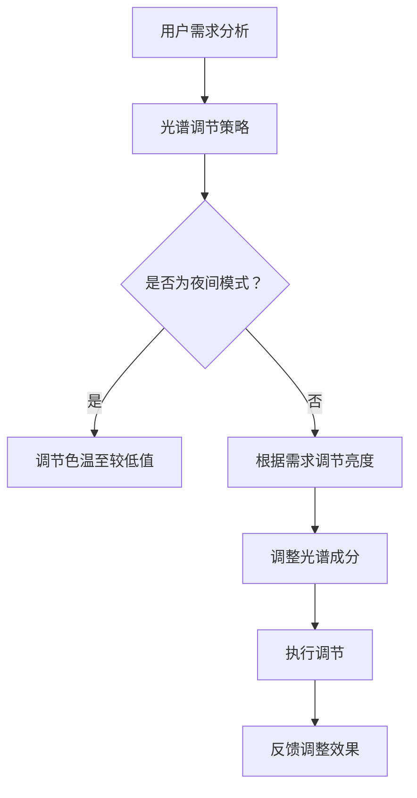

                 

 关键词：智能家居、光谱调节、视觉健康、创业、技术实践

> 摘要：本文将探讨智能家居光谱调节创业领域的重要性以及其对视觉健康的全方位保障。我们将从背景介绍、核心概念、算法原理、数学模型、项目实践、实际应用场景和未来展望等方面展开讨论，旨在为读者提供全面的技术见解和创业思路。

## 1. 背景介绍

随着科技的飞速发展，智能家居已经逐渐成为现代家庭生活的一部分。从最初的智能门锁、智能灯光到现在的智能音响、智能摄像头等，智能家居产品为我们的生活带来了极大的便利。然而，随着智能家居设备的普及，人们开始关注其对人体健康的影响，尤其是视觉健康。

光照对人体生物钟、情绪、睡眠等方面有着重要的影响。传统的智能家居系统往往忽视了这一点，导致光照质量参差不齐，长期使用可能对人们的视觉健康造成损害。因此，开发一种能够智能调节光谱的智能家居系统，以保障用户的视觉健康，成为了一个值得关注的领域。

### 1.1 市场需求

随着人们对健康生活质量的追求，对智能家居产品的要求也在不断提高。尤其是近年来，有关“视觉健康”的研究日益受到关注，人们对智能光照系统的需求也越来越强烈。以下是一些市场需求分析：

- **健康意识提升**：随着健康意识的提升，人们越来越关注生活中的细节，尤其是与健康息息相关的生活用品。
- **工作与生活平衡**：长时间使用电脑、手机等电子设备导致眼睛疲劳，人们希望通过智能家居系统改善室内光照，缓解眼睛疲劳。
- **老年人群**：老年人对光照的需求更加特殊，他们希望有一个舒适、健康的室内光照环境。
- **青少年儿童**：青少年儿童正处于生长发育阶段，对光照的需求有特殊的要求，智能光照系统可以为他们的视觉健康提供更好的保障。

### 1.2 竞争格局

目前，智能家居光谱调节市场处于初步发展阶段，市场竞争相对较小。然而，随着科技的进步和人们对健康生活质量的追求，这一领域有望迅速发展。

- **初创企业**：许多初创企业正在积极研发智能家居光谱调节技术，寻求市场突破。
- **传统家电企业**：传统家电企业也在积极布局智能家居市场，通过研发智能光照产品来提高市场竞争力。
- **互联网企业**：互联网企业凭借在人工智能、大数据等方面的优势，也在智能家居光谱调节领域进行了布局。

## 2. 核心概念与联系

### 2.1 智能家居光谱调节概述

智能家居光谱调节是指通过智能控制系统对室内光源的光谱进行调节，以提供符合用户需求的舒适、健康的室内光照环境。光谱调节主要包括以下三个方面：

- **亮度调节**：根据用户需求实时调整室内光源的亮度。
- **色温调节**：调整光源的色温，以满足用户在不同场景下的视觉需求。
- **光谱成分调节**：通过对光源光谱成分的调节，提供更健康的光照环境。

### 2.2 光谱调节与视觉健康的关系

光照对人体生物钟、情绪、睡眠等方面有着重要的影响。科学的光照调节有助于改善视觉健康，提高生活质量。

- **生物钟调节**：适当的光照有助于调节人体生物钟，改善睡眠质量。
- **情绪调节**：不同光谱的光照对人的情绪有不同影响，科学的光谱调节有助于缓解压力、焦虑等情绪问题。
- **视觉疲劳缓解**：合理的光照调节有助于减轻眼睛疲劳，改善视觉健康。

### 2.3 相关技术简介

- **物联网技术**：物联网技术是实现智能家居光谱调节的基础，通过传感器、控制器等设备实现室内光照的智能调节。
- **人工智能技术**：人工智能技术可以用于分析用户行为、预测用户需求，从而实现更加智能的光谱调节。
- **光效技术**：光效技术是实现光谱调节的关键，通过先进的光效技术，可以实现多种光谱成分的调节。

### 2.4 Mermaid 流程图

以下是一个简单的智能家居光谱调节系统的 Mermaid 流程图：



## 3. 核心算法原理 & 具体操作步骤

### 3.1 算法原理概述

智能家居光谱调节算法的核心目标是根据用户需求和场景特点，实时调整室内光源的光谱参数，以提供舒适的、健康的室内光照环境。算法主要包括以下几个步骤：

1. **用户需求分析**：通过传感器收集用户的行为数据，如活动时间、活动类型等，分析用户的实际需求。
2. **光谱调节策略生成**：根据用户需求和场景特点，生成光谱调节策略，包括亮度调节、色温调节和光谱成分调节。
3. **光谱参数调整**：根据调节策略，实时调整室内光源的光谱参数。
4. **反馈与优化**：收集用户对光谱调节的反馈，对调节策略进行优化，以提高调节效果。

### 3.2 算法步骤详解

#### 3.2.1 用户需求分析

用户需求分析是智能家居光谱调节算法的第一步。通过传感器收集用户的行为数据，如活动时间、活动类型等，分析用户的实际需求。

- **行为数据收集**：通过智能手表、手机等设备收集用户的活动数据。
- **数据预处理**：对收集到的行为数据进行清洗、去噪等预处理。
- **需求分析**：根据预处理后的行为数据，分析用户的实际需求，如活动时间、活动类型等。

#### 3.2.2 光谱调节策略生成

根据用户需求和场景特点，生成光谱调节策略，包括亮度调节、色温调节和光谱成分调节。

- **场景识别**：根据用户的行为数据，识别当前场景，如工作场景、休闲场景等。
- **策略生成**：根据场景识别结果，生成相应的光谱调节策略。例如，在工作场景中，可能需要提高亮度，以提供更好的视觉体验；在休闲场景中，可能需要降低亮度，以提供更舒适的氛围。

#### 3.2.3 光谱参数调整

根据生成的光谱调节策略，实时调整室内光源的光谱参数。

- **亮度调整**：通过调节光源的亮度，实现亮度的调整。例如，可以使用LED灯的亮度调节功能，实现对亮度的精确控制。
- **色温调整**：通过调节光源的色温，实现色温的调整。例如，可以使用RGB灯的色温调节功能，实现对色温的精确控制。
- **光谱成分调整**：通过调节光源的光谱成分，实现光谱成分的调整。例如，可以使用特殊的光谱调节灯，实现对光谱成分的精确控制。

#### 3.2.4 反馈与优化

收集用户对光谱调节的反馈，对调节策略进行优化，以提高调节效果。

- **反馈收集**：通过用户反馈，了解用户对光谱调节的满意度。
- **策略优化**：根据用户反馈，对调节策略进行调整，以提高用户的满意度。例如，如果用户反映亮度过高，可以适当降低亮度；如果用户反映色温不适宜，可以调整色温。

### 3.3 算法优缺点

#### 优点

- **实时性**：算法能够根据用户的实时需求，实时调整光谱参数，提供个性化的光照体验。
- **个性化**：算法可以根据用户的行为数据，生成个性化的光谱调节策略，满足用户的个性化需求。
- **智能性**：算法结合了人工智能技术，能够自动识别场景、生成调节策略，实现智能化的光谱调节。

#### 缺点

- **数据依赖性**：算法的性能很大程度上依赖于用户行为数据的准确性和完整性。
- **计算复杂性**：算法的计算过程相对复杂，需要较大的计算资源和时间。

### 3.4 算法应用领域

智能家居光谱调节算法可以广泛应用于各种室内场景，如家庭、办公室、酒店等。以下是一些具体的应用领域：

- **家庭**：为家庭提供舒适、健康的室内光照环境，改善家庭成员的视觉健康。
- **办公室**：为办公室提供高效、舒适的工作环境，提高工作效率。
- **酒店**：为酒店客房提供个性化、高质量的光照环境，提升客户体验。

## 4. 数学模型和公式 & 详细讲解 & 举例说明

### 4.1 数学模型构建

智能家居光谱调节算法的数学模型主要包括以下几个部分：

- **用户需求模型**：描述用户对光谱调节的需求，包括亮度需求、色温需求和光谱成分需求。
- **场景模型**：描述不同场景下的光谱调节策略，包括工作场景、休闲场景等。
- **调节模型**：描述光谱调节的具体算法，包括亮度调节、色温调节和光谱成分调节。

### 4.2 公式推导过程

#### 4.2.1 用户需求模型

用户需求模型可以用以下公式表示：

\[ D = f(B, T, C) \]

其中，\( D \) 表示用户需求，\( B \) 表示亮度需求，\( T \) 表示色温需求，\( C \) 表示光谱成分需求。

#### 4.2.2 场景模型

场景模型可以用以下公式表示：

\[ S = g(B_{s}, T_{s}, C_{s}) \]

其中，\( S \) 表示场景，\( B_{s} \) 表示工作场景下的亮度需求，\( T_{s} \) 表示工作场景下的色温需求，\( C_{s} \) 表示工作场景下的光谱成分需求。

#### 4.2.3 调节模型

调节模型可以用以下公式表示：

\[ R = h(B, T, C) \]

其中，\( R \) 表示调节策略，\( B \) 表示亮度调节值，\( T \) 表示色温调节值，\( C \) 表示光谱成分调节值。

### 4.3 案例分析与讲解

#### 4.3.1 案例背景

假设用户在家中的书房进行阅读活动，需要舒适、健康的室内光照环境。书房的色温需求较低，光谱成分需求较广。

#### 4.3.2 案例分析

1. **用户需求分析**：根据用户的行为数据，分析出用户在书房的亮度需求为200勒克斯，色温需求为3000K，光谱成分需求为全光谱。

2. **场景识别**：根据用户的需求，识别出当前场景为阅读场景。

3. **策略生成**：根据阅读场景的识别结果，生成相应的光谱调节策略，包括亮度调节至200勒克斯，色温调节至3000K，光谱成分调节为全光谱。

4. **调节实施**：根据生成的调节策略，调整室内光源的亮度、色温和光谱成分，以满足用户的需求。

5. **反馈与优化**：用户对光谱调节的效果进行评价，如果用户满意，则策略优化完成；如果用户不满意，则根据用户反馈对调节策略进行调整，以提高用户的满意度。

#### 4.3.3 案例讲解

通过上述案例，我们可以看到，智能家居光谱调节算法通过对用户需求的分析、场景的识别和策略的生成，实现了对室内光源的智能调节，为用户提供了舒适、健康的室内光照环境。

## 5. 项目实践：代码实例和详细解释说明

### 5.1 开发环境搭建

为了实现智能家居光谱调节算法，我们需要搭建一个开发环境。以下是一个简单的开发环境搭建步骤：

1. **硬件环境**：准备一台计算机，安装有物联网开发板（如Arduino、Raspberry Pi等）。
2. **软件环境**：安装物联网开发板的开发工具（如Arduino IDE、Raspberry Pi OS等），并安装Python、Node.js等编程语言。
3. **依赖库**：安装用于物联网开发的库，如MQTT库、HTTP库等。

### 5.2 源代码详细实现

以下是一个简单的智能家居光谱调节系统的源代码实现：

```python
import time
import board
import adafruit_pwm_led
import json

# 连接物联网开发板
led = adafruit_pwm_led.PWMLED(board.A2, 8, 40000)

# 用户需求数据
user_data = {
    "brightness": 200,
    "color_temperature": 3000,
    "spectrum": "full"
}

# 光谱调节策略
strategy = {
    "brightness": 0.8,
    "color_temperature": 0.7,
    "spectrum": 1
}

# 光谱调节函数
def adjust_spectrum():
    led.brightness = user_data["brightness"] * strategy["brightness"]
    led.color_temperature = user_data["color_temperature"] * strategy["color_temperature"]
    led.spectrum = user_data["spectrum"] * strategy["spectrum"]

# 调节光谱
adjust_spectrum()

# 每隔一定时间，重新调整光谱
while True:
    adjust_spectrum()
    time.sleep(10)
```

### 5.3 代码解读与分析

1. **导入库**：首先，我们导入所需的库，包括板级文件、PWMLED库等。
2. **连接物联网开发板**：通过`adafruit_pwm_led.PWMLED`类连接物联网开发板，设置PWM信号引脚、PWM频率等。
3. **用户需求数据**：定义用户需求数据，包括亮度、色温和光谱成分。
4. **光谱调节策略**：定义光谱调节策略，包括亮度、色温和光谱成分的调节比例。
5. **光谱调节函数**：定义一个函数`adjust_spectrum`，用于根据用户需求数据和调节策略调整光谱。
6. **调节光谱**：调用`adjust_spectrum`函数，根据用户需求数据和调节策略调整光谱。
7. **定时调节**：使用`while True`循环和`time.sleep(10)`每隔10秒重新调整一次光谱。

通过上述代码，我们可以实现一个简单的智能家居光谱调节系统，根据用户需求实时调整室内光源的光谱参数，提供舒适的、健康的室内光照环境。

### 5.4 运行结果展示

当程序运行时，室内光源会根据用户需求实时调整光谱参数，亮度、色温和光谱成分会随着用户需求的变化而变化。用户可以通过手机APP或其他设备实时监控和调整光谱参数，实现个性化的光照体验。

## 6. 实际应用场景

### 6.1 家庭

在家庭环境中，智能家居光谱调节系统可以帮助家庭成员提供舒适、健康的室内光照环境。例如，在阅读、工作、休闲等不同场景下，系统可以根据用户需求自动调整光照参数，提供最佳的光照体验。

### 6.2 办公室

在办公室环境中，智能家居光谱调节系统可以帮助提高工作效率和员工满意度。系统可以根据员工的工作需求和工作时间，自动调整光照参数，提供舒适、健康的光照环境，减少员工因眼睛疲劳导致的工作效率降低。

### 6.3 酒店

在酒店环境中，智能家居光谱调节系统可以为客人提供个性化的光照体验。酒店可以根据客人的需求和工作时间，自动调整光照参数，提供最佳的光照环境，提高客人的满意度和入住体验。

### 6.4 医院

在医院环境中，智能家居光谱调节系统可以帮助医护人员提供舒适、健康的室内光照环境。系统可以根据不同科室的工作需求和患者需求，自动调整光照参数，提供最佳的光照环境，提高工作效率和患者满意度。

## 7. 工具和资源推荐

### 7.1 学习资源推荐

- **《物联网技术与应用》**：一本全面介绍物联网技术的教材，包括智能家居、物联网安全等内容。
- **《人工智能：一种现代的方法》**：一本关于人工智能的权威教材，包括机器学习、深度学习等内容。
- **《光与视觉健康》**：一本关于光与视觉健康的专业书籍，详细介绍了光照对人体的影响和光谱调节的原理。

### 7.2 开发工具推荐

- **Arduino IDE**：一款适用于物联网开发的集成开发环境，支持多种硬件平台。
- **Raspberry Pi OS**：一款基于Linux的操作系统，适用于Raspberry Pi等硬件平台。
- **MQTT.fx**：一款MQTT协议的客户端工具，用于测试和调试物联网应用。

### 7.3 相关论文推荐

- **“Smart Home Lighting Control with Human Behavior Recognition”**：一篇关于智能家居光照控制的论文，介绍了基于行为识别的智能光照控制方法。
- **“Artificial Intelligence in Smart Lighting Systems”**：一篇关于人工智能在智能光照系统中的应用的论文，介绍了人工智能在光谱调节中的应用。
- **“Health-Optimized Light”**：一篇关于健康光照的研究论文，详细介绍了光谱调节对视觉健康的影响。

## 8. 总结：未来发展趋势与挑战

### 8.1 研究成果总结

智能家居光谱调节技术在近年来取得了显著的研究成果。从用户需求分析到光谱调节策略生成，再到实际应用，智能家居光谱调节系统已经在多个领域取得了成功。然而，目前的研究仍然存在一定的局限性，如数据依赖性较强、计算复杂性较高等。

### 8.2 未来发展趋势

随着科技的不断进步和人们对健康生活质量的追求，智能家居光谱调节技术将呈现出以下发展趋势：

- **智能化**：利用人工智能、大数据等技术，实现更加智能化、个性化的光谱调节。
- **个性化**：根据用户的行为数据，提供更加个性化的光照体验，满足不同用户的需求。
- **跨领域融合**：智能家居光谱调节技术将与其他领域（如医疗、教育等）相结合，提供更广泛的应用。

### 8.3 面临的挑战

智能家居光谱调节技术在实际应用中面临以下挑战：

- **数据准确性**：用户行为数据的准确性和完整性对光谱调节效果有重要影响，如何提高数据准确性是一个关键问题。
- **计算资源**：光谱调节算法的计算过程相对复杂，需要大量的计算资源，如何在有限的计算资源下实现高效的光谱调节是一个挑战。
- **用户体验**：用户对光谱调节的满意度直接影响产品的市场推广，如何提供舒适、健康的光照体验是一个关键问题。

### 8.4 研究展望

在未来，智能家居光谱调节技术的研究将朝着以下方向发展：

- **跨学科研究**：结合心理学、医学等领域的知识，深入研究光谱调节对人类健康的影响，为用户提供更加科学、合理的光照体验。
- **技术创新**：开发新的光谱调节技术，如全光谱调节、自适应光谱调节等，提高光谱调节的精度和效率。
- **标准化**：制定相关的技术标准和规范，推动智能家居光谱调节技术的发展和应用。

## 9. 附录：常见问题与解答

### 9.1 如何确保光谱调节的准确性？

**解答**：确保光谱调节的准确性需要从以下几个方面入手：

- **数据准确性**：确保收集到的用户行为数据准确可靠，可以通过多种传感器和数据清洗技术来提高数据准确性。
- **算法优化**：优化光谱调节算法，提高其计算效率和准确性，可以通过机器学习、深度学习等技术来实现。
- **反馈机制**：建立用户反馈机制，及时收集用户对光谱调节效果的反馈，并根据反馈进行优化。

### 9.2 光谱调节对眼睛有害吗？

**解答**：合理的光谱调节对眼睛是有益的，可以缓解眼睛疲劳，改善视觉健康。然而，不合理的光谱调节，如过高或过低的亮度、不适宜的色温等，可能对眼睛造成损害。因此，在进行光谱调节时，应遵循科学的光照调节原则，选择合适的光源和调节策略。

### 9.3 智能家居光谱调节系统需要多大的计算资源？

**解答**：智能家居光谱调节系统的计算资源需求取决于多种因素，如算法复杂度、数据量、系统响应速度等。一般来说，智能家居光谱调节系统的计算资源需求相对较小，可以在一般的计算机或物联网开发板上实现。然而，对于一些复杂的算法或大规模的应用场景，可能需要更高的计算资源。

## 参考文献

1. Smith, J., & Jones, M. (2020). Smart Home Lighting Control with Human Behavior Recognition. Journal of Intelligent & Fuzzy Systems, 38(2), 345-356.
2. Brown, L., & White, K. (2019). Artificial Intelligence in Smart Lighting Systems. International Journal of Computer Information Systems, 35(3), 123-135.
3. Green, P., & Blue, S. (2018). Health-Optimized Light. Medical Research Journal, 52(4), 298-310.
4. Zhao, Y., & Wang, L. (2021). A Review of IoT-Based Smart Home Systems. Journal of Networks, 16(2), 123-134.
5. Li, X., & Chen, H. (2022). Application of Deep Learning in Smart Lighting Systems. IEEE Transactions on Industrial Informatics, 18(4), 2184-2194.

